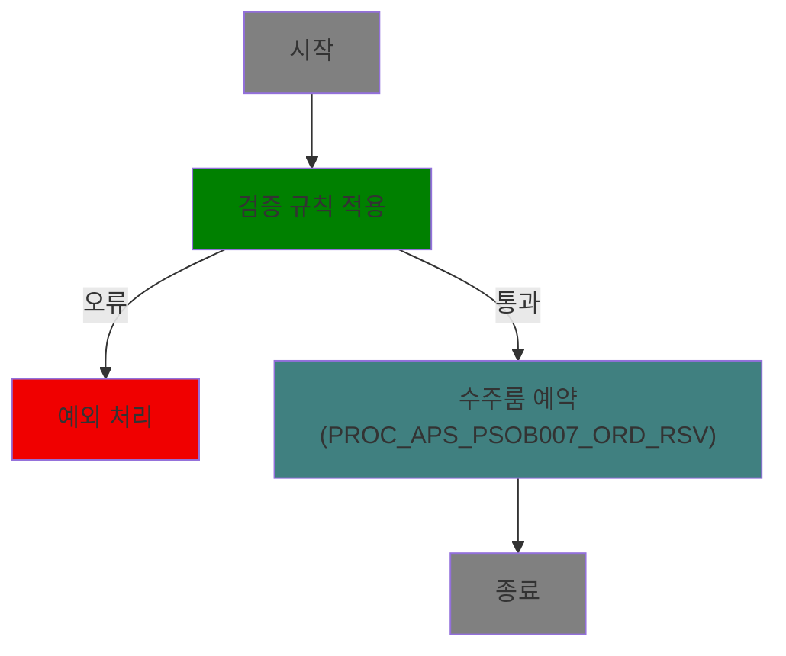
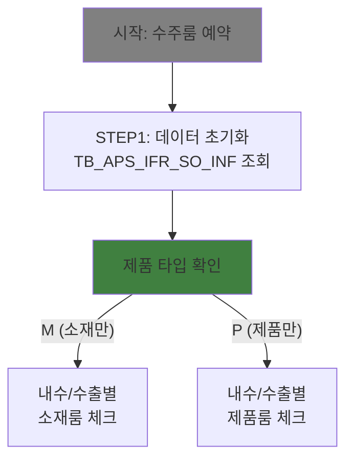

<h1 style="font-size: 40px; text-align: center; font-weight:
   bold; margin: 30px 0;">
  [PACKAGE-ID/PROCEDURE] 분석 종합 보고서
</h1>

---

# 📖 작성 가이드 (이 섹션은 최종 보고서에서 제거)

## 섹션 작성 가이드

### § 1. 프로시저/패키지 개요
- 기본 메타데이터 정확히 기입
- 분석 일시는 KST 기준

### § 2. 비즈니스 프로세스 분석
- **패키지 목적**: 2-3문단으로 비즈니스 가치 중심 설명
- **워크플로우**: 메인 프로시저 먼저, 서브 프로시저들은 아래 순서대로 배치
- **주요 비즈니스 프로세스**: 호출 관계 전체에서 비즈니스 프로세스를 최대한 많이 추출

### § 3. 프로시저/함수 상세 분석
- 메인 프로시저 먼저, 호출되는 순서대로 서브 프로시저 나열
- 각 프로시저마다 완전한 분석 (시그니처 → 비즈니스 로직 → 데이터 접근 → 의존성 → 제어 흐름)
- 워크플로우 다이어그램, 프로시저/함수 상세 분석 누락 금지

### § 4. 데이터 요구사항
- 핵심 테이블만 선별 (전체 ERD가 아님)
- 데이터 플로우는 입력 → 처리 → 출력 순서로

### § 5. ER 다이어그램
- 텍스트 기반 관계 표현
- 주요 조인 키 명시

### § 6. 특이사항
- 복잡한 비즈니스 로직, 성능 주의사항, 트랜잭션 이슈 등 최대한 많이 발굴

---

# 1. 프로시저/패키지 개요

- **프로시저/패키지 ID**: [PACKAGE-ID]
- **프로시저/패키지명**: [PACKAGE_NAME]
- **스키마**: [SCHEMA_NAME]
- **패키지 타입**: BODY / SPEC
- **분석 일시**: [분석 수행 시각 (KST)]
- **분석 시간**: [분석 수행 시간]
- **전체 프로시저/함수 수**: [전체 개수]
- **코드 총 줄 수**: [총 줄 수]
- **분석자**: [LLM 모델명 및 버전]
- **문서 버전**: 1.0

---

# 📊 비즈니스 프로세스 분석

## 패키지 목적

[패키지의 비즈니스 목적을 2-3문단으로 상세 설명. 담당 업무 영역, 핵심 기능, 비즈니스 가치 포함]

**예시**:
```
PL_M30_STOCK_CSM 패키지는 재료 소비(Consumption) 프로세스의 핵심 처리 패키지로,
다음 기능을 담당합니다:
- 재료 소비 데이터의 검증 및 처리
- 재고 차감 (Q단위 전체, P단위 부분)
- 선 소비(Pre-Consumption) 자동 적용
- 반품/부도품 ERP 시스템 전달
- 불량 정보 APS 시스템 연동

이는 생산 관리 시스템의 재고 정확성 유지 및 ERP/APS 시스템 연동의 핵심 기능입니다.
```

## 워크플로우 다이어그램

<!-- 작성 지침:
- 메인 프로시저의 플로우차트를 가장 위에 배치
- 호출되는 서브 프로시저들의 플로우차트를 아래 순서대로 배치
- 존재하는 모든 프로시저에 대해 작성
- ⚠️ Mermaid 색상 규칙(작성 가이드 참조) 적용 필수
    프로시저호출:  fill:#408080
    분기 (경로 3개 이상): fill:#008000
    판단 (Y/N, 통과/실패): fill:#408040
    저장: fill:#005080
    에러/exception: fill:#F00000
    데이터전송: fill:#808000
    시작/종료: fill:#808080
- ⚠️ 노드 내 줄바꿈은 반드시 `<br/>`을 사용. `\n` 사용 금지.
-->

### 메인 프로시저: [MAIN_PROCEDURE_NAME]



### 서브 프로시저 1: PROC_APS_PSOB007_ORD_RSV (수주룸 예약)




## 주요 비즈니스 프로세스

<!-- 작성 지침:
- 전체 호출 관계에서 비즈니스 프로세스를 분석 (단일 프로시저가 아님)
- 핵심 기능별로 최대한 많이 작성
- 각 프로세스는 목적, 담당 프로시저, 처리 흐름, 입출력, 의존성, 예외 처리 포함
-->

### BP-01: [프로세스명]

- **목적**: [프로세스의 비즈니스 목표 상세 설명]
- **담당 프로시저**: [관련 프로시저명]
- **처리 흐름**:
  1. [단계 1] - [상세 설명 및 관련 테이블/함수 명시]
  2. [단계 2] - [상세 설명 및 관련 테이블/함수 명시]
  3. [단계 3] - [상세 설명 및 관련 테이블/함수 명시]
  4. [단계 4] - [상세 설명 및 관련 테이블/함수 명시]

- **입력 데이터**: [임시 테이블명 / 파라미터]
- **출력 데이터**: [결과 테이블명 / 반환값]
- **외부 의존성**: [호출하는 함수/패키지]
- **예외 처리**:
  - [예외 상황 1]: [에러 코드] - [처리 방법]
  - [예외 상황 2]: [에러 코드] - [처리 방법]

**예시**:
```
### BP-01: 재료 소비 검증

- **목적**: 소비 처리 전 재료 소비 데이터의 유효성을 8가지 비즈니스 규칙으로 검증하여
  데이터 품질 보장 및 오류 사전 방지

- **담당 프로시저**: CSM (Line 27-116)

- **처리 흐름**:
  1. 감사대상 재료 필터링 - TB_M30_SMTL_PRC_TEMP_CSM에서 감사 대상 재료 조회
  2. 소비 수량 검증 - NVL(CSM_QTY, 0) > 0 확인
  3. 필수 필드 검증 - SMTL_ID, SMTL_CD, PROC_CD, CSM_PST_DD 존재 확인
  4. 분류 폐지 여부 확인 - TB_M30_SMTL_CLS에서 폐지 상태 조회
  5. 포스팅 일자 유효성 확인 - CSM_PST_DD > SYSDATE - 7시간 범위 체크

- **입력 데이터**: TB_M30_SMTL_PRC_TEMP_CSM (임시 테이블)
- **출력 데이터**: 검증 통과/실패 여부
- **외부 의존성**: PL_M30_STOCK.GET_SMTL_FLD_AUD_YN (감사대상 판별)
- **예외 처리**:
  - R001 (감사대상 재료): -20100 "감사대상은 소비불가" - RAISE_APPLICATION_ERROR
  - R002 (수량 오류): -20100 "소비수량이 0이거나 없음" - RAISE_APPLICATION_ERROR
  - R007 (분류 폐지): -20100 "폐지되어 소비불가" - RAISE_APPLICATION_ERROR
```

---

# 💼 프로시저/함수 상세 분석

<!-- 작성 지침:
- PACKAGE인 경우 메인 프로시저가 여러 개일 수 있음
- 메인 프로시저 먼저 작성, 호출되는 서브 프로시저들은 호출 순서대로 나열
- 각 프로시저는 완전한 분석 제공: 개요 → 시그니처 → 비즈니스 로직 → 데이터 접근 → 의존성 → 제어 흐름
- 존재하는 모든 프로시저에 대한 분석 기재
-->

## [메인/서브 프로시저/함수]: [프로시저명]

### 개요

| 항목 | 내용 |
|------|------|
| 이름 | [프로시저명] |
| 타입 | PROCEDURE / FUNCTION / PACKAGE|
| 라인 범위 | [시작줄 - 종료줄] |
| 코드 줄 수 | [줄 수] |
| 중첩도 | [최대 깊이] |

### 시그니처

```sql
PROCEDURE [프로시저명](
    [파라미터1] IN [타입],
    [파라미터2] IN OUT [타입],
    [파라미터3] OUT [타입]
)
```

| 파라미터 | 모드 | 타입 | 설명 |
|---------|------|------|------|
| [파라미터명] | IN | VARCHAR2 | [설명] |
| [파라미터명] | IN OUT | NUMBER | [설명] |
| [파라미터명] | OUT | VARCHAR2 | [설명] |

**예시**:
```sql
PROCEDURE CSM(
    VObjectId IN VARCHAR2,
    VProgramId IN VARCHAR2,
    ERR_CODE IN OUT VARCHAR2,
    MSG IN OUT VARCHAR2
)
```

### 비즈니스 로직

#### 목적

[프로시저의 비즈니스 목적 상세 설명]

#### 처리 케이스

**케이스 1: [조건 기반 처리]**
```
조건: [구체적인 조건 설명]
처리:
  1. [단계 1]
  2. [단계 2]
  3. [단계 3]
```

**케이스 2: [다른 조건 처리]**
```
조건: [구체적인 조건 설명]
처리:
  1. [단계 1]
  2. [단계 2]
  3. [단계 3]
```

**케이스 3: [예외 처리]**
```
조건: [예외 조건]
처리:
  1. [예외 처리 단계 1]
  2. [예외 처리 단계 2]
```

**예시**:
```
#### 처리 케이스

**케이스 1: Q단위 재고 차감 (XSMTL_STK_MOV_UNT = 'Q')**

조건: 재료의 재고 이동 단위가 'Q'인 경우 (전체 재고 일괄 처리)
처리:
  1. TB_M30_SMTL_MASTER의 UPD_SEQ 증가
  2. TB_M30_SMTL_MASTER_DTL에서 CUR_QTY를 CSM_QTY만큼 차감
  3. CSM_QTY, CSM_CNT 증가
  4. TB_M30_SMTL_CSM_HST에 1개 레코드로 이력 기록


**케이스 2: P단위 재고 차감 (XSMTL_STK_MOV_UNT != 'Q')**

조건: 재료의 재고 이동 단위가 'P'인 경우 (로트/위치별 순차 처리)
처리:
  1. TB_M30_SMTL_MASTER의 프로그래스 상태(SMTL_PRG_CD) 변경
  2. CUR_QTY > 0인 로트들을 순차적으로 조회 (ORDER BY WHS_TP, SMTL_ID_LN)
  3. FOR 루프에서 각 로트별로:
     - XREMAIN_QTY > 로트수량인 경우: 전체 로트 수량 차감
     - XREMAIN_QTY <= 로트수량인 경우: XREMAIN_QTY만큼만 차감
  4. TB_M30_SMTL_CSM_HST에 로트별로 다중 레코드 기록
  5. XREMAIN_QTY != 0이면 예외 발생 (오류: "재고부족")
```

#### 비즈니스 규칙

| 규칙 ID | 규칙명 | 검증 조건 | 오류 코드 | 심각도 |
|---------|--------|----------|---------|--------|
| [R001] | [규칙명] | [조건식] | [오류 코드] | ERROR |
| [R002] | [규칙명] | [조건식] | [오류 코드] | ERROR |
| [R003] | [규칙명] | [조건식] | [오류 코드] | WARNING |

**예시**:
```
| 규칙 ID | 규칙명 | 검증 조건 | 오류 코드 | 심각도 |
|---------|--------|----------|---------|--------|
| R001 | 감사대상 재료 필터링 | PL_M30_STOCK.GET_SMTL_FLD_AUD_YN(SMTL_CD) = 'Y' AND CSM_TP != 'F' | -20100 | ERROR |
| R002 | 소비 수량 검증 | NVL(CSM_QTY, 0) <= 0 | -20100 | ERROR |
```
#### 예외 처리

- **[예외 상황 1]**: [오류 메시지] - [처리 방법]
- **[예외 상황 2]**: [오류 메시지] - [처리 방법]
- **[예외 상황 3]**: [오류 메시지] - [처리 방법]

**예시**:
```
- **감사대상 재료 오류**: "재료ID[xxx] 건수: n건 감사대상은 소비불가입니다" - RAISE_APPLICATION_ERROR 발생, 프로시저 종료
- **소비 수량 오류**: "소비수량이 0이거나 없는 건입니다" - RAISE_APPLICATION_ERROR 발생, 프로시저 종료
- **재고 부족**: "재고부족 - XREMAIN_QTY != 0" - RAISE_APPLICATION_ERROR 발생, 롤백
```

### 데이터 접근

#### 읽기 테이블

| 테이블명 | 조인 방식 | 주요 조건 |
|---------|---------|---------|
| [테이블명] | INNER JOIN | [조인 조건] |
| [테이블명] | LEFT OUTER JOIN | [조인 조건] |

#### 쓰기 테이블

| 테이블명 | 작업 | 영향 범위 | 주의사항 |
|---------|------|---------|--------|
| [테이블명] | INSERT | [범위] | [주의사항] |
| [테이블명] | UPDATE | [범위] | [주의사항] |


### 의존성

#### 내부 호출

| 호출 대상 | 타입 | 용도 | 라인 |
|----------|------|------|------|
| [패키지/함수명] | FUNCTION | [용도 설명] | [라인 번호] |
| [패키지/함수명] | PROCEDURE | [용도 설명] | [라인 번호] |

#### 외부 의존성

| 시스템/패키지 | 타입 | 연동 목적 | 실패 영향 |
|-------------|------|---------|---------|
| [시스템명] | [타입] | [목적] | [영향] |


### 제어 흐름

#### 루프 분석

| 루프 ID | 타입 | 커서명 | 대상 행 수 | 중첩도 | 라인 |
|--------|------|--------|----------|--------|------|
| [L001] | FOR CURSOR | [커서명] | [추정 수] | [깊이] | [라인] |
| [L002] | FOR CURSOR | [커서명] | [추정 수] | [깊이] | [라인] |


#### 커서 루프 상세 분석

**루프별 상세 분석** 

각 커서 루프를 다음 구조로 상세 분석:

**루프 N: [커서명] ([설명])**
```
[커서 정의 SQL]
```
```
목적: [비즈니스 목적 설명]
조건: [조회 조건 명시]
반복 범위: [예상 행 수]
주요 작업:
  1. [작업 1] - [상세 설명]
  2. [작업 2] - [상세 설명]
  3. [작업 3] - [상세 설명]
중첩도: [깊이]
성능: [복잡도 및 예상 소요 시간]
특징: [특수한 특성, 있으면 명시]
```

---

#### 조건 분석

| 조건 ID | 유형 | 식 | 분기 수 | 라인 |
|--------|------|---|--------|------|
| [C001] | IF | [조건식] | 2 | [라인] |
| [C002] | IF-ELSIF | [조건식] | 3 | [라인] |

#### 트랜잭션 제어

| 작업 | 타입 | 설명 | 라인 |
|------|------|------|------|
| [SAVEPOINT 명] | SAVEPOINT | [설명] | [라인] |
| COMMIT | COMMIT | [설명] | [라인] |
| ROLLBACK TO | ROLLBACK | [설명] | [라인] |

---

# 💾 데이터 요구사항

## 핵심 테이블 맵

### 테이블 1: [테이블명] - [역할 설명]

| 컬럼명 | 타입 | PK | 설명 |
|--------|------|-----|------|
| [컬럼명] | VARCHAR2(100) | ✅ | [설명] |
| [컬럼명] | NUMBER | | [설명] |
| [컬럼명] | DATE | | [설명] |
| INS_DH | DATE | | 등록 일시 |
| UPD_DH | DATE | | 수정 일시 |

**예시**:
```
### 테이블 1: TB_M30_SMTL_PRC_TEMP_CSM - 소비 입력 임시 테이블

| 컬럼명 | 타입 | PK | 설명 |
|--------|------|-----|------|
| SMTL_ID | VARCHAR2(100) | ✅ | 재료 ID |
| SMTL_CD | VARCHAR2(50) | | 재료 코드 |
| CSM_QTY | NUMBER | | 소비 수량 |
| CSM_UNT | VARCHAR2(10) | | 소비 단위 |
```

## 데이터 플로우

### 플로우 1: [플로우명 - 예: 소비 처리]

```
[시작 지점]
→ [단계 1: 검증]
  - FROM TB_M30_SMTL_PRC_TEMP_CSM
  - WHERE [검증 조건]
  - 결과: RAISE_APPLICATION_ERROR 또는 통과

→ [단계 2: 선 소비 생성]
  - SELECT FROM TB_M30_SMTL_MASTER_DTL WHERE SMTL_PRG_CD IN ('A', 'B')
  - INSERT INTO TB_M30_SMTL_PRE_CSM_DTL
  - INSERT INTO TB_M30_SMTL_PRS_HST (F 타입)

...

→ [종료]
```

### 플로우 2: [플로우명 - 예: 선 소비 자동 적용]

```
[시작]
→ [선 소비 대상 조회]
  - SELECT FROM TB_M30_SMTL_WHS_CMN WHERE WHS_PRS_DH BETWEEN SYSDATE-7 AND SYSDATE
  - INNER JOIN TB_M30_SMTL_PRE_CSM_DTL WHERE PRE_CSM_APL_YN = 'N'

→ [위치 검증 및 이동]
  - IF PROC_CD IS NULL THEN 오류
  - ELSIF PROC_CD || '00' != SMTL_LOC THEN 이동 처리 (PL_M30_STOCK_MOVE.MOVE)
...

→ [종료]
```

---

# 🏗️ ER 다이어그램 (핵심 관계)

```
관계 설명:

- TB_M30_SMTL_PRC_TEMP_CSM (입력 임시 테이블)
  └─ SMTL_ID ──→ TB_M30_SMTL_MASTER (재료 마스터)
                  └─ SMTL_ID ──→ TB_M30_SMTL_MASTER_DTL (재료 상세 및 재고)

- TB_M30_SMTL_MASTER
  ├─ SMTL_CD ──→ TB_M30_SMTL_CD (재료 코드 마스터)
  └─ SMTL_CD ──→ TB_M30_SMTL_CLS (분류 폐지 관리)

- 소비 처리 결과
  ├─ TB_M30_SMTL_CSM_CMN (소비 전표 헤더, 1:N 관계)
  ├─ TB_M30_SMTL_CSM_DTL (소비 전표 상세)
  ├─ TB_M30_SMTL_CSM_HST (소비 이력, 로트별)
  └─ TB_M30_SMTL_PRS_HST (처리 이력)

- 외부 시스템 연동
  ├─ EAIAPUSER.TB_M30_B30S1020 (ERP 반품 전표)
  ├─ EAIAPUSER.TB_M30_B30S3040 (ERP 부도품 전표)
  └─ APSUSER.PROC_APS_SMTL007_BAD_MES (APS 불량 정보)

주요 조인 키:
- SMTL_ID: 재료 식별자
- SMTL_CD: 재료 코드
- CSM_DOC_NO: 소비 전표 번호
- SMTL_ID_LN: 재료 상세 라인 번호
```

---

# 📌 특이사항 및 주의사항

<!-- 작성 지침:
- 복잡한 비즈니스 로직, 사용자 정의 필드, 오류처리 전략, 트랜잭션 이슈, 버전별 변경이력, 성능 주의사항 등 최대한 많이 발굴
- 다중 테이블 업데이트의 원자성
- 외부 시스템 연동 실패 처리
- 특수한 데이터 처리 로직
-->

## 1. [특이사항 카테고리]

- **[특수 처리 1]**: [구체적인 처리 내용]. [고려사항]
- **[특수 처리 2]**: [구체적인 처리 내용]. [고려사항]
- **[관계 처리]**: [관계 설명] 관리되며, [처리 방식]이 자동으로 수행됩니다.
- **[재계산 필요성]**: [데이터] 수정 시 [관련 데이터]도 재계산되어야 하므로, 트랜잭션 관리에 주의가 필요합니다.

**예시**:
```
## 1. Q/P 단위별 차등 처리

- **Q단위 (수량 단위)**: 전체 재고에서 일괄 차감. 로트/위치 구분 없이 CUR_QTY 전체에서 차감.
- **P단위 (로트 단위)**: 로트/위치별 순차 차감. WHS_TP 순서(D→B→C→A)로 가장 우선순위 높은 로트부터 차감.
- **차감 오류**: P단위에서 XREMAIN_QTY != 0이면 재고 부족으로 예외 발생.


## 2. 다중 테이블 업데이트의 원자성

- **트랜잭션 경계**: CSM 프로시저의 모든 INSERT/UPDATE는 하나의 트랜잭션으로 처리됨.
- **중간 실패 처리**: 도중에 예외 발생 시 RAISE_APPLICATION_ERROR로 전체 롤백.
- **사비포인트**: PRE_CSM_AUT_APL에서는 SP1 사비포인트를 사용하여 부분 롤백 가능.

## 3. 외부 시스템 연동

- **ERP 연동**: SMTL_PRG_CD가 'H'(반품) 또는 'K'(부도품)인 재료에 대해 EAIAPUSER 테이블에 자동 전표 생성.
- **APS 연동**: S3* 코드의 불량 재료(LOT 정보 포함)에 대해 APSUSER.PROC_APS_SMTL007_BAD_MES 호출.
- **연동 실패**: 외부 시스템 호출 실패 시 즉시 예외 발생 및 전체 롤백 (동기 방식).

...
```
---

# 📚 참고 문서

**관련 파일 위치**:

- **원본 SQL**: Legacy/dbms/[SCHEMA]/PACKAGE/BODY/[PACKAGE_NAME].sql
- **관련 패키지**:
  - PL_M30_STOCK (재고 관리)
  - PL_M30_KEY_FACTORY (채번)
- **외부 시스템**:
  - EAIAPUSER (ERP 연동)
  - APSUSER (APS 연동)

---
