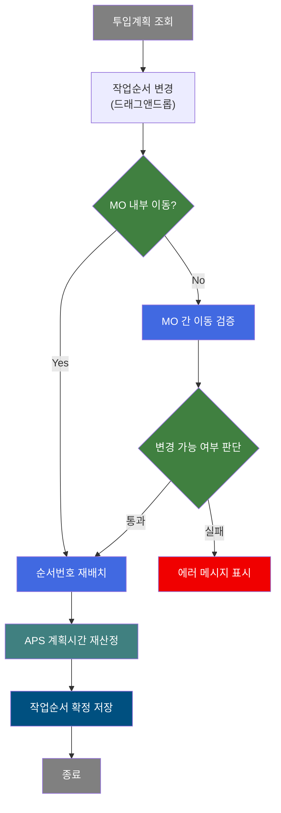
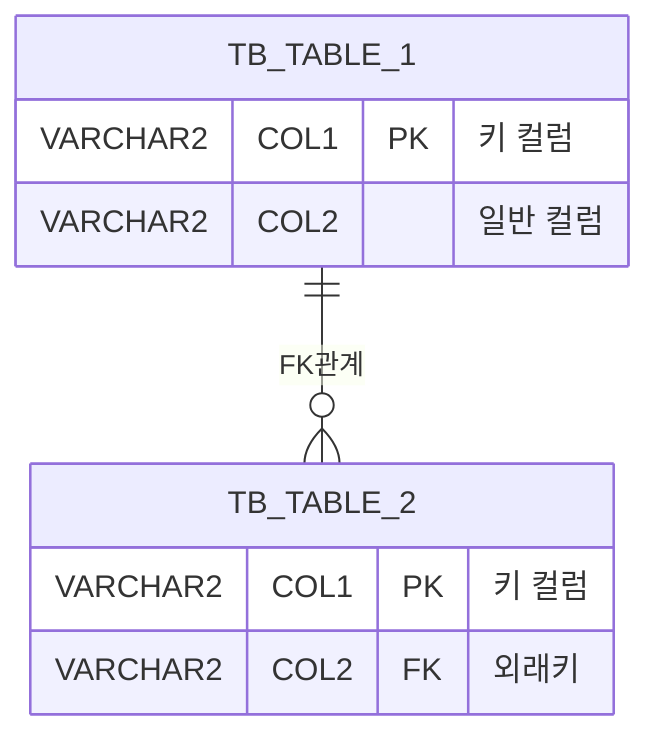

<h1 style="font-size: 40px; text-align: center; font-weight:
   bold; margin: 30px 0;">
  [PACKAGE-ID/PROCEDURE] 레거시 시스템 분석 종합 보고서
</h1>


# 1. 시스템 개요
- **서비스 ID**: [SERVICE-ID]
- **업무명**: [업무명]
- **분석 일시**: [분석 수행 시각 (KST)]
- **분석 시간**: [분석 수행 시간]
- **전체 Activity 수**: [전체 Activity 수]
- **분석자**: [LLM 모델명 및 버전]
- **분석 도구**: [command 명령어]
- **문서 버전**: 1.0

# 📊 비즈니스 프로세스 분석

## 시스템 목적

[시스템의 비즈니스 목적을 2-3문단으로 상세 설명. 실제 M472020014 예시 참조]


## 핵심 워크플로우 다이어그램

<!-- ⚠️ 생략 조건: Custom Activity 0개 + SELECT 쿼리만 사용 + 단순 조회 체인이면 이 섹션 전체 생략 -->
<!-- 작성 지침:
- **비즈니스 프로세스 흐름**을 표현 (기술적 Activity 체인이 아님)
- 업무 담당자(오퍼레이터, 관리자)가 이해할 수 있는 업무 단위로 노드 구성
- UI 초기화, 콤보 로드, Grid 표시 등 기술적 단계는 포함하지 않음
- 분기는 비즈니스 판단 기준으로 표현
-->


### 상세 워크플로우 다이어그램
<!-- ⚠️ 생략 조건: 핵심 워크플로우와 동일 조건 -->
<!-- 작성 지침:
- 핵심 워크플로우의 각 단계를 비즈니스 규칙, 데이터 변환, 검증 로직 중심으로 상세 전개
- 데이터 흐름(어떤 테이블에서 조회 → 어떤 계산/변환 → 어떤 테이블에 저장) 포함
- UI 동작(화면 초기화, 이벤트 핸들러 등)은 포함하지 않음
- ⚠️ Mermaid 색상 규칙 적용 필수
    프로시저호출:  fill:#408080
    분기 (경로 3개 이상): fill:#008000
    판단 (Y/N, 통과/실패): fill:#408040
    저장: fill:#005080
    에러/exception: fill:#F00000
    데이터전송: fill:#808000
    시작/종료: fill:#808080
- ⚠️ 단순 조회(find 계열) 묶음 규칙:
    Router에서 분기하는 단순 조회(find로 시작, 단일 Activity로 끝나는 것)는
    개별 노드로 나열하지 않고 하나의 subgraph로 묶어서 표현할 것.
    단, find 명령어라도 후속 Activity 체인이 있으면 개별 흐름으로 표현.
-->


## 주요 유즈케이스
**최소 3개 이상 작성 (많으면 많을 수록 좋음)**
**중요 양식 철저히 지킬 것**

### UC-01: [주요 기능 조회]
- **Actor**: [사용자 역할]
- **목적**: [기능의 목표 상세 설명]
- **전제조건**:
  - [시작 전 필요한 조건 1]
  - [시작 전 필요한 조건 2]
  - [시작 전 필요한 조건 3]
  - ...

- **주요 흐름**:
  1. [단계 1] - [상세 설명 및 관련 컴포넌트/쿼리 명시]
  2. [단계 2] - [상세 설명 및 관련 컴포넌트/쿼리 명시]
  3. [단계 3] - [상세 설명 및 관련 컴포넌트/쿼리 명시]
  4. [단계 4] - [상세 설명 및 관련 컴포넌트/쿼리 명시]

- **대체 흐름**:
  - [예외 상황 1]: [처리 방법 및 에러 메시지]
  - [예외 상황 2]: [처리 방법 및 에러 메시지]
  - [예외 상황 3]: [처리 방법 및 에러 메시지]

- **후행조건**:
  - [완료 후 시스템 상태 1]
  - [완료 후 시스템 상태 2]

[작성 예]
```
### UC-01: 코일 검사실적 조회

- **Actor**: 검사 담당자
- **목적**: 공정별 코일의 검사 지시 정보 및 실적 정보를 조회하여 검사 대상 코일을 파악하고 현재 상태를 확인

- **전제조건**:
  - 사용자가 시스템에 로그인되어 있음
  - 조회 권한이 있음
  - 해당 공정에 지시 데이터가 존재함

- **주요 흐름**:
  1. 사용자가 공정 코드를 선택 (Combo Box)
  2. 정보 유형 선택 (주문정보 또는 품질정보 Radio Button)
  3. 조회 버튼 클릭
  4. 시스템이 실적정보 조회 (M472020014_Grid_3.select)
  5. Grid에 상세 실적 정보 표시

- **대체 흐름**:
  - 조회 결과가 없는 경우: "조회된 데이터가 없습니다" 메시지 표시
  - 주문정보 선택 시: M472020014_Grid_O.select 실행하여 주문 상세 표시

- **후행조건**:
  - 조회된 데이터가 Grid에 표시됨
  - 사용자가 등록/수정/완료 작업을 수행할 수 있는 상태가 됨
```
---
## 비즈니스 로직 상세
<!-- 작성 지침:
- Java Custom Activity 로직뿐만 아니라 **SQL에 포함된 비즈니스 로직**도 반드시 기술
- SQL 기반 비즈니스 로직 예: CASE WHEN/DECODE 변환, PIVOT 집계, 수학적 계산(적치일수, 수율), CTE+UNION 소계 패턴, 코드값→의미명 변환 규칙 등
- Custom Activity가 0개인 단순 조회 서비스라도 SQL에 계산/변환 로직이 있으면 이 섹션 작성 필수
-->

### 1. [핵심 비즈니스 로직 1 명칭]

- **목적**: [비즈니스 로직의 목적 상세 설명]
- **처리 케이스**:

  **[케이스 1: 조건 기반 처리]**
  ```
    조건: [구체적인 조건 상세]
    처리:
      1. [처리 단계 1]
      2. [처리 단계 2]
      3. [처리 단계 3]
      4. [처리 단계 4]
  ```

  **[케이스 2: 다른 조건 처리]**
  ```
    조건: [구체적인 조건 상세]
    처리:
      1. [처리 단계 1]
      2. [처리 단계 2]
      3. [처리 단계 3]
  ```

  **[케이스 3: 예외 처리]**
  ```
    조건: [예외 조건]
    처리:
      1. [예외 처리 단계 1]
      2. [예외 처리 단계 2]
  ```

- **계산 공식** (상세히 기술):

  ```
  [계산 공식 1] = [변수1] × [변수2] + [상수]
  [계산 공식 2] = ([변수1] / SUM([관련 변수들])) × 100

  예시:
  [구체적인 수치 예시]
  [계산 과정 상세 설명]
  ```

- **예외 처리**:
  - [예외 상황 1]: [구체적인 에러 메시지] - [처리 방법]
  - [예외 상황 2]: [구체적인 에러 메시지] - [처리 방법]
  - [예외 상황 3]: [구체적인 에러 메시지] - [처리 방법]
---
[비즈니스 로직 상세 작성 예]
### 1. 배분중량 계산 로직 (M47CoilInsActCoilAwWgt)

- **목적**: 병합코일(PLTCM)과 합본코일에 대해 원자재 사용량을 정확하게 배분하여 생산 원가 계산의 정확성을 확보

- **처리 케이스**:
  ```
  [케이스 1: 병합코일(PLTCM) 배분중량 계산]
    조건: PROC_CD = 'PLTCM' (도금 병합 공정)
    처리:
      1. 합본 및 병합 코일의 모코일/자코일 정보 조회 (getAwData)
      2. 모코일 총 중량 집계
      3. 각 자코일의 배분 비율 계산 = (자코일 중량 / 모코일 총 중량)
      4. 배분중량 계산 및 등록 (makeAwWgt):
        - 원자재배분중량(RMTL_AW) = 모코일_원자재중량 × 배분비율
        - 코일배분중량(COIL_AW) = 모코일_코일중량 × 배분비율
        - 통판재배분중량(PASS_BOD_MTL_AW) = 모코일_통판재중량 × 배분비율
      5. TB_M47_COIL_AW 테이블에 INSERT
  ```

- **계산 공식**:
  ```
  배분비율 = 자코일중량 / ∑(모코일의 모든 자코일중량)

  원자재배분중량(RMTL_AW) = 모코일_원자재중량 × 배분비율
  코일배분중량(COIL_AW) = 자코일_실측중량
  통판재배분중량(PASS_BOD_MTL_AW) = 모코일_통판재중량 × 배분비율
  원자재수율배분중량(RMTL_YLD_AW) = RMTL_AW - 불량중량
  코일수율배분중량(COIL_YLD_AW) = COIL_AW - 불량중량

  예시:
  모코일 A (10,000kg) → 자코일 B (4,000kg), 자코일 C (6,000kg)
  자코일 B 배분비율 = 4,000 / 10,000 = 0.4
  자코일 B RMTL_AW = 모코일_원자재 10,500kg × 0.4 = 4,200kg
  ```
**예외 처리**:
- 모코일 정보 없음 → 에러 메시지 "모코일 정보를 찾을 수 없습니다"
- 자코일 총 중량 ≠ 모코일 중량 → 경고 메시지 "중량 불일치 확인 필요"
- 배분중량 음수 → 에러 "배분중량 계산 오류"

[SQL 기반 비즈니스 로직 작성 예 - 단순 조회 서비스에서도 SQL에 로직이 있으면 반드시 기술]
```
### 1. 에러코드 분류 및 코드 변환

- **목적**: 에러 발생 코드값을 사람이 읽을 수 있는 의미명으로 변환
- **처리 케이스**:

  **[케이스 1: 스칼라 서브쿼리 코드 변환]**
    조건: 에러코드가 'E' 접두어 + 3자리 숫자 패턴
    처리:
      1. ERR_CD에서 앞 1자리('E') 제거하여 3자리 코드 추출
      2. VI_M00_CODE_ACCESS 뷰에서 GRP_CD='M17_ERR_CD' 조건으로 코드명 조회
      3. 조회 결과를 ERR_CD_NM 컬럼으로 표시

### 2. 날짜 범위 조건 처리

- **목적**: 사용자 입력 날짜 범위를 Oracle 날짜 비교에 적합한 형태로 변환
- **처리 케이스**:

  **[케이스 1: 종료일 +1 보정]**
    조건: 조회 기간의 종료일이 지정됨
    처리:
      1. 종료일에 +1일 하여 해당 일자 23:59:59까지 포함
      2. TO_DATE(:endDate, 'YYYYMMDD') + 1 패턴 적용
      3. BETWEEN 시작일 AND 종료일+1 범위 쿼리 생성
```
---


# ⚙️ Java 컴포넌트 분석

## Custom Activity 상세 분석

### [JAVA_CUSTOM_ACTIVITY_COUNT]개 Custom Activity 발견

<!-- Java Activities 루프 시작 -->
<!--
  각 Custom Activity에 대해:
  1. docs/analysis/service/customClass/[ClassName]_class_analysis.md 존재 여부 확인
  2. 존재하면 → 요약 + 링크 형태로 출력 (HAS_CUSTOM_CLASS_REPORT)
  3. 미존재하면 → 기존 방식대로 java_analysis.json 기반 상세 출력
-->

<!-- CASE: HAS_CUSTOM_CLASS_REPORT - 커스텀 클래스 분석 보고서 존재 시 -->
### 1. [JAVA_ACTIVITY_CLASS_NAME] ([JAVA_ACTIVITY_NAME])
- **클래스명**: [JAVA_ACTIVITY_FULL_CLASS_PATH]
- **액티비티명**: [JAVA_ACTIVITY_NAME]
- **파일 경로**: [JAVA_ACTIVITY_FILE_PATH]
- **주요 기능**: [JAVA_BUSINESS_LOGIC_DESCRIPTION]
- **라인 수**: [CLASS_TOTAL_LINES] | **메소드 수**: [CLASS_METHOD_COUNT]

> [커스텀 클래스 분석 보고서의 "클래스 개요" 첫 문단에서 추출한 2-3줄 요약]

📎 **[상세 분석 보고서](../customClass/[JAVA_ACTIVITY_CLASS_NAME]_class_analysis.md)**

---
<!-- END_CASE -->

<!-- CASE: NO_CUSTOM_CLASS_REPORT - 커스텀 클래스 분석 보고서 미존재 시 (기존 방식) -->
### 1. [JAVA_ACTIVITY_CLASS_NAME] ([JAVA_ACTIVITY_NAME])
- **클래스명**: [JAVA_ACTIVITY_FULL_CLASS_PATH]
- **액티비티명**: [JAVA_ACTIVITY_NAME]
- **파일 경로**: [JAVA_ACTIVITY_FILE_PATH]
- **주요 기능**: [JAVA_BUSINESS_LOGIC_DESCRIPTION]

#### 메소드 구조
- **주요 메소드**: [JAVA_METHOD_NAME]
  - **반환 타입**: [JAVA_RETURN_TYPE]
  - **파라미터**: [JAVA_PARAMETERS]

#### SQL 매핑 (총 [JAVA_SQL_MAPPING_COUNT]개)
| SQL 이름 | 쿼리 ID | 타입 | 테이블 |
|---------|---------|-----|-------|
<!-- SQL 매핑 루프 시작 -->
| [JAVA_SQL_NAME] | [JAVA_SQL_QUERY] | [JAVA_SQL_TYPE] | [JAVA_SQL_TABLE] |
<!-- SQL 매핑 루프 끝 -->

#### 핵심 비즈니스 로직
<!-- 핵심 기능 루프 시작 -->
- **[JAVA_KEY_FEATURE]**: [상세 설명]
<!-- 핵심 기능 루프 끝 -->

#### Java 상수 및 의존성
- **주요 상수**: [JAVA_IMPORTANT_CONSTANTS]
- **핵심 의존성**: [JAVA_CORE_DEPENDENCIES]

---
<!-- END_CASE -->
<!-- Java Activities 루프 끝 -->
<!-- END_CONDITIONAL -->

# 💾 데이터 요구사항

<!-- CONDITIONAL: HAS_SQL_DATA -->
**중요: sql_analysis.json 파일의 내용이 없거나, 파일 자체가 없는 경우 전체 섹션 생략**
**중요: 테이블 DDL 사용금지, 표형식으로만 출력**

## 핵심 테이블

### 1. [테이블명] - (테이블 역할 설명)
| 컬럼명 | 타입 | PK | 설명 |
|--------|------|----|-----|
|COLUMN_NAME1 | TYPE |  | 컬럼 설명 |
| COLUMN_NAME2 | TYPE | ✅ | 컬럼 설명 (PK) |
| COLUMN_NAME3 | TYPE |  | 컬럼 설명 |
| COLUMN_NAME4 | TYPE |  | 컬럼 설명 |
| COLUMN_NAME5 | TYPE |  | 컬럼 설명 |
| INS_DH | DATE |  | 등록 일시 |
| UPD_DH | DATE |  | 수정 일시 |

## 데이터 플로우
[**각 흐름들을 정의해서 순서대로 나열**]
### 1. 조회
<!-- 지시
``` ``` 블럭안에 넣을 것
-->


```
[화면 로딩 시 기본 정보 조회]
화면 진입
→ [Grid/쿼리명].select
  FROM [테이블1] [별칭]
  INNER JOIN [테이블2] [별칭] ON [조인 조건]
  INNER JOIN [테이블3] [별칭] ON [조인 조건]
  WHERE [WHERE 조건]
    AND [추가 조건]
→ Grid에 기본 목록 표시

[상세 정보 조회]
[특정 항목] 선택
→ [Grid/쿼리명].select
  FROM [테이블1] [별칭]
  INNER JOIN [테이블2] [별칭] ON [조인 조건]
  LEFT OUTER JOIN [테이블3] [별칭] ON [조인 조건]
  WHERE [조건]
→ Grid에 상세 정보 표시

```

### 2. [정의된 흐름]


## SQL 일람표
<!-- 작성 지침:
- Phase1(SERVICE.xml)에서 발견한 쿼리는 출처가 Service 
- Custom Java Class에서 발견 했을 경우 클래스 path 
-->
| SQL 이름 | 쿼리 ID | 타입 | 출처 |테이블 | 
|---------|---------|-----|-------|-------|
| 이송 대상 조회 | M77-common.select | SELECT | Service |TB_M77_WK_INST |
| 이송 대상 조회1 | M77-common.insert | INSERT | com.ui.M77Insert |TB_M77_WK_INST |

## ER 다이어그램 (핵심 관계)
**중요: sql_analysis.json 파일의 내용이 없거나, 파일 자체가 없는 경우 전체 섹션 생략**
<!-- 작성 지침:
- ERD는 기본적으로 Mermaid erDiagram 코드블록으로 문서에 직접 포함
- SVG 파일은 사용자가 명시적으로 요청한 경우에만 생성
- 테이블 간 관계(1:N, N:1, N:M)를 명확히 표시
-->



관계 설명:
- [중심 테이블]이 중심 테이블로 모든 관계의 허브 역할
- [자기 참조 관계]: [관계 키]를 통한 자기 참조 관계
- [마스터 관계]: [마스터 키] 기반 1:N 관계
- [공정 관계]: 공정 마스터는 [테이블]과 PROC_CD로 연결

<!-- END_CONDITIONAL -->
---

<!-- CONDITIONAL: HAS_UI_DATA -->
# 🖥️ 사용자 인터페이스 요구사항
**중요: ui_analysis.json 파일의 내용이 없거나, 파일 자체가 없는경우 전체 섹션 생략**

## 화면 레이아웃 상세

### Layout 구조 (initLayout)
```javascript
{
  itemType: "layout",
  dirType: "row",  // 수직 분할
  components: [
    {
      id: "form_area",
      height: "80px",
      component: {
        itemType: "form",
        formId: "[SERVICE-ID]_Form_1"
      }
    },
    {
      id: "grid2_area",
      height: "200px",
      component: {
        itemType: "grid",
        gridId: "[SERVICE-ID]_Grid_2"
      }
    },
    {
      id: "tab_area",
      height: "*",  // 나머지 영역
      component: {
        itemType: "tab",
        tabs: [
          {
            id: "tab_main",
            label: "[탭 라벨 1]",
            gridId: "[SERVICE-ID]_Grid_3"
          },
          {
            id: "tab_order",
            label: "[탭 라벨 2]",
            grids: ["[SERVICE-ID]_Grid_O1", "[SERVICE-ID]_Grid_O2"]
          }
        ]
      }
    },
    {
      id: "statusbar_area",
      height: "25px",
      component: {
        itemType: "statusbar"
      }
    }
  ]
}
```

## 입출력 요소

### Form 컴포넌트
**[SERVICE-ID]_Form_1**
- [필드명]: [Combo/Radio/Button 타입] - onFormChange 이벤트
- [버튼명]: [LinkButton/Button] - → [연결 팝업 또는 기능]
- [버튼명]: [LinkButton/Button] - → [연결 팝업 또는 기능]

### Grid 컴포넌트
<!-- 작성 지침:
- 각 컬럼은 반드시 "필드명: 타입 - 설명 (너비px, 정렬)" 포맷으로 기술
- 특수 동작이 있는 컬럼은 동작도 명시 (예: 클릭 시 화면 이동, 편집 가능 등)
- 숨김 컬럼(hidden)도 "(숨김)" 표시하여 포함
- 컬럼을 의미 있는 그룹으로 분류 (기본 정보, 상태 정보, 수치 정보 등)
-->

**[SERVICE-ID]_Grid_1 (목록 정보)**
- 편집 가능 여부: 아니오 (읽기 전용)
- Split: [고정 컬럼 수] (첫 [수]개 컬럼 고정)
- 주요 컬럼 ([수]개):

  **숨김 컬럼**:
  - [필드명]: ro - [설명] (숨김)

  **기본 정보**:
  - [ID 필드]: ahref - [ID 설명] ([너비]px, 중앙정렬, 클릭 시 [이동 화면] 이동)
  - [필드명]: ro - [설명] ([너비]px, [정렬])

  **[정보 그룹 1]**:
  - [필드명]: [타입] - [설명] ([너비]px, [정렬])
  - [필드명]: [타입] - [설명] ([너비]px, [정렬])

  **[정보 그룹 2]**:
  - [필드명]: [타입] - [설명] ([너비]px, [정렬])

[작성 예]
```
**M171010010_Grid_1 (에러 목록)**
- 편집 가능 여부: 아니오 (읽기 전용)
- Split: 없음
- 주요 컬럼 (11개):

  **숨김 컬럼**:
  - PAS_PROC_CD: ro - 공정코드 (숨김)

  **기본 정보**:
  - COIL_ID: ahref - 코일ID (70px, 중앙정렬, 클릭 시 M173010000으로 이동)
  - MO_NO: ro - 작업지시번호 (80px, 중앙정렬)

  **순서/순위 정보**:
  - SEQ_NO: ro - 순서번호 (40px, 우측정렬)
  - INST_RNK: ro - 지시순위 (40px, 우측정렬)

  **일시/에러 정보**:
  - ERR_OCC_DH: ro - 에러발생일시 (120px, 중앙정렬)
  - ERR_DESC: ro - 에러내용 (*, 좌측정렬)
```


## 화면 동작 흐름

<!-- 작성 지침:
- 화면 동작 흐름을 **시나리오별로 분화**하여 기술 (최소 2개 이상)
- 각 시나리오는 사용자 행위 → 시스템 응답 → 결과 표시 순서로 단계별 기술
- 프레임워크 함수명(uiCommon.parameters, ui.initializeDHTMLX 등)을 구체적으로 명시
- `[선택값] 변경`, `[목록] 행 선택`, `[Radio] 변경`, `[데이터] 입력/수정`, `[특수 기능] (Popup)` 등 추가 가능한 여러 유형으로 흐름 설명
-->

### 1. 화면 초기 로딩
```
1. 화면 진입
2. [콤보박스] 데이터 로드
   - [쿼리명].select 호출
   - [마스터 테이블] 목록 조회
3. 기본 [선택값] 선택 (사용자 마지막 선택 또는 기본값)
4. [기본 정보] 자동 조회 (find[단축명])
   - [Grid명].select 실행
   - Grid_[번호]에 목록 표시
5. 기본 Tab 활성화 ([Tab 이름])
6. 상태바 초기화
```

### 2. [주요 조회 기능]
```
1. 사용자가 [검색 조건] 입력/선택
2. 조회 버튼 클릭
3. [유효성 검증] (예: 날짜 범위 검증 - isCompareDate)
4. uiCommon.parameters([Form_ID]) 호출하여 파라미터 구성
5. [서비스 ID] 서비스 호출 (find[단축명])
6. [Grid/Form]에 결과 바인딩
```

### 3. [화면 이동/팝업 등]
```
1. Grid 행의 [링크 컬럼] 클릭
2. 선택된 행의 [키 필드] 추출
3. uiCommon.screenMove("[대상 화면 ID]", {[파라미터]}) 호출
4. 대상 화면으로 이동 및 자동 조회 실행
```


## JavaScript 모듈
<!-- 작성 지침:
- 함수명뿐 아니라 내부에서 호출하는 프레임워크 함수도 구체적으로 명시
- 예: "uiCommon.parameters()", "uiCommon.screenMove()", "ui.initializeDHTMLX()", "uiCommon.getCurrentDate()" 등
- 실제 JSP/JS 파일에서 확인한 함수만 나열 (추측 금지)
-->

**[SERVICE-ID].js** (메인 화면 스크립트)
- initLayout(): 화면 레이아웃 초기화 (ui.initializeDHTMLX 호출)
- find[단축명](): [조회 기능] (uiCommon.parameters로 파라미터 구성 → 서비스 호출)
- doLink(id, ind): Grid 셀 클릭 이벤트 (uiCommon.screenMove로 화면 이동)
- doExcel(): 엑셀 내보내기 (uiCommon.gridExcel 호출)

**[SERVICE-ID]pop01.js** ([팝업] 스크립트 - 팝업이 있는 경우에만)
- onSearchClick(): [검색] 기능
- onSelectClick(): [선택] 확인
- returnSelectedData(): 선택 데이터 반환

## 주요 이벤트 핸들러

**onFormChange ([선택값] 변경)**
- 이벤트 타입: Combo Change
- 처리 내용:
  1. 선택된 [필드명] 저장
  2. Grid_[번호] 데이터 초기화
  3. find[단축명] 호출하여 정보 재조회
  4. Grid_[번호] 초기화

**onGridRowSelect ([항목] 행 선택)**
- 이벤트 타입: Grid Row Click
- 처리 내용:
  1. 선택된 행의 [ID 필드] 추출
  2. Context에 [ID 필드] 설정
  3. find[단축명] 호출하여 정보 조회
  4. Grid_[번호] 데이터 바인딩

**event1**
- 이벤트 타입:
- 처리 내용:
  1.
  2.
  3.
  4.
  5.

<!-- END_CONDITIONAL -->

<!-- CONDITIONAL: HAS_SUB_SERVICES -->
# 🔗 서브서비스

## 서브서비스 요약

| 서비스 ID | 설명 | 호출 액티비티 | 트랜잭션 | 상세 분석 |
|-----------|------|-------------|---------|----------|
| [SUB_SERVICE_ID] | [서브서비스 핵심 기능 요약] | [호출 Activity 이름들] | [기존 트랜잭션 공유/신규 트랜잭션] | [상세 분석 링크](./[SUB_SERVICE_ID]_legacy_analysis.md) |

<!-- 서브서비스 상세 요약 루프 시작 -->
### [SUB_SERVICE_ID] - [서브서비스 명칭]
[서브서비스의 핵심 비즈니스 로직을 2-3줄로 요약 설명.
분석 보고서에서 추출한 Activity 수, SQL 수 포함.]

<!-- 서브서비스 상세 요약 루프 끝 -->

<!-- 링크 경로 규칙:
- 부모와 같은 타입(ui/nui): ./[SUB-ID]_legacy_analysis.md
- 부모와 다른 타입: ../nui/[SUB-ID]_legacy_analysis.md 또는 ../ui/[SUB-ID]_legacy_analysis.md
-->
<!-- END_CONDITIONAL -->

# 📌 특이사항 및 주의사항

<!-- 작성 지침:
- `핵심 비즈니스 로직` , `다단계 [완료 처리] 프로세스`, `[외부 시스템] 연동`, 자동 계산 기능, `[구분별] 특화 필드`, `오류처리 전략`,  `프로시저 호출 주의사항` 등 외에도 다양한 `특이사항 및 주의사항`을  최대한 많이 발굴
- 최소 3건 이상
-->

## 1. [핵심 비즈니스 로직] 복잡성
- **[특수 처리 1]**: [구체적인 처리 내용]. [고려사항]
- **[특수 처리 2]**: [구체적인 처리 내용]. [고려사항]
- **[관계 처리]**: [자기 참조 관계명]를 통한 관계 관리되며, [마지막 처리 조건] 시 [자동 처리]가 자동으로 수행됩니다.
- **[재계산 필요성]**: [데이터] 수정 시 [관련 데이터]도 재계산되어야 하므로, 트랜잭션 관리에 주의가 필요합니다.

...
<!-- END_CONDITIONAL -->

# 📚 참고 문서

- **Query SQL**: [쿼리 파일 위치 : *.glue_sql]
- **JS** : [추가 javascript 파일 위치 : *.js]
- **Custom Java 클래스**:
  - [본문의 java 파일 위치]
  - [본문의 java 파일 위치]
  - [본문의 java 파일 위치]
