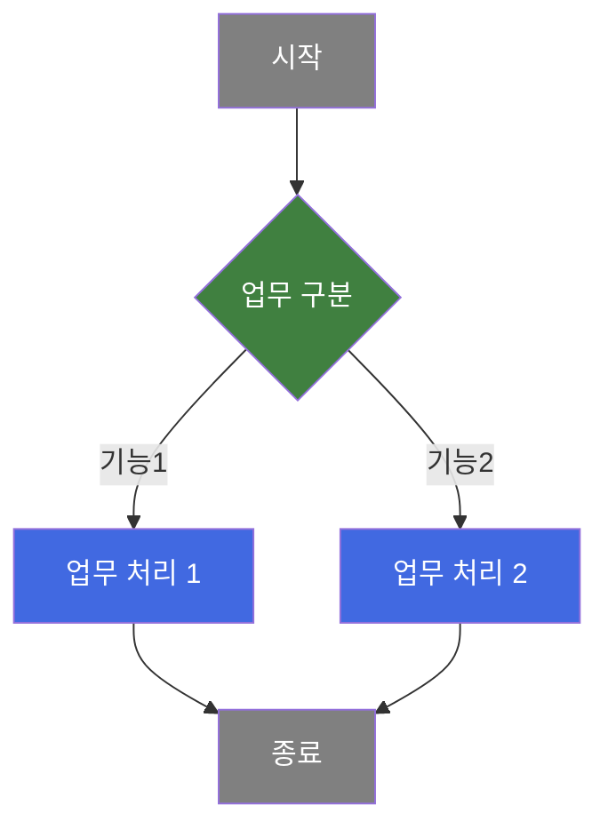
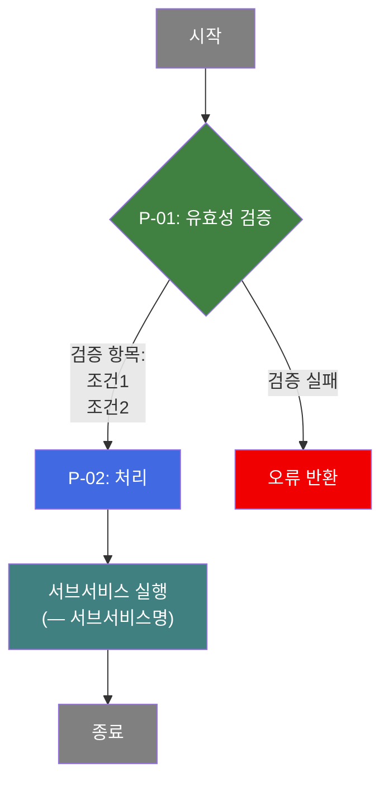
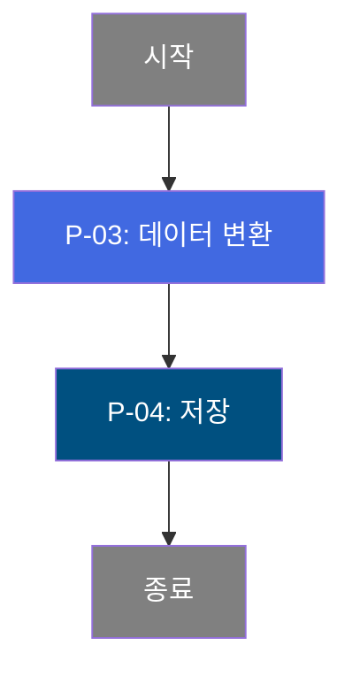
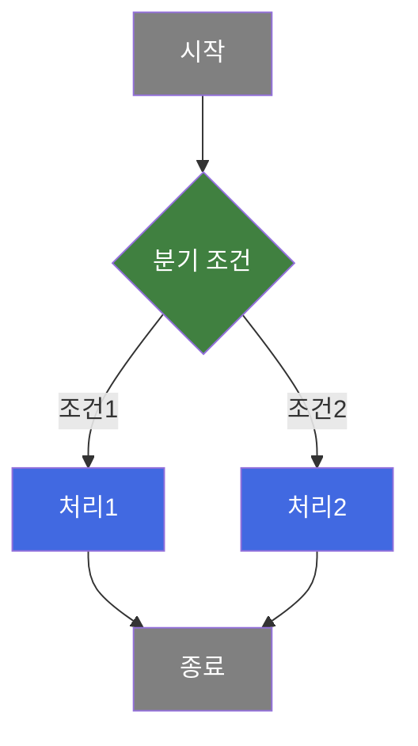

# [SERVICE-ID] 비즈니스 프로세스 분석서 (BPA)

## 1. 시스템 개요

| 항목 | 내용 |
|------|------|
| 서비스 ID | [SERVICE-ID] |
| 업무명 | [업무명] |
| 서비스 타입 | [ui/nui] |
| 분석 일시 | [분석 수행 시각 (KST)] |
| 원본 분석일 | [structure.json analysisDate] |
| 문서 버전 | 1.0 |

---

## 2. 시스템 목적

<!-- 작성 지침:
- 2-3문단으로 비즈니스 목적 설명
- 이 시스템이 왜 존재하는지, 누가 사용하는지, 어떤 업무를 지원하는지
- 기술 용어 최소화, 업무 담당자 관점으로 작성
-->

[시스템의 비즈니스 목적을 2-3문단으로 상세 설명]

---

## 3. 핵심 워크플로우

<!-- 작성 지침:
- 업무 기능별 그룹핑 (예: 작업요구, 입동요청, 하차완료 등)
- 초기 업무설계 수준의 단순화된 Mermaid 플로우차트
- 비즈니스 판단 기준과 업무 단위로만 표현
- 업무 담당자가 읽고 업무 흐름을 파악할 수 있는 수준

⛔ 절대 금지:
- Activity명, SQL key 등 코드 레벨 정보
- 화면 조작 표현: "버튼 클릭", "화면 진입", "화면 로드", "그리드 표시",
  "그리드 바인딩", "폼에 표시", "검색 조건 입력", "콤보박스 선택",
  "탭 전환", "팝업 열기/닫기", "메시지 출력", "엑셀 내보내기",
  "iframe 호출", "find() 호출" 등 UI 조작 용어
→ 워크플로우 노드는 시스템이 수행하는 "업무 동작"만 표현한다.

⚠️ 노드 내 줄바꿈은 반드시  을 사용. \n 사용 금지.

Mermaid 색상 규칙:
  프로세스:       fill:#4169E1,color:#fff
  프로시저호출:    fill:#408080,color:#fff
  분기(3개 이상):  fill:#008000,color:#fff
  판단(Y/N):      fill:#408040,color:#fff
  저장:           fill:#005080,color:#fff
  에러:           fill:#F00000,color:#fff
  데이터전송:      fill:#808000,color:#fff
  시작/종료:      fill:#808080,color:#fff

단일 프로세스인 경우:
> 이 서비스는 단일 업무 프로세스로 구성되어 있어 핵심 워크플로우를 별도로 작성하지 않습니다. **4. 상세 워크플로우**를 참조하세요.

조회 전용 서비스인 경우:
> 이 서비스는 조회 전용으로, 데이터 변경 프로세스가 없습니다.
-->

---

## 4. 상세 워크플로우

<!-- 작성 지침:
- 제외: 단순 조회 후 화면 표시(Grid 바인딩)로 끝나는 프로세스
- 포함: 저장(INSERT/UPDATE/DELETE), 계산, 검증, 외부연동, 상태변경
- 각 프로세스에 고유 번호 부여 (P-01, P-02, ...)
- Mermaid 노드에도 "P-01:" 접두사를 포함한다
- 테이블/컬럼명 제거 → 비즈니스 용어 사용
- 서브서비스 호출도 하나의 프로세스 단계로 표현
- 빠진 프로세스 없이 전체 그림이 그려져야 함

⛔ 구조 규칙:
- 하나의 거대 Mermaid에 모든 P-XX 나열 금지
- 업무 그룹별 소제목(###) + 개별 Mermaid로 분리
- 각 Mermaid에 유효성 검증, 분기 조건, 서브서비스 호출 등 비즈니스 로직 단계 포함
- 순수 조회 프로세스는 Mermaid 제외 → 텍스트로 언급
- flowchart LR(가로) 금지 — 반드시 flowchart TD(세로) 사용

⛔ 절대 금지:
- 화면 조작 표현: 섹션 3과 동일 규칙 적용
- 코드 레벨 정보: Activity 클래스명, SQL key 등

⚠️ 노드 내 줄바꿈은 반드시  을 사용. \n 사용 금지.

연관 서비스 약칭 표기:
- 각 프로세스 흐름도 소제목에 해당 서비스를 '—' 구분자로 표기
- 동일 ID 파생 서비스: — tab01, — pop01 (약칭)
- 다른 ID 서브서비스: — M261000001 (전체 ID)
- 메인 서비스 자체: 표기 생략
- 예: ### 프로세스 흐름도 — 사고이력 수정 (P-01) — tab01

조회 전용 서비스인 경우:
> 이 서비스는 조회 전용으로, 상세 워크플로우를 작성하지 않습니다.
-->

### 프로세스 흐름도 — [업무그룹명] (P-01, P-02)

### 프로세스 흐름도 — [업무그룹명2] (P-03, P-04)

---

## 5. 비즈니스 로직 상세

<!-- 작성 지침:
- 4장의 프로세스 번호(P-01, P-02...)와 1:1 매핑
- 각 프로세스를 
 태그로 개별 감싸서 기본 접힘 처리
- 
에 연관 서비스 약칭 표기:
  동일 ID 파생→[tab01]/[pop01], 다른 ID→[서비스ID], 메인 서비스→생략
- 각 프로세스에서:
  - 입력 데이터: 어떤 엔티티(테이블명)에서 읽는지 (컬럼 상세 불필요)
  - 처리 로직: 판단 기준, 계산 공식, 변환 규칙
  - 출력 데이터: 어떤 엔티티(테이블명)에 쓰는지 (컬럼 상세 불필요)
  - 예외 처리: 에러 조건과 처리 방법
- DB 테이블 상세(컬럼 정의, 타입, PK 등)는 포함하지 않음
- 엔티티 수준의 데이터 흐름만 표현

⛔ 절대 금지:
- Activity 클래스명, SQL key, DAO명, 트랜잭션명, 컨텍스트 변수명
- 컬럼명 (엔티티/테이블 수준 언급만 허용)

조회 전용 서비스인 경우:
> 이 서비스는 조회 전용으로, 비즈니스 로직 상세를 작성하지 않습니다.
-->

P-01: [프로세스명] [약칭] — [프로세스 설명]

- **입력**: [엔티티(테이블명)]에서 [어떤 데이터]를 조회
- **처리**:
  1. [처리 단계 1]
  2. [처리 단계 2]
  3. [처리 단계 3]
- **출력**: [엔티티(테이블명)]에 [어떤 데이터]를 저장/갱신
- **예외**: [에러 조건] → [처리 방법]

P-02: [프로세스명] — [프로세스 설명]

- **입력**: ...
- **처리**: ...
- **출력**: ...
- **예외**: ...

---

## 6. 커스텀 클래스 워크플로우

<!-- 작성 지침:
- 이 섹션은 항상 포함한다 (생략 금지)
- 커스텀 클래스 없음 → "해당 없음" 메시지 표기
- 커스텀 클래스 있지만 200줄 미만 → 역할/설명만 텍스트로 기술
- 200줄 이상 → Mermaid flowchart로 내부 비즈니스 처리 흐름 표현
- 200줄 미만 클래스도 역할/설명은 함께 기술
- 프레임워크 호출(getBean, getDao 등) 제외, 비즈니스 로직만 표현
- 동일 Mermaid 색상 규칙 적용

⛔ 절대 금지:
- 화면 조작 표현 (비즈니스 처리 흐름만 표현)
-->

<!-- 케이스 1: 커스텀 클래스 없음 -->
해당 없음 — 이 서비스에는 커스텀 클래스가 없음. 모든 처리가 프레임워크 내장 Activity(GridSave 등)로 수행됨.

<!-- 케이스 2: 200줄 미만 클래스만 있는 경우 -->
### [ClassName] (약 [N]줄)

**역할**: [클래스의 비즈니스 역할 1줄 설명]

<!-- 케이스 3: 200줄 이상 클래스 → Mermaid 워크플로우 추가 -->
### [ClassName] (약 [N]줄)

**역할**: [클래스의 비즈니스 역할 1줄 설명]

---

## 7. 주요 유즈케이스

<!-- 작성 지침:
- Actor, 목적, 주요 흐름만 유지
- 전제조건/대체흐름/후행조건은 핵심적인 것만 1-2줄로 축소
- 최소 2개 이상
-->

UC-01: [유즈케이스명]

- **Actor**: [사용자 역할]
- **목적**: [기능의 목표]
- **주요 흐름**:
  1. [단계 1]
  2. [단계 2]
  3. [단계 3]
- **예외**: [핵심 예외 상황]

UC-02: [유즈케이스명]

- **Actor**: [사용자 역할]
- **목적**: [기능의 목표]
- **주요 흐름**:
  1. [단계 1]
  2. [단계 2]
  3. [단계 3]

---

<!-- CONDITIONAL: UI 타입 서비스인 경우에만. NUI 타입이면 이 섹션 전체 생략 -->
## 8. 화면 구성 개요

<!-- 작성 지침:
- 레이아웃 구조 간략 설명 (세부 컬럼 정의 제거)
- 주요 입출력 항목만
- 버튼/이벤트 → 어떤 프로세스(P-XX)를 트리거하는지만 기술
- NUI 타입이면 이 섹션 전체 생략
- 연관 서비스(tab/pop) 화면도 통합 표기:
  ### tab01 - [탭명], ### pop01 - [팝업명] 소제목으로 추가

HTML <table> 레이아웃 규칙:
- 배경색 사용 금지 (다크/라이트 테마 호환)
- 테두리: border:2px solid #888
- 좌우 배치는 <tr> 안에 <td> 2개 (width:50%)
- 상하 전체폭은 colspan="2"
- 각 영역에 컴포넌트명(Form/Grid/Tab) + 주요 항목 나열
- 버튼은 <code>[버튼명]</code> 형식
-->

### 레이아웃

<table style="width:100%; border-collapse:collapse;">
<tr><td style="border:2px solid #888; padding:10px;">
  <b>[컴포넌트명 (Form/Grid)]</b> 
  [주요 항목 나열] 
  <code>[버튼1]</code> <code>[버튼2]</code>
</td></tr>
<tr><td style="border:2px solid #888; padding:10px; height:120px;">
  <b>[컴포넌트명 (Grid)]</b> 
  [주요 표시 항목]
</td></tr>
</table>

### 주요 버튼 및 이벤트
| 버튼/이벤트 | 트리거 프로세스 | 설명 |
|------------|---------------|------|
| [버튼명] | P-01 | [동작 설명] |
| [버튼명] | P-02 | [동작 설명] |

---

## 9. 관련 엔티티

<!-- 작성 지침:
- 엔티티명 + 한줄 설명만 목록
- 엔티티 간 관계는 텍스트로 간략 설명

⛔ 절대 금지:
- ER 다이어그램 (Mermaid erDiagram 사용 금지)
- 컬럼 상세 (컬럼명, 데이터 타입, PK 정보 포함 금지)
-->

### 엔티티 목록

| 엔티티(테이블) | 설명 | 사용 유형 |
|---------------|------|----------|
| [TB_XXX_YYY] | [한줄 설명] | [조회/저장/갱신/삭제] |

### 엔티티 간 관계
- [테이블A]와 [테이블B]는 [관계 설명]
- [테이블C]는 [테이블A]의 [관계 설명]

---

<!-- CONDITIONAL: 서브서비스가 있는 경우에만 -->
## 10. 서브서비스

| 서비스 ID | 설명 | 호출 시점 | 트랜잭션 | BPA 문서 |
|-----------|------|---------|---------|---------|
| [SUB_SERVICE_ID] | [핵심 기능 요약] | [어떤 프로세스에서 호출] | [공유/신규] | [링크 또는 미작성] |

---

## 11. 특이사항 및 주의사항

<!-- 작성 지침:
- 최소 3건 이상
- 핵심 비즈니스 로직 복잡성, 외부 시스템 연동, 오류처리 전략 등
-->

### 1. [특이사항 제목]
[상세 설명]

### 2. [특이사항 제목]
[상세 설명]

### 3. [특이사항 제목]
[상세 설명]
