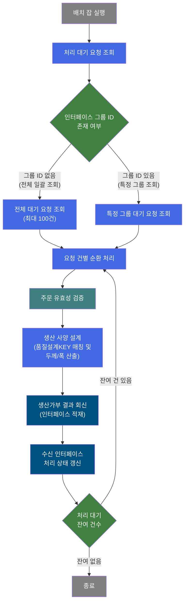
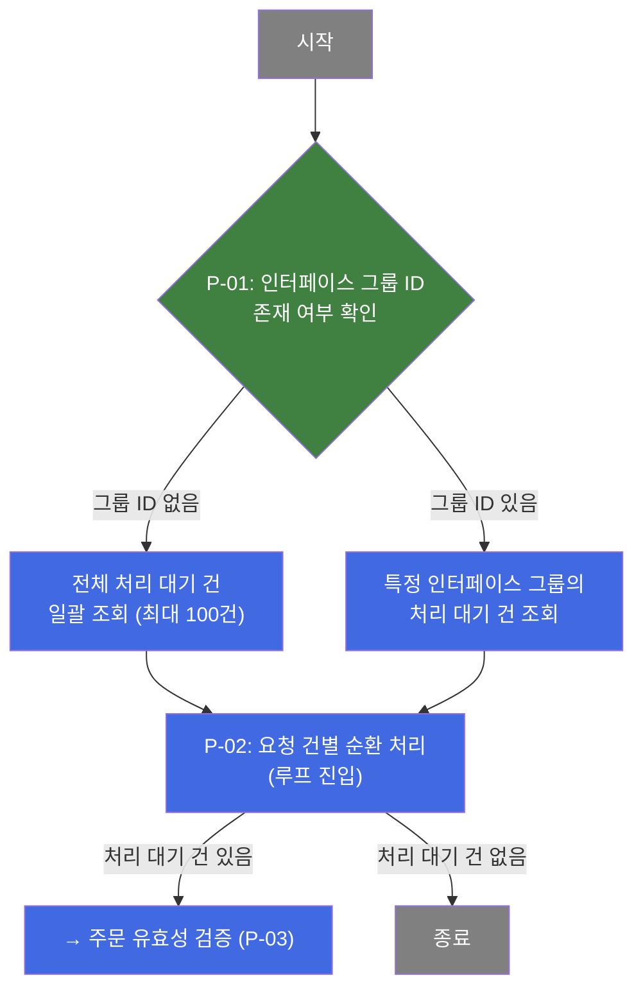
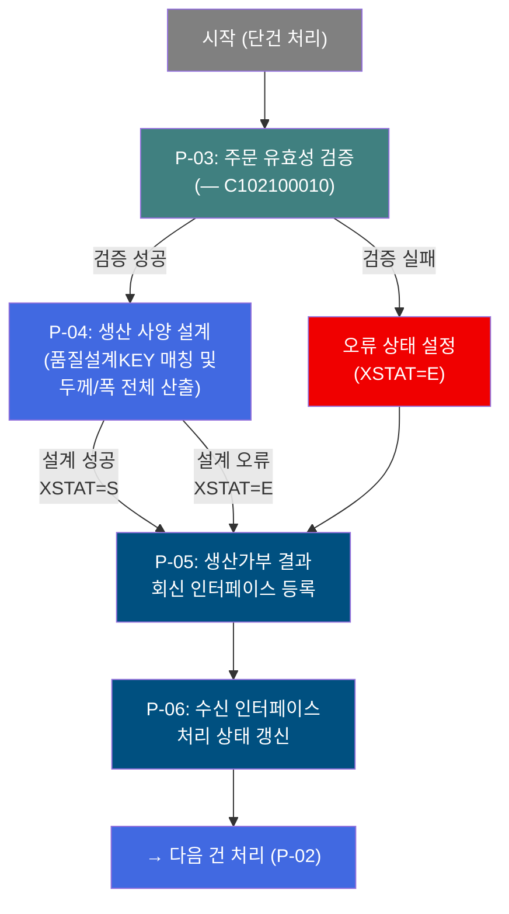
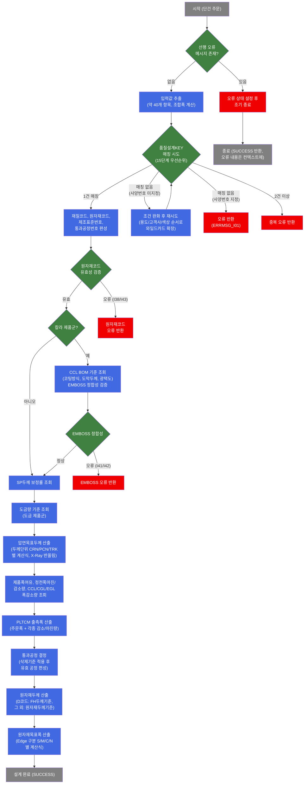

# B10R0020 비즈니스 프로세스 분석서 (BPA)

## 1. 시스템 개요

| 항목 | 내용 |
|------|------|
| 서비스 ID | B10R0020 |
| 업무명 | 제품사양설계 - 생산가부요청 수신 처리 (배치) |
| 서비스 타입 | nui |
| 분석 일시 | 2026-03-21 (KST) |
| 원본 분석일 | 2026-03-17 |
| 문서 버전 | 1.0 |

---

## 2. 시스템 목적

B10R0020은 외부 영업/주문 시스템(OMS)으로부터 EAI 인터페이스를 통해 수신된 **생산가부요청** 데이터를 배치로 처리하는 서비스이다. 주문별로 품질설계에 필요한 모든 생산 사양(압연목표두께, PLTCM 출측폭, 원자재두께/폭 등)을 자동 산출하여, 해당 주문이 실제 생산 가능한지를 판정하고 그 결과를 다시 외부 시스템으로 회신하는 역할을 담당한다.

이 서비스는 배치 잡(batchJobB10R0020)으로 등록된 스케줄 작업이며, EAI 인터페이스 테이블에 처리 대기(XSTAT='D') 상태로 쌓인 주문 요청 건을 순차적으로 조회하여 처리한다. 각 건마다 15단계 우선순위 기반의 품질설계KEY 매칭, 압연·도금·코팅 공정별 폭/두께 설계, 통과공정 결정 등 복잡한 제조 사양 설계 로직을 실행하고, 처리 결과(성공/오류)를 인터페이스 테이블에 갱신한 후 회신 인터페이스 테이블에 결과 데이터를 적재한다.

주요 사용자는 MES 자동화 배치 스케줄러이며, 영업 주문 접수 후 생산 계획 수립 전 단계에서 자동 실행된다. 처리 결과는 이후 제조 지시 및 생산 스케줄링의 기초 데이터로 활용된다.

---

## 3. 핵심 워크플로우

---

## 4. 상세 워크플로우

### 프로세스 흐름도 — 처리 대기 요청 조회 및 루프 진입 (P-01, P-02)

### 프로세스 흐름도 — 주문 유효성 검증 및 품질설계 (P-03, P-04)

---

## 5. 비즈니스 로직 상세

P-01: 처리 대기 요청 조회 방식 결정 — 인터페이스 그룹 ID 존재 여부에 따라 조회 범위 결정

- **입력**: 배치 잡 파라미터 또는 호출 컨텍스트의 인터페이스 그룹 ID(IF_GRP_ID) 값
- **처리**:
  1. 인터페이스 그룹 ID가 설정되어 있는지 확인
  2. 그룹 ID가 없으면 EAI 수신 인터페이스 테이블(EAIAPUSER.TB_C10_B10R0020)에서 처리 대기(XSTAT='D') 전체를 조회 (최대 100건, 인터페이스 그룹 ID 및 순번 기준 정렬)
  3. 그룹 ID가 있으면 해당 그룹에 속하는 처리 대기 건만 조회
- **출력**: 처리 대기 요청 목록 (ResultSet)
- **예외**: 조회 결과가 0건이면 루프 미진입 후 정상 종료

P-02: 요청 건별 순환 처리 — 조회된 요청 목록을 1건씩 순차 처리하기 위한 루프 제어

- **입력**: P-01에서 조회된 처리 대기 요청 ResultSet
- **처리**:
  1. 루프 카운터가 없으면 전체 건수로 초기화
  2. 남은 처리 건수가 0이면 루프 종료 (카운터 정리 후 종료 전이 반환)
  3. 건수가 있으면 현재 건의 데이터를 컨텍스트에 바인딩 (인터페이스 그룹 ID, 순번, 주문 정보 등 약 100개 항목)
  4. 루프 카운터 1 감소 후 다음 단계(P-03)로 진행
  5. 처리 완료 후 루프 액티비티로 되돌아와 다음 건 처리
- **출력**: 단건 주문 데이터 (컨텍스트에 바인딩)
- **예외**: 처리 건수 파라미터 미설정 시 실패 반환

P-03: 주문 유효성 검증 [C102100010] — 생산 지시 처리 전 주문 기본 유효성 검증

- **입력**: 컨텍스트에 바인딩된 단건 주문 정보 (주문요청번호, 행번, 주문 제원 등)
- **처리**:
  1. 서브서비스 C102100010(제조 지시 처리 검증) 호출
  2. 주문 상태, 규격, 제원의 기본 유효성 검사 수행
- **출력**: 검증 결과 (XSTAT: S=성공, E=오류 / XMSGS: 오류 메시지)
- **예외**: 검증 실패 시 XSTAT=E, XSTAT_CALLBACK=R, XMSGS에 오류 내용 설정 후 P-04(설계) 없이 P-05(결과 등록)로 진행

P-04: 생산 사양 설계 — 품질설계KEY 매칭 및 두께/폭 전체 산출 (핵심 설계 로직)

- **입력**: 주문 정보 (품명코드, 제품형태, 규격약호, 주문용도코드, 최종고객사, 고객사양번호, 주문두께/폭, Slit 조수, 조합폭, EMBOSS 코드 등 약 40개 항목)
- **처리**:
  1. **선행 오류 확인**: 이전 단계 오류 메시지가 있으면 설계 생략 후 오류 상태로 조기 종료
  2. **품질설계KEY 매칭**: 15단계 우선순위 조합(품명, 규격약호, 주문용도, 고객사, 사양번호, 도금량, EMBOSS 등 13개 조건)으로 품질설계KEY 마스터(C10B1040) 매칭. 매칭 실패 시 주문용도/고객사/색상코드 순서로 조건 완화 후 재시도
  3. **재질·원자재 코드 결정**: 매칭된 품질설계KEY로부터 재질코드, 원자재코드(적정/차선1/차선2), 제조표준번호, 통과공정번호 편성. 원자재코드 유효성(구매반제품-열연 관계, H/M 코드 정합성) 검증
  4. **CCL BOM 기준 확인** (칼라 제품군): CCL BOM 번호로 코팅 방식, 도막두께, 광택도 조회. EMBOSS 무늬 코드와 임프린트 롤 번호 정합성 검증
  5. **압연목표두께 산출**: 두께 단위(CRN/PCN/TRK)별 계산식 적용. 도막두께·도금두께 차감, SP두께 보정률 반영. `DbCommonUtil`의 X-Ray Set 반올림 적용
  6. **PLTCM 출측폭 산출**: 주문폭(조합폭) + 정전폭감소량 + CCL폭감소량(칼라) + CGL/EGL폭감소량(도금) + 정전폭마진량 + 제품폭여유치
  7. **통과공정 결정**: 통과공정기준 마스터 조회 후 통과공정삭제기준 적용하여 유효 공정(주공정+대체3개) 결정
  8. **원자재두께 산출**: 원자재코드 유형(구매반제품 D 여부)에 따라 FH두께설계기준 또는 원자재두께기준 마스터 적용
  9. **원자재목표폭 산출**: Edge 구분(Slit/Mill/CoilEdge/No-Slit)에 따라 PLTCM폭 + 폭수축량 + 폭마진량 계산
- **출력**: 설계 결과 (재질코드, 원자재코드, 압연목표두께, PLTCM 출측폭, 원자재두께/폭, 통과공정번호, 처리 상태/오류 메시지)
- **예외**: 품질설계KEY 15단계 모두 매칭 실패, 원자재코드 유효성 오류, EMBOSS 정합성 오류 → XSTAT=E, 해당 오류코드(ERRMSG_I01, I38, I41, I42, I43 등) 설정

P-05: 생산가부 결과 회신 인터페이스 등록 — 처리 결과를 외부 시스템 회신용 인터페이스 테이블에 적재

- **입력**: P-03/P-04 처리 결과 (XSTAT, XMSGS, 재질코드, 원자재코드, 압연목표두께, PLTCM폭, 원자재두께/폭, 오류여부 등)
- **처리**:
  1. 신규 인터페이스 그룹 ID 생성 (PosIFGroupID)
  2. 생산가부 결과 회신 인터페이스 테이블(TB_C10_B10S1030)에 단건 데이터 삽입
  3. 주문요청번호/행번, 오류여부, 재질코드, 원자재코드/두께/폭, PLTCM목표폭, 통과공정번호 등 결과 항목 저장
  4. 송신일시는 SYSDATE 자동 설정
- **출력**: TB_C10_B10S1030에 신규 레코드 삽입
- **예외**: 삽입 실패 시 오류 반환

P-06: 수신 인터페이스 처리 상태 갱신 — 수신 인터페이스 원본 레코드의 처리 상태 업데이트

- **입력**: 인터페이스 그룹 ID, 순번, 처리 결과 (XSTAT, XMSGS, XSTAT_CALLBACK)
- **처리**:
  1. EAI 수신 인터페이스 테이블(TB_C10_B10R0020)에서 해당 건(인터페이스 그룹 ID + 순번)을 조회
  2. 처리 상태(XSTAT), 오류 메시지(XMSGS, 100자 제한), 콜백 상태(XSTAT_CALLBACK) 갱신
  3. 최종 변경 감사 정보(변경 객체 유형/ID, 프로그램 ID, 타임스탬프) 업데이트
  4. 오류 메시지 초기화 후 다음 건 처리를 위해 루프(P-02)로 복귀
- **출력**: TB_C10_B10R0020 레코드 갱신
- **예외**: 해당 레코드 미존재 시 오류

---

## 6. 커스텀 클래스 워크플로우

### DbQualDesignLoop (약 171줄)

**역할**: 이전 조회 결과(ResultSet)를 1건씩 순차 순회하기 위한 루프 제어 액티비티. 매 루프마다 현재 처리 건의 데이터를 컨텍스트에 바인딩하고 카운터를 관리하여, 후속 액티비티가 단건 기준으로 동작할 수 있도록 연결한다. 171줄로 200줄 미만이므로 Mermaid 생략.

- 처리 건수 0이면 `exit` 전이로 루프 종료
- 매 루프 진입 시 오류 플래그(`P_ERR_KEY=N`, `QLT_DSN_ERR_YN=""`)와 배치 잡 플래그(`BATCH_JOB=true`) 초기화
- 역방향 카운터(전체 - 감소) + 순방향 인덱싱 방식으로 현재 처리 Row 위치 계산
- DB를 직접 조회하지 않으며, 이전 서비스(`PosSearch`)의 ResultSet을 재사용

---

### DbSearchPrdInqchkData (약 2,095줄)

**역할**: 생산가부요청 단건에 대해 품질설계KEY를 매칭하고 압연목표두께, PLTCM 출측폭, 원자재두께/폭을 포함한 생산 사양 전체를 설계하는 핵심 액티비티.

---

## 7. 주요 유즈케이스

UC-01: 정상 주문의 생산가부 자동 판정 및 사양 설계

- **Actor**: MES 배치 스케줄러 (자동 실행)
- **목적**: EAI를 통해 수신된 주문 요청에 대해 생산 사양을 자동 산출하고 생산 가능 여부를 판정하여 결과를 외부 시스템에 회신
- **주요 흐름**:
  1. 배치 스케줄러가 처리 대기 요청 건을 조회 (최대 100건)
  2. 각 건에 대해 주문 유효성 검증 수행
  3. 품질설계KEY 매칭으로 재질·원자재 코드 결정
  4. 압연목표두께, PLTCM폭, 원자재두께/폭 순차 산출
  5. 통과공정 결정
  6. 결과(XSTAT=S, 설계값)를 회신 인터페이스 테이블에 등록
  7. 수신 인터페이스 상태를 처리 완료로 갱신
- **예외**: 품질설계KEY 매칭 실패 시 XSTAT=E로 오류 결과 회신

UC-02: 품질설계KEY 우선순위 강등을 통한 최적 매칭

- **Actor**: MES 배치 스케줄러 (자동 실행)
- **목적**: 고객사양번호가 미지정된 주문에 대해 조건을 단계적으로 완화하여 적용 가능한 품질설계KEY를 탐색
- **주요 흐름**:
  1. 전체 조건(13개)으로 1차 매칭 시도
  2. 매칭 실패 시 색상코드 와일드카드 확장
  3. 최종수요가 와일드카드 확장
  4. 주문용도코드 소분류 순서로 단계 완화
  5. 15단계 이내에 1건 매칭 성공 시 해당 품질설계KEY로 사양 설계 진행
- **예외**: 15단계 모두 실패 시 오류 코드(ERRMSG_I01) 설정 후 오류 상태로 결과 회신

UC-03: 특정 인터페이스 그룹 단위 재처리

- **Actor**: MES 운영자 또는 배치 재실행 트리거
- **목적**: 오류가 발생한 특정 인터페이스 그룹 ID의 요청 건만 선택적으로 재처리
- **주요 흐름**:
  1. 특정 인터페이스 그룹 ID로 배치 잡 실행
  2. 해당 그룹의 처리 대기 건만 조회 (XSTAT='D')
  3. 단건씩 사양 설계 처리 및 결과 갱신
- **예외**: 해당 그룹에 처리 대기 건이 없으면 처리 없이 정상 종료

---

## 9. 관련 엔티티

### 엔티티 목록

| 엔티티(테이블) | 설명 | 사용 유형 |
|---------------|------|----------|
| EAIAPUSER.TB_C10_B10R0020 | 생산가부요청 수신 EAI 인터페이스 테이블 | 조회 / 갱신 |
| TB_C10_B10S1030 | 생산가부요청결과 송신 EAI 인터페이스 테이블 | 저장 |

> 이 외에 DbSearchPrdInqchkData 클래스 내부에서 EasyAccess를 통해 다수의 품질설계 마스터 테이블을 조회한다 (C10B1040, C10B2060, C10B2070, C10B1071~C10B1079, C10B2010, C10B2230, C10B2310 등). 해당 마스터들은 MES 품질설계 기준 테이블로, 설계 로직에서 읽기 전용으로 참조된다.

### 엔티티 간 관계

- `EAIAPUSER.TB_C10_B10R0020`는 외부 OMS 시스템으로부터 수신된 생산가부요청 원본 레코드로, 처리 상태(XSTAT)와 오류 메시지(XMSGS)를 통해 처리 진행 상태를 관리한다.
- `TB_C10_B10S1030`는 `TB_C10_B10R0020`의 처리 결과를 외부 시스템으로 회신하기 위한 송신 인터페이스 테이블로, 수신 건 1건당 회신 건 1건이 생성된다.
- 두 테이블은 인터페이스 그룹 ID(IF_GRP_ID)와 주문요청번호(ORD_REQ_NO)/행번(ORD_REQ_LN)으로 연관된다.

---

## 10. 서브서비스

| 서비스 ID | 설명 | 호출 시점 | 트랜잭션 | BPA 문서 |
|-----------|------|---------|---------|---------|
| C102100010 | 주문 유효성 검증 (제조 지시 처리 전 검증) | P-03: 단건 주문 처리 진입 시 | 기존 트랜잭션 공유 (new-transaction=false) | 미작성 |

---

## 11. 특이사항 및 주의사항

### 1. 품질설계KEY 15단계 우선순위 매칭의 복잡성

품질설계KEY 매칭은 최대 15단계 우선순위 조합을 시도하는 while 루프로 구성되어 있다. 고객사양번호가 지정된 경우 매칭 실패 시 즉시 오류를 반환하지만, 미지정된 경우 주문용도코드(원래값 → XXX*** → X***** → ******), 최종수요가(원래값 → ******), 색상코드(원래값 → *****) 순서로 조건을 단계적으로 완화하여 재탐색한다. 이 로직은 `DbSearchPrdInqchkData` 클래스의 핵심 비즈니스 규칙으로, 향후 마스터 데이터 구성 방식 변경 시 매칭 실패 빈도에 직접 영향을 미친다.

### 2. 배치 처리량 제한 및 루프 성능 특성

`B10R0020_sub` 변형에서 전체 처리 대기 건 일괄 조회 시 최대 100건으로 제한(ROWNUM)된다. `DbQualDesignLoop`는 역방향 카운터 기반 순방향 인덱싱 방식으로 ResultSet을 순회하며, 매 루프마다 전체 ResultSet을 처음부터 재탐색하는 O(n²) 특성을 갖는다. 처리 건수가 많을수록 탐색 횟수가 누적 증가하므로, 대량 처리 환경에서는 성능 부하에 주의해야 한다.

### 3. 두 가지 서비스 변형 (sub / tst)

B10R0020은 메인 배치 잡 호출 서비스 외에 `B10R0020_sub`(운영용: 그룹 ID 존재 여부로 전체/특정 그룹 분기 조회)와 `B10R0020_tst`(테스트용: 단순 전체 조회, ROWNUM 미적용)의 두 가지 실행 서비스로 구성된다. 두 변형은 동일한 커스텀 클래스와 SQL을 공유하나, 초기 데이터 조회 방식과 조회 건수 제한 여부가 다르다.

### 4. 오류 처리 및 결과 회신 보장

주문 유효성 검증(P-03)이나 생산 사양 설계(P-04) 중 오류가 발생하더라도 처리를 즉시 중단하지 않고, 오류 상태(XSTAT=E)와 오류 메시지를 설정한 뒤 회신 인터페이스 등록(P-05) 및 수신 인터페이스 상태 갱신(P-06)을 반드시 수행한다. 이를 통해 모든 수신 건에 대해 회신이 보장되며, 오류가 발생한 건은 외부 시스템에서 오류 내용을 확인하고 재요청할 수 있다. 오류 메시지는 XMSGS에 저장되며 100자로 제한된다.

### 5. EAI 스키마 분리 (EAIAPUSER)

수신/송신 인터페이스 테이블은 MES 주 스키마(MESAPUSER)가 아닌 별도 EAI 스키마(EAIAPUSER)에 위치하며, `eaidao` 빈을 통해 접근한다. 이는 EAI 연동 데이터를 MES 운영 데이터와 물리적으로 분리하여 인터페이스 장애가 MES 주요 업무에 영향을 미치지 않도록 하는 설계 의도이다.
