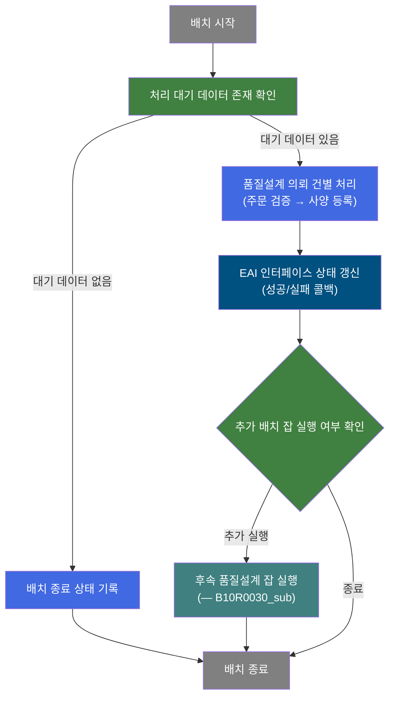
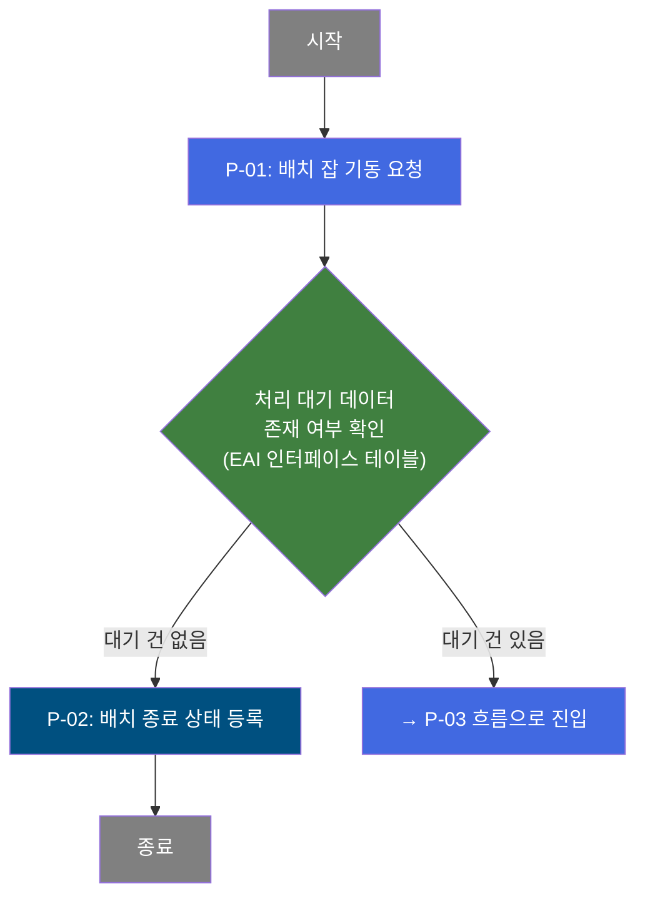
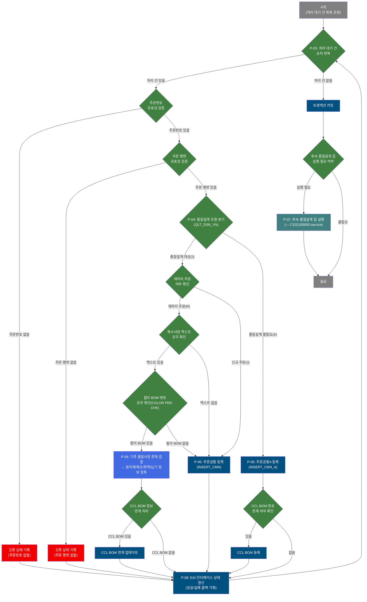

# B10R0030 비즈니스 프로세스 분석서 (BPA)

## 1. 시스템 개요

| 항목 | 내용 |
|------|------|
| 서비스 ID | B10R0030 |
| 업무명 | 품질설계의뢰정보 수신 배치 |
| 서비스 타입 | nui (배치) |
| 분석 일시 | 2026-03-21 (KST) |
| 원본 분석일 | 2026-03-17 |
| 문서 버전 | 1.0 |

---

## 2. 시스템 목적

B10R0030은 EAI(Enterprise Application Integration) 인터페이스를 통해 외부 판매/영업 시스템으로부터 전송된 **품질설계 의뢰 정보**를 정기적으로 수신하여 MES 생산관리 데이터로 변환·등록하는 배치 프로세스이다.

배치가 실행되면 EAI 인터페이스 테이블에서 처리 대기 상태('D')인 품질설계 의뢰 건을 일괄 조회하고, 건별로 주문 유효성 검증 → 품질설계 유형 분기 → MES 주문 공통 데이터 등록(신규/재처리) 흐름을 수행한다. 컬러 도장 제품의 경우 BOM(Bill of Materials) 정보를 별도 처리하며, 처리 결과(성공/실패)는 EAI 인터페이스 테이블에 콜백 상태로 갱신되어 발신 시스템이 처리 결과를 확인할 수 있도록 한다.

이 서비스는 판매 주문에 기반한 품질 사양 정보가 MES 내 생산·공정 관리 체계에 통합되는 핵심 연결 고리를 담당하며, 배치 실행 중 처리 상태를 실시간으로 추적·제어하는 배치 잡 제어 구조(시작/중지 서비스 분리)를 갖추고 있다.

---

## 3. 핵심 워크플로우

---

## 4. 상세 워크플로우

### 프로세스 흐름도 — 배치 실행 제어 (P-01, P-02)

### 프로세스 흐름도 — 품질설계 의뢰 건별 처리 (P-03, P-04, P-05, P-06, P-07, P-08)

---

## 5. 비즈니스 로직 상세

P-01: 배치 잡 기동 요청 — EAI 인터페이스 대기 데이터 존재 여부 확인

- **입력**: EAIAPUSER.TB_C10_B10R0030에서 처리 대기 상태(XSTAT='D') 건수 조회
- **처리**:
  1. 배치 잡 시작 상태를 기록
  2. 대기 건 존재 시 처리 루프(P-03)로 진입, 없으면 P-02(종료)로 전환
- **출력**: 없음 (분기 제어만 수행)
- **예외**: 없음

P-02: 배치 종료 상태 등록 — 처리 대기 데이터가 없을 때 배치 종료 기록

- **입력**: 없음
- **처리**:
  1. 배치 잡 종료 상태를 시스템에 등록
- **출력**: 배치 잡 상태 정보 갱신
- **예외**: 없음

P-03: 품질설계 의뢰 건별 반복 처리 — EAI 수신 건을 순차 처리

- **입력**: EAIAPUSER.TB_C10_B10R0030에서 처리 대기(XSTAT='D') 건 목록 (최대 100건/회차)
- **처리**:
  1. 처리 오류 플래그 초기화 (P_PROC_FLAG = 'C')
  2. 처리 대기 건 목록을 한 건씩 반복
  3. 모든 건 처리 완료 시 트랜잭션 커밋 및 루프 종료
- **출력**: 없음 (각 건별 처리는 P-04~P-08에서 수행)
- **예외**: 처리 중 오류 발생 시 해당 건은 오류 상태로 기록 후 다음 건으로 계속 진행

P-04: 주문 유효성 검증 — 주문번호 및 주문 행번 존재 여부 확인

- **입력**: EAI 수신 건의 주문번호(ORD_NO), 주문행번(ORD_LN)
- **처리**:
  1. 주문번호가 null이면 오류 상태('E', "주문번호가 없습니다.") 설정 후 EAI 상태 갱신(P-08)
  2. 주문번호가 있으면 주문행번 존재 여부 확인
  3. 주문행번이 null이면 오류 상태('E', "주문행번이 없습니다.") 설정 후 EAI 상태 갱신(P-08)
  4. 주문번호·행번 모두 유효하면 P-05(품질설계 유형 분기)로 진행
- **출력**: 없음 (분기 제어만 수행)
- **예외**: 유효성 실패 → XSTAT='E', XSTAT_CALLBACK='R'로 EAI 테이블 갱신

P-05: 품질설계 유형 분기 및 주문공통 데이터 등록 — QLT_DSN_YN 값에 따른 신규/A타입/재처리 분기

- **입력**: EAI 수신 건의 품질설계 여부(QLT_DSN_YN), 재처리 주문 여부(ORD_REP_YN), 특수사양 텍스트(ORD_SPC_TXT)
- **처리**:
  1. QLT_DSN_YN = 'A': 주문공통A(INSERT_CMN_A)에 주문 사양 정보 등록
  2. QLT_DSN_YN = 'J' 이고 ORD_REP_YN = 'J'(신규): 주문공통(INSERT_CMN)에 등록
  3. QLT_DSN_YN = 'J' 이고 ORD_REP_YN = 'R'(재처리): 특수사양 텍스트 유무에 따라 컬러 제품 BOM 분기(P-06)를 거쳐 주문공통 등록
  4. 주문공통 등록 실패 시 해당 건은 루프 다음 건으로 스킵
- **출력**: 주문공통 테이블(C102100CMN 또는 C102100CMNA)에 주문 사양 등록 (판매주문번호, 규격, 고객코드, 공정채널, 포장정보, 톨러런스 등 100여 개 항목)
- **예외**: INSERT 실패 → PROC_LOOP(다음 건) 직접 전환

P-06: 컬러 제품 BOM 기반 주문사양 처리 — CCL BOM 번호 기반 기존 품질사양 검증 및 세부 사양 등록

- **입력**: CCL_BOM_NO (컬러 BOM 번호), 기존 주문공통 데이터(C102100CMN)
- **처리**:
  1. 컬러 BOM 번호가 있으면 기존 품질사양 등록 여부 조회 (C102100CMN.Rselect)
  2. 기존 등록된 품질사양이 있으면 원자재(RMT) → 화학조성(CHM) → 납기(DEV) → 제조(MNF) → 품질수준(MQL) → 공정(PROC) 순으로 세부 사양 정보 등록
  3. 기존 품질사양이 없으면 주문공통(INSERT_CMN) 신규 등록으로 전환
- **출력**: 품질사양 세부 테이블 (원자재, 화학조성, 납기, 제조, 품질수준, 공정 정보)
- **예외**: 기존 품질사양 DB 조회 실패 시 신규 등록으로 전환

P-07: 후속 품질설계 잡 실행 — 전체 배치 처리 완료 후 품질설계 잡 연계 기동

- **입력**: 배치 잡 실행 여부 상태 (C10_QLT_JOB.select 조회 결과)
- **처리**:
  1. 품질설계 잡이 이미 실행 중이면 종료
  2. 실행 중이 아니면 후속 품질설계 서비스(C102100000-service) 기동
- **출력**: 없음
- **예외**: 없음

P-08: EAI 인터페이스 상태 갱신 — 처리 결과를 EAI 테이블에 콜백 기록

- **입력**: 처리 상태(XSTAT: 'S'=성공, 'E'=실패), 오류 메시지(XMSGS), 콜백 상태(XSTAT_CALLBACK), 인터페이스 그룹 ID(IF_GRP_ID), 순번(SEQ_NO)
- **처리**:
  1. EAIAPUSER.TB_C10_B10R0030 테이블의 해당 건 상태 정보를 처리 결과로 갱신
  2. 감사 로그(최종변경 프로그램ID, 변경일시) 함께 기록
- **출력**: EAIAPUSER.TB_C10_B10R0030 갱신 (XSTAT, XMSGS, XSTAT_CALLBACK, 감사컬럼)
- **예외**: 없음 (UPDATE 실패 시에도 다음 처리로 진행)

---

## 6. 커스텀 클래스 워크플로우

해당 없음 — 이 서비스의 엔트리 포인트(B10R0030-service.xml)에는 커스텀 클래스가 없음. 모든 처리가 프레임워크 내장 배치 잡 인보커(PosBatchJobInvoker)로 실행된다.

다만 하위 서비스(B10R0030_sub-service.xml, B10R0030_Call-service.xml)에서는 아래의 커스텀 클래스들이 사용된다 (200줄 미만, 역할 기술).

### DbQualDesignLoop
**역할**: EAI 수신 건 목록을 순차 반복하며 개별 건의 처리 데이터를 컨텍스트에 바인딩하는 배치 루프 제어 클래스. 전체 건 처리 완료 시 'exit' 전이를 발생시켜 커밋 단계로 전환한다.

### RoutingByStatusActivityB
**역할**: 배치 잡의 시작(START)/종료(STOP) 상태를 관리하는 라우팅 클래스. 현재 배치 실행 가능 상태인지 확인하고 진행 여부를 결정한다.

### DbCheckCnt
**역할**: SQL 조회 결과 건수를 기준으로 분기를 결정하는 범용 조건 라우터. 처리 대기 데이터 존재 여부, 품질설계 잡 실행 중 여부 등 다수 분기점에서 사용된다.

### DbConditionRouter
**역할**: 컨텍스트 파라미터 값을 지정된 비교값과 대조하여 여러 분기 전이 중 하나를 선택하는 범용 라우터. 품질설계 유형(QLT_DSN_YN), 재처리 여부(ORD_REP_YN), CCL BOM 존재 여부 등 다수 분기에서 활용된다.

### DbSetParam
**역할**: 컨텍스트에 처리 상태값(XSTAT, XMSGS, XSTAT_CALLBACK 등)을 설정하는 유틸리티 클래스. 성공/오류 상태 메시지를 EAI 갱신 전 단계에서 준비한다.

### DbSetCommit
**역할**: 트랜잭션 커밋을 수행하는 클래스. 오류 여부를 확인하여 트랜잭션 1(주문공통 등록)과 트랜잭션 2(잡 상태 확인) 순서로 커밋한다.

---

## 7. 주요 유즈케이스

UC-01: 신규 품질설계 의뢰 정보 수신 및 MES 등록

- **Actor**: EAI 배치 스케줄러 (자동 실행)
- **목적**: 외부 영업/판매 시스템에서 전송된 신규 주문의 품질설계 의뢰 사양을 MES 생산 시스템에 자동 등록
- **주요 흐름**:
  1. 배치 잡 기동 시 EAI 인터페이스 테이블에서 처리 대기(XSTAT='D') 건 조회
  2. 각 건별로 주문번호·행번 유효성 검증
  3. 품질설계 여부(QLT_DSN_YN)에 따라 주문공통 또는 주문공통A 테이블에 사양 정보 등록
  4. EAI 테이블에 처리 성공 상태('S') 갱신
  5. 후속 품질설계 잡 연계 실행
- **예외**: 주문번호 또는 행번 누락 시 해당 건은 오류 상태('E')로 EAI 갱신 후 다음 건 처리 계속

UC-02: 컬러 도장 제품의 BOM 기반 품질사양 등록

- **Actor**: EAI 배치 스케줄러 (자동 실행)
- **목적**: CCL(컬러 코팅 라인) 공정을 거치는 컬러 도장 제품의 경우, BOM 번호를 기반으로 원자재·화학조성·납기·제조 등 세부 품질 사양을 추가 등록
- **주요 흐름**:
  1. 품질설계 대상 건 중 CCL BOM 번호가 존재하는 재처리 주문 확인
  2. 기존 품질사양 등록 이력 조회
  3. 기존 이력 있으면 원자재/화학조성/납기/제조/품질수준/공정 정보 순차 등록
  4. CCL BOM 연계 업데이트 수행
  5. EAI 처리 성공 상태 갱신
- **예외**: 기존 품질사양 조회 실패 시 신규 주문공통 등록으로 전환

UC-03: 처리 오류 건 상태 콜백 갱신

- **Actor**: EAI 배치 스케줄러 (자동 실행)
- **목적**: 유효성 검증 또는 데이터 등록 실패 건에 대해 오류 내용을 EAI 인터페이스 테이블에 기록하여 발신 시스템이 재처리 여부를 판단할 수 있도록 지원
- **주요 흐름**:
  1. 주문번호/행번 누락 또는 품질설계DB 중복 등록 오류 감지
  2. XSTAT='E', 오류 메시지(XMSGS), XSTAT_CALLBACK='R' 설정
  3. EAIAPUSER.TB_C10_B10R0030 해당 건 상태 갱신
  4. 다음 처리 대기 건으로 계속 진행
- **예외**: 없음

---

## 9. 관련 엔티티

### 엔티티 목록

| 엔티티(테이블) | 설명 | 사용 유형 |
|---------------|------|----------|
| EAIAPUSER.TB_C10_B10R0030 | EAI 인터페이스 수신 테이블 — 외부 시스템에서 전송된 품질설계 의뢰 원문 데이터 | 조회 / 갱신 |
| C102100CMN (주문공통) | MES 주문공통 테이블 — 신규 품질설계 의뢰 사양 정보 등록 대상 | 저장 / 갱신 |
| C102100CMNA (주문공통A) | MES 주문공통A 테이블 — 품질설계 불필요(A타입) 주문 사양 등록 | 저장 |
| C102100CCL_BOM (CCL BOM) | 컬러 코팅 라인 BOM 테이블 — CCL BOM 번호 기반 컬러 제품 BOM 등록 | 저장 |
| C102100170 관련 테이블 | 품질사양 세부 테이블 — 원자재(RMT), 화학조성(CHM), 납기(DEV), 제조(MNF), 품질수준(MQL), 공정(PROC) | 저장 |
| C10_QLT_JOB (잡 상태) | 품질설계 잡 실행 상태 테이블 — 후속 잡 중복 실행 방지 | 조회 |

### 엔티티 간 관계

- EAIAPUSER.TB_C10_B10R0030은 수신된 원문 인터페이스 데이터를 보관하며, 처리 완료 후 상태 컬럼(XSTAT)이 갱신된다.
- 처리 성공 시 C102100CMN 또는 C102100CMNA에 주문 사양 데이터가 등록되며, 두 테이블은 ORD_NO + ORD_LN(주문번호+행번)을 기준으로 구분된다.
- CCL BOM 번호가 있는 컬러 제품은 C102100CMNA 등록 후 C102100CCL_BOM에 추가 BOM 정보가 연계된다.
- C102100CMN과 C102100170 계열 세부 사양 테이블들은 주문번호+행번으로 연결되며, 컬러 제품 재처리 건에서만 세부 사양 등록이 발생한다.

---

## 10. 서브서비스

| 서비스 ID | 설명 | 호출 시점 | 트랜잭션 | BPA 문서 |
|-----------|------|---------|---------|---------|
| B10R0030_sub-service | 품질설계 의뢰 건별 처리 핵심 로직 (조회 → 검증 → 등록 → 상태 갱신) | B10R0030 배치 잡 실행 시 자동 호출 | 공유 (new-transaction=false) | 미작성 |
| B10R0030_Call-service | 배치 루프 제어 서비스 — 대기 데이터 존재 시 반복 호출, 없으면 STOP | 배치 기동 시 | 공유 | 미작성 |
| B10R0030_stop-service | 배치 종료 상태 등록 서비스 | 처리 대기 데이터 없음 확인 시 | 공유 | 미작성 |
| C102100000-service | 품질설계 후속 잡 실행 서비스 | B10R0030_sub 처리 완료 후 잡 미실행 상태 확인 시 | 공유 | 미작성 |

---

## 11. 특이사항 및 주의사항

### 1. 배치 잡 중복 실행 방지 구조
B10R0030_Call-service는 `RoutingByStatusActivityB`를 통해 배치 시작(START) 및 종료(STOP) 상태를 관리한다. 배치가 이미 실행 중인 상태에서 재기동 요청이 들어오면 즉시 종료 전이를 발생시켜 중복 실행을 방지한다. 이 구조는 스케줄러가 짧은 간격으로 배치를 반복 기동하더라도 데이터 이중 처리가 발생하지 않도록 보호한다.

### 2. 건별 오류 격리 및 계속 처리 전략
개별 품질설계 의뢰 건 처리에서 오류(주문번호 없음, 주문행번 없음, 품질설계DB 중복 등)가 발생하더라도 해당 건만 오류 상태로 EAI 테이블에 기록하고, 나머지 대기 건의 처리는 계속된다. 이는 단일 오류 건으로 인해 전체 배치 처리가 중단되는 것을 방지하는 설계이다. 오류 건은 XSTAT_CALLBACK='R'로 기록되어 발신 시스템의 재처리 요청 대상이 된다.

### 3. 이중 서비스 구조 (sub / sub222)
소스 저장소에 B10R0030_sub-service.xml과 B10R0030_sub222-service.xml 두 버전이 공존하며, 배치 컨텍스트(applicationContext_batch)에 등록된 실행 대상은 B10R0030_sub-service이다. _sub222는 유사한 흐름이나 일부 파라미터 구성이 다른 변형으로, 실제 운영 배치에서의 활성화 여부 확인이 필요하다.

### 4. EAI 인터페이스 테이블 처리 상태 코드 체계
EAIAPUSER.TB_C10_B10R0030의 XSTAT 컬럼은 처리 단계를 구분한다: 'D'(처리 대기), 'S'(처리 성공), 'E'(처리 실패). XSTAT_CALLBACK은 외부 발신 시스템에 전달할 콜백 상태로, 오류 건은 'R'(재처리 요청)로 설정된다. 배치는 XSTAT='D' 건만 조회하므로 이미 처리된 건은 재처리되지 않는다.

### 5. 후속 품질설계 잡 연계
B10R0030_sub 처리 완료 후 C10_QLT_JOB 상태를 조회하여, 품질설계 후속 잡(C102100000-service)이 실행 중이 아닐 때만 해당 잡을 추가로 기동한다. 이로써 EAI 수신 → MES 등록 → 품질설계 처리까지의 자동화 체인이 완성된다.
