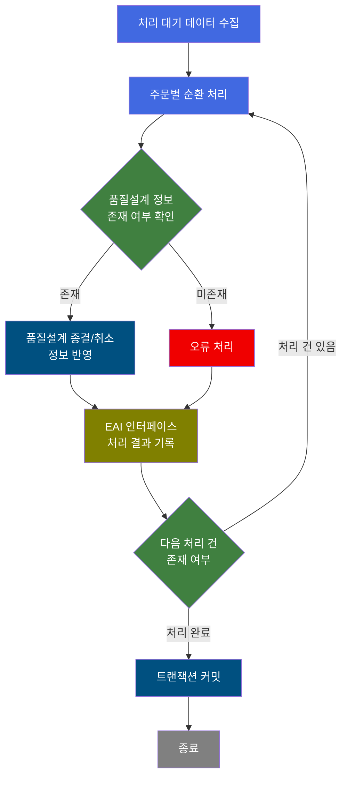
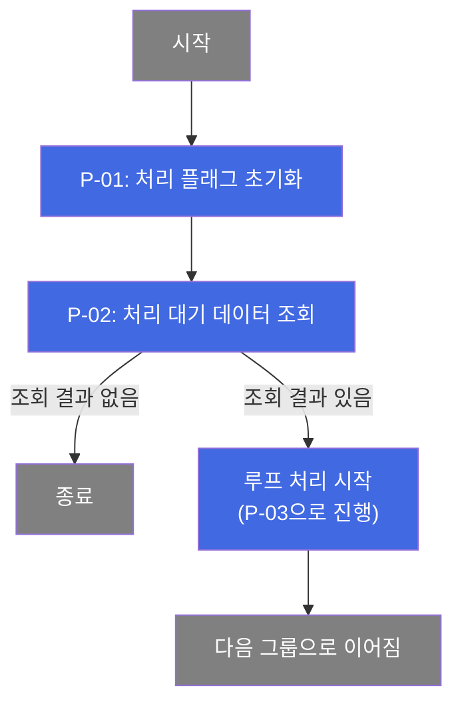
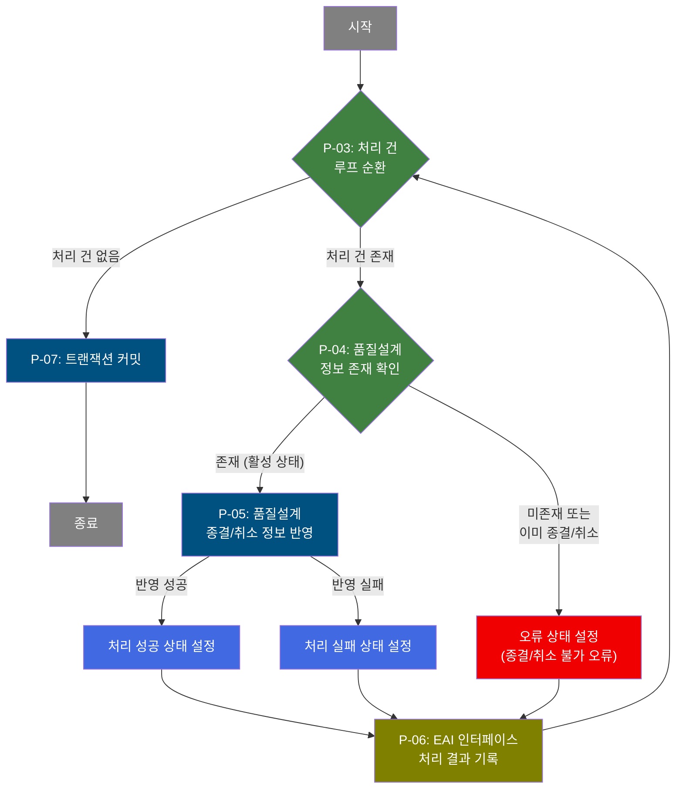

# B10R0040 비즈니스 프로세스 분석서 (BPA)

## 1. 시스템 개요

| 항목 | 내용 |
|------|------|
| 서비스 ID | B10R0040 |
| 업무명 | 주문 종결/취소 품질설계 정보 반영 (EAI 인터페이스 배치) |
| 서비스 타입 | nui |
| 분석 일시 | 2026-03-21 (KST) |
| 원본 분석일 | 2026-03-17 |
| 문서 버전 | 1.0 |

---

## 2. 시스템 목적

B10R0040은 외부 시스템(EAI)으로부터 수신된 주문 종결/취소 인터페이스 데이터를 처리하는 배치(NUI) 서비스이다. EAI 인터페이스 테이블에 처리 대기(XSTAT='D') 상태로 적재된 주문 종결·취소 요청 건을 순차적으로 읽어, MES 내부의 품질설계 공통 정보(TB_C10_QLT_DSN_CMN)에 종결/취소 사유 및 처리 유형을 반영한다.

처리 대상 주문이 품질설계 DB에 존재하는 경우 정상 반영하고, 이미 종결 또는 취소 상태인 경우 오류로 분류하여 인터페이스 결과를 EAI 테이블에 기록한다. 이를 통해 EAI 연동 시스템과 MES 내부의 주문 상태를 일관되게 유지한다.

본 서비스는 스케줄러 또는 배치 트리거에 의해 자동 실행되며, 처리 대기 건 전체를 1건씩 순회하여 각 건별로 검증 및 반영을 완료한 후 트랜잭션을 커밋한다. 처리 결과(성공/오류)는 EAI 인터페이스 테이블에 상태값으로 기록된다.

---

## 3. 핵심 워크플로우

---

## 4. 상세 워크플로우

### 프로세스 흐름도 — 처리 대기 데이터 수집 및 루프 초기화 (P-01, P-02)

### 프로세스 흐름도 — 건별 주문 종결/취소 처리 (P-03, P-04, P-05, P-06, P-07)

---

## 5. 비즈니스 로직 상세

P-01: 처리 플래그 초기화 — 배치 시작 시 처리 상태 플래그를 초기값으로 설정

- **입력**: 없음 (배치 서비스 진입 시점)
- **처리**:
  1. 처리 구분 플래그(P_PROC_FLAG)를 초기값 'C'로 설정하여 이후 처리에서 상태를 관리할 수 있도록 준비
- **출력**: 처리 컨텍스트 내 플래그 변수 초기화
- **예외**: 해당 없음

P-02: 처리 대기 데이터 조회 — EAI 인터페이스 테이블에서 처리 대기 주문 목록 수집

- **입력**: EAIAPUSER.TB_C10_B10R0040 (EAI 인터페이스 테이블)
- **처리**:
  1. EAI 인터페이스 테이블에서 처리 상태가 대기(XSTAT='D')인 전체 레코드 조회
  2. 인터페이스 그룹 ID 및 순서번호 기준으로 정렬하여 처리 순서 결정
- **출력**: 처리 대기 주문 목록 (ResultSet, 이후 루프 처리에 활용)
- **예외**: 조회 결과가 없으면 루프 처리 없이 서비스 종료

P-03: 처리 건 루프 순환 — 조회된 주문 목록을 1건씩 순차 처리

- **입력**: P-02에서 조회된 처리 대기 주문 ResultSet
- **처리**:
  1. ResultSet의 현재 처리 위치(남은 건수 카운터)를 관리
  2. 처리할 건이 남아 있으면 현재 Row의 주문 정보(주문번호, 주문라인, 취소 사유 등)를 처리 컨텍스트에 세팅
  3. 처리할 건이 없으면 루프를 종료하고 P-07(트랜잭션 커밋)으로 이동
  4. 매 루프 진입 시 오류 플래그(P_ERR_KEY, QLT_DSN_ERR_YN)를 초기화하고 배치 잡 플래그(BATCH_JOB)를 'true'로 설정
- **출력**: 처리 컨텍스트에 현재 건의 인터페이스 정보(IF_GRP_ID, SEQ_NO, XSEQ, 주문번호, 주문라인, 취소 유형, 취소 사유 등) 바인딩
- **예외**: ResultSet 키가 컨텍스트에 없거나 param-count 미설정 시 처리 실패

P-04: 품질설계 정보 존재 확인 — 해당 주문에 대한 활성 품질설계 레코드 존재 여부 검증

- **입력**: TB_C10_QLT_DSN_CMN (품질설계 공통 테이블), 현재 처리 건의 주문번호·주문라인
- **처리**:
  1. 주문번호와 주문라인을 조건으로 품질설계 공통 테이블에서 해당 레코드를 조회
  2. 조회 결과가 1건 이상이면 정상 처리 가능 상태로 판단(P-05로 진행)
  3. 조회 결과가 0건이면 품질설계 DB에 해당 주문이 없거나 이미 종결/취소된 것으로 판단(오류 처리)
- **출력**: 존재 여부에 따른 분기 결과
- **예외**: DB 조회 예외 발생 시 처리 실패로 분기

P-05: 품질설계 종결/취소 정보 반영 — MES 품질설계 공통 테이블에 종결/취소 정보 갱신

- **입력**: TB_C10_QLT_DSN_CMN (품질설계 공통 테이블), 현재 처리 건의 취소 사유 코드·상세 텍스트·주문 종결/취소 유형
- **처리**:
  1. 주문번호와 주문라인을 조건으로 TB_C10_QLT_DSN_CMN의 종결/취소 관련 항목(취소 사유 코드, 취소 상세 텍스트, 주문 종결/취소 유형, 품질설계 상태 코드) 갱신
  2. 감사 정보(최종 변경 객체 유형, 객체 ID, 프로그램 ID, 변경 일시) 함께 업데이트
  3. 반영 성공 시 성공 상태(XSTAT='S')를 설정하고, 실패 시 실패 상태를 설정하여 P-06으로 전달
- **출력**: TB_C10_QLT_DSN_CMN 갱신 완료, 처리 상태(XSTAT/XMSGS/XSTAT_CALLBACK) 설정
- **예외**: UPDATE 실패(반영 불가 상태) 시 실패 상태로 분기하여 P-06에서 오류로 기록

P-06: EAI 인터페이스 처리 결과 기록 — 처리 결과를 EAI 인터페이스 테이블에 갱신

- **입력**: EAIAPUSER.TB_C10_B10R0040 (EAI 인터페이스 테이블), 처리 결과 상태값(XSTAT, XMSGS, XSTAT_CALLBACK)
- **처리**:
  1. 인터페이스 그룹 ID, 순서번호, 시퀀스 키를 조건으로 해당 인터페이스 레코드를 특정
  2. 처리 상태(S: 성공, E: 오류), 오류 메시지, 콜백 상태를 기록
  3. 감사 정보(최종 변경 일시 등) 업데이트
  4. 기록 완료 후 루프로 복귀하여 P-03에서 다음 건 처리
- **출력**: EAIAPUSER.TB_C10_B10R0040의 처리 상태 갱신 완료
- **예외**: 해당 없음 (결과 기록은 성공/오류 모든 경우에 수행됨)

P-07: 트랜잭션 커밋 — 전체 처리 완료 후 변경 사항 확정

- **입력**: 트랜잭션 tx1 (주요 처리), tx2 (인터페이스 결과 기록)
- **처리**:
  1. 오류 키(P_ERR_KEY) 확인 후 tx1 트랜잭션 커밋
  2. 이후 tx2 트랜잭션 커밋
  3. 두 트랜잭션 모두 커밋 완료 후 서비스 종료
- **출력**: DB 변경 사항 영구 반영
- **예외**: exitFlag='N' 설정으로 오류 발생 시에도 즉시 종료하지 않고 이후 단계로 진행

---

## 6. 커스텀 클래스 워크플로우

### DbQualDesignLoop (약 171줄)

**역할**: EAI 인터페이스 테이블에서 조회된 처리 대기 주문 목록을 1건씩 순환 처리하기 위한 루프 제어 액티비티. 남은 처리 건수 카운터를 관리하고 현재 처리 Row의 데이터를 컨텍스트에 바인딩한다.

- 처리 건수가 0이 되면 루프를 종료하고 커밋 단계로 이동한다.
- 매 루프 진입 시 오류 플래그 및 배치 구분 플래그를 초기화하여 건별 독립 처리를 보장한다.
- `bind-result` 키로 이전 PosSearch 결과를 수신하며, `param0`~`param13`으로 주문번호·인터페이스 정보·취소 사유 등 14개 항목을 컨텍스트에 바인딩한다.
- 내부적으로 전체 커서 재탐색 방식을 사용하므로 처리 건수가 많을 경우 성능에 주의가 필요하다.

### DbCheckCnt (약 105줄)

**역할**: Service XML에서 지정한 SQL과 파라미터로 특정 테이블에 데이터가 존재하는지 확인하는 범용 카운트 조회 액티비티. 조회 결과 건수에 따라 true/false 전이를 반환한다.

- 본 서비스에서는 주문번호·주문라인을 조건으로 품질설계 공통 테이블(TB_C10_QLT_DSN_CMN) 조회에 사용된다.
- 조회 결과 1건 이상이면 true(정상 처리), 0건이면 false(오류 처리)로 분기한다.
- SQL Key와 파라미터를 Service XML Property로 주입받는 범용 구조로, 동일 클래스를 여러 서비스에서 재사용 가능하다.

---

## 7. 주요 유즈케이스

UC-01: EAI 주문 종결/취소 정상 반영

- **Actor**: 배치 스케줄러 (자동 실행)
- **목적**: EAI 인터페이스 테이블에 대기 중인 주문 종결/취소 요청을 MES 품질설계 정보에 반영
- **주요 흐름**:
  1. 배치 서비스 실행 시 처리 대기 상태(XSTAT='D') 주문 목록 전체 조회
  2. 각 주문에 대해 품질설계 공통 테이블에서 해당 레코드 존재 여부 확인
  3. 레코드가 존재하면 취소 사유 코드, 취소 상세 텍스트, 종결/취소 유형, 품질설계 상태 갱신
  4. 처리 성공 상태(XSTAT='S')를 EAI 인터페이스 테이블에 기록
  5. 전체 처리 완료 후 트랜잭션 커밋
- **예외**: 처리 대기 건이 없으면 루프 없이 즉시 종료

UC-02: 이미 종결/취소된 주문에 대한 오류 처리

- **Actor**: 배치 스케줄러 (자동 실행)
- **목적**: 품질설계 DB에 이미 종결 또는 취소된 주문에 대한 재처리 요청 시 오류를 기록하고 EAI에 알림
- **주요 흐름**:
  1. 처리 대기 주문에 대해 품질설계 공통 테이블 조회
  2. 해당 주문이 이미 종결/취소 상태이거나 레코드가 없으면 오류 분류
  3. 오류 상태(XSTAT='E') 및 오류 메시지("품질설계DB에 해당주문번호가 종결 또는 취소 되어 있습니다.")를 설정
  4. 콜백 상태(XSTAT_CALLBACK='R')를 포함하여 EAI 인터페이스 테이블에 오류 기록
  5. 오류 기록 후 다음 처리 건으로 루프 계속 진행
- **예외**: 오류 처리 후에도 루프는 중단되지 않고 나머지 처리 대기 건을 계속 처리

UC-03: 복수 주문 일괄 배치 처리

- **Actor**: 배치 스케줄러 (자동 실행)
- **목적**: 다수의 처리 대기 주문을 한 번의 배치 실행으로 일괄 처리
- **주요 흐름**:
  1. 배치 실행 시 모든 처리 대기 주문을 인터페이스 그룹 ID·순서번호 순으로 일괄 조회
  2. 루프 제어를 통해 1건씩 순차 처리 (검증 → 반영 → 결과 기록)
  3. 성공/오류 여부와 관계없이 모든 건을 처리한 후 트랜잭션 일괄 커밋
  4. tx1(품질설계 반영)과 tx2(인터페이스 결과 기록) 두 트랜잭션을 순차 커밋
- **예외**: 개별 건 처리 오류는 해당 건의 EAI 결과에만 기록되며 전체 배치를 중단하지 않음

---

## 9. 관련 엔티티

### 엔티티 목록

| 엔티티(테이블) | 설명 | 사용 유형 |
|---------------|------|----------|
| EAIAPUSER.TB_C10_B10R0040 | 주문 종결/취소 EAI 인터페이스 수신 테이블. 처리 대기 및 처리 결과 상태를 관리 | 조회/갱신 |
| TB_C10_QLT_DSN_CMN | 품질설계 공통 정보 테이블. 주문별 품질설계 상태, 종결/취소 정보를 저장 | 조회/갱신 |

### 엔티티 간 관계
- EAIAPUSER.TB_C10_B10R0040는 EAI 외부 시스템에서 수신된 주문 종결/취소 요청 데이터를 보관하며, 주문번호(ORD_NO)와 주문라인(ORD_LN)을 기준으로 TB_C10_QLT_DSN_CMN과 대응 관계를 가진다.
- TB_C10_QLT_DSN_CMN은 MES 내부에서 주문별 품질설계 상태를 관리하며, 본 서비스에 의해 EAI 수신 정보에 따라 종결/취소 상태로 갱신된다.

---

## 11. 특이사항 및 주의사항

### 1. 이중 트랜잭션 구조
서비스 종료 시 두 개의 트랜잭션(tx1, tx2)을 순차 커밋하는 구조를 사용한다. tx1은 품질설계 공통 테이블(TB_C10_QLT_DSN_CMN) 갱신을 커밋하고, tx2는 EAI 인터페이스 테이블(EAIAPUSER.TB_C10_B10R0040)의 처리 결과 기록을 커밋한다. 두 트랜잭션은 별도로 관리되어 품질설계 반영 실패 시에도 인터페이스 결과 기록은 독립적으로 처리될 수 있다.

### 2. 오류 건 비중단 처리 정책
처리 중 개별 주문에 오류가 발생하더라도 배치 전체를 중단하지 않는다. 오류 발생 시 해당 건의 EAI 인터페이스 상태를 오류(XSTAT='E')로 기록하고 다음 건 처리를 계속 진행한다. 이는 부분 실패가 허용되는 배치 처리 설계 원칙을 따르며, 운영 중 재처리 시 오류 건만 선별 처리가 가능하다.

### 3. EAI 스키마 분리 구조
MES 주 스키마(MESAPUSER)와 EAI 인터페이스 스키마(EAIAPUSER)가 분리되어 있으며, 각각 별도의 DAO(mesdao, eaidao)를 통해 접근한다. 이로 인해 EAI 인터페이스 테이블 조회/갱신과 품질설계 테이블 갱신이 별도 DB 연결을 사용하며, 트랜잭션 범위도 독립적으로 관리된다.

### 4. DbQualDesignLoop 성능 특성
루프 제어 액티비티(DbQualDesignLoop)는 매 루프마다 ResultSet 전체를 처음부터 재탐색하는 O(n²) 특성을 가진다. 처리 대기 건수가 소규모인 경우에는 문제가 없으나, 대량 적체 시(예: 100건 이상) 탐색 횟수가 누적 증가하므로 처리 대기 건수에 대한 모니터링이 필요하다.

### 5. 품질설계 상태 검증 조건
품질설계 공통 테이블에서 레코드 존재 여부 확인 시, 단순 주문번호·주문라인 일치 여부만 확인한다. 레코드가 존재하지 않거나 이미 종결/취소 상태(QLT_DSN_STS_CD 조건)인 경우 오류 처리된다. 오류 메시지("품질설계DB에 해당주문번호가 종결 또는 취소 되어 있습니다.")가 EAI 테이블에 기록되므로, 외부 시스템에서 해당 메시지를 통해 처리 불가 사유를 확인할 수 있다.
