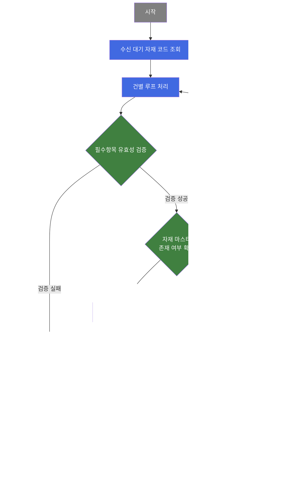
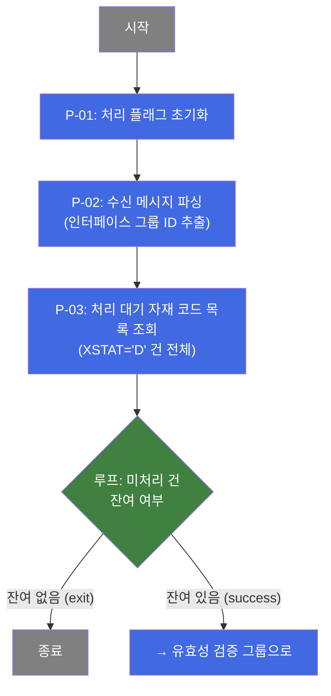
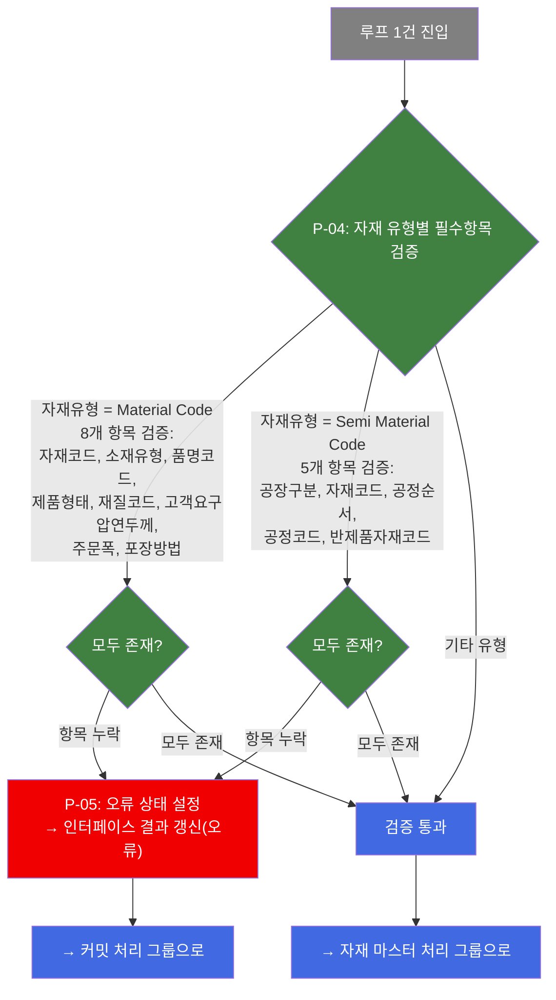
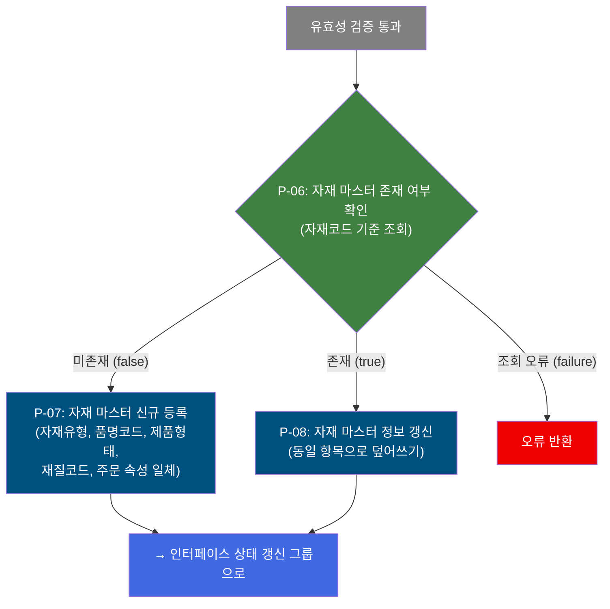
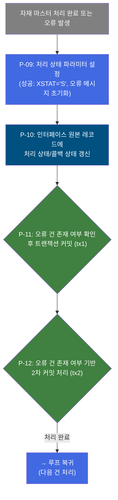

# B10R0050 비즈니스 프로세스 분석서 (BPA)

## 1. 시스템 개요

| 항목 | 내용 |
|------|------|
| 서비스 ID | B10R0050 |
| 업무명 | ERP/OMS 수신 자재 코드(Material Code) 마스터 등록/갱신 |
| 서비스 타입 | nui |
| 분석 일시 | 2026-03-21 (KST) |
| 원본 분석일 | 2026-03-17 |
| 문서 버전 | 1.0 |

---

## 2. 시스템 목적

B10R0050은 ERP 또는 OMS 외부 시스템에서 EAI(인터페이스) 채널을 통해 전송된 자재 코드(Material Code) 정보를 MES 자재 마스터에 반영하는 배치(NUI) 서비스이다. 수신 데이터를 처리 대기 상태에서 조회한 뒤 건별로 검증하고, 신규 자재는 등록하며 기존 자재는 갱신한다.

이 서비스는 주기적으로 기동되어 EAI 인터페이스 테이블에 쌓인 미처리 자재 코드 정보를 일괄 소진한다. 처리 대상은 Material Code(완성 자재)와 Semi Material Code(반제품 자재) 두 가지로 구분되며, 각각 요구되는 필수 항목이 다르다. 필수 항목이 누락된 건은 오류로 처리하고, 이상 없는 건만 MES 자재 마스터에 반영한다.

처리 완료 후에는 인터페이스 원본 레코드에 처리 상태(성공/실패)를 기록하여 ERP/OMS 측이 처리 결과를 확인할 수 있도록 콜백 상태를 관리한다.

---

## 3. 핵심 워크플로우

---

## 4. 상세 워크플로우

### 프로세스 흐름도 — 수신 데이터 조회 및 루프 제어 (P-01, P-02)

### 프로세스 흐름도 — 필수항목 유효성 검증 (P-04)

### 프로세스 흐름도 — 자재 마스터 등록/갱신 (P-06, P-07, P-08)

### 프로세스 흐름도 — 인터페이스 처리 결과 갱신 및 커밋 (P-09, P-10, P-11)

---

## 5. 비즈니스 로직 상세

P-01: 처리 플래그 초기화 — 배치 시작 시 처리 구분 플래그를 초기 상태로 설정

- **입력**: 없음 (배치 기동 트리거)
- **처리**:
  1. 처리 진행 플래그(`P_PROC_FLAG`)를 `"C"` (Continue/초기)로 설정
- **출력**: 처리 컨텍스트에 초기 플래그 값 세팅
- **예외**: 없음

P-02: 수신 메시지 파싱 — 인터페이스 그룹 ID 추출

- **입력**: 배치 기동 시 전달된 메시지 페이로드 (구분자 기반 레이아웃)
- **처리**:
  1. 구분자(delimiterLayout) 기반으로 메시지를 파싱하여 인터페이스 그룹 ID(`IF_GRP_ID`) 추출
- **출력**: 컨텍스트에 `IF_GRP_ID` 세팅
- **예외**: 파싱 실패 시 후속 처리 중단

P-03: 처리 대기 자재 코드 목록 조회 — EAI 인터페이스 테이블에서 미처리 건 전체 조회

- **입력**: 컨텍스트의 `IF_GRP_ID`
- **처리**:
  1. EAI 인터페이스 테이블(TB_C10_B10R0050)에서 해당 그룹 ID이면서 처리 상태가 대기(`XSTAT='D'`)인 레코드를 SEQ_NO, XSEQ 순으로 전체 조회
- **출력**: 처리 대상 자재 코드 목록(RK_SEARCH) 컨텍스트에 저장
- **예외**: 조회 결과 0건이면 루프 즉시 종료

P-04: 자재 유형별 필수항목 유효성 검증 — 품질설계사양구분에 따라 필수 항목 null 체크

- **입력**: 루프 현재 건의 자재 유형 구분값 및 각 속성 항목
- **처리**:
  1. 품질설계사양구분이 "1"(Material Code)이면 8개 필수 항목 존재 여부 확인: 자재코드, 소재유형, 품명코드, 제품형태, 재질코드, 고객요구압연두께, 주문폭, 포장방법
  2. 품질설계사양구분이 "2"(Semi Material Code)이면 5개 필수 항목 존재 여부 확인: 공장구분, 자재코드, 공정순서, 공정코드, 반제품 자재코드
  3. 그 외 유형은 검증 없이 통과
- **출력**: 검증 결과(SUCCESS 또는 FAILURE)를 전이로 반환
- **예외**: 필수 항목 누락 시 FAILURE 반환, 에러 로그 기록

P-05: 인터페이스 결과 오류 갱신 — 유효성 검증 실패 건에 대한 오류 상태 기록

- **입력**: 처리 실패 건의 인터페이스 식별 키(IF_GRP_ID, SEQ_NO, XSEQ)
- **처리**:
  1. 인터페이스 원본 레코드의 처리 상태를 오류로 설정 준비
  2. P-10(인터페이스 갱신)으로 연결되어 오류 상태 기록
- **출력**: 오류 상태가 인터페이스 테이블에 반영됨
- **예외**: 없음

P-06: 자재 마스터 존재 여부 확인 — 자재코드 기준으로 마스터 테이블 보유 여부 조회

- **입력**: 현재 처리 건의 자재코드(MTL_CD)
- **처리**:
  1. 자재 마스터 테이블(TB_C10_MTL_MST)에서 해당 자재코드로 단일 레코드 조회
  2. 결과 건수가 1건 이상이면 "기존 자재(true)", 0건이면 "신규 자재(false)" 전이 반환
- **출력**: 존재 여부에 따른 분기 전이
- **예외**: 조회 오류 시 FAILURE 반환

P-07: 자재 마스터 신규 등록 — 신규 자재 코드 정보를 MES 마스터에 최초 등록

- **입력**: 수신 건의 자재 정보 (자재코드, 소재유형, 품명코드, 제품형태, 재질코드, 주문 관련 속성 16개 항목)
- **처리**:
  1. 자재 마스터 테이블(TB_C10_MTL_MST)에 신규 레코드 INSERT
  2. 생성 메타데이터(생성자, 생성일시) 및 감사 메타데이터 함께 저장
- **출력**: TB_C10_MTL_MST에 신규 자재 1건 등록
- **예외**: INSERT 실패 시 오류 처리

P-08: 자재 마스터 정보 갱신 — 기존 자재 마스터 레코드의 속성 정보 업데이트

- **입력**: 수신 건의 자재 정보 (자재코드 기준, 17개 항목)
- **처리**:
  1. 자재 마스터 테이블(TB_C10_MTL_MST)에서 자재코드 기준으로 기존 레코드 UPDATE
  2. 감사 메타데이터(최종변경자, 변경일시) 갱신
- **출력**: TB_C10_MTL_MST 기존 자재 1건 갱신
- **예외**: UPDATE 실패 시 오류 처리

P-09: 처리 상태 파라미터 설정 — 인터페이스 갱신 전 처리 성공 상태값 세팅

- **입력**: 없음 (이전 단계 정상 완료 가정)
- **처리**:
  1. 처리 상태를 `"S"` (Success)로 설정
  2. 오류 메시지 필드를 null로 초기화
  3. 콜백 상태 필드를 null로 초기화
- **출력**: 컨텍스트에 성공 상태 파라미터 세팅
- **예외**: 없음

P-10: 인터페이스 원본 레코드 처리 결과 갱신 — EAI 인터페이스 테이블의 처리 상태 업데이트

- **입력**: 인터페이스 식별 키(IF_GRP_ID, SEQ_NO, XSEQ), 처리 상태(XSTAT), 오류 메시지(XMSGS), 콜백 상태(XSTAT_CALLBACK)
- **처리**:
  1. EAI 인터페이스 테이블(TB_C10_B10R0050)의 해당 레코드를 PK 기준으로 UPDATE
  2. 처리 상태, 오류 메시지, 콜백 상태 및 감사 정보(최종변경자, 변경일시) 기록
- **출력**: TB_C10_B10R0050 해당 건의 처리 결과 반영
- **예외**: UPDATE 실패 시 오류 처리

P-11: 1차 트랜잭션 커밋 — 자재 마스터 처리 결과 및 인터페이스 상태 갱신을 단건 단위로 커밋

- **입력**: 오류 키 존재 여부 확인(P_ERR_KEY)
- **처리**:
  1. 처리 오류 여부를 확인하여 조건부 커밋 수행(tx1)
  2. 정상 처리 건과 오류 건 모두 커밋하여 인터페이스 상태가 반영되도록 함
- **출력**: 단건 처리 결과 DB에 영구 반영
- **예외**: 커밋 실패 시 롤백

P-12: 2차 트랜잭션 커밋 — 전체 루프 완료 후 최종 커밋 처리

- **입력**: 오류 키 존재 여부 확인(P_ERR_KEY)
- **처리**:
  1. tx2 트랜잭션 범위의 최종 커밋 수행
  2. 루프 완료 이후 잔여 트랜잭션 정리
- **출력**: 최종 처리 결과 확정
- **예외**: 커밋 실패 시 오류 처리

---

## 6. 커스텀 클래스 워크플로우

### DbSearchMtlData (약 105줄)

**역할**: 수신된 자재 코드 데이터의 품질설계사양구분에 따라 필수 항목 존재 여부를 검증하는 Gate Keeper 액티비티. DB 조회 없이 컨텍스트 값만 체크하는 순수 유효성 검증 클래스.

- Material Code(유형 "1") 검증 대상: 자재코드, 소재유형, 품명코드, 제품형태, 재질코드, 고객요구압연두께, 주문폭, 포장방법 (8개)
- Semi Material Code(유형 "2") 검증 대상: 공장구분, 자재코드, 공정순서, 공정코드, 반제품 자재코드 (5개)
- 그 외 유형은 검증 없이 SUCCESS 반환

---

### DbCheckCnt (약 105줄)

**역할**: 특정 테이블에 데이터 존재 유무를 확인하는 범용 카운트 조회 액티비티. SQL Key와 파라미터를 서비스 Property로 동적으로 구성하여 조회 결과 건수에 따라 true/false 전이를 반환한다. 이 서비스에서는 자재 마스터 테이블의 해당 자재코드 존재 여부를 확인하는 데 활용된다.

- 조회 결과 1건 이상: `true` 전이 → 자재 마스터 갱신으로 분기
- 조회 결과 0건: `false` 전이 → 자재 마스터 신규 등록으로 분기
- 조회 예외: `failure` 전이 → 오류 처리

---

### DbQualDesignLoop (약 171줄)

**역할**: 이전 조회 단계에서 얻은 ResultSet을 1건씩 순회 처리하기 위한 루프 제어 액티비티. 건별로 컨텍스트에 데이터를 바인딩하고 루프 카운터를 관리하여 후속 검증/처리 액티비티가 단건 단위로 동작하도록 연결한다. 40개 이상의 서비스에서 공유 사용되는 공통 컴포넌트이다.

- 루프 최초 진입 시 전체 처리 건수로 카운터 초기화
- 매 루프마다 에러 플래그(`P_ERR_KEY`, `QLT_DSN_ERR_YN`) 및 배치 잡 플래그(`BATCH_JOB`) 재초기화
- 현재 처리 Row를 역방향 카운터 방식으로 특정하여 컨텍스트에 바인딩
- 잔여 건수 0이 되면 `"exit"` 전이로 루프 종료
- `param-count` 미설정 또는 예외 발생 시 `"failure"` 반환
- 주의: 매 루프마다 ResultSet을 처음부터 재탐색하는 O(n²) 특성이 있으므로 대량 처리 시 성능 고려 필요

---

## 7. 주요 유즈케이스

UC-01: 신규 자재 코드 배치 등록

- **Actor**: ERP/OMS 시스템 (자재 코드 발신), MES 배치 스케줄러 (수신 처리)
- **목적**: ERP에서 신규 생성된 자재 코드를 MES 자재 마스터에 자동 등록
- **주요 흐름**:
  1. 배치 스케줄러가 B10R0050 서비스를 기동하며 인터페이스 그룹 ID 전달
  2. EAI 인터페이스 테이블에서 처리 대기(XSTAT='D') 자재 코드 목록 조회
  3. 각 건에 대해 자재 유형별 필수 항목 유효성 검증 수행
  4. 검증 통과 건에 대해 자재 마스터에 미등록된 자재 코드를 신규 등록
  5. 인터페이스 원본 레코드에 처리 완료 상태(XSTAT='S') 갱신 후 커밋
- **예외**: 필수 항목 누락 건은 오류 상태로 갱신되며 마스터 등록 없이 건너뜀

UC-02: 기존 자재 코드 속성 갱신

- **Actor**: ERP/OMS 시스템 (자재 속성 변경 발신), MES 배치 스케줄러
- **목적**: ERP에서 변경된 자재 속성 정보를 MES 자재 마스터에 반영
- **주요 흐름**:
  1. 수신 자재 코드가 이미 MES 자재 마스터에 등록된 경우
  2. 유효성 검증 통과 후 자재 마스터 존재 여부 조회에서 "기존(true)" 판정
  3. 자재 마스터 레코드를 수신 데이터로 덮어쓰기(UPDATE) 수행
  4. 인터페이스 원본 레코드에 처리 완료 상태 갱신 후 커밋
- **예외**: 갱신 실패 시 오류 상태로 기록

UC-03: 유효성 검증 실패 처리

- **Actor**: MES 배치 스케줄러, 업무 담당자 (오류 확인)
- **목적**: 필수 항목이 누락된 자재 코드 수신 건을 오류 처리하여 추후 재처리 가능하도록 관리
- **주요 흐름**:
  1. 필수 항목 검증 단계에서 누락 항목 감지
  2. 자재 마스터 처리(등록/갱신) 없이 오류 상태 파라미터 설정
  3. 인터페이스 원본 레코드에 오류 상태와 오류 메시지 기록
  4. 커밋 후 다음 건으로 루프 진행
- **예외**: 오류 기록 자체가 실패하면 트랜잭션 롤백

---

## 9. 관련 엔티티

### 엔티티 목록

| 엔티티(테이블) | 설명 | 사용 유형 |
|---------------|------|----------|
| TB_C10_B10R0050 | EAI를 통해 수신된 자재 코드 인터페이스 원본 데이터 저장 테이블 | 조회/갱신 |
| TB_C10_MTL_MST | MES 자재 마스터 테이블. 자재코드별 제품 속성 및 주문 속성 관리 | 조회/저장/갱신 |

### 엔티티 간 관계

- TB_C10_B10R0050은 ERP/OMS에서 수신된 자재 코드 원본 데이터를 보관하며, 처리 완료 후 처리 상태가 갱신된다.
- TB_C10_MTL_MST는 MES에서 사용하는 자재 마스터로, TB_C10_B10R0050에 수신된 자재코드를 기준으로 신규 등록 또는 갱신이 이루어진다.
- 두 테이블은 자재코드(MTL_CD)로 논리적으로 연결되며, 인터페이스 처리 후 마스터 데이터가 동기화된다.

---

## 11. 특이사항 및 주의사항

### 1. 단건 커밋 전략으로 부분 성공 보장
각 자재 코드 건은 처리 완료 즉시 커밋(tx1)되어, 루프 도중 오류가 발생하더라도 이미 처리된 건의 결과는 보존된다. 이를 통해 일부 건의 오류가 전체 배치를 롤백시키지 않도록 설계되어 있다. 오류 건은 오류 상태로 기록되어 추후 재처리가 가능하다.

### 2. 이중 커밋 구조(tx1/tx2)
자재 마스터 처리 완료 후 tx1으로 단건 커밋하고, 루프 종료 이후 tx2로 2차 커밋을 수행하는 이중 트랜잭션 구조를 가진다. 오류 건 존재 여부(P_ERR_KEY)에 따라 조건부로 커밋이 실행되어, 오류 발생 시에도 인터페이스 상태 갱신은 반드시 반영된다.

### 3. 자재 유형별 상이한 필수 항목 검증
Material Code와 Semi Material Code는 서로 다른 필수 항목을 요구한다. Material Code는 주문/제품 특성 중심의 8개 항목, Semi Material Code는 공장/공정 식별 중심의 5개 항목을 검증한다. 필수 항목 누락 시 에러 로그만 기록하고 마스터 처리를 건너뛰는 소프트 오류 방식으로 처리된다.

### 4. EAI 인터페이스 테이블 이중 역할
TB_C10_B10R0050 테이블은 수신 원본 데이터 저장소이자 처리 상태 관리 테이블의 역할을 겸한다. 처리 전 XSTAT='D'(대기), 처리 성공 시 XSTAT='S'(성공)로 갱신되며, 오류 시 오류 메시지(XMSGS) 및 콜백 상태(XSTAT_CALLBACK)가 함께 기록된다. ERP/OMS 측은 이 상태값으로 처리 결과를 확인한다.

### 5. DbQualDesignLoop 성능 특성
루프 제어 클래스(DbQualDesignLoop)는 매 루프마다 ResultSet을 처음부터 재탐색하는 O(n²) 방식으로 동작한다. 처리 건수가 적은 경우에는 문제가 없으나, 100건 이상의 대량 수신 시 탐색 횟수가 누적 증가하여 처리 시간이 비선형적으로 늘어날 수 있다.
