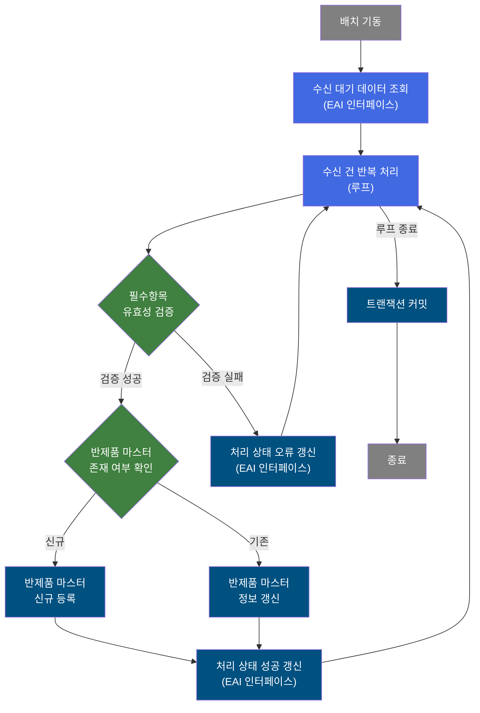
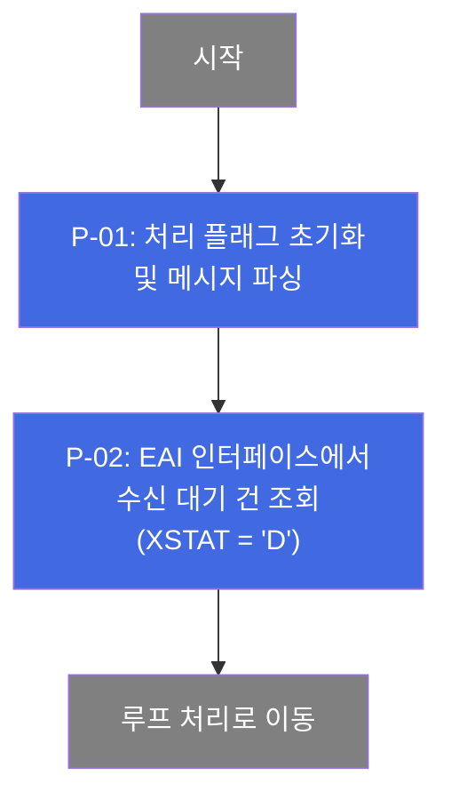
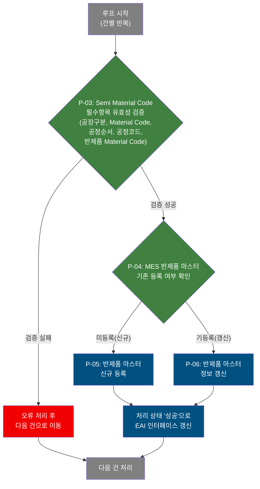
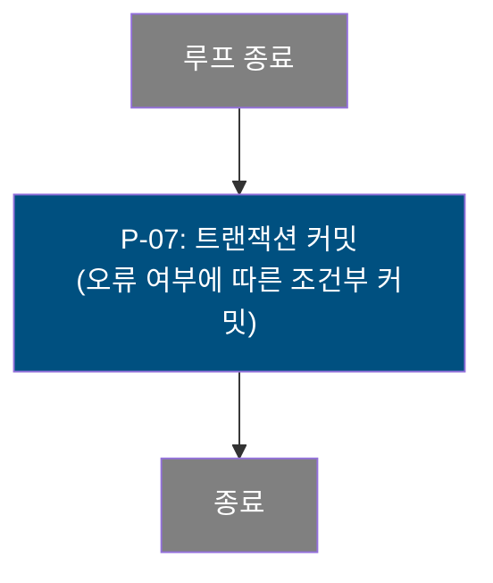

# B10R0060 비즈니스 프로세스 분석서 (BPA)

## 1. 시스템 개요

| 항목 | 내용 |
|------|------|
| 서비스 ID | B10R0060 |
| 업무명 | Semi Material Code(반제품 자재 코드) 수신 처리 |
| 서비스 타입 | nui |
| 분석 일시 | 2026-03-21 (KST) |
| 원본 분석일 | 2026-03-17 |
| 문서 버전 | 1.0 |

---

## 2. 시스템 목적

B10R0060은 EAI(외부 인터페이스) 시스템을 통해 ERP/OMS에서 수신된 Semi Material Code(반제품 자재 코드) 정보를 MES의 반제품 자재 마스터에 반영하는 배치 처리 서비스이다. 외부 시스템이 인터페이스 테이블에 적재한 수신 대기 데이터를 순차적으로 읽어 유효성을 검증하고, MES 내 반제품 마스터의 신규 등록 또는 기존 정보 갱신을 수행한다.

처리 대상은 특정 Interface Group에 속하며 미처리 상태('D')인 Semi Material Code 건들이다. 각 건에 대해 공장/공정/자재 코드 등 필수 항목 존재 여부를 확인하고, MES 반제품 마스터의 등록 이력 유무에 따라 신규 INSERT 또는 UPDATE를 선택한다. 처리 완료 후에는 인터페이스 테이블의 해당 건 처리 상태를 성공('S')으로 갱신하여 EAI와의 처리 결과를 동기화한다.

이 서비스는 자재 마스터 동기화 배치의 일환으로 스케줄러 또는 EAI 콜백에 의해 자동 기동되며, 운영자의 직접 개입 없이 반제품 자재 정보를 최신 상태로 유지하는 역할을 한다.

---

## 3. 핵심 워크플로우

---

## 4. 상세 워크플로우

### 프로세스 흐름도 — 수신 데이터 처리 초기화 및 조회 (P-01, P-02)

### 프로세스 흐름도 — 반제품 자재 마스터 연동 처리 (P-03, P-04, P-05, P-06)

### 프로세스 흐름도 — 트랜잭션 완료 (P-07)

---

## 5. 비즈니스 로직 상세

P-01: 처리 초기화 및 메시지 파싱 — 배치 처리 플래그 초기화 후 수신 메시지 파싱

- **입력**: 배치 기동 파라미터 (Interface Group ID 포함 메시지)
- **처리**:
  1. 처리 진행 플래그(P_PROC_FLAG)를 초기 상태('C')로 설정
  2. 수신 메시지를 구분자 기반으로 파싱하여 Interface Group ID 추출
- **출력**: 파싱된 Interface Group ID가 처리 컨텍스트에 설정됨
- **예외**: 메시지 파싱 실패 시 이후 조회 단계에서 데이터 미조회

P-02: EAI 수신 대기 데이터 조회 — 처리 대기 상태의 Semi Material Code 건 목록 조회

- **입력**: Interface Group ID
- **처리**:
  1. EAI 인터페이스(TB_C10_B10R0060)에서 해당 Interface Group ID에 속하며 처리 상태가 대기('D')인 건들을 SEQ_NO, XSEQ 순으로 조회
- **출력**: 처리 대기 중인 Semi Material Code 수신 건 목록
- **예외**: 조회 결과 0건인 경우 루프 즉시 종료, 이후 처리 없음

P-03: 필수항목 유효성 검증 — Semi Material Code 처리에 필요한 필수 항목 존재 여부 검증

- **입력**: 현재 처리 대상 건의 수신 데이터 (루프에서 바인딩된 컨텍스트 값)
- **처리**:
  1. prodSpecKind = '2' (Semi Material Code) 기준으로 5개 필수항목 null/empty 여부 일괄 검증: 공장구분, Material Code, 공정순서, 공정코드, 반제품 Material Code
  2. 하나라도 누락된 경우 검증 실패로 처리하여 해당 건을 건너뜀
- **출력**: 검증 성공 시 후속 마스터 존재 확인 단계로 진행; 실패 시 오류 처리
- **예외**: 필수항목 누락 → 오류 로그 기록 후 해당 건 처리 실패, 다음 건으로 계속

P-04: 반제품 마스터 존재 여부 확인 — MES 반제품 자재 마스터의 기등록 여부 분기 결정

- **입력**: Material Code, 공장구분, 공정순서, 공정코드 (복합 키)
- **처리**:
  1. MES 반제품 자재 마스터(TB_C10_MTL_SEM_PROD)에서 자재-공장-공정 복합키 조건으로 기존 데이터 존재 여부 확인
  2. 존재 시 P-06(갱신) 경로, 미존재 시 P-05(신규 등록) 경로로 분기
- **출력**: 분기 결과에 따라 P-05 또는 P-06으로 진행
- **예외**: DB 조회 오류 발생 시 해당 건 실패 처리

P-05: 반제품 마스터 신규 등록 — 미등록 반제품 자재 정보를 MES 마스터에 신규 INSERT

- **입력**: Material Code, 공장구분, 공정순서, 공정코드, 반제품 Material Code
- **처리**:
  1. 반제품 자재 마스터(TB_C10_MTL_SEM_PROD)에 신규 레코드 INSERT
  2. 감사 정보(생성 일시, 생성 프로그램 등) 자동 기록
- **출력**: TB_C10_MTL_SEM_PROD에 신규 레코드 등록 완료
- **예외**: INSERT 실패 시 오류 반환, 처리 상태 갱신 단계에서 오류 상태로 기록

P-06: 반제품 마스터 정보 갱신 — 기등록된 반제품 자재 정보를 최신 수신 데이터로 UPDATE

- **입력**: Material Code, 공장구분, 공정순서, 공정코드, 반제품 Material Code (복합 키 + 갱신 값)
- **처리**:
  1. 반제품 자재 마스터(TB_C10_MTL_SEM_PROD)에서 자재-공장-공정 복합키로 기존 레코드를 찾아 반제품 Material Code 및 감사 정보 갱신
- **출력**: TB_C10_MTL_SEM_PROD 해당 레코드 갱신 완료
- **예외**: UPDATE 실패 시 오류 반환, 처리 상태 갱신 단계에서 오류 상태로 기록

P-07: 트랜잭션 커밋 — 전체 루프 처리 완료 후 두 단계 조건부 커밋 수행

- **입력**: 처리 중 발생한 오류 여부 플래그(P_ERR_KEY)
- **처리**:
  1. 1차 커밋(tx1): 반제품 마스터(TB_C10_MTL_SEM_PROD) 변경사항 커밋
  2. 오류 여부 확인 후 2차 커밋(tx2): EAI 인터페이스(TB_C10_B10R0060) 상태 갱신 커밋
  3. 두 단계 커밋으로 MES 마스터 변경과 EAI 상태 갱신을 분리 관리
- **출력**: 모든 변경사항 DB에 영구 반영
- **예외**: 커밋 실패 시 트랜잭션 롤백

---

## 6. 커스텀 클래스 워크플로우

### DbSearchMtlData (약 105줄)

**역할**: EAI에서 수신된 Material Code 데이터에 대해 품질설계사양구분(prodSpecKind)에 따라 필수항목 null/empty 여부를 검증하는 게이트키퍼 역할의 유효성 검증 Activity. DB 조회 없이 순수 유효성 검증만 수행하며, prodSpecKind='2'(Semi Material Code) 기준으로 공장구분, Material Code, 공정순서, 공정코드, 반제품 Material Code 5개 항목을 검증한다. 검증 통과 시 SUCCESS, 하나라도 누락 시 FAILURE를 반환한다.

---

### DbCheckCnt (약 105줄)

**역할**: Service XML Property로 지정된 SQL과 파라미터를 이용해 특정 조건의 데이터가 DB에 존재하는지 건수를 확인하고, 결과에 따라 TRUE/FALSE/FAILURE transition을 반환하는 범용 존재 여부 확인 Activity. B10R0060에서는 반제품 자재 마스터(TB_C10_MTL_SEM_PROD) 기등록 여부 분기에 활용된다.

---

### DbQualDesignLoop (약 171줄)

**역할**: 이전 조회 액티비티가 반환한 ResultSet을 1건씩 순차 처리하기 위한 루프 제어 Activity. 역방향 카운터(procCount) 기반으로 처리 건수를 관리하고, 매 루프 진입 시 오류 플래그와 품질설계 에러 여부를 초기화한다. procCount가 0이 되면 'exit' 전이를 반환하여 루프를 종료한다. 40개 이상 NUI 서비스에서 공유 사용되는 공통 컴포넌트이다.

---

## 7. 주요 유즈케이스

UC-01: EAI 수신 Semi Material Code 신규 등록

- **Actor**: 배치 스케줄러 / EAI 시스템
- **목적**: ERP/OMS에서 신규 반제품 자재 코드 정보를 수신하여 MES 반제품 마스터에 최초 등록
- **주요 흐름**:
  1. Interface Group ID에 해당하는 수신 대기('D') 건을 EAI 인터페이스에서 조회
  2. 각 건에 대해 필수항목(공장구분, Material Code, 공정순서, 공정코드, 반제품 Material Code) 유효성 검증
  3. MES 반제품 자재 마스터에 해당 자재-공장-공정 복합키 기준으로 미등록 확인
  4. 반제품 자재 마스터에 신규 INSERT
  5. EAI 인터페이스의 해당 건 처리 상태를 성공('S')으로 갱신
- **예외**: 필수항목 누락 시 해당 건 처리 건너뜀, 나머지 건 계속 처리

UC-02: EAI 수신 Semi Material Code 기존 정보 갱신

- **Actor**: 배치 스케줄러 / EAI 시스템
- **목적**: ERP/OMS에서 변경된 반제품 자재 코드 정보를 수신하여 MES 반제품 마스터 갱신
- **주요 흐름**:
  1. Interface Group ID에 해당하는 수신 대기('D') 건을 EAI 인터페이스에서 조회
  2. 각 건에 대해 필수항목 유효성 검증
  3. MES 반제품 자재 마스터에 해당 자재-공장-공정 복합키 기준으로 기등록 레코드 확인
  4. 기등록 레코드의 반제품 Material Code 및 감사 정보 UPDATE
  5. EAI 인터페이스의 해당 건 처리 상태를 성공('S')으로 갱신
- **예외**: DB 오류 발생 시 해당 건 오류 상태 기록 후 다음 건 계속 처리

UC-03: 필수항목 누락 건 처리 건너뜀

- **Actor**: 배치 스케줄러
- **목적**: 유효하지 않은 수신 데이터를 마스터에 반영하지 않고 안전하게 건너뜀으로써 데이터 정합성 보호
- **주요 흐름**:
  1. 수신 대기 건에 대해 필수항목 검증 수행
  2. 공장구분, Material Code, 공정순서, 공정코드, 반제품 Material Code 중 하나라도 누락 감지
  3. 오류 로그 기록 후 해당 건을 FAILURE 처리
  4. 루프는 다음 건으로 계속 진행
- **예외**: 필수항목 누락 건은 EAI 인터페이스 상태가 갱신되지 않아 재처리 대상으로 남을 수 있음

---

## 9. 관련 엔티티

### 엔티티 목록

| 엔티티(테이블) | 설명 | 사용 유형 |
|---------------|------|----------|
| TB_C10_B10R0060 | EAI 인터페이스를 통해 외부 시스템에서 수신된 Semi Material Code 수신 데이터 테이블 (EAIAPUSER 스키마) | 조회 / 갱신 |
| TB_C10_MTL_SEM_PROD | MES 반제품 자재 마스터. 자재-공장-공정 복합키로 반제품 자재 코드를 관리 (MESAPUSER 스키마) | 조회 / 저장 / 갱신 |

### 엔티티 간 관계

- TB_C10_B10R0060은 EAI를 통해 수신된 원시 데이터를 보관하는 인터페이스 테이블로, 처리 완료 후 처리 상태만 갱신된다.
- TB_C10_MTL_SEM_PROD은 TB_C10_B10R0060의 수신 데이터를 기반으로 구성되는 MES 내부 반제품 자재 마스터이며, 수신 건의 자재-공장-공정 정보를 검증 후 등록 또는 갱신하여 최신 상태를 유지한다.
- 두 테이블은 직접적인 외래키 관계 없이 배치 처리를 통해 데이터가 동기화된다.

---

## 11. 특이사항 및 주의사항

### 1. 두 스키마 간 조건부 2단계 커밋 구조

서비스는 MES 반제품 마스터(MESAPUSER: TB_C10_MTL_SEM_PROD) 변경을 위한 tx1 커밋과 EAI 인터페이스 상태 갱신(EAIAPUSER: TB_C10_B10R0060) 위한 tx2 커밋이 분리되어 순차 처리된다. 이는 MES 마스터 갱신과 EAI 처리 완료 기록을 별도 트랜잭션으로 관리하기 위한 설계로, 한 스키마 커밋 실패 시 다른 스키마 상태와 불일치가 발생할 수 있어 운영 모니터링이 필요하다.

### 2. 루프 처리 방식의 성능 특성

PROC_LOOP(DbQualDesignLoop)는 역방향 카운터 기반의 루프 제어 방식으로, 매 루프마다 ResultSet을 처음부터 재탐색하는 O(n²) 탐색 구조를 가진다. 수신 건수가 적을 때는 문제가 없으나, 대량 수신 시(100건 이상) 탐색 횟수가 누적 증가하므로 처리 시간이 선형이 아닌 이차적으로 증가할 수 있다. 대량 배치 운영 시 성능 모니터링이 권장된다.

### 3. 필수항목 누락 건의 EAI 상태 미갱신 처리

필수항목 검증(B10R_CHK)에서 FAILURE가 반환된 건은 반제품 마스터 처리가 건너뛰어지며, EAI 인터페이스 테이블(TB_C10_B10R0060)의 처리 상태 또한 성공('S')으로 갱신되지 않는다. 이로 인해 필수항목 누락 건은 다음 배치 실행 시 재처리 대상으로 남을 수 있으므로, EAI 인터페이스 모니터링을 통해 장기 미처리 건 발생 여부를 확인해야 한다.

### 4. prodSpecKind = '2' 전용 처리

이 서비스(B10R0060)는 반제품 자재 코드(prodSpecKind='2') 전용으로 설계되어 있다. DbSearchMtlData 클래스는 prodSpecKind='1'(완성 Material Code)과 '2'(Semi Material Code) 양쪽을 지원하나, B10R0060은 서비스 Property에서 prodSpecKind='2'로 고정 지정하여 Semi Material Code 처리에 특화된다. prodSpecKind 값이 '1'도 '2'도 아닌 경우 유효성 검증 없이 성공으로 통과되는 예외 케이스가 존재한다.
