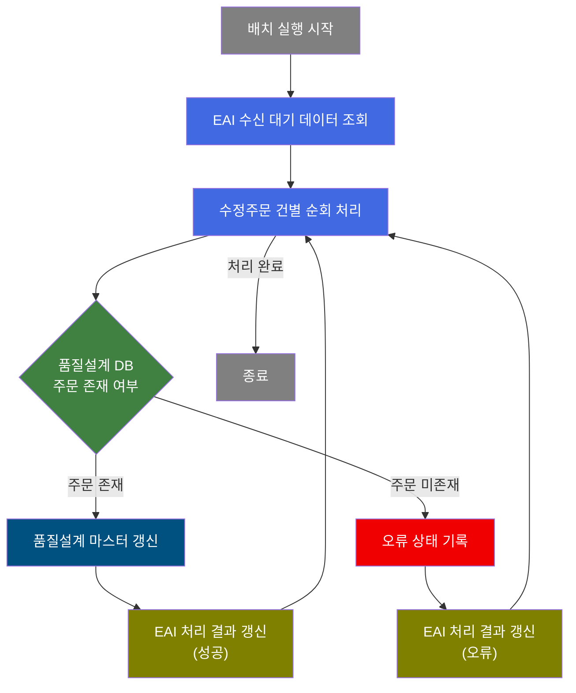
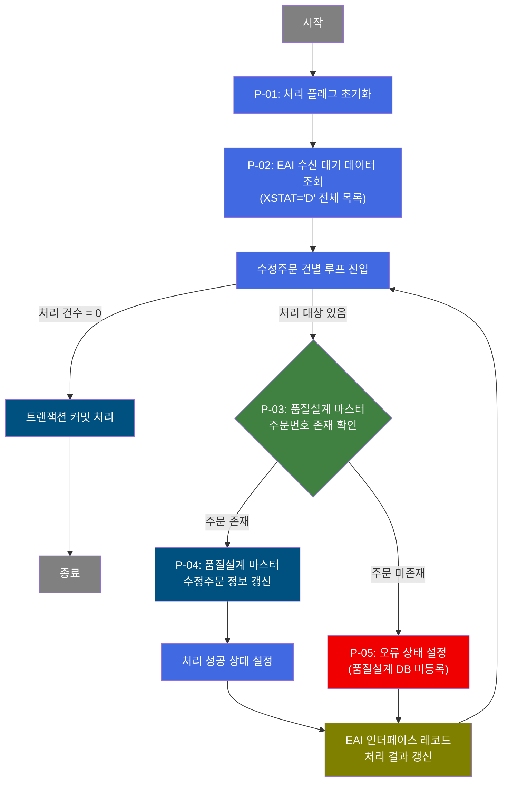

# B10R0070 비즈니스 프로세스 분석서 (BPA)

## 1. 시스템 개요

| 항목 | 내용 |
|------|------|
| 서비스 ID | B10R0070 |
| 업무명 | EAI 수정주문정보 수신 처리 |
| 서비스 타입 | nui |
| 분석 일시 | 2026-03-21 (KST) |
| 원본 분석일 | 2026-03-17 |
| 문서 버전 | 1.0 |

---

## 2. 시스템 목적

B10R0070은 EAI(Enterprise Application Integration) 시스템을 통해 수신된 **수정주문 정보**를 MES 품질설계 마스터에 반영하는 배치 처리 서비스이다. EAI 인터페이스 테이블에 처리 대기(XSTAT='D') 상태로 적재된 수정주문 데이터를 일괄 조회하여 건별로 순차 처리한다.

각 수정주문에 대해 MES 품질설계 마스터에 해당 주문번호가 등록되어 있는지 확인하고, 등록된 주문이면 주문 수량, 납기일, 매수 등 변경 정보를 갱신한다. 해당 주문이 품질설계 DB에 존재하지 않으면 오류 상태로 기록하여 재처리 또는 모니터링이 가능하도록 한다.

처리 결과(성공/오류)는 EAI 인터페이스 테이블에 상태값과 메시지를 함께 기록하여, EAI 시스템이 처리 결과를 콜백으로 확인할 수 있도록 지원한다. 이 서비스는 스케줄러에 의해 주기적으로 자동 실행되는 NUI(배치) 프로세스이다.

---

## 3. 핵심 워크플로우

---

## 4. 상세 워크플로우

### 프로세스 흐름도 — EAI 수정주문 수신 처리 (P-01, P-02, P-03, P-04, P-05)

---

## 5. 비즈니스 로직 상세

P-01: 처리 플래그 초기화 — 배치 실행 준비

- **입력**: 없음 (배치 서비스 기동 파라미터)
- **처리**:
  1. 처리 진행 플래그를 초기값(C: 계속)으로 설정하여 배치 루프 시작 준비
- **출력**: 처리 제어 플래그 초기화
- **예외**: 없음

P-02: EAI 수신 대기 데이터 조회 — 처리 대상 목록 확보

- **입력**: EAIAPUSER.TB_C10_B10R0070 (EAI 수정주문 인터페이스 테이블)
- **처리**:
  1. EAI 인터페이스 테이블에서 처리 대기 상태(XSTAT='D')인 수정주문 레코드를 전체 조회
  2. 인터페이스 그룹 ID와 순서번호 기준으로 정렬하여 ResultSet 구성
- **출력**: 처리 대상 수정주문 목록 (인메모리 ResultSet)
- **예외**: 조회 결과가 0건이면 루프 없이 종료

P-03: 품질설계 마스터 주문번호 존재 확인 — 분기 판단

- **입력**: TB_C10_QLT_DSN_CMN (품질설계 마스터 테이블), 현재 처리 중인 주문번호 및 주문 라인
- **처리**:
  1. 수신된 수정주문의 주문번호와 주문라인 조건으로 품질설계 마스터 레코드 존재 여부 확인
  2. 조회 결과 건수에 따라 후속 처리 분기 결정
- **출력**: 존재 여부 판단 결과 (TRUE: 존재, FALSE: 미존재)
- **예외**: DB 조회 오류 → FAILURE 반환, 처리 중단

P-04: 품질설계 마스터 수정주문 정보 갱신 — 주문 변경사항 반영

- **입력**: EAI 인터페이스에서 수신된 수정주문 정보 (주문라인 중량, 부분납기 종료일, 주문 매수 등)
- **처리**:
  1. 주문번호와 주문라인을 식별자로 품질설계 마스터(TB_C10_QLT_DSN_CMN) 레코드를 갱신
  2. 변경 항목: 주문라인 중량, 부분납기 종료일, 주문 매수
  3. 감사(Audit) 정보(최종 변경 객체 유형, 객체 ID, 프로그램 ID, 변경 일시) 자동 기록
- **출력**: TB_C10_QLT_DSN_CMN (갱신)
- **예외**: 갱신 실패 시 오류 전파

P-05: 처리 결과 EAI 인터페이스 갱신 — 처리 이력 기록

- **입력**: 처리 결과 상태값 및 메시지, 인터페이스 그룹 ID, 순서번호
- **처리**:
  1. 성공 경로: 처리 상태를 성공(S)으로 설정, 메시지 및 콜백 상태 초기화
  2. 오류 경로: 처리 상태를 오류(E)로 설정, 오류 메시지("품질설계DB에 해당주문번호가 등록이 되어 있지 않습니다.!") 기록, 콜백 상태를 재처리 요청(R)으로 설정
  3. 해당 인터페이스 레코드(IF_GRP_ID, SEQ_NO 기준)의 처리 상태, 메시지, 콜백 상태, 감사 정보를 EAIAPUSER.TB_C10_B10R0070에 갱신
- **출력**: EAIAPUSER.TB_C10_B10R0070 (처리 결과 갱신)
- **예외**: 갱신 실패 시 다음 건 처리로 계속 진행 (exitFlag=N 설정으로 에러 발생 시에도 루프 유지)

---

## 6. 커스텀 클래스 워크플로우

### DbQualDesignLoop (약 171줄)

**역할**: 이전 스텝에서 조회한 수정주문 ResultSet을 1건씩 순차 순회하며 건별 처리 흐름을 제어하는 루프 컨트롤러. 처리 건수 카운터를 관리하고, 현재 처리 Row의 데이터를 공유 컨텍스트에 세팅하여 후속 액티비티가 단건 기준으로 동작하도록 연결한다. 모든 건 처리 완료 시 `exit` 전이로 루프를 종료한다.

- 매 루프 진입 시 에러 플래그(`P_ERR_KEY`, `QLT_DSN_ERR_YN`)를 초기화하고 배치 잡 플래그(`BATCH_JOB=true`)를 설정한다.
- 역방향 카운터(`procCount`) 감소와 `this_row = total_row - procCount` 수식으로 순방향 Row 위치를 계산한다.
- `bindSet.reset()` 후 전체 재탐색 방식을 사용하므로 처리 건수가 많을수록 탐색 비용이 누적 증가(O(n²)) 한다.

### DbCheckCnt (약 105줄)

**역할**: Service XML의 Property로 지정된 SQL과 파라미터를 이용하여 특정 테이블에 조건에 맞는 레코드 존재 유무를 확인하는 범용 카운트 조회 컴포넌트. 조회 결과 건수에 따라 TRUE/FALSE/FAILURE 전이를 반환하여 후속 처리 분기를 결정한다. 특정 비즈니스 로직 없이 여러 서비스에서 재사용 가능하도록 설계되어 있다.

---

## 7. 주요 유즈케이스

UC-01: 수정주문 정보 정상 수신 및 반영

- **Actor**: 배치 스케줄러 (자동 실행)
- **목적**: EAI를 통해 수신된 수정주문 변경 내용을 MES 품질설계 마스터에 갱신
- **주요 흐름**:
  1. 스케줄러가 배치 서비스를 기동하여 EAI 처리 대기 수정주문 목록을 조회
  2. 각 수정주문에 대해 품질설계 마스터에 해당 주문이 존재하는지 확인
  3. 주문이 존재하면 주문라인 중량, 부분납기 종료일, 매수 변경 내용을 갱신
  4. EAI 인터페이스 레코드를 성공(S) 상태로 갱신하여 처리 완료 기록
- **예외**: 품질설계 마스터 갱신 실패 시 해당 건을 오류 처리하고 다음 건으로 계속 진행

UC-02: 품질설계 미등록 주문 오류 처리

- **Actor**: 배치 스케줄러 (자동 실행)
- **목적**: 품질설계 DB에 존재하지 않는 주문번호의 수정주문 수신 시 오류 이력 기록
- **주요 흐름**:
  1. EAI 수신 수정주문의 주문번호를 품질설계 마스터에서 조회
  2. 해당 주문이 품질설계 DB에 미등록 상태임을 확인
  3. EAI 인터페이스 레코드를 오류(E) 상태 및 미등록 오류 메시지로 갱신
  4. 콜백 상태를 재처리 요청(R)으로 설정하여 EAI 시스템에 재처리 신호 전달
- **예외**: 오류 기록 후 다음 수정주문 건 처리로 계속 진행

UC-03: 대량 수정주문 일괄 배치 처리

- **Actor**: 배치 스케줄러 (자동 실행)
- **목적**: 복수의 수정주문 건을 누락 없이 순차 처리하여 EAI 인터페이스 적체 해소
- **주요 흐름**:
  1. 처리 대기(XSTAT='D') 상태인 전체 수정주문 목록을 한 번에 조회
  2. 루프 컨트롤러를 통해 각 건을 인터페이스 그룹 ID와 순서번호 순서로 순차 처리
  3. 각 건의 처리 결과(성공/오류)를 EAI 인터페이스 테이블에 즉시 기록
  4. 전체 건 처리 완료 후 트랜잭션을 커밋하고 배치 종료
- **예외**: 개별 건 오류 발생 시 exitFlag=N으로 설정되어 전체 배치가 중단되지 않고 계속 진행

---

## 9. 관련 엔티티

### 엔티티 목록

| 엔티티(테이블) | 설명 | 사용 유형 |
|---------------|------|----------|
| EAIAPUSER.TB_C10_B10R0070 | EAI 수정주문정보 인터페이스 테이블. 외부 시스템에서 수신한 수정주문 데이터와 처리 상태를 관리 | 조회 / 갱신 |
| TB_C10_QLT_DSN_CMN | 품질설계 공통 마스터 테이블. 주문별 품질설계 기준 정보(주문 중량, 납기, 매수 등) 보관 | 조회 / 갱신 |

### 엔티티 간 관계

- `EAIAPUSER.TB_C10_B10R0070`은 EAI 시스템이 적재한 수정주문 인터페이스 레코드이며, 주문번호(ORD_NO)와 주문라인(ORD_LN)을 통해 `TB_C10_QLT_DSN_CMN`의 품질설계 마스터 레코드와 매핑된다.
- `TB_C10_QLT_DSN_CMN`은 MES 내부의 품질설계 기준 마스터로, 수정주문 처리 시 변경 내용이 반영되는 대상 테이블이다.
- 처리 결과는 `EAIAPUSER.TB_C10_B10R0070`의 상태 필드(XSTAT, XMSGS, XSTAT_CALLBACK)에 기록되어 EAI 시스템이 처리 결과를 확인할 수 있도록 한다.

---

## 11. 특이사항 및 주의사항

### 1. 오류 발생 시 배치 미중단 설계
커밋 액티비티에 `exitFlag=N`이 설정되어 있어, 개별 수정주문 처리 중 오류가 발생하더라도 전체 배치가 중단되지 않는다. 오류 건은 EAI 인터페이스 테이블에 오류 상태(XSTAT='E')와 오류 메시지를 기록한 뒤 다음 건 처리로 계속 진행한다. 이로 인해 일부 실패 건이 있어도 나머지 수정주문은 정상 처리된다.

### 2. EAI 콜백 상태 이중 관리
EAI 인터페이스 레코드에는 MES 처리 상태(XSTAT)와 EAI 콜백 상태(XSTAT_CALLBACK)가 별도로 관리된다. 처리 성공 시 XSTAT_CALLBACK은 null로 초기화되고, 오류 시 'R'(재처리 요청)으로 설정되어 EAI 시스템이 해당 건을 재전송하거나 알림을 발생시킬 수 있도록 신호를 제공한다.

### 3. 품질설계 마스터 미등록 주문 처리 한계
EAI로 수신된 수정주문이 품질설계 마스터(TB_C10_QLT_DSN_CMN)에 존재하지 않을 경우 갱신을 시도하지 않고 즉시 오류 처리한다. 신규 등록 로직은 포함되지 않으므로, 품질설계 마스터에 먼저 초기 등록이 완료되어야 수정주문 수신 처리가 정상 동작한다. 미등록 오류 건은 수동 조치 또는 별도 초기 등록 배치 처리가 필요하다.

### 4. 루프 컨트롤러 성능 특성 (O(n²))
`DbQualDesignLoop`는 매 루프 반복마다 ResultSet 전체를 처음부터 재탐색하는 방식으로 동작한다. 처리 건수가 많을수록 탐색 횟수가 누적 증가(100건 처리 시 최대 5,050회 탐색)하므로, EAI 적체 데이터가 대량일 경우 처리 시간이 비선형적으로 증가할 수 있다.

### 5. 트랜잭션 분리 구조
배치 처리 중 커밋은 전체 건 처리 완료 후 한 번에 수행된다(`tx1` 커밋 후 `tx2` 조건부 커밋). 처리 도중 시스템 장애가 발생하면 처리된 건의 결과가 롤백될 수 있으므로, 재기동 시 이미 처리된 건이 XSTAT='D' 상태로 남아 재처리될 수 있다. 이 경우 품질설계 마스터 갱신이 중복 실행되더라도 동일한 값으로 덮어쓰기 되어 업무상 문제는 없다.
