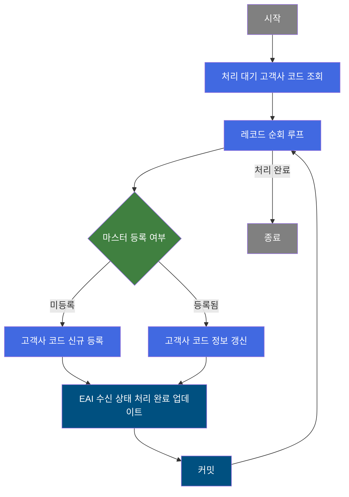
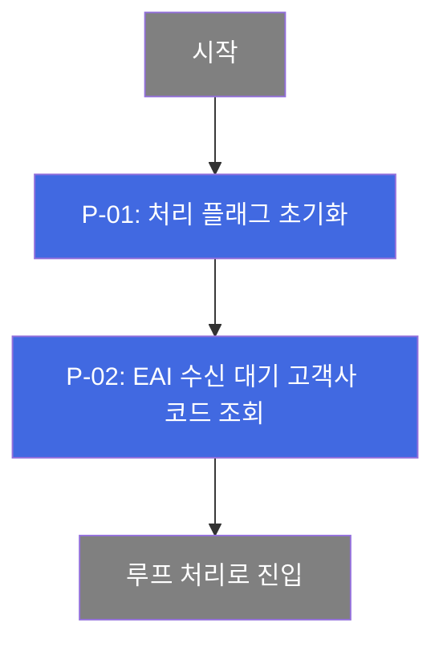
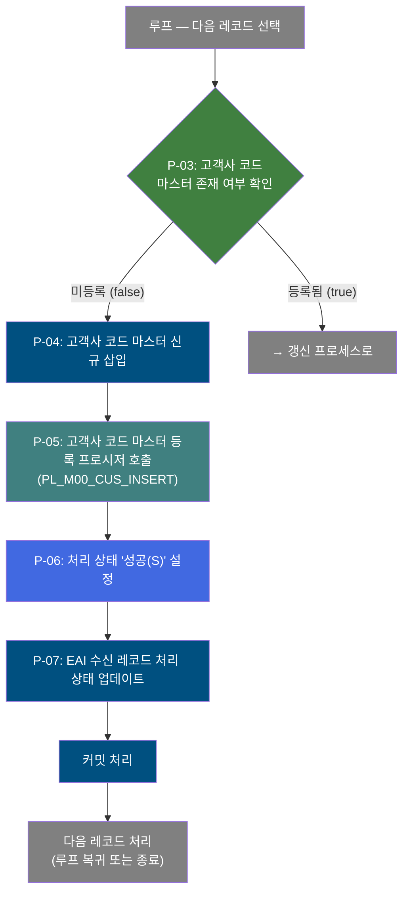
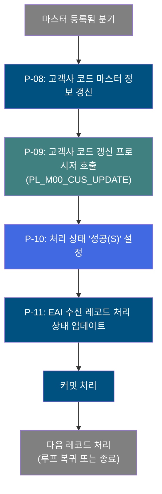

# B10R0080 비즈니스 프로세스 분석서 (BPA)

## 1. 시스템 개요

| 항목 | 내용 |
|------|------|
| 서비스 ID | B10R0080 |
| 업무명 | EAI 고객사 코드 수신 처리 |
| 서비스 타입 | nui |
| 분석 일시 | 2026-03-21 (KST) |
| 원본 분석일 | 2026-03-17 |
| 문서 버전 | 1.0 |

---

## 2. 시스템 목적

본 서비스는 ERP·OMS 등 외부 시스템에서 EAI를 통해 수신된 **고객사 코드 정보**를 MES 마스터 데이터에 자동으로 반영하는 배치 프로세스이다. 외부 시스템에서 고객사 코드가 신규 등록되거나 명칭이 변경되었을 때, 수동 개입 없이 MES의 고객사 코드 마스터를 최신 상태로 유지하는 것이 주된 목적이다.

처리 대상은 EAI 수신 테이블에서 처리 대기('D') 상태인 모든 고객사 코드 레코드이며, 레코드별로 마스터 등록 여부를 판단하여 **신규 등록** 또는 **기존 정보 갱신**을 수행한다. 처리 완료 후에는 EAI 수신 테이블의 상태를 성공(S)으로 업데이트하여 후속 처리와 감사 추적이 가능하도록 한다.

이 서비스는 배치 스케줄러에 의해 자동 실행되며, 별도의 사용자 조작 없이 EAI 연동 데이터의 정합성을 보장한다. 처리 중 오류가 발생한 건에 대해서는 오류 상태와 메시지를 기록하여 추후 확인 및 재처리가 가능하다.

---

## 3. 핵심 워크플로우

---

## 4. 상세 워크플로우

### 프로세스 흐름도 — 고객사 코드 초기화 및 조회 (P-01)

### 프로세스 흐름도 — 고객사 코드 신규 등록 (P-03, P-04, P-05, P-06)

### 프로세스 흐름도 — 고객사 코드 갱신 (P-08, P-09, P-10, P-11)

---

## 5. 비즈니스 로직 상세

P-01: 처리 플래그 초기화 — 배치 실행 전 처리 플래그를 초기 상태(C)로 설정

- **입력**: 없음 (시스템 파라미터만)
- **처리**:
  1. 처리 진행 플래그를 초기값 'C'(Create/신규)로 설정하여 후속 처리 분기를 준비
- **출력**: 컨텍스트 처리 플래그 초기화
- **예외**: 없음

P-02: EAI 수신 대기 고객사 코드 조회 — 처리 대기('D') 상태인 고객사 코드 수신 데이터 전체 조회

- **입력**: TB_C10_B10R0080 (EAI 수신 테이블) — XSTAT = 'D' 조건
- **처리**:
  1. EAI 수신 테이블에서 처리 대기 상태인 전체 레코드를 인터페이스 그룹 ID, 순번 순으로 정렬하여 조회
  2. 조회 결과를 루프 처리용 ResultSet으로 보관
- **출력**: 처리 대상 고객사 코드 레코드 목록 (ResultSet)
- **예외**: 조회 결과 0건 시 루프 처리 없이 즉시 종료

P-03: 고객사 코드 마스터 존재 여부 확인 — 고객사 코드가 공통 코드 마스터에 등록되어 있는지 판단

- **입력**: M00APUSER.TB_M00_CODES030 (고객사 코드 마스터) — 고객사 코드(CUS_CD) 조건
- **처리**:
  1. 공통 코드 마스터(코드유형 952, 카테고리 892)에서 해당 고객사 코드의 존재 여부를 건수 조회로 확인
  2. 1건 이상 존재 시 '등록됨(true)' → 갱신 프로세스(P-08)로 분기
  3. 0건 존재 시 '미등록(false)' → 신규 등록 프로세스(P-04)로 분기
- **출력**: 분기 판단 결과 (신규 등록 / 갱신)
- **예외**: DB 조회 실패 시 오류 처리

P-04: 고객사 코드 마스터 신규 삽입 — 공통 코드 마스터에 신규 고객사 코드 레코드 삽입

- **입력**: EAI 수신 레코드에서 추출한 고객사 코드(CUS_CD), 고객사명(CUS_NM)
- **처리**:
  1. M00APUSER.TB_M00_CODES030에 코드유형 952, 카테고리 892로 고객사 코드 신규 삽입
  2. 생성 감사 정보(생성 객체 유형, 생성 객체 ID, 생성 프로그램 ID, 생성 일시) 함께 저장
- **출력**: M00APUSER.TB_M00_CODES030 — 신규 레코드 삽입
- **예외**: 중복 키 오류 발생 시 처리 실패

P-05: 고객사 코드 마스터 등록 프로시저 호출 — PL_M00_CUS_INSERT 프로시저를 통한 마스터 등록 후처리

- **입력**: 고객사 코드(CUS_CD), 고객사명(CUS_NM)
- **처리**:
  1. masterdao를 통해 PL_M00_CUS_INSERT 프로시저 호출
  2. 프로시저 내부에서 고객사 코드 등록에 따른 연관 마스터 데이터 처리 수행
- **출력**: 프로시저 호출 결과 (마스터 후처리 완료)
- **예외**: 프로시저 실행 오류 시 해당 레코드 처리 실패

P-06: 처리 상태 '성공(S)' 설정 — 신규 등록 완료 후 처리 상태값을 성공으로 설정

- **입력**: 없음
- **처리**:
  1. 컨텍스트 처리 상태(XSTAT)를 'S'(Success)로 설정
  2. 오류 메시지(XMSGS) 및 콜백 상태(XSTAT_CALLBACK)를 null로 초기화
- **출력**: 컨텍스트 처리 상태 플래그 갱신
- **예외**: 없음

P-07: EAI 수신 레코드 처리 상태 업데이트 (신규 등록 완료) — EAI 수신 테이블에 처리 결과 기록

- **입력**: 컨텍스트의 처리 상태, 인터페이스 그룹 ID, 순번
- **처리**:
  1. TB_C10_B10R0080에서 해당 레코드(IF_GRP_ID, SEQ_NO)의 처리 상태(XSTAT), 오류 메시지(XMSGS), 콜백 상태(XSTAT_CALLBACK) 업데이트
  2. 최종 변경 감사 정보(변경 객체 유형, ID, 프로그램 ID, 변경 일시) 함께 기록
- **출력**: TB_C10_B10R0080 — 처리 상태 'S'로 갱신
- **예외**: 대상 레코드 미존재 시 업데이트 무시

P-08: 고객사 코드 마스터 정보 갱신 — 기존 등록된 고객사 코드의 명칭 등 정보를 최신화

- **입력**: EAI 수신 레코드에서 추출한 고객사 코드(CUS_CD), 고객사명(CUS_NM)
- **처리**:
  1. M00APUSER.TB_M00_CODES030에서 코드유형 952, 카테고리 892, 해당 고객사 코드로 대상 레코드 특정
  2. 고객사명(CD_V_MEANING) 및 최종 변경 감사 정보 업데이트
- **출력**: M00APUSER.TB_M00_CODES030 — 기존 레코드 갱신
- **예외**: 대상 레코드 미존재 시 업데이트 무시

P-09: 고객사 코드 갱신 프로시저 호출 — PL_M00_CUS_UPDATE 프로시저를 통한 마스터 갱신 후처리

- **입력**: 고객사 코드(CUS_CD), 고객사명(CUS_NM)
- **처리**:
  1. masterdao를 통해 PL_M00_CUS_UPDATE 프로시저 호출
  2. 프로시저 내부에서 고객사 코드 변경에 따른 연관 마스터 데이터 연동 처리 수행
- **출력**: 프로시저 호출 결과 (마스터 후처리 완료)
- **예외**: 프로시저 실행 오류 시 해당 레코드 처리 실패

P-10: 처리 상태 '성공(S)' 설정 — 갱신 완료 후 처리 상태값을 성공으로 설정

- **입력**: 없음
- **처리**:
  1. 컨텍스트 처리 상태(XSTAT)를 'S'(Success)로 설정
  2. 오류 메시지(XMSGS) 및 콜백 상태(XSTAT_CALLBACK)를 null로 초기화
- **출력**: 컨텍스트 처리 상태 플래그 갱신
- **예외**: 없음

P-11: EAI 수신 레코드 처리 상태 업데이트 (갱신 완료) — EAI 수신 테이블에 갱신 처리 결과 기록

- **입력**: 컨텍스트의 처리 상태, 인터페이스 그룹 ID, 순번
- **처리**:
  1. TB_C10_B10R0080에서 해당 레코드(IF_GRP_ID, SEQ_NO)의 처리 상태(XSTAT), 오류 메시지(XMSGS), 콜백 상태(XSTAT_CALLBACK) 업데이트
  2. 최종 변경 감사 정보(변경 객체 유형, ID, 프로그램 ID, 변경 일시) 함께 기록
- **출력**: TB_C10_B10R0080 — 처리 상태 'S'로 갱신
- **예외**: 대상 레코드 미존재 시 업데이트 무시

---

## 6. 커스텀 클래스 워크플로우

### DbCheckCnt (약 105줄)

**역할**: 서비스 XML의 Property로 SQL Key와 파라미터를 동적으로 지정받아, 특정 테이블 또는 뷰에 데이터가 존재하는지 건수 조회로 확인하고 결과에 따라 `true` / `false` / `failure` 전이를 반환하는 범용 존재 여부 확인 Activity이다.

본 서비스에서는 공통 코드 마스터(TB_M00_CODES030)에 해당 고객사 코드가 이미 등록되어 있는지 확인하는 목적으로 사용된다. 조회 결과가 1건 이상이면 `true`(기존 데이터 존재 → 갱신 분기), 0건이면 `false`(신규 등록 분기)를 반환한다.

---

### DbQualDesignLoop (약 171줄)

**역할**: 이전 액티비티(PosSearch)가 조회한 ResultSet을 1건씩 순회 처리하기 위한 루프 제어 Activity이다. 매 루프 진입 시 오류 플래그를 초기화하고, 현재 처리 대상 Row의 데이터를 컨텍스트에 바인딩한 뒤 후속 처리 액티비티로 연결한다. 처리 건수가 0이 되면 `exit` 전이를 반환하여 루프를 종료한다.

본 서비스에서는 처리 대기 상태의 고객사 코드 수신 레코드 전체를 순차적으로 처리하는 루프 컨트롤러로 사용된다. 역방향 카운터(남은 건수) + 순방향 인덱싱(this_row = total_row - procCount) 방식으로 현재 처리 Row를 탐색하며, `param` 프로퍼티에 정의된 컬럼을 컨텍스트에 바인딩하여 단건 처리 액티비티들이 정상 동작하도록 연결한다.

**주의**: 처리 건수가 많을수록 Row 탐색 횟수가 누적 증가(O(n²))하므로 대용량 배치에서는 성능에 주의가 필요하다.

---

## 7. 주요 유즈케이스

UC-01: EAI 수신 고객사 코드 신규 등록

- **Actor**: 배치 스케줄러 (자동 실행)
- **목적**: EAI를 통해 수신된 신규 고객사 코드를 MES 공통 코드 마스터에 등록
- **주요 흐름**:
  1. 배치 스케줄러가 서비스를 기동하여 EAI 수신 대기 레코드 조회
  2. 해당 고객사 코드가 마스터에 없음을 확인 (미등록)
  3. 공통 코드 마스터에 신규 고객사 코드 삽입
  4. 등록 프로시저(PL_M00_CUS_INSERT) 호출로 연관 마스터 후처리 수행
  5. EAI 수신 레코드의 처리 상태를 성공('S')으로 업데이트 후 커밋
- **예외**: 중복 키 발생 또는 프로시저 오류 시 해당 레코드 처리 실패 기록

UC-02: EAI 수신 고객사 코드 정보 갱신

- **Actor**: 배치 스케줄러 (자동 실행)
- **목적**: 외부 시스템에서 변경된 고객사 코드 명칭을 MES 마스터에 반영
- **주요 흐름**:
  1. 배치 스케줄러가 서비스를 기동하여 EAI 수신 대기 레코드 조회
  2. 해당 고객사 코드가 마스터에 이미 등록됨을 확인
  3. 공통 코드 마스터의 고객사명 및 변경 감사 정보 업데이트
  4. 갱신 프로시저(PL_M00_CUS_UPDATE) 호출로 연관 마스터 후처리 수행
  5. EAI 수신 레코드의 처리 상태를 성공('S')으로 업데이트 후 커밋
- **예외**: 대상 레코드 미존재 또는 프로시저 오류 시 해당 레코드 처리 실패 기록

UC-03: EAI 대기 레코드 일괄 처리 (복수 건)

- **Actor**: 배치 스케줄러 (자동 실행)
- **목적**: 여러 건의 EAI 수신 대기 레코드를 한 번의 배치 실행으로 순차 처리
- **주요 흐름**:
  1. 처리 대기('D') 상태 고객사 코드 전체 조회 (복수 건)
  2. 각 레코드에 대해 신규 등록/갱신 분기 처리를 반복 수행
  3. 레코드별로 처리 완료 시 즉시 커밋하여 부분 성공 보장
  4. 모든 레코드 처리 완료 후 루프 종료
- **예외**: 특정 레코드 처리 실패 시 해당 레코드만 오류 상태로 기록하고 다음 레코드 처리 계속

---

## 9. 관련 엔티티

### 엔티티 목록

| 엔티티(테이블) | 설명 | 사용 유형 |
|---------------|------|----------|
| TB_C10_B10R0080 | EAI에서 수신된 고객사 코드 인터페이스 대기 테이블 | 조회 / 갱신 |
| M00APUSER.TB_M00_CODES030 | 공통 코드 마스터 — 고객사 코드(코드유형 952, 카테고리 892) 포함 | 조회 / 저장 / 갱신 |

### 엔티티 간 관계

- TB_C10_B10R0080은 EAI 인터페이스를 통해 외부 시스템에서 수신된 처리 대기 레코드를 보관하며, 처리 완료 후 상태 정보가 갱신된다.
- M00APUSER.TB_M00_CODES030은 MES 전체 모듈이 공유하는 공통 코드 마스터로, 본 서비스에서 고객사 코드(코드유형 952) 부분을 신규 등록하거나 갱신한다.
- TB_C10_B10R0080에서 수신된 고객사 코드(CUS_CD)를 기준으로 M00APUSER.TB_M00_CODES030의 등록 여부를 판단하여 두 엔티티 간 동기화가 이루어진다.

---

## 11. 특이사항 및 주의사항

### 1. 레코드별 독립 커밋 전략

배치 처리 중 각 레코드의 처리가 완료될 때마다 즉시 커밋하는 구조이다. 이로 인해 특정 레코드에서 오류가 발생하더라도 이전에 처리 완료된 레코드는 롤백되지 않으며, 부분 성공이 보장된다. 단, 오류가 발생한 레코드는 EAI 수신 테이블에 오류 상태로 기록되므로 별도 재처리 방안이 필요하다.

### 2. PL/SQL 프로시저를 통한 2단계 마스터 등록

고객사 코드 등록/갱신 시 SQL 직접 실행(INSERT/UPDATE)과 프로시저 호출(PL_M00_CUS_INSERT / PL_M00_CUS_UPDATE)이 순차적으로 수행된다. 프로시저는 masterdao(M00APUSER 스키마)를 통해 호출되며, SQL 직접 실행과 프로시저 호출이 동일 트랜잭션 내에서 묶인다. 프로시저 내부에서 어떤 연관 처리가 이루어지는지 별도 분석이 필요하다 (현재 PL/SQL 분석 문서 미작성).

### 3. DbQualDesignLoop의 O(n²) 탐색 성능 특성

루프 제어 액티비티(DbQualDesignLoop)는 매 루프 진입 시 ResultSet 전체를 처음부터 재탐색하여 현재 처리 Row를 찾는 방식이다. 처리 건수가 n건이면 최대 n*(n+1)/2회의 Row 탐색이 발생한다. 처리 대기 건수가 많을 경우 배치 처리 시간이 급격히 증가할 수 있으므로, 운영 환경에서 EAI 수신 대기 건수를 모니터링하고 적절한 배치 주기를 유지하는 것이 중요하다.

### 4. EAI 처리 상태 코드 체계

TB_C10_B10R0080의 처리 상태(XSTAT)는 'D'(Draft/대기) → 'S'(Success/성공) 또는 오류 상태로 전이된다. 본 서비스는 'D' 상태인 레코드만 조회하여 처리하며, 처리 완료 후 반드시 'S'로 업데이트한다. 상태 업데이트 전에 프로시저 호출이 실패하는 경우 해당 레코드의 상태가 갱신되지 않아 다음 배치 실행 시 재처리될 수 있다.

### 5. 다중 DAO를 통한 분산 스키마 처리

본 서비스는 eaidao(TB_C10_B10R0080 조회/갱신), masterdao(TB_M00_CODES030 등록/갱신, 프로시저 호출), mesdao(고객사 코드 존재 확인 조회) 등 3개의 DAO를 동시에 사용한다. 각 DAO는 별도 스키마(EAIAPUSER, M00APUSER, MESAPUSER)에 접근하므로, 트랜잭션 범위와 각 스키마 간 정합성 관리에 주의가 필요하다.
