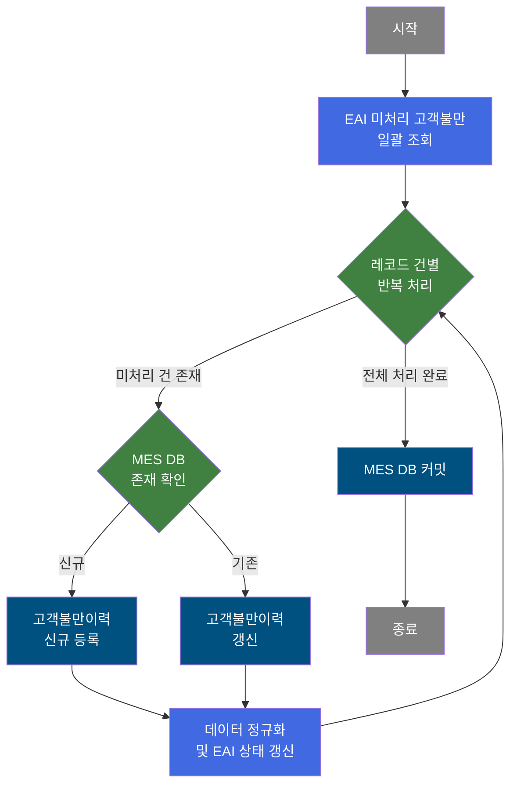
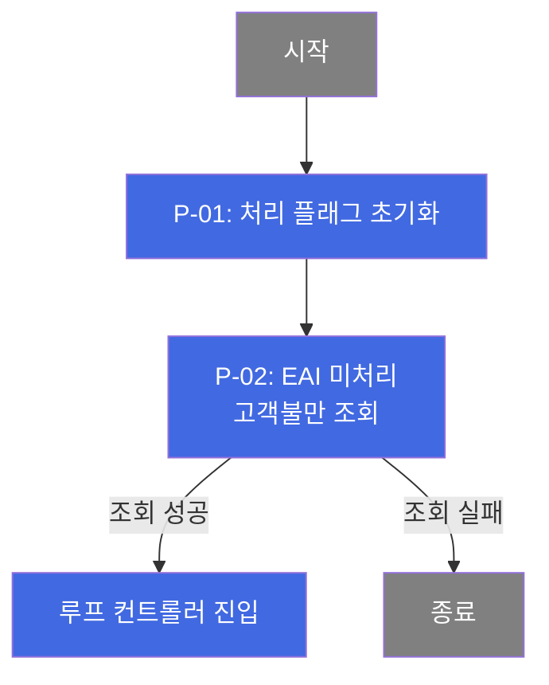
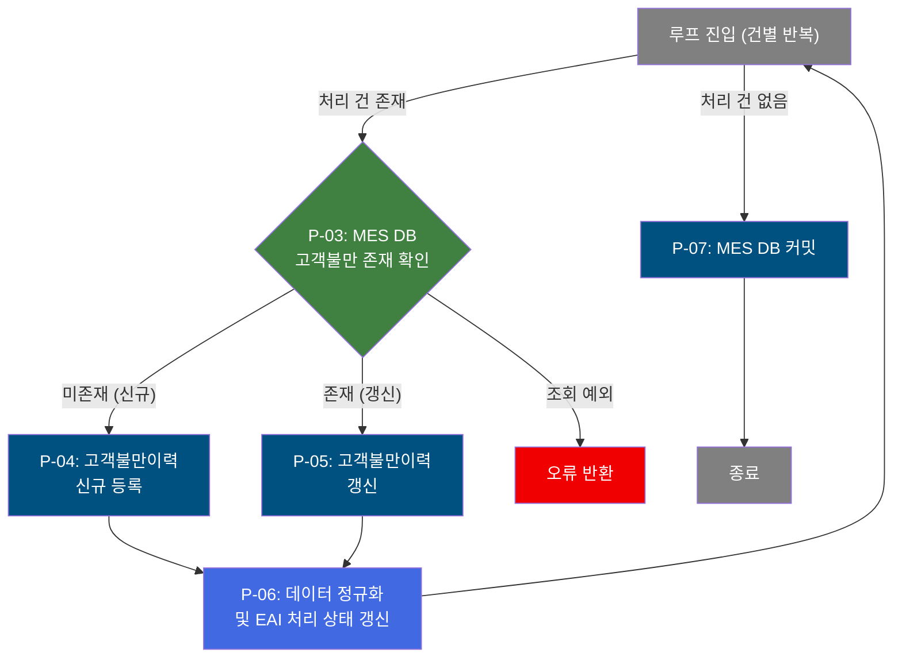

# B10R0090 비즈니스 프로세스 분석서 (BPA)

## 1. 시스템 개요

| 항목 | 내용 |
|------|------|
| 서비스 ID | B10R0090 |
| 업무명 | EAI 고객불만 이력 수신 및 MES 반영 |
| 서비스 타입 | nui (배치) |
| 분석 일시 | 2026-03-21 (KST) |
| 원본 분석일 | 2026-03-17 |
| 문서 버전 | 1.0 |

---

## 2. 시스템 목적

B10R0090은 EAI(외부 인터페이스 시스템)로부터 수신된 고객불만 이력 데이터를 MES 데이터베이스에 동기화하는 배치 서비스이다. 외부 영업/품질 시스템에서 접수된 고객불만 정보(불만 내용, 보상 계획, 품질 조치 등)를 정해진 인터페이스 규약에 따라 주기적으로 수신하여 MES 내부 고객불만이력 테이블에 반영한다.

서비스는 EAI 인터페이스 수신 큐에서 미처리 레코드를 일괄 조회한 뒤, 각 건에 대해 MES DB 존재 여부를 확인하여 신규이면 등록, 기존이면 갱신하는 방식으로 처리한다. 처리 완료 후에는 EAI 인터페이스 레코드의 처리 상태를 성공(S)으로 갱신하여 중복 처리를 방지한다. 이를 통해 영업·품질 부문의 고객불만 정보가 MES 제조실행 데이터와 일관되게 유지된다.

---

## 3. 핵심 워크플로우

---

## 4. 상세 워크플로우

### 프로세스 흐름도 — EAI 수신 및 초기화 (P-01, P-02)

### 프로세스 흐름도 — 건별 등록/갱신 처리 (P-03, P-04, P-05, P-06, P-07)

---

## 5. 비즈니스 로직 상세

P-01: 처리 플래그 초기화 — 배치 처리 시작 전 처리 구분 플래그 설정

- **입력**: 없음 (배치 실행 트리거)
- **처리**:
  1. 처리 구분 플래그(P_PROC_FLAG)를 'C'(클리어)로 설정하여 신규 처리 사이클 시작을 표시
- **출력**: 처리 플래그 컨텍스트 설정
- **예외**: 해당 없음

P-02: EAI 미처리 고객불만 조회 — 처리 대상 레코드 일괄 조회

- **입력**: EAI 인터페이스 수신 테이블(TB_C10_B10R0090)에서 처리 상태가 미처리(XSTAT='D')인 레코드 조회
- **처리**:
  1. EAI DB에서 미처리 상태(XSTAT='D')의 고객불만 인터페이스 레코드를 IF_GRP_ID, SEQ_NO 순서로 정렬하여 전체 조회
  2. 조회 결과를 이후 루프 처리를 위한 ResultSet으로 보관
- **출력**: 고객불만 인터페이스 레코드 목록 (루프 처리 대상)
- **예외**: 조회 실패 시 서비스 종료

P-03: MES DB 고객불만 존재 확인 — 신규/갱신 분기 판단

- **입력**: 현재 처리 건의 고객불만번호, 고객불만라인번호, 코일ID
- **처리**:
  1. MES 고객불만이력 테이블(TB_C10_CUS_CMPL_HST)에서 고객불만번호 + 고객불만라인번호 + 코일ID 조합으로 레코드 존재 여부 확인
  2. 1건 이상 존재하면 → 갱신 처리(P-05)로 분기
  3. 0건이면 → 신규 등록(P-04)으로 분기
- **출력**: 존재 여부에 따른 처리 경로 결정
- **예외**: DB 조회 예외 발생 시 오류 반환

P-04: 고객불만이력 신규 등록 — MES DB에 신규 고객불만 이력 생성

- **입력**: EAI로부터 수신된 고객불만 전체 정보 (고객정보, 제품정보, 주문정보, 불만내용, 보상계획, 코일정보 등 50개 항목)
- **처리**:
  1. MES 고객불만이력 테이블(TB_C10_CUS_CMPL_HST)에 신규 레코드 삽입
  2. 고객불만번호, 최종고객코드/명, 불만접수일, 제품명, 코일ID, 실제보상금액, 문서상태 등 전체 정보를 한 번에 등록
  3. 감사(Audit) 필드(등록일시 등) 자동 설정
- **출력**: TB_C10_CUS_CMPL_HST에 신규 레코드 저장
- **예외**: INSERT 실패 시 오류 플래그 설정

P-05: 고객불만이력 갱신 — MES DB 기존 고객불만 이력 전체 갱신

- **입력**: EAI로부터 수신된 고객불만 전체 갱신 정보 (고객불만번호, 고객불만라인번호, 코일ID 등 식별 키 포함 53개 항목)
- **처리**:
  1. 고객불만번호 + 고객불만라인번호 + 코일ID 조합으로 기존 레코드 특정
  2. MES 고객불만이력 테이블(TB_C10_CUS_CMPL_HST)의 해당 레코드를 EAI 수신 데이터로 전체 갱신
  3. 감사(Audit) 필드(수정일시, 수정자 등) 자동 갱신
- **출력**: TB_C10_CUS_CMPL_HST 해당 레코드 갱신
- **예외**: UPDATE 실패 시 오류 플래그 설정

P-06: 데이터 정규화 및 EAI 처리 상태 갱신 — 저장 후 데이터 보정 및 인터페이스 완료 처리

- **입력**: 고객불만번호, 고객불만라인번호, 코일ID (등록/갱신 완료 건)
- **처리**:
  1. **데이터 정규화**: MES 고객불만이력 테이블(TB_C10_CUS_CMPL_HST)의 고객코드, 주문라인번호, 최종고객코드를 SUBSTR 함수로 정규화 (예: 마지막 6자리 또는 3자리로 절삭)
  2. **처리 상태 설정**: 현재 처리 건의 EAI 처리 상태를 'S'(성공)로, 에러 메시지를 공백으로 설정
  3. **EAI 인터페이스 상태 갱신**: EAI 인터페이스 수신 테이블(TB_C10_B10R0090)의 해당 레코드 처리 상태를 'S'(성공)로 업데이트
- **출력**: TB_C10_CUS_CMPL_HST 정규화 갱신, TB_C10_B10R0090 처리 상태 갱신
- **예외**: 상태 갱신 실패 시 다음 레코드 처리로 이동 (루프 계속)

P-07: MES DB 커밋 — 전체 처리 완료 후 트랜잭션 확정

- **입력**: 전체 레코드 처리 완료 후 (루프 종료)
- **처리**:
  1. MES DB 트랜잭션(tx4) 커밋 — 고객불만이력 등록/갱신 내용 확정
  2. EAI DB 트랜잭션(tx2) 커밋 — EAI 인터페이스 상태 갱신 내용 확정
- **출력**: 트랜잭션 확정 완료
- **예외**: 오류 플래그(P_ERR_KEY) 확인 후 필요 시 롤백

---

## 6. 커스텀 클래스 워크플로우

### DbQualDesignLoop (약 171줄)

**역할**: EAI에서 조회한 고객불만 레코드 ResultSet을 1건씩 순차 순회하는 범용 루프 제어 액티비티. 매 루프 진입 시 현재 처리 건의 데이터를 컨텍스트에 바인딩하고, 처리 대상이 없으면 루프를 종료한다.

> 171줄로 200줄 미만이므로 Mermaid 흐름도를 생략하고 역할/로직만 기술한다.

**핵심 처리 로직**:
- 최초 진입 시 전체 조회 건수로 처리 카운터 초기화
- 매 루프마다 처리 카운터를 1 감소하고, 역방향 카운터 기반 순방향 인덱싱으로 현재 처리 Row 위치 계산 (`this_row = total_row - procCount`)
- 처리 카운터가 0이 되면 `exit` 전이를 반환하여 루프 종료
- 루프 진입 시마다 에러 플래그(`P_ERR_KEY`)와 품질설계 에러 여부 플래그를 초기화

**성능 특성**: 매 루프마다 ResultSet을 처음부터 재탐색하는 방식(O(n²))이므로 처리 건수가 많을 경우 성능에 유의해야 한다.

---

### DbCheckCnt (약 105줄)

**역할**: MES DB 고객불만이력 테이블에 특정 건이 이미 등록되어 있는지 확인하는 범용 존재 유무 카운트 조회 액티비티. 존재하면 `true` 전이(갱신 경로), 미존재하면 `false` 전이(신규 등록 경로)를 반환하여 INSERT/UPDATE 분기를 결정한다.

> 105줄로 200줄 미만이므로 Mermaid 흐름도를 생략하고 역할/로직만 기술한다.

**핵심 처리 로직**:
- Service XML Property로 SQL Key 및 파라미터를 동적으로 구성하여 재사용성 확보
- 조회 결과 1건 이상 → `true` (갱신 처리), 0건 → `false` (신규 등록), DB 예외 → `failure` (오류)

---

## 7. 주요 유즈케이스

UC-01: EAI 고객불만 신규 건 MES 등록

- **Actor**: 배치 스케줄러 (자동 실행)
- **목적**: 외부 EAI 시스템으로부터 수신된 신규 고객불만 정보를 MES 데이터베이스에 최초 등록
- **주요 흐름**:
  1. EAI 인터페이스 수신 테이블에서 미처리(XSTAT='D') 고객불만 레코드 조회
  2. 대상 건에 대해 MES 고객불만이력 테이블 미존재 확인
  3. 고객불만 전체 정보를 MES 고객불만이력 테이블에 신규 등록
  4. 등록 후 고객코드 등 주요 필드 정규화
  5. EAI 인터페이스 레코드 처리 상태를 성공(S)으로 갱신
  6. 전체 처리 완료 후 MES DB 및 EAI DB 트랜잭션 커밋
- **예외**: MES DB INSERT 실패 시 오류 플래그 설정

UC-02: EAI 고객불만 변경 건 MES 갱신

- **Actor**: 배치 스케줄러 (자동 실행)
- **목적**: 외부 EAI 시스템에서 변경된 고객불만 정보를 MES 기존 이력에 반영
- **주요 흐름**:
  1. EAI 인터페이스 수신 테이블에서 미처리 고객불만 변경 레코드 조회
  2. 대상 건에 대해 MES 고객불만이력 테이블 존재 확인 (true 분기)
  3. 기존 고객불만이력 레코드를 EAI 수신 데이터로 전체 갱신
  4. 갱신 후 고객코드, 주문라인번호, 최종고객코드 정규화
  5. EAI 인터페이스 레코드 처리 상태를 성공(S)으로 갱신
- **예외**: UPDATE 조건에 맞는 레코드 없을 시 0건 갱신으로 처리 계속

UC-03: 복수 고객불만 건 일괄 처리

- **Actor**: 배치 스케줄러 (자동 실행)
- **목적**: 다수의 미처리 고객불만 레코드를 한 번의 배치 실행으로 일괄 처리
- **주요 흐름**:
  1. EAI 인터페이스 수신 테이블에서 전체 미처리 레코드를 IF_GRP_ID, SEQ_NO 순으로 조회
  2. 루프 컨트롤러를 통해 각 레코드를 순차적으로 1건씩 처리 (신규/갱신 자동 판별)
  3. 건별 처리 완료 후 EAI 인터페이스 상태를 즉시 갱신 (루프 내부에서 건별 커밋 없이 루프 반복)
  4. 전체 레코드 처리 완료 후 일괄 커밋
- **예외**: 개별 건 처리 오류 시 오류 플래그 기록 후 다음 건 처리 진행

---

## 9. 관련 엔티티

### 엔티티 목록

| 엔티티(테이블) | 설명 | 사용 유형 |
|---------------|------|----------|
| TB_C10_B10R0090 | EAI 고객불만 인터페이스 수신 테이블 (EAIAPUSER 스키마) | 조회 / 갱신 |
| TB_C10_CUS_CMPL_HST | MES 고객불만이력 테이블 (MESAPUSER 스키마) | 조회 / 저장 / 갱신 |

### 엔티티 간 관계
- TB_C10_B10R0090은 EAI 외부 시스템에서 수신된 고객불만 원본 데이터를 보관하며, 처리 상태(XSTAT) 필드로 처리 여부를 관리한다.
- TB_C10_CUS_CMPL_HST는 MES 내부의 고객불만이력 마스터로, TB_C10_B10R0090의 데이터를 정규화하여 반영한 결과 테이블이다.
- 두 테이블은 고객불만번호(CUS_CMPL_NO), 고객불만라인번호(CUS_CMPL_LN), 코일ID(COIL_ID) 조합으로 동일 건을 연결한다.

---

## 11. 특이사항 및 주의사항

### 1. EAI 처리 상태 갱신이 루프 내부에서 건별로 수행됨
EAI 인터페이스 레코드의 처리 상태 갱신(XSTAT='S')은 각 레코드 처리 직후, 루프 내부에서 건별로 수행된다. 따라서 배치 도중 비정상 종료 시 일부 건은 EAI 상태가 갱신되고 일부는 미처리 상태로 남을 수 있다. 재실행 시 미처리(XSTAT='D') 건만 재처리되므로 중복 처리는 방지되지만, 이미 EAI 상태가 갱신된 건의 MES 반영 실패는 별도 확인이 필요하다.

### 2. 신규/갱신 분기 시 고객불만번호+라인번호+코일ID 3개 키 조합 사용
고객불만이력의 중복 체크는 고객불만번호(CUS_CMPL_NO), 고객불만라인번호(CUS_CMPL_LN), 코일ID(COIL_ID) 3개 필드의 조합으로 수행된다. 이 조합이 복합 기본키 역할을 하므로 EAI에서 동일 키 조합으로 여러 건이 전송되는 경우 최초 건은 INSERT, 이후 건은 UPDATE로 처리된다.

### 3. 고객코드 및 주문라인번호 정규화 처리
MES DB에 저장 후 고객코드(CUS_CD), 주문라인번호(ORD_LN), 최종고객코드(FNL_CUS_CD)를 SUBSTR 함수로 잘라 저장한다(마지막 6자리 또는 3자리). 이는 외부 EAI 시스템과 MES 내부의 코드 체계 차이를 보정하기 위한 처리이며, 등록 및 갱신 모두 동일하게 적용된다.

### 4. 루프 처리 성능 (O(n²) 탐색)
루프 제어 클래스(DbQualDesignLoop)는 매 반복마다 ResultSet을 처음부터 재탐색하는 방식을 사용한다. 처리 건수가 많아질수록 탐색 횟수가 누적 증가하므로(100건 처리 시 최대 5,050회 탐색), 미처리 누적 건수가 증가할 경우 배치 처리 시간이 비선형적으로 증가할 수 있다.

### 5. 이중 트랜잭션 구조 (MES DB + EAI DB)
서비스는 두 개의 독립 트랜잭션을 사용한다. MES DB 고객불만이력 처리(tx4)와 EAI DB 인터페이스 상태 갱신(tx2)이 별도로 관리된다. 두 DB가 분리된 트랜잭션이므로 MES DB 커밋 성공 후 EAI DB 커밋 실패 시 EAI 미처리 상태로 남아 다음 배치 실행 시 중복 처리될 수 있다.
