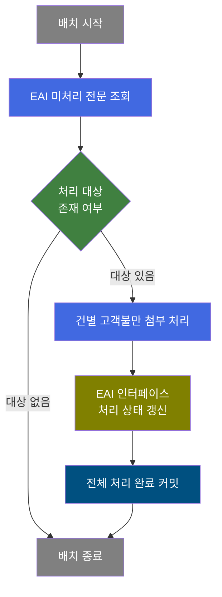
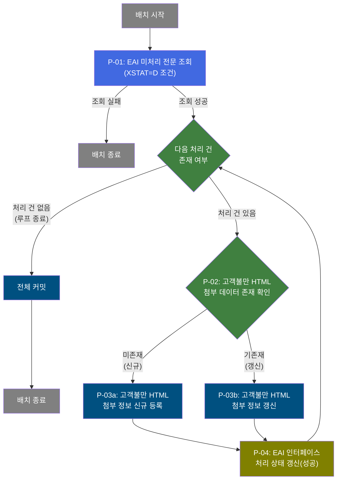

# B10R0100 비즈니스 프로세스 분석서 (BPA)

## 1. 시스템 개요

| 항목 | 내용 |
|------|------|
| 서비스 ID | B10R0100 |
| 업무명 | EAI 고객불만 HTML 첨부 파일 수신 처리 |
| 서비스 타입 | nui (배치) |
| 분석 일시 | 2026-03-21 (KST) |
| 원본 분석일 | 2026-03-17 |
| 문서 버전 | 1.0 |

---

## 2. 시스템 목적

B10R0100은 외부 EAI 시스템으로부터 전송된 고객불만 HTML 첨부 파일 정보를 수신하여 MES 내 고객불만 첨부 데이터를 최신 상태로 유지하기 위한 배치 처리 서비스이다. 고객이 제기한 불만 사항에는 HTML 형식의 설명 문서나 이미지 등 첨부 자료가 포함될 수 있으며, 이 서비스는 외부 시스템에서 전달된 해당 자료를 MES 데이터베이스에 자동으로 동기화한다.

처리 방식은 미처리 상태의 EAI 수신 전문을 일괄 조회한 뒤, 각 건에 대해 MES 내 기존 데이터 존재 여부를 확인하여 신규 등록 또는 갱신으로 분기 처리한다. 처리 완료 후에는 EAI 인터페이스 테이블의 처리 상태를 갱신하여 이중 처리를 방지한다.

이 서비스는 스케줄러에 의해 주기적으로 실행되며, 운영자의 수동 개입 없이 고객불만 첨부 자료를 자동으로 MES에 반영하는 역할을 담당한다.

---

## 3. 핵심 워크플로우

---

## 4. 상세 워크플로우

### 프로세스 흐름도 — EAI 수신 전문 건별 처리 (P-01, P-02, P-03)

---

## 5. 비즈니스 로직 상세

P-01: EAI 미처리 전문 조회 — XSTAT='D' 조건으로 대상 건 일괄 조회

- **입력**: EAI 인터페이스 테이블(TB_C10_B10R0100)에서 미처리 상태(XSTAT='D')인 전문 목록
- **처리**:
  1. EAI 데이터베이스(eaidao)에서 처리 상태가 '미처리(D)'인 고객불만 HTML 첨부 전문 전체 조회
  2. 조회 결과를 IF_GRP_ID, SEQ_NO 기준으로 정렬하여 순차 처리 준비
  3. 조회 실패 시 이후 처리 없이 배치 종료
- **출력**: 처리 대상 전문 목록 (결과셋 형태로 이후 루프 처리에 전달)
- **예외**: 조회 실패 → 배치 즉시 종료

P-02: 고객불만 HTML 첨부 데이터 존재 확인 — MES DB 중복 여부 판단

- **입력**: 현재 처리 중인 전문의 고객불만번호, 고객불만라인번호, HTML 순번
- **처리**:
  1. MES 데이터베이스(mesdao)에서 해당 고객불만번호 + 라인번호 + HTML 순번 조합으로 고객불만 HTML 첨부 정보(TB_C10_CUS_CMPL_HTML) 존재 여부 확인
  2. 존재 여부에 따라 신규 등록(P-03a) 또는 갱신(P-03b) 분기
- **출력**: 존재 여부 판정 결과 (신규/갱신 분기 결정)
- **예외**: 조회 예외 발생 → 처리 실패 반환

P-03a: 고객불만 HTML 첨부 정보 신규 등록 — 미존재 건 INSERT

- **입력**: EAI 전문에서 전달된 고객불만번호, 라인번호, HTML 순번, HTML 코드 및 감사 정보
- **처리**:
  1. 고객불만 HTML 첨부 테이블(TB_C10_CUS_CMPL_HTML)에 신규 레코드 삽입
  2. 생성일시, 생성자 정보 등 감사(Audit) 컬럼 자동 설정
- **출력**: TB_C10_CUS_CMPL_HTML에 신규 행 등록
- **예외**: INSERT 실패 시 에러 플래그 설정

P-03b: 고객불만 HTML 첨부 정보 갱신 — 기존재 건 UPDATE

- **입력**: EAI 전문에서 전달된 고객불만번호, 라인번호, HTML 순번, HTML 코드 및 최종수정 정보
- **처리**:
  1. 고객불만 HTML 첨부 테이블(TB_C10_CUS_CMPL_HTML)에서 해당 키(고객불만번호 + 라인번호 + HTML 순번) 레코드 갱신
  2. 최종 수정일시, 수정자 정보 등 감사(Audit) 컬럼 자동 갱신
- **출력**: TB_C10_CUS_CMPL_HTML의 기존 행 갱신
- **예외**: UPDATE 실패 시 에러 플래그 설정

P-04: EAI 인터페이스 처리 상태 갱신 — 처리 완료 상태로 업데이트

- **입력**: 현재 처리 전문의 IF_GRP_ID, SEQ_NO, XSEQ 식별자 및 처리 결과 상태
- **처리**:
  1. 처리 상태를 '성공(S)'으로 설정
  2. 에러 메시지 및 콜백 상태를 초기화(null)
  3. EAI 인터페이스 테이블(TB_C10_B10R0100)에서 해당 전문의 처리 상태, 에러 메시지, 최종 수정 정보 갱신
- **출력**: TB_C10_B10R0100의 XSTAT='S'(성공) 갱신
- **예외**: 갱신 실패 시 이후 루프는 계속 진행

---

## 6. 커스텀 클래스 워크플로우

### DbQualDesignLoop (약 171줄)

**역할**: EAI에서 조회된 미처리 전문 목록을 1건씩 순차 순회하며 건별 처리 흐름을 제어하는 공통 루프 컨트롤러.

최초 진입 시 전체 처리 건수를 카운터로 초기화하고, 매 호출마다 카운터를 1씩 감소시키며 현재 처리할 레코드의 컬럼값을 후속 처리 단계에서 사용할 수 있도록 준비한다. 카운터가 0이 되면 루프를 종료하고 이후 커밋 단계로 전이한다. 매 루프 진입 시 에러 플래그를 초기화하여 이전 건의 처리 결과가 다음 건에 영향을 주지 않도록 격리한다.

> 200줄 미만(171줄)으로 Mermaid 워크플로우 생략.

---

### DbCheckCnt (약 105줄)

**역할**: 지정된 조건으로 특정 테이블에 데이터가 존재하는지 카운트 조회하여 분기 결정(신규/갱신)에 활용하는 범용 존재 여부 확인 컴포넌트.

서비스 XML의 Property로 SQL 키와 파라미터를 동적으로 구성하여 조회하므로, 동일 클래스를 다양한 중복 확인 시나리오에서 재사용할 수 있다. 조회 결과가 1건 이상이면 '존재(true)', 0건이면 '미존재(false)', 조회 오류 시 '실패(failure)'를 반환한다.

> 200줄 미만(105줄)으로 Mermaid 워크플로우 생략.

---

## 7. 주요 유즈케이스

UC-01: EAI 고객불만 HTML 첨부 신규 수신 처리

- **Actor**: 배치 스케줄러 (자동 실행)
- **목적**: EAI를 통해 새로 수신된 고객불만 HTML 첨부 파일 정보를 MES에 신규 등록
- **주요 흐름**:
  1. 배치 스케줄러가 B10R0100 서비스를 주기적으로 기동
  2. EAI 인터페이스에서 미처리 상태의 고객불만 HTML 전문 조회
  3. 각 전문에 대해 MES 내 해당 첨부 정보 부재 확인
  4. 고객불만 HTML 첨부 테이블에 신규 레코드 등록
  5. EAI 인터페이스 전문의 처리 상태를 '성공'으로 갱신
  6. 전체 처리 완료 후 커밋
- **예외**: EAI 조회 실패 시 처리 없이 배치 종료

UC-02: EAI 고객불만 HTML 첨부 재수신 갱신 처리

- **Actor**: 배치 스케줄러 (자동 실행)
- **목적**: EAI를 통해 기존 고객불만 HTML 첨부 정보의 변경분을 수신하여 MES 데이터 갱신
- **주요 흐름**:
  1. 배치 스케줄러가 B10R0100 서비스를 기동
  2. EAI 인터페이스에서 미처리 상태의 고객불만 HTML 전문 조회
  3. 각 전문에 대해 MES 내 해당 첨부 정보 기존재 확인
  4. 고객불만 HTML 첨부 테이블의 기존 레코드를 최신 정보로 갱신
  5. EAI 인터페이스 전문의 처리 상태를 '성공'으로 갱신
- **예외**: 동일 키의 레코드가 없는 경우 신규 등록으로 자동 전환(UC-01)

UC-03: 복수 건 일괄 배치 처리

- **Actor**: 배치 스케줄러 (자동 실행)
- **목적**: 누적된 다수의 미처리 EAI 전문을 단일 배치 실행으로 일괄 처리
- **주요 흐름**:
  1. 배치 기동 시 미처리 전문 전체를 한 번에 조회
  2. 각 전문을 순차적으로 신규 등록 또는 갱신 처리
  3. 각 건 처리 후 해당 EAI 전문 상태를 즉시 갱신
  4. 모든 건 처리 완료 후 MES 데이터 커밋 및 EAI 상태 커밋
- **예외**: 개별 건 처리 실패 시 해당 건의 에러 플래그 설정, 이후 건 처리는 계속 진행

---

## 9. 관련 엔티티

### 엔티티 목록

| 엔티티(테이블) | 설명 | 사용 유형 |
|---------------|------|----------|
| TB_C10_B10R0100 | EAI 고객불만 HTML 첨부 인터페이스 수신 테이블 (eaidao 스키마) | 조회 / 갱신 |
| TB_C10_CUS_CMPL_HTML | MES 고객불만 HTML 첨부 파일 정보 테이블 (mesdao 스키마) | 조회 / 저장 / 갱신 |

### 엔티티 간 관계
- TB_C10_B10R0100은 EAI로부터 수신된 원본 인터페이스 데이터로, 처리 전 미처리 전문 목록을 보관한다.
- TB_C10_CUS_CMPL_HTML은 TB_C10_B10R0100의 처리 결과로 생성/갱신되는 MES 업무 데이터이며, 고객불만번호 + 라인번호 + HTML 순번 복합키로 연결된다.
- 처리 완료 후 TB_C10_B10R0100의 처리 상태가 갱신되어 재처리를 방지한다.

---

## 11. 특이사항 및 주의사항

### 1. EAI 이중 스키마 접근
이 서비스는 EAI 스키마(eaidao)와 MES 스키마(mesdao) 양쪽을 모두 접근한다. 인터페이스 전문 조회 및 처리 상태 갱신은 EAI 스키마에서 수행하고, 실제 업무 데이터 저장은 MES 스키마에 저장한다. 두 스키마 간의 트랜잭션 일관성 관리에 주의가 필요하다.

### 2. 이중 커밋 구조
서비스 종료 시점에 MES 데이터 커밋(tx4)과 EAI 상태 커밋(tx2)이 순차적으로 실행된다. MES 커밋 성공 후 EAI 상태 커밋이 실패할 경우, 다음 배치 실행 시 동일 전문이 재처리될 수 있다. 이 경우 중복 확인 로직(P-02)에 의해 신규 등록 대신 갱신으로 처리되어 데이터 무결성은 유지된다.

### 3. 루프 기반 건별 처리 및 에러 격리
DbQualDesignLoop가 루프 카운터 방식으로 레코드를 순차 처리하므로, 개별 건 처리 실패가 전체 배치를 중단시키지 않는다. 각 건 진입 시 에러 플래그를 초기화하여 이전 건의 오류가 다음 건에 전파되지 않도록 설계되어 있다. 단, 처리 건수가 많을 경우 루프 내부의 전체 커서 재탐색 방식(매 건마다 처음부터 순회)으로 인해 성능 저하가 발생할 수 있다.
