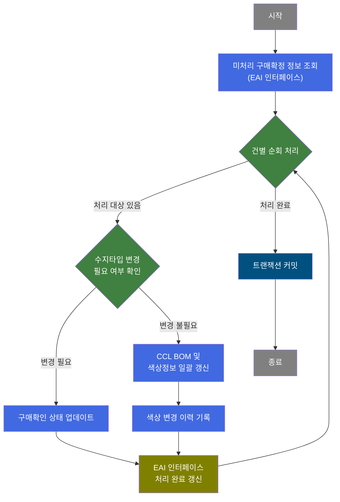
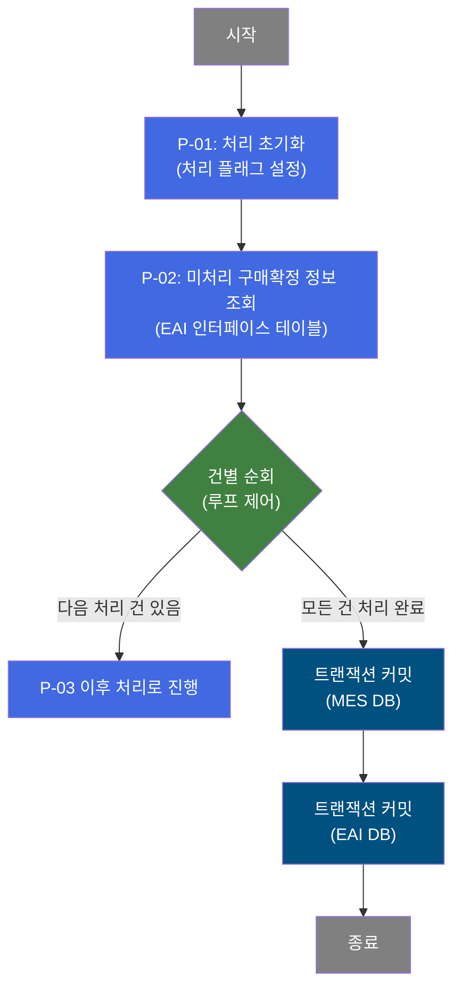
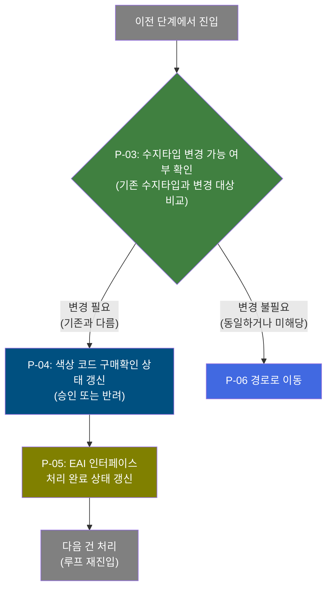
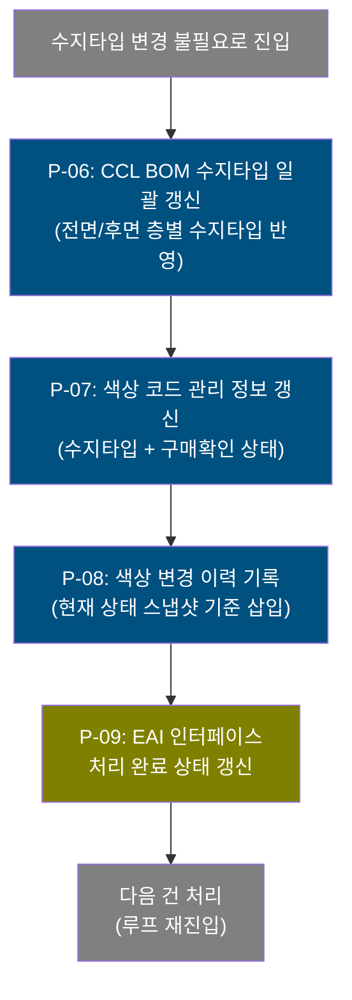

# B10R0110 비즈니스 프로세스 분석서 (BPA)

## 1. 시스템 개요

| 항목 | 내용 |
|------|------|
| 서비스 ID | B10R0110 |
| 업무명 | 구매담당자 확정정보 수신 처리 (EAI 연동 배치) |
| 서비스 타입 | nui |
| 분석 일시 | 2026-03-21 (KST) |
| 원본 분석일 | 2026-03-17 |
| 문서 버전 | 1.0 |

---

## 2. 시스템 목적

본 서비스는 외부 EAI 시스템으로부터 수신된 **구매담당자의 색상 소재 확정/반려 정보**를 배치 방식으로 처리하는 자동화 프로세스이다. 구매 담당자가 색상 설계에 대한 검토 결과(승인/반려)를 외부 구매 시스템에서 확정하면, 해당 결과가 EAI 인터페이스를 통해 MES 시스템으로 전달되며, 본 서비스는 이를 주기적으로 감지하여 내부 데이터에 반영한다.

처리 대상은 미처리 상태로 대기 중인 인터페이스 레코드이며, 건별로 색상 코드 관리 정보(구매확인 상태, 수지 타입)와 CCL BOM(색상 소재 구성)을 갱신하고, 변경 이력을 기록한 뒤 인터페이스 레코드의 처리 완료 상태를 갱신하여 중복 처리를 방지한다.

구매 확정 결과에 따라 색상 소재의 수지 타입 변경 여부를 판단하며, 변경이 필요한 경우와 불필요한 경우 각각 다른 처리 경로를 거쳐 색상 설계 데이터의 일관성을 유지한다. 이 서비스는 UI 없이 배치 스케줄러에 의해 자동 실행된다.

---

## 3. 핵심 워크플로우

---

## 4. 상세 워크플로우

### 프로세스 흐름도 — EAI 수신 데이터 조회 및 루프 제어 (P-01, P-02)

### 프로세스 흐름도 — 수지타입 변경 필요 경로 (P-03, P-04, P-05)

### 프로세스 흐름도 — 수지타입 변경 불필요 경로 (P-06, P-07, P-08, P-09)

---

## 5. 비즈니스 로직 상세

P-01: 처리 초기화 — 배치 처리 시작 시 내부 플래그 초기화

- **입력**: 없음 (배치 기동 시 자동 실행)
- **처리**:
  1. 배치 처리 상태 플래그를 "진행 중(C)" 으로 초기화하여 이후 처리 단계에서 상태 관리 기준을 설정
- **출력**: 내부 처리 컨텍스트
- **예외**: 없음

P-02: 미처리 구매확정 정보 조회 — EAI 인터페이스 테이블에서 미처리 건 일괄 조회

- **입력**: EAI 인터페이스 테이블 (TB_C10_B10R0110)
- **처리**:
  1. 처리 상태가 미처리(XSTAT='D')인 레코드를 전체 조회
  2. 인터페이스 그룹 ID, 순번, 구매요청 결과 코드, 변경 수지 타입, 색상 소재 코드 등 처리에 필요한 모든 정보를 한 번에 로드
- **출력**: 처리 대상 건 목록 (이후 건별 순회 처리에 사용)
- **예외**: 조회 실패 시 서비스 종료

P-03: 수지타입 변경 가능 여부 확인 — 색상 코드의 현재 수지타입과 변경 대상 수지타입 비교

- **입력**: 색상 코드 관리 테이블 (TB_C10_CLR_CD_MNG), 인터페이스 수신 데이터(색상 소재 코드, 변경 수지 타입)
- **처리**:
  1. 해당 색상 소재 코드가 MES 내에 존재하는지 확인
  2. 현재 등록된 수지 타입이 EAI로 수신된 변경 수지 타입과 다른지 비교
  3. 다를 경우에만 결과를 반환하여 이후 처리 경로를 수지타입 변경 필요 경로로 결정
  4. 동일하거나 해당 없으면 결과 없음(skip) → 수지타입 변경 불필요 경로로 전환
- **출력**: 변경 필요 여부 판정 결과
- **예외**: 없음 (결과 없음 = skip 경로)

P-04: 색상 코드 구매확인 상태 갱신 — 구매 담당자 확정 결과(승인/반려)를 색상 코드 관리 테이블에 반영

- **입력**: 색상 코드 관리 테이블 (TB_C10_CLR_CD_MNG), 구매요청 결과 코드 (A=승인, R=반려)
- **처리**:
  1. 구매요청 결과 코드를 DECODE하여 승인(A) → Y, 반려(R) → R로 변환
  2. 해당 색상 소재 코드의 구매확인 상태(PUR_CHR_CFM)를 갱신
- **출력**: 색상 코드 관리 테이블 (TB_C10_CLR_CD_MNG) 갱신
- **예외**: 업데이트 실패 시 해당 건 처리 건너뜀(루프 재진입)

P-05: EAI 인터페이스 처리 완료 상태 갱신 (수지타입 변경 필요 경로) — 인터페이스 레코드를 처리 완료로 표시

- **입력**: EAI 인터페이스 테이블 (TB_C10_B10R0110), 처리 결과 상태 및 메시지
- **처리**:
  1. 처리 상태를 성공(S)으로 세팅
  2. 인터페이스 그룹 ID, 순번을 조건으로 해당 레코드의 처리 상태, 메시지, 콜백 상태를 갱신
- **출력**: EAI 인터페이스 테이블 (TB_C10_B10R0110) 갱신
- **예외**: 없음 (감사 로그 자동 기록)

P-06: CCL BOM 수지타입 일괄 갱신 — 해당 색상 소재의 CCL BOM 전체 레코드에 대해 수지타입 갱신

- **입력**: CCL BOM 테이블 (TB_C10_CCL_BOM), 색상 소재 코드, 변경 수지 타입
- **처리**:
  1. 해당 색상 소재 코드에 연관된 CCL BOM 전체 레코드를 대상으로 처리
  2. 전면 1~3층(FRN) 및 후면 1~3층(BAK) 수지 타입 중, 기존 수지 타입과 일치하는 층의 수지 타입을 변경 대상 수지 타입으로 교체 (DECODE 방식)
  3. 일치하지 않는 층의 수지 타입은 기존 값 유지
- **출력**: CCL BOM 테이블 (TB_C10_CCL_BOM) 갱신
- **예외**: 없음

P-07: 색상 코드 관리 정보 갱신 — 수지타입 및 구매확인 상태를 색상 코드 관리 테이블에 반영

- **입력**: 색상 코드 관리 테이블 (TB_C10_CLR_CD_MNG), 변경 수지 타입, 구매요청 결과 코드
- **처리**:
  1. 수지 타입(RSN_TP)을 EAI 수신 값으로 변경
  2. 구매확인 상태(PUR_CHR_CFM)를 구매요청 결과 코드 기반으로 DECODE하여 갱신 (A→Y, R→R)
  3. 변경 일시, 변경자 정보 함께 갱신
- **출력**: 색상 코드 관리 테이블 (TB_C10_CLR_CD_MNG) 갱신
- **예외**: 없음

P-08: 색상 변경 이력 기록 — 색상 코드 관리 정보 변경 내역을 이력 테이블에 삽입

- **입력**: 색상 코드 관리 테이블 (TB_C10_CLR_CD_MNG), 변경 사유 텍스트, 등록자 정보
- **처리**:
  1. 현재 색상 코드 관리 테이블의 최신 정보를 서브쿼리로 조회
  2. 변경 순번(MDF_SEQ)을 기존 최대값 + 1로 자동 증가하여 이력 삽입
  3. 변경 사유(SPC_TXT), 소재 타입, 수지 타입, 용도, 사용 여부 등 주요 속성을 스냅샷으로 기록
- **출력**: 색상 코드 변경 이력 테이블 (TB_C10_CLR_CD_MNG_MDF_LOG) 삽입
- **예외**: 없음

P-09: EAI 인터페이스 처리 완료 상태 갱신 (수지타입 변경 불필요 경로) — 인터페이스 레코드를 처리 완료로 표시

- **입력**: EAI 인터페이스 테이블 (TB_C10_B10R0110), 처리 결과 상태 및 메시지
- **처리**:
  1. 처리 상태를 성공(S)으로 세팅
  2. 인터페이스 그룹 ID, 순번을 조건으로 해당 레코드의 처리 상태, 메시지, 콜백 상태를 갱신
- **출력**: EAI 인터페이스 테이블 (TB_C10_B10R0110) 갱신
- **예외**: 없음 (감사 로그 자동 기록)

---

## 6. 커스텀 클래스 워크플로우

### DbQualDesignLoop (약 171줄)

**역할**: 이전 액티비티가 조회한 인터페이스 데이터 ResultSet을 1건씩 순회하며 후속 처리 체인을 반복 실행하는 배치 루프 제어기.

구매확정 정보 목록을 조회한 뒤, 이 클래스가 ResultSet을 순서대로 한 건씩 꺼내어 해당 건의 필드값을 처리 컨텍스트에 세팅하고 후속 처리 액티비티를 트리거한다. 처리할 건이 남아있으면 "success"를 반환하여 후속 체인을 수행하고, 모든 건이 소진되면 "exit"를 반환하여 루프를 종료하고 커밋 단계로 전환한다.

처리 순서는 역방향 카운터(잔여 건수) 기반으로 순방향 인덱스를 계산하며, 각 루프 진입 시마다 오류 플래그를 초기화하여 건별 독립 처리를 보장한다. 40개 이상의 배치/NUI 서비스에서 공통으로 사용되는 프레임워크 수준의 공통 컴포넌트이다.

---

## 7. 주요 유즈케이스

UC-01: 구매담당자 색상 소재 승인 처리

- **Actor**: 배치 스케줄러 (자동 실행)
- **목적**: 구매 담당자가 외부 구매 시스템에서 색상 소재를 승인한 결과를 MES에 자동 반영
- **주요 흐름**:
  1. 스케줄러가 서비스를 기동하면 EAI 인터페이스 테이블에서 미처리 승인 건을 조회
  2. 건별로 현재 수지 타입과 수신된 수지 타입을 비교하여 변경 여부 결정
  3. 수지 타입 변경이 필요하면 CCL BOM 및 색상 코드 관리 정보 갱신 후 이력 기록
  4. 수지 타입이 동일하면 구매확인 상태만 승인(Y)으로 갱신
  5. 인터페이스 레코드를 처리 완료 상태로 갱신하여 중복 처리 방지
- **예외**: 색상 소재 코드가 MES에 없으면 해당 건 처리 건너뜀

UC-02: 구매담당자 색상 소재 반려 처리

- **Actor**: 배치 스케줄러 (자동 실행)
- **목적**: 구매 담당자가 색상 소재를 반려한 결과를 MES에 자동 반영하여 후속 공정 진행 차단
- **주요 흐름**:
  1. EAI 인터페이스 테이블에서 반려(R) 결과 코드를 가진 미처리 건을 조회
  2. 건별로 수지 타입 변경 여부를 확인하고 CCL BOM 및 색상 코드 관리 정보를 반려(R) 상태로 갱신
  3. 색상 변경 이력에 반려 이유(SPC_TXT) 포함하여 기록
  4. 인터페이스 레코드를 처리 완료로 갱신
- **예외**: 처리 중 오류 발생 시 해당 건만 실패 처리하고 다음 건으로 계속 진행

UC-03: 배치 실행 트랜잭션 관리

- **Actor**: 배치 스케줄러 (자동 실행)
- **목적**: 전체 배치 처리 결과를 원자적으로 커밋하여 MES DB와 EAI DB의 데이터 일관성 보장
- **주요 흐름**:
  1. 모든 미처리 건의 건별 처리가 완료되면 루프 종료
  2. MES DB 변경사항(색상 코드 관리, CCL BOM, 이력) 일괄 커밋
  3. EAI DB 변경사항(인터페이스 처리 상태) 일괄 커밋
- **예외**: 커밋 실패 시 전체 롤백

---

## 9. 관련 엔티티

### 엔티티 목록

| 엔티티(테이블) | 설명 | 사용 유형 |
|---------------|------|----------|
| TB_C10_B10R0110 | EAI 인터페이스 수신 테이블 — 외부 구매 시스템으로부터 수신된 구매담당자 확정/반려 정보 | 조회 / 갱신 |
| TB_C10_CLR_CD_MNG | 색상 코드 관리 테이블 — 색상 소재별 수지 타입, 구매확인 상태 등 색상 설계 마스터 정보 | 조회 / 갱신 |
| TB_C10_CCL_BOM | CCL BOM 테이블 — 색상 소재별 전면/후면 층별 수지 타입 구성 정보 | 갱신 |
| TB_C10_CLR_CD_MNG_MDF_LOG | 색상 코드 관리 변경 이력 테이블 — 색상 설계 정보 변경 이력 누적 기록 | 삽입 |

### 엔티티 간 관계
- TB_C10_B10R0110은 처리 대상 소스 데이터로 TB_C10_CLR_CD_MNG와 색상 소재 코드(CLR_SUB_MTL_CD)로 연결되며, 처리 완료 후 상태가 갱신됨
- TB_C10_CLR_CD_MNG와 TB_C10_CCL_BOM은 색상 소재 코드로 연결되며, 수지 타입 변경 시 두 테이블이 함께 갱신됨
- TB_C10_CLR_CD_MNG_MDF_LOG는 TB_C10_CLR_CD_MNG의 변경 이력을 시계열로 누적하며, 변경 순번(MDF_SEQ)으로 순서가 관리됨

---

## 11. 특이사항 및 주의사항

### 1. 수지타입 변경 여부에 따른 이원화 처리 경로
건별 처리 시 색상 코드의 현재 수지 타입이 EAI 수신 수지 타입과 다른지를 먼저 확인한다. 다를 경우(변경 필요)에는 CCL BOM 전체 갱신 → 색상 코드 관리 정보 갱신 → 이력 삽입 → EAI 상태 갱신의 전체 처리 경로를 거친다. 동일할 경우(변경 불필요)에는 구매확인 상태만 갱신하고 바로 EAI 상태를 갱신하는 단축 경로를 거친다. 이 분기 로직은 서비스 XML의 `CHECK_CNT_CLR` 액티비티가 결과를 반환하면 변경 필요, 반환하지 않으면(if-size-zero=skip) 변경 불필요로 판정한다.

### 2. 이중 DB 트랜잭션 관리 (MES DB + EAI DB)
본 서비스는 두 개의 독립된 DB 스키마를 대상으로 트랜잭션을 관리한다. 색상 코드 관리 및 CCL BOM 갱신은 MES DB(MESAPUSER)에, EAI 인터페이스 레코드 상태 갱신은 EAI DB(EAIAPUSER)에 각각 수행된다. 루프가 완전히 종료된 후 두 개의 트랜잭션 커밋이 순차적으로 수행되며, MES DB 커밋 후 EAI DB가 커밋된다. 커밋 순서에 따라 부분 커밋 위험이 존재하므로 운영 모니터링이 필요하다.

### 3. DbQualDesignLoop의 O(n²) 성능 특성
루프 제어 클래스는 처리 건수가 많을수록 탐색 횟수가 누적 증가하는 구조이다(매 루프마다 ResultSet을 처음부터 재탐색). 예를 들어 100건 처리 시 최대 5,050회 탐색이 발생한다. 일반적인 EAI 배치에서는 처리 건수가 많지 않아 문제가 되지 않으나, 대량 적체 상황에서는 처리 시간이 급격히 증가할 수 있다.

### 4. CCL BOM 수지타입 갱신의 DECODE 방식
CCL BOM의 수지 타입 갱신은 레코드를 건별로 삭제/삽입하지 않고, 해당 행의 전면/후면 총 6개 층 수지 타입 컬럼 각각에 DECODE를 적용하여 일치하는 층만 선택적으로 변경한다. 이는 하나의 색상 소재 코드에 연결된 CCL BOM 레코드 전체를 단일 UPDATE로 처리하기 위한 방식으로, 변경 대상이 아닌 층의 수지 타입은 기존 값이 유지된다.

### 5. 감사 로그 자동 기록 (isAudit=true)
EAI 인터페이스 레코드 상태 갱신 시 isAudit 옵션이 활성화되어 있어, 변경 수행 주체(시스템 ID, 프로그램 ID)와 변경 타임스탬프가 자동으로 기록된다. 이는 EAI 처리 이력의 추적성을 확보하기 위한 정책적 설정이다.
