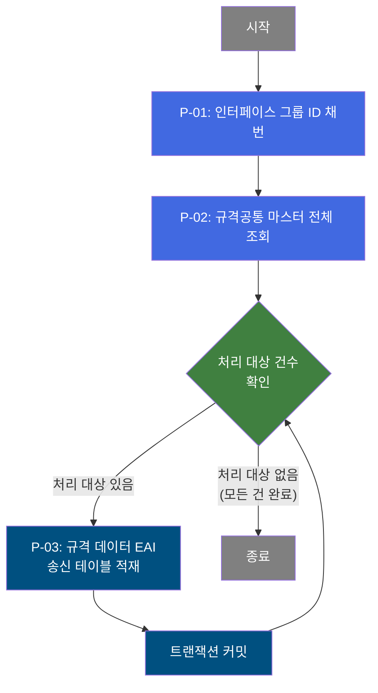

# B10S0010 비즈니스 프로세스 분석서 (BPA)

## 1. 시스템 개요

| 항목 | 내용 |
|------|------|
| 서비스 ID | B10S0010 |
| 업무명 | 규격공통 마스터 데이터 EAI 송신 |
| 서비스 타입 | nui |
| 분석 일시 | 2026-03-21 (KST) |
| 원본 분석일 | 2026-03-17 |
| 문서 버전 | 1.0 |

---

## 2. 시스템 목적

B10S0010은 MES 시스템에서 관리하는 규격공통 마스터 데이터를 ERP 등 외부 시스템으로 전송하기 위한 배치(NUI) 서비스이다. 마스터 데이터베이스에 등록된 전체 규격 정보를 일괄 조회한 뒤, 건별로 EAI 인터페이스 테이블에 적재하는 방식으로 동작한다.

이 서비스는 정기 배치 스케줄 또는 수동 실행을 통해 트리거되며, 규격명, 규격 연도, 주문 등급, 수용 비율, 최소 품질 로트 코드 등 규격 공통 정보를 외부 시스템과 동기화하는 것을 목적으로 한다.

운영 주체는 MES 시스템 관리자이며, EAI 연동을 통해 ERP 시스템이 최신 규격 마스터 정보를 수신할 수 있도록 지원한다.

---

## 3. 핵심 워크플로우

> 이 서비스는 단일 업무 프로세스로 구성되어 있어 핵심 워크플로우를 별도로 작성하지 않습니다. **4. 상세 워크플로우**를 참조하세요.

---

## 4. 상세 워크플로우

### 프로세스 흐름도 — 규격공통 마스터 EAI 송신 (P-01, P-02, P-03)

---

## 5. 비즈니스 로직 상세

P-01: 인터페이스 그룹 ID 채번 — EAI 전송 그룹 식별자 생성

- **입력**: 없음 (시스템 자동 채번)
- **처리**:
  1. 이번 배치 실행 단위를 식별하는 인터페이스 그룹 ID를 생성한다.
  2. 생성된 ID는 이후 모든 송신 레코드에 공통으로 부여되어 동일 배치 실행 단위를 묶는 키로 사용된다.
- **출력**: 인터페이스 그룹 ID (이후 프로세스 전체에서 공유)
- **예외**: 해당 없음

P-02: 규격공통 마스터 전체 조회 — EAI 송신 대상 목록 수집

- **입력**: 없음 (전체 조회)
- **처리**:
  1. 마스터 데이터 스키마의 규격공통 뷰(VI_M00_C10A1010)에서 전체 규격 정보를 조건 없이 일괄 조회한다.
  2. 조회 결과(규격 요약, 규격 연도, 규격명, 규격 전체명, 주문 등급, 수용 비율 규격, 최소 품질 로트 코드)를 처리 대상 목록으로 보관한다.
- **출력**: 처리 대상 규격 레코드 목록 (건별 반복 처리 입력값으로 사용)
- **예외**: 조회 결과가 0건이면 이후 루프 처리 없이 종료

P-03: 규격 데이터 EAI 송신 테이블 적재 — 건별 EAI 인터페이스 등록

- **입력**: P-02에서 조회한 규격 레코드 (1건씩 순차 처리)
- **처리**:
  1. 루프 컨트롤러가 처리 대상 목록에서 현재 Row를 선택한다.
  2. 해당 규격 정보(규격 요약, 연도, 규격명, 규격 전체명, 주문 등급, 수용 비율, 최소 품질 로트 코드)를 EAI 송신 테이블에 INSERT한다.
  3. 레코드에는 P-01에서 채번된 인터페이스 그룹 ID, 시퀀스 번호(자동 채번), CRUD 구분값('C'), 전송 상태('R': 전송 대기) 및 감사 정보(생성자/수정자 정보)를 함께 기록한다.
  4. 1건 처리 완료 후 트랜잭션을 커밋하고 다음 건으로 이동한다.
  5. 처리 대상 목록의 모든 건이 완료되면 루프를 종료한다.
- **출력**: TB_C10_B10S0010 (EAI 인터페이스 송신 테이블)에 규격 레코드 저장
- **예외**: 트랜잭션 오류 발생 시 해당 건 처리 실패로 기록하고 배치 종료

---

## 6. 커스텀 클래스 워크플로우

### DbQualDesignLoop (약 171줄)

**역할**: 이전 스텝에서 조회한 ResultSet을 1건씩 순차적으로 순회하며 후속 처리 액티비티 체인에 단건 기준 데이터를 제공하는 공통 루프 제어 컨트롤러이다.

이 클래스는 171줄(200줄 미만)로, Mermaid 워크플로우 대신 텍스트로 동작 방식을 기술한다.

**주요 동작 방식**:
- 최초 실행 시 이전 조회 결과의 전체 건수로 처리 카운터를 초기화한다.
- 매 루프 진입마다 에러 플래그를 초기화하고 현재 처리 Row의 컬럼값을 컨텍스트에 바인딩한다.
- 처리 카운터를 1씩 감소시키며, 카운터가 0이 되면 루프를 종료(`exit` 전이)한다.
- `param-count` 프로퍼티 미설정 또는 예외 발생 시 `failure` 전이를 반환한다.
- 40개 이상의 서비스에서 공유 사용되는 범용 컴포넌트이다.

---

## 7. 주요 유즈케이스

UC-01: 규격공통 마스터 전체 EAI 일괄 송신

- **Actor**: MES 배치 스케줄러 (또는 시스템 관리자)
- **목적**: MES에 등록된 전체 규격공통 마스터를 EAI 인터페이스 테이블에 적재하여 ERP로 동기화
- **주요 흐름**:
  1. 배치 서비스가 실행되어 인터페이스 그룹 ID를 채번한다.
  2. 마스터 데이터베이스에서 규격공통 전체 목록을 조회한다.
  3. 조회된 각 규격 레코드를 EAI 송신 테이블에 1건씩 INSERT하고 커밋한다.
  4. 전체 건 처리 완료 후 배치 서비스가 종료된다.
- **예외**: 조회 결과가 0건인 경우 INSERT 없이 즉시 정상 종료

UC-02: ERP 규격 마스터 데이터 갱신 지원

- **Actor**: EAI 미들웨어 / ERP 시스템
- **목적**: MES B10S0010 배치가 적재한 EAI 송신 테이블의 레코드를 읽어 ERP 측 규격 마스터를 최신 상태로 갱신
- **주요 흐름**:
  1. EAI 미들웨어가 전송 상태('R') 레코드를 폴링하여 ERP에 전송한다.
  2. ERP는 수신된 규격 데이터(규격명, 연도, 주문 등급 등)로 마스터를 갱신한다.
  3. EAI 미들웨어가 처리 완료 상태로 레코드를 업데이트한다.
- **예외**: ERP 수신 오류 시 EAI 재전송 정책에 따라 재처리

---

## 9. 관련 엔티티

### 엔티티 목록

| 엔티티(테이블) | 설명 | 사용 유형 |
|---------------|------|----------|
| VI_M00_C10A1010 | M00 마스터 스키마의 규격공통 마스터 뷰 | 조회 |
| TB_C10_B10S0010 | EAI 인터페이스 송신 테이블 (규격공통 마스터 전송용) | 저장 |

### 엔티티 간 관계
- VI_M00_C10A1010은 M00 마스터 스키마에서 제공하는 규격공통 마스터 데이터를 조회하는 뷰로, MES가 소유하지 않고 참조만 한다.
- TB_C10_B10S0010은 VI_M00_C10A1010에서 읽어온 규격 데이터를 EAI 송신 목적으로 적재하는 MES 소유 테이블이다. 각 레코드는 인터페이스 그룹 ID와 시퀀스 번호로 식별된다.

---

## 11. 특이사항 및 주의사항

### 1. 건별 커밋 방식 — 대용량 처리 시 주의
규격 레코드 1건 INSERT 후 즉시 커밋하는 방식으로 동작한다. 규격 건수가 많을 경우 커밋 횟수가 증가하지만, 중간에 오류가 발생하더라도 이미 처리된 건은 보존되어 재처리 범위를 최소화할 수 있다.

### 2. 루프 제어의 O(n²) 탐색 특성
DbQualDesignLoop는 매 루프마다 ResultSet 전체를 처음부터 재탐색하는 방식을 사용한다. 처리 건수가 n일 때 최대 n*(n+1)/2 회 탐색이 발생하므로(예: 100건 처리 시 최대 5,050회), 규격 마스터 건수가 매우 많아질 경우 성능 저하에 주의가 필요하다.

### 3. 전송 상태 초기값 'R' — EAI 미들웨어 연동 전제
INSERT 시 전송 상태(XSTAT)를 'R'(전송 대기)로, CRUD 구분(XCRUD)을 'C'(Create)로 고정하여 기록한다. EAI 미들웨어가 이 상태값을 폴링하여 ERP로 전송하는 별도 처리 흐름이 존재함을 전제로 한다.

### 4. 전체 마스터 재적재 방식 — 중복 방지 관리 필요
조건 없이 전체 규격공통 마스터를 적재하므로, 동일 배치를 반복 실행할 경우 EAI 테이블에 중복 레코드가 쌓일 수 있다. 실행 전 기존 데이터 정리 또는 중복 처리 정책을 운영 절차상 관리해야 한다.
