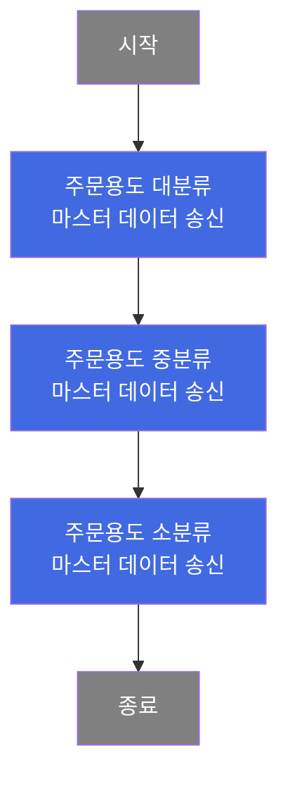
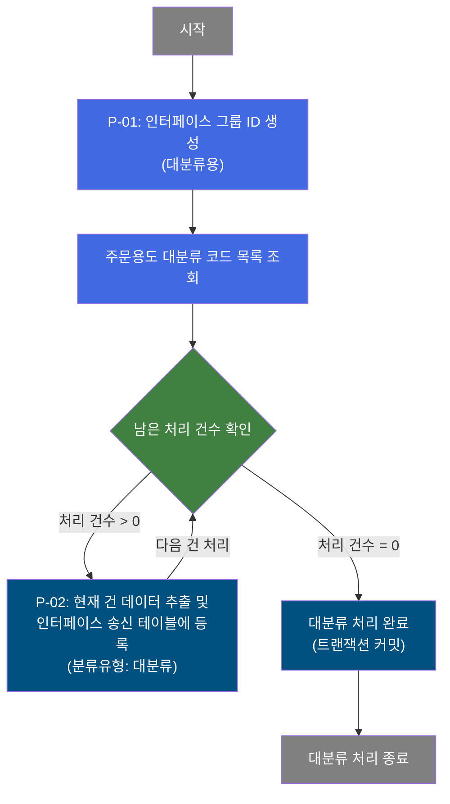
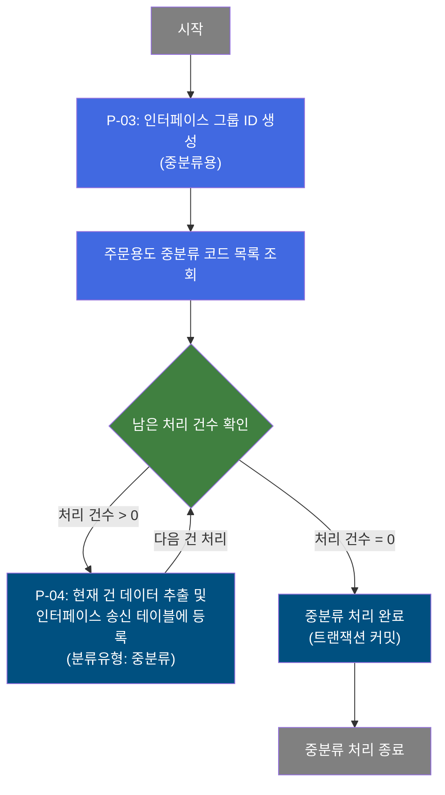
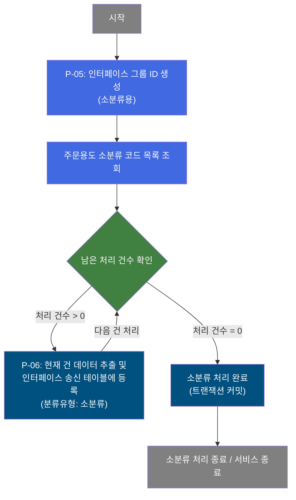

# B10S0020 비즈니스 프로세스 분석서 (BPA)

## 1. 시스템 개요

| 항목 | 내용 |
|------|------|
| 서비스 ID | B10S0020 |
| 업무명 | 주문용도코드 마스터 데이터 ERP 송신 |
| 서비스 타입 | nui |
| 분석 일시 | 2026-03-21 (KST) |
| 원본 분석일 | 2026-03-17 |
| 문서 버전 | 1.0 |

---

## 2. 시스템 목적

B10S0020은 MES 시스템에서 관리하는 주문용도코드(ORD_USG_CD) 마스터 데이터를 ERP 시스템으로 송신하는 배치 서비스이다. 주문용도코드는 대분류(LAR), 중분류(MID), 소분류(CD)의 3계층 구조로 관리되며, 본 서비스는 이 3가지 분류 유형 각각에 대해 마스터 데이터를 EAI 인터페이스 송신 테이블에 등록한다.

MES에서 공통코드 뷰(VI_M00_CODE_ACCESS)를 통해 각 분류 유형별 코드 목록을 조회한 후, 건별로 EAI 인터페이스 송신 테이블(TB_C10_B10S0020)에 적재하는 방식으로 동작한다. 각 분류 유형별 처리는 독립 트랜잭션으로 순차 실행되며, 이를 통해 ERP 시스템이 최신 주문용도 마스터 정보를 수신할 수 있도록 지원한다.

---

## 3. 핵심 워크플로우

---

## 4. 상세 워크플로우

### 프로세스 흐름도 — 주문용도 대분류 마스터 송신 (P-01, P-02)

### 프로세스 흐름도 — 주문용도 중분류 마스터 송신 (P-03, P-04)

### 프로세스 흐름도 — 주문용도 소분류 마스터 송신 (P-05, P-06)

---

## 5. 비즈니스 로직 상세

P-01: 인터페이스 그룹 ID 생성 — 대분류 처리 배치 그룹 식별자 발급

- **입력**: 배치 실행 컨텍스트 (시스템 생성)
- **처리**:
  1. 대분류(LAR) 처리 묶음을 식별하기 위한 인터페이스 그룹 ID를 생성한다.
  2. 생성된 그룹 ID는 이후 대분류 코드 건별 INSERT 시 공통 식별자로 사용된다.
- **출력**: 대분류 처리용 인터페이스 그룹 ID (컨텍스트에 저장)
- **예외**: 해당 없음

P-02: 주문용도 대분류 마스터 송신 — 대분류 코드 목록 건별 EAI 인터페이스 테이블 등록 및 커밋

- **입력**: M00APUSER 공통코드 뷰(VI_M00_CODE_ACCESS)에서 대분류 유형(ORD_USG_CD_LAR) 코드 목록 조회
- **처리**:
  1. 대분류 코드 목록을 전체 조회한다.
  2. 루프 제어를 통해 조회된 코드를 1건씩 순차 처리한다.
  3. 각 코드 건에 대해 분류유형을 대분류(B)로 지정하여 EAI 인터페이스 송신 테이블에 신규 등록한다. 등록 시 시퀀스로 순번을 생성하고, CRUD 유형은 C(Create), 상태는 R(Ready)로 고정한다.
  4. 모든 대분류 코드 처리 완료 후 트랜잭션을 커밋한다.
- **출력**: TB_C10_B10S0020 (EAI 인터페이스 송신 테이블)에 대분류 코드 건수만큼 레코드 생성
- **예외**: 오류 발생 시 오류 플래그(P_ERR_KEY)가 설정되며, 커밋 단계에서 오류 여부를 확인 후 처리한다.

P-03: 인터페이스 그룹 ID 생성 — 중분류 처리 배치 그룹 식별자 발급

- **입력**: 배치 실행 컨텍스트 (대분류 커밋 완료 후 순차 실행)
- **처리**:
  1. 중분류(MID) 처리 묶음을 식별하기 위한 인터페이스 그룹 ID를 생성한다.
  2. 생성된 그룹 ID는 이후 중분류 코드 건별 INSERT 시 공통 식별자로 사용된다.
- **출력**: 중분류 처리용 인터페이스 그룹 ID (컨텍스트에 저장)
- **예외**: 해당 없음

P-04: 주문용도 중분류 마스터 송신 — 중분류 코드 목록 건별 EAI 인터페이스 테이블 등록 및 커밋

- **입력**: M00APUSER 공통코드 뷰(VI_M00_CODE_ACCESS)에서 중분류 유형(ORD_USG_CD_MID) 코드 목록 조회
- **처리**:
  1. 중분류 코드 목록을 전체 조회한다.
  2. 루프 제어를 통해 조회된 코드를 1건씩 순차 처리한다.
  3. 각 코드 건에 대해 분류유형을 중분류(M)로 지정하여 EAI 인터페이스 송신 테이블에 신규 등록한다. 등록 시 시퀀스로 순번을 생성하고, CRUD 유형은 C(Create), 상태는 R(Ready)로 고정한다.
  4. 모든 중분류 코드 처리 완료 후 트랜잭션을 커밋한다.
- **출력**: TB_C10_B10S0020 (EAI 인터페이스 송신 테이블)에 중분류 코드 건수만큼 레코드 생성
- **예외**: 오류 발생 시 오류 플래그(P_ERR_KEY)가 설정되며, 커밋 단계에서 오류 여부를 확인 후 처리한다.

P-05: 인터페이스 그룹 ID 생성 — 소분류 처리 배치 그룹 식별자 발급

- **입력**: 배치 실행 컨텍스트 (중분류 커밋 완료 후 순차 실행)
- **처리**:
  1. 소분류(CD) 처리 묶음을 식별하기 위한 인터페이스 그룹 ID를 생성한다.
  2. 생성된 그룹 ID는 이후 소분류 코드 건별 INSERT 시 공통 식별자로 사용된다.
- **출력**: 소분류 처리용 인터페이스 그룹 ID (컨텍스트에 저장)
- **예외**: 해당 없음

P-06: 주문용도 소분류 마스터 송신 — 소분류 코드 목록 건별 EAI 인터페이스 테이블 등록 및 커밋

- **입력**: M00APUSER 공통코드 뷰(VI_M00_CODE_ACCESS)에서 소분류 유형(ORD_USG_CD) 코드 목록 조회
- **처리**:
  1. 소분류 코드 목록을 전체 조회한다.
  2. 루프 제어를 통해 조회된 코드를 1건씩 순차 처리한다.
  3. 각 코드 건에 대해 분류유형을 소분류(S)로 지정하여 EAI 인터페이스 송신 테이블에 신규 등록한다. 등록 시 시퀀스로 순번을 생성하고, CRUD 유형은 C(Create), 상태는 R(Ready)로 고정한다.
  4. 모든 소분류 코드 처리 완료 후 트랜잭션을 커밋한다.
- **출력**: TB_C10_B10S0020 (EAI 인터페이스 송신 테이블)에 소분류 코드 건수만큼 레코드 생성
- **예외**: 오류 발생 시 오류 플래그(P_ERR_KEY)가 설정되며, 커밋 단계에서 오류 여부를 확인 후 처리한다.

---

## 6. 커스텀 클래스 워크플로우

### DbQualDesignLoop (약 171줄)

**역할**: 이전 액티비티가 조회한 코드 목록(ResultSet)을 1건씩 순차 처리하기 위한 범용 루프 제어 액티비티. 처리 대상 건수를 카운터로 관리하며, 건수가 0이 되면 루프를 종료하고 다음 단계로 전이한다.

본 서비스에서는 동일 클래스를 대분류/중분류/소분류 각각에 대해 독립 인스턴스(PROC_LOOP_LAR, PROC_LOOP_MID, PROC_LOOP_CD)로 활용한다. 각 인스턴스는 대상 ResultSet 키와 카운터 변수명만 다르게 설정되어 동일한 루프 제어 로직을 재사용한다.

171줄로 200줄 미만이므로 Mermaid 워크플로우 대상에서 제외하며, 핵심 처리 방식은 다음과 같다.
- 카운터 변수가 컨텍스트에 없으면 ResultSet 전체 건수로 초기화한다.
- 매 루프마다 카운터를 1 감소시키고, 해당 순번의 Row 데이터를 컨텍스트에 바인딩한 뒤 `success` 전이로 후속 INSERT 액티비티를 호출한다.
- 카운터가 0이 되면 카운터 변수를 제거하고 `exit` 전이로 루프를 종료한다.
- `param-count`가 설정되지 않았거나 예외가 발생하면 `failure` 전이를 반환한다.

---

## 7. 주요 유즈케이스

UC-01: 주문용도 마스터 데이터 ERP 정기 동기화

- **Actor**: 배치 스케줄러 (시스템 자동 실행)
- **목적**: MES의 주문용도 공통코드(대/중/소분류)를 ERP 시스템으로 정기 송신하여 양 시스템의 마스터 데이터를 동기화한다.
- **주요 흐름**:
  1. 배치 스케줄러가 서비스를 기동한다.
  2. 대분류 코드 목록을 조회하고 건별로 EAI 인터페이스 테이블에 등록 후 커밋한다.
  3. 중분류 코드 목록을 조회하고 건별로 EAI 인터페이스 테이블에 등록 후 커밋한다.
  4. 소분류 코드 목록을 조회하고 건별로 EAI 인터페이스 테이블에 등록 후 커밋한다.
  5. 서비스가 정상 종료된다.
- **예외**: 특정 분류 유형 처리 중 오류 발생 시 해당 분류 유형의 오류 건에 오류 플래그가 설정되나, exitFlag=N 설정으로 이후 분류 유형 처리는 계속 진행된다.

UC-02: 대/중/소분류 분리 송신 및 독립 트랜잭션 관리

- **Actor**: 배치 스케줄러 (시스템 자동 실행)
- **목적**: 3계층 주문용도 코드 분류를 독립 트랜잭션으로 관리하여, 일부 분류 유형 처리 실패 시에도 성공한 분류 유형의 데이터는 손실 없이 커밋 보장한다.
- **주요 흐름**:
  1. 대분류 처리 완료 후 독립 트랜잭션으로 커밋한다.
  2. 중분류 처리 완료 후 독립 트랜잭션으로 커밋한다.
  3. 소분류 처리 완료 후 독립 트랜잭션으로 커밋한다.
- **예외**: 각 분류 유형이 독립 트랜잭션으로 처리되므로 한 분류의 실패가 다른 분류의 커밋에 영향을 주지 않는다.

---

## 9. 관련 엔티티

### 엔티티 목록

| 엔티티(테이블) | 설명 | 사용 유형 |
|---------------|------|----------|
| VI_M00_CODE_ACCESS | M00APUSER 공통코드 뷰 — 주문용도코드 대/중/소분류 목록 제공 | 조회 |
| TB_C10_B10S0020 | EAI 인터페이스 송신 테이블 — MES→ERP 주문용도 마스터 데이터 송신 대기 레코드 저장 | 저장 |

### 엔티티 간 관계

- VI_M00_CODE_ACCESS는 M00APUSER 스키마의 공통코드를 코드유형별로 필터링하여 조회할 수 있는 뷰이며, 대분류(ORD_USG_CD_LAR), 중분류(ORD_USG_CD_MID), 소분류(ORD_USG_CD) 각각 독립 조회된다.
- TB_C10_B10S0020은 VI_M00_CODE_ACCESS에서 조회된 코드 데이터를 분류유형 구분자(USG_TP: B/M/S)와 함께 저장하며, 각 레코드는 시퀀스(SQ_C10_B10S0020)로 고유 순번이 부여된다.

---

## 11. 특이사항 및 주의사항

### 1. 3계층 분류 독립 트랜잭션 처리
주문용도 대분류, 중분류, 소분류는 각각 별도 인터페이스 그룹 ID로 묶여 독립 트랜잭션으로 처리된다. exitFlag=N 설정으로 인해 특정 분류 유형 처리 중 오류가 발생해도 서비스가 중단되지 않고 다음 분류 유형 처리로 진행된다. 이는 일부 분류의 실패가 전체 동기화를 중단시키지 않도록 설계된 것으로, 운영 모니터링 시 각 분류 유형별 오류 여부를 개별 확인해야 한다.

### 2. EAI 인터페이스 송신 테이블 누적 등록 방식
본 서비스는 기존 데이터를 삭제/갱신하지 않고 항상 신규 INSERT(XCRUD='C') 방식으로 등록한다. 동일 코드에 대해 서비스가 반복 실행될 경우 중복 레코드가 누적될 수 있으므로, EAI 수신 측의 처리 로직 또는 서비스 실행 주기 관리가 중요하다.

### 3. DbQualDesignLoop의 O(n²) 탐색 성능 특성
루프 제어 클래스(DbQualDesignLoop)는 매 건 처리 시 ResultSet을 처음부터 재탐색하는 방식을 사용한다. 주문용도 코드 건수가 많아질수록 탐색 횟수가 제곱에 비례하여 증가한다. 코드 건수가 수백 건 이상이 될 경우 배치 처리 시간 증가가 예상되므로 주기적으로 코드 건수를 모니터링하는 것이 권고된다.

### 4. 공통코드 뷰 의존성
조회 대상이 MESAPUSER 직접 테이블이 아닌 M00APUSER 공통코드 뷰(VI_M00_CODE_ACCESS)이므로, 마스터 코드 관리 권한은 M00 모듈에 있다. C10 모듈은 해당 뷰를 통해 조회만 수행하며, 코드 추가/변경은 M00 모듈 담당 팀에서 관리해야 한다.

### 5. 감사 정보 자동 기록
EAI 인터페이스 송신 테이블에 INSERT 시 isAudit=true 옵션이 적용되어 생성자/생성일시/최종변경자/최종변경일시 등 감사 정보가 자동으로 기록된다. 이를 통해 데이터 등록 이력 추적이 가능하다.
