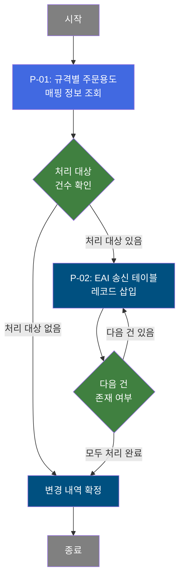

# B10S0030 비즈니스 프로세스 분석서 (BPA)

## 1. 시스템 개요

| 항목 | 내용 |
|------|------|
| 서비스 ID | B10S0030 |
| 업무명 | 규격별 주문용도 정보 EAI 송신 배치 |
| 서비스 타입 | nui |
| 분석 일시 | 2026-03-21 (KST) |
| 원본 분석일 | 2026-03-17 |
| 문서 버전 | 1.0 |

---

## 2. 시스템 목적

B10S0030은 MES 시스템에서 관리하는 규격별 주문용도 매핑 정보를 ERP 등 외부 시스템으로 송신하기 위한 배치(NUI) 서비스이다. 마스터 규칙 테이블에 정의된 규격 약호와 두께 범위에 따른 주문용도 코드 매핑 데이터를 일괄 조회한 후, EAI 인터페이스 송신 테이블에 적재함으로써 외부 시스템과의 데이터 동기화를 수행한다.

이 서비스는 스케줄러 또는 수동 트리거에 의해 주기적으로 실행되며, 규칙 ID '1452'에 해당하는 모든 규격-두께-주문용도 매핑 레코드를 순차 처리한다. 처리 결과는 EAI 인터페이스 송신 테이블에 신규 레코드로 삽입되어 외부 시스템이 수신할 수 있도록 준비된다.

---

## 3. 핵심 워크플로우

> 이 서비스는 단일 업무 프로세스로 구성되어 있어 핵심 워크플로우를 별도로 작성하지 않습니다. **4. 상세 워크플로우**를 참조하세요.

---

## 4. 상세 워크플로우

### 프로세스 흐름도 — 규격별 주문용도 EAI 송신 (P-01, P-02)

---

## 5. 비즈니스 로직 상세

P-01: 규격별 주문용도 매핑 정보 조회 — 마스터 규칙 테이블에서 전체 매핑 데이터 일괄 조회

- **입력**: 규칙 ID '1452' (고정값, 파라미터 없음)
- **처리**:
  1. 마스터 규칙 테이블(TB_M00_RULES040)에서 규칙 ID '1452'에 해당하는 모든 레코드를 조회
  2. 규격 약호(SPC_AVR), 두께 범위 하한값(THK_RNG_LLV), 두께 범위 상한값(THK_RNG_ULV), 주문용도 코드(ORD_USG_CD) 매핑 정보를 수집
  3. 규칙구성순서 및 규칙구성번호 기준으로 정렬하여 순서대로 처리할 레코드 목록을 구성
- **출력**: 처리 대상 규격-두께-주문용도 매핑 레코드 목록 (메모리 상 ResultSet)
- **예외**: 조회 결과가 없는 경우 → 후속 삽입 처리 없이 배치 정상 종료

P-02: EAI 송신 테이블 레코드 삽입 — 조회된 매핑 정보를 1건씩 EAI 인터페이스 테이블에 적재

- **입력**: P-01에서 조회된 레코드 목록을 루프 컨트롤러가 1건씩 순차 공급 (규격 약호, 두께 범위 하한/상한, 주문용도 코드, 인터페이스 그룹 ID)
- **처리**:
  1. 루프 컨트롤러가 ResultSet을 1건씩 순회하며 현재 처리 Row의 값을 추출
  2. 매 건 처리 전 오류 플래그를 초기화하여 이전 건의 오류 상태가 이월되지 않도록 방지
  3. EAI 인터페이스 송신 테이블(TB_C10_B10S0030)에 신규 레코드를 삽입:
     - 인터페이스 그룹 ID, 규격 약호, 두께 범위(하한/상한), 주문용도 코드를 저장
     - 시퀀스(SQ_C10_B10S0030.NEXTVAL)로 일련번호를 자동 생성
     - XCRUD='C'(신규), XSTAT='R'(대기) 상태값 고정 설정
     - 감사 정보(생성자, 생성일시, 최종변경자, 최종변경일시) 함께 기록
  4. 처리 완료 후 남은 건수를 확인하여 추가 처리 여부 결정
  5. 모든 건 처리 완료 시 트랜잭션 커밋으로 변경 내역 확정
- **출력**: TB_C10_B10S0030에 신규 레코드 삽입 (건당 1건)
- **예외**: 삽입 중 오류 발생 → 오류 플래그 설정 후 배치 실패 처리

---

## 6. 커스텀 클래스 워크플로우

### DbQualDesignLoop (약 171줄)

**역할**: 이전 액티비티가 조회한 ResultSet을 1건씩 순회하기 위한 루프 제어 액티비티. 현재 처리 Row의 컬럼값을 컨텍스트에 바인딩하여 후속 단건 처리 액티비티에 공급하고, 처리 건수 카운터를 관리하여 루프 종료 시점을 제어한다.

171줄로 200줄 미만이므로 Mermaid 워크플로우 생략.

**주요 동작 요약**:
- 최초 진입 시 ResultSet 전체 건수로 카운터를 초기화
- 매 루프마다 카운터를 1 감소하고 `total_row - procCount` 수식으로 현재 처리 Row 위치 계산
- 오류 플래그(`P_ERR_KEY`)를 매 루프 시작 시 초기화하여 건별 독립 처리 보장
- 카운터가 0이 되면 컨텍스트에서 카운터 변수를 제거하고 `exit` 전이 반환으로 루프 종료
- `param-count` 미설정 시 또는 예외 발생 시 `failure` 전이 반환

---

## 7. 주요 유즈케이스

UC-01: 규격-두께-주문용도 매핑 정보 EAI 일괄 송신

- **Actor**: 배치 스케줄러 (자동 실행)
- **목적**: 마스터 규칙 테이블에 등록된 모든 규격별 주문용도 매핑 정보를 EAI 인터페이스 테이블에 적재하여 외부 시스템(ERP 등)으로 데이터를 전달
- **주요 흐름**:
  1. 배치 스케줄러가 서비스를 기동하면 인터페이스 그룹 ID가 발급됨
  2. 마스터 규칙 테이블에서 규칙 ID '1452'에 해당하는 전체 매핑 레코드를 조회
  3. 조회된 레코드를 1건씩 순회하며 EAI 송신 테이블에 삽입
  4. 모든 건 처리 완료 후 트랜잭션 커밋
- **예외**: 조회 결과가 없으면 삽입 없이 정상 종료

UC-02: 신규 규격-주문용도 매핑 추가 후 EAI 재송신

- **Actor**: 배치 스케줄러 (마스터 데이터 변경 후 재실행)
- **목적**: 마스터 규칙 테이블에 신규 규격-주문용도 매핑이 추가된 경우, 배치를 재실행하여 추가된 정보를 EAI 인터페이스 테이블에 반영
- **주요 흐름**:
  1. 마스터 데이터 관리자가 TB_M00_RULES040에 신규 매핑 레코드를 등록
  2. 배치 서비스 실행 시 추가된 레코드 포함 전체 목록 재조회
  3. 신규 인터페이스 그룹 ID로 전체 레코드를 EAI 송신 테이블에 삽입
- **예외**: 중복 삽입은 신규 시퀀스로 별도 레코드 생성되므로 PK 충돌 없음

---

## 9. 관련 엔티티

### 엔티티 목록

| 엔티티(테이블) | 설명 | 사용 유형 |
|---------------|------|----------|
| TB_M00_RULES040 | 마스터 규칙 구성 테이블 — 규격별 두께 범위 및 주문용도 매핑 규칙 정의 | 조회 |
| TB_C10_B10S0030 | EAI 인터페이스 송신 테이블 — 외부 시스템으로 전송할 규격-주문용도 매핑 정보 적재 | 저장 |

### 엔티티 간 관계
- TB_M00_RULES040은 규격별 주문용도 매핑 규칙의 원본 데이터를 보관하며, 규칙 ID '1452'로 식별되는 레코드 집합이 본 서비스의 처리 대상이 된다.
- TB_C10_B10S0030은 TB_M00_RULES040에서 읽어온 매핑 정보를 외부 시스템 송신 형식으로 변환 저장하는 인터페이스 버퍼 역할을 한다. 두 테이블은 데이터 변환 및 외부 연동 관점에서 소스-대상(Source-Target) 관계를 가진다.

---

## 11. 특이사항 및 주의사항

### 1. 고정 규칙 ID 기반 전량 조회
이 서비스는 별도의 실행 파라미터 없이 규칙 ID '1452'를 하드코딩하여 해당 규칙의 전체 레코드를 매 실행마다 일괄 조회한다. 따라서 배치가 반복 실행될 경우 EAI 송신 테이블에 중복 레코드가 누적될 수 있으며, 외부 시스템의 수신 처리 로직이 XSTAT(상태값) 기반으로 중복 처리를 방지해야 한다.

### 2. 루프 처리 성능 특성 (O(n²) 탐색)
DbQualDesignLoop 클래스는 매 루프마다 ResultSet을 처음부터 재탐색하는 방식(`reset()` 후 전체 while 순회)으로 동작한다. 처리 대상 건수가 증가할수록 탐색 횟수가 누적 증가(예: 100건 처리 시 최대 5,050회 탐색)하므로, TB_M00_RULES040의 규칙 ID '1452' 레코드 수가 대폭 증가할 경우 배치 실행 시간이 비선형적으로 늘어날 수 있다.

### 3. 감사 정보 및 EAI 상태 관리
EAI 송신 테이블 삽입 시 XCRUD='C'(신규 생성), XSTAT='R'(대기/Ready) 상태가 고정 설정된다. 이는 EAI 미들웨어가 XSTAT='R' 레코드를 대기 중인 송신 건으로 인식하여 처리하는 구조임을 의미한다. 배치 실행 후 외부 시스템으로의 실제 데이터 전송은 EAI 미들웨어가 담당하며, 본 서비스는 인터페이스 테이블 적재까지만 책임진다.
