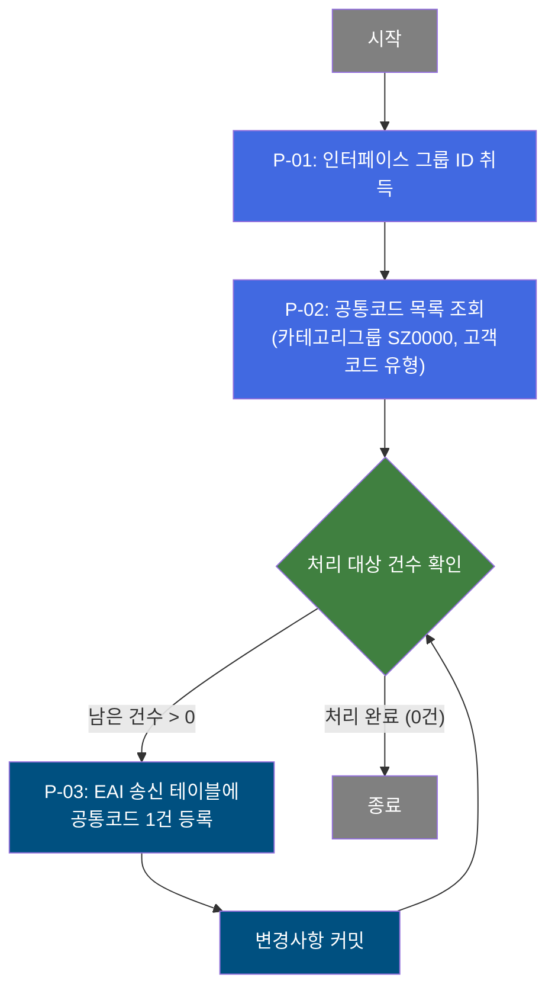

# B10S0040 비즈니스 프로세스 분석서 (BPA)

## 1. 시스템 개요

| 항목 | 내용 |
|------|------|
| 서비스 ID | B10S0040 |
| 업무명 | 공통코드 EAI 송신 처리 |
| 서비스 타입 | nui |
| 분석 일시 | 2026-03-21 (KST) |
| 원본 분석일 | 2026-03-17 |
| 문서 버전 | 1.0 |

---

## 2. 시스템 목적

B10S0040은 MES 내부 공통코드(Master Code) 정보를 ERP 시스템으로 외부 송신하기 위한 배치 NUI 서비스이다. M00 마스터 스키마에 등록된 공통코드 목록을 조회하여 EAI 인터페이스 테이블에 일괄 적재함으로써, ERP 측에서 MES 코드 체계를 동기화할 수 있도록 지원한다.

이 서비스는 사람이 개입하지 않는 자동화 배치 프로세스로 동작하며, 스케줄러 또는 배치 실행 요청에 의해 기동된다. 처리 대상은 공통코드 카테고리그룹 'SZ0000' 및 고객코드(CUS_CD) 유형이며, 각 코드 건을 루프 방식으로 1건씩 EAI 송신 테이블에 등록한다.

주요 사용 목적은 MES-ERP 간 코드 테이블 일관성 유지이며, 코드 신규 등록 또는 변경 시 ERP로의 반영 트리거 역할을 수행한다.

---

## 3. 핵심 워크플로우

이 서비스는 단일 업무 프로세스로 구성되어 있어 핵심 워크플로우를 별도로 작성하지 않습니다. **4. 상세 워크플로우**를 참조하세요.

---

## 4. 상세 워크플로우

### 프로세스 흐름도 — 공통코드 EAI 송신 등록 (P-01, P-02, P-03)

---

## 5. 비즈니스 로직 상세

P-01: 인터페이스 그룹 ID 취득 — 배치 실행 시 EAI 전문 묶음 식별자 생성

- **입력**: 배치 실행 파라미터 (인터페이스 그룹 ID)
- **처리**:
  1. EAI 전문 묶음 단위를 식별하는 인터페이스 그룹 ID를 취득한다.
  2. 해당 ID는 이후 모든 EAI 송신 레코드에 동일하게 적용되어 배치 단위 추적을 가능하게 한다.
- **출력**: 인터페이스 그룹 ID (이후 처리 전체에서 공유)
- **예외**: 없음

P-02: 공통코드 목록 조회 — M00 마스터에서 EAI 송신 대상 공통코드 전체 조회

- **입력**: 없음 (고정 조건으로 조회)
- **처리**:
  1. M00 마스터 스키마의 공통코드 뷰에서 카테고리그룹 'SZ0000'에 속하고 코드유형이 고객코드(CUS_CD)인 코드 목록을 전체 조회한다.
  2. 조회 결과는 코드유형 및 코드값 순으로 정렬된다.
  3. 조회된 목록은 이후 루프 처리의 입력 데이터로 사용된다.
- **출력**: 공통코드 목록 (마스터ID, 코드값, 마스터명, 코드명 포함)
- **예외**: 없음 (조회 결과가 0건이면 루프 없이 종료)

P-03: EAI 송신 테이블 등록 — 공통코드 1건을 EAI 인터페이스 테이블에 적재

- **입력**: P-02에서 조회한 공통코드 목록 중 현재 처리 건 (마스터ID, 코드값, 마스터명, 코드명), 인터페이스 그룹 ID
- **처리**:
  1. 공통코드 1건에 대한 EAI 인터페이스 송신 레코드를 생성한다.
  2. 시퀀스를 이용해 레코드 순번을 자동 부여하고, CRUD 구분을 '신규생성(C)', 처리상태를 '대기(R)'로 설정한다.
  3. 감사 정보(생성자, 생성일시, 최종변경자, 최종변경일시)를 함께 기록한다.
  4. 처리 성공 후 트랜잭션을 커밋하고 다음 건 처리로 진행한다.
  5. 전체 건 처리 완료 시 루프를 종료한다.
- **출력**: EAI 인터페이스 송신 테이블(TB_C10_B10S0040)에 공통코드 1건 신규 등록
- **예외**: 에러 플래그(P_ERR_KEY)를 매 루프 진입 시 초기화하여 이전 건 오류가 현재 건 처리에 영향을 주지 않도록 격리

---

## 6. 커스텀 클래스 워크플로우

### DbQualDesignLoop (171줄)

**역할**: 이전 액티비티가 조회한 공통코드 ResultSet을 1건씩 순회하는 루프 제어 액티비티. 남은 처리 건수를 카운터로 관리하고, 현재 처리 대상 Row의 데이터를 후속 액티비티가 사용할 수 있도록 컨텍스트에 바인딩한다. 처리 건수가 0이 되면 루프를 종료한다.

총 라인 수가 171줄(200줄 미만)이므로 Mermaid 워크플로우 작성 대상에서 제외하며, 클래스 역할만 텍스트로 기술한다.

주요 동작:
- 루프 최초 진입 시 전체 조회 건수로 카운터를 초기화
- 매 루프마다 에러 플래그(`P_ERR_KEY`)와 품질설계 에러 여부를 초기화하여 건별 처리 격리 보장
- 역방향 카운터(감소)와 순방향 인덱스 계산(`this_row = total_row - procCount`) 방식으로 현재 처리 Row 탐색
- 처리 건수가 0이 되면 컨텍스트에서 카운터를 제거하고 루프 종료 전이 반환

---

## 7. 주요 유즈케이스

UC-01: 공통코드 일괄 EAI 송신 등록

- **Actor**: 배치 스케줄러 / 운영 담당자 (수동 배치 기동 시)
- **목적**: MES에 등록된 공통코드를 ERP로 동기화하기 위해 EAI 인터페이스 테이블에 일괄 적재
- **주요 흐름**:
  1. 배치 서비스가 인터페이스 그룹 ID를 취득한다.
  2. M00 마스터에서 카테고리그룹 SZ0000에 속하는 고객코드(CUS_CD) 전체를 조회한다.
  3. 조회된 공통코드 건수만큼 루프를 수행하며, 각 건을 EAI 인터페이스 송신 테이블에 신규 등록한다.
  4. 각 건 등록 후 즉시 커밋하여 처리 결과를 확정한다.
  5. 전체 건 처리 완료 후 배치 종료.
- **예외**: 조회 결과가 0건이면 루프 없이 정상 종료

UC-02: EAI 전문 단위 식별 및 추적

- **Actor**: EAI 미들웨어 / 운영 담당자 (인터페이스 모니터링)
- **목적**: 하나의 배치 실행 단위로 생성된 EAI 전문들을 인터페이스 그룹 ID로 묶어 추적 가능하도록 관리
- **주요 흐름**:
  1. 배치 실행 시 단일 인터페이스 그룹 ID가 부여된다.
  2. 해당 배치에서 생성되는 모든 EAI 송신 레코드에 동일한 그룹 ID가 기록된다.
  3. 운영 담당자는 그룹 ID를 기준으로 해당 배치 실행분의 처리 현황을 일괄 조회할 수 있다.
- **예외**: 인터페이스 그룹 ID 미취득 시 이후 처리 불가

---

## 9. 관련 엔티티

### 엔티티 목록

| 엔티티(테이블) | 설명 | 사용 유형 |
|---------------|------|----------|
| TB_C10_B10S0040 | EAI 공통코드 송신 인터페이스 테이블 | 저장 |
| VI_M00_CODE_ACCESS | M00 마스터 공통코드 조회 뷰 | 조회 |

### 엔티티 간 관계
- `VI_M00_CODE_ACCESS`는 M00 마스터 스키마의 공통코드를 제공하는 조회 전용 뷰로, `TB_C10_B10S0040`에 적재할 원본 데이터를 공급한다.
- `TB_C10_B10S0040`은 EAI 미들웨어가 폴링하는 송신 대기 테이블로, EAIAPUSER 스키마에 위치하며 MES에서 생성한 레코드를 ERP로 전달하는 역할을 수행한다.

---

## 11. 특이사항 및 주의사항

### 1. 건별 즉시 커밋 방식
루프 1건 처리 후 즉시 커밋하는 방식을 채택하고 있다. 이는 중간 오류 발생 시 이미 처리 완료된 건은 보존되고 실패 건만 재처리 대상이 되도록 설계된 것이다. 다만, 배치 전체를 단일 트랜잭션으로 관리하지 않으므로 부분 성공 상태가 발생할 수 있어 운영 모니터링이 필요하다.

### 2. 루프 제어 클래스의 O(n²) 탐색 특성
루프 제어 클래스(DbQualDesignLoop)는 매 루프 진입 시 ResultSet을 처음부터 재탐색하는 구조이다. 처리 건수가 많을수록 탐색 횟수가 누적 증가하므로(100건 처리 시 최대 5,050회 탐색), 대량 데이터 처리 시 성능 저하가 발생할 수 있다. 공통코드 대상이 소량인 경우 실질적 영향은 미미하나, 처리 대상 확대 시 주의가 필요하다.

### 3. 고정 조회 조건 (SZ0000, CUS_CD)
송신 대상 공통코드는 카테고리그룹 'SZ0000' 및 코드유형 'CUS_CD'로 하드코딩되어 있다. 송신 대상 코드 유형을 추가하거나 변경하려면 서비스 XML 또는 쿼리 파일을 직접 수정해야 하며, 파라미터화되어 있지 않다.

### 4. EAI 테이블의 초기 처리 상태
EAI 송신 테이블에 등록되는 레코드는 CRUD 구분 'C(신규)', 처리 상태 'R(대기)' 로 고정 설정된다. 이는 EAI 미들웨어가 'R' 상태 레코드를 폴링하여 ERP로 전송하는 아키텍처를 전제로 한 설계이며, EAI 미들웨어 연동 설정과 일치해야 정상 동작한다.
