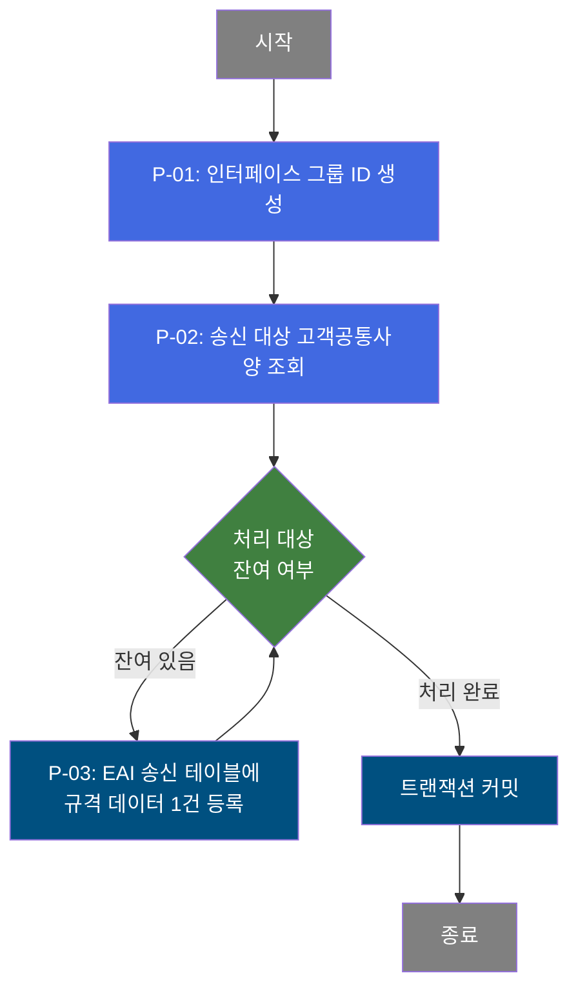

# B10S0050 비즈니스 프로세스 분석서 (BPA)

## 1. 시스템 개요

| 항목 | 내용 |
|------|------|
| 서비스 ID | B10S0050 |
| 업무명 | 고객공통사양 ERP 송신 |
| 서비스 타입 | nui |
| 분석 일시 | 2026-03-21 (KST) |
| 원본 분석일 | 2026-03-17 |
| 문서 버전 | 1.0 |

---

## 2. 시스템 목적

B10S0050은 MES(제조실행시스템)에 등록된 **고객공통사양 Master Data**를 ERP 시스템으로 송신하기 위한 배치(NUI) 서비스이다. 고객사별 제품 규격 정보(두께·폭·길이 범위, 허용오차, 표면처리 코드, BOM 번호 등)를 MES 공통 뷰에서 조회하여 EAI 송신 테이블에 적재하는 역할을 수행한다.

이 서비스는 MES와 ERP 간 데이터 정합성을 유지하기 위해 운용되며, 고객사별 제품 규격 기준이 변경될 때마다 최신 정보를 ERP로 전달함으로써 생산 계획 및 품질 관리 업무를 지원한다. 배치 방식으로 동작하므로 별도의 화면 조작 없이 시스템이 자동으로 전체 대상 레코드를 순차 처리한다.

---

## 3. 핵심 워크플로우

> 이 서비스는 단일 업무 프로세스로 구성되어 있어 핵심 워크플로우를 별도로 작성하지 않습니다. **4. 상세 워크플로우**를 참조하세요.

---

## 4. 상세 워크플로우

### 프로세스 흐름도 — 고객공통사양 ERP 송신 (P-01, P-02, P-03)

---

## 5. 비즈니스 로직 상세

P-01: 인터페이스 그룹 ID 생성 — 배치 실행 단위 식별자 발급

- **입력**: 시스템 배치 실행 요청
- **처리**:
  1. 이번 배치 실행에 부여할 고유 인터페이스 그룹 ID를 생성한다.
  2. 생성된 ID는 이후 삽입되는 모든 송신 레코드에 공통으로 부여되어 배치 실행 묶음을 식별한다.
- **출력**: 인터페이스 그룹 ID (이후 프로세스에서 사용)
- **예외**: 없음

P-02: 송신 대상 고객공통사양 조회 — 고객공통사양·인수도기준 통합 조회

- **입력**: MES 공통 뷰 (VI_M00_C10A1020, VI_M00_C10A1023)
- **처리**:
  1. 고객공통사양 뷰(VI_M00_C10A1020)에서 전체 고객사별 제품 규격 정보를 조회한다.
  2. 고객배치용지번호를 기준으로 고객인수도기준 뷰(VI_M00_C10A1023)와 LEFT OUTER JOIN하여 두께·폭·길이 허용오차 정보를 함께 취득한다.
  3. 조회 결과 전체를 루프 처리 대상 ResultSet으로 보유한다.
- **출력**: 루프 처리 대상 고객공통사양 레코드 목록 (고객사 코드, 제품명 코드, 두께/폭/길이 범위, 허용오차, 표면처리, BOM 번호 등 포함)
- **예외**: 조회 결과가 0건이면 후속 삽입 처리 없이 커밋 후 종료

P-03: EAI 송신 테이블에 규격 데이터 1건 등록 — 레코드 단위 반복 삽입

- **입력**: P-02 조회 결과 중 현재 처리 순번의 고객공통사양 레코드 1건
- **처리**:
  1. 루프 제어기(DbQualDesignLoop)가 ResultSet에서 현재 처리 Row를 추출하여 처리 컨텍스트에 바인딩한다.
  2. 인터페이스 그룹 ID, 시퀀스 번호(자동 채번), 고객배치용지번호, 규격요약, 규격연도, 주문용도, 고객사코드, 제품명코드, 두께/폭/길이 범위, 허용오차, 고객요청 롤두께, 주문두께 유형, 두께 계산 적용 코드, 갈바닉 도금 지정, 표면처리 코드, BOM 번호, 고객배치명, 감사 정보(생성/변경 일시·주체) 등을 EAI 송신 테이블(TB_C10_B10S0050)에 INSERT한다.
  3. 레코드의 CRUD 상태는 'C'(Create), 처리 상태는 'R'(Ready)로 고정 설정된다.
  4. 삽입 완료 후 루프 카운터를 감소시키고 잔여 건수가 있으면 다음 Row 처리로 복귀한다.
- **출력**: TB_C10_B10S0050에 1건 삽입
- **예외**: 삽입 오류 시 에러 플래그(P_ERR_KEY) 설정, 루프 전이 실패

---

## 6. 커스텀 클래스 워크플로우

### DbQualDesignLoop (약 171줄)

**역할**: GLUE Framework NUI 서비스에서 이전 액티비티가 조회한 ResultSet을 1건씩 순회 처리하기 위한 공통 루프 제어 액티비티.

- 처음 진입 시 ResultSet 전체 건수로 루프 카운터를 초기화하며, 매 호출마다 카운터를 1 감소시키고 현재 처리 Row의 컬럼값을 처리 컨텍스트에 바인딩한다.
- 잔여 건수가 0이 되면 카운터 변수를 제거하고 `exit` 전이를 반환하여 루프를 종료한다.
- 매 루프 진입 시 에러 플래그(P_ERR_KEY)와 품질설계 에러 여부(QLT_DSN_ERR_YN)를 초기화하여 이전 Row 처리 결과가 이후 Row에 영향을 주지 않도록 보장한다.
- 171줄로 200줄 미만이므로 Mermaid 워크플로우 대상에서 제외된다.

---

## 7. 주요 유즈케이스

UC-01: 고객공통사양 전체 일괄 ERP 송신

- **Actor**: 배치 스케줄러(시스템 자동 실행)
- **목적**: MES에 등록된 모든 고객사의 최신 제품 규격 기준을 ERP로 일괄 전달
- **주요 흐름**:
  1. 배치 스케줄러가 B10S0050 서비스를 기동한다.
  2. 인터페이스 그룹 ID가 발급되어 이번 배치 실행을 식별한다.
  3. 고객공통사양 및 인수도기준 정보 전체를 MES 공통 뷰에서 조회한다.
  4. 조회 결과를 1건씩 순회하며 EAI 송신 테이블에 INSERT한다.
  5. 전체 레코드 처리 완료 후 트랜잭션이 커밋된다.
- **예외**: 조회 결과가 0건인 경우 삽입 없이 정상 종료

UC-02: 고객인수도기준 허용오차 포함 송신

- **Actor**: 배치 스케줄러(시스템 자동 실행)
- **목적**: 고객공통사양에 연계된 인수도기준(두께·폭·길이 허용오차)을 함께 ERP로 전달하여 품질 검사 기준 정합성 확보
- **주요 흐름**:
  1. 고객공통사양 조회 시 고객배치용지번호를 키로 인수도기준 뷰와 LEFT OUTER JOIN하여 허용오차 정보를 포함한다.
  2. 인수도기준이 없는 레코드도 NULL 허용오차로 송신 테이블에 포함된다.
  3. ERP는 수신된 허용오차 정보를 품질 검사 기준으로 활용한다.
- **예외**: 인수도기준이 없는 고객공통사양 레코드는 허용오차 항목이 NULL로 삽입됨

---

## 9. 관련 엔티티

### 엔티티 목록

| 엔티티(테이블/뷰) | 설명 | 사용 유형 |
|-----------------|------|----------|
| VI_M00_C10A1020 | 고객공통사양 정보 뷰 (고객배치용지 기준 제품 규격) | 조회 |
| VI_M00_C10A1023 | 고객인수도기준 정보 뷰 (두께·폭·길이 허용오차) | 조회 |
| TB_C10_B10S0050 | EAI 송신 대기 테이블 (고객공통사양 External Interface) | 저장 |

### 엔티티 간 관계
- VI_M00_C10A1020과 VI_M00_C10A1023은 고객배치용지번호(CUS_BTH_PAP_NO)를 기준으로 LEFT OUTER JOIN 관계이다. 인수도기준이 없는 고객공통사양 레코드도 송신 대상에 포함된다.
- TB_C10_B10S0050은 VI_M00_C10A1020·VI_M00_C10A1023에서 조회된 데이터를 EAI로 전달하기 위한 스테이징 테이블로, 조회 뷰와는 독립적으로 존재한다.

---

## 11. 특이사항 및 주의사항

### 1. 배치 단위 식별을 위한 인터페이스 그룹 ID 부여
매 배치 실행 시마다 고유한 인터페이스 그룹 ID(IF_GRP_ID)가 생성되어 해당 실행에서 삽입된 모든 레코드에 공통 부여된다. 이를 통해 EAI 수신 측에서 특정 배치 실행 단위로 데이터를 묶어 처리하거나 재처리할 수 있다.

### 2. CREATE 모드 고정 및 Ready 상태 초기 적재
EAI 송신 테이블에 삽입되는 모든 레코드의 CRUD 상태는 'C'(Create), 처리 상태는 'R'(Ready)로 고정된다. 이 설계는 EAI 레이어가 Ready 상태의 레코드를 주기적으로 폴링하여 ERP로 전송하는 구조를 전제로 한다. 따라서 B10S0050은 데이터 적재만 담당하며, 실제 ERP 전송은 EAI 레이어가 처리한다.

### 3. 루프 제어 클래스의 O(n²) 탐색 특성
DbQualDesignLoop는 매 루프 진입마다 ResultSet 커서를 처음부터 전체 순회하여 현재 처리 Row를 탐색한다. 처리 대상이 N건일 때 탐색 횟수는 최대 N*(N+1)/2에 달한다(100건 처리 시 최대 5,050회 탐색). 대량 처리 시 성능 저하가 발생할 수 있으므로 처리 대상 규모를 사전에 파악하고 모니터링이 필요하다.

### 4. 고객인수도기준 누락 허용
고객공통사양과 인수도기준 조회 시 LEFT OUTER JOIN을 사용하므로, 인수도기준(허용오차)이 등록되지 않은 고객배치용지도 송신 대상에 포함된다. 해당 레코드의 허용오차 항목은 NULL로 EAI 송신 테이블에 삽입된다. ERP 수신 측의 NULL 허용오차 처리 정책을 사전 확인해야 한다.
