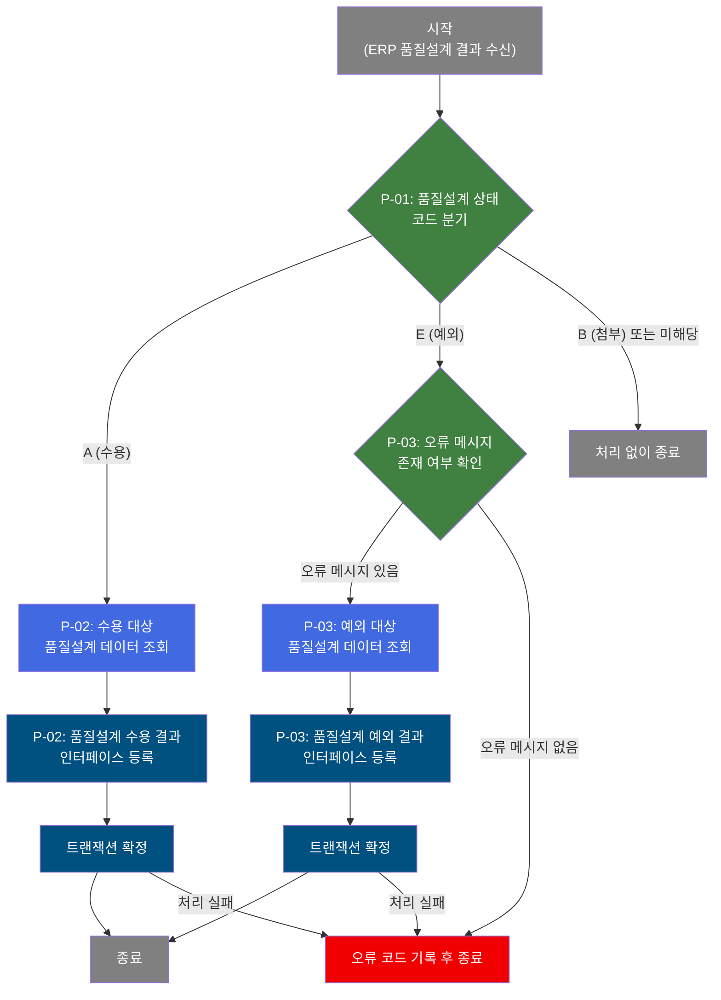

# B10S1010 비즈니스 프로세스 분석서 (BPA)

## 1. 시스템 개요

| 항목 | 내용 |
|------|------|
| 서비스 ID | B10S1010 |
| 업무명 | ERP 품질설계 결과 수신 및 인터페이스 처리 |
| 서비스 타입 | nui |
| 분석 일시 | 2026-03-21 (KST) |
| 원본 분석일 | 2026-03-16 |
| 문서 버전 | 1.0 |

---

## 2. 시스템 목적

본 서비스는 ERP 시스템으로부터 품질설계 결과를 수신하여 MES 인터페이스 송신 테이블에 기록하는 NUI(배치) 프로세스이다. 품질설계 결과의 상태(수용/예외/첨부)에 따라 처리 경로를 분기하여 적절한 인터페이스 레코드를 생성하며, 예외 상태인 경우 오류 메시지를 함께 기록한다.

이 서비스는 ERP와 MES 간 품질설계 데이터 연동의 핵심 수신 채널로서, 주문별·주문라인별 품질설계 상태(수용/예외)를 EAI 인터페이스 테이블에 저장함으로써 이후 다운스트림 시스템이 품질설계 결과를 활용할 수 있도록 한다. 처리 결과는 트랜잭션으로 관리되며, 오류 발생 시 에러 코드와 메시지를 기록하고 처리를 종료한다.

---

## 3. 핵심 워크플로우

> 이 서비스는 단일 업무 프로세스로 구성되어 있어 핵심 워크플로우를 별도로 작성하지 않습니다. **4. 상세 워크플로우**를 참조하세요.

---

## 4. 상세 워크플로우

### 프로세스 흐름도 — ERP 품질설계 결과 수신 처리 (P-01, P-02, P-03)

---

## 5. 비즈니스 로직 상세

P-01: 품질설계 상태 코드 분기 — 수신된 품질설계 결과의 상태에 따라 처리 경로 결정

- **입력**: ERP로부터 수신된 인터페이스 그룹 ID, 주문번호, 주문라인, 품질설계 상태코드
- **처리**:
  1. 품질설계 상태코드(QLT_DSN_STS_CD) 값을 확인한다
  2. 상태코드가 `A`(수용)인 경우 → 수용 처리 경로(P-02)로 진행
  3. 상태코드가 `E`(예외)인 경우 → 오류 메시지 존재 여부 확인(P-03)으로 진행
  4. 상태코드가 `B`(첨부) 또는 해당 없는 값인 경우 → 처리 없이 종료
- **출력**: 처리 경로 결정
- **예외**: 알 수 없는 상태코드 수신 시 처리 없이 정상 종료

P-02: 품질설계 수용 결과 인터페이스 등록 — 수용(A) 상태의 품질설계 결과를 EAI 인터페이스 테이블에 기록

- **입력**: 품질설계 공통 테이블(TB_C10_QLT_DSN_CMN)에서 해당 주문번호·주문라인·상태코드에 대응하는 데이터 조회
- **처리**:
  1. 품질설계 공통 테이블(TB_C10_QLT_DSN_CMN)에서 수용 대상 주문의 품질설계 결과를 조회한다
  2. 조회 결과를 바탕으로 EAI 인터페이스 송신 테이블(TB_C10_B10S1010)에 신규 레코드를 생성한다
  3. 시퀀스(SQ_C10_B10S1010.NEXTVAL)로 일련번호를 자동 부여하고, XCRUD='C'(생성), XSTAT='R'(Ready) 상태로 설정한다
  4. 생성 및 변경 감사 정보(이력)를 함께 기록한다
  5. 트랜잭션을 확정(COMMIT)한다
- **출력**: EAI 인터페이스 송신 테이블(TB_C10_B10S1010)에 수용 결과 레코드 저장
- **예외**: 데이터 조회 실패 또는 삽입 실패 시 오류 코드(CF73) 기록 후 종료

P-03: 품질설계 예외 결과 인터페이스 등록 — 예외(E) 상태의 품질설계 결과를 오류 메시지와 함께 EAI 인터페이스 테이블에 기록

- **입력**: 오류 메시지(QLT_DSN_ERR_MSG) 유무 확인 후, 품질설계 공통 테이블(TB_C10_QLT_DSN_CMN)에서 예외 대상 데이터 조회
- **처리**:
  1. 오류 메시지 필드가 NULL인지 여부를 확인한다
  2. 오류 메시지가 없는 경우(NULL) → 오류 코드(CF73)를 기록하고 처리를 종료한다
  3. 오류 메시지가 있는 경우 → 품질설계 공통 테이블(TB_C10_QLT_DSN_CMN)에서 해당 주문의 예외 대상 품질설계 결과를 조회한다 (오류 메시지 포함)
  4. 조회 결과를 바탕으로 EAI 인터페이스 송신 테이블(TB_C10_B10S1010)에 예외 레코드를 생성한다
  5. 시퀀스(SQ_C10_B10S1010.NEXTVAL)로 일련번호를 자동 부여하고, XCRUD='C'(생성), XSTAT='R'(Ready) 상태로 설정한다
  6. 생성 및 변경 감사 정보(이력)를 함께 기록한다
  7. 트랜잭션을 확정(COMMIT)한다
- **출력**: EAI 인터페이스 송신 테이블(TB_C10_B10S1010)에 예외 결과 레코드(오류 메시지 포함) 저장
- **예외**: 오류 메시지 없는 예외 상태 수신 시 오류 코드(CF73) 기록 후 종료; 데이터 조회/삽입 실패 시 동일하게 오류 코드 기록 후 종료

---

## 6. 커스텀 클래스 워크플로우

해당 없음 — 이 서비스에는 커스텀 클래스가 없음. 모든 처리가 프레임워크 내장 Activity(PosIFGroupID, PosValueRouter, PosSearch, PosInsert 등)와 공통 Activity(DbSetParam, DbSetCommit, DbConditionRouter)로 수행됨.

---

## 7. 주요 유즈케이스

UC-01: ERP 품질설계 수용 결과 수신 및 인터페이스 등록

- **Actor**: ERP 시스템 (자동 배치)
- **목적**: ERP에서 품질설계 결과가 수용(A) 처리된 주문의 결과를 MES EAI 인터페이스 테이블에 기록하여 이후 공정에 반영
- **주요 흐름**:
  1. ERP가 인터페이스 그룹 ID와 함께 품질설계 상태코드 `A`(수용)를 포함한 주문 데이터를 전송한다
  2. 시스템이 품질설계 공통 테이블에서 해당 주문의 품질설계 결과를 조회한다
  3. 조회 결과를 EAI 인터페이스 송신 테이블에 신규 레코드로 등록한다
  4. 트랜잭션을 확정하고 처리를 완료한다
- **예외**: 품질설계 공통 테이블에서 해당 주문 데이터 조회 실패 시 오류 코드를 기록하고 처리 종료

UC-02: ERP 품질설계 예외 결과 수신 및 오류 인터페이스 등록

- **Actor**: ERP 시스템 (자동 배치)
- **목적**: ERP에서 품질설계 결과가 예외(E) 처리된 주문의 오류 메시지를 포함하여 EAI 인터페이스 테이블에 기록
- **주요 흐름**:
  1. ERP가 품질설계 상태코드 `E`(예외)와 오류 메시지를 포함한 주문 데이터를 전송한다
  2. 시스템이 오류 메시지 존재 여부를 확인한다
  3. 오류 메시지가 있는 경우, 품질설계 공통 테이블에서 해당 주문의 예외 품질설계 데이터를 조회한다
  4. 오류 메시지를 포함하여 EAI 인터페이스 송신 테이블에 예외 레코드를 등록한다
  5. 트랜잭션을 확정하고 처리를 완료한다
- **예외**: 오류 메시지가 NULL인 경우 오류 코드(CF73)를 기록하고 처리 종료

UC-03: ERP 품질설계 첨부(B) 또는 미해당 상태 수신

- **Actor**: ERP 시스템 (자동 배치)
- **목적**: 처리 대상이 아닌 상태(B: 첨부 또는 기타)의 품질설계 결과를 오류 없이 무시하고 정상 종료
- **주요 흐름**:
  1. ERP가 품질설계 상태코드 `B`(첨부) 또는 미정의 상태코드를 포함한 데이터를 전송한다
  2. 시스템이 상태코드를 확인하고 처리 대상이 아님을 판단한다
  3. 인터페이스 테이블에 별도 기록 없이 정상 종료한다
- **예외**: 없음 (정상 종료)

---

## 9. 관련 엔티티

### 엔티티 목록

| 엔티티(테이블) | 설명 | 사용 유형 |
|---------------|------|----------|
| TB_C10_QLT_DSN_CMN | 품질설계 결과 공통 테이블 — 주문별 품질설계 상태 및 오류 메시지 보관 | 조회 |
| TB_C10_B10S1010 | EAI 인터페이스 송신 테이블 — 품질설계 결과를 외부 시스템으로 전송하기 위한 큐 테이블 | 저장 |

### 엔티티 간 관계
- TB_C10_QLT_DSN_CMN은 주문번호와 주문라인을 기준으로 품질설계 결과를 관리하며, 본 서비스의 데이터 소스 역할을 한다
- TB_C10_B10S1010은 TB_C10_QLT_DSN_CMN에서 조회한 품질설계 결과를 EAI 인터페이스 형식으로 변환하여 저장하는 목적지 테이블이며, 인터페이스 그룹 ID와 시퀀스 번호로 각 전송 레코드를 식별한다
- 두 테이블은 주문번호(ORD_NO), 주문라인(ORD_LN)을 통해 논리적으로 연결된다

---

## 11. 특이사항 및 주의사항

### 1. 상태코드 기반 분기 처리
품질설계 상태코드(A/E/B)에 따라 처리 경로가 완전히 달라진다. 수용(A)과 예외(E) 상태만 인터페이스 테이블에 기록되며, 첨부(B) 및 기타 상태는 아무런 처리 없이 정상 종료된다. 새로운 상태코드가 추가될 경우 서비스 로직 수정이 필요하다.

### 2. 예외 상태(E) 처리의 이중 검증
예외(E) 상태 수신 시, 단순히 분기하는 것이 아니라 오류 메시지(QLT_DSN_ERR_MSG) 필드의 NULL 여부를 추가로 확인한다. 예외 상태임에도 오류 메시지가 없는 경우에는 오류 코드(CF73)를 기록하고 처리를 중단하므로, ERP 측에서 예외 상태 전송 시 반드시 오류 메시지를 포함해야 한다.

### 3. EAI 인터페이스 테이블의 전송 상태 관리
인터페이스 송신 테이블(TB_C10_B10S1010)에 레코드 삽입 시 XSTAT='R'(Ready) 상태로 설정된다. 이는 해당 레코드가 아직 외부 시스템으로 전송되지 않았음을 나타내며, 별도의 전송 배치 프로세스에 의해 처리될 예정임을 의미한다. XCRUD='C'(Create)는 신규 생성 레코드임을 식별하는 플래그이다.

### 4. 트랜잭션 격리 및 오류 처리 전략
수용(A) 경로와 예외(E) 경로 각각 독립적인 트랜잭션(tx2)으로 처리된다. COMMIT 단계에서 실패 시 ERROR_LOG 액티비티로 전환되어 오류 코드(CF73)와 오류 메시지를 컨텍스트에 기록하고 처리를 종료한다. 이를 통해 부분 성공/실패 상황에서도 오류 정보가 명확히 추적된다.

### 5. 인터페이스 그룹 ID 기반 배치 단위 관리
서비스 시작 시 PosIFGroupID 액티비티를 통해 인터페이스 그룹 ID(IF_GRP_ID)를 할당받는다. 이 그룹 ID는 하나의 배치 실행 단위를 식별하며, 송신 테이블에 삽입되는 모든 레코드에 포함되어 배치 단위 추적 및 재처리를 지원한다.
