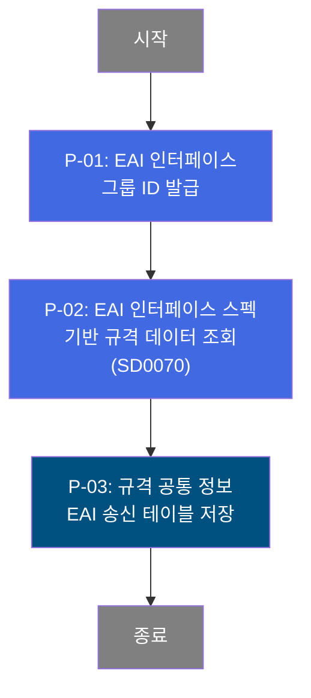

# C101100010 비즈니스 프로세스 분석서 (BPA)

## 1. 시스템 개요

| 항목 | 내용 |
|------|------|
| 서비스 ID | C101100010 |
| 업무명 | 규격 공통 정보 EAI 송신 |
| 서비스 타입 | nui |
| 분석 일시 | 2026-03-21 (KST) |
| 원본 분석일 | 2026-03-16 |
| 문서 버전 | 1.0 |

---

## 2. 시스템 목적

이 서비스는 MES 내부에서 관리하는 규격 공통 정보를 외부 시스템으로 전송하기 위한 EAI(Enterprise Application Integration) 인터페이스 배치 프로세스입니다. 외부 시스템과의 데이터 연동을 위한 인터페이스 그룹 ID를 발급받고, 해당 그룹에 속하는 규격 마스터 데이터를 EAI 송신 테이블에 적재합니다.

주요 처리 대상은 규격 약자, 규격 연도, 규격 명칭, 주문 등급, 승인율 규격, MQL 코드 등 규격의 식별 및 분류를 위한 핵심 속성이며, 이를 표준화된 인터페이스 스펙(SD0070)에 따라 외부 시스템이 수신할 수 있는 형태로 변환하여 저장합니다.

이 프로세스는 사용자 조작 없이 시스템 이벤트나 스케줄에 의해 자동으로 실행되는 NUI(Non-UI) 배치 서비스로, 생산 현장의 규격 정보가 외부 시스템에 정합성 있게 동기화되도록 지원합니다.

---

## 3. 핵심 워크플로우

> 이 서비스는 단일 업무 프로세스로 구성되어 있어 핵심 워크플로우를 별도로 작성하지 않습니다. **4. 상세 워크플로우**를 참조하세요.

---

## 4. 상세 워크플로우

### 프로세스 흐름도 — EAI 규격 정보 송신 (P-01, P-02)

---

## 5. 비즈니스 로직 상세

P-01: EAI 인터페이스 그룹 ID 발급 — EAI 연동을 위한 고유 그룹 식별자 생성

- **입력**: 서비스 실행 요청 (외부 트리거 또는 스케줄)
- **처리**:
  1. EAI 인터페이스 송신 단위를 식별하기 위한 그룹 ID(IF_GRP_ID)를 프레임워크로부터 발급받음
  2. 이후 처리 단계에서 동일 그룹 ID로 연계 데이터를 묶어 관리함
- **출력**: 인터페이스 그룹 ID (이후 단계에서 공유)
- **예외**: 그룹 ID 발급 실패 시 후속 처리 중단

P-02: EAI 인터페이스 스펙 기반 규격 데이터 조회 — SD0070 스펙에 따른 송신 대상 데이터 취득

- **입력**: EAI 인터페이스 스펙 코드(SD0070), 발급된 그룹 ID
- **처리**:
  1. EAI 인터페이스 스펙 SD0070에 정의된 기준으로 송신 대상 규격 공통 정보를 조회
  2. 조회된 데이터는 규격 약자, 규격 연도, 규격 명칭, 규격 전체 명칭, 주문 등급, 승인율 규격, MQL 코드 등의 속성을 포함
  3. 조회 결과를 다음 저장 단계로 전달
- **출력**: 송신 대상 규격 공통 정보 목록
- **예외**: 소스 파일 미존재로 상세 오류 처리 방식 확인 불가. 조회 결과 없을 경우 후속 저장 단계는 실행되지 않을 수 있음

P-03: 규격 공통 정보 EAI 송신 테이블 저장 — 조회된 규격 데이터를 인터페이스 테이블에 적재

- **입력**: P-02에서 조회된 규격 공통 정보, 발급된 그룹 ID
- **처리**:
  1. 각 규격 레코드를 EAI 송신 인터페이스 테이블(TB_C10_C101100010)에 INSERT
  2. 순번(SEQ_NO)은 1로 고정하여 저장
  3. 처리 구분(XCRUD)은 신규 생성을 의미하는 'C'로 설정
  4. 상태(XSTAT)는 전송 대기를 의미하는 'R'로 설정
  5. 감사 로그(Audit) 정보(생성 객체 유형, 객체 ID, 프로그램 ID, 타임스탬프)를 함께 기록
- **출력**: TB_C10_C101100010 테이블에 규격 공통 정보 INSERT
- **예외**: INSERT 실패 시 오류 반환 후 처리 종료

---

## 6. 커스텀 클래스 워크플로우

### DbSearchEaiData (소스 미존재)

**역할**: EAI 인터페이스 스펙(SD0070) 기반으로 송신 대상 규격 공통 정보를 MES DB에서 조회하여 다음 저장 단계로 전달하는 NUI 액티비티 클래스.

> 소스 파일이 저장소에 존재하지 않아 상세 내부 로직 및 Mermaid 워크플로우 작성이 불가합니다. 서비스 XML의 프로퍼티 설정(`ifSpecKind=SD0070`, `dao=mesdao`)을 통해 EAI 스펙 기반 조회를 수행하는 것으로 파악됩니다.

---

## 7. 주요 유즈케이스

UC-01: 규격 공통 정보 EAI 자동 송신

- **Actor**: MES 배치 스케줄러 / 시스템 트리거
- **목적**: MES에서 관리하는 규격 마스터 정보를 외부 시스템과 자동 동기화
- **주요 흐름**:
  1. 배치 스케줄러 또는 외부 이벤트에 의해 서비스 실행
  2. EAI 인터페이스 그룹 ID 발급
  3. SD0070 스펙에 따라 송신 대상 규격 데이터 조회
  4. 규격 공통 정보를 EAI 송신 인터페이스 테이블에 저장(상태: 전송 대기)
  5. 외부 EAI 시스템이 인터페이스 테이블에서 데이터를 수신하여 처리
- **예외**: 조회 대상 데이터 없음 또는 INSERT 오류 발생 시 처리 중단

UC-02: 신규 규격 정보 외부 시스템 반영

- **Actor**: MES 배치 스케줄러
- **목적**: MES에서 신규 등록되거나 변경된 규격 정보를 외부 연계 시스템에 반영
- **주요 흐름**:
  1. 규격 정보 변경 이벤트 발생 또는 정기 배치 실행
  2. 인터페이스 그룹 ID 발급 후 해당 그룹으로 송신 배치 수행
  3. 규격 약자, 연도, 명칭, 등급 등 핵심 속성을 포함한 레코드를 인터페이스 테이블에 INSERT
  4. XCRUD='C', XSTAT='R' 설정으로 신규 생성 및 전송 대기 상태 표시
- **예외**: 동일 그룹 ID로 중복 실행 시 데이터 정합성 검토 필요

---

## 9. 관련 엔티티

### 엔티티 목록

| 엔티티(테이블) | 설명 | 사용 유형 |
|---------------|------|----------|
| TB_C10_C101100010 | 규격 공통 정보 EAI 송신 인터페이스 테이블 | 저장(INSERT) |

### 엔티티 간 관계
- TB_C10_C101100010은 EAI 연동을 위한 단방향 송신 전용 인터페이스 테이블로, MES 내부 규격 마스터 데이터를 외부 시스템 전송 형식으로 변환하여 저장하는 역할을 담당함
- 인터페이스 그룹 ID(IF_GRP_ID)를 기준으로 동일 배치 실행 단위의 레코드들이 묶임

---

## 11. 특이사항 및 주의사항

### 1. EAI 인터페이스 스펙 SD0070 의존성
이 서비스는 EAI 인터페이스 스펙 코드 SD0070에 강하게 의존합니다. DbSearchEaiData 액티비티의 `ifSpecKind=SD0070` 설정이 조회 범위와 대상 데이터를 결정하므로, SD0070 스펙 변경 시 이 서비스의 동작에 직접적인 영향이 있습니다. 스펙 변경 시 반드시 영향도 분석이 필요합니다.

### 2. 커스텀 액티비티 소스 미존재
핵심 비즈니스 로직을 담당하는 DbSearchEaiData 클래스의 Java 소스 파일이 저장소에 존재하지 않습니다. 해당 클래스는 서비스 XML에서만 참조되며, 실제 조회 로직의 내부 구현과 오류 처리 방식을 코드 레벨에서 확인할 수 없습니다. 소스 관리 체계 점검이 필요합니다.

### 3. 삽입 시 고정값 설정 규칙
EAI 송신 테이블 INSERT 시 일부 필드가 고정값으로 설정됩니다. SEQ_NO=1(순번 고정), XCRUD='C'(신규 생성), XSTAT='R'(전송 대기) 값은 EAI 연동 프로토콜에 따라 정의된 규칙이므로, 외부 시스템의 수신 처리 로직과 반드시 정합성을 유지해야 합니다. 임의로 변경할 경우 EAI 연동 장애가 발생할 수 있습니다.

### 4. 감사 로그(Audit) 필수 기록
이 서비스는 `isAudit=true` 설정으로 인해 모든 INSERT 작업 시 감사 로그(생성 객체 유형, 객체 ID, 프로그램 ID, 타임스탬프)가 의무적으로 기록됩니다. 감사 관련 파라미터(ObjectType, ObjectId, ProgramId, Timestamp)가 누락될 경우 INSERT가 실패할 수 있으므로 호출 시 반드시 포함해야 합니다.
