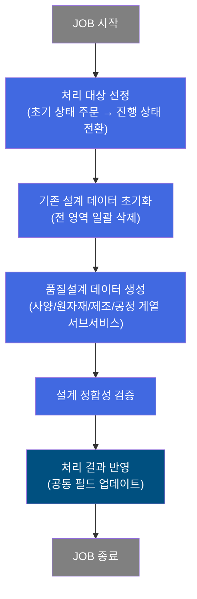
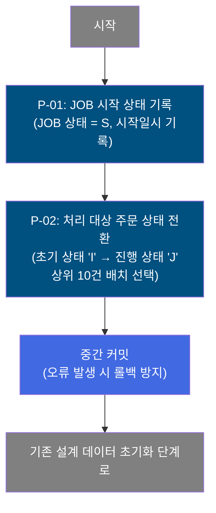
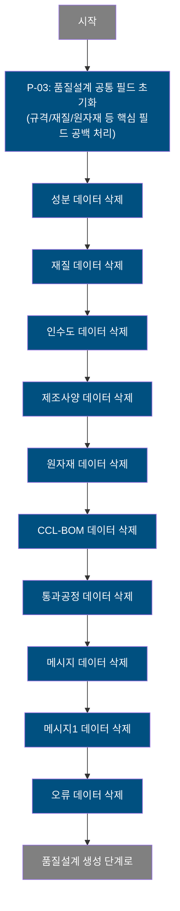
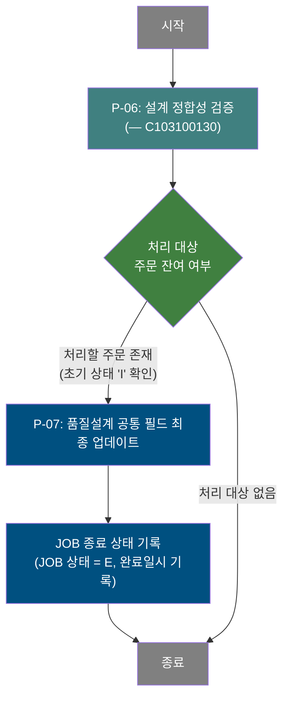

# C102100000 비즈니스 프로세스 분석서 (BPA)

## 1. 시스템 개요

| 항목 | 내용 |
|------|------|
| 서비스 ID | C102100000 |
| 업무명 | 품질설계 자동 생성 (배치) |
| 서비스 타입 | nui |
| 분석 일시 | 2026-03-21 (KST) |
| 원본 분석일 | 2026-03-16 |
| 문서 버전 | 1.0 |

---

## 2. 시스템 목적

품질설계 자동 생성 서비스는 수주 주문에 대해 품질설계 데이터를 자동으로 생성하는 배치 프로세스이다. 주문 접수 후 초기 상태('I')에 있는 주문들을 배치 작업 대상으로 선정하고, 기존에 잘못 생성된 설계 데이터를 모두 초기화한 다음, 규격·고객사양·사내사양·보증사양·제조사양·원자재·통과공정 등 품질설계에 필요한 모든 하위 데이터를 일괄 재생성한다.

이 서비스는 MES 운영 담당자 및 시스템 스케줄러에 의해 주기적으로 실행되며, 다수의 서브서비스(C102xxx, C103xxx 계열)를 순차 호출하는 오케스트레이터 역할을 수행한다. 주문 단위로 처리되는 것이 아니라, JOB 단위로 최대 10건씩 묶어 처리하는 벌크 방식으로 설계되어 있어 시스템 부하를 분산하고 처리 현황을 추적할 수 있다.

품질설계 완료 후에는 설계 정합성 검증까지 수행하여 설계 결과의 신뢰성을 보장한다. 이 서비스가 올바르게 실행되어야 후속 제조 지시 및 품질 관리 업무가 원활하게 진행된다.

---

## 3. 핵심 워크플로우

---

## 4. 상세 워크플로우

### 프로세스 흐름도 — JOB 관리 및 처리 대상 선정 (P-01, P-02)

### 프로세스 흐름도 — 기존 설계 데이터 초기화 (P-03)

### 프로세스 흐름도 — 품질설계 데이터 생성 (P-04, P-05)

```mermaid
flowchart TD
    START["시작"]:::start
    START --> P04A["P-04: 설계 Key 생성<br/>(— C102100020)"]:::proc_call
    P04A --> P04B["규격사양 생성<br/>(C/M/D 유형)<br/>(— C102100070)"]:::proc_call
    P04B --> P04C["고객사양 생성<br/>(C/M/D 유형)<br/>(— C102100030)"]:::proc_call
    P04C --> P04D["사내사양 생성<br/>(C/M 유형)<br/>(— C102100110)"]:::proc_call
    P04D --> P04E["보증사양(C) 생성<br/>(— C102100130)"]:::proc_call
    P04E --> P04F["보증사양(M) 생성<br/>(— C102100140)"]:::proc_call
    P04F --> P04G["보증사양(D) 생성<br/>(— C102100150)"]:::proc_call
    P04G --> P05A["P-05: 원자재 정보 등록<br/>(— C103100010)"]:::proc_call
    P05A --> P05B["제조사양 생성<br/>(— C103100020)"]:::proc_call
    P05B --> P05C["도금량(MQL/MNF) 생성<br/>(— C103100040)"]:::proc_call
    P05C --> P05D["CGL 수지/TM 조도 생성<br/>(— C103100050)"]:::proc_call
    P05D --> P05E["CCL 제조사양 생성<br/>(— C102100160)"]:::proc_call
    P05E --> P05F["통과공정 생성<br/>(— C103100030)"]:::proc_call
    P05F --> P05G["두께/소둔 생성<br/>(— C103100070)"]:::proc_call
    P05G --> P05H["폭 생성<br/>(— C103100080)"]:::proc_call
    P05H --> P05I["공정별 Size 생성<br/>(— C103100090)"]:::proc_call
    P05I --> P05J["원자재 Size 생성<br/>(— C103100100)"]:::proc_call
    P05J --> NEXT["설계 정합성 검증 단계로"]:::start

    classDef start fill:#808080,color:#fff
    classDef proc_call fill:#408080,color:#fff
```

### 프로세스 흐름도 — 설계 정합성 검증 및 완료 처리 (P-06, P-07)

---

## 5. 비즈니스 로직 상세

P-01: JOB 시작 상태 기록 — 배치 작업 실행 추적을 위한 JOB 상태 초기화

- **입력**: 시스템 현재 시각, 실행 오브젝트 정보
- **처리**:
  1. 품질설계 JOB 관리 테이블(TB_C10_QLT_DSN_JOB)의 상태를 'S'(Start)로 변경
  2. 시작 일시를 현재 시스템 시각으로 기록
  3. 완료 일시를 초기화(NULL)
  4. 감사 정보(변경자, 변경 프로그램, 변경 일시) 기록
- **출력**: TB_C10_QLT_DSN_JOB에 JOB 시작 상태 반영
- **예외**: 업데이트 실패 시 서비스 중단

P-02: 처리 대상 주문 상태 전환 — 초기 상태 주문을 진행 상태로 변경하여 배치 처리 대상 확보

- **입력**: 품질설계 공통 마스터(TB_C10_QLT_DSN_CMN)에서 상태 'I'(초기)인 주문 목록
- **처리**:
  1. 상태 'I'인 주문 중 처리 순서 기준 상위 10건을 선택
  2. 선택된 주문들의 상태를 'J'(진행중)으로 변경
  3. 변경자, 변경 프로그램, 변경 일시 등 감사 정보 기록
  4. 중간 커밋(COMMIT) 수행으로 처리 대상 확보 확정
- **출력**: TB_C10_QLT_DSN_CMN에 처리 대상 주문 상태 'J'로 전환
- **예외**: 상태 전환 실패 시 롤백 처리

P-03: 기존 설계 데이터 초기화 — 'J' 상태 주문의 기존 품질설계 데이터 전 영역 삭제

- **입력**: 상태 'J'인 주문의 주문번호/주문행번(TB_C10_QLT_DSN_CMN 참조)
- **처리**:
  1. 품질설계 공통 마스터(TB_C10_QLT_DSN_CMN)의 규격명, 재질코드, 원자재코드, 원자재등급, 통과공정, 인수도 규격 등 핵심 필드를 공백으로 초기화
  2. 하위 테이블 순차 삭제:
     - 화학 성분(TB_C10_QLT_DSN_CHM)
     - 재질(TB_C10_QLT_DSN_MQL)
     - 인수도(TB_C10_QLT_DSN_DLV)
     - 제조사양(TB_C10_QLT_DSN_MNF)
     - 원자재(TB_C10_QLT_DSN_RMT)
     - CCL-BOM(TB_C10_QLT_DSN_CCL_BOM)
     - 통과공정(TB_C10_QLT_DSN_PROC 계열)
     - 메시지/메시지1(TB_C10_QLT_DSN_MSG, TB_C10_QLT_DSN_MSG1)
     - 오류(TB_C10_QLT_DSN_ERR)
  3. 각 삭제는 공통 마스터의 'J' 상태 주문과 EXISTS 서브쿼리로 연계 처리
- **출력**: 'J' 상태 주문의 모든 하위 품질설계 데이터 삭제
- **예외**: 삭제 실패 시 트랜잭션 롤백

P-04: 사양 데이터 생성 — 규격/고객/사내/보증 사양 계열 서브서비스 순차 실행

- **입력**: 'J' 상태의 주문 정보, 마스터 사양 기준 데이터
- **처리**:
  1. 설계 Key 생성(C102100020): 설계 식별 키 부여
  2. 규격사양 생성(C102100070): C형/M형/D형 규격 사양 데이터 생성
  3. 고객사양 생성(C102100030): C형/M형/D형 고객 요구 사양 생성
  4. 사내사양 생성(C102100110): C형/M형 사내 기준 사양 생성
  5. 보증사양 생성(C102100130, C102100140, C102100150): C형/M형/D형 보증 사양 각각 생성
- **출력**: 각 서브서비스의 설계 사양 테이블에 데이터 등록
- **예외**: 서브서비스 실패 시 전체 트랜잭션 롤백

P-05: 제조 및 공정 데이터 생성 — 원자재/제조사양/공정 계열 서브서비스 순차 실행

- **입력**: 'J' 상태의 주문 정보, 제조 마스터 기준 데이터
- **처리**:
  1. 원자재 정보 등록(C103100010): 원자재 기본 데이터 삽입
  2. 제조사양 생성(C103100020): 제조 공정 사양 생성
  3. 도금량 생성(C103100040): MQL/MNF 도금량 기준 생성
  4. CGL 수지/TM 조도 생성(C103100050): 표면처리 관련 사양 생성
  5. CCL 제조사양 생성(C102100160): CCL 공정 특수 사양 생성
  6. 통과공정 생성(C103100030): 공정 흐름 경로 데이터 생성
  7. 두께/소둔 생성(C103100070): 두께 및 소둔 처리 조건 생성
  8. 폭 생성(C103100080): 폭 관련 사양 생성
  9. 공정별 Size 생성(C103100090): 각 공정 단계별 치수 기준 생성
  10. 원자재 Size 생성(C103100100): 원자재 치수 기준 생성
- **출력**: 각 서브서비스의 제조/공정 사양 테이블에 데이터 등록
- **예외**: 서브서비스 실패 시 전체 트랜잭션 롤백

P-06: 설계 정합성 검증 — 생성된 품질설계 데이터의 일관성 및 완전성 검증

- **입력**: 생성 완료된 'J' 상태 주문의 품질설계 전 영역 데이터
- **처리**:
  1. C103100130 서브서비스를 호출하여 설계 정합성 검증 수행
  2. 설계 데이터 간 참조 무결성, 필수 항목 존재 여부, 수치 범위 적합성 등 검증
  3. 검증 결과에 따라 다음 단계로 전이
- **출력**: 검증 통과 시 완료 처리 진행, 오류 시 오류 데이터(TB_C10_QLT_DSN_ERR 계열)에 기록
- **예외**: 정합성 검증 실패 시 오류 내용 기록 후 계속 진행(서비스 중단 없음)

P-07: 품질설계 완료 처리 — 처리 결과 반영 및 JOB 종료 기록

- **입력**: 처리 완료된 주문 정보, 잔여 처리 대상 주문 존재 여부
- **처리**:
  1. 처리 완료된 주문의 품질설계 공통(TB_C10_QLT_DSN_CMN)에 최종 업데이트 수행
  2. JOB 관리 테이블(TB_C10_QLT_DSN_JOB)의 상태를 'E'(End)로 변경
  3. 완료 일시를 현재 시스템 시각으로 기록
  4. 감사 정보(변경자, 변경 프로그램, 변경 일시) 갱신
- **출력**: TB_C10_QLT_DSN_CMN 최종 업데이트, TB_C10_QLT_DSN_JOB에 JOB 완료 상태 반영
- **예외**: 업데이트 실패 시 서비스 오류 기록

---

## 6. 커스텀 클래스 워크플로우

### DbCheckCnt (약 105줄)

**역할**: 서비스 XML의 Property로 지정된 SQL을 실행하여 조회 결과 건수에 따라 true/false 분기를 반환하는 범용 데이터 존재 확인 Activity. 이 서비스에서는 초기 상태('I')인 처리 대기 주문이 존재하는지 확인하는 용도로 사용된다.

200줄 미만 클래스이므로 Mermaid 워크플로우는 작성하지 않는다. 처리 흐름은 다음과 같다: SQL Key와 파라미터를 Property에서 동적으로 구성 → DAO 조회 실행 → 조회 결과 건수 > 0이면 TRUE 반환, 0이면 FALSE 반환, 예외 발생 시 FAILURE 반환.

---

## 7. 주요 유즈케이스

UC-01: 주기적 품질설계 자동 생성

- **Actor**: 시스템 스케줄러 (배치 실행 주체)
- **목적**: 신규 수주 주문에 대해 품질설계 데이터를 자동으로 일괄 생성하여 제조 준비 완료 상태로 전환
- **주요 흐름**:
  1. 스케줄러가 서비스 실행을 트리거
  2. 초기 상태('I') 주문이 존재하는지 확인
  3. 최대 10건의 주문을 선택하여 진행 상태('J')로 전환하고 배치 처리 시작
  4. 기존 설계 데이터 전 영역 초기화 후 사양/원자재/제조/공정 데이터를 순차 생성
  5. 설계 정합성 검증 후 JOB 완료 기록
- **예외**: 잔여 처리 대상이 없으면 JOB 종료 처리만 수행

UC-02: 품질설계 재생성 (오류 복구)

- **Actor**: MES 운영 담당자 (수동 재실행)
- **목적**: 이전 처리에서 오류가 발생한 주문에 대해 품질설계를 재작성
- **주요 흐름**:
  1. 오류가 발생한 주문의 상태를 수동으로 초기 상태('I')로 복원
  2. 서비스 재실행 시 해당 주문이 처리 대상으로 포함됨
  3. 기존 설계 데이터(오류 데이터 포함) 전 영역 삭제
  4. 설계 데이터 전체 재생성 및 정합성 검증 수행
- **예외**: 설계 정합성 검증 실패 시 오류 정보를 별도 테이블에 기록하여 담당자가 확인 가능

UC-03: 설계 정합성 이상 탐지

- **Actor**: 품질 담당자 (모니터링)
- **목적**: 자동 생성된 품질설계의 규격·사양 간 정합성 위반 여부를 검증하고 이상 주문 식별
- **주요 흐름**:
  1. 서비스가 설계 데이터 생성 완료 후 정합성 검증 서브서비스(C103100130) 자동 호출
  2. 검증 실패 시 오류 내용이 오류 관리 테이블에 기록
  3. 품질 담당자가 오류 내용을 확인하여 수동 교정 또는 재처리 결정
- **예외**: 정합성 오류가 발생해도 배치는 중단되지 않고 다음 주문 처리를 계속 진행

---

## 8. 화면 구성 개요

이 서비스는 NUI(배치) 타입으로, 별도 화면 구성이 없습니다.

---

## 9. 관련 엔티티

### 엔티티 목록

| 엔티티(테이블) | 설명 | 사용 유형 |
|---------------|------|----------|
| TB_C10_QLT_DSN_JOB | 품질설계 배치 JOB 실행 이력 | 갱신 |
| TB_C10_QLT_DSN_CMN | 품질설계 공통 마스터 (주문별 설계 상태 관리) | 조회/갱신 |
| TB_C10_QLT_DSN_CHM | 품질설계 화학 성분 데이터 | 삭제 |
| TB_C10_QLT_DSN_MQL | 품질설계 재질 데이터 | 삭제 |
| TB_C10_QLT_DSN_DLV | 품질설계 인수도 데이터 | 삭제 |
| TB_C10_QLT_DSN_MNF | 품질설계 제조사양 데이터 | 삭제 |
| TB_C10_QLT_DSN_RMT | 품질설계 원자재 데이터 | 삭제 |
| TB_C10_QLT_DSN_CCL_BOM | 품질설계 CCL-BOM 성분 데이터 | 삭제 |
| TB_C10_QLT_DSN_MSG | 품질설계 메시지 데이터 | 삭제 |
| TB_C10_QLT_DSN_MSG1 | 품질설계 메시지1 데이터 | 삭제 |
| TB_C10_QLT_DSN_ERR | 품질설계 오류 기록 | 삭제 |

### 엔티티 간 관계
- TB_C10_QLT_DSN_CMN은 주문(ORD_NO, ORD_LN)을 기준으로 모든 하위 설계 테이블의 참조 마스터 역할을 한다.
- TB_C10_QLT_DSN_CHM, MQL, DLV, MNF, RMT, CCL_BOM, MSG, MSG1, ERR은 모두 TB_C10_QLT_DSN_CMN의 주문번호/주문행번을 외래키로 참조하며, 초기화 시 EXISTS 서브쿼리로 연계 삭제된다.
- TB_C10_QLT_DSN_JOB은 배치 실행 단위를 관리하며 TB_C10_QLT_DSN_CMN의 처리 상태와 독립적으로 운영된다.
- 각 서브서비스(C102xxx, C103xxx 계열)가 생성하는 설계 데이터는 모두 TB_C10_QLT_DSN_CMN을 기준으로 연결된다.

---

## 10. 서브서비스

| 서비스 ID | 설명 | 호출 시점 | 트랜잭션 | BPA 문서 |
|-----------|------|---------|---------|---------|
| C102100020 | 설계 Key 생성 | 기존 설계 데이터 초기화 완료 후 최초 설계 생성 진입 시 | 공유 | 미작성 |
| C102100070 | 규격사양(C/M/D) 생성 | 설계 Key 생성 직후 | 공유 | 미작성 |
| C102100030 | 고객사양(C/M/D) 생성 | 규격사양 생성 완료 후 | 공유 | 미작성 |
| C102100110 | 사내사양(C/M) 생성 | 고객사양 생성 완료 후 | 공유 | 미작성 |
| C102100130 | 보증사양(C) 생성 | 사내사양 생성 완료 후 | 공유 | 미작성 |
| C102100140 | 보증사양(M) 생성 | 보증사양(C) 생성 완료 후 | 공유 | 미작성 |
| C102100150 | 보증사양(D) 생성 | 보증사양(M) 생성 완료 후 | 공유 | 미작성 |
| C102100160 | CCL 제조사양 생성 | CGL 수지/TM 조도 생성 완료 후 | 공유 | 미작성 |
| C103100010 | 원자재 정보 등록 | 보증사양(D) 생성 완료 후 | 공유 | 미작성 |
| C103100020 | 제조사양 생성 | 원자재 정보 등록 완료 후 | 공유 | 미작성 |
| C103100030 | 통과공정 생성 | CCL 제조사양 생성 완료 후 | 공유 | 미작성 |
| C103100040 | 도금량(MQL/MNF) 생성 | 제조사양 생성 완료 후 | 공유 | 미작성 |
| C103100050 | CGL 수지/TM 조도 생성 | 도금량 생성 완료 후 | 공유 | 미작성 |
| C103100070 | 두께/소둔 생성 | 통과공정 생성 완료 후 | 공유 | 미작성 |
| C103100080 | 폭 생성 | 두께/소둔 생성 완료 후 | 공유 | 미작성 |
| C103100090 | 공정별 Size 생성 | 폭 생성 완료 후 | 공유 | 미작성 |
| C103100100 | 원자재 Size 생성 | 공정별 Size 생성 완료 후 | 공유 | 미작성 |
| C103100130 | 설계 정합성 검증 | 원자재 Size 생성 완료 후 (최종 검증) | 공유 | 미작성 |

---

## 11. 특이사항 및 주의사항

### 1. 벌크 처리 방식 (최대 10건 단위)
배치 1회 실행 시 초기 상태 주문 중 상위 10건만 선택하여 처리한다. 이는 단일 배치 실행의 처리 시간과 트랜잭션 범위를 제한하여 시스템 부하를 분산하기 위한 설계이다. 처리 후에도 잔여 주문이 있을 경우 다음 스케줄 실행 시 처리된다.

### 2. 초기화 후 재생성 패턴 (Delete-and-Recreate)
설계 데이터를 부분 수정하지 않고, 기존 데이터를 전 영역(11개 테이블) 일괄 삭제 후 전체 재생성하는 방식을 사용한다. 이 패턴은 설계 데이터의 일관성을 보장하지만, 처리 대상이 많을 경우 I/O 부하가 증가할 수 있다. 삭제는 모두 TB_C10_QLT_DSN_CMN의 'J' 상태 조건과 EXISTS 서브쿼리로 연계 처리되어 원자성이 보장된다.

### 3. 다단계 서브서비스 오케스트레이션 (18개 서브서비스)
단일 서비스가 18개 서브서비스를 동일 트랜잭션 내에서 순차 호출한다. 서브서비스 중 하나라도 실패하면 전체 트랜잭션이 롤백되어 데이터 일관성이 유지된다. 단, 설계 정합성 검증(C103100130) 이후 발생하는 오류는 오류 테이블에 기록되고 처리가 계속되는 구조로 설계되어 있어, 검증 단계 이후의 오류 처리 정책에 주의가 필요하다.

### 4. JOB 상태 관리 (S/E 전이)
서비스 시작 시 JOB 상태를 'S'(Start)로, 완료 시 'E'(End)로 전환하며 시작/완료 일시를 기록한다. JOB 상태를 통해 배치 실행 현황 모니터링 및 비정상 종료(S 상태가 장시간 지속) 감지가 가능하다. 비정상 종료 시 JOB 상태가 'S'로 유지되므로 운영 담당자의 수동 개입이 필요할 수 있다.

### 5. 주문 상태 전이 ('I' → 'J') 와 중간 커밋
처리 대상 주문을 'J' 상태로 변경한 직후 중간 커밋(DbSetCommit)을 수행한다. 이는 후속 설계 생성 과정에서 오류 발생 시 동일 주문이 다음 배치 실행에서 중복 처리되지 않도록 방지하기 위함이다. 이 설계 특성으로 인해 부분 처리 후 오류가 발생하더라도 해당 주문은 'J' 상태를 유지하며, 복구를 위해서는 수동으로 상태를 'I'로 되돌려야 한다.
