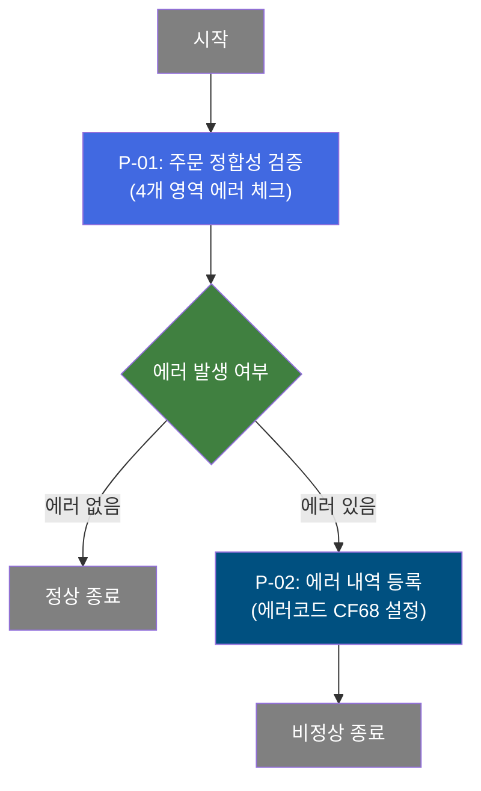
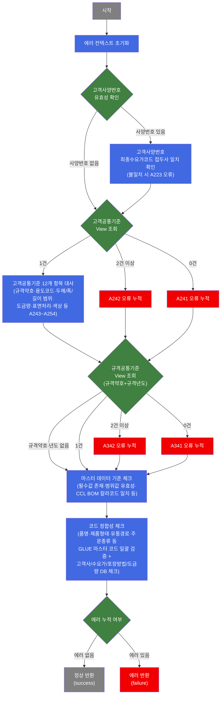
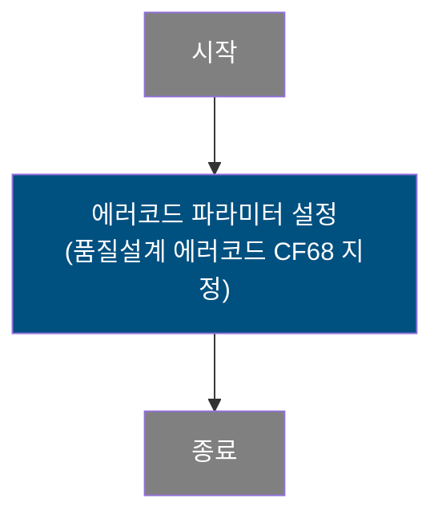
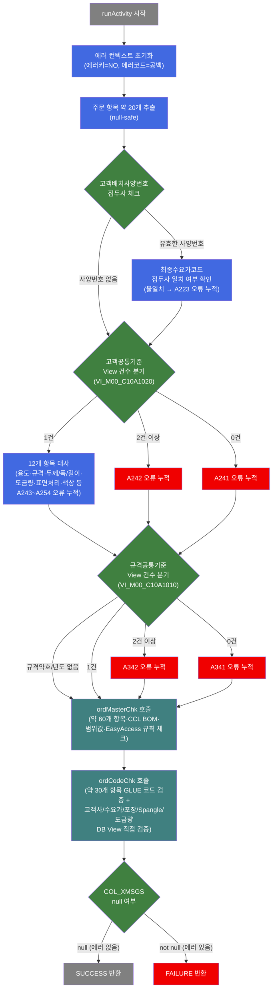

# C102100010 비즈니스 프로세스 분석서 (BPA)

## 1. 시스템 개요

| 항목 | 내용 |
|------|------|
| 서비스 ID | C102100010 |
| 업무명 | 생산가부요청 주문 정합성 에러 체크 |
| 서비스 타입 | nui |
| 분석 일시 | 2026-03-21 (KST) |
| 원본 분석일 | 2026-03-16 |
| 문서 버전 | 1.0 |

---

## 2. 시스템 목적

이 서비스는 OMS(주문관리시스템)에서 C10 MES로 수신된 생산가부요청 주문 데이터가 품질설계 프로세스에 진입하기 전에, 데이터 정합성을 사전에 검증하는 역할을 수행한다. 주문 항목이 고객공통사양과 불일치하거나, 마스터 코드에 미등록된 값을 갖거나, 허용 범위를 벗어나는 경우를 탐지하여 후속 공정으로의 오류 유입을 차단한다.

검증은 고객공통기준 대사, 규격공통기준 확인, 마스터 데이터 기준 체크, 코드 정합성 체크 등 4개 영역에 걸쳐 수행되며, 에러 발생 시 즉시 중단하지 않고 모든 항목을 끝까지 검증한 뒤 에러를 누적하여 한 번에 반환하는 방식을 취한다. 이를 통해 담당자는 단일 요청으로 발생한 모든 오류를 한 번에 파악할 수 있다.

최종적으로 에러가 없으면 다음 프로세스(품질설계 등)로 진행되고, 에러가 있으면 에러 로그 등록 후 처리를 중단한다. 본 서비스는 NUI(배치) 서비스로, 화면 없이 프로세스 체인 내에서 호출된다.

---

## 3. 핵심 워크플로우

---

## 4. 상세 워크플로우

### 프로세스 흐름도 — 생산가부요청 주문 정합성 검증 (P-01)

### 프로세스 흐름도 — 에러 내역 등록 (P-02)

> P-01에서 에러가 반환된 경우에만 실행됨.

---

## 5. 비즈니스 로직 상세

P-01: 주문 정합성 검증 — 생산가부요청 주문 항목의 4개 영역 정합성 에러 체크

- **입력**: 생산가부요청 컨텍스트(주문 관련 항목 약 20~60개 — 최종수요가코드, 고객배치사양번호, 규격약호, 규격년도, 제품형태, 주문두께/폭/길이 등)
- **처리**:
  1. 에러 누적 컨텍스트 초기화
  2. **고객사양번호 체크**: 고객배치사양번호가 존재하는 경우 최종수요가코드로 시작하는지 확인 (불일치 → A223 오류)
  3. **고객공통기준 대사**: 고객공통기준 View(`VI_M00_C10A1020`) 조회 후 조회 건수에 따라 분기
     - 1건: 규격약호, 규격년도, 최종수요가, 품명, 주문두께/폭/길이 범위, 두께구분, 도금량, 표면처리, 색상 등 12개 항목 대사 (A243~A254 오류)
     - 2건 이상: A242 오류, 0건: A241 오류
  4. **규격공통기준 확인**: 규격약호와 규격년도가 모두 유효할 때 규격공통기준 View(`VI_M00_C10A1010`) 조회 (2건 이상: A342, 0건: A341 오류)
  5. **마스터 데이터 기준 체크**: EasyAccess 규칙(`C10A*`, `C10B*`, `VI_M00_*`) 기반으로 약 60개 항목의 필수값·범위값·CCL BOM 칼라코드 일치 여부 체크
  6. **코드 정합성 체크**: 품명, 제품형태, 유통경로, 주문종류, 주문용도코드 등 약 30개 항목을 GLUE 마스터 코드로 일괄 검증, 고객사코드·수요가코드·최종수요가코드는 DB View 직접 조회 검증, 제품형태별 포장방법·품명별 Spangle·품명별 도금량도 조합 검증
  7. 에러 메시지 누적 여부 확인 후 결과 반환
- **출력**: 에러 메시지 목록(쉼표 구분 누적), 에러코드 목록(쉼표 구분 누적)을 컨텍스트에 설정
- **예외**:
  - 코드 검증 중 마스터데이터 예외 발생 → 해당 항목 에러로 처리 후 검증 계속 진행
  - 에러 발생 시 즉시 중단 않고 전체 검증 완료 후 누적 에러 반환 (배치 검증 전략)

**조합폭 계산 규칙**:
- Slit 그룹 수 > 0이고 실행폭 = 조합폭1인 경우: 조합폭 = Slit 그룹 수 × 조합폭1
- 그 외: 실행폭 직접 사용 (또는 조합폭 단순 합산 방식 병행 지원)

P-02: 에러 내역 등록 — 품질설계 에러코드 CF68 파라미터 설정

- **입력**: P-01에서 반환된 에러 결과(failure 전이 시 실행)
- **처리**:
  1. 에러 파라미터 키(`P_ERR_KEY`)에 `Y` 값 설정
  2. 품질설계 에러코드(`QLT_DSN_ERR_CD`)에 `CF68` 값 설정
- **출력**: 에러 컨텍스트 파라미터가 설정된 상태로 서비스 체인 종료
- **예외**: 없음 (단순 파라미터 설정)

---

## 6. 커스텀 클래스 워크플로우

### DbOrderErrorCheck (약 4,087줄)

**역할**: 생산가부요청 주문 항목에 대해 고객공통기준·규격공통기준·마스터 데이터 기준·코드 정합성 4개 영역의 정합성 에러를 전체 검증한 뒤 에러 여부로 서비스 전이를 결정하는 Activity.

---

## 7. 주요 유즈케이스

UC-01: 생산가부요청 주문의 정합성 검증 통과

- **Actor**: MES 배치 프로세스 (OMS 수신 처리 체인)
- **목적**: 생산가부요청 주문이 고객공통기준·규격공통기준·마스터 데이터·코드 정합성을 모두 충족하는지 확인
- **주요 흐름**:
  1. 생산가부요청 주문 수신 후 본 서비스 호출
  2. 고객사양번호 접두사, 고객공통기준 12개 항목, 규격공통기준 존재 여부 순차 검증
  3. 마스터 데이터 기준 및 코드 정합성 검증 완료
  4. 에러 없음 확인 후 success 반환 → 다음 프로세스(품질설계 등) 진행
- **예외**: 고객공통기준 View에 해당 사양이 없으면 A241 오류 발생

UC-02: 정합성 오류가 있는 주문의 에러 누적 및 중단

- **Actor**: MES 배치 프로세스 (OMS 수신 처리 체인)
- **목적**: 오류가 있는 주문에 대해 모든 검증 영역의 에러를 한 번에 식별하여 에러 내역 등록
- **주요 흐름**:
  1. 정합성 검증 중 하나 이상의 오류 발생
  2. 즉시 중단하지 않고 전체 검증 항목을 끝까지 수행하며 에러 누적
  3. 모든 에러 메시지를 쉼표 구분으로 누적한 뒤 failure 반환
  4. 품질설계 에러코드 CF68 설정 후 서비스 체인 종료
- **예외**: 마스터데이터 예외 발생 시에도 에러로 처리하고 검증 계속 진행

UC-03: 고객공통기준 복수 건 오류 처리

- **Actor**: MES 배치 프로세스
- **목적**: 고객공통기준 View에서 동일 사양에 복수 건이 등록되어 있는 데이터 오류 탐지
- **주요 흐름**:
  1. 고객배치사양번호로 고객공통기준 View 조회
  2. 2건 이상 조회되면 A242 오류 누적
  3. 이후 나머지 검증 항목(규격공통·마스터·코드)은 계속 수행
  4. 최종 에러 누적 후 failure 반환
- **예외**: 고객공통기준 데이터 중복은 마스터 데이터 관리 문제로 별도 처리 필요

---

## 9. 관련 엔티티

### 엔티티 목록

| 엔티티(테이블/뷰) | 설명 | 사용 유형 |
|-----------------|------|----------|
| VI_M00_C10A1020 | 고객공통기준 View — 고객배치사양번호 기준 공통 사양 정보 | 조회 |
| VI_M00_C10A1010 | 규격공통기준 View — 규격약호+규격년도 기준 규격 정보 | 조회 |
| ACT_CUS_CD_SELECT | 고객사코드 유효성 체크 View | 조회 |
| FNL_CUS_CD_SELECT | 최종수요가코드 유효성 체크 View | 조회 |
| ORD_PAK_MTH_SELECT | 제품형태별 포장방법 카테고리 체크 View | 조회 |
| ORD_SPNL_TP_SELECT | 품명별 Spangle 구분 체크 View | 조회 |
| GW_ASG_CD_SELECT | 품명별 도금량지정 체크 View | 조회 |

### 엔티티 간 관계
- `VI_M00_C10A1020`(고객공통기준)과 `VI_M00_C10A1010`(규격공통기준)은 M00APUSER 스키마의 마스터 View로, 주문 항목 검증의 기준값을 제공한다.
- `ACT_CUS_CD_SELECT`, `FNL_CUS_CD_SELECT`는 고객사/수요가 코드의 존재 여부를 DB 수준에서 직접 검증하기 위한 View이다.
- `ORD_PAK_MTH_SELECT`, `ORD_SPNL_TP_SELECT`, `GW_ASG_CD_SELECT`는 품명 또는 제품형태와 특정 코드의 조합 유효성을 검증하기 위한 View이다.
- GLUE EasyAccess를 통해 `C10NuiConstantsIF`에 정의된 마스터 규칙(`C10A*`, `C10B*`, `VI_M00_*`)도 추가로 참조된다.

---

## 11. 특이사항 및 주의사항

### 1. 에러 누적 전략 (Fail-Accumulate 방식)
일반적인 검증 로직은 첫 번째 오류 발생 시 즉시 반환(Fail-Fast)하지만, 이 서비스는 오류가 발생하더라도 전체 검증을 완료한 뒤 모든 오류를 한 번에 반환하는 Fail-Accumulate 방식을 채택하고 있다. 이는 운영자가 한 번의 처리로 주문 건의 모든 오류 항목을 확인할 수 있도록 하기 위함이다. 과거 즉시 반환 코드(`return FAILURE`)는 대부분 주석 처리되어 있어, 이 전략이 의도적으로 설계된 것임을 알 수 있다.

### 2. 조합폭(Slit 폭) 계산 방식 이중화
주문폭 범위 검증(A249 오류) 시 조합폭 계산 방식이 두 가지 버전이 공존한다. 초기 방식은 `Slit 그룹 수 × 조합폭1`(동일폭 조합)이고, 2016.08.17 변경 이후 `조합폭1 + 조합폭2 + ... + 조합폭10` 단순 합산 방식도 지원한다. 두 방식 모두 코드에 존재하므로, 조합폭 관련 오류 분석 시 어느 계산 방식이 적용되었는지 확인이 필요하다.

### 3. 대규모 단일 클래스의 복잡성 관리
`DbOrderErrorCheck` 클래스는 4,087라인에 달하는 대형 클래스로, `ordMasterChk` 메소드 하나만 약 2,900라인 규모이다. 마스터 체크 항목 변경 시 이 메소드를 직접 수정해야 하므로, 변경 영향 범위가 크고 회귀 테스트가 까다롭다. 신규 검증 항목 추가 또는 기존 항목 수정 시 반드시 전체 검증 흐름을 검토해야 한다.

### 4. 서비스 전이 구조
서비스 체인에서 `ORD_ERR_CHK`(정합성 체크)가 `success`를 반환하면 서비스가 종료(`end`)된다. `failure`를 반환하면 `ERR_LOG`(에러 파라미터 설정) 액티비티로 전이한 뒤 종료된다. 즉, 이 서비스 자체는 에러 처리까지 포함하는 2단계 체인으로 구성되며, 에러 코드 CF68은 품질설계 에러 분류를 위한 고정값이다.

### 5. EasyAccess 의존성
`ordMasterChk`와 `ordCodeChk`는 GLUE 프레임워크의 `EasyAccess` API를 통해 마스터 데이터 코드 검증을 수행한다. EasyAccess 마스터 데이터(`C10A*`, `C10B*`) 내용이 변경되면 검증 결과가 달라지므로, 마스터 데이터 변경 시 본 서비스의 검증 동작에 미치는 영향을 반드시 확인해야 한다.
