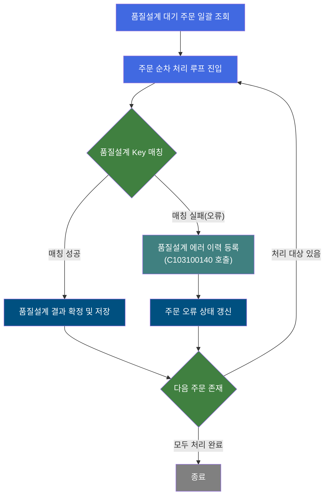
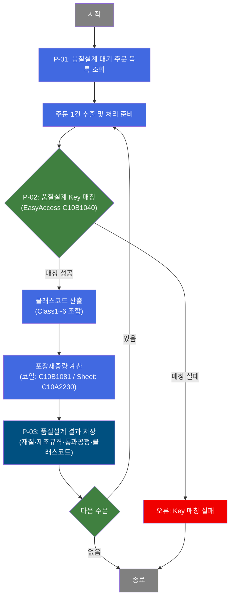
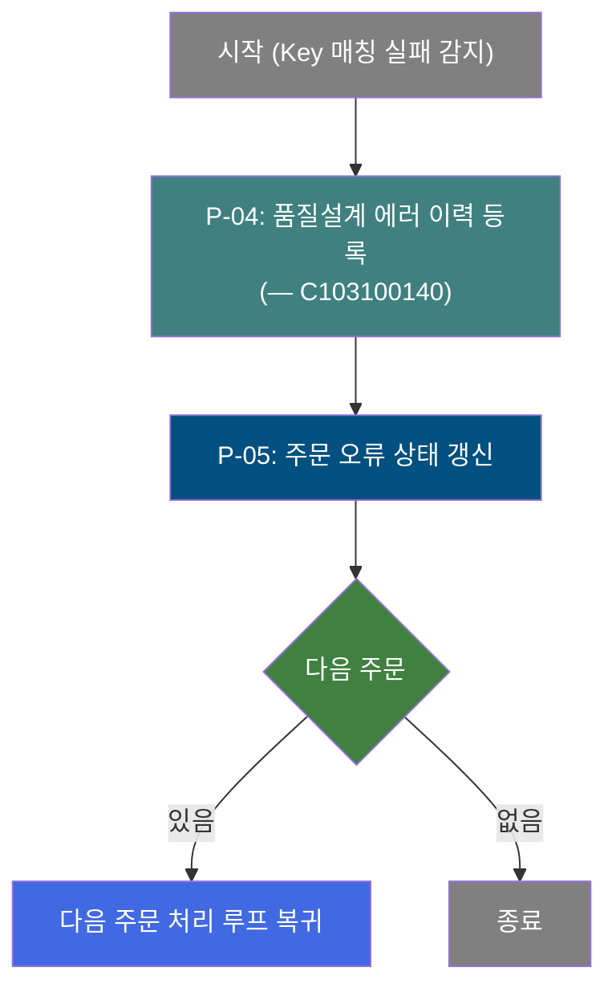
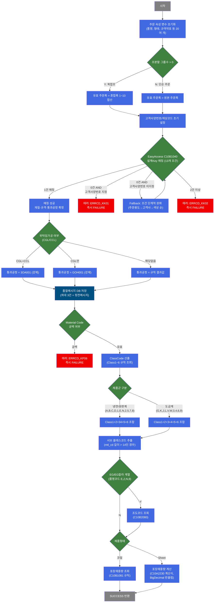

# C102100020 비즈니스 프로세스 분석서 (BPA)

## 1. 시스템 개요

| 항목 | 내용 |
|------|------|
| 서비스 ID | C102100020 |
| 업무명 | 품질설계 공통 자동 편성 (배치) |
| 서비스 타입 | nui |
| 분석 일시 | 2026-03-21 (KST) |
| 원본 분석일 | 2026-03-16 |
| 문서 버전 | 1.0 |

---

## 2. 시스템 목적

이 서비스는 제조실행시스템(MES)에서 수주 주문에 대한 품질설계 편성을 자동으로 수행하는 배치(NUI) 프로세스이다. 품질설계 대기 상태의 주문 목록을 일괄 조회하여, 각 주문의 제품 속성(품명, 형태, 규격, 고객사, 주문용도 등)을 기반으로 설계 Key를 자동 매칭하고, 재질코드·제조규격번호·통과공정·품질설계코드(클래스코드)를 산출하여 주문 레코드에 반영한다.

주요 사용자는 품질/생산기술 부서이며, 수작업 없이 정해진 마스터 규칙(EasyAccess)에 따라 최적 품질설계 결과를 일괄 확정함으로써 후속 생산 지시 및 공정 편성의 기초 데이터를 제공한다. 코일과 Sheet 형태별 포장재중량 계산도 함께 수행된다.

매칭 실패(오류) 주문에 대해서는 품질설계 에러 이력을 별도로 등록하는 에러 처리 서브서비스(C103100140)를 호출하여 오류 추적과 재처리를 지원한다.

---

## 3. 핵심 워크플로우

---

## 4. 상세 워크플로우

### 프로세스 흐름도 — 품질설계 Key 매칭 및 결과 저장 (P-01, P-02, P-03)

### 프로세스 흐름도 — 품질설계 오류 처리 (P-04, P-05)

---

## 5. 비즈니스 로직 상세

P-01: 품질설계 대기 주문 목록 조회 — 처리 대상 주문 일괄 선택

- **입력**: 없음 (배치 기동 시 자동 실행)
- **처리**:
  1. TB_C10_QLT_DSN_CMN 테이블에서 품질설계 상태가 대기 중인 주문 목록 전체 조회
  2. 조회 결과를 이후 루프 처리의 입력 데이터로 준비
- **출력**: 품질설계 대기 주문 목록 (주문번호, 주문라인, 제품 속성 등)
- **예외**: 조회 결과 0건 → 처리 없이 정상 종료

P-02: 품질설계 Key 매칭 — EasyAccess 규칙 기반 설계 Key 확정

- **입력**: 현재 처리 주문의 제품 속성 (품명코드, 제품형태, 규격약호, 주문용도코드, 최종수요가, 고객사양번호, 주문두께, 주문폭, EMBOSS코드, Spangle구분, 도금량지정코드, 표면처리코드, 색상코드)
- **처리**:
  1. 조분할 그룹수 > 0이면 혼합폭(복합조 폭 1~10) 합산으로 유효 주문폭 결정; 아니면 원본 주문폭 사용
  2. 고객사양번호가 공백이면 와일드카드 10자리로 초기 설정; CCL BOM 번호에서 색상코드 추출
  3. 13개 조건값으로 마스터 규칙(C10B1040) 조회 → 1건 매칭 시 성공
  4. 매칭 실패 시 와일드카드 Fallback 전략 적용 (주문용도코드 3자리→5자리→전체→고객사코드→색상코드 순서로 단계적 완화 후 재시도)
  5. 고객사양번호가 지정된 경우 Fallback 없이 즉시 실패 (에러코드 ERRCD_KK01)
  6. 매칭 결과 2건 이상이면 즉시 실패 (에러코드 ERRCD_KK02)
  7. 매칭 성공 후 재질코드, 반제품 Material Code(1~3), 제조규격번호(1~3), 품질메시지(1~3), 통과공정번호 확정
  8. CGL/CCL 위탁임가공 주문은 통과공정번호를 강제 Override ("3OA001" 또는 "GOH001")
  9. Material Code 공백이면 즉시 실패 (에러코드 ERRCD_KP06)
  10. 복합조 주문(조분할 그룹수 > 1)의 혼합폭 다양성(Y/N) 판정
  11. 규격기관(KS/JS 여부)에 따라 주문두께구분 결정
  12. 제품군별 클래스코드 산출:
      - ClassCode1(제품군): C10B9980 규칙 조회 (품명코드, 주문두께구분, EDG, 규격기관)
      - ClassCode2(행선지): C10B9981 규칙 조회 (품명코드, 제품형태, 조분할, 복합조 여부, 주문종류)
      - ClassCode6(표면처리): C10B9984 규칙 조회 (품명코드, 표면처리코드)
      - 냉연/원판 계열(품명코드 A,B,C,D,1,E,N,2,5,7,8): ClassCode34 = C10B9982 조회; Class5 = EG/EG칼라이면 도금량지정코드, 아니면 조도코드
      - 도금 계열(품명코드 G,K,J,L,V,W,3,4,6,9): ClassCode3 = C10B9983 조회; Class4 = Spangle구분; Class5 = 도금량지정코드
  13. 최종 클래스코드(COL_CLS_CD) 조합 = Class1 + Class2 + Class34(냉연)/Class3(도금) + Class4(도금만) + Class5 + Class6
  14. 특정 품명코드 + Material Code 길이 15 이상이면 서브 클래스코드 추출 (mtl_cd 내부 문자열 + CCL BOM 번호)
  15. EG/EG칼라 계열(품명코드 E,2,N,8)이면 조도코드 추가 조회 (C10B2080: 품명코드, 규격기관, 주문용도, 최종수요가, 두께, 폭)
  16. 포장재중량 계산:
      - 코일: C10B1081 규칙 조회 (포장방법, 폭, 포장단중, 길이)
      - Sheet: 폭+길이 합산 후 C10A2230 계산식 실행 → BigDecimal 소수 0자리 반올림
- **출력**: 재질코드, 제조규격번호(1~3), 통과공정번호, 클래스코드, 서브 클래스코드, 조도코드, 포장재중량, 품질설계확정구분, 승인입력기준코드
- **예외**:
  - 설계Key 매칭 전체 실패 → FAILURE 반환 (P-04 오류 처리로 분기)
  - 매칭 결과 2건 이상 → FAILURE 반환
  - Material Code 공백 → FAILURE 반환

P-03: 품질설계 결과 저장 — 매칭 결과를 주문 레코드에 반영

- **입력**: P-02에서 산출된 재질코드, 제조규격번호, 통과공정번호, 클래스코드, 포장재중량 등 품질설계 결과값
- **처리**:
  1. TB_C10_QLT_DSN_CMN 테이블에 품질설계 결과 일괄 갱신 (재질코드, 제조규격번호 1~3, 통과공정번호, 품질설계확정구분, 승인입력기준코드, 클래스코드, 서브 클래스코드, 조도코드, 포장재중량, 주문경로코드, 포장단중)
  2. 처리 완료 후 루프 카운터 감소 → 다음 주문 처리로 복귀
  3. 모든 주문 처리 완료 시 트랜잭션 커밋
- **출력**: TB_C10_QLT_DSN_CMN 갱신
- **예외**: DB 갱신 오류 시 트랜잭션 롤백

P-04: 품질설계 에러 이력 등록 [C103100140] — 매칭 실패 주문 에러 기록

- **입력**: 오류 발생 주문번호, 주문라인, 품질설계 에러코드
- **처리**:
  1. 서브서비스(C103100140) 호출하여 해당 주문의 품질설계 에러 이력 등록
  2. 기존 트랜잭션 내에서 실행 (new-transaction: false)
- **출력**: 품질설계 에러 이력 테이블 등록
- **예외**: 에러 이력 등록 실패 시 해당 건 처리 중단

P-05: 주문 오류 상태 갱신 — 품질설계 에러 여부 플래그 설정

- **입력**: 오류 주문번호, 주문라인
- **처리**:
  1. TB_C10_QLT_DSN_CMN 테이블의 해당 주문에 품질설계 에러 여부(QLT_DSN_ERR_YN = 'Y') 갱신
  2. 오류 처리 완료 후 루프 카운터 감소 → 다음 주문 처리로 복귀
- **출력**: TB_C10_QLT_DSN_CMN 에러 여부 플래그 갱신
- **예외**: DB 갱신 오류 시 해당 건 처리 중단

---

## 6. 커스텀 클래스 워크플로우

### DbQualDesignLoop (171줄)

**역할**: 이전 액티비티가 조회한 품질설계 대기 주문 ResultSet을 1건씩 순회하여 단건 처리 루프를 제어하는 공통 루프 컨트롤러.

171줄로 200줄 미만이므로 Mermaid 미작성. 주요 동작은 다음과 같다:
- 첫 진입 시 ResultSet 전체 건수로 루프 카운터 초기화
- 매 루프마다 현재 처리 건의 컬럼값을 컨텍스트에 바인딩하고, 에러 플래그(P_ERR_KEY, QLT_DSN_ERR_YN)를 초기화
- 루프 카운터가 0이 되면 "exit" 전이를 반환하여 루프 종료
- 주의: 매 루프마다 ResultSet을 처음부터 재탐색하는 구조(O(n²))이므로 대량 처리 시 성능 주의 필요

---

### DbSearchQualKeyMatch (약 1,047줄)

**역할**: 주문 속성 기반으로 마스터 규칙 엔진(EasyAccess)을 통해 품질설계 Key를 매칭하고, 다차원 클래스코드(Class1~6) 조합, 위탁임가공 처리, 포장재중량 계산까지 수행하는 품질설계 핵심 처리 클래스.

---

## 7. 주요 유즈케이스

UC-01: 품질설계 자동 편성 배치 실행

- **Actor**: 배치 스케줄러 (자동 기동) 또는 생산기술 담당자 (수동 기동)
- **목적**: 품질설계 대기 주문에 대해 설계 Key 매칭 및 품질설계 결과를 일괄 자동 확정
- **주요 흐름**:
  1. 배치 기동 시 품질설계 대기 주문 전체 조회
  2. 주문별로 제품 속성(품명, 형태, 규격, 고객사 등)을 기반으로 설계 Key 매칭
  3. 매칭 성공 주문에 대해 재질코드, 제조규격번호, 통과공정, 클래스코드, 포장재중량 확정 저장
  4. 모든 주문 처리 완료 후 트랜잭션 커밋
- **예외**: 매칭 실패 주문은 에러 이력 등록 후 오류 상태로 저장, 처리 계속 진행

UC-02: 설계Key 매칭 실패 오류 처리 및 이력 관리

- **Actor**: 배치 스케줄러 (자동)
- **목적**: 품질설계 Key 매칭에 실패한 주문을 오류로 분류하고 에러 이력을 등록하여 담당자가 원인을 파악하고 재처리할 수 있도록 지원
- **주요 흐름**:
  1. 설계 Key 매칭 실패(Fallback 소진, 중복 매칭, Material Code 오류) 감지
  2. 에러 이력 서브서비스(C103100140) 호출하여 에러 상세 등록
  3. 해당 주문에 품질설계 에러 여부 플래그 갱신
  4. 다음 주문 처리로 계속 진행
- **예외**: 고객사양번호가 지정된 경우 Fallback 없이 즉시 오류 처리

UC-03: 위탁임가공 주문의 통과공정 자동 결정

- **Actor**: 배치 스케줄러 (자동)
- **목적**: CGL(연속용융아연도금) 또는 CCL(칼라코팅) 위탁임가공 주문에 대해 규칙 결과와 무관하게 지정된 통과공정번호를 강제 설정하여 생산 공정 편성의 정확성 보장
- **주요 흐름**:
  1. 설계 Key 매칭 성공 후 CGL/CCL 위탁임가공 여부 판정
  2. CGL+CCL 동시 위탁이면 통과공정번호 "3OA001" 강제 설정
  3. CGL만 위탁이면 통과공정번호 "GOH001" 강제 설정
  4. 해당없으면 규칙 결과값 그대로 사용
- **예외**: 없음

---

## 8. 화면 구성 개요

이 서비스는 NUI(배치) 타입으로 화면이 없습니다. 이 섹션은 생략됩니다.

---

## 9. 관련 엔티티

### 엔티티 목록

| 엔티티(테이블) | 설명 | 사용 유형 |
|---------------|------|----------|
| TB_C10_QLT_DSN_CMN | 품질설계 공통 주문 정보 (대기/완료/오류 상태 포함) | 조회/갱신 |

### 엔티티 간 관계

- TB_C10_QLT_DSN_CMN은 주문번호와 주문라인을 기준으로 품질설계 처리 상태, 설계 결과(클래스코드, 재질코드, 제조규격번호 등), 오류 여부를 모두 관리하는 단일 핵심 엔티티이다.
- 품질메시지 및 정전메시지는 DbSearchQualKeyMatch 내부 SQL을 통해 별도 메시지 테이블에 추가 저장된다.

---

## 10. 서브서비스

| 서비스 ID | 설명 | 호출 시점 | 트랜잭션 | BPA 문서 |
|-----------|------|---------|---------|---------|
| C103100140 | 품질설계 에러 이력 등록 | P-04: 설계 Key 매칭 실패 감지 시 | 기존 트랜잭션 공유 | 미작성 |

---

## 11. 특이사항 및 주의사항

### 1. EasyAccess 와일드카드 Fallback 전략의 복잡성
품질설계 Key 매칭은 13개 조건값으로 시작하여 주문용도코드(3자리→5자리→전체), 고객사코드, 색상코드 순으로 단계적으로 조건을 완화하는 반복 루프 구조이다. 고객사양번호가 지정된 주문은 Fallback 없이 즉시 실패 처리되므로, 마스터 규칙(C10B1040)에 해당 조건의 정확한 등록이 필수이다. 매칭 결과 2건 이상이면 데이터 정합성 오류로 처리된다.

### 2. 다차원 클래스코드(CLS_CD) 조합 방식의 제품군별 분기
최종 클래스코드는 제품군에 따라 조합 방식이 다르다. 냉연/원판 계열(품명코드 A,B,C,D,1,E,N,2,5,7,8)은 Class1+2+34+5+6 구조, 도금 계열(G,K,J,L,V,W,3,4,6,9)은 Class1+2+3+4+5+6 구조로 Class4(Spangle구분)가 추가된다. Class5 역시 EG/EG칼라이면 도금량지정코드, 그 외는 조도코드로 결정 기준이 다르므로 마스터 규칙 변경 시 제품군 분기 로직 함께 검토 필요.

### 3. 루프 제어의 O(n²) 성능 특성 주의
DbQualDesignLoop 클래스는 매 루프마다 ResultSet을 처음부터 재탐색하는 방식으로 동작한다(bindSet.reset() + while 전체 순회). 처리 건수 N건에 대해 최대 N*(N+1)/2회의 탐색이 발생하므로(예: 100건 시 최대 5,050회), 대량의 품질설계 대기 주문이 누적될 경우 배치 처리 시간이 급격히 증가할 수 있다.

### 4. 위탁임가공 주문의 통과공정 강제 Override
CGL 또는 CCL 위탁임가공 여부(poc_cgl_yn, poc_ccl_yn)에 따라 규칙 매칭 결과와 무관하게 통과공정번호를 "3OA001" 또는 "GOH001"로 강제 설정한다. 이는 외부 협력사 공정 편성과의 연동 요건으로, 해당 플래그 설정 시 EasyAccess 규칙 변경이 통과공정에 영향을 미치지 않는다.

### 5. 오류 처리 서브서비스(C103100140)와의 트랜잭션 공유
설계Key 매칭 실패 시 에러 이력 등록(C103100140)은 새 트랜잭션 없이 기존 트랜잭션 내에서 호출된다(new-transaction: false). 이로 인해 에러 이력 등록과 주문 오류 상태 갱신이 동일 트랜잭션에 묶이므로, 이후 커밋 시점까지 에러 내용이 DB에 반영되지 않는다.
