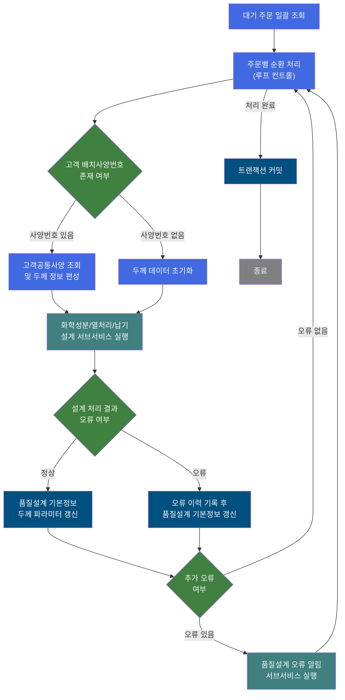
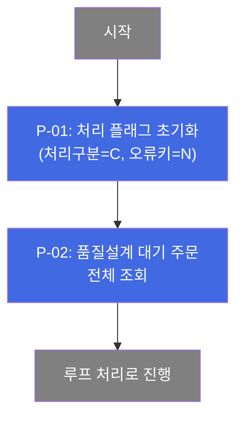
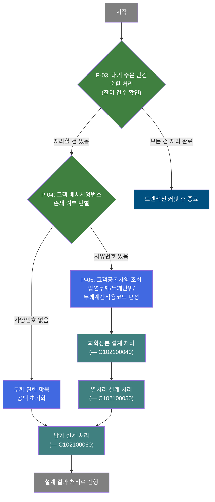
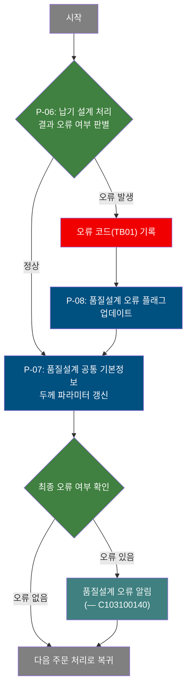

# C102100030 비즈니스 프로세스 분석서 (BPA)

## 1. 시스템 개요

| 항목 | 내용 |
|------|------|
| 서비스 ID | C102100030 |
| 업무명 | 품질설계 공통 배치 처리 (두께 설계 정보 계산 및 갱신) |
| 서비스 타입 | nui |
| 분석 일시 | 2026-03-21 (KST) |
| 원본 분석일 | 2026-03-16 |
| 문서 버전 | 1.0 |

---

## 2. 시스템 목적

이 서비스는 품질설계 처리 대기 상태의 주문에 대해 두께 관련 설계 정보를 자동으로 계산하고 갱신하는 배치(NUI) 프로세스이다. 주문별로 고객 배치사양번호 유무를 판별하여 고객이 요청한 압연두께 정보를 조회하고, 화학성분(CHM), 열처리(MQL), 납기(DLV) 서브서비스를 순차 호출하여 각 설계 항목을 완성한다.

처리 과정에서 오류가 발생한 주문에 대해서는 오류 이력을 별도로 기록하고 품질설계 오류 알림(C103100140) 서브서비스를 호출하며, 오류가 없는 주문은 계산된 두께 파라미터를 품질설계 공통 테이블에 정상 반영한다. 이 서비스는 다수의 주문을 루프 방식으로 1건씩 처리하여, 스케줄 또는 트리거 기반으로 일괄 실행된다.

---

## 3. 핵심 워크플로우

---

## 4. 상세 워크플로우

### 프로세스 흐름도 — 대기 주문 조회 및 루프 초기화 (P-01, P-02)

### 프로세스 흐름도 — 주문 단건 순환 처리 및 두께 정보 수집 (P-03, P-04, P-05)

### 프로세스 흐름도 — 설계 결과 반영 및 오류 처리 (P-06, P-07, P-08)

---

## 5. 비즈니스 로직 상세

P-01: 처리 플래그 초기화 — 배치 실행 시작 시 상태 변수를 초기값으로 설정

- **입력**: 없음 (고정 상수값 설정)
- **처리**:
  1. 처리구분 플래그를 "C"(계산 처리)로 설정
  2. 오류 키를 "N"(정상)으로 초기화
- **출력**: 처리 컨텍스트 상태 변수 초기화
- **예외**: 없음

P-02: 품질설계 대기 주문 조회 — 처리 대상 주문 목록 수집

- **입력**: TB_C10_QLT_DSN_CMN (품질설계 공통 테이블)에서 대기 상태 주문 조회
- **처리**:
  1. 품질설계 상태가 처리 대기인 주문 전체를 조회
  2. 주문번호, 주문행번, 제품명코드, 제품형상, 고객 배치사양번호, 주문 치수(두께/폭/길이), 규격 정보 등 설계에 필요한 항목 일괄 수집
- **출력**: 처리 대상 주문 목록(결과셋)
- **예외**: 조회 결과 0건 시 처리 없이 루프 종료

P-03: 대기 주문 단건 순환 처리 — 전체 주문 목록에서 1건씩 순차 처리

- **입력**: P-02에서 수집한 처리 대상 주문 목록
- **처리**:
  1. 루프 카운터(잔여 처리 건수) 확인 — 최초 진입 시 전체 건수로 초기화
  2. 잔여 건수가 0이면 루프 종료 후 커밋 단계로 이동
  3. 잔여 건수가 남아 있으면 현재 주문 데이터를 처리 컨텍스트에 바인딩
  4. 오류 플래그(P_ERR_KEY), 품질설계 오류 여부(QLT_DSN_ERR_YN)를 초기화하여 이전 주문 처리 결과가 간섭하지 않도록 방지
  5. 카운터를 1 감소시킨 후 다음 단계로 진행
- **출력**: 현재 처리 주문의 각 항목(주문번호, 치수, 사양 등)이 처리 컨텍스트에 세팅됨
- **예외**: 루프 제어 파라미터 미설정 시 오류 반환

P-04: 고객 배치사양번호 존재 여부 판별 — 두께 처리 경로 분기

- **입력**: 처리 컨텍스트의 고객 배치사양번호(CUS_BTH_PAP_NO)
- **처리**:
  1. 현재 주문의 고객 배치사양번호 값이 null인지 아닌지 판별
  2. null이 아니면 고객공통사양 조회 경로로 분기
  3. null이면 두께 데이터 초기화(공백) 경로로 분기
- **출력**: 분기 결과에 따른 처리 경로 결정
- **예외**: 없음

P-05: 고객공통사양 조회 및 두께 정보 편성 — 고객 배치사양번호 기반 두께 파라미터 수집

- **입력**: 고객 배치사양번호(CUS_BTH_PAP_NO), 마스터 스키마의 고객공통사양 뷰(VI_M00_C10A1020)
- **처리**:
  1. 고객 배치사양번호를 키로 고객공통사양 뷰를 조회
  2. 조회 결과 건수 판별:
     - 1건: 고객요청압연두께, 두께단위, 제품두께계산적용코드를 처리 컨텍스트에 편성
     - 0건: 오류코드(KS04, 고객공통 미존재) 설정, 두께 항목 공백 처리
     - 2건 이상: 오류코드(KS14, 고객공통 중복) 설정, 두께 항목 공백 처리
  3. 오류 발생 시에도 처리는 계속 진행(SUCCESS 반환) — 오류 정보는 이후 단계에서 일괄 처리
  4. 품질설계사양구분(QLT_DSN_SPC_TP)을 "1"로 설정
- **출력**: 처리 컨텍스트에 압연두께, 두께단위, 두께계산적용코드 편성(또는 공백)
- **예외**: 고객 배치사양번호가 null이면 오류코드(KC01) 설정 후 즉시 FAILURE 반환

P-06: 납기 설계 처리 결과 오류 여부 판별 — 서브서비스 처리 후 오류 분기

- **입력**: 화학성분(C102100040), 열처리(C102100050), 납기(C102100060) 서브서비스 처리 결과의 오류 플래그
- **처리**:
  1. P_ERR_KEY 플래그 값 확인 ("N"=정상, "Y"=오류)
  2. 정상이면 품질설계 기본정보 갱신 경로로 진행
  3. 오류이면 오류코드(TB01) 및 오류 플래그를 기록한 후 오류 이력 갱신 단계로 진행
- **출력**: 분기 결과에 따른 처리 경로 결정
- **예외**: 없음

P-07: 품질설계 공통 기본정보 두께 파라미터 갱신 — 계산된 두께 정보를 DB에 저장

- **입력**: 처리 컨텍스트의 고객요청압연두께, 두께단위, 제품두께계산적용코드, 주문번호, 주문행번
- **처리**:
  1. 주문번호, 주문행번으로 TB_C10_QLT_DSN_CMN 테이블의 해당 행을 식별
  2. 고객요청압연두께(CUS_REQ_ROL_THK), 두께단위(THK_COR_UNT), 제품두께계산적용코드(PRD_THK_CAL_APL_CD) 갱신
  3. 변경 이력(최종 변경 객체 타입/ID/프로그램ID/타임스탬프) 자동 기록(isAudit=true)
  4. 갱신 실패 시 오류코드(TB01)를 기록하고 오류 이력 갱신 경로로 이동
- **출력**: TB_C10_QLT_DSN_CMN — 두께 파라미터 갱신
- **예외**: UPDATE 실패 → 오류 플래그 설정 후 P-08 경로로 전환

P-08: 품질설계 오류 플래그 업데이트 — 처리 오류 발생 주문에 오류 표시 기록

- **입력**: 주문번호, 주문행번
- **처리**:
  1. 오류 발생 주문의 TB_C10_QLT_DSN_CMN 테이블에 품질설계 오류 여부(QLT_DSN_ERR_YN) = 'Y' 업데이트
  2. 변경 이력 자동 기록
  3. 오류 기록 완료 후 P-07(두께 파라미터 갱신) 단계로 이동하여 두께 갱신도 함께 수행
- **출력**: TB_C10_QLT_DSN_CMN — 오류 플래그 갱신
- **예외**: 없음 (후속 흐름으로 계속 진행)

---

## 6. 커스텀 클래스 워크플로우

### DbSearchCusData (약 137줄)

**역할**: 고객 배치사양번호를 키로 마스터 스키마의 고객공통사양 뷰를 조회하여 압연두께 관련 파라미터(고객요청압연두께, 두께단위, 두께계산적용코드)를 처리 컨텍스트에 편성한다. 조회 결과 건수에 따라 오류코드를 설정하며, 오류 발생 시에도 SUCCESS를 반환하여 이후 단계에서 일괄 오류 처리가 가능하도록 설계되어 있다. (200줄 미만 — 텍스트 기술)

**비즈니스 규칙 요약**:
- 고객 배치사양번호 null → 오류코드 KC01 설정, FAILURE 반환 (유일하게 즉시 중단)
- 조회 1건 → 두께 관련 항목 정상 편성
- 조회 0건 → 오류코드 KS04(미존재), 두께 항목 공백, SUCCESS 반환
- 조회 2건 이상 → 오류코드 KS14(중복), 두께 항목 공백, SUCCESS 반환
- DB 예외 → 에러 로그 기록, SUCCESS 반환

---

### DbQualDesignLoop (약 171줄)

**역할**: 이전 단계에서 조회한 대기 주문 결과셋을 1건씩 순환 처리하기 위한 루프 제어 액티비티이다. 역방향 카운터(잔여 건수)를 관리하며, 처리 건수가 0이 되면 "exit"를 반환하여 루프를 종료한다. 매 루프 진입 시 오류 플래그를 초기화하여 주문 간 상태 오염을 방지한다. (200줄 미만 — 텍스트 기술)

**비즈니스 규칙 요약**:
- 최초 진입 시 잔여 건수를 전체 조회 건수로 초기화
- 잔여 건수 0 → 루프 종료 ("exit" 반환), 카운터 변수 정리
- 매 루프: P_ERR_KEY="N", QLT_DSN_ERR_YN="" 초기화 → 현재 Row 컬럼값 컨텍스트 바인딩 → 잔여 카운터 감소
- 성능 특성: 매 루프마다 결과셋 처음부터 재탐색(O(n²)) — 대량 처리 시 성능 저하 주의

---

## 7. 주요 유즈케이스

UC-01: 고객 배치사양번호가 있는 주문의 품질설계 두께 정보 일괄 처리

- **Actor**: 배치 스케줄러 (자동 실행)
- **목적**: 고객사양에 매핑된 압연두께 정보를 자동 수집하여 품질설계 공통 기본정보를 완성
- **주요 흐름**:
  1. 품질설계 대기 상태 주문 전체를 조회
  2. 고객 배치사양번호가 있는 주문을 1건씩 순환
  3. 고객공통사양 뷰에서 요청 두께, 두께단위, 두께계산적용코드 수집
  4. 화학성분(C102100040), 열처리(C102100050), 납기(C102100060) 설계 서브서비스 순차 실행
  5. 오류 없으면 계산된 두께 파라미터를 품질설계 공통 테이블에 갱신
  6. 전체 주문 처리 완료 후 트랜잭션 커밋
- **예외**: 고객공통 사양이 중복(2건 이상) 또는 미존재(0건)이면 오류 플래그 기록 후 계속 처리

UC-02: 고객 배치사양번호가 없는 주문 처리

- **Actor**: 배치 스케줄러 (자동 실행)
- **목적**: 사양번호가 없는 주문에 대해 두께 항목을 공백으로 초기화한 상태에서 납기 설계를 수행
- **주요 흐름**:
  1. 고객 배치사양번호가 없는 주문을 루프에서 감지
  2. 두께 관련 항목(고객요청압연두께, 두께단위, 두께계산적용코드)을 공백으로 초기화
  3. 납기 설계 서브서비스(C102100060) 실행
  4. 처리 결과 오류 여부 판별 후 품질설계 기본정보 갱신
- **예외**: 납기 설계 처리 오류 시 오류 플래그 업데이트 및 품질설계 오류 알림(C103100140) 호출

UC-03: 품질설계 처리 오류 발생 주문 이력 관리

- **Actor**: 배치 스케줄러 (자동 실행)
- **목적**: 서브서비스 처리 중 오류가 발생한 주문에 오류 플래그와 이력을 기록하고 오류 알림 처리
- **주요 흐름**:
  1. 서브서비스(CHM/MQL/DLV) 처리 후 오류 플래그 확인
  2. 오류 있으면 품질설계 오류 여부(QLT_DSN_ERR_YN)를 'Y'로 업데이트
  3. 두께 파라미터 갱신 후 최종 오류 플래그 재확인
  4. 오류가 최종 확인되면 품질설계 오류 알림 서브서비스(C103100140) 호출
  5. 루프 계속 진행 — 오류 주문도 전체 배치가 중단되지 않음
- **예외**: 오류 플래그 업데이트(P-08) 중 실패 시 오류 로그 후 계속 진행

---

## 9. 관련 엔티티

### 엔티티 목록

| 엔티티(테이블) | 설명 | 사용 유형 |
|---------------|------|----------|
| TB_C10_QLT_DSN_CMN | 품질설계 공통 마스터 — 주문별 품질설계 상태, 두께/치수 파라미터, 오류 플래그 저장 | 조회/갱신 |
| VI_M00_C10A1020 | M00 마스터 스키마 고객공통사양 뷰 — 고객 배치사양번호 기준 압연두께/두께단위 정보 | 조회 |

### 엔티티 간 관계
- TB_C10_QLT_DSN_CMN은 주문번호(ORD_NO) + 주문행번(ORD_LN)을 복합 키로 단건 식별되며, 이 서비스에서 두께 파라미터 및 오류 플래그 갱신의 대상 엔티티이다.
- VI_M00_C10A1020(M00APUSER)은 TB_C10_QLT_DSN_CMN의 고객 배치사양번호(CUS_BTH_PAP_NO)를 외부 참조 키로 하여 고객이 요청한 압연두께 관련 사양 정보를 제공한다.

---

## 10. 서브서비스

| 서비스 ID | 설명 | 호출 시점 | 트랜잭션 | BPA 문서 |
|-----------|------|---------|---------|---------|
| C102100040 | 화학성분(CHM) 품질설계 처리 | P-05 고객공통사양 조회 완료 후 | 부모 트랜잭션 공유 | 미작성 |
| C102100050 | 열처리(MQL) 품질설계 처리 | C102100040 처리 완료 후 | 부모 트랜잭션 공유 | 미작성 |
| C102100060 | 납기(DLV) 품질설계 처리 | C102100050 처리 완료 후 (또는 두께 초기화 후) | 부모 트랜잭션 공유 | 미작성 |
| C103100140 | 품질설계 오류 알림/처리 | P-07 완료 후 오류 플래그 Y 확인 시 | 부모 트랜잭션 공유 | 미작성 |

---

## 11. 특이사항 및 주의사항

### 1. DbSearchCusData의 오류 억제(Soft-Error) 패턴
고객공통사양 뷰(VI_M00_C10A1020) 조회 결과가 0건 또는 2건 이상인 경우 오류코드를 컨텍스트에 설정하지만, 실행 결과는 SUCCESS를 반환한다. 원본 코드에서 FAILURE 반환 구문이 주석 처리되어 있어, 데이터 품질 오류(중복/미존재) 발생 시에도 배치가 중단되지 않고 이후 오류 처리 단계에서 일괄 처리된다. 이 패턴은 단건 오류로 인한 배치 전체 중단을 방지하기 위한 의도적 설계이다.

### 2. ROUTER_CHK_ERR5의 오류 경로 불일치 (MODIFY_ERR 이중 적용 가능성)
ROUTER_CHK_ERR5에서 오류(P_ERR_KEY=Y) 시 MODIFY_ERR → MODIFY 순으로 처리되는데, MODIFY_ERR 이후에도 MODIFY가 실행되어 두께 파라미터가 갱신된다. 즉 납기 설계 처리 오류가 발생한 주문도 두께 갱신이 수행되며, 오류 이력 기록과 두께 갱신이 동시에 이루어진다. 의도적 처리이지만 오류 주문의 두께 갱신 여부를 검토할 필요가 있다.

### 3. DbQualDesignLoop의 O(n²) 성능 특성
루프 액티비티(DbQualDesignLoop)는 매 루프 진입 시 PosRowSet의 커서를 처음(reset)부터 재탐색하여 현재 처리 Row를 찾는다. 처리 건수 N이 커질수록 총 탐색 횟수가 N×(N+1)/2로 증가하는 O(n²) 특성을 가진다. 예를 들어 대기 주문이 100건이면 최대 5,050회 탐색이 발생한다. 대량 처리 환경에서는 처리 건수 증가에 따른 성능 저하를 모니터링해야 한다.

### 4. 4개 서브서비스 트랜잭션 공유 구조
C102100040, C102100050, C102100060, C103100140 모두 `new-transaction=false`(또는 미설정)로 호출되어 부모 서비스(C102100030)의 트랜잭션 컨텍스트를 공유한다. 모든 주문의 처리가 완료된 후 COMMIT 액티비티에서 일괄 커밋되므로, 처리 도중 JVM 장애 발생 시 전체 배치 결과가 롤백된다. 서브서비스 중 하나라도 예외를 던지면 전체 트랜잭션이 영향을 받을 수 있다.

### 5. 처리 플래그 초기화 파라미터 불일치
INIT_QLT_ERR 액티비티의 서비스 XML에 `param-count=1`로 설정되어 있으나 실제로는 `param0`과 `param1` 두 항목을 설정한다. GLUE 프레임워크의 DbSetParam 공통 액티비티가 `param-count`와 무관하게 모든 `paramN`을 처리하는지 확인이 필요하다.
