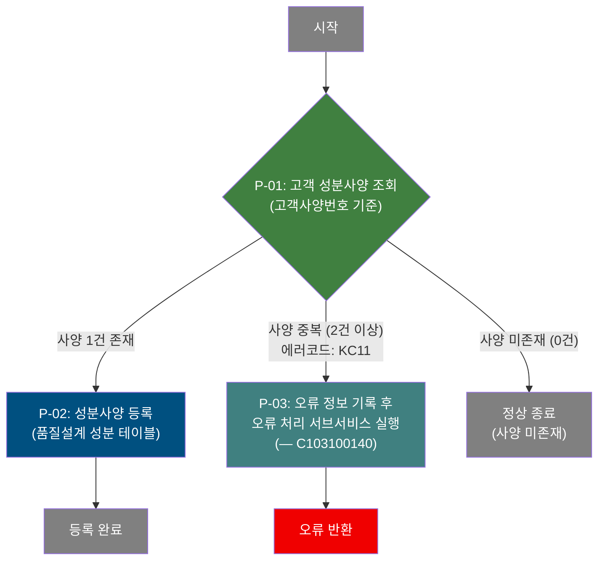
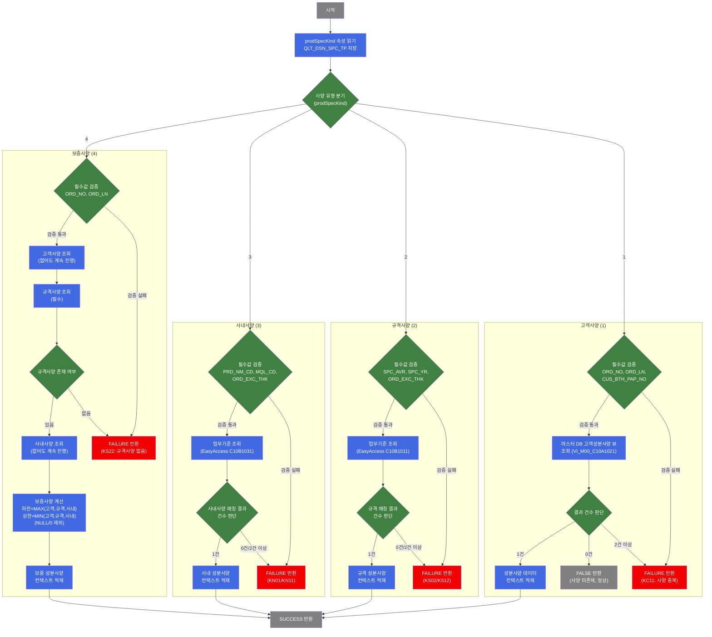

# C102100040 비즈니스 프로세스 분석서 (BPA)

## 1. 시스템 개요

| 항목 | 내용 |
|------|------|
| 서비스 ID | C102100040 |
| 업무명 | 고객 성분사양 편성 및 등록 |
| 서비스 타입 | nui |
| 분석 일시 | 2026-03-21 (KST) |
| 원본 분석일 | 2026-03-16 |
| 문서 버전 | 1.0 |

---

## 2. 시스템 목적

본 서비스는 철강 제품 주문에 대한 **고객 성분사양(Chemical Composition Specification)**을 조회·편성하여 품질설계결과 테이블에 등록하는 NUI(Network UI) 배치 프로세스이다. 주문번호와 주문행번, 고객사양번호를 입력으로 받아 고객이 요구하는 성분 규격(탄소, 규소, 망간 등 13종 원소의 하한/상한값)을 마스터 데이터에서 조회한 뒤, 품질설계 성분 테이블에 신규 등록한다.

이 프로세스는 품질설계 워크플로우의 일부로, 주문 접수 후 해당 주문이 어떤 성분 범위 내에서 제조되어야 하는지를 결정하는 단계이다. 고객이 제시한 성분사양이 시스템에 존재하지 않는 경우에는 오류 없이 정상 종료하며, 성분사양이 중복으로 존재할 경우 에러로 처리한다.

---

## 3. 핵심 워크플로우

> 이 서비스는 단일 업무 프로세스로 구성되어 있어 핵심 워크플로우를 별도로 작성하지 않습니다. **4. 상세 워크플로우**를 참조하세요.

---

## 4. 상세 워크플로우

### 프로세스 흐름도 — 고객 성분사양 편성 및 등록 (P-01, P-02, P-03)

---

## 5. 비즈니스 로직 상세

P-01: 고객 성분사양 조회 — 고객사양번호로 마스터 성분사양 데이터 조회

- **입력**: 주문번호(`ORD_NO`), 주문행번(`ORD_LN`), 고객사양번호(`CUS_BTH_PAP_NO`)
- **처리**:
  1. 입력 파라미터(주문번호, 주문행번, 고객사양번호) 필수값 검증
  2. 마스터 DB의 고객성분사양 뷰(`VI_M00_C10A1021`)에서 고객사양번호에 해당하는 성분 규격(13종 원소 하한/상한값) 조회
  3. 조회 결과 건수 판단:
     - 1건: 성분사양 데이터를 컨텍스트에 적재하고 다음 단계로 진행
     - 0건: 고객사양 미존재로 오류 없이 정상 종료 (`FALSE` 전이)
     - 2건 이상: 성분사양 중복 오류(에러코드 KC11)로 처리
- **출력**: 13종 원소별 하한값/상한값, 품질설계사양구분(`QLT_DSN_SPC_TP=1`) 컨텍스트 적재
- **예외**: 사양 중복(2건 이상) → 에러코드 KC11 설정 후 오류 처리 서브서비스 호출(P-03)

P-02: 성분사양 등록 — 품질설계 성분 테이블에 조회된 사양 신규 저장

- **입력**: P-01에서 컨텍스트에 적재된 성분사양 데이터(주문번호, 주문행번, 사양구분, 13종 원소 하한/상한값 26개 항목)
- **처리**:
  1. 품질설계 성분 테이블(`TB_C10_QLT_DSN_CHM`)에 성분사양 데이터 신규 등록(INSERT)
  2. 감사(Audit) 정보(등록자, 등록일시, 변경자, 변경일시) 자동 기록
- **출력**: `TB_C10_QLT_DSN_CHM` 테이블에 성분사양 1건 신규 등록
- **예외**: INSERT 실패 시 트랜잭션 롤백

P-03: 오류 처리 서브서비스 실행 — 오류 정보 기록 및 오류 처리 위임

- **입력**: 에러코드(`QLT_DSN_ERR_CD=TB02`), 오류 키(`P_ERR_KEY=Y`)
- **처리**:
  1. 오류 파라미터 설정(에러 분류코드 TB02, 오류 키 Y)
  2. 오류 처리 서브서비스(`C103100140`) 호출하여 오류 이력 등록 또는 알림 처리 위임
- **출력**: 오류 처리 결과
- **예외**: 서브서비스 호출 자체 오류 시 상위 트랜잭션에 전파

---

## 6. 커스텀 클래스 워크플로우

### DbSearchChemData (약 534줄)

**역할**: 품질설계사양 구분(고객/규격/사내/보증)에 따라 해당 성분 규격값(13종 원소 하한/상한)을 조회·편성하여 컨텍스트에 저장하는 다목적 성분사양 편성 액티비티. C102100040에서는 `prodSpecKind=1`(고객사양) 편성에 사용.

---

## 7. 주요 유즈케이스

UC-01: 고객 성분사양 존재 시 품질설계 등록

- **Actor**: 품질설계 NUI 배치 프로세스
- **목적**: 주문에 대한 고객 요구 성분사양을 품질설계 테이블에 등록
- **주요 흐름**:
  1. 주문번호, 주문행번, 고객사양번호를 입력으로 배치 프로세스 실행
  2. 마스터 DB에서 고객사양번호에 해당하는 성분 규격(13종 원소 하한/상한값) 1건 조회
  3. 조회된 성분사양 데이터를 품질설계 성분 테이블에 신규 등록(감사 정보 포함)
- **예외**: 성분사양이 중복 등록된 경우 에러코드 KC11로 오류 처리

UC-02: 고객 성분사양 미존재 시 정상 종료

- **Actor**: 품질설계 NUI 배치 프로세스
- **목적**: 고객사양번호로 조회한 성분사양이 없는 경우 오류 없이 프로세스 종료
- **주요 흐름**:
  1. 주문번호, 주문행번, 고객사양번호를 입력으로 배치 프로세스 실행
  2. 마스터 DB에서 고객사양번호로 성분사양 조회 결과 0건 확인
  3. 오류 처리 없이 `FALSE` 전이를 통해 정상 종료
- **예외**: 해당 없음 (0건은 정상 처리로 간주)

UC-03: 성분사양 중복 시 오류 처리

- **Actor**: 품질설계 NUI 배치 프로세스
- **목적**: 마스터 데이터에 동일 고객사양번호로 2건 이상의 성분사양이 존재하는 경우 오류 이력 등록
- **주요 흐름**:
  1. 고객사양번호로 마스터 DB 조회 결과 2건 이상 확인
  2. 에러코드 KC11(사양 중복), 분류코드 TB02 설정
  3. 오류 처리 서브서비스(`C103100140`) 호출하여 오류 이력 등록
- **예외**: 서브서비스 오류 시 상위 배치 프로세스에 오류 전파

---

## 9. 관련 엔티티

### 엔티티 목록

| 엔티티(테이블/뷰) | 설명 | 사용 유형 |
|-----------------|------|----------|
| TB_C10_QLT_DSN_CHM | 품질설계결과 성분 정보 테이블 (주문별 사양구분별 13종 원소 하한/상한값 보관) | 저장(INSERT) |
| VI_M00_C10A1021 | 고객성분사양 뷰 (M00APUSER 마스터 DB, 고객사양번호별 성분 규격 참조) | 조회 |

### 엔티티 간 관계
- `VI_M00_C10A1021`은 마스터 DB의 고객성분사양 정보를 제공하는 뷰로, `TB_C10_QLT_DSN_CHM`에 등록할 성분 규격값의 원본 데이터 소스이다.
- `TB_C10_QLT_DSN_CHM`은 주문번호+주문행번+사양구분을 복합키로 하며, 동일 주문에 대해 고객(1)/규격(2)/사내(3)/보증(4) 사양 유형별로 각각 1건씩 등록된다.

---

## 10. 서브서비스

| 서비스 ID | 설명 | 호출 시점 | 트랜잭션 | BPA 문서 |
|-----------|------|---------|---------|---------|
| C103100140 | 품질설계 오류 처리 (오류 이력 등록 및 알림) | P-03: 성분사양 중복 오류 발생 시 | 신규 | 미작성 |

---

## 11. 특이사항 및 주의사항

### 1. 고객사양 미존재(0건) 시 정상 종료 처리
고객사양번호로 마스터 DB를 조회한 결과가 0건인 경우, 오류가 아닌 `FALSE` 전이를 통해 정상 종료한다. 이는 고객사양이 아직 마스터에 등록되지 않은 주문도 이 프로세스를 통과할 수 있도록 의도된 설계이다. 소스 코드 내 주석 처리된 에러 블록이 존재하며, 이전에는 오류 처리하던 로직을 의도적으로 변경한 것으로 보인다.

### 2. DbSearchChemData 클래스의 다중 역할 설계
`DbSearchChemData` 클래스는 `prodSpecKind` Property 하나로 고객(1)/규격(2)/사내(3)/보증(4) 4가지 사양 유형을 모두 처리하는 재사용 설계를 채택하고 있다. C102100040은 `prodSpecKind=1`(고객사양) 용도로 사용하며, 동일 클래스를 C102100080(규격), C102100110(사내), C102100130(보증) 서비스에서도 공유한다.

### 3. 보증사양 편성 알고리즘 (참고)
동일 클래스가 보증사양(prodSpecKind=4) 편성 시 적용하는 알고리즘은 `보증 하한 = MAX(고객/규격/사내 하한)`, `보증 상한 = MIN(고객/규격/사내 상한, NULL/0 제외)`이다. 이는 세 사양 중 가장 좁은 허용 범위를 보증사양으로 결정하는 로직으로, 철강 제조의 품질보증 기준이 된다.

### 4. 마스터 DB와 MES DB 간 교차 조회
성분사양 조회는 `M00APUSER(마스터 DB)`의 뷰를 참조하고, 등록은 `MESAPUSER(MES DB)`의 테이블에 수행한다. 두 DB 스키마에 걸쳐 데이터를 처리하므로 마스터 데이터 변경 시 MES 프로세스에 영향을 줄 수 있다.

### 5. 오류 처리 위임 구조
성분사양 중복 오류 발생 시 직접 오류를 반환하지 않고 서브서비스(`C103100140`)에 위임하여 오류 이력을 별도로 기록한다. 오류 분류코드 `TB02`로 품질설계 오류임을 식별하며, 이 구조는 오류 이력 관리를 중앙화하는 패턴이다.
