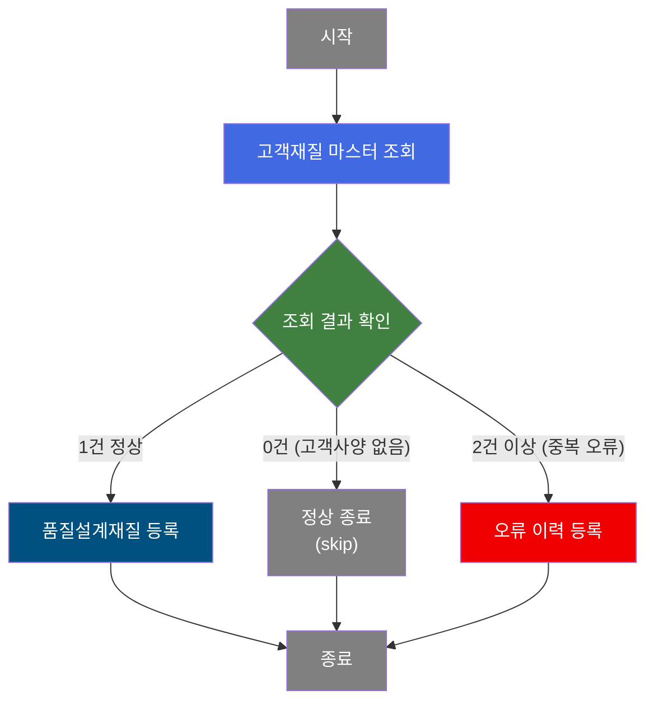
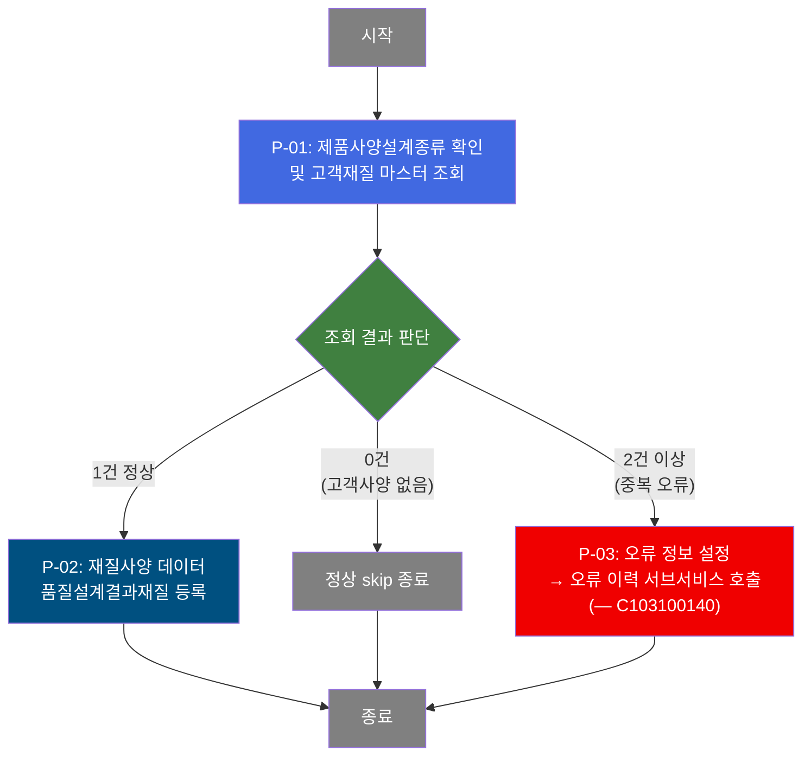
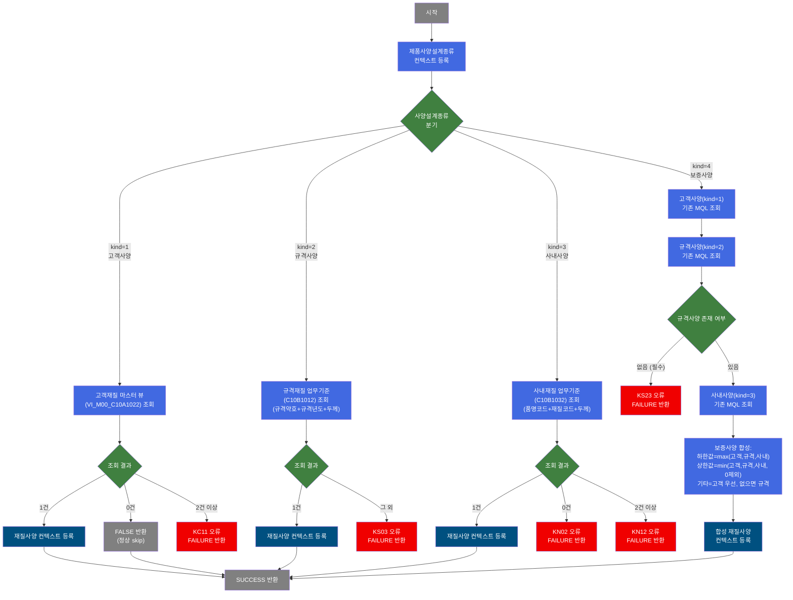

# C102100050 비즈니스 프로세스 분석서 (BPA)

## 1. 시스템 개요

| 항목 | 내용 |
|------|------|
| 서비스 ID | C102100050 |
| 업무명 | 품질설계 재질사양(MQL) 편성 — 고객사양 |
| 서비스 타입 | nui |
| 분석 일시 | 2026-03-21 (KST) |
| 원본 분석일 | 2026-03-16 |
| 문서 버전 | 1.0 |

---

## 2. 시스템 목적

본 서비스는 제품 주문에 대한 품질설계 과정에서 재질사양(MQL: Mechanical Quality Level)을 자동으로 편성하는 배치/백엔드 프로세스이다. 주문의 제품사양설계종류가 **고객사양(kind=1)**인 경우에 적용되며, 마스터 데이터에서 고객이 지정한 재질 기준을 조회하여 품질설계 결과 테이블에 등록한다.

재질사양에는 인장강도(TS), 항복점(YP), 연신율(ELGN), 경도(HRB), 탄성계수(ER) 등 철강 제품의 기계적 특성 시험 기준값(상하한값)이 포함된다. 이 기준값은 이후 제조 공정 및 품질 검사의 기준으로 활용된다.

조회한 재질사양 데이터를 품질설계결과재질 테이블(TB_C10_QLT_DSN_MQL)에 저장하며, 마스터 데이터가 존재하지 않거나 중복·오류가 발생한 경우에는 품질설계 오류 처리 서브서비스(C103100140)를 호출하여 오류 이력을 기록한다.

---

## 3. 핵심 워크플로우

---

## 4. 상세 워크플로우

### 프로세스 흐름도 — 고객재질 마스터 조회 및 재질사양 등록 (P-01, P-02)

---

## 5. 비즈니스 로직 상세

P-01: 고객재질 마스터 조회 — 고객사양번호로 마스터 뷰에서 재질 기준값 조회

- **입력**: 주문번호, 주문행번, 고객사양번호를 키로 고객재질 마스터 뷰(VI_M00_C10A1022)를 조회
- **처리**:
  1. 제품사양설계종류(고객사양=1)를 품질설계사양구분 값으로 등록
  2. 고객사양번호를 검색 조건으로 고객재질 마스터 뷰를 조회
  3. 조회 결과 건수 판단:
     - 1건: 인장강도(TS), 항복점(YP), 연신율(ELGN), 경도(HRB), 탄성계수(ER) 등 전체 재질 상하한값을 처리 컨텍스트에 등록
     - 0건: 고객사양이 없는 정상 케이스로 간주, `FALSE` 반환하여 skip 처리
     - 2건 이상: KC11 오류코드로 `FAILURE` 반환하여 오류 처리 경로로 이동
- **출력**: 처리 컨텍스트에 재질시험 상하한값 전체 등록 (1건 정상 시)
- **예외**: 조회 결과 중복(2건 이상) → KC11 오류코드와 함께 FAILURE 반환, 오류 이력 처리

P-02: 재질사양 등록 — 품질설계결과재질 테이블에 INSERT

- **입력**: P-01에서 컨텍스트에 등록된 재질사양 데이터 (주문번호, 주문행번, 품질설계사양구분, 재질시험 상하한값 23개 항목)
- **처리**:
  1. 주문번호·주문행번과 함께 재질시험 기준값(인장강도, 항복점, 연신율, 경도, 탄성계수 상하한 등) 및 도금량, 성분 기준 정보를 일괄 INSERT
  2. 감사(Audit) 정보(등록자, 등록일시) 자동 부여
- **출력**: TB_C10_QLT_DSN_MQL (품질설계결과재질)에 신규 레코드 등록
- **예외**: INSERT 실패 시 트랜잭션 롤백

P-03: 오류 이력 등록 — 오류 정보 설정 후 오류 처리 서브서비스 호출 (— C103100140)

- **입력**: 오류 발생 시점의 주문 정보 및 오류 구분 코드(TB03)
- **처리**:
  1. 오류 키 및 품질설계 오류 코드(TB03)를 파라미터로 설정
  2. C103100140 서비스를 서브서비스로 호출하여 오류 이력 기록
- **출력**: 오류 이력 서비스(C103100140)에 오류 기록 위임
- **예외**: 서브서비스 호출 후 현재 트랜잭션은 종료(end)

---

## 6. 커스텀 클래스 워크플로우

### DbSearchMechData (약 497줄)

**역할**: 제품사양설계종류(고객/규격/사내/보증)에 따라 적합한 마스터 소스에서 재질사양 기준값을 조회하고 처리 컨텍스트에 등록하는 NUI Activity. 본 서비스(C102100050)에서는 고객사양(kind=1) 경로로 동작한다.

---

## 7. 주요 유즈케이스

UC-01: 고객사양 기준 재질사양 자동 편성

- **Actor**: 품질설계 배치 프로세스
- **목적**: 고객이 지정한 재질 기준을 마스터에서 조회하여 해당 주문의 품질설계 결과에 등록
- **주요 흐름**:
  1. 주문번호·주문행번과 고객사양번호로 고객재질 마스터 뷰를 조회
  2. 단일 건 조회 성공 시, 인장강도·항복점·연신율·경도·탄성계수 상하한값 전체를 처리 컨텍스트에 등록
  3. 재질사양 데이터를 품질설계결과재질 테이블에 INSERT
- **예외**: 고객사양번호에 해당하는 마스터가 없으면 정상 skip, 중복이면 오류 이력 등록

UC-02: 재질사양 오류 발생 시 오류 이력 기록

- **Actor**: 품질설계 배치 프로세스
- **목적**: 고객재질 마스터 데이터 중복 등 오류 발생 시 오류 이력을 남겨 후속 처리를 지원
- **주요 흐름**:
  1. 고객재질 마스터 조회에서 중복 데이터(2건 이상) 감지
  2. 오류 구분 코드(TB03)와 오류 키를 설정
  3. 오류 이력 처리 서브서비스(C103100140) 호출로 오류 기록 위임
- **예외**: 서브서비스 호출 후 현재 서비스는 정상 종료(end)로 처리

---

## 9. 관련 엔티티

### 엔티티 목록

| 엔티티(테이블) | 설명 | 사용 유형 |
|---------------|------|----------|
| TB_C10_QLT_DSN_MQL | 품질설계결과재질 — 주문별 재질사양(인장강도, 항복점 등 상하한값) 저장 | 저장(INSERT) |
| VI_M00_C10A1022 | 고객재질 마스터 뷰 — 고객사양번호 기준 재질 기준값 제공 (M00APUSER 스키마) | 조회 |

### 엔티티 간 관계
- TB_C10_QLT_DSN_MQL은 주문번호·주문행번을 기본 키로 하며, VI_M00_C10A1022에서 조회한 재질 기준값을 저장한다.
- VI_M00_C10A1022는 마스터 DB(M00APUSER)의 뷰로, 고객사양번호를 키로 재질 기준 데이터를 제공한다.

---

## 10. 서브서비스

| 서비스 ID | 설명 | 호출 시점 | 트랜잭션 | BPA 문서 |
|-----------|------|---------|---------|---------|
| C103100140 | 품질설계 오류 이력 등록 | P-03: 재질사양 조회 오류 발생 시 | 공유(new-transaction=false) | 미작성 |

---

## 11. 특이사항 및 주의사항

### 1. 고객사양 0건은 오류가 아닌 정상 skip
고객재질 마스터(VI_M00_C10A1022)에서 조회 결과가 0건인 경우, 오류로 처리하지 않고 `FALSE`를 반환하여 이후 액티비티(INSERT) 없이 정상 종료한다. 이는 고객이 재질 기준을 지정하지 않은 주문에 대한 의도적인 설계로, 재질사양이 없어도 주문 처리가 계속 진행될 수 있도록 한다.

### 2. DbSearchMechData 클래스의 다중 사양설계종류 지원
DbSearchMechData 커스텀 클래스는 고객사양(1)·규격사양(2)·사내사양(3)·보증사양(4) 네 가지 경로를 모두 처리하는 공통 클래스이다. 본 서비스(C102100050)에서는 `prodSpecKind=1` (고객사양) 경로만 사용한다. 다른 사양설계종류는 C102100090, C102100120, C102100140 서비스에서 각각 활용된다.

### 3. 보증사양 합성 알고리즘 (DbSearchMechData kind=4)
보증사양은 고객·규격·사내 세 가지 사양을 합성하는 복합 로직을 사용한다. 하한값(LLV)은 세 사양 중 가장 높은(엄격한) 값을 선택하고, 상한값(ULV)은 0/NULL을 제외한 가장 낮은(엄격한) 값을 선택한다. 이를 통해 항상 가장 엄격한 품질 기준이 적용되도록 보장한다.

### 4. 오류 처리 서브서비스의 트랜잭션 공유
오류 이력 등록 서브서비스(C103100140)는 `new-transaction=false`로 현재 트랜잭션과 공유되어 호출된다. 오류 이력 기록 후 서비스는 `end`로 종료되며, 재질사양 INSERT는 수행되지 않는다.

### 5. EasyAccess 업무기준 의존성
규격사양(kind=2) 및 사내사양(kind=3) 조회는 GLUE Framework의 EasyAccess 업무기준(C10B1012, C10B1032)을 통해 처리된다. EasyAccess 오류 발생 시 `MasterDataException`이 발생하며 해당 오류코드로 FAILURE 처리된다. 본 서비스(C102100050)의 고객사양 경로에서는 EasyAccess를 사용하지 않고 마스터 뷰를 직접 조회한다.
