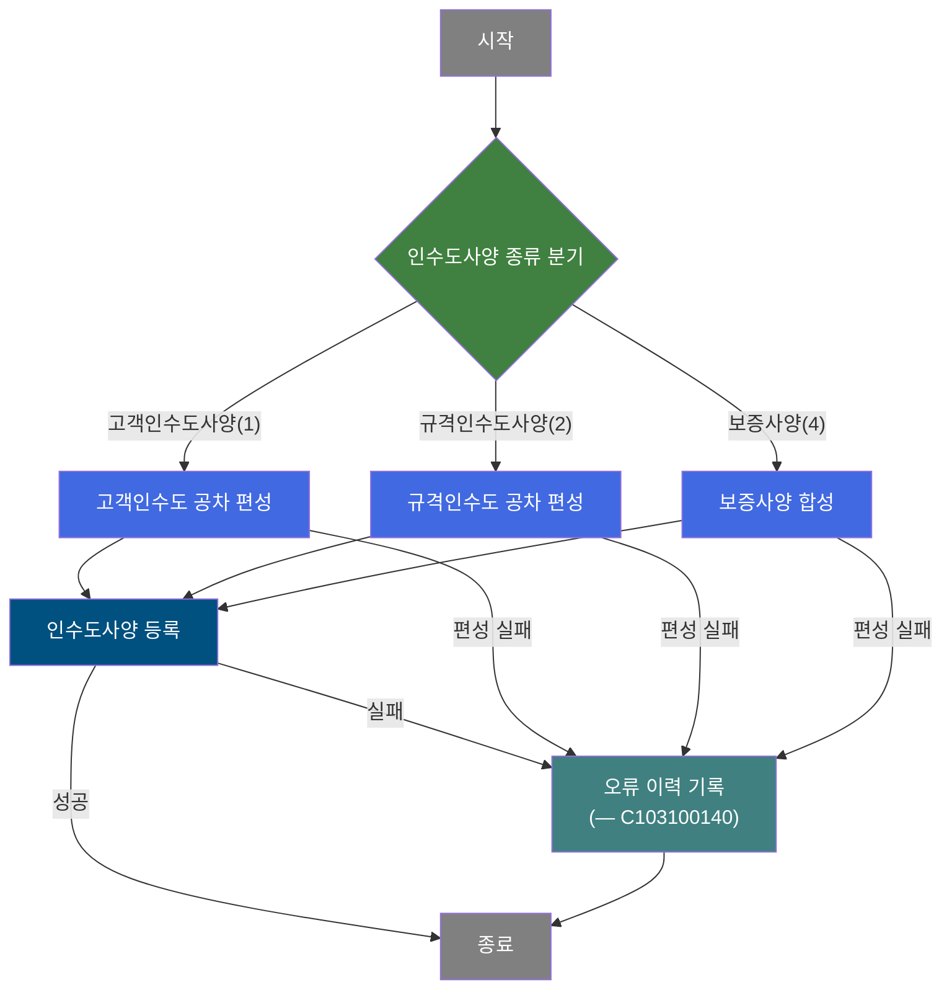
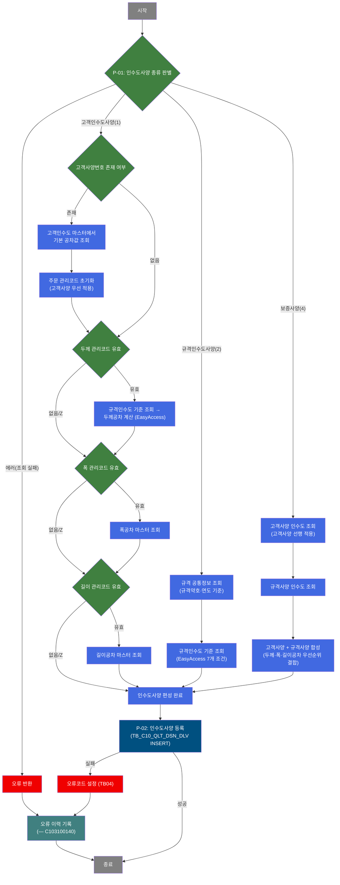
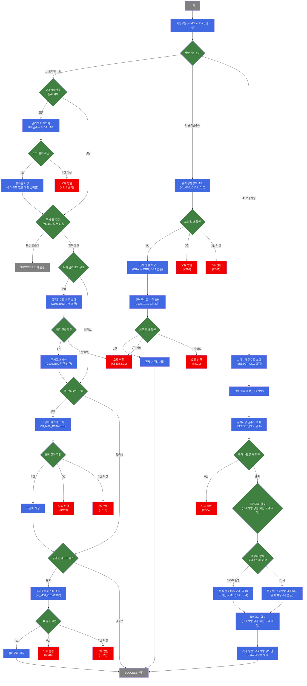

# C102100060 비즈니스 프로세스 분석서 (BPA)

## 1. 시스템 개요

| 항목 | 내용 |
|------|------|
| 서비스 ID | C102100060 |
| 업무명 | 품질설계 인수도사양 편성 및 등록 |
| 서비스 타입 | nui |
| 분석 일시 | 2026-03-21 (KST) |
| 원본 분석일 | 2026-03-16 |
| 문서 버전 | 1.0 |

---

## 2. 시스템 목적

이 서비스는 품질설계 배치(NUI) 프로세스에서 주문별 인수도사양(납품 검사 기준 공차)을 결정하고 MES 데이터베이스에 등록하는 자동화 업무를 수행한다. 인수도사양이란 두께·폭·길이의 허용 오차 범위로, 실제 납품 시 합격/불합격 판정의 기준이 된다.

사양의 종류에 따라 세 가지 편성 경로를 지원한다. 고객인수도사양(1)은 특정 고객과 별도로 합의된 공차 기준을 적용하며, 규격인수도사양(2)은 KS·JIS 등 공개 표준 규격에 근거하고, 보증사양(4)은 고객사양과 규격사양을 합성하여 더 엄격한 기준을 채택한다. 사양 구분은 서비스 호출 시 외부에서 결정되어 주입된다.

품질설계 배치 흐름에서 인수도사양 결정이 완료되면 그 결과를 즉시 MES 인수도사양 이력 테이블에 INSERT하여 후속 공정(검사·판정 등)에서 활용할 수 있게 한다. 인수도사양 편성 또는 등록 중 오류가 발생하면 오류 처리 전용 서브서비스(C103100140)를 통해 오류 이력이 기록된다.

---

## 3. 핵심 워크플로우

---

## 4. 상세 워크플로우

### 프로세스 흐름도 — 인수도사양 편성 (P-01, P-02, P-03, P-04)

---

## 5. 비즈니스 로직 상세

P-01: 인수도사양 편성 — 사양 종류별 공차 기준 결정

- **입력**: 주문 정보(주문번호/행번), 사양구분(1/2/4), 고객사양번호, 두께·폭·길이 관리코드, 규격약호·연도, 제품형태·품명코드 등
- **처리**:
  1. 사양구분(1/2/4)에 따라 세 가지 경로로 분기
  2. **고객인수도사양(1)**: 고객사양번호가 있으면 고객인수도 마스터(VI_M00_C10A1023)에서 기본 공차를 조회하고 관리코드를 초기화. 이후 두께 관리코드가 유효하면 규격인수도 기준(C10B1013)과 공차 계산(C10B2180)으로 두께공차를 산출. 폭·길이 관리코드가 유효하면 각각의 마스터 뷰(VI_M00_C10A2181, VI_M00_C10A2182)에서 공차를 조회. 관리코드가 모두 없거나 'Z'이면 마스터 미적용으로 조기 완료.
  3. **규격인수도사양(2)**: 규격 공통정보(VI_M00_C10A1010)를 규격약호·연도로 조회하고 등급(GRA) 컬럼을 ORD_GRA로 변환 저장. 이어서 규격인수도 기준(C10B1013)으로 공차 기준값 결정.
  4. **보증사양(4)**: 고객사양과 규격사양을 각각 조회 후 합성. 고객사양 우선 원칙에 따라 고객사양값이 없는 항목만 규격사양으로 보완. 두께·길이 공차는 더 넓은(큰) 값 채택. 폭 공차의 경우 품명 E/C/D(아연도금계)는 상한에 더 엄격한(작은) 값을 채택.
- **출력**: 두께/폭/길이 공차 상하한, 파형 높이, 광택도, 대각선 편차 등 인수도사양 항목들을 Context에 적재
- **예외**:
  - 고객인수도 중복 조회(결과 2건 이상) → 오류(ERRCD_KS18) 반환
  - 규격인수도 기준 미존재 → 오류(ERRCD_KS30) 반환
  - 규격인수도 기준 중복 → 오류(ERRCD_KS21) 반환
  - 폭·길이공차 미존재(결과 0건) → 각각 오류(ERRCD_KS09, ERRCD_KS10) 반환
  - 규격 공통정보 미존재 → 오류(ERRCD_KS01) 반환
  - 규격사양(kind=4) 미존재 → 오류(ERRCD_KS24) 반환
  - 모든 실패 → C103100140 오류 처리 서브서비스 호출

P-02: 인수도사양 등록 — MES 인수도사양 이력 저장

- **입력**: P-01에서 편성된 인수도사양 항목(주문번호, 주문행번, 사양구분, 두께/폭/길이 공차 상하한, 파형 높이, 광택도, 대각선 편차, 계단수, 허용오차 등)
- **처리**:
  1. 편성된 17개 항목의 인수도사양을 MES 인수도사양 테이블(TB_C10_QLT_DSN_DLV)에 INSERT
  2. Audit 처리(등록자/시각 자동 기록) 포함
- **출력**: TB_C10_QLT_DSN_DLV에 신규 인수도사양 레코드 저장
- **예외**: INSERT 실패 시 오류코드(TB04)를 설정하고 오류 이력 서브서비스(C103100140) 호출

---

## 6. 커스텀 클래스 워크플로우

### DbSearchDeliSpec (약 693줄)

**역할**: 사양구분(고객인수도/규격인수도/보증사양)에 따라 마스터 데이터를 조회·합성하여 인수도 공차를 결정하는 핵심 편성 클래스

---

## 7. 주요 유즈케이스

UC-01: 품질설계 배치 처리 중 고객인수도사양 편성

- **Actor**: 품질설계 배치 프로세스(NUI)
- **목적**: 고객과 합의된 별도 공차 기준을 적용하여 인수도사양을 확정하고 MES에 등록
- **주요 흐름**:
  1. 배치 프로세스가 주문 정보와 함께 사양구분=1로 서비스 호출
  2. 고객사양번호가 존재하면 고객인수도 마스터에서 기본 공차 조회
  3. 두께·폭·길이 관리코드 유효성에 따라 규격인수도 기준 또는 마스터 뷰로 공차를 산출
  4. 최종 공차값을 MES 인수도사양 테이블에 등록
- **예외**: 관리코드에 대응하는 마스터 데이터 미존재 또는 중복 시 오류 처리 서브서비스 호출

UC-02: 품질설계 배치 처리 중 보증사양 편성

- **Actor**: 품질설계 배치 프로세스(NUI)
- **목적**: 고객사양과 규격사양을 합성하여 더 엄격한 기준의 보증 공차를 확정하고 MES에 등록
- **주요 흐름**:
  1. 배치 프로세스가 주문 정보와 함께 사양구분=4로 서비스 호출
  2. 해당 주문의 고객사양 인수도와 규격사양 인수도를 각각 조회
  3. 항목별로 합성: 고객사양 우선, 없으면 규격사양 적용. 폭 상한은 아연도금계(E/C/D) 품명에 한해 더 엄격한(작은) 값 채택
  4. 합성된 보증 공차를 MES 인수도사양 테이블에 등록
- **예외**: 규격사양 인수도 미존재 시 오류(ERRCD_KS24) 반환 및 오류 이력 기록

UC-03: 인수도사양 등록 실패 시 오류 이력 기록

- **Actor**: 품질설계 배치 프로세스(NUI)
- **목적**: 인수도사양 편성 또는 등록 중 발생한 오류를 추적 가능하도록 이력에 기록
- **주요 흐름**:
  1. 인수도사양 편성(P-01) 또는 등록(P-02) 중 오류 발생
  2. 등록 실패인 경우 오류코드(TB04) 설정 후 오류 처리 서브서비스(C103100140) 호출
  3. 서브서비스가 오류 이력을 기록하고 처리 종료
- **예외**: 오류 처리 서브서비스(C103100140)는 현재 트랜잭션 내에서 실행

---

## 9. 관련 엔티티

### 엔티티 목록

| 엔티티(테이블/뷰) | 설명 | 사용 유형 |
|-----------------|------|----------|
| TB_C10_QLT_DSN_DLV | 품질설계 인수도사양 이력 테이블 | 저장(INSERT) |
| VI_M00_C10A1023 | 고객인수도 공차 마스터 뷰 (고객사양번호 기준) | 조회 |
| VI_M00_C10A2181 | 폭공차 마스터 뷰 (폭관리코드 기준) | 조회 |
| VI_M00_C10A2182 | 길이공차 마스터 뷰 (길이관리코드 기준) | 조회 |
| VI_M00_C10A1010 | 규격 공통정보 뷰 (규격약호·연도 기준) | 조회 |
| C10B1013 | 규격인수도 기준 EasyAccess (7개 조건 → 공차 기준값) | 조회 |
| C10B2180 | 두께공차 계산 EasyAccess (관리코드 → 상한/하한) | 조회 |

### 엔티티 간 관계
- TB_C10_QLT_DSN_DLV는 주문번호·주문행번을 기준으로 주문 엔티티와 연결되며, 본 서비스에서 인수도사양 결정 결과가 최종 INSERT됨
- VI_M00_C10A1023, VI_M00_C10A2181, VI_M00_C10A2182, VI_M00_C10A1010은 M00APUSER 스키마의 마스터 뷰로, 공차 기준값 조회에 사용됨
- C10B1013, C10B2180은 EasyAccess 정의 기반 계산 모듈로, 규격인수도 기준 및 두께공차 산출에 사용됨

---

## 10. 서브서비스

| 서비스 ID | 설명 | 호출 시점 | 트랜잭션 | BPA 문서 |
|-----------|------|---------|---------|---------|
| C103100140 | 품질설계 오류 이력 기록 | 인수도사양 편성(P-01) 실패 또는 등록(P-02) 실패 시 | 공유(현재 트랜잭션 내) | 미작성 |

---

## 11. 특이사항 및 주의사항

### 1. 보증사양 폭 상한 강화 로직 (2024.06.13 변경)
아연도금계 품명(E·C·D)에 대해 폭 상한은 고객사양과 규격사양 중 더 작은(엄격한) 값을 채택한다. 이는 아연도금강판의 폭 치수 품질 강화를 위한 업무 규칙 변경으로, 일반 품명과 다른 합성 로직이 적용된다. 코드 유지보수 시 품명별 분기 조건(E/C/D 코드 목록)을 반드시 확인해야 한다.

### 2. 길이공차 저장 조건 버그 의심 (라인 389)
고객인수도사양(kind=1) 처리에서 길이공차를 Context에 저장하는 내부 조건문에 `ord_lth_mng_cd` 대신 `ord_wth_mng_cd`(폭 관리코드)가 사용되고 있다. 폭 관리코드는 없고 길이 관리코드만 유효한 주문의 경우 길이공차 저장이 누락될 수 있다. 향후 수정 검토가 필요하다.

### 3. 관리코드 'Z' 특수 처리
두께·폭·길이 관리코드가 'Z'이면 SPACE와 동일하게 "조정 없음"으로 취급하여 해당 치수의 공차 마스터를 조회하지 않는다. 이 값은 주문 입력 시 조정 불필요를 명시적으로 표시하는 코드이며, 공차 편성 로직 전체에서 일관되게 적용된다.

### 4. 동일 클래스의 다중 사양 처리
DbSearchDeliSpec 클래스 하나가 고객인수도(1)/규격인수도(2)/보증사양(4) 세 가지 처리 경로를 모두 담당한다. 서비스 XML의 `prodSpecKind` 프로퍼티 값에 따라 분기되므로, 동일 서비스를 서로 다른 프로퍼티 설정으로 재사용하는 구조이다. 현재 이 서비스는 `prodSpecKind=1`(고객인수도사양)로 설정되어 있다.

### 5. 오류 처리 전략
인수도사양 편성 오류와 등록 오류를 구분하여 처리한다. 편성 오류는 DbSearchDeliSpec에서 FAILURE를 반환하면 즉시 SUBSERVICE_ERR로 이행되고, 등록 오류(INSERT 실패)는 ERROR_LOG 단계에서 오류코드 TB04를 설정한 후 동일 서브서비스를 호출한다. 두 경우 모두 C103100140이 오류 이력을 기록하며, 트랜잭션은 현재 컨텍스트를 공유한다.
