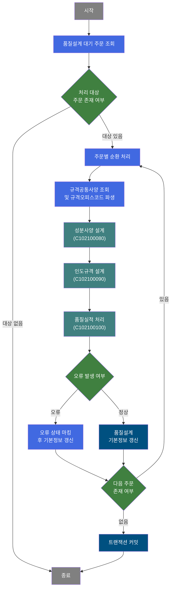
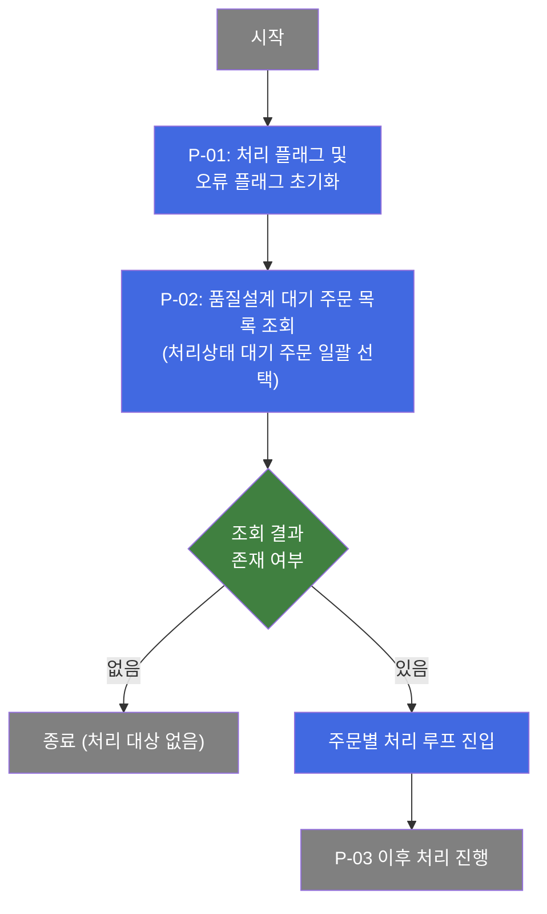
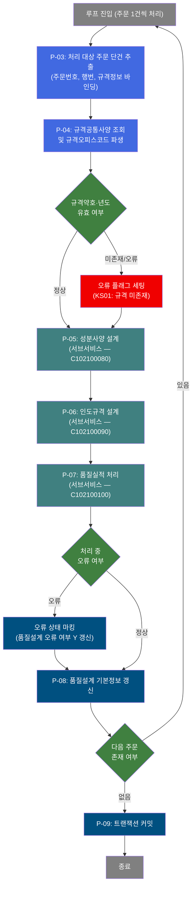
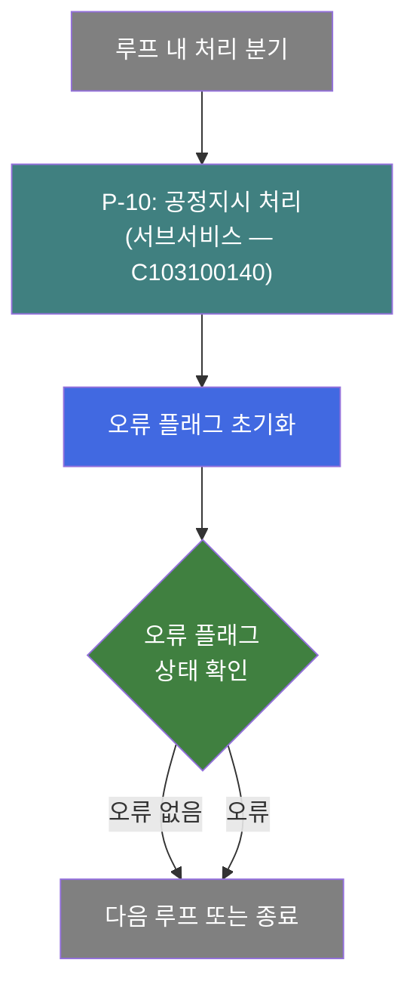

# C102100070 비즈니스 프로세스 분석서 (BPA)

## 1. 시스템 개요

| 항목 | 내용 |
|------|------|
| 서비스 ID | C102100070 |
| 업무명 | 품질설계 규격사양 자동 설계 처리 (배치) |
| 서비스 타입 | nui |
| 분석 일시 | 2026-03-21 (KST) |
| 원본 분석일 | 2026-03-16 |
| 문서 버전 | 1.0 |

---

## 2. 시스템 목적

본 서비스는 품질설계 처리 대기 상태에 있는 주문 코일을 일괄 조회하여, 각 주문 코일에 대해 규격사양 정보를 자동으로 산출·등록하는 배치(NUI) 프로세스이다. 주문의 규격약호와 규격년도를 기반으로 마스터 규격공통사양을 조회하고, 규격 기관(오피스) 코드를 파생 계산한 뒤, 성분사양(CHM), 인도규격(MQL), 실적처리(DLV) 등 하위 품질설계 항목을 순차적으로 생성한다.

처리 대상 주문에 대해 규격 설계 오류 여부를 판별하고, 이상이 없는 경우 품질설계 기본정보(규격명, 규격full명, 비중, 인수도규격, 규격기관 등)를 갱신하는 방식으로 동작한다. 처리 중 오류가 발생한 주문은 오류 플래그로 기록되어 기본정보 갱신 전에 오류 상태로 마킹된다.

이 서비스는 제철소 MES 시스템에서 신규 주문 코일의 품질 규격을 자동으로 설계·확정하는 핵심 배치 업무를 담당하며, 성분사양 설계(C102100080), 인도규격 설계(C102100090), 품질실적 처리(C102100100), 그리고 공정지시 관련 처리(C103100140) 서비스와 연계하여 품질설계 사이클을 완성한다.

---

## 3. 핵심 워크플로우

---

## 4. 상세 워크플로우

### 프로세스 흐름도 — 품질설계 대기 주문 조회 및 루프 초기화 (P-01, P-02)

### 프로세스 흐름도 — 주문별 품질설계 처리 루프 (P-03, P-04, P-05, P-06, P-07)

### 프로세스 흐름도 — 공정지시 연동 (P-10) (루프 내, 별도 분기)

> 본 서비스에는 `C103100140-service` 서브서비스를 호출하는 단계(SUBSERVICE)가 포함되어 있으나, 서비스 흐름상 오류 확인(ROUTER_CHK_ERR) 이후 SET_PARAM2를 통해 오류 플래그를 초기화하는 방식으로 연결된다. 이 단계는 처리 오류 여부와 무관하게 공정지시 처리(C103100140)를 병행 호출하는 구조이다.

---

## 5. 비즈니스 로직 상세

P-01: 처리 플래그 초기화 — 배치 처리 진입 전 상태 변수 초기화

- **입력**: 없음 (시스템 내부 플래그)
- **처리**:
  1. 처리 구분 플래그를 초기 상태(C: 처리 중)로 설정
  2. 오류 플래그를 정상 상태(N)로 초기화
- **출력**: 내부 처리 상태 플래그
- **예외**: 해당 없음

P-02: 품질설계 대기 주문 조회 — TB_C10_QLT_DSN_CMN에서 처리 대기 주문 일괄 선택

- **입력**: 품질설계공통 엔티티(TB_C10_QLT_DSN_CMN)
- **처리**:
  1. 품질설계 처리상태가 대기인 주문 전체를 조회
  2. 주문번호, 행번, 규격정보(규격약호, 규격년도, 제품형상, 제품명코드, 두께/폭/길이 등) 포함
- **출력**: 처리 대상 주문 목록 (ResultSet)
- **예외**: 조회 결과 없음 → 처리 없이 종료

P-03: 처리 대상 주문 단건 추출 — 루프 카운터 기반 주문 단건 바인딩

- **입력**: P-02에서 조회된 주문 목록 ResultSet, 루프 카운터(처리 잔여 건수)
- **처리**:
  1. 루프 최초 진입 시 전체 건수로 카운터 초기화
  2. 역방향 카운터에서 순방향 인덱스 계산으로 현재 처리 대상 행 결정
  3. 해당 주문의 주문번호, 행번, 규격약호, 규격년도, 제품형상, 치수 등 컨텍스트에 바인딩
  4. 루프 카운터 감소
  5. 카운터가 0이면 루프 종료 신호 반환
- **출력**: 단건 주문 처리 컨텍스트, 갱신된 루프 카운터
- **예외**: ResultSet 키 미존재 또는 바인딩 파라미터 미설정 → 처리 실패

P-04: 규격공통사양 조회 및 규격오피스코드 파생 — 마스터 규격 뷰에서 사양 확인

- **입력**: 현재 주문의 규격약호(SPC_AVR), 규격년도(SPC_YR), 품질설계사양구분(고정값 2)
- **처리**:
  1. 규격약호·규격년도 중 하나라도 없으면 오류 플래그 세팅(KS01: 규격 미존재)
  2. 마스터 DB(M00APUSER)의 규격공통사양 뷰(VI_M00_C10A1010)에서 단건 조회
  3. 규격약호 앞 2자리를 규격오피스코드(SPC_OFC)로 파생
  4. 품질설계사양구분(QLT_DSN_SPC_TP)을 컨텍스트에 전파
- **출력**: 규격오피스코드, 품질설계사양구분, 오류 플래그
- **예외**: 규격약호·년도 미존재 → 오류 플래그(P_ERR_KEY=Y) 세팅 후 계속 진행 (즉시 중단하지 않음)

P-05: 성분사양 설계 — 서브서비스 C102100080 호출

- **입력**: 현재 주문 컨텍스트 (주문번호, 행번, 규격 정보)
- **처리**:
  1. 성분사양 설계 서브서비스(C102100080) 호출
  2. 동일 트랜잭션 내에서 성분사양 설계 처리 수행
- **출력**: 성분사양 설계 결과 (서브서비스 내부 처리)
- **예외**: 서브서비스 오류 → 오류 플래그 전파

P-06: 인도규격 설계 — 서브서비스 C102100090 호출

- **입력**: 현재 주문 컨텍스트, P-05 처리 결과
- **처리**:
  1. 인도규격 설계 서브서비스(C102100090) 호출
  2. 동일 트랜잭션 내에서 인도규격 관련 설계 처리 수행
- **출력**: 인도규격 설계 결과 (서브서비스 내부 처리)
- **예외**: 서브서비스 오류 → 오류 플래그 전파

P-07: 품질실적 처리 — 서브서비스 C102100100 호출

- **입력**: 현재 주문 컨텍스트, P-05/P-06 처리 결과
- **처리**:
  1. 품질실적 처리 서브서비스(C102100100) 호출
  2. 동일 트랜잭션 내에서 품질실적 관련 처리 수행
- **출력**: 품질실적 처리 결과 (서브서비스 내부 처리)
- **예외**: 서브서비스 오류 → 오류 플래그 전파

P-08: 품질설계 기본정보 갱신 — TB_C10_QLT_DSN_CMN에 규격설계 결과 저장

- **입력**: 오류 플래그 상태, 현재 주문의 규격설계 결과 (규격명, 규격full명, 비중, 인수도규격, 규격기관 등)
- **처리**:
  1. 오류 플래그가 Y인 경우: 품질설계 오류 여부(QLT_DSN_ERR_YN=Y) 갱신 후 기본정보 갱신 진행
  2. 오류 플래그가 N인 경우: 기본정보 갱신만 진행
  3. TB_C10_QLT_DSN_CMN 엔티티에 규격명, 규격full명, 비중, 인수도규격, 규격기관, 주문등급 등 갱신
  4. 변경이력(이력 타입, 이력 ID, 프로그램 ID, 타임스탬프) 자동 기록
- **출력**: TB_C10_QLT_DSN_CMN 갱신
- **예외**: 갱신 실패 시 트랜잭션 전체 롤백 대상

P-09: 트랜잭션 커밋 — 전체 처리 결과 확정

- **입력**: 전체 루프 처리 완료 상태, 오류 플래그
- **처리**:
  1. 오류 플래그 최종 확인
  2. 트랜잭션 커밋 수행 (모든 주문의 품질설계 결과 확정)
- **출력**: DB 변경사항 영구 반영
- **예외**: 오류 발생 시 트랜잭션 롤백

P-10: 공정지시 처리 — 서브서비스 C103100140 호출

- **입력**: 현재 주문 처리 컨텍스트
- **처리**:
  1. 공정지시 처리 서브서비스(C103100140) 호출
  2. 처리 완료 후 오류 플래그 N으로 초기화 (이후 루프 처리를 위한 상태 리셋)
  3. 오류 여부 라우팅 확인 후 다음 단계 진행
- **출력**: 공정지시 처리 결과 (서브서비스 내부 처리)
- **예외**: 서브서비스 오류 발생해도 오류 플래그 리셋 후 계속 진행

---

## 6. 커스텀 클래스 워크플로우

### DbSearchCmnData (약 118줄)

**역할**: 품질설계 루프 내에서 현재 처리 주문의 규격약호·규격년도를 기반으로 마스터 규격공통사양 뷰를 조회하고, 규격오피스코드를 파생 계산하여 컨텍스트에 적재하는 액티비티. 200줄 미만으로 Mermaid 대상 아님.

**주요 처리 내용**:
- 규격약호(SPC_AVR) 앞 2자리에서 규격오피스코드(SPC_OFC) 파생
- 규격약호·규격년도 미존재 시 오류 플래그(KS01) 세팅 후 계속 진행 (중단하지 않음)
- M00APUSER.VI_M00_C10A1010 뷰 조회 (읽기 전용)
- 파라미터 인덱스 중복 세팅 가능성(버그) 존재 — 운영 시 주의 필요

### DbQualDesignLoop (약 171줄)

**역할**: 품질설계 대기 주문 ResultSet을 1건씩 순차 순환 처리하기 위한 루프 제어 액티비티. 처리 잔여 건수 카운터를 관리하며, 0이 되면 루프 종료 신호를 반환. 200줄 미만으로 Mermaid 대상 아님.

**주요 처리 내용**:
- 역방향 카운터 기반으로 현재 처리 Row의 순방향 인덱스 계산
- 매 루프마다 ResultSet 전체 재탐색 방식 (건수 많을수록 O(n²) 성능 특성)
- 매 루프 진입 시 오류 플래그(P_ERR_KEY), 품질설계 오류 여부(QLT_DSN_ERR_YN) 초기화
- C1021000xx, B10R/B10S 등 40개 이상 서비스에서 공유 사용하는 범용 컴포넌트

---

## 7. 주요 유즈케이스

UC-01: 품질설계 대기 주문 일괄 자동 설계

- **Actor**: 배치 스케줄러 (자동 기동)
- **목적**: 품질설계 처리 대기 상태의 주문 코일 전체에 대해 규격사양을 자동 산출하고 설계 결과를 저장
- **주요 흐름**:
  1. 품질설계 처리상태 대기 주문을 전체 조회
  2. 각 주문에 대해 마스터 규격공통사양 조회 및 규격오피스코드 파생
  3. 성분사양, 인도규격, 품질실적 처리를 순차 서브서비스로 실행
  4. 처리 결과(규격명, 비중, 인수도규격 등)를 품질설계 기본정보에 갱신
  5. 전체 처리 완료 후 트랜잭션 커밋
- **예외**: 규격약호·년도 미존재 주문은 오류 상태로 마킹 후 계속 처리

UC-02: 규격 오류 주문 오류 상태 마킹

- **Actor**: 배치 스케줄러 (자동 기동)
- **목적**: 규격 정보 누락 또는 하위 서브서비스 처리 실패 주문을 오류 상태로 식별하여 후속 수동 처리 대상으로 분류
- **주요 흐름**:
  1. 루프 처리 중 오류 플래그(P_ERR_KEY=Y) 발생 확인
  2. 품질설계공통 엔티티에 오류 여부(QLT_DSN_ERR_YN=Y) 갱신
  3. 오류 마킹 후에도 기본정보 갱신은 계속 수행
- **예외**: 오류 마킹 실패 시 트랜잭션 전체 롤백

UC-03: 성분·인도규격·실적 연계 처리

- **Actor**: 배치 스케줄러 (C102100070 호출 시 자동 연계)
- **목적**: 품질설계 기본정보 설계와 함께 성분사양(C102100080), 인도규격(C102100090), 품질실적(C102100100) 설계를 단일 배치 실행으로 일괄 처리
- **주요 흐름**:
  1. 주문별 규격 컨텍스트 준비 완료 후 성분사양 서브서비스 호출
  2. 성분사양 완료 후 인도규격 서브서비스 호출
  3. 인도규격 완료 후 품질실적 처리 서브서비스 호출
  4. 세 서브서비스 완료 후 오류 여부 종합 판별
- **예외**: 임의 서브서비스 오류 시 오류 플래그로 전파, 해당 주문 오류 상태 처리

---

## 9. 관련 엔티티

### 엔티티 목록

| 엔티티(테이블/뷰) | 설명 | 사용 유형 |
|------------------|------|----------|
| TB_C10_QLT_DSN_CMN | 품질설계공통 — 주문별 품질설계 기본정보 및 처리상태 관리 | 조회/갱신 |
| VI_M00_C10A1010 (M00APUSER) | 규격공통사양 마스터 뷰 — 규격약호·규격년도 기반 규격공통사양 제공 | 조회 |

### 엔티티 간 관계
- TB_C10_QLT_DSN_CMN은 주문번호(ORD_NO)·주문행번(ORD_LN)을 기본키로 품질설계 처리 상태와 설계 결과를 통합 관리하는 중심 엔티티이다.
- VI_M00_C10A1010은 M00APUSER 스키마의 마스터 규격 뷰로, TB_C10_QLT_DSN_CMN의 규격약호(SPC_AVR)·규격년도(SPC_YR)를 키로 단건 조회하여 규격공통사양 정보를 제공한다.
- 성분사양, 인도규격, 실적 관련 엔티티는 각 서브서비스(C102100080, C102100090, C102100100) 내부에서 관리된다.

---

## 10. 서브서비스

| 서비스 ID | 설명 | 호출 시점 | 트랜잭션 | BPA 문서 |
|-----------|------|---------|---------|---------|
| C102100080 | 성분사양 설계 처리 | P-05: 규격공통사양 조회 완료 후, 루프 내 각 주문에 대해 호출 | 공유 (동일 트랜잭션) | 미작성 |
| C102100090 | 인도규격 설계 처리 | P-06: 성분사양 설계 완료 후 연계 호출 | 공유 (동일 트랜잭션) | 미작성 |
| C102100100 | 품질실적 처리 | P-07: 인도규격 설계 완료 후 연계 호출 | 공유 (동일 트랜잭션) | 미작성 |
| C103100140 | 공정지시 처리 | P-10: 루프 내 처리 분기에서 호출 | 공유 (동일 트랜잭션) | 미작성 |

---

## 11. 특이사항 및 주의사항

### 1. 루프 제어 클래스의 O(n²) 성능 특성
DbQualDesignLoop 클래스는 매 루프 반복마다 ResultSet을 처음부터 전체 재탐색하는 방식으로 동작한다. 처리 건수가 N건일 경우 최대 N*(N+1)/2 회 탐색이 발생하므로, 처리 대기 주문이 대량으로 쌓일 경우 배치 처리 시간이 급격히 증가할 수 있다. 100건 처리 시 최대 5,050회, 1,000건 시 약 500,500회 탐색이 발생한다.

### 2. 오류 발생 시 중단 없이 계속 처리 전략
규격약호·년도 미존재 등 개별 주문의 오류 발생 시 즉시 처리를 중단하지 않고, 오류 플래그(P_ERR_KEY=Y)와 오류코드를 컨텍스트에 기록한 뒤 계속 진행한다. 이 설계로 인해 일부 주문에 오류가 있어도 나머지 주문의 품질설계 처리가 정상 완료된다. 단, 오류 플래그가 Y인 상태로도 성분사양·인도규격·실적 서브서비스가 모두 호출되므로, 각 서브서비스에서도 오류 플래그를 별도 처리하는지 검토가 필요하다.

### 3. DbSearchCmnData 파라미터 인덱스 중복 버그 가능성
DbSearchCmnData 클래스 내부에서 규격공통사양 조회 시 WhereClause 파라미터를 인덱스 0에 두 번 세팅하는 코드가 존재한다. 이로 인해 두 번째 세팅값이 첫 번째를 덮어써서 실질적으로 규격년도(SPC_YR) 대신 규격약호(SPC_AVR)만 바인딩될 수 있다. SQL 쿼리가 두 파라미터를 요구할 경우 잘못된 조회 결과 또는 조회 실패가 발생할 수 있으므로 검증이 필요하다.

### 4. 4개 서브서비스 연쇄 호출 구조
단일 주문 처리에 성분사양(C102100080), 인도규격(C102100090), 품질실적(C102100100), 공정지시(C103100140)까지 4개 서브서비스가 순차 호출된다. 이 중 하나라도 장시간 처리 또는 락 경합이 발생하면 전체 배치 처리 시간에 직접 영향을 미친다. 서브서비스 간 트랜잭션은 동일 트랜잭션으로 공유되므로, 특정 서브서비스 실패 시 전체 주문 건에 대한 롤백이 발생할 수 있다.

### 5. 배치 진입 시 BATCH_JOB 플래그 전파
DbQualDesignLoop는 매 루프 진입 시 BATCH_JOB="true" 플래그를 컨텍스트에 세팅한다. 이 플래그는 후속 서브서비스(성분사양, 인도규격 등)에서 UI 호출과 배치 호출을 구분하는 용도로 사용될 수 있다. 서브서비스 수정 시 이 플래그의 의미와 활용 방식을 사전 확인해야 한다.
