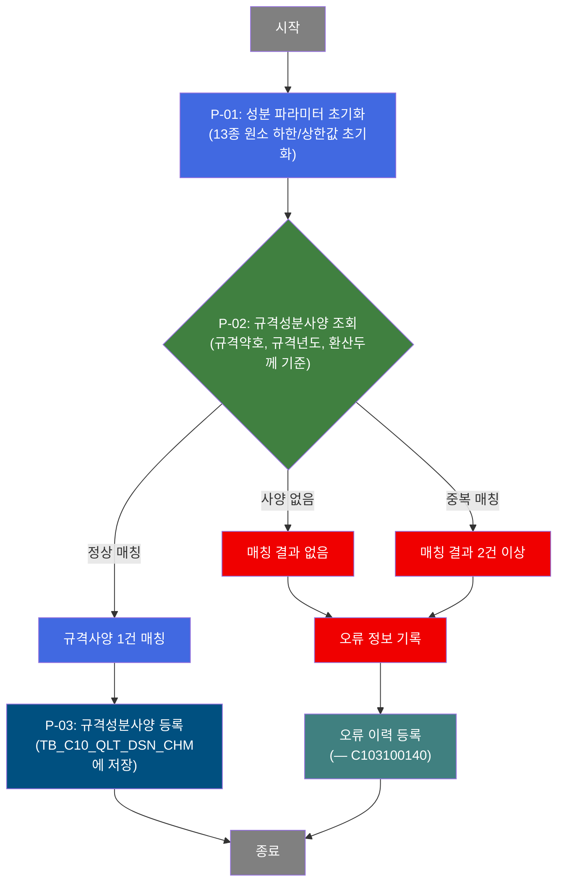
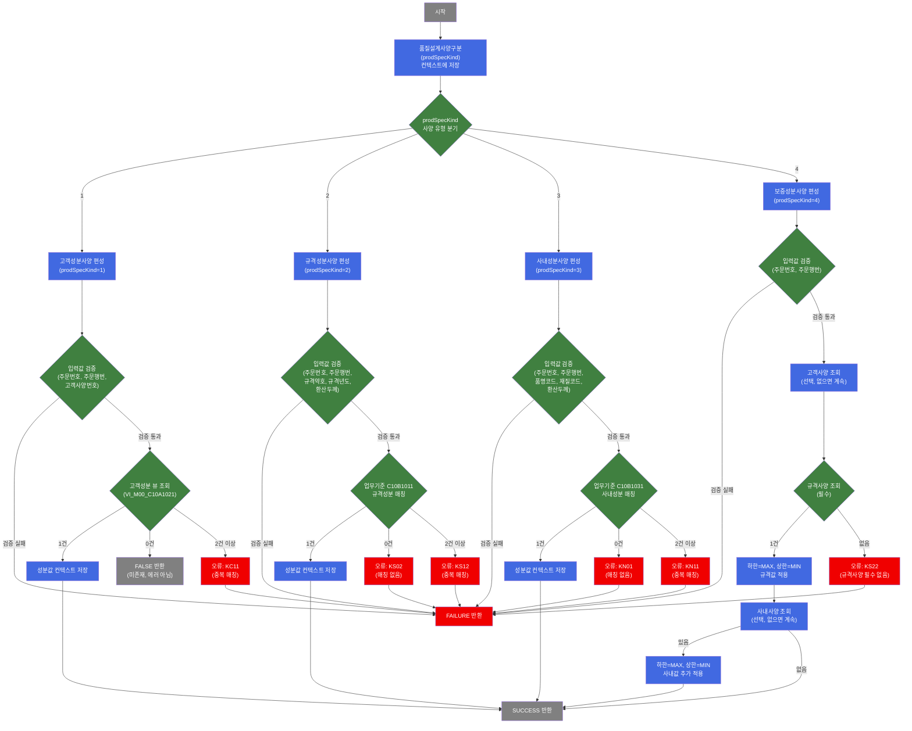

# C102100080 비즈니스 프로세스 분석서 (BPA)

## 1. 시스템 개요

| 항목 | 내용 |
|------|------|
| 서비스 ID | C102100080 |
| 업무명 | 규격성분사양 편성 |
| 서비스 타입 | nui |
| 분석 일시 | 2026-03-21 (KST) |
| 원본 분석일 | 2026-03-16 |
| 문서 버전 | 1.0 |

---

## 2. 시스템 목적

본 서비스는 철강 제품 주문에 대한 **규격성분사양**을 편성하여 품질설계성분 테이블에 등록하는 NUI 배치 프로세스이다. 주문번호·주문행번·규격약호·규격년도·주문환산두께 조건을 바탕으로 표준규격(KS, JIS 등)에 정의된 탄소(C), 규소(Si), 망간(Mn) 등 13개 원소별 성분 하한/상한값을 조회하여 편성한다.

편성된 규격성분사양은 품질설계 전 과정에서 기준값으로 활용되며, 후속 보증성분사양 편성(C102100130) 시 가장 중요한 입력 데이터가 된다. 규격사양이 존재하지 않는 경우 처리를 중단하고 오류를 기록한다.

오류 발생 시에는 서브서비스(C103100140)를 통해 오류 이력을 별도 관리하여 품질설계 이상 내역의 추적 및 사후 조치가 가능하도록 지원한다.

---

## 3. 핵심 워크플로우

> 이 서비스는 단일 업무 프로세스로 구성되어 있어 핵심 워크플로우를 별도로 작성하지 않습니다. **4. 상세 워크플로우**를 참조하세요.

---

## 4. 상세 워크플로우

### 프로세스 흐름도 — 규격성분사양 편성 및 등록 (P-01, P-02, P-03)

---

## 5. 비즈니스 로직 상세

P-01: 성분 파라미터 초기화 — 이전 처리 잔여값 제거

- **입력**: 서비스 실행 컨텍스트 내 이전 성분값 (있을 경우)
- **처리**:
  1. 탄소(C), 규소(Si), 망간(Mn), 인(P), 황(S), 크롬(Cr), 니켈(Ni), 구리(Cu), 알루미늄(Al), 티탄(Ti), 니오브(Nb), 바나듐(V), 질소(N) 등 13종 원소의 하한값(`_LLV`)·상한값(`_ULV`) 총 26개 파라미터를 NULL로 초기화
  2. 이전 서비스 호출에서 남아있을 수 있는 잔여 성분값을 제거하여 순수한 규격사양 값만 이후에 저장되도록 보장
- **출력**: 성분 파라미터 클리어 상태 (컨텍스트)
- **예외**: 없음 (항상 성공)

P-02: 규격성분사양 조회 — 표준규격 기준 성분 범위 결정

- **입력**: 주문번호(`ORD_NO`), 주문행번(`ORD_LN`), 규격약호(`SPC_AVR`), 규격년도(`SPC_YR`), 주문환산두께(`ORD_EXC_THK`)
- **처리**:
  1. 입력 파라미터 Null 검증: `ORD_NO`, `ORD_LN`, `SPC_AVR`, `SPC_YR`, `ORD_EXC_THK` 모두 필수
  2. GLUE EasyAccess 업무기준(C10B1011)에서 규격약호·규격년도·주문환산두께 조합으로 성분 규격 매칭
  3. 매칭 결과 1건이면 13종 원소별 하한/상한값을 컨텍스트에 저장하고 성공 처리
  4. 매칭 결과 0건이면 오류코드(KS02) 설정 후 FAILURE
  5. 매칭 결과 2건 이상이면 오류코드(KS12) 설정 후 FAILURE
- **출력**: 13종 원소 하한값(`_LLV`)·상한값(`_ULV`) 26개 항목 (컨텍스트), 품질설계사양구분(`QLT_DSN_SPC_TP`) = "2"
- **예외**: 결과 없음(KS02) 또는 중복 결과(KS12) → 오류 전이 후 오류 이력 등록 서브서비스 호출

P-03: 규격성분사양 등록 — 품질설계성분 테이블 신규 저장

- **입력**: P-02에서 편성된 13종 원소 하한/상한값, 주문번호, 주문행번, 품질설계사양구분("2")
- **처리**:
  1. `TB_C10_QLT_DSN_CHM` 테이블에 규격성분사양 1건 INSERT
  2. 사양구분("2"), 주문번호, 주문행번, 13종 원소별 하한값·상한값 28개 항목을 동시에 저장
  3. 감사(Audit) 정보(생성자·생성일시·변경자·변경일시) 자동 기록
- **출력**: `TB_C10_QLT_DSN_CHM` 신규 레코드 (규격성분사양 구분 "2")
- **예외**: 중복 키 등 DB 오류 시 트랜잭션 롤백

---

## 6. 커스텀 클래스 워크플로우

### DbSearchChemData (534줄)

**역할**: 품질설계사양구분(prodSpecKind)에 따라 고객/규격/사내/보증 4가지 유형의 성분사양을 조회·편성하는 재사용 액티비티. 본 서비스(C102100080)에서는 `prodSpecKind=2`(규격성분사양) 모드로 동작.

---

## 7. 주요 유즈케이스

UC-01: 규격성분사양 정상 편성 및 등록

- **Actor**: 품질설계 NUI 배치 프로세스
- **목적**: 주문에 대한 표준규격 기준 성분 하한/상한값을 조회하고 품질설계성분 테이블에 저장
- **주요 흐름**:
  1. 이전 잔여 성분값을 초기화
  2. 규격약호·규격년도·주문환산두께를 기준으로 업무기준(C10B1011)에서 성분 규격 단건 매칭
  3. 매칭된 13종 원소 하한/상한값을 `TB_C10_QLT_DSN_CHM`에 규격성분사양("2")으로 INSERT
- **예외**: 업무기준 매칭 결과가 없거나 2건 이상이면 오류 이력 등록 후 종료

UC-02: 규격성분사양 미매칭 오류 처리

- **Actor**: 품질설계 NUI 배치 프로세스
- **목적**: 표준규격 매칭 실패 시 오류 이력을 안전하게 기록하여 사후 추적 가능하도록 처리
- **주요 흐름**:
  1. 규격성분 조회 실패(결과 없음 또는 중복) 발생
  2. 오류 구분코드(KS02/KS12) 및 오류 정보를 설정
  3. 서브서비스 C103100140을 통해 오류 이력 테이블에 등록
- **예외**: 서브서비스 오류 발생 시에도 메인 트랜잭션과 분리된 트랜잭션으로 처리

UC-03: 보증성분사양 편성을 위한 규격성분 기준 제공 (연계)

- **Actor**: 보증성분사양 편성 서비스 (C102100130)
- **목적**: 보증성분사양 편성 시 본 서비스에서 등록한 규격성분사양 레코드를 기준값으로 활용
- **주요 흐름**:
  1. 보증성분사양 편성(C102100130) 실행 시 TB_C10_QLT_DSN_CHM에서 규격사양("2") 조회
  2. 규격 하한값을 보증 하한값의 비교 기준으로 사용 (MAX 비교)
  3. 규격 상한값을 보증 상한값의 비교 기준으로 사용 (MIN 비교, NULL/0 제외)
- **예외**: 본 서비스에서 등록된 규격성분사양이 없으면 보증성분사양 편성 불가(KS22 오류)

---

## 9. 관련 엔티티

### 엔티티 목록

| 엔티티(테이블/뷰) | 설명 | 사용 유형 |
|-----------------|------|----------|
| TB_C10_QLT_DSN_CHM | 품질설계 성분사양 정보 (주문별 사양구분별 13종 원소 하한/상한값 저장) | 저장 |
| VI_M00_C10A1021 | 고객성분사양 뷰 (M00APUSER 스키마, 고객번호 기준 성분범위 제공) | 조회 (DbSearchChemData 내부, prodSpecKind=1 시) |
| C10B1011 (EasyAccess) | 규격성분 판단기준 (규격약호+규격년도+환산두께 → 성분 범위) | 조회 |
| C10B1031 (EasyAccess) | 사내성분 판단기준 (품명코드+재질코드+환산두께 → 성분 범위) | 조회 (DbSearchChemData 내부, prodSpecKind=3/4 시) |

### 엔티티 간 관계

- `TB_C10_QLT_DSN_CHM`는 주문번호·주문행번·품질설계사양구분을 복합키로 가지며, 동일 주문에 대해 고객(1)/규격(2)/사내(3)/보증(4) 4가지 사양구분별 레코드를 별도로 저장한다.
- `VI_M00_C10A1021`은 마스터 DB(M00APUSER)의 뷰로, 고객사양번호를 기준으로 성분 규격 범위를 제공한다. `TB_C10_QLT_DSN_CHM`의 고객사양 레코드 생성 시 소스로 활용된다.
- `C10B1011`, `C10B1031`은 GLUE EasyAccess 업무기준 테이블로, 조건값 매핑을 통해 성분 규격 범위를 반환하며 `TB_C10_QLT_DSN_CHM` 규격/사내 레코드 생성의 소스가 된다.

---

## 10. 서브서비스

| 서비스 ID | 설명 | 호출 시점 | 트랜잭션 | BPA 문서 |
|-----------|------|---------|---------|---------|
| C103100140 | 품질설계 오류 이력 등록 | P-02 규격성분 조회 실패(매칭 없음/중복) 시 오류 정보 기록 | 신규 트랜잭션 | 미작성 |

---

## 11. 특이사항 및 주의사항

### 1. DbSearchChemData의 4중 분기 재사용 설계
`DbSearchChemData` 클래스는 `prodSpecKind` 프로퍼티 값(1~4)에 따라 고객/규격/사내/보증 4가지 성분사양 편성을 하나의 클래스에서 처리한다. 본 서비스(C102100080)는 `prodSpecKind=2`(규격성분사양) 전용으로 동작하며, 동일 클래스가 C102100040(고객), C102100110(사내), C102100130(보증)에서도 각각 다른 모드로 재사용된다. 클래스 수정 시 4개 서비스 모두에 영향을 미치므로 주의가 필요하다.

### 2. 보증성분사양 의존성 — 규격사양 필수 선행 조건
보증성분사양 편성(C102100130)은 반드시 규격성분사양(본 서비스, C102100080) 실행 이후에 수행되어야 한다. `TB_C10_QLT_DSN_CHM`에 규격사양("2") 레코드가 없으면 보증사양 편성 시 KS22 오류가 발생하여 처리가 중단된다. 품질설계 전체 배치 순서 관리에서 이 의존 관계를 반드시 보장해야 한다.

### 3. EasyAccess 업무기준 데이터 관리 중요성
규격성분사양 매칭은 GLUE EasyAccess의 C10B1011 업무기준 테이블을 통해 이루어진다. 규격약호·규격년도·주문환산두께 조합에 대한 매칭 결과가 0건이거나 2건 이상이면 해당 주문의 품질설계가 중단된다. 업무기준 데이터의 완전성·유일성 관리가 서비스 정상 운영의 핵심 조건이다.

### 4. 오류 이력의 트랜잭션 분리
규격성분 조회 실패 시 호출되는 오류 이력 등록 서브서비스(C103100140)는 메인 트랜잭션과 분리된 신규 트랜잭션(`new-transaction: false`으로 되어 있으나 구조상 오류 흐름 전용)으로 처리된다. 메인 처리 실패 시에도 오류 이력은 독립적으로 커밋되어 추적 가능성을 보장한다.

### 5. 성분 파라미터 초기화의 필요성
서비스 시작 시 이전 실행에서 남아있을 수 있는 26개 성분 파라미터를 명시적으로 NULL로 초기화(CLEAR_CHM)한다. 이는 연속 배치 처리 환경에서 이전 주문의 성분값이 다음 주문에 잘못 적용되는 것을 방지하는 안전장치다.
