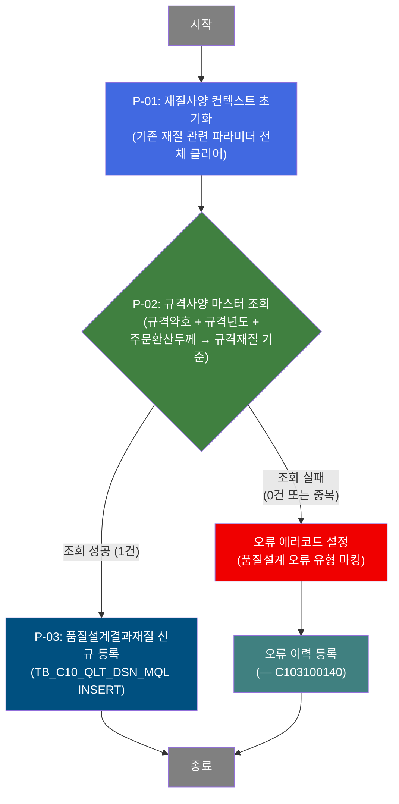
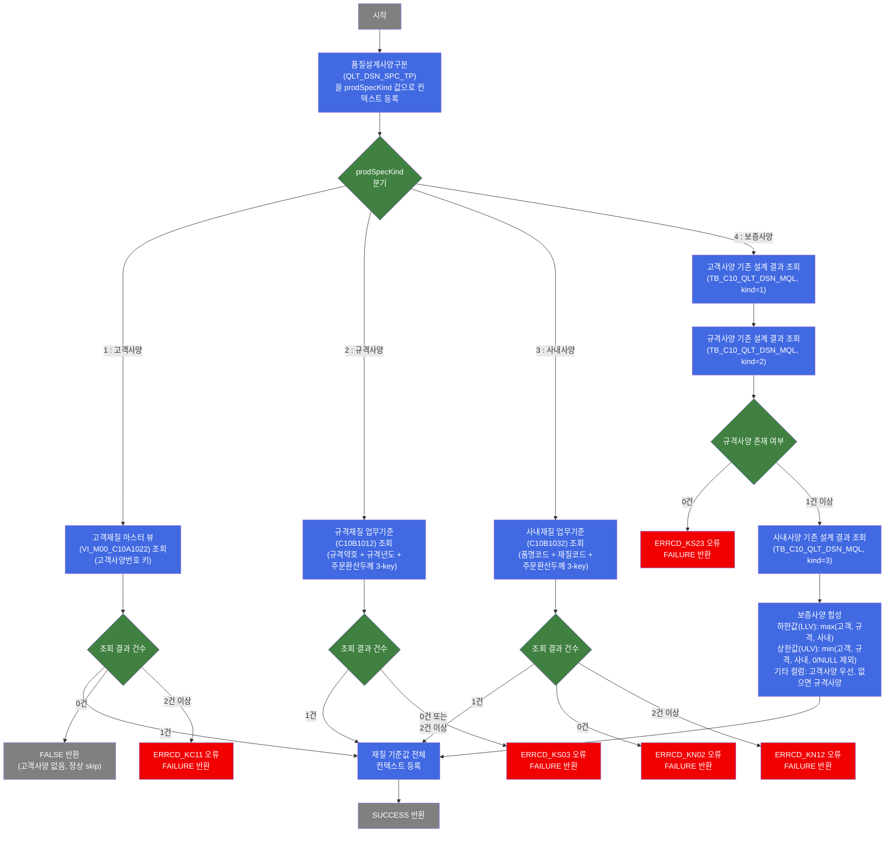

# C102100090 비즈니스 프로세스 분석서 (BPA)

## 1. 시스템 개요

| 항목 | 내용 |
|------|------|
| 서비스 ID | C102100090 |
| 업무명 | 품질설계 재질사양(MQL) 편성 — 규격사양(prodSpecKind=2) |
| 서비스 타입 | nui |
| 분석 일시 | 2026-03-21 (KST) |
| 원본 분석일 | 2026-03-16 |
| 문서 버전 | 1.0 |

---

## 2. 시스템 목적

본 서비스는 동국제강 MES 품질설계 프로세스에서 주문 제품의 재질사양(MQL: Mechanical Quality Level)을 편성하는 배치(NUI) 서비스이다. 규격사양(prodSpecKind=2) 경로를 담당하며, 규격약호·규격년도·주문환산두께를 키로 규격재질 업무기준(C10B1012)을 조회하여 인장강도(TS), 항복점(YP), 연신율(ELGN), 경도(HRB), 탄성계수(ER) 등 재질 시험 기준값을 확정한다.

조회된 재질사양은 품질설계결과재질 테이블(TB_C10_QLT_DSN_MQL)에 신규 등록되며, 후속 품질설계 판정 프로세스가 이 데이터를 기반으로 제품 합격·불합격 여부를 결정한다. 데이터 오류 발생 시에는 서브서비스(C103100140)를 호출하여 오류 이력을 기록하고 처리를 중단한다.

본 서비스는 주문의 품질설계 흐름에서 자동으로 호출되는 비대화형 배치 서비스로, 생산 현장 담당자 또는 시스템 스케줄러에 의해 트리거된다.

---

## 3. 핵심 워크플로우

> 이 서비스는 단일 업무 프로세스로 구성되어 있어 핵심 워크플로우를 별도로 작성하지 않습니다. **4. 상세 워크플로우**를 참조하세요.

---

## 4. 상세 워크플로우

### 프로세스 흐름도 — 규격사양 재질 편성 및 등록 (P-01, P-02, P-03)

---

## 5. 비즈니스 로직 상세

P-01: 재질사양 컨텍스트 초기화 — 재질 관련 파라미터 전체 클리어

- **입력**: 없음 (서비스 시작 시점 컨텍스트 상태)
- **처리**:
  1. 인장강도(TS), 항복점(YP), 연신율(ELGN), 경도(HRB), 탄성계수(ER) 상하한 파라미터 20개를 null로 초기화
  2. 도금량(MQL_BND_TST_STD_CD, TST_PIC_GTH_INST_LOC/LTH) 및 중량 관련 파라미터도 초기화
  3. 이전 서비스 호출 결과가 남아있을 경우 간섭하지 않도록 깨끗한 상태에서 마스터 조회 시작
- **출력**: 컨텍스트 파라미터 초기화 완료
- **예외**: 없음 (항상 성공)

P-02: 규격사양 마스터 조회 — 규격재질 업무기준(C10B1012) 조회

- **입력**: 주문번호(ORD_NO), 주문행번(ORD_LN), 규격약호(SPC_AVR), 규격년도(SPC_YR), 주문환산두께(ORD_EXC_THK)
- **처리**:
  1. 규격약호 + 규격년도 + 주문환산두께 3-key 조합으로 규격재질 업무기준(C10B1012) 조회
  2. 조회 결과가 정확히 1건인 경우 → 인장강도·항복점·연신율·경도·탄성계수·도금량·감지량 등 전체 재질 기준값을 컨텍스트에 등록하고 SUCCESS
  3. 조회 결과가 0건 또는 2건 이상인 경우 → 오류 코드(ERRCD_KS03) 설정 후 FAILURE 반환
  4. 품질설계사양구분(QLT_DSN_SPC_TP)을 prodSpecKind 값(2: 규격사양)으로 설정
- **출력**: 재질 기준값 컨텍스트 등록 또는 오류 코드 설정
- **예외**: 규격사양 미존재(0건) → ERRCD_KS03 오류, FAILURE / 중복 존재(2건 이상) → ERRCD_KS03 오류, FAILURE / EasyAccess 시스템 오류(MasterDataException) → FAILURE

P-03: 품질설계결과재질 신규 등록 — TB_C10_QLT_DSN_MQL INSERT

- **입력**: 주문번호(ORD_NO), 주문행번(ORD_LN), 품질설계사양구분, P-02에서 조회된 재질 기준값 전체 (TS/YP/ELGN/HRB/ER 상하한, 도금량 관련 값 총 23개 파라미터)
- **처리**:
  1. 품질설계결과재질 테이블(TB_C10_QLT_DSN_MQL)에 재질사양 데이터 신규 INSERT
  2. 감사 로그(isAudit=true) 기록 — 등록 시각, 등록자 정보 자동 기입
- **출력**: TB_C10_QLT_DSN_MQL에 재질사양 1건 등록
- **예외**: INSERT 실패 시 트랜잭션 롤백, 상위 서비스에 오류 전파

---

## 6. 커스텀 클래스 워크플로우

### DbSearchMechData (497줄)

**역할**: 제품사양설계종류(prodSpecKind)에 따라 고객사양(1), 규격사양(2), 사내사양(3), 보증사양(4) 4가지 경로로 분기하여 각 마스터 소스에서 재질 기준값을 조회하고 컨텍스트에 등록하는 NUI Activity. 본 서비스(C102100090)에서는 prodSpecKind=2(규격사양) 경로로 실행된다.

---

## 7. 주요 유즈케이스

UC-01: 규격사양 기반 재질사양 자동 편성

- **Actor**: 시스템 스케줄러 / 품질설계 배치 프로세스
- **목적**: 주문의 규격약호·규격년도·두께 조합으로 규격재질 기준을 자동 조회하여 품질설계결과재질에 등록
- **주요 흐름**:
  1. 배치 서비스가 주문번호·주문행번과 함께 규격약호, 규격년도, 주문환산두께를 입력으로 서비스 호출
  2. 재질 파라미터를 초기화하여 이전 처리 결과의 간섭을 방지
  3. 규격재질 업무기준(C10B1012)에서 3-key 조합으로 재질 기준값 1건 조회
  4. 조회된 기준값을 품질설계결과재질 테이블에 신규 등록
- **예외**: 규격재질 기준이 존재하지 않거나 중복인 경우 오류 이력 서브서비스(C103100140)를 통해 오류 기록 후 종료

UC-02: 재질사양 편성 오류 이력 기록

- **Actor**: 시스템 (오류 감지 시 자동 실행)
- **목적**: 재질사양 편성 실패 시 오류 코드와 주문 정보를 품질설계 오류 이력 테이블에 기록하여 추후 재처리 및 원인 분석 지원
- **주요 흐름**:
  1. 규격재질 마스터 조회 실패 감지 (0건 또는 중복)
  2. 오류 유형 코드(TB03) 및 오류 키(P_ERR_KEY=Y) 설정
  3. 서브서비스(C103100140)를 동일 트랜잭션 내에서 호출하여 오류 이력 INSERT
- **예외**: 오류 이력 INSERT 자체 실패 시 상위 트랜잭션 롤백

---

## 9. 관련 엔티티

### 엔티티 목록

| 엔티티(테이블/뷰) | 설명 | 사용 유형 |
|-----------------|------|----------|
| TB_C10_QLT_DSN_MQL | 품질설계결과재질 — 주문별 재질 시험 기준값 저장 | 저장(INSERT), 조회(보증사양 경우) |
| VI_M00_C10A1022 | 고객재질 마스터 뷰 — 고객 납품 사양별 재질 기준 | 조회(고객사양 경로) |

### 업무기준 (EasyAccess)

| 업무기준 ID | 설명 | 사용 유형 |
|------------|------|----------|
| C10B1012 | 규격재질 업무기준 — 규격약호·규격년도·두께별 재질 기준 | 조회(규격사양 경로) |
| C10B1032 | 사내재질 업무기준 — 품명코드·재질코드·두께별 재질 기준 | 조회(사내사양 경로) |

### 엔티티 간 관계
- TB_C10_QLT_DSN_MQL은 주문번호(ORD_NO)와 주문행번(ORD_LN)을 PK로 주문 엔티티와 연결됨
- VI_M00_C10A1022는 M00APUSER(마스터 DB) 스키마 뷰로, 고객사양번호를 키로 TB_C10_QLT_DSN_MQL에 등록될 재질값을 제공
- C10B1012, C10B1032 업무기준은 GLUE EasyAccess를 통해 조회하며, 결과가 TB_C10_QLT_DSN_MQL에 저장됨

---

## 10. 서브서비스

| 서비스 ID | 설명 | 호출 시점 | 트랜잭션 | BPA 문서 |
|-----------|------|---------|---------|---------|
| C103100140 | 품질설계 오류 이력 등록 — 오류 코드와 주문 정보를 오류 이력 테이블에 INSERT | P-02 규격사양 조회 실패 시 | 기존 트랜잭션 공유(new-transaction=false) | 미작성 |

---

## 11. 특이사항 및 주의사항

### 1. 규격사양은 필수 데이터 — 0건도 오류 처리
규격사양(prodSpecKind=2) 경로에서 업무기준(C10B1012) 조회 결과가 0건이면 "사양 없음" 허용 없이 즉시 ERRCD_KS03 오류로 처리한다. 이는 고객사양(prodSpecKind=1)이 0건이면 정상 skip(FALSE 반환)하는 것과 대비되는 설계로, 규격사양을 필수 기준으로 간주하는 업무 정책을 반영한다.

### 2. 보증사양 합성 알고리즘의 엄격성 원칙
보증사양(prodSpecKind=4) 경로에서는 고객·규격·사내 세 소스의 재질값을 합성할 때 "하한값은 가장 높은 기준, 상한값은 가장 낮은 기준"을 적용한다. 이는 세 소스 중 어느 하나라도 더 엄격한 조건을 요구하면 그 기준을 따르는 품질 보증 철학이며, 상한값 합성 시 0값은 "기준 없음"으로 간주하여 제외하는 세부 로직도 포함되어 있다.

### 3. 재질 파라미터 초기화(CLEAR_MQL)의 필요성
서비스 시작 시 반드시 20개 재질 파라미터를 null로 클리어한다. 이 서비스가 더 큰 품질설계 배치 워크플로우에서 반복 호출될 수 있기 때문에, 이전 주문의 재질값이 현재 주문에 잘못 승계되는 것을 방지한다.

### 4. 오류 시 서브서비스(C103100140) 공유 트랜잭션 호출
오류 발생 시 에러 이력 등록 서브서비스(C103100140)를 기존 트랜잭션(new-transaction=false) 내에서 호출한다. 따라서 오류 이력 등록 실패 시 해당 트랜잭션 전체가 롤백될 수 있으며, 오류 이력의 신뢰성이 메인 서비스 트랜잭션과 동일 수준으로 보장된다.

### 5. DbSearchMechData 클래스의 다중 서비스 재사용
DbSearchMechData는 C102100050(고객사양), C102100090(규격사양), C102100120, C102100140 등 여러 서비스에서 공유되며, prodSpecKind 프로퍼티 값만 다르게 설정하여 분기된다. 따라서 이 클래스의 비즈니스 로직 변경은 모든 재질사양 편성 서비스에 영향을 미친다.
