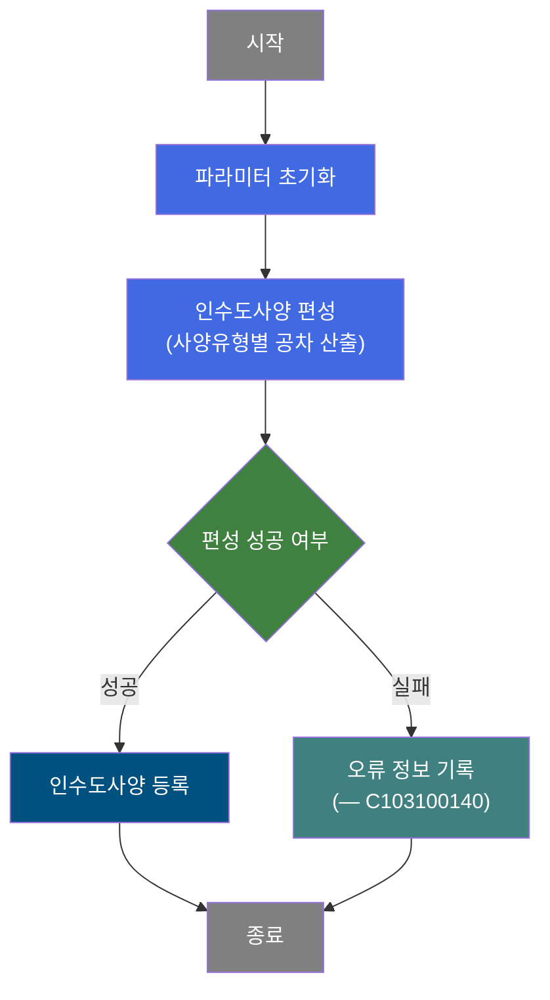
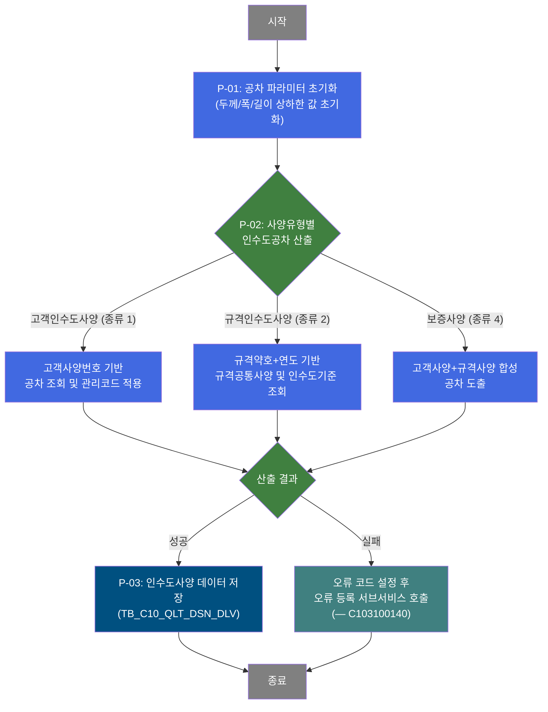
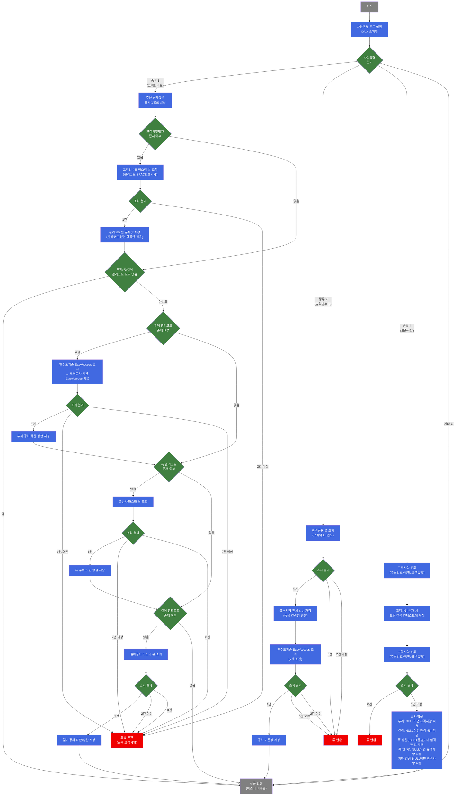

# C102100100 비즈니스 프로세스 분석서 (BPA)

## 1. 시스템 개요

| 항목 | 내용 |
|------|------|
| 서비스 ID | C102100100 |
| 업무명 | 품질설계결과 인수도사양 등록 |
| 서비스 타입 | nui |
| 분석 일시 | 2026-03-21 (KST) |
| 원본 분석일 | 2026-03-16 |
| 문서 버전 | 1.0 |

---

## 2. 시스템 목적

본 서비스는 품질설계 배치(NUI) 프로세스에서 주문 단위의 인수도사양(공차 기준)을 자동으로 편성하고, 그 결과를 MES 데이터베이스에 등록하는 역할을 수행한다. 인수도사양은 철강 제품의 납품 검사 기준으로, 두께·폭·길이 각 치수의 허용 오차 상한 및 하한을 정의한다.

인수도사양은 세 가지 유형으로 구분된다: 고객과 합의된 별도 기준을 적용하는 **고객인수도사양(종류 1)**, KS·JIS 등 공개 규격 기준을 적용하는 **규격인수도사양(종류 2)**, 그리고 고객사양과 규격사양을 합성하여 보증 기준을 도출하는 **보증사양(종류 4)**이다. 시스템은 주문 정보 및 규격 마스터를 참조하여 해당 유형의 공차를 자동 산출한다.

본 서비스는 품질설계 프로세스 전체 흐름 내에서 호출되며, 공차 산출 실패 시 오류 정보를 별도 서브서비스를 통해 기록한다. 생산 담당자 및 품질 엔지니어가 직접 조작하지 않으며, 배치 프로세스에 의해 자동 실행된다.

---

## 3. 핵심 워크플로우

---

## 4. 상세 워크플로우

### 프로세스 흐름도 — 인수도사양 편성 및 등록 (P-01, P-02, P-03)

---

## 5. 비즈니스 로직 상세

P-01: 공차 파라미터 초기화 — 후속 사양 편성을 위해 두께/폭/길이 상하한 값을 빈 값으로 초기화

- **입력**: 이전 단계에서 전달된 컨텍스트 파라미터
- **처리**:
  1. 두께 공차 하한/상한, 폭 공차 하한/상한, 길이 공차 하한/상한을 모두 NULL로 초기화
  2. 파형(횡파/종파/경사파) 높이, 슬리팅 상한, 불균일 차이 상한, 계단 수, 공차등급 파라미터도 초기화
- **출력**: 초기화된 파라미터가 후속 인수도사양 편성 단계에 전달됨
- **예외**: 해당 없음 (단순 초기화 단계)

P-02: 사양유형별 인수도공차 산출 — 사양 종류(고객/규격/보증)에 따라 마스터 데이터를 조회하고 공차 기준값을 결정

- **입력**: 주문번호, 주문행번, 사양유형 코드, 고객사양번호, 두께/폭/길이 관리코드, 품명코드, 제품형태, 규격약호, 규격연도 등 주문 속성 정보
- **처리**:
  1. **사양유형 1 (고객인수도사양)**:
     - 고객사양번호가 있으면 고객인수도 마스터 뷰(VI_M00_C10A1023)를 조회하여 기본 공차 설정
     - 주문의 두께/폭/길이 관리코드가 존재하면 해당 관리코드별로 EasyAccess 기준(C10B1013) 및 공차 계산(C10B2180), 폭/길이 공차 뷰(VI_M00_C10A2181, VI_M00_C10A2182)를 조회하여 공차 덮어쓰기
     - 관리코드가 모두 없거나 'Z'(조정 없음)이면 마스터 미적용으로 조기 성공 반환
  2. **사양유형 2 (규격인수도사양)**:
     - 규격약호+규격연도로 규격공통 뷰(VI_M00_C10A1010)를 조회하여 사양 전체 설정
     - EasyAccess 기준(C10B1013)으로 인수도 기준 공차 추가 조회
  3. **사양유형 4 (보증사양)**:
     - 주문 기준으로 저장된 고객사양과 규격사양을 각각 조회
     - 두께·길이 공차: 고객사양 우선, 없는 경우에만 규격사양 적용(더 큰 허용값)
     - 폭 공차 (품명 E·C·D 해당 제품): 상한은 고객사양과 규격사양 중 더 엄격한(작은) 값 채택
     - 폭 공차 (그 외): 고객사양 우선, 없는 경우 규격사양 적용
- **출력**: 두께/폭/길이 공차 상하한, 파형 높이, 슬리팅 상한, 불균일 차이 상한, 계단 수, 공차등급 등이 설정됨
- **예외**:
  - 마스터 조회 결과 2건 이상 → 중복 오류 코드 설정 후 FAILURE 반환
  - 마스터 조회 결과 0건 → 미존재 오류 코드 설정 후 FAILURE 반환
  - 사양유형 1/2/4 외의 값 → 처리 없이 SUCCESS 반환

P-03: 인수도사양 데이터 저장 — 산출된 공차 기준값을 인수도사양 테이블에 신규 등록

- **입력**: P-02에서 산출된 품질설계 사양구분, 두께/폭/길이 공차 상하한, 파형 높이, 슬리팅 상한, 불균일 차이 상한, 계단 수, 공차등급, 주문번호, 주문행번
- **처리**:
  1. 17개 파라미터를 포함하여 인수도사양 테이블에 INSERT 실행
  2. 감사(Audit) 로깅 활성화 상태로 처리
- **출력**: TB_C10_QLT_DSN_DLV 테이블에 인수도사양 1건 등록
- **예외**: INSERT 실패 시 상위 트랜잭션에서 롤백

---

## 6. 커스텀 클래스 워크플로우

### DbSearchDeliSpec (약 693줄)

**역할**: 인수도사양 종류(고객/규격/보증)에 따라 마스터 데이터 및 EasyAccess를 조회하여 두께·폭·길이 공차 기준값을 산출하고 컨텍스트에 저장하는 배치 전용 Activity

---

## 7. 주요 유즈케이스

UC-01: 고객인수도사양 자동 편성

- **Actor**: 품질설계 배치 프로세스
- **목적**: 주문에 연결된 고객사양번호 및 치수 관리코드를 기반으로 두께·폭·길이 허용 오차를 자동 결정하고 등록
- **주요 흐름**:
  1. 배치 프로세스에서 주문번호·행번과 사양유형 '1'을 입력으로 서비스 호출
  2. 공차 파라미터를 초기화한 후 고객사양번호로 고객인수도 마스터를 조회
  3. 두께·폭·길이 관리코드별로 EasyAccess 및 공차 뷰를 통해 최종 공차 산출
  4. 산출된 17개 공차·규격 파라미터를 인수도사양 테이블에 등록
- **예외**: 마스터 조회 결과가 0건이거나 2건 이상이면 오류 코드 설정 후 오류 서브서비스 호출

UC-02: 규격인수도사양 자동 편성

- **Actor**: 품질설계 배치 프로세스
- **목적**: KS·JIS 등 공개 규격약호와 연도로 규격공통 마스터를 조회하여 규격 기반 공차 기준을 자동 결정하고 등록
- **주요 흐름**:
  1. 배치 프로세스에서 규격약호, 규격연도, 사양유형 '2'를 입력으로 서비스 호출
  2. 공차 파라미터 초기화 후 규격공통 뷰에서 규격사양 전체 조회
  3. EasyAccess 인수도 기준(C10B1013)으로 공차 기준값 추가 산출
  4. 산출된 사양 데이터를 인수도사양 테이블에 등록
- **예외**: 규격약호+연도에 해당하는 규격 미존재 또는 중복 시 오류 처리

UC-03: 보증사양 합성 편성

- **Actor**: 품질설계 배치 프로세스
- **목적**: 해당 주문의 고객사양과 규격사양을 합성하여 보증 공차를 도출하고 등록
- **주요 흐름**:
  1. 배치 프로세스에서 주문번호·행번, 사양유형 '4'를 입력으로 서비스 호출
  2. 공차 파라미터 초기화 후 해당 주문의 고객사양 및 규격사양을 각각 조회
  3. 합성 규칙 적용: 고객사양 우선, 없는 경우 규격사양 적용. 아연도금계 품명(E·C·D)의 폭 상한은 더 엄격한(작은) 값 채택
  4. 합성된 공차 데이터를 인수도사양 테이블에 등록
- **예외**: 규격사양 조회 0건 시 오류 처리

---

## 9. 관련 엔티티

### 엔티티 목록

| 엔티티(테이블/뷰) | 설명 | 사용 유형 |
|-----------------|------|----------|
| TB_C10_QLT_DSN_DLV | 품질설계결과 인수도사양 저장 테이블 | 저장(INSERT) |
| VI_M00_C10A1023 | 고객인수도 공차 마스터 뷰 | 조회 |
| VI_M00_C10A1010 | 규격공통사양 마스터 뷰 | 조회 |
| VI_M00_C10A2181 | 폭 공차 마스터 뷰 | 조회 |
| VI_M00_C10A2182 | 길이 공차 마스터 뷰 | 조회 |

### 엔티티 간 관계
- TB_C10_QLT_DSN_DLV는 주문번호(ORD_NO) 및 주문행번(ORD_LN) 기준으로 인수도사양 1건을 저장하며, 품질설계사양구분(QLT_DSN_SPC_TP)으로 고객/규격/보증 유형을 구분한다.
- VI_M00_C10A1023, VI_M00_C10A2181, VI_M00_C10A2182는 M00APUSER(마스터 스키마) 소속 뷰로, 고객사양번호 또는 관리코드를 조건으로 공차 기준값을 제공한다.
- VI_M00_C10A1010은 규격약호와 규격연도를 조건으로 KS·JIS 등 공개 규격 사양 데이터를 제공한다.

---

## 10. 서브서비스

| 서비스 ID | 설명 | 호출 시점 | 트랜잭션 | BPA 문서 |
|-----------|------|---------|---------|---------|
| C103100140 | 품질설계 오류 정보 등록 | 인수도사양 편성(P-02) 실패 시 오류 코드 설정 후 호출 | 신규 트랜잭션 | 미작성 |

---

## 11. 특이사항 및 주의사항

### 1. 고객인수도 관리코드 초기화 설계 의도
고객사양번호로 마스터를 조회하기 전, 주문의 두께·폭·길이 관리코드를 SPACE로 강제 초기화한다. 이는 고객사양번호로 조회한 값이 기본 공차로 먼저 설정되고, 이후 관리코드 유무에 따라 공차 덮어쓰기 여부가 제어되도록 의도된 설계이다. 관리코드 'Z'는 "조정 없음"을 의미하며 SPACE와 동일하게 처리된다.

### 2. 보증사양 폭 상한 강화 규칙 (2024.06.13 반영)
아연도금계 제품(품명 E: EGI, C: 구매CR, D: F/H)에 대해 보증사양 폭 상한 합성 시, 고객사양과 규격사양 중 더 작은(엄격한) 값을 채택한다. 이는 해당 제품군의 폭 치수 품질 기준 강화를 위해 2024년 6월에 반영된 규칙이며, 다른 공차 항목(두께·길이 등)의 합성 방식(더 큰 허용값 또는 고객사양 우선)과 다른 예외적 처리이다.

### 3. 길이공차 저장 조건 버그 의심 (라인 389)
고객인수도사양(종류 1)에서 길이 관리코드 처리 블록 내부의 공차 저장 조건에 `ord_lth_mng_cd` 대신 `ord_wth_mng_cd`(폭 관리코드)가 사용되어 있다. 폭 관리코드가 없고(SPACE/Z) 길이 관리코드만 있는 경우, 길이공차 마스터 조회는 수행되지만 조회 결과가 컨텍스트에 저장되지 않는 문제가 발생할 수 있다. 소스코드 검토 및 테스트 케이스 확인이 필요하다.

### 4. 오류 처리 비대칭 (고객인수도 미존재 시)
고객사양번호로 고객인수도 마스터를 조회했을 때 결과가 0건인 경우, 에러 처리 코드가 주석 처리되어 있어 오류 없이 계속 진행된다. 반면 2건 이상(중복)이면 오류 반환한다. 이는 고객사양번호가 존재하지 않는 경우를 정상으로 간주하는 설계이지만, 의도적 처리인지 확인이 필요하다.

### 5. 단일 클래스 내 3유형 인수도사양 처리
DbSearchDeliSpec 클래스(693줄)가 고객·규격·보증 세 가지 인수도사양 편성 로직을 모두 포함하고 있어 복잡도가 높다. 각 경로는 서로 다른 마스터 뷰와 EasyAccess를 참조하며, 참조하는 뷰의 스키마도 M00APUSER(마스터)와 MESAPUSER(MES)가 혼재한다. 향후 유지보수 시 경로 간 영향도를 면밀히 검토해야 한다.
