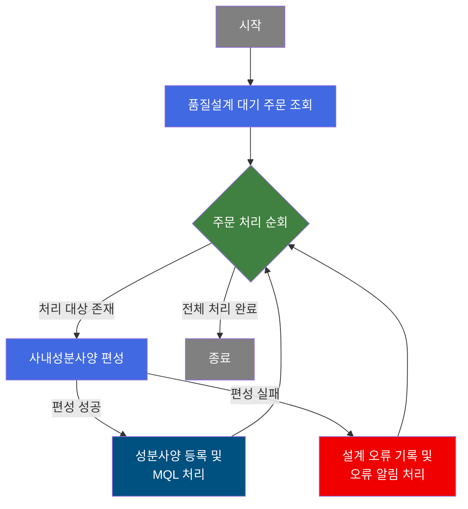
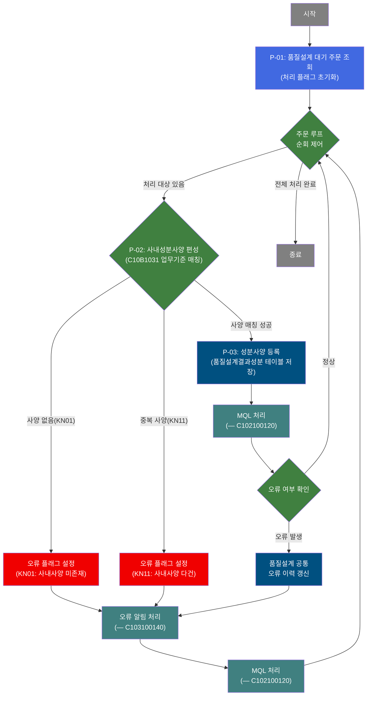
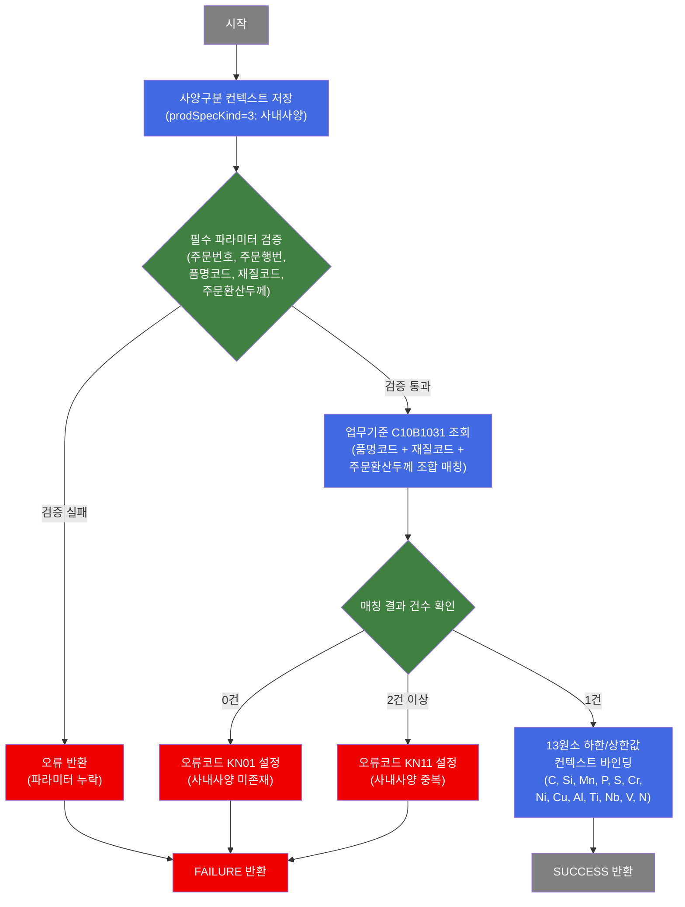

# C102100110 비즈니스 프로세스 분석서 (BPA)

## 1. 시스템 개요

| 항목 | 내용 |
|------|------|
| 서비스 ID | C102100110 |
| 업무명 | 사내성분사양 편성 및 MQL 처리 |
| 서비스 타입 | nui |
| 분석 일시 | 2026-03-21 (KST) |
| 원본 분석일 | 2026-03-16 |
| 문서 버전 | 1.0 |

---

## 2. 시스템 목적

C102100110은 품질설계 배치 프로세스에서 **사내성분사양 편성**을 수행하는 NUI 서비스이다. 품질설계 대기 상태인 주문 목록을 조회하여 건별로 사내 업무기준(C10B1031)에 따라 C, Si, Mn, P, S, Cr, Ni, Cu, Al, Ti, Nb, V, N의 13개 화학 원소에 대한 하한/상한 성분 규격값을 결정하고 이를 품질설계결과 테이블에 등록한다.

사내사양 편성 성공 시에는 연속으로 MQL(재질기준) 처리 서비스(C102100120)를 호출하며, 사양 조회에 실패하면 품질설계 공통 이력에 오류 코드를 기록하고 에러 알림 서비스(C103100140)를 통해 후속 처리를 진행한다. 모든 주문을 순회 처리한 후 배치가 완료된다.

이 서비스는 품질 담당자가 개별 주문에 대해 수동으로 사양을 입력하는 대신, 시스템이 자동으로 사내 기준에 따라 성분 사양을 결정하는 업무 자동화를 지원한다.

---

## 3. 핵심 워크플로우

---

## 4. 상세 워크플로우

### 프로세스 흐름도 — 사내성분사양 편성 및 등록 (P-01, P-02, P-03)

---

## 5. 비즈니스 로직 상세

P-01: 품질설계 대기 주문 조회 — 처리 대상 주문 목록 추출 및 초기화

- **입력**: 없음 (배치 기동 시 자동 실행)
- **처리**:
  1. 처리 플래그(오류 여부)를 초기 상태로 설정
  2. 품질설계 공통 테이블(TB_C10_QLT_DSN_CMN)에서 처리 대기 상태인 주문 목록을 전체 조회
  3. 조회된 주문 목록을 순회 처리를 위한 결과셋으로 보관
- **출력**: 품질설계 대기 주문 ResultSet (주문번호, 주문행번, 품명코드, 재질코드, 주문환산두께 등)
- **예외**: 없음 (조회 실패 시 후속 루프에서 건수 0으로 즉시 종료)

P-02: 사내성분사양 편성 — 업무기준 기반 13원소 규격값 결정

- **입력**: 주문번호, 주문행번, 품명코드(PRD_NM_CD), 재질코드(MQL_CD), 주문환산두께(ORD_EXC_THK)
- **처리**:
  1. 입력 파라미터(주문번호, 주문행번, 품명코드, 재질코드, 주문환산두께) Null 여부 검증
  2. 업무기준 C10B1031에 품명코드·재질코드·주문환산두께 조합으로 사내성분사양 매칭 조회
  3. 결과 0건: 오류코드 KN01 설정 후 실패 처리
  4. 결과 2건 이상: 오류코드 KN11 설정 후 실패 처리
  5. 결과 1건: C, Si, Mn, P, S, Cr, Ni, Cu, Al, Ti, Nb, V, N 13원소의 하한값/상한값을 처리 컨텍스트에 저장
- **출력**: 13종 원소별 하한값(LLV)/상한값(ULV), 품질설계사양구분(=3 사내사양)
- **예외**: KN01(사내사양 미존재) → 오류 처리 분기; KN11(사내사양 다건) → 오류 처리 분기

P-03: 성분사양 등록 — 품질설계결과성분 테이블 저장

- **입력**: P-02에서 편성된 13원소 하한/상한값 및 품질설계사양구분
- **처리**:
  1. 주문번호, 주문행번, 품질설계사양구분, 13원소 하한/상한값(총 26개) 조합으로 신규 레코드 생성
  2. TB_C10_QLT_DSN_CHM 테이블에 INSERT (감사 로그 포함)
  3. INSERT 완료 후 MQL 처리 서비스(C102100120) 연속 호출
- **출력**: TB_C10_QLT_DSN_CHM에 사내성분사양 레코드 등록
- **예외**: INSERT 오류 → 프레임워크 트랜잭션 롤백

P-04: 품질설계 공통 오류 이력 갱신 — 오류 발생 시 공통 테이블 갱신

- **입력**: 주문번호, 주문행번, 오류코드
- **처리**:
  1. TB_C10_QLT_DSN_CMN 테이블의 해당 주문 레코드에 오류 발생 여부(QLT_DSN_ERR_YN = 'Y') 업데이트
  2. 감사 정보(최종변경객체유형, 최종변경객체ID, 최종변경프로그램ID, 최종변경시각) 함께 갱신
- **출력**: TB_C10_QLT_DSN_CMN 오류 이력 갱신
- **예외**: 없음 (UPDATE 실패 시 프레임워크 처리)

---

## 6. 커스텀 클래스 워크플로우

### DbQualDesignLoop (약 171줄)

**역할**: 이전 액티비티가 조회한 주문 ResultSet을 1건씩 순회하며, 현재 처리 Row의 컬럼값을 컨텍스트에 바인딩하고 루프 카운터를 관리하는 범용 루프 제어 컴포넌트. 처리 건수가 0이 되면 `exit` 전이를 반환하여 루프를 종료한다. 200줄 미만이므로 Mermaid 생략.

---

### DbSearchChemData (약 534줄)

**역할**: 품질설계 배치에서 사양구분(고객/규격/사내/보증)에 따라 해당 성분사양을 조회·편성하여 컨텍스트에 저장하는 성분사양 편성 컴포넌트. C102100110에서는 `prodSpecKind=3`(사내성분사양)으로 동작한다.

---

## 7. 주요 유즈케이스

UC-01: 사내성분사양 자동 편성

- **Actor**: 배치 스케줄러 (자동 실행)
- **목적**: 품질설계 대기 주문에 대해 사내 업무기준 기반으로 성분 규격값을 자동 결정하여 등록
- **주요 흐름**:
  1. 배치 기동 시 품질설계 공통 테이블에서 대기 주문 전체 조회
  2. 각 주문에 대해 품명코드·재질코드·주문환산두께 조합으로 사내성분 업무기준(C10B1031) 매칭
  3. 매칭된 13원소 규격값을 품질설계결과성분 테이블에 등록
  4. 등록 완료 후 MQL 처리 서비스(C102100120) 연속 호출
- **예외**: 사내사양 미존재(KN01) 또는 중복(KN11) 시 오류 이력 기록 후 알림 처리

UC-02: 사내성분사양 편성 실패 오류 처리

- **Actor**: 배치 스케줄러 (자동 실행)
- **목적**: 사내사양 매칭 실패 시 오류를 기록하고 후속 처리가 정상적으로 이어지도록 보장
- **주요 흐름**:
  1. 업무기준 C10B1031 매칭에서 0건(KN01) 또는 2건 이상(KN11) 결과 발생
  2. 오류 플래그 및 오류코드를 컨텍스트에 설정
  3. 품질설계 공통 테이블의 해당 주문에 오류 발생 여부(QLT_DSN_ERR_YN='Y') 갱신
  4. 오류 알림 처리 서비스(C103100140) 호출로 오류 사실 통보
  5. 오류 처리 완료 후 MQL 처리 서비스(C102100120)를 경유하여 다음 주문 처리로 이동
- **예외**: 오류 처리 자체는 실패 없이 계속 진행 (전체 루프 유지)

UC-03: 전체 주문 순회 완료

- **Actor**: 배치 스케줄러 (자동 실행)
- **목적**: 대기 주문 목록 전건 처리 완료 후 배치 정상 종료
- **주요 흐름**:
  1. 루프 제어(DbQualDesignLoop)가 처리 카운터를 1씩 감소
  2. 처리 건수가 0이 되면 루프 종료 전이(exit)로 배치 완료
  3. 트랜잭션 커밋으로 전체 처리 결과 확정
- **예외**: 대기 주문이 처음부터 0건이면 루프 진입 없이 즉시 종료

---

## 9. 관련 엔티티

### 엔티티 목록

| 엔티티(테이블) | 설명 | 사용 유형 |
|---------------|------|----------|
| TB_C10_QLT_DSN_CMN | 품질설계 공통 이력 — 주문별 품질설계 진행상태 및 오류 여부 관리 | 조회 / 갱신 |
| TB_C10_QLT_DSN_CHM | 품질설계결과성분 — 주문별 화학 원소 성분 규격(하한/상한) 저장 | 저장 |
| VI_M00_C10A1021 | 고객성분사양 뷰 (M00APUSER 스키마) — 고객별 성분 사양 기준 | 조회(보증사양 편성 시) |
| C10B1031 | 사내성분사양 업무기준 (EasyAccess) — 품명코드·재질코드·두께 조합별 사내 규격값 | 참조 |

### 엔티티 간 관계

- TB_C10_QLT_DSN_CMN은 주문 단위 품질설계 마스터 이력이며, TB_C10_QLT_DSN_CHM은 해당 주문의 사양 유형별 성분 상세 결과를 담는다. 두 테이블은 주문번호(ORD_NO) + 주문행번(ORD_LN)으로 연결된다.
- C10B1031 업무기준은 품명코드·재질코드·주문환산두께 조합으로 TB_C10_QLT_DSN_CHM에 저장될 성분 규격값을 결정하는 참조 원천이다.
- VI_M00_C10A1021은 M00APUSER 마스터 스키마의 뷰로, 보증사양 편성 시 고객사양 값을 보조 참조로 사용한다.

---

## 10. 서브서비스

| 서비스 ID | 설명 | 호출 시점 | 트랜잭션 | BPA 문서 |
|-----------|------|---------|---------|---------|
| C102100120 | MQL(재질기준) 처리 | 성분사양 등록 완료 후 및 오류 처리 완료 후 | 공유 (new-transaction=false) | 미작성 |
| C103100140 | 품질설계 오류 알림 처리 | 사내사양 편성 실패 시 오류 이력 갱신 후 | 공유 (new-transaction=false) | 미작성 |

---

## 11. 특이사항 및 주의사항

### 1. 오류 발생 시에도 MQL 처리는 항상 수행
사내성분사양 편성에 실패하더라도 오류 처리(C103100140) 완료 후 반드시 MQL 처리(C102100120)를 경유하여 다음 루프로 진행한다. 즉, 오류 경로와 정상 경로 모두 C102100120을 공통 경유점으로 삼는 설계이다. 이로 인해 일부 주문에서 성분사양 편성 오류가 발생해도 배치 전체가 중단되지 않고 나머지 주문을 계속 처리한다.

### 2. 사내사양 단건 강제 및 중복 검출
업무기준 C10B1031에서 동일 조건(품명코드·재질코드·주문환산두께)으로 사내사양이 2건 이상 매칭되면 오류코드 KN11을 기록하고 실패 처리한다. 단건 매칭이 사양 편성의 선제 조건이며, 업무기준 데이터 정합성 관리가 중요하다.

### 3. DbQualDesignLoop의 O(n²) 순회 성능 특성
루프 제어에 사용되는 DbQualDesignLoop는 매 루프 반복 시 ResultSet 커서를 처음부터 재탐색하는 방식(reset + while 순회)으로 동작한다. 처리 대상 주문이 많을수록 탐색 횟수가 제곱으로 증가하므로, 품질설계 대기 주문이 대량 적체될 경우 배치 처리 시간이 급증할 수 있다.

### 4. DbSearchChemData의 사양구분 재사용 설계
DbSearchChemData는 하나의 클래스로 고객(1)/규격(2)/사내(3)/보증(4) 4가지 사양 편성을 모두 처리한다. C102100110에서는 `prodSpecKind=3`으로 사내사양 편성 전용으로 사용하며, 동일 클래스가 C102100040(고객), C102100080(규격), C102100130(보증) 서비스에서도 각각 다른 구분값으로 활용된다.

### 5. 트랜잭션 경계 및 커밋 시점
배치 서비스 전체는 단일 트랜잭션 범위 내에서 동작하며, 모든 주문 순회 완료 후 COMMIT 액티비티가 실행된다. 단, 서브서비스 C102100120 호출 시 `new-transaction=false`로 동일 트랜잭션을 공유한다. 중간에 롤백이 발생하면 해당 루프 반복의 변경사항이 취소된다.
