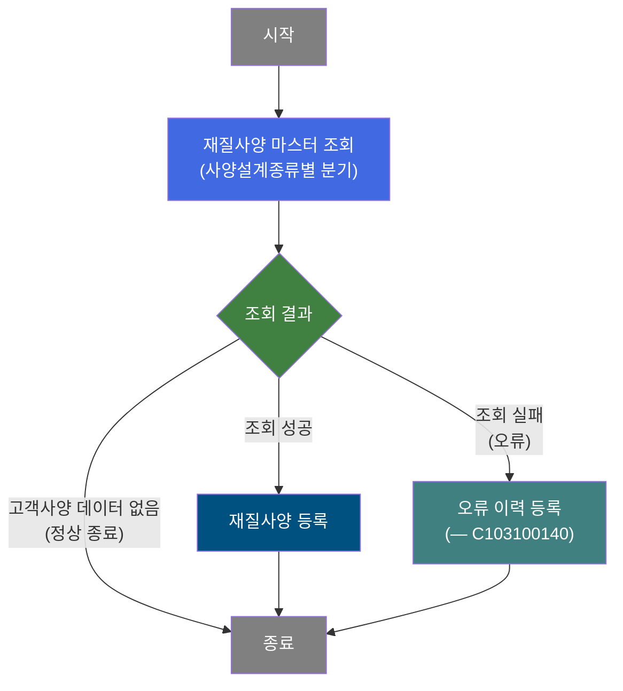
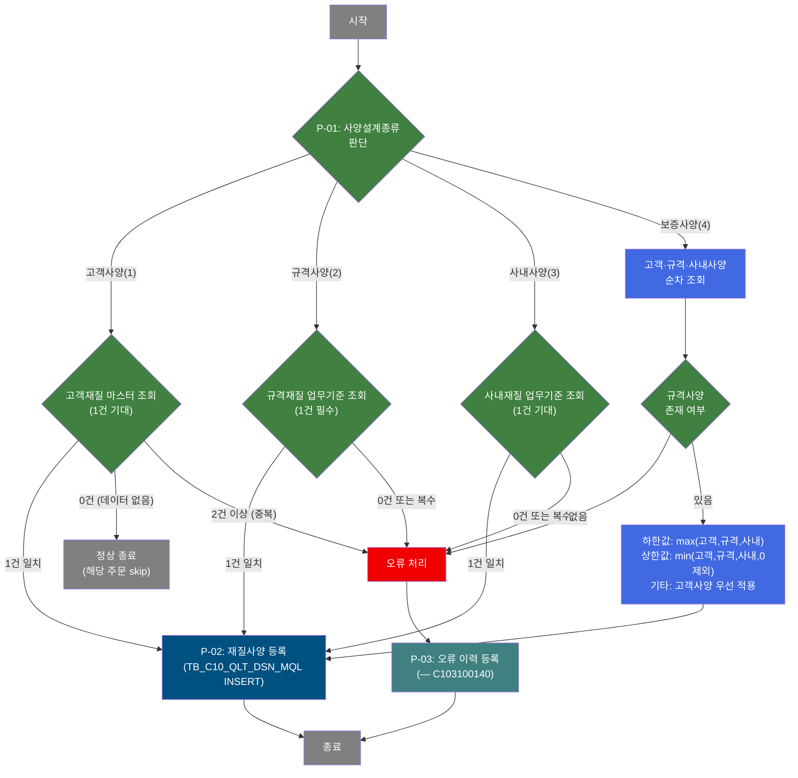
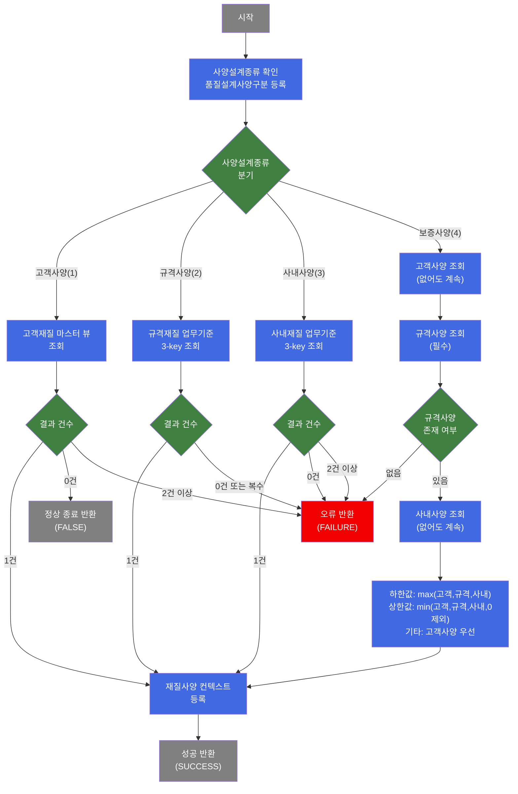

# C102100120 비즈니스 프로세스 분석서 (BPA)

## 1. 시스템 개요

| 항목 | 내용 |
|------|------|
| 서비스 ID | C102100120 |
| 업무명 | 품질설계 재질사양(MQL) 편성 및 등록 |
| 서비스 타입 | nui |
| 분석 일시 | 2026-03-21 (KST) |
| 원본 분석일 | 2026-03-16 |
| 문서 버전 | 1.0 |

---

## 2. 시스템 목적

본 서비스는 철강 주문 제품의 품질설계 프로세스 중 재질사양(MQL: Mechanical Quality Level) 편성 및 등록을 담당하는 배치(NUI) 서비스이다. 주문된 제품에 대해 인장강도(TS), 항복점(YP), 연신율(ELGN), 경도(HRB), 탄성계수(ER) 등의 기계적 재질 시험 기준값을 확정하여 품질설계 결과 테이블에 등록한다.

제품의 사양설계종류(고객사양·규격사양·사내사양·보증사양)에 따라 적합한 마스터 데이터 소스에서 재질 기준값을 조회하고, 특히 보증사양의 경우 고객·규격·사내 세 가지 기준을 합성하여 가장 엄격한 기준을 자동으로 선택함으로써 제품 품질 기준의 준수를 보장한다.

품질설계 담당자 및 배치 스케줄러에 의해 실행되며, 재질사양 조회 실패 시 오류 이력을 별도 서비스(C103100140)에 위임하여 기록한다.

---

## 3. 핵심 워크플로우

---

## 4. 상세 워크플로우

### 프로세스 흐름도 — 재질사양 편성 및 등록 (P-01, P-02, P-03)

---

## 5. 비즈니스 로직 상세

P-01: 재질사양 마스터 조회 — 사양설계종류별 재질 기준값 조회

- **입력**: 주문번호, 주문행번, 사양설계종류(1~4). 각 종류별 추가 키:
  - 고객사양(1): 고객사양번호
  - 규격사양(2): 규격약호, 규격년도, 주문환산두께
  - 사내사양(3): 품명코드, 재질코드, 주문환산두께
  - 보증사양(4): 위 1~3 키 모두 사용
- **처리**:
  1. 사양설계종류(1~4)에 따라 조회 소스 결정
  2. **고객사양(1)**: 고객재질 마스터 뷰(VI_M00_C10A1022)에서 고객사양번호로 조회. 1건이면 재질값 확보, 0건이면 skip(정상), 2건 이상이면 오류
  3. **규격사양(2)**: 규격재질 업무기준(C10B1012)에서 규격약호+규격년도+주문환산두께 3-key 조회. 1건이면 재질값 확보, 그 외 오류(규격사양은 필수)
  4. **사내사양(3)**: 사내재질 업무기준(C10B1032)에서 품명코드+재질코드+주문환산두께 3-key 조회. 1건이면 재질값 확보, 그 외 오류
  5. **보증사양(4)**: 고객·규격·사내사양 세 가지를 모두 순차 조회한 후 합성 알고리즘 적용:
     - 하한값(LLV): 세 사양 중 최대값(가장 엄격한 기준) 적용
     - 상한값(ULV): 세 사양 중 최소값(0/NULL 제외, 가장 엄격한 기준) 적용
     - 기타 항목(MQL 등급코드, 시험편 채취 조건 등): 고객사양 우선, 없으면 규격사양 적용
- **출력**: 재질사양 데이터(TS·YP·ELGN·HRB·ER 상하한값, 도금량, 시험편 정보 등)를 처리 컨텍스트에 등록
- **예외**:
  - 고객재질 중복(2건 이상) → 오류코드 KC11, 오류 처리로 전이
  - 규격사양 없음/중복 → 오류코드 KS03, 오류 처리로 전이
  - 사내사양 없음 → 오류코드 KN02, 오류 처리로 전이
  - 사내사양 중복 → 오류코드 KN12, 오류 처리로 전이
  - 보증사양에서 규격사양 없음 → 오류코드 KS23, 오류 처리로 전이

P-02: 재질사양 등록 — 품질설계결과재질 테이블에 신규 등록

- **입력**: P-01에서 확보한 재질사양 데이터 전체, 주문번호, 주문행번, 사양설계종류
- **처리**:
  1. TB_C10_QLT_DSN_MQL(품질설계결과재질)에 재질사양 데이터 INSERT
  2. 인장강도(TS), 항복점(YP), 연신율(ELGN), 경도(HRB), 탄성계수(ER) 상하한값 및 도금량·시험편 채취 위치·길이·검사기관 위치 등 관련 정보 일괄 등록
  3. 이력 감사(Audit) 처리 적용
- **출력**: TB_C10_QLT_DSN_MQL 1건 INSERT
- **예외**: INSERT 실패 시 트랜잭션 롤백

P-03: 오류 이력 등록 [C103100140] — 재질사양 편성 실패 이력 기록

- **입력**: 오류 키(P_ERR_KEY), 품질설계 오류 코드(QLT_DSN_ERR_CD=TB03)
- **처리**:
  1. 오류 정보를 컨텍스트에 설정
  2. C103100140 서비스를 서브서비스로 호출하여 품질설계 오류 이력 기록
- **출력**: C103100140 서비스에 오류 이력 저장 위임
- **예외**: 서브서비스 호출 후 정상 종료(end)로 처리

---

## 6. 커스텀 클래스 워크플로우

### DbSearchMechData (약 497줄)

**역할**: 사양설계종류(고객/규격/사내/보증)에 따라 적합한 마스터 소스에서 재질시험 기준값을 조회하고, 보증사양의 경우 세 기준을 합성하여 가장 엄격한 재질사양을 산출한다.

---

## 7. 주요 유즈케이스

UC-01: 사내사양 기준 재질사양 편성 및 등록

- **Actor**: 배치 스케줄러 / 품질설계 담당자
- **목적**: 사내 재질 기준표에 따라 주문 제품의 재질사양을 자동으로 확정하고 품질설계 결과에 등록
- **주요 흐름**:
  1. 주문번호·행번·사양설계종류(3=사내사양)·품명코드·재질코드·주문환산두께가 입력됨
  2. 사내재질 업무기준(C10B1032)에서 3-key 룩업으로 재질 시험 기준값 조회
  3. 조회 결과 1건이면 TS·YP·ELGN·HRB·ER 상하한값을 품질설계결과재질 테이블에 등록
- **예외**: 조회 결과가 없거나 2건 이상이면 오류 이력을 기록하고 종료

UC-02: 보증사양 합성을 통한 재질사양 편성 및 등록

- **Actor**: 배치 스케줄러 / 품질설계 담당자
- **목적**: 고객·규격·사내 세 기준을 합성하여 가장 엄격한 보증사양 재질 기준을 자동으로 산출하고 등록
- **주요 흐름**:
  1. 주문번호·행번·사양설계종류(4=보증사양) 및 각 사양별 조회 키 입력
  2. 고객사양을 먼저 조회(없어도 계속), 규격사양을 필수로 조회, 사내사양도 추가 조회
  3. 하한값은 세 사양 중 최대값, 상한값은 세 사양 중 최소값(0/NULL 제외)으로 합성
  4. 기타 항목은 고객사양 우선, 없으면 규격사양 값 적용
  5. 합성된 재질사양을 품질설계결과재질 테이블에 등록
- **예외**: 규격사양이 반드시 존재해야 하며, 없으면 오류 이력 기록 후 종료

UC-03: 고객사양 데이터 없음 처리 (정상 skip)

- **Actor**: 배치 스케줄러
- **목적**: 고객사양(kind=1) 조회 시 해당 주문에 대한 고객재질 데이터가 없는 경우 오류 없이 처리 스킵
- **주요 흐름**:
  1. 사양설계종류 1(고객사양)으로 서비스 실행
  2. 고객재질 마스터 뷰 조회 결과 0건
  3. 오류 처리 없이 정상 종료(FALSE 반환 → end 전이)
- **예외**: 2건 이상이면 중복 오류로 처리됨

---

## 9. 관련 엔티티

### 엔티티 목록

| 엔티티(테이블) | 설명 | 사용 유형 |
|---------------|------|----------|
| TB_C10_QLT_DSN_MQL | 품질설계결과재질 — 주문별 재질사양(MQL) 설계 결과 | 저장(INSERT), 조회(보증사양 합성 시) |
| VI_M00_C10A1022 | 고객재질 마스터 뷰 — 고객사양번호 기준 재질 기준값 제공 | 조회 |

### 엔티티 간 관계
- TB_C10_QLT_DSN_MQL은 주문번호+주문행번을 키로 하며, 하나의 주문행에 사양설계종류별로 재질사양 레코드가 등록됨
- VI_M00_C10A1022는 M00APUSER 스키마의 마스터 뷰로, TB_C10_QLT_DSN_MQL에 등록될 재질 기준값의 소스 역할을 함
- 규격재질(C10B1012)과 사내재질(C10B1032) 업무기준은 GLUE EasyAccess를 통해 참조되며, TB_C10_QLT_DSN_MQL 등록 데이터의 소스가 됨

---

## 10. 서브서비스

| 서비스 ID | 설명 | 호출 시점 | 트랜잭션 | BPA 문서 |
|-----------|------|---------|---------|---------|
| C103100140 | 품질설계 오류 이력 등록 | 재질사양 조회 실패(FAILURE) 시 P-03에서 호출 | 신규 트랜잭션(false) | 미작성 |

---

## 11. 특이사항 및 주의사항

### 1. 고객사양 없음은 오류가 아닌 정상 skip
고객사양(kind=1) 조회 시 해당 주문의 고객재질 데이터가 없으면 `FALSE`를 반환하여 서비스가 바로 종료(end)된다. 이는 고객사양이 없는 주문은 재질사양 편성 대상에서 제외하는 업무 설계이다. 반면 규격사양(kind=2)은 0건이어도 오류로 처리되므로 사양설계종류별 오류 처리 정책이 다르다.

### 2. 보증사양 합성 알고리즘의 엄격성 보장
보증사양(kind=4)은 고객·규격·사내 세 기준 중 가장 엄격한 기준을 선택하는 합성 알고리즘을 적용한다. 하한값은 최대값(max), 상한값은 최소값(min, 단 0/NULL 제외)을 취하여 모든 기준을 동시에 만족하는 재질사양을 자동으로 산출한다. 이 로직은 `DbCommonUtil.numCompare` 유틸리티를 통해 처리된다.

### 3. 오류 발생 시 별도 서비스로 이력 위임
재질사양 조회 실패(FAILURE) 시 오류 정보를 설정한 후 C103100140 서비스를 서브서비스로 호출하여 품질설계 오류 이력을 기록한다. 오류 코드 TB03과 함께 오류 키가 전달되며, 서브서비스 호출 후에는 정상 종료(end)로 처리되어 배치 프로세스 전체가 중단되지 않도록 설계되어 있다.

### 4. 마스터 데이터 조회 경로의 이원화
재질사양 마스터 데이터는 사양설계종류에 따라 두 가지 경로로 조회된다. 고객사양은 M00APUSER 스키마의 마스터 뷰(VI_M00_C10A1022)를 직접 조회하고, 규격사양과 사내사양은 GLUE Framework의 EasyAccess 메커니즘을 통해 업무기준 테이블(C10B1012, C10B1032)을 조회한다. 이 두 경로는 DAO bean도 다를 수 있어(`masterdao` vs `mesdao`) 서비스 설정 시 주의가 필요하다.

### 5. 단일 메소드에 복잡한 분기 로직 집중
DbSearchMechData 클래스는 497줄의 단일 `runActivity` 메소드에 4가지 사양설계종류의 조회 로직이 모두 집약되어 있다. 보증사양(kind=4)의 경우 내부에서 kind=1, 2, 3을 각각 호출하는 재귀적 구조이므로, 코드 수정 시 모든 분기에 걸친 영향도를 충분히 검토해야 한다.
