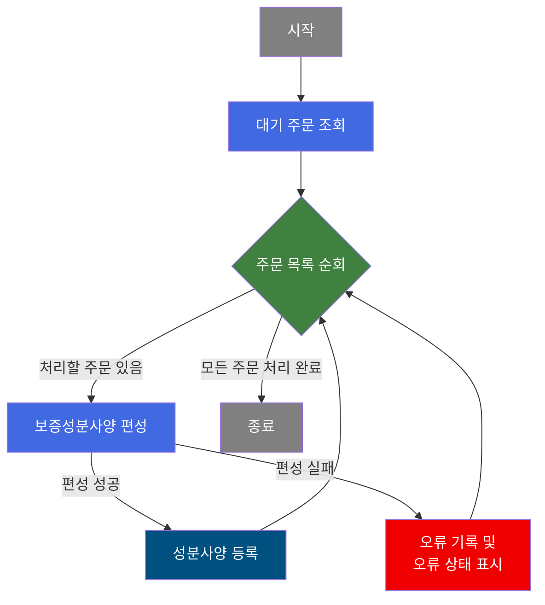
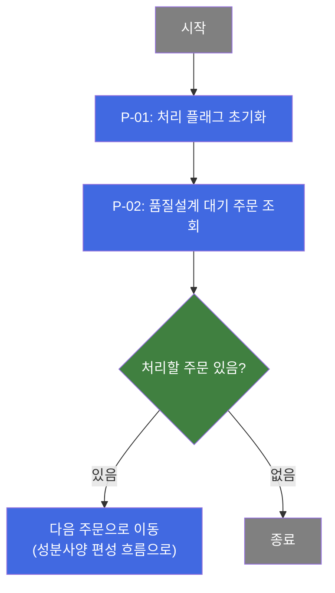
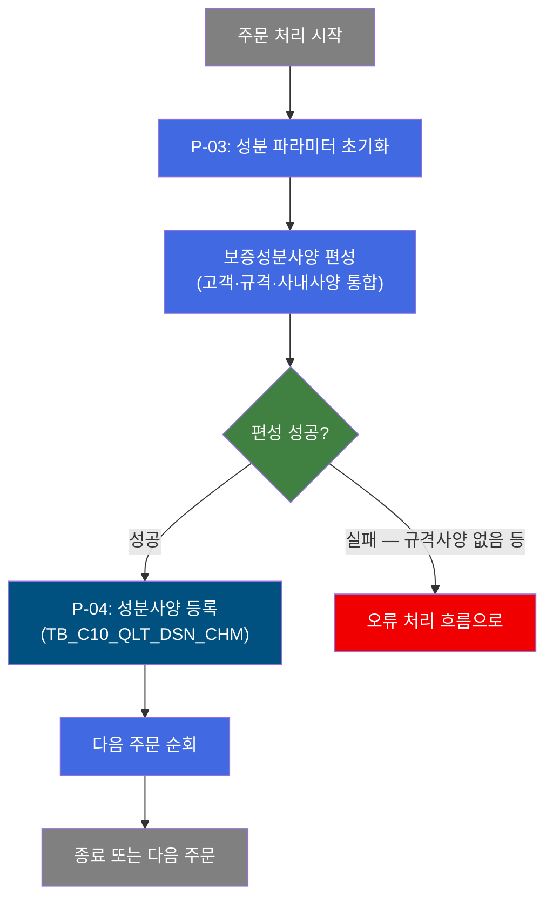
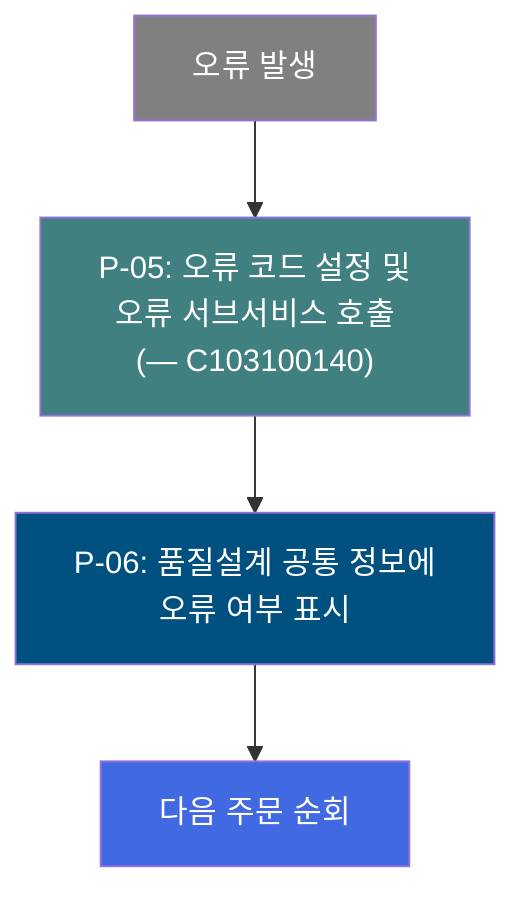
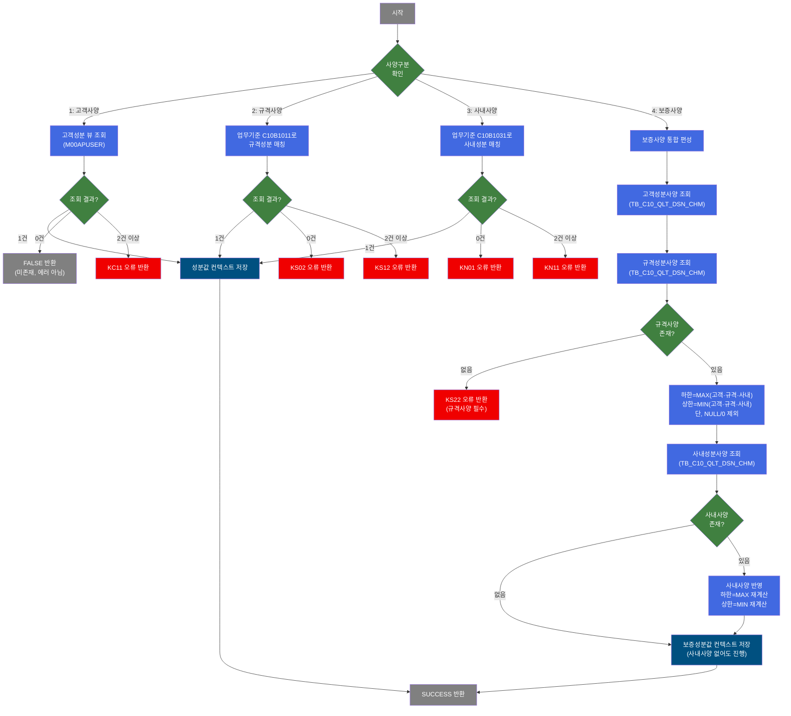

# C102100130 비즈니스 프로세스 분석서 (BPA)

## 1. 시스템 개요

| 항목 | 내용 |
|------|------|
| 서비스 ID | C102100130 |
| 업무명 | 품질설계 보증성분사양 자동 편성 (배치) |
| 서비스 타입 | nui |
| 분석 일시 | 2026-03-21 (KST) |
| 원본 분석일 | 2026-03-16 |
| 문서 버전 | 1.0 |

---

## 2. 시스템 목적

본 서비스는 품질설계 처리 대기 상태에 있는 주문에 대해 보증성분사양을 자동으로 편성하는 배치 NUI 프로세스이다. 철강 제품 주문 시 요구되는 화학성분 규격(탄소, 규소, 망간 등 13개 원소의 하한·상한값)을 고객사양, 규격사양, 사내사양 세 가지 기준을 통합하여 최종 보증 범위를 산출한다.

보증성분사양은 세 사양 중 가장 엄격한 범위를 적용하는 방식으로 계산된다. 즉, 하한값은 세 사양 중 가장 높은 값을, 상한값은 세 사양 중 가장 낮은 값을 채택하여 고객·규격·사내 모든 조건을 충족하는 최소 허용 범위를 결정한다.

품질설계 담당자가 별도의 수작업 없이 주문별 보증성분사양이 자동으로 산정되도록 지원하며, 사양 편성 실패 시에는 오류 코드를 기록하고 품질설계 공통 정보에 오류 여부를 표시하여 후속 처리 담당자가 확인할 수 있도록 한다.

---

## 3. 핵심 워크플로우

---

## 4. 상세 워크플로우

### 프로세스 흐름도 — 대기 주문 조회 및 순회 (P-01, P-02)

### 프로세스 흐름도 — 보증성분사양 편성 및 등록 (P-03, P-04)

### 프로세스 흐름도 — 오류 처리 및 오류 상태 표시 (P-05, P-06)

---

## 5. 비즈니스 로직 상세

P-01: 처리 플래그 초기화 — 배치 처리 시작 전 상태값 설정

- **입력**: 없음 (초기 상태값 고정 설정)
- **처리**:
  1. 처리 구분 플래그를 "C"(초기)로 설정하여 품질설계 처리 흐름 진입 표시
- **출력**: 처리 플래그 컨텍스트 변수 초기화
- **예외**: 없음

P-02: 품질설계 대기 주문 조회 — 처리 대상 주문 목록 확보

- **입력**: TB_C10_QLT_DSN_CMN (품질설계공통) — 처리 대기 상태인 주문 목록
- **처리**:
  1. 품질설계공통 테이블에서 처리 대기 상태(QLT_DSN_STS_CD 기준)의 주문번호·주문행번 목록 조회
  2. 조회 결과를 주문 순회 루프의 처리 대상으로 설정
- **출력**: 처리 대상 주문 결과셋
- **예외**: 조회 결과 0건이면 루프 없이 종료

P-03: 성분 파라미터 초기화 — 이전 주문 처리 잔여값 제거

- **입력**: 이전 루프에서 사용된 성분 파라미터 (C, Si, Mn, P, S, Cr, Ni, Cu, Al, Ti, Nb, V, N 13개 원소 하한·상한값)
- **처리**:
  1. 13개 원소 각각의 하한값(`_LLV`)과 상한값(`_ULV`) 파라미터 전체를 NULL로 초기화
  2. 초기화 후 보증성분사양 편성 단계로 진행
- **출력**: 성분 파라미터 클리어
- **예외**: 없음

P-04: 성분사양 등록 — 편성된 보증성분사양 저장

- **입력**: 편성 완료된 13개 원소별 하한·상한값, 주문번호, 주문행번, 품질설계사양구분(보증=4)
- **처리**:
  1. TB_C10_QLT_DSN_CHM(품질설계결과성분)에 보증성분사양 신규 등록
  2. 사양구분, 화학성분 상한/하한값 28개 항목(13 원소 × 2) 저장
  3. 저장 완료 후 다음 주문 순회로 복귀
- **출력**: TB_C10_QLT_DSN_CHM에 보증성분사양 레코드 INSERT
- **예외**: 없음 (성분사양 조회 단계에서 사전 검증 완료)

P-05: 오류 코드 설정 및 오류 서브서비스 호출 — 편성 실패 기록

- **입력**: 오류 발생 원인 코드 (규격사양 없음 등), 주문번호, 주문행번
- **처리**:
  1. 오류 플래그(P_ERR_KEY)를 "N"(오류 없음 → 오류 있음)으로 전환
  2. 오류 코드 유형을 TB02(품질설계오류)로 설정
  3. C103100140 서브서비스를 호출하여 오류 상세 내역 기록
- **출력**: 오류 상세 기록 (C103100140 서브서비스 처리)
- **예외**: 서브서비스 호출 실패 시 전체 트랜잭션 롤백

P-06: 품질설계 공통 정보 오류 여부 표시 — 오류 상태 갱신

- **입력**: 주문번호, 주문행번
- **처리**:
  1. TB_C10_QLT_DSN_CMN(품질설계공통)의 해당 주문 레코드에 오류 여부(QLT_DSN_ERR_YN)를 "Y"로 갱신
  2. 갱신 후 다음 주문 순회로 복귀
- **출력**: TB_C10_QLT_DSN_CMN 오류 여부 플래그 UPDATE
- **예외**: 없음

---

## 6. 커스텀 클래스 워크플로우

### DbSearchChemData (534줄)

**역할**: 품질설계 사양구분(prodSpecKind)에 따라 고객·규격·사내·보증 4가지 성분사양을 각각 편성하여 처리 컨텍스트에 저장하는 성분사양 편성 액티비티. 본 서비스(C102100130)에서는 보증성분사양(prodSpecKind=4) 편성에 사용된다.

### DbQualDesignLoop (171줄)

**역할**: 이전 단계에서 조회한 주문 결과셋을 1건씩 순차 순회하는 루프 제어 액티비티. 처리 카운터를 관리하며 모든 주문 처리 완료 시 루프를 종료한다. 40개 이상의 배치 서비스에서 공용으로 사용되는 범용 컴포넌트이다.

---

## 7. 주요 유즈케이스

UC-01: 대기 주문에 대한 보증성분사양 자동 편성

- **Actor**: 배치 스케줄러 (자동 실행)
- **목적**: 품질설계 처리 대기 중인 주문 전체에 대해 보증성분사양을 자동으로 산정하여 등록
- **주요 흐름**:
  1. 품질설계공통 테이블에서 처리 대기 주문 목록 조회
  2. 주문별로 고객사양, 규격사양, 사내사양을 각각 조회
  3. 세 사양의 교집합(하한 최대값, 상한 최소값)으로 보증성분사양 산출
  4. 산출된 보증성분사양을 품질설계결과성분 테이블에 등록
- **예외**: 규격사양이 없는 주문은 오류로 처리되며, 품질설계공통 테이블에 오류 여부가 표시됨

UC-02: 보증성분사양 편성 실패 주문의 오류 기록

- **Actor**: 배치 스케줄러 (자동 실행)
- **목적**: 성분사양 편성에 실패한 주문에 오류 코드와 오류 상태를 기록하여 후속 처리 담당자가 확인할 수 있도록 함
- **주요 흐름**:
  1. 성분사양 편성 실패 시 오류 코드(KS22 등) 및 오류 유형(TB02) 설정
  2. 오류 기록 서브서비스(C103100140) 호출로 상세 오류 내역 저장
  3. 품질설계공통 테이블의 해당 주문에 오류 여부(QLT_DSN_ERR_YN='Y') 표시
  4. 오류 주문 처리 후 다음 주문 순회 계속
- **예외**: 오류 처리 서브서비스 호출 실패 시 트랜잭션 롤백

UC-03: 복수 사양 기준 통합으로 최소 허용 범위 산출

- **Actor**: 배치 스케줄러 (자동 실행)
- **목적**: 고객·규격·사내 3개 기준을 모두 만족하는 가장 엄격한 성분 허용 범위를 보증사양으로 확정
- **주요 흐름**:
  1. 기존 등록된 고객사양, 규격사양, 사내사양을 순서대로 조회
  2. 원소별 하한값: 세 사양 중 가장 높은 값 채택 (가장 엄격한 최소 기준)
  3. 원소별 상한값: 세 사양 중 가장 낮은 값 채택, NULL/0은 비교 제외
  4. 최종 보증성분사양으로 등록
- **예외**: 규격사양은 필수. 고객사양·사내사양은 없어도 편성 계속 진행

---

## 9. 관련 엔티티

### 엔티티 목록

| 엔티티(테이블) | 설명 | 사용 유형 |
|---------------|------|----------|
| TB_C10_QLT_DSN_CMN | 품질설계공통 — 주문별 품질설계 처리 상태 및 기본 정보 | 조회, 갱신 |
| TB_C10_QLT_DSN_CHM | 품질설계결과성분 — 주문별 사양구분별 화학성분 규격값 (하한·상한) | 조회, 저장 |
| VI_M00_C10A1021 | M00APUSER 고객성분사양 뷰 — 고객사양번호별 성분 규격 정보 | 조회 |

### 엔티티 간 관계
- TB_C10_QLT_DSN_CMN과 TB_C10_QLT_DSN_CHM은 주문번호(ORD_NO) + 주문행번(ORD_LN)으로 연결되며, 공통 정보 1건에 사양구분별 성분사양 여러 건이 대응된다.
- TB_C10_QLT_DSN_CHM의 보증사양(사양구분=4) 레코드는 동일 주문의 고객(1)·규격(2)·사내(3) 사양 레코드를 참조하여 통합 산출된다.
- VI_M00_C10A1021은 M00APUSER 스키마의 마스터 뷰로, 고객사양 편성 시 참조 전용으로 사용된다.

---

## 10. 서브서비스

| 서비스 ID | 설명 | 호출 시점 | 트랜잭션 | BPA 문서 |
|-----------|------|---------|---------|---------|
| C103100140 | 품질설계 오류 기록 서비스 | 보증성분사양 편성 실패 시 오류 상세 내역 저장 (P-05) | 공유 (new-transaction=false) | 미작성 |

---

## 11. 특이사항 및 주의사항

### 1. 보증성분사양의 엄격한 통합 알고리즘
보증성분사양은 단순 선택이 아닌 수학적 교집합 연산으로 산출된다. 하한값은 세 사양 중 최대값, 상한값은 세 사양 중 최소값을 채택하여 고객·규격·사내 조건을 동시에 충족하는 가장 좁은 허용 범위를 결정한다. NULL 또는 0인 값은 비교 대상에서 제외되므로, 특정 사양에서 해당 원소 기준이 없는 경우 나머지 사양값이 그대로 적용된다.

### 2. 규격사양 필수 / 고객사양·사내사양 선택
보증성분사양 편성 시 규격사양(KS/JIS 등 표준 규격)은 반드시 존재해야 하며, 없을 경우 오류 코드 KS22가 설정되고 해당 주문은 오류 처리된다. 반면 고객사양과 사내사양은 없어도 오류 없이 규격사양 기준만으로 보증사양을 산출한다. 이는 모든 주문에 KS/JIS 등 표준 규격이 적용됨을 전제로 한 설계이다.

### 3. 배치 루프 처리의 성능 특성
DbQualDesignLoop는 처리 대상 주문 전체를 순차 순회하는 방식으로 매 루프마다 결과셋을 처음부터 재탐색한다(O(n²) 특성). 처리 주문 건수가 많을수록 탐색 횟수가 누적 증가하므로 대량 대기 주문 발생 시 처리 시간이 급격히 늘어날 수 있다. 배치 스케줄 주기 및 대기 주문 발생 패턴에 따른 모니터링이 필요하다.

### 4. 오류 주문도 루프 계속 진행
편성 실패 주문이 발생해도 전체 배치가 중단되지 않고 해당 주문만 오류 처리 후 다음 주문 처리를 계속한다. 오류 내역은 C103100140 서브서비스를 통해 별도 기록되고 품질설계공통 테이블에 오류 여부가 표시되어 운영자가 사후 확인할 수 있다.

### 5. DbSearchChemData 다중 사양 유형 지원
DbSearchChemData 클래스는 prodSpecKind 속성 하나로 고객(1)·규격(2)·사내(3)·보증(4) 사양 편성을 모두 처리하는 재사용 설계를 채택한다. 본 서비스(C102100130)는 prodSpecKind=4로 호출하여 보증사양 편성에 특화 사용하지만, 동일 클래스가 C102100040(고객)·C102100080(규격)·C102100110(사내) 서비스에서도 각각 해당 사양 유형으로 호출된다.
