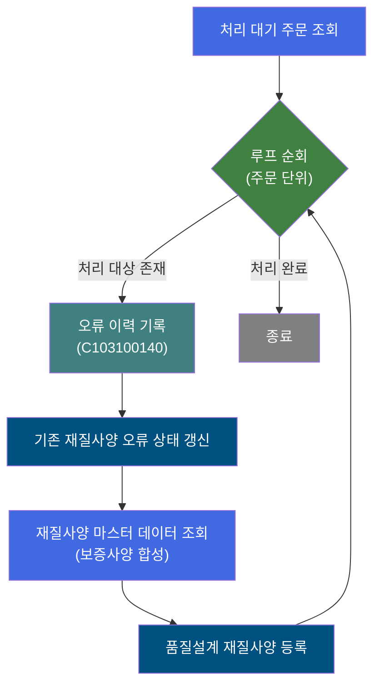
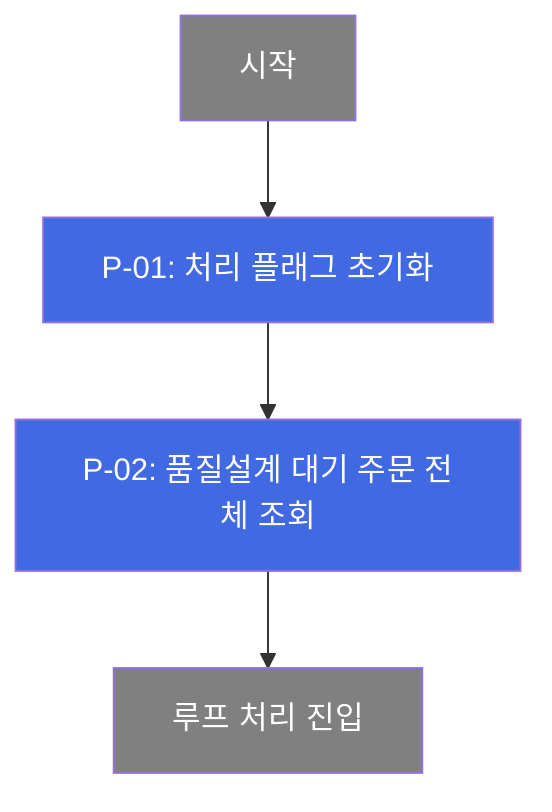
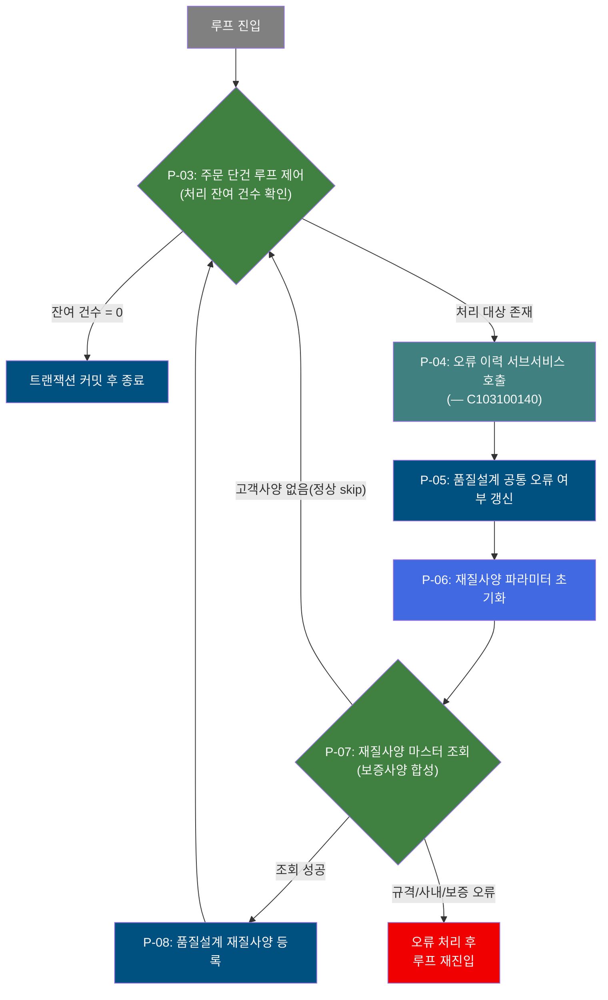
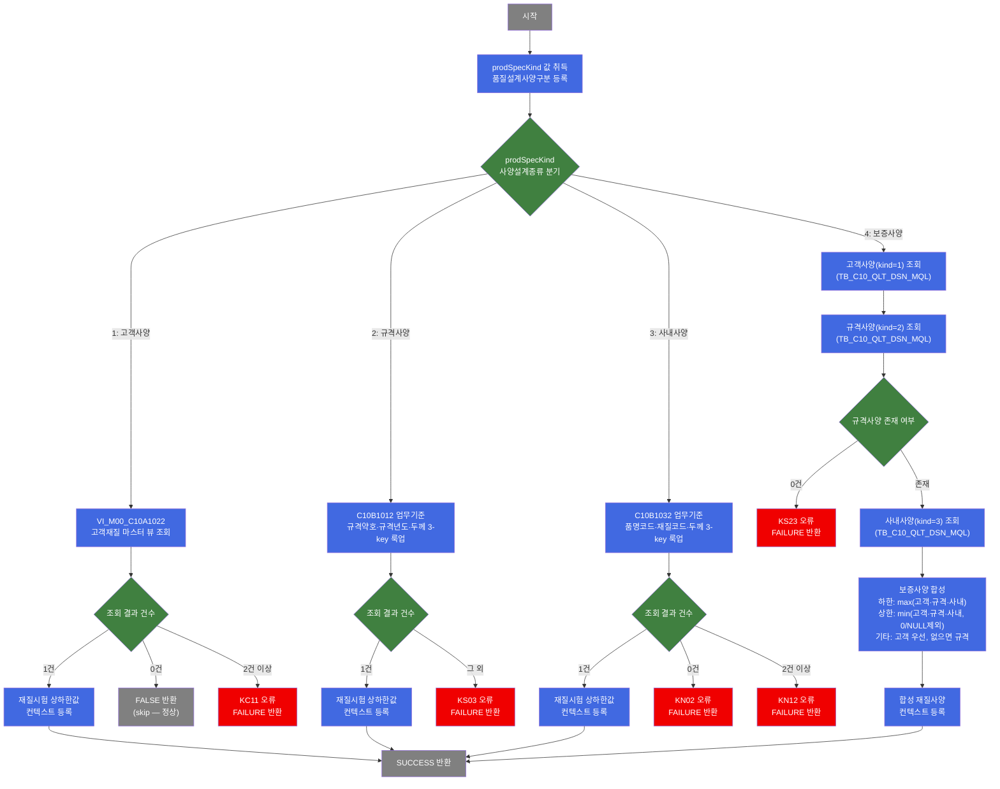

# C102100140 비즈니스 프로세스 분석서 (BPA)

## 1. 시스템 개요

| 항목 | 내용 |
|------|------|
| 서비스 ID | C102100140 |
| 업무명 | 품질설계 재질사양(MQL) 자동 편성 배치 |
| 서비스 타입 | nui |
| 분석 일시 | 2026-03-21 (KST) |
| 원본 분석일 | 2026-03-16 |
| 문서 버전 | 1.0 |

---

## 2. 시스템 목적

본 서비스는 품질설계 대기 상태의 주문에 대해 재질사양(MQL: Mechanical Quality Level)을 자동으로 편성하는 배치 처리 프로세스이다. 주문 수신 후 품질 담당자가 개별 주문을 수작업으로 처리하는 대신, 시스템이 자동으로 사양설계종류(보증사양)에 따른 재질 기준값을 마스터 데이터에서 조회하여 품질설계 결과 테이블에 등록한다.

처리 대상은 품질설계 공통 테이블에서 처리 대기 중인 주문 전체이며, 주문별로 고객사양·규격사양·사내사양을 합성하여 가장 엄격한 품질 기준(하한값 최대, 상한값 최소)을 자동 적용한다. 기존 재질사양이 없거나 오류가 발생한 주문에 대해서는 오류 코드를 기록하고 품질설계 에러 여부를 갱신한다.

이 서비스는 C10 모듈의 품질설계 자동화 배치 시리즈(C1021000xx) 중 보증사양 편성을 담당하며, 정기 배치 스케줄 또는 수동 기동을 통해 실행된다. 처리 결과는 후속 품질 검사 및 제조 지시 서비스에서 참조된다.

---

## 3. 핵심 워크플로우

---

## 4. 상세 워크플로우

### 프로세스 흐름도 — 주문 루프 초기화 및 대기 주문 조회 (P-01, P-02)

### 프로세스 흐름도 — 주문별 루프 처리 및 재질사양 편성 (P-03 ~ P-07)

---

## 5. 비즈니스 로직 상세

P-01: 처리 플래그 초기화 — 배치 처리 시작 전 공통 플래그 설정

- **입력**: 없음 (배치 기동 시 자동 실행)
- **처리**:
  1. 처리 구분 플래그를 초기 상태(C: Create)로 설정하여 신규 편성임을 명시
- **출력**: 프로세스 컨텍스트에 처리 구분값 등록
- **예외**: 없음

P-02: 품질설계 대기 주문 전체 조회 — TB_C10_QLT_DSN_CMN에서 처리 대상 목록 로드

- **입력**: 없음 (전체 대기 건 조회)
- **처리**:
  1. 품질설계 공통 테이블(TB_C10_QLT_DSN_CMN)에서 처리 대기 상태의 주문 전체를 조회
  2. 주문번호, 주문행번, 품질설계 상태코드, 공장유형, 제품코드, 사양 관련 정보 등을 조회 결과로 수집
- **출력**: 처리 대상 주문 목록(ResultSet) 컨텍스트에 보관
- **예외**: 조회 결과 0건이면 루프 없이 즉시 종료

P-03: 주문 단건 루프 제어 — 처리 잔여 건수 기반 루프 순회

- **입력**: P-02에서 조회된 주문 목록, 현재 처리 카운터
- **처리**:
  1. 처리 잔여 건수가 0이면 루프 종료 전이(exit) 반환
  2. 처리 잔여 건수가 있으면 현재 순서의 주문(주문번호, 주문행번)을 컨텍스트에 바인딩
  3. 루프 카운터를 1 감소시킨 후 후속 처리로 진행
  4. 오류 플래그(P_ERR_KEY), 품질설계 에러 여부(QLT_DSN_ERR_YN)를 초기화
- **출력**: 현재 처리 주문의 주문번호·주문행번·기타 사양 정보 컨텍스트에 세팅
- **예외**: 파라미터 설정 누락 시 처리 실패

P-04: 오류 이력 서브서비스 호출 [C103100140] — 품질설계 오류 코드 이력 기록

- **입력**: 현재 처리 중인 주문번호, 주문행번, 오류 코드(QLT_DSN_ERR_CD: TB03)
- **처리**:
  1. 오류 키(P_ERR_KEY)와 오류 코드(TB03)를 파라미터로 설정
  2. C103100140 서브서비스를 동일 트랜잭션 내에서 호출하여 오류 이력을 기록
- **출력**: C103100140 서비스에 의한 오류 이력 등록
- **예외**: 서브서비스 실패 시 전체 처리 실패로 전파

P-05: 품질설계 공통 오류 여부 갱신 — TB_C10_QLT_DSN_CMN 오류 플래그 UPDATE

- **입력**: 현재 주문번호, 주문행번
- **처리**:
  1. 품질설계 공통 테이블(TB_C10_QLT_DSN_CMN)에서 해당 주문의 품질설계 오류 여부(QLT_DSN_ERR_YN)를 'Y'로 갱신
  2. 감사 정보(최종 수정 객체, 프로그램 ID, 수정 일시)를 함께 갱신
- **출력**: TB_C10_QLT_DSN_CMN 오류 여부 플래그 갱신
- **예외**: 없음 (단건 UPDATE)

P-06: 재질사양 파라미터 초기화 — 이전 루프 잔존 데이터 클리어

- **입력**: 없음
- **처리**:
  1. 인장강도(TS), 항복점(YP), 연신율(ELGN), 경도(HRB), 탄성계수(ER) 등 재질시험 상하한값 파라미터 20개를 null로 초기화
  2. 도금량 시험 기준(MQL_BND_TST_STD_CD), 시험편 채취 위치/길이, TPG 등록번호, 표면 용접 전·후·합계 상하한값도 초기화
- **출력**: 컨텍스트 내 재질사양 파라미터 전체 null 설정
- **예외**: 없음

P-07: 재질사양 마스터 조회(보증사양 합성) — 사양설계종류별 마스터 데이터 조회 및 합성

- **입력**: 주문번호, 주문행번, 제품사양설계종류(prodSpecKind=4: 보증사양)
- **처리**:
  1. 품질설계사양구분을 보증사양(4)으로 등록
  2. **보증사양 합성**:
     - 고객사양(kind=1): 고객재질 마스터 뷰(VI_M00_C10A1022)에서 조회. 0건이면 skip, 2건 이상이면 오류
     - 규격사양(kind=2): 규격재질 업무기준(C10B1012)에서 규격약호·규격년도·주문환산두께 3-key 룩업. 1건 필수 (없으면 오류)
     - 사내사양(kind=3): 사내재질 업무기준(C10B1032)에서 품명코드·재질코드·주문환산두께 3-key 룩업. 없거나 중복이면 오류
  3. **합성 우선순위 규칙**:
     - 하한값(LLV): 고객·규격·사내 중 최대값 적용 (가장 엄격한 기준)
     - 상한값(ULV): 고객·규격·사내 중 최소값 적용 (0/NULL 제외, 가장 엄격한 기준)
     - 기타 컬럼: 고객사양 우선, 없으면 규격사양 적용
- **출력**: 합성된 재질사양 데이터 컨텍스트에 등록
- **예외**: 규격사양 없음 → KS23 오류 후 FAILURE, 사내사양 없음 → KN02 오류, 중복 → KN12 오류, 고객사양 중복 → KC11 오류

P-08: 품질설계 재질사양 등록 — TB_C10_QLT_DSN_MQL INSERT

- **입력**: 주문번호, 주문행번, P-07에서 합성된 재질사양 데이터 전체(23개 파라미터)
- **처리**:
  1. 인장강도(TS), 항복점(YP), 연신율(ELGN), 경도(HRB), 탄성계수(ER) 상하한값
  2. 도금량 시험 기준, 시험편 채취 위치·길이, TPG 등록번호
  3. 표면 용접 전면·후면·합계 상하한값
  4. 위 모든 항목을 품질설계 재질사양 테이블(TB_C10_QLT_DSN_MQL)에 신규 등록
- **출력**: TB_C10_QLT_DSN_MQL에 1건 INSERT
- **예외**: 없음 (성공 후 P-03 루프로 복귀)

---

## 6. 커스텀 클래스 워크플로우

### DbQualDesignLoop (약 171줄)

**역할**: 이전 액티비티가 조회한 주문 목록(ResultSet)을 1건씩 순회하기 위한 루프 제어 액티비티. 처리 잔여 건수가 0이 되면 루프를 종료한다.

처리 건수가 많을수록 매 루프마다 전체 ResultSet을 재탐색하는 방식으로 동작하며(O(n²) 특성), 배치 대상 건수가 과다할 경우 성능에 주의가 필요하다. 200줄 미만이므로 Mermaid 다이어그램은 생략한다.

---

### DbSearchMechData (약 497줄)

**역할**: 제품사양설계종류에 따라 고객사양·규격사양·사내사양 마스터를 조회하고, 보증사양의 경우 세 가지 사양을 합성하여 가장 엄격한 재질 기준값을 편성하는 핵심 비즈니스 로직 액티비티.

---

## 7. 주요 유즈케이스

UC-01: 보증사양 기반 재질사양 자동 편성

- **Actor**: 배치 스케줄러 (자동 기동)
- **목적**: 품질설계 대기 주문에 대해 고객·규격·사내 사양을 합성하여 보증사양 재질 기준을 자동 등록
- **주요 흐름**:
  1. 품질설계 공통 테이블에서 처리 대기 주문 전체를 조회
  2. 각 주문에 대해 오류 이력 기록 서브서비스 호출
  3. 품질설계 오류 여부를 'Y'로 갱신 (처리 중 상태 표시)
  4. 고객사양·규격사양·사내사양 마스터를 각각 조회하여 보증사양 합성
  5. 합성된 재질사양을 품질설계 재질사양 테이블에 신규 등록
  6. 모든 대기 주문 처리 완료 후 트랜잭션 커밋
- **예외**: 규격사양 마스터 없음 → KS23 오류 기록 후 해당 주문 skip, 처리 계속

UC-02: 규격사양 조회 실패 시 오류 이력 기록

- **Actor**: 배치 스케줄러 (자동 기동)
- **목적**: 규격/사내사양 마스터 누락 또는 중복 데이터로 인해 재질사양 편성이 불가한 경우 오류 정보를 기록
- **주요 흐름**:
  1. 보증사양 합성 중 규격사양 조회 결과가 0건임을 감지
  2. KS23 오류 코드로 FAILURE 반환
  3. 오류 이력이 C103100140 서브서비스를 통해 기록됨
  4. 해당 주문에 품질설계 에러 플래그 설정 후 다음 주문으로 루프 계속
- **예외**: 오류 이력 기록 서브서비스 자체 실패 시 전체 배치 중단

UC-03: 고객사양 없는 주문의 정상 skip 처리

- **Actor**: 배치 스케줄러 (자동 기동)
- **목적**: 고객사양이 존재하지 않는 주문에 대해 오류 없이 건너뛰어 배치 연속성을 유지
- **주요 흐름**:
  1. 재질사양 마스터 조회에서 고객사양(kind=1) 조회 결과 0건 감지
  2. FALSE 반환 (오류 아님, 정상 skip 전이)
  3. 해당 주문의 재질사양 등록 없이 루프 다음 건으로 진행
- **예외**: 고객사양이 2건 이상이면 KC11 오류로 FAILURE 처리됨

---

## 9. 관련 엔티티

### 엔티티 목록

| 엔티티(테이블) | 설명 | 사용 유형 |
|---------------|------|----------|
| TB_C10_QLT_DSN_CMN | 품질설계 공통 정보 (주문별 품질설계 상태·사양 정보) | 조회, 갱신 |
| TB_C10_QLT_DSN_MQL | 품질설계 재질사양 (기계적 시험 기준값) | 조회(보증합성), 저장 |
| VI_M00_C10A1022 | 고객재질 마스터 뷰 (M00APUSER 스키마) | 조회 |

### 엔티티 간 관계
- TB_C10_QLT_DSN_CMN과 TB_C10_QLT_DSN_MQL은 주문번호·주문행번으로 연결되며, 하나의 주문에 대해 사양설계종류별 여러 재질사양 레코드가 등록될 수 있다
- VI_M00_C10A1022는 M00APUSER 스키마의 고객재질 마스터 뷰로, 고객사양(kind=1) 조회 시에만 참조된다
- TB_C10_QLT_DSN_MQL은 보증사양(kind=4) 합성 시 이미 등록된 고객·규격·사내 사양 데이터를 재조회하는 소스로도 사용된다

---

## 10. 서브서비스

| 서비스 ID | 설명 | 호출 시점 | 트랜잭션 | BPA 문서 |
|-----------|------|---------|---------|---------|
| C103100140 | 품질설계 오류 코드 이력 기록 | P-04: 루프 내 주문별 오류 이력 기록 시 | 공유 (new-transaction: false) | 미작성 |

---

## 11. 특이사항 및 주의사항

### 1. 보증사양 합성의 복잡성
보증사양(kind=4) 처리는 고객·규격·사내 세 가지 사양을 각각 조회한 뒤 합성하는 복합 로직이다. 하한값은 세 값 중 최대(max), 상한값은 0/NULL을 제외한 최소(min)를 적용하여 가장 엄격한 품질 기준을 자동 선택한다. 이 로직의 올바른 동작을 위해 규격사양 마스터(C10B1012) 데이터의 사전 등록이 필수 전제 조건이다.

### 2. 고객사양 없음(FALSE 반환) 설계 의도
DbSearchMechData에서 고객사양(kind=1) 조회 결과가 0건일 때는 오류가 아닌 FALSE를 반환하여 해당 주문의 재질사양 등록을 생략하고 루프를 계속 진행하도록 설계되어 있다. 반면 규격사양 미존재는 KS23 오류로 처리하여 명확하게 구분한다. 이는 고객사양이 선택적 데이터인 반면 규격사양은 품질 기준상 필수 데이터임을 반영한다.

### 3. 루프 제어 액티비티(DbQualDesignLoop)의 성능 특성
루프 처리 시 매 건마다 ResultSet을 처음부터 재탐색하는 방식(O(n²))을 사용한다. 처리 대상 주문이 100건이면 최대 5,050회의 Row 탐색이 발생한다. 배치 대상 주문 건수가 대량으로 증가할 경우 처리 시간이 급증할 수 있으므로 모니터링이 필요하다.

### 4. 오류 발생 주문의 플래그 갱신 방식
각 주문 처리 루프 진입 시마다 품질설계 오류 여부(QLT_DSN_ERR_YN)를 'Y'로 갱신하는 방식을 채택하고 있다. 재질사양 등록이 성공하면 후속 서비스에서 오류 여부를 정상으로 재갱신하는 구조로, 오류 발생 시 'Y' 상태가 유지된다.

### 5. 서브서비스 트랜잭션 공유
C103100140 오류 이력 서브서비스는 메인 서비스와 동일 트랜잭션(new-transaction: false)으로 호출된다. 따라서 재질사양 등록 실패 등 이후 단계에서 롤백이 발생하면 오류 이력 기록도 함께 롤백된다.
