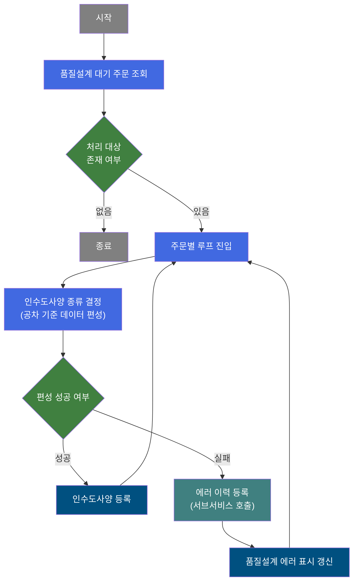
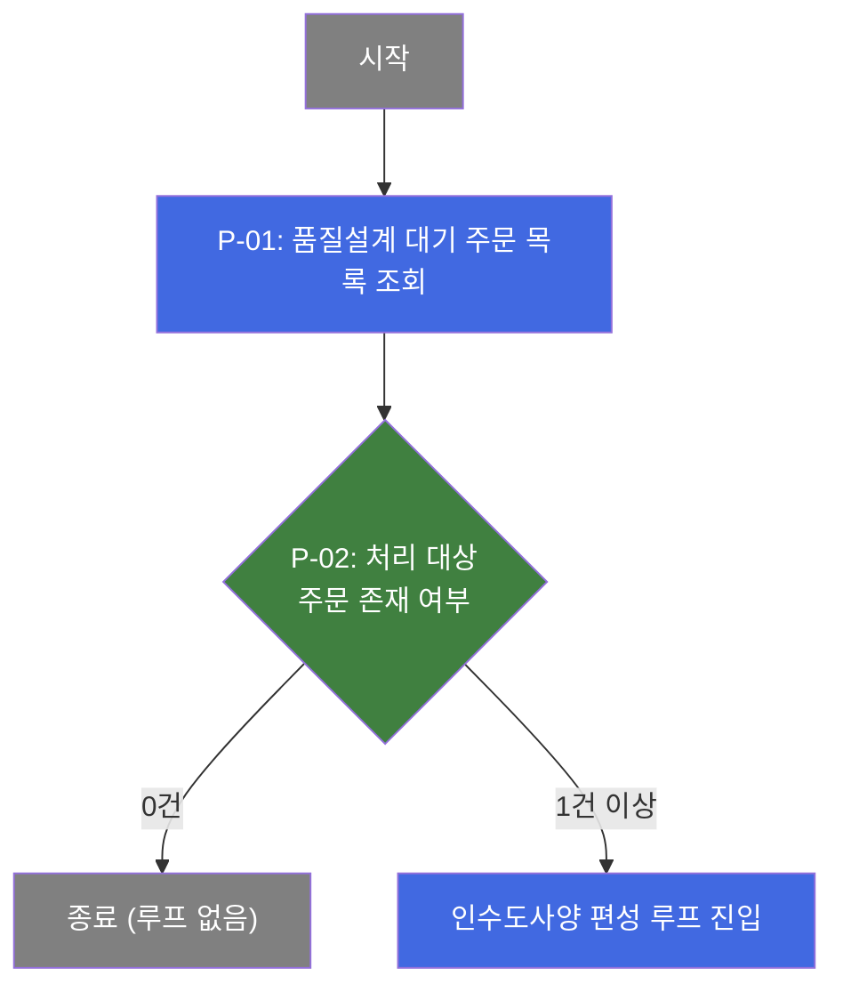
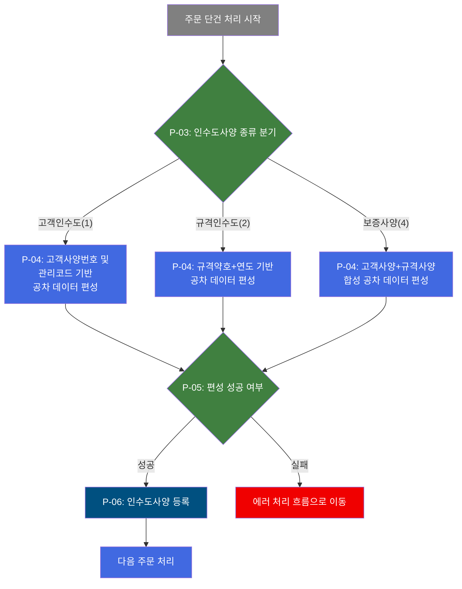
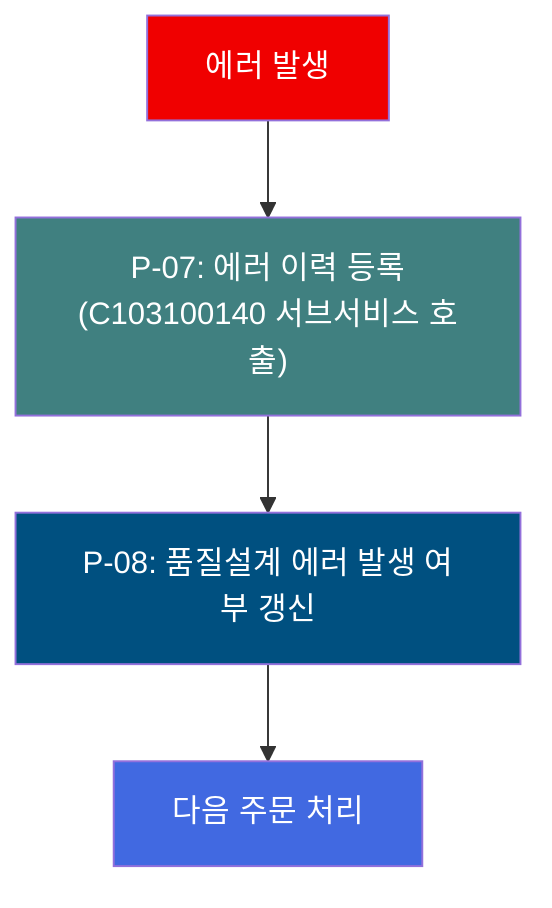
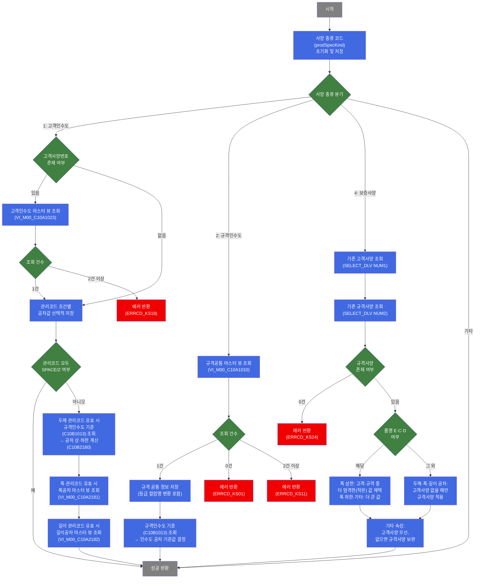

# C102100150 비즈니스 프로세스 분석서 (BPA)

## 1. 시스템 개요

| 항목 | 내용 |
|------|------|
| 서비스 ID | C102100150 |
| 업무명 | 품질설계 인수도사양 자동 편성 (배치) |
| 서비스 타입 | nui |
| 분석 일시 | 2026-03-21 (KST) |
| 원본 분석일 | 2026-03-16 |
| 문서 버전 | 1.0 |

---

## 2. 시스템 목적

본 서비스는 품질설계 대기 상태의 주문에 대해 인수도사양(납품 검사 시 적용되는 두께·폭·길이 허용 공차 기준)을 자동으로 편성하는 배치 프로세스이다. 수동 입력 없이 주문 속성(사양 종류, 규격, 고객 코드 등)에 따라 마스터 데이터에서 공차 기준값을 조회하고, 그 결과를 품질설계 인수도 테이블에 등록한다.

인수도사양은 크게 세 종류로 구분된다. 고객인수도사양은 특정 고객과 합의된 별도 사양으로 고객사양번호를 기준으로 마스터를 조회하고, 관리코드에 따라 두께·폭·길이 공차를 계산·적용한다. 규격인수도사양은 KS·JIS 등 공개 표준 규격을 기준으로 규격약호와 연도를 조합하여 공차를 결정한다. 보증사양은 고객사양과 규격사양을 합성하여 보증 공차를 산출하며, 고객사양을 우선 적용하고 미존재 시 규격사양을 보완한다.

처리 도중 인수도사양 편성에 실패한 주문은 서브서비스(C103100140)를 통해 품질설계 에러 이력을 등록하고, 해당 주문의 품질설계 공통 정보에 에러 발생 여부를 갱신한다. 배치 특성상 인간의 개입 없이 전체 대기 주문을 순차 처리하며, 건별 성공·실패 여부를 독립적으로 관리한다.

---

## 3. 핵심 워크플로우

---

## 4. 상세 워크플로우

### 프로세스 흐름도 — 대기 주문 조회 및 루프 진입 (P-01, P-02)

### 프로세스 흐름도 — 인수도사양 편성 (P-03, P-04, P-05, P-06)

### 프로세스 흐름도 — 에러 처리 (P-07, P-08)

---

## 5. 비즈니스 로직 상세

P-01: 품질설계 대기 주문 목록 조회 — 처리 대상 주문 전체 선택

- **입력**: 없음 (시스템 전체 대기 상태 기준)
- **처리**:
  1. 품질설계 공통 정보(TB_C10_QLT_DSN_CMN)에서 대기 상태인 주문 목록 전건 조회
  2. 주문번호, 주문행번, 품질설계 상태코드, 제품 속성 일체 포함하여 처리 큐에 적재
- **출력**: 처리 대상 주문 목록
- **예외**: 해당 없음 (0건이면 처리 없이 종료)

P-02: 처리 대상 주문 존재 여부 — 루프 진입 판단

- **입력**: P-01에서 조회된 주문 목록
- **처리**:
  1. 조회 결과 건수 확인
  2. 0건이면 배치 처리 종료
  3. 1건 이상이면 주문 단건 순차 처리 루프 시작
- **출력**: 처리 계속 여부 결정
- **예외**: 해당 없음

P-03: 인수도사양 종류 분기 — 사양 편성 경로 결정

- **입력**: 현재 처리 주문의 사양 종류 코드
- **처리**:
  1. 사양 종류 코드에 따라 처리 경로 분기
     - 값 `1`: 고객인수도사양 편성 경로
     - 값 `2`: 규격인수도사양 편성 경로
     - 값 `4`: 보증사양 편성 경로
  2. 위 세 값 이외인 경우: 해당 경로 없이 성공 처리
  3. 처리 전 두께·폭·길이 공차 파라미터를 null로 초기화
- **출력**: 분기된 처리 경로
- **예외**: 해당 없음

P-04: 인수도사양 공차 데이터 편성 — 사양 종류별 마스터 조회 및 공차 계산

- **입력**: 주문 속성 (고객사양번호, 규격약호, 규격연도, 두께·폭·길이 관리코드, 환산 치수 등)
- **처리 (고객인수도사양, 종류=1)**:
  1. 고객사양번호가 있으면 고객인수도 마스터 뷰(VI_M00_C10A1023) 조회하여 공차 초기값 설정
     - 조회 결과 2건 이상: 에러 (ERRCD_KS18)
  2. 두께·폭·길이 관리코드 모두 공백 또는 'Z'이면 마스터 미적용 후 성공 반환
  3. 두께 관리코드가 유효하면 규격인수도 기준(C10B1013) 조회 후 두께 공차 상·하한 계산 (C10B2180)
     - 조회 결과 2건 이상: 에러 (ERRCD_KS21), 0건: 에러 (ERRCD_KS30)
  4. 폭 관리코드가 유효하면 폭공차 마스터 뷰(VI_M00_C10A2181) 조회하여 폭 공차 상·하한 설정
     - 조회 결과 2건 이상: 에러 (ERRCD_KS19), 0건: 에러 (ERRCD_KS09)
  5. 길이 관리코드가 유효하면 길이공차 마스터 뷰(VI_M00_C10A2182) 조회하여 길이 공차 상·하한 설정
     - 조회 결과 2건 이상: 에러 (ERRCD_KS20), 0건: 에러 (ERRCD_KS10)
- **처리 (규격인수도사양, 종류=2)**:
  1. 규격약호·연도 조합으로 규격공통 마스터 뷰(VI_M00_C10A1010) 조회하여 규격 공통 정보 전체 적용
     - 등급 컬럼(GRA)은 주문 등급(ORD_GRA)으로 컬럼명 변환하여 저장
     - 조회 결과 2건 이상: 에러 (ERRCD_KS11), 0건: 에러 (ERRCD_KS01)
  2. 규격인수도 기준(C10B1013) 조회하여 규격인수도 공차 기준값 결정
     - 조회 결과 2건 이상: 에러 (ERRCD_KS21), 0건 또는 예외: 에러 (ERRCD_KS30)
- **처리 (보증사양, 종류=4)**:
  1. 기존 고객사양 조회(SELECT_DLV) 후 컨텍스트에 적재
  2. 기존 규격사양 조회(SELECT_DLV), 0건이면 에러 (ERRCD_KS24)
  3. 고객사양과 규격사양을 합성하여 최종 공차 결정:
     - 두께 공차: 고객사양 상·하한 둘 다 없으면 규격사양 적용 (더 큰 값)
     - 폭 공차 (품명 E·C·D): 하한은 더 큰 값, 상한은 양쪽 모두 존재 시 더 엄격한(작은) 값 채택
     - 폭 공차 (그 외 품명): 고객사양 상·하한 둘 다 없으면 규격사양 적용 (더 큰 값)
     - 길이 공차: 고객사양 상·하한 둘 다 없으면 규격사양 적용 (더 큰 값)
     - 기타 속성: 고객사양 값이 없을 때만 규격사양 값으로 보완
- **출력**: 두께·폭·길이 공차 상·하한 및 기타 사양 속성 (처리 컨텍스트에 저장)
- **예외**: 마스터 조회 건수 불일치 또는 기준 데이터 미존재 시 해당 에러 코드와 함께 FAILURE 반환

P-05: 편성 성공 여부 — 인수도사양 등록 또는 에러 처리 분기

- **입력**: P-04 처리 결과 및 에러 플래그
- **처리**:
  1. 에러 플래그(P_ERR_KEY) 값 확인
  2. 정상이면 인수도사양 등록(P-06) 진행
  3. 에러이면 에러 처리 흐름(P-07)으로 전환
- **출력**: 처리 경로 결정
- **예외**: 해당 없음

P-06: 인수도사양 등록 — 편성된 공차 데이터 저장

- **입력**: P-04에서 편성된 두께·폭·길이 공차 및 사양 속성 전체
- **처리**:
  1. 주문번호·주문행번 기준으로 품질설계 인수도 테이블(TB_C10_QLT_DSN_DLV)에 신규 INSERT
  2. 두께·폭·길이 공차 상·하한, 파동·뒤틀림·대각선 차이 상한, 경사도 상한, 허용공차 등 17개 항목 저장
- **출력**: TB_C10_QLT_DSN_DLV에 인수도사양 1건 등록
- **예외**: DB 오류 시 해당 주문 처리 실패

P-07: 에러 이력 등록 — C103100140 서브서비스 호출

- **입력**: 에러 발생 주문 정보 및 에러 코드 (TB04 고정)
- **처리**:
  1. 에러 플래그를 'N'으로 설정하고 에러 코드를 'TB04'로 지정
  2. C103100140 서브서비스를 동일 트랜잭션 내에서 호출하여 품질설계 에러 이력 등록
- **출력**: 에러 이력 등록 완료
- **예외**: 서브서비스 호출 실패 시 이력 누락 가능

P-08: 품질설계 에러 발생 여부 갱신 — 공통 정보 업데이트

- **입력**: 에러가 발생한 주문번호·주문행번
- **처리**:
  1. TB_C10_QLT_DSN_CMN 테이블의 해당 주문에 대해 품질설계 에러 발생 여부(QLT_DSN_ERR_YN)를 'Y'로 갱신
- **출력**: TB_C10_QLT_DSN_CMN 에러 표시 업데이트
- **예외**: 해당 없음

---

## 6. 커스텀 클래스 워크플로우

### DbSearchDeliSpec (약 693줄)

**역할**: 품질설계 배치 프로세스에서 사양 종류(고객/규격/보증)에 따라 마스터 데이터를 조회하고 인수도 공차 기준값을 편성하는 핵심 처리 클래스.

---

### DbQualDesignLoop (약 171줄)

**역할**: 이전 단계에서 조회된 주문 목록을 1건씩 순차 처리하기 위한 루프 제어 액티비티. 처리 건수 카운터를 관리하고, 남은 주문이 없으면 루프를 종료한다. C102100020~C102100160, B10R/B10S 시리즈 등 40개 이상의 서비스에서 공통 사용되는 범용 컴포넌트이다.

---

## 7. 주요 유즈케이스

UC-01: 품질설계 대기 주문에 대한 인수도사양 자동 편성

- **Actor**: 배치 스케줄러 (자동 실행)
- **목적**: 대기 상태 주문 전건에 대해 인수도 공차 기준을 자동 결정하고 등록
- **주요 흐름**:
  1. 품질설계 공통 정보에서 대기 주문 전건 조회
  2. 주문별 사양 종류 코드에 따라 마스터 데이터에서 공차 기준값 편성
  3. 편성된 공차 데이터를 인수도사양 테이블에 INSERT
  4. 전체 주문 처리 완료 후 종료
- **예외**: 마스터 데이터 미존재 또는 중복 조회 시 에러 이력 등록 후 다음 주문 처리 계속

UC-02: 인수도사양 편성 실패 주문의 에러 이력 관리

- **Actor**: 배치 스케줄러 (자동 실행)
- **목적**: 공차 편성에 실패한 주문에 대해 에러 원인을 기록하고 품질설계 상태를 에러 표시로 갱신
- **주요 흐름**:
  1. 인수도사양 편성 실패 감지 (마스터 조회 오류, 건수 불일치 등)
  2. C103100140 서브서비스를 통해 품질설계 에러 이력 등록 (에러 코드 TB04)
  3. 품질설계 공통 정보(TB_C10_QLT_DSN_CMN)의 에러 발생 여부 'Y'로 갱신
  4. 에러 처리 완료 후 다음 주문 처리로 복귀
- **예외**: 에러 이력 등록 실패 시 해당 주문 이력 누락 가능

UC-03: 보증사양 합성 — 고객사양과 규격사양의 우선순위 적용

- **Actor**: 배치 스케줄러 (자동 실행)
- **목적**: 보증사양 유형 주문에 대해 고객사양과 규격사양을 합성하여 최종 보증 공차 결정
- **주요 흐름**:
  1. 기존 고객사양 및 규격사양을 각각 조회
  2. 두께·길이 공차: 고객사양 값이 없을 때만 규격사양 적용
  3. 폭 공차 (품명 E·C·D): 상한은 더 엄격한 값, 하한은 더 큰 값 적용
  4. 기타 속성: 고객사양 우선, 없으면 규격사양으로 보완
- **예외**: 규격사양 0건이면 에러 (ERRCD_KS24)

---

## 9. 관련 엔티티

### 엔티티 목록

| 엔티티(테이블) | 설명 | 사용 유형 |
|---------------|------|----------|
| TB_C10_QLT_DSN_CMN | 품질설계 공통 정보 — 주문별 품질설계 대기 상태 및 기본 속성 관리 | 조회, 갱신 |
| TB_C10_QLT_DSN_DLV | 품질설계 인수도사양 — 주문별 두께·폭·길이 공차 기준 저장 | 저장 |
| VI_M00_C10A1023 | 고객인수도 마스터 뷰 (M00APUSER) — 고객사양번호 기준 공차 기준값 | 조회 |
| VI_M00_C10A1010 | 규격공통 마스터 뷰 (M00APUSER) — 규격약호·연도 기준 공통 규격 정보 | 조회 |
| VI_M00_C10A2181 | 폭공차 마스터 뷰 (M00APUSER) — 폭 관리코드 기준 폭 공차 상·하한 | 조회 |
| VI_M00_C10A2182 | 길이공차 마스터 뷰 (M00APUSER) — 길이 관리코드 기준 길이 공차 상·하한 | 조회 |

### 엔티티 간 관계

- TB_C10_QLT_DSN_CMN과 TB_C10_QLT_DSN_DLV는 주문번호·주문행번을 공유하며, 공통 정보 기준으로 인수도사양이 편성된다.
- VI_M00_C10A1023, VI_M00_C10A2181, VI_M00_C10A2182, VI_M00_C10A1010은 M00APUSER 스키마의 마스터 뷰로, TB_C10_QLT_DSN_DLV에 저장할 공차 기준값을 제공한다.
- TB_C10_QLT_DSN_CMN의 에러 표시 여부는 에러 발생 시 갱신되며, 에러 이력 상세는 C103100140 서브서비스를 통해 별도 테이블에 기록된다.

---

## 10. 서브서비스

| 서비스 ID | 설명 | 호출 시점 | 트랜잭션 | BPA 문서 |
|-----------|------|---------|---------|---------|
| C103100140 | 품질설계 에러 이력 등록 | 인수도사양 편성 실패 시 (P-07) | 공유 (new-transaction: false) | 미작성 |

---

## 11. 특이사항 및 주의사항

### 1. 보증사양 폭 상한 강화 로직 (품명 E·C·D)
2024년 6월 13일 변경 이력이 코드에 명시되어 있다. 아연도금 계열 제품(EGI, 구매CR, F/H 품명)에 대해 폭 상한 공차는 고객사양과 규격사양 중 더 작은(엄격한) 값을 채택한다. 이는 해당 품종의 폭 치수 품질 기준을 강화하기 위한 의도적 설계이며, 다른 품명의 폭 상한 처리(고객사양 우선)와 로직이 상이하다.

### 2. 고객인수도 길이공차 저장 버그 의심 (라인 389)
고객인수도사양(종류=1)의 길이 관리코드 처리 블록 내부에서, 길이 공차를 컨텍스트에 저장하는 조건문이 `ord_lth_mng_cd`(길이) 대신 `ord_wth_mng_cd`(폭)를 참조하고 있다. 폭 관리코드가 공백·Z이면서 길이 관리코드만 유효한 주문의 경우, 길이 공차 저장이 누락될 가능성이 있다. 실제 영향 범위 확인이 필요하다.

### 3. 루프 처리 성능 제약 (O(n²) 탐색 방식)
DbQualDesignLoop 클래스는 매 루프마다 ResultSet 커서를 처음부터 재탐색하는 방식(bindSet.reset() + while 전체 순회)을 사용한다. 처리 건수 n에 대해 최대 n*(n+1)/2회 탐색이 발생하며, 100건 처리 시 약 5,050회의 탐색이 수행된다. 대량 주문이 동시에 대기 상태로 유입될 경우 배치 처리 시간이 급격히 증가할 수 있다.

### 4. 에러 발생 시 계속 처리 방침
개별 주문의 인수도사양 편성 실패가 전체 배치를 중단시키지 않는다. 에러 발생 주문은 에러 이력 등록 및 에러 표시 갱신 후 다음 주문 처리로 복귀한다. 이는 단일 주문 오류로 인한 전체 처리 불가를 방지하는 설계이나, 에러 주문에 대한 사후 모니터링이 필요하다.

### 5. 마스터 데이터 조회 건수 엄격 검증
인수도사양 편성에 사용되는 모든 마스터 뷰 조회에서 1건 초과 시 에러로 처리한다. 마스터 데이터의 중복 등록은 즉시 에러 코드(KS01~KS30 범위)를 발생시키며, 공차 기준의 모호성으로 인한 잘못된 사양 등록을 사전 차단한다.
