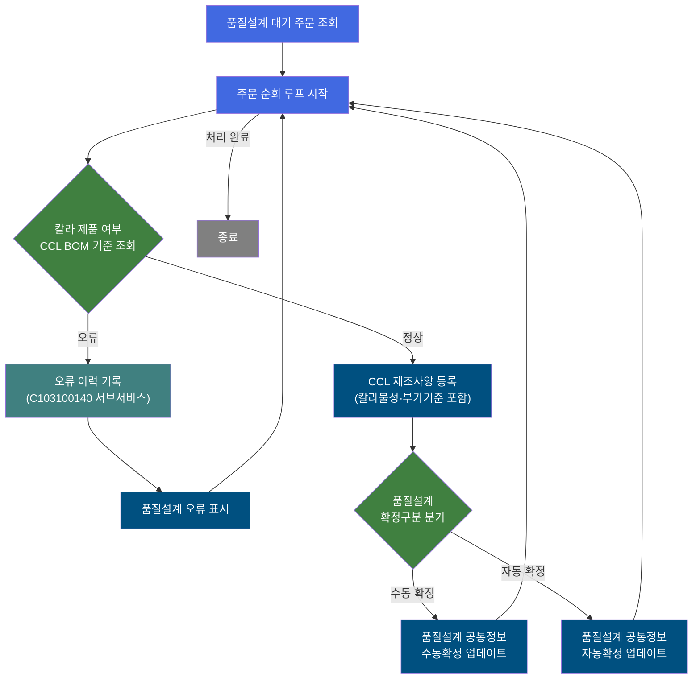
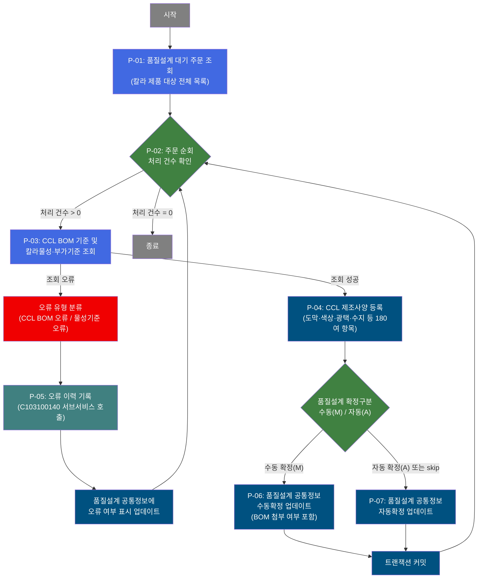
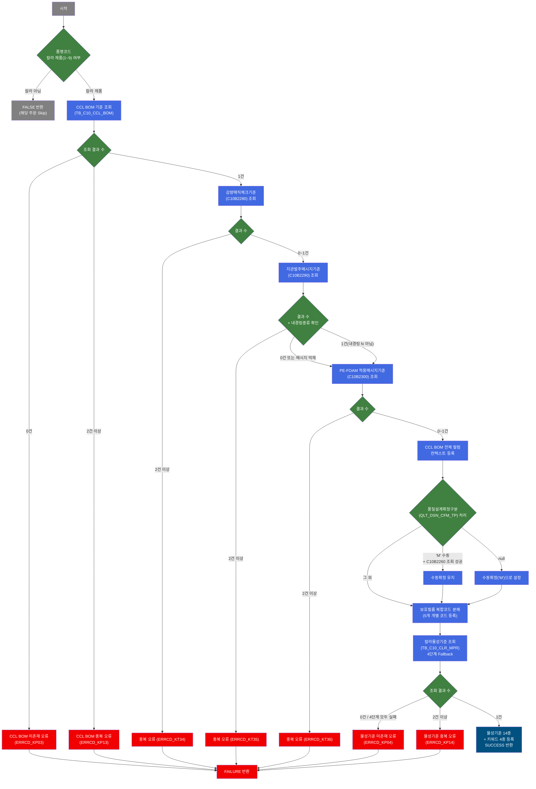

# C102100160 비즈니스 프로세스 분석서 (BPA)

## 1. 시스템 개요

| 항목 | 내용 |
|------|------|
| 서비스 ID | C102100160 |
| 업무명 | 칼라강판(CCL) 품질설계 자동 편성 |
| 서비스 타입 | nui |
| 분석 일시 | 2026-03-21 (KST) |
| 원본 분석일 | 2026-03-16 |
| 문서 버전 | 1.0 |

---

## 2. 시스템 목적

C102100160 서비스는 칼라강판(CCL) 제품에 대한 품질설계 자동 편성 배치 프로세스이다. 품질설계 대기 상태의 주문들을 일괄 조회하고, 각 주문에 대해 CCL BOM 기준 데이터를 탐색하여 도막·색상·광택·수지·코팅방법 등 180여 개 항목으로 구성된 칼라 제조사양(CCL BOM 품질설계)을 자동으로 생성·등록한다.

품질설계확정구분(수동/자동)에 따라 적용 규칙이 달라지며, 감량매직체크·지관발주메시지·PE-FOAM 적용메시지 등 부가 마스터 기준도 동시에 조회하여 설계 정보에 반영한다. 칼라물성기준(색차, 경도, MEK, Bending 등 시험기준)은 최종수요가·주문용도 조합으로 4단계 Fallback 조회를 통해 결정된다.

설계 중 CCL BOM 참조 불가, 물성기준 미존재 등의 오류가 발생하면 서브서비스(C103100140)를 통해 오류 이력을 기록하고 해당 주문에 오류 표시를 남긴 후 다음 주문 처리를 계속한다. 이 서비스는 정기 배치로 실행되어 수동 개입 없이 대량 주문에 대한 품질설계를 자동으로 완성하는 역할을 한다.

---

## 3. 핵심 워크플로우

---

## 4. 상세 워크플로우

### 프로세스 흐름도 — CCL 품질설계 자동 편성 (P-01, P-02, P-03, P-04, P-05)

---

## 5. 비즈니스 로직 상세

P-01: 품질설계 대기 주문 조회 — 칼라 제품 대상 품질설계 처리 대기 주문 일괄 조회

- **입력**: 없음 (배치 자동 기동)
- **처리**:
  1. 품질설계공통(TB_C10_QLT_DSN_CMN)에서 처리 대기 상태의 주문을 전체 조회
  2. 조회 결과를 루프 처리용 ResultSet으로 보관
  3. 초기 에러 플래그를 초기화('C' 상태로 설정)
- **출력**: 대기 주문 목록 (주문번호, 주문라인, 품명코드, 제품형태, 고객사코드 등 포함)
- **예외**: 해당 없음 (결과 0건이면 루프 즉시 종료)

P-02: 주문 순회 — 대기 주문 목록을 1건씩 순차 처리

- **입력**: P-01에서 조회한 대기 주문 ResultSet
- **처리**:
  1. 남은 처리 건수를 확인하여 0건이면 루프 종료
  2. 처리 건수 > 0이면 현재 처리 대상 주문의 컨텍스트 데이터를 바인딩 (주문번호, 주문라인, 품명코드, 고객사코드, CCL BOM번호, 품질설계확정구분 등 21개 항목)
  3. 건별 에러 플래그(P_ERR_KEY, 품질설계오류여부)를 초기화
  4. 처리 건수를 1 감소 후 다음 단계로 진행
- **출력**: 현재 처리 주문의 모든 컨텍스트 데이터 설정
- **예외**: param-count 미설정 시 실패 처리

P-03: CCL BOM 기준 및 칼라물성·부가기준 조회 — CCL BOM 및 4종 마스터 기준 조회

- **입력**: 현재 처리 주문의 품명코드, CCL BOM번호, 고객사코드, 최종수요가코드, 주문용도코드 등
- **처리**:
  1. 품명코드(PRD_NM_CD)가 칼라 제품(1~9)이 아닌 경우 해당 주문 Skip
  2. CCL BOM 기준(TB_C10_CCL_BOM)에서 CCL BOM번호로 기준 데이터 단건 조회
     - 0건이면 CCL BOM 오류(ERRCD_KP03) → P-05로 이동
     - 2건 이상이면 중복 오류(ERRCD_KP13) → P-05로 이동
  3. 감량매직체크기준(C10B2280) EasyAccess 조회 (0건 허용)
  4. 지관발주메시지기준(C10B2290) EasyAccess 조회 (0건 허용, 내경링종류가 'N'이면 메시지 억제)
  5. PE-FOAM 적용메시지기준(C10B2300) EasyAccess 조회 (0건 허용)
  6. CCL BOM 전체 컬럼을 컨텍스트에 등록 및 품질설계확정구분 결정:
     - 수동확정기준(C10B2260) 조회 성공이면 수동확정 유지
     - 확정구분 null이면 수동확정('M')으로 기본값 설정
  7. 보호필름 복합코드를 5개 개별 코드(광택/무광·두께·재질·강판접착·제품접착)로 분해 등록
  8. 칼라물성기준(TB_C10_CLR_MPR)을 4단계 Fallback 조회:
     - 1단계: CCL BOM번호 + 최종수요가 + 주문용도
     - 2단계(0건): 주문용도를 '******'로 대체 재조회
     - 3단계(0건): 최종수요가를 '******'로 대체, 주문용도 원래값으로 복원 재조회
     - 4단계(0건): 최종수요가·주문용도 모두 '******'로 대체 재조회
     - 4단계도 0건이면 물성기준 오류(ERRCD_KP04) → P-05로 이동
     - 2건 이상이면 중복 오류(ERRCD_KP14) → P-05로 이동
     - 1건 조회 성공 시: 물성기준 14종 + 키워드 4종 등록
- **출력**: CCL BOM 기준, 칼라물성기준, 부가 메시지 텍스트 전체를 컨텍스트에 설정
- **예외**: CCL BOM/물성기준 조회 오류 시 → P-05 오류처리 경로로 분기

P-04: CCL 제조사양 등록 — 180여 항목의 칼라 제조사양을 신규 등록

- **입력**: P-03에서 컨텍스트에 설정된 CCL 설계 데이터 전체 (코팅방법, 색상, 도막두께, 광택도, 수지종류, 라미나, 프린트, 물성기준 등)
- **처리**:
  1. 품질설계 CCL BOM(TB_C10_QLT_DSN_CCL_BOM)에 설계 데이터 신규 INSERT
  2. 주문번호·주문라인을 기준으로 176개 항목을 일괄 저장
  3. 일부 파라미터는 복합코드에서 부분 추출(SUBSTR)하여 저장
- **출력**: TB_C10_QLT_DSN_CCL_BOM에 칼라 제조사양 1건 등록
- **예외**: INSERT 실패 시 트랜잭션 롤백

P-05: 오류 이력 기록 — 서브서비스를 통한 오류 이력 기록 및 오류 표시

- **입력**: 오류 유형 코드(TB01: CCL BOM 관련 / TB07: 기타 오류), 현재 처리 주문의 주문번호·주문라인
- **처리**:
  1. 오류 플래그(P_ERR_KEY = 'Y') 및 오류 코드(QLT_DSN_ERR_CD)를 설정
  2. 서브서비스 C103100140을 호출하여 품질설계 오류 이력 테이블에 기록
  3. 품질설계공통(TB_C10_QLT_DSN_CMN)의 해당 주문에 오류 여부(QLT_DSN_ERR_YN = 'Y') 업데이트
- **출력**: 오류 이력 기록(C103100140 처리 결과), TB_C10_QLT_DSN_CMN 오류 표시 갱신
- **예외**: 오류 처리 후 다음 주문 처리 계속 (루프 유지)

P-06: 품질설계 공통정보 수동확정 업데이트 — 수동확정 주문의 공통정보 갱신

- **입력**: 현재 처리 주문의 품질설계 공통정보 (색상, 도막, 광택, 수지, 코팅방법, BOM 첨부 여부 등 16개 항목)
- **처리**:
  1. 품질설계공통(TB_C10_QLT_DSN_CMN)에서 해당 주문의 공통 정보를 업데이트
  2. 품질설계확정구분(QLT_DSN_CFM_TP), BOM 첨부 여부(CCL_BOM_ATT_YN) 포함 갱신
- **출력**: TB_C10_QLT_DSN_CMN 수동확정 정보 갱신
- **예외**: 갱신 실패 시 트랜잭션 롤백

P-07: 품질설계 공통정보 자동확정 업데이트 — 자동확정 주문의 공통정보 갱신

- **입력**: 현재 처리 주문의 품질설계 공통정보 (색상, 도막, 광택, 수지, 코팅방법 등 14개 항목)
- **처리**:
  1. 품질설계공통(TB_C10_QLT_DSN_CMN)에서 해당 주문의 공통 정보를 업데이트
  2. 자동확정 조건에 맞는 항목만 갱신 (BOM 첨부 여부 제외)
- **출력**: TB_C10_QLT_DSN_CMN 자동확정 정보 갱신
- **예외**: 갱신 실패 시 트랜잭션 롤백

---

## 6. 커스텀 클래스 워크플로우

### DbSearchCclBomData (약 530줄)

**역할**: 칼라강판(CCL) 품질설계 초기 편성 시 CCL BOM 기준과 4종 EasyAccess 마스터(감량매직체크·지관발주메시지·PE-FOAM·수동확정기준) 및 칼라물성기준을 통합 조회하여 설계 컨텍스트를 완성하는 Activity.

### DbQualDesignLoop (약 171줄)

**역할**: 이전 액티비티가 조회한 주문 ResultSet을 1건씩 순차 처리하기 위한 범용 루프 제어 Activity. 처리 건수 카운터를 관리하고 현재 처리 대상 Row의 컬럼값을 컨텍스트에 바인딩한다. 처리 건수가 0이 되면 `exit` 전이를 반환하여 루프를 종료한다. 40개 이상의 서비스에서 공유 사용되는 공통 컴포넌트이다.

---

## 7. 주요 유즈케이스

UC-01: 칼라강판 신규 주문 품질설계 자동 편성

- **Actor**: 배치 스케줄러 (시스템 자동 실행)
- **목적**: 품질설계 대기 상태의 칼라강판 주문에 대해 CCL BOM 기준으로 제조사양을 자동 생성·등록
- **주요 흐름**:
  1. 배치가 기동되어 품질설계 대기 주문을 전체 조회
  2. 주문별로 CCL BOM 기준, 물성기준, 3종 부가 마스터를 순차 조회
  3. 180여 개 항목의 칼라 제조사양을 품질설계 CCL BOM 테이블에 등록
  4. 품질설계확정구분(수동/자동)에 따라 공통정보 업데이트 후 트랜잭션 커밋
- **예외**: CCL BOM 미존재, 물성기준 미존재 시 오류 이력 기록 후 해당 주문 Skip, 다음 주문 계속 처리

UC-02: 칼라물성기준 4단계 Fallback 결정

- **Actor**: 배치 스케줄러 (시스템 자동 실행)
- **목적**: 최종수요가·주문용도 조합으로 가장 정확한 칼라물성 시험기준을 결정
- **주요 흐름**:
  1. 최종수요가코드 + 주문용도코드 정확 조회
  2. 0건이면 주문용도를 공통코드('******')로 대체하여 재조회
  3. 0건이면 최종수요가를 공통코드로 대체하여 재조회
  4. 0건이면 최종수요가·주문용도 모두 공통코드로 대체하여 재조회
  5. 1건 조회 성공 시 물성기준 14종과 키워드 4종을 설계 데이터에 반영
- **예외**: 4단계 모두 0건 시 물성기준 오류(ERRCD_KP04) → 오류 이력 기록 후 해당 주문 오류 처리

UC-03: 품질설계 오류 주문 이력 관리

- **Actor**: 배치 스케줄러 (시스템 자동 실행)
- **목적**: 설계 오류가 발생한 주문에 오류 코드·이력을 기록하여 담당자 확인 및 재처리 지원
- **주요 흐름**:
  1. CCL BOM 또는 물성기준 조회 오류 발생 시 오류 유형 코드를 설정
  2. 서브서비스(C103100140)를 호출하여 오류 이력 테이블에 기록
  3. 품질설계공통 테이블의 해당 주문에 오류 여부 표시 업데이트
  4. 루프로 복귀하여 다음 주문 처리 계속
- **예외**: 오류 이력 기록 실패 시에도 루프 계속 (배치 중단 방지)

---

## 9. 관련 엔티티

### 엔티티 목록

| 엔티티(테이블) | 설명 | 사용 유형 |
|---------------|------|----------|
| TB_C10_QLT_DSN_CMN | 품질설계 공통정보 (주문별 설계 상태, 확정구분, 오류여부 등) | 조회/갱신 |
| TB_C10_QLT_DSN_CCL_BOM | 품질설계 CCL BOM (칼라 제조사양 상세, 180여 항목) | 저장 |
| TB_C10_CCL_BOM | CCL BOM 기준 마스터 (칼라 제조 기준 정보) | 조회 |
| TB_C10_CLR_MPR | 칼라물성기준 (색차·경도·MEK·Bending 등 시험기준) | 조회 |

### 엔티티 간 관계
- TB_C10_QLT_DSN_CMN과 TB_C10_QLT_DSN_CCL_BOM은 주문번호·주문라인(ORD_NO, ORD_LN)으로 연결되며, CCL BOM 설계 상세는 공통정보에 종속된다.
- TB_C10_CCL_BOM은 CCL BOM번호(CCL_BOM_NO)를 기준으로 TB_C10_QLT_DSN_CMN의 CCL BOM 편성 번호와 연결된다.
- TB_C10_CLR_MPR은 CCL BOM번호·최종수요가코드·주문용도코드 조합으로 TB_C10_CCL_BOM과 연결되어 물성 시험기준을 제공한다.

---

## 10. 서브서비스

| 서비스 ID | 설명 | 호출 시점 | 트랜잭션 | BPA 문서 |
|-----------|------|---------|---------|---------|
| C103100140 | 품질설계 오류 이력 기록 | CCL BOM 미존재 또는 물성기준 오류 발생 시 (P-05) | 기존 트랜잭션 공유 | 미작성 |

---

## 11. 특이사항 및 주의사항

### 1. 칼라물성기준 4단계 Fallback 조회
물성기준(TB_C10_CLR_MPR) 조회 시 최종수요가·주문용도 조합으로 4단계 순차 Fallback을 수행한다. 정확한 고객·용도 매핑이 없으면 공통값('******')으로 단계적으로 일반화하여 조회한다. 4단계 모두 0건인 경우에만 오류 처리되므로, 고객/용도별 물성기준 마스터 미등록이 배치 오류의 주요 원인이 된다.

### 2. 품질설계확정구분(수동/자동) 분기 처리
CCL BOM 기준의 품질설계확정구분(QLT_DSN_CFM_TP)이 수동('M')인 경우, 수동확정기준(EasyAccess C10B2260)을 추가 조회하여 확정구분 변경 가능 여부를 재판단한다. 자동 전환이 불가능한 수동 확정 주문은 별도 UPDATE 경로(MODIFY_CMN2)로 처리되어 CCL BOM 첨부 여부 등 추가 항목이 갱신된다.

### 3. 오류 발생 시 루프 계속 처리 (중단 없는 배치)
설계 오류(CCL BOM 오류, 물성기준 오류 등)가 발생하더라도 해당 주문에만 오류 이력을 기록하고 다음 주문 처리를 계속한다. 배치 전체가 중단되지 않으므로 일부 오류 주문이 존재해도 나머지 주문 처리가 보장된다. 오류 주문은 TB_C10_QLT_DSN_CMN의 오류 여부(QLT_DSN_ERR_YN) 필드로 식별 가능하다.

### 4. 대용량 처리 시 루프 성능 주의
주문 순회 루프(DbQualDesignLoop)는 매 반복마다 ResultSet 전체를 처음부터 재탐색하는 방식(O(n²))으로 동작한다. 처리 대상 주문 건수가 많을수록 탐색 횟수가 누적 증가하므로, 대량 배치 시 처리 성능에 영향을 줄 수 있다.

### 5. INSERT 전용 설계 (UPDATE 없음)
품질설계 CCL BOM(TB_C10_QLT_DSN_CCL_BOM)은 신규 INSERT만 수행되며 UPDATE 경로가 없다. 동일 주문·주문라인에 대해 이미 설계 데이터가 존재하는 경우의 처리는 서비스 레벨에서 별도 제어가 필요하다.
