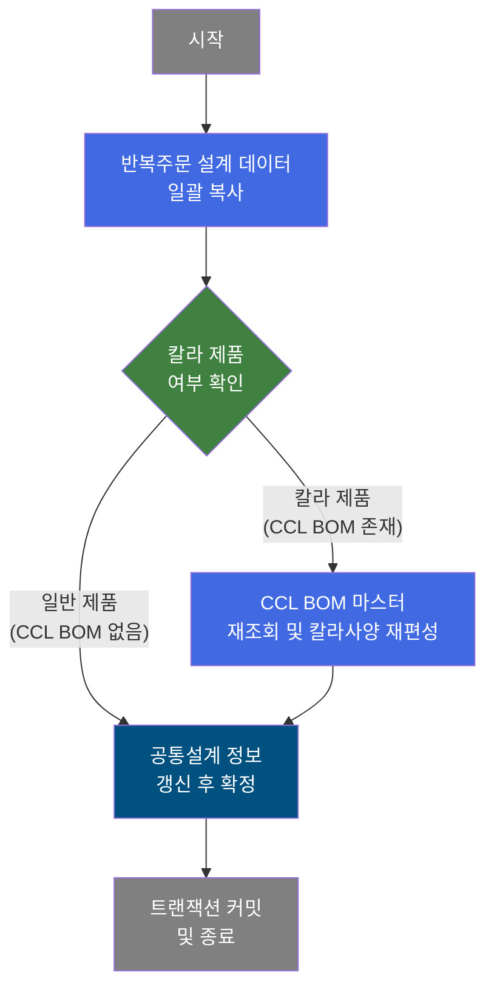
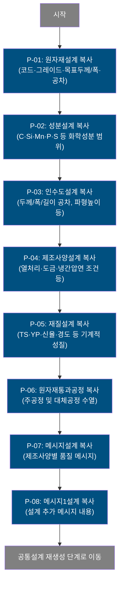
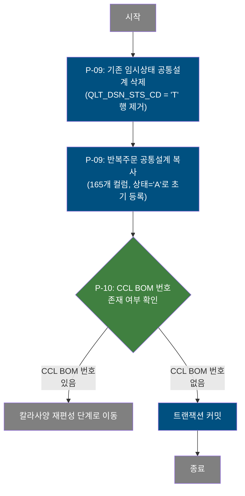
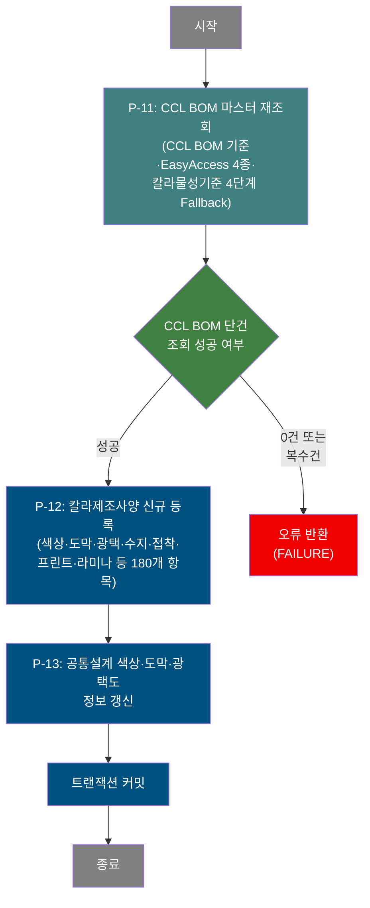

# C102100170 비즈니스 프로세스 분석서 (BPA)

## 1. 시스템 개요

| 항목 | 내용 |
|------|------|
| 서비스 ID | C102100170 |
| 업무명 | 칼라강판 반복주문 품질설계 재편성 |
| 서비스 타입 | nui |
| 분석 일시 | 2026-03-21 (KST) |
| 원본 분석일 | 2026-03-16 |
| 문서 버전 | 1.0 |

---

## 2. 시스템 목적

본 서비스는 칼라강판 주문에 대한 품질설계 정보를 이전 반복주문(Reference Order)의 설계 데이터로부터 복사하여 신규 품질설계를 자동으로 생성하는 NUI 배치 프로세스다. 신규 주문이 기존에 생산된 주문과 동일한 사양을 요구하는 경우, 각 설계 영역(공통·원자재·성분·제조사양·재질·통과공정·메시지·인수도 등)을 이전 설계 기록에서 그대로 이어받아 설계 작업의 중복 수행을 방지한다.

특히 칼라 제품(컬러강판)의 경우, 이전 편성이 완료된 이후 변경 사유(고객 변경, 사양 변경 등)로 칼라제조사양을 재편성해야 할 때 이 서비스가 호출된다. CCL BOM 기준 정보와 마스터 데이터를 재조회하여 칼라제조사양을 재등록하고, 공통설계의 색상·도막·광택도 정보를 최신 마스터 값으로 갱신한다.

이 서비스의 결과물은 품질설계 전체 사이클에서 "반복주문 재편성" 단계를 완료하는 것이며, 후속 공정(생산 계획 수립, 제조 지시 등)의 입력 데이터로 활용된다.

---

## 3. 핵심 워크플로우

---

## 4. 상세 워크플로우

### 프로세스 흐름도 — 반복주문 설계 데이터 일괄 복사 (P-01, P-02, P-03, P-04, P-05, P-06, P-07, P-08)

> **참고**: P-01 ~ P-08은 반복주문의 각 설계 영역을 순차 복사하는 프로세스이며, 모두 이전 주문(ORD_REP_NO/ORD_REP_LN)에서 신규 주문(ORD_NO/ORD_LN)으로 데이터를 복제한다.

### 프로세스 흐름도 — 공통설계 재생성 (P-09, P-10)

### 프로세스 흐름도 — 칼라제조사양 재편성 (P-11, P-12, P-13)

---

## 5. 비즈니스 로직 상세

P-01: 원자재설계 복사 — 반복주문 원자재 사양 이관

- **입력**: TB_C10_QLT_DSN_RMT에서 반복주문(ORD_REP_NO/ORD_REP_LN) 기준 원자재 사양 조회
- **처리**:
  1. 반복주문 원자재 코드, 그레이드, 목표 두께/폭 및 공차 범위(11개 항목) 조회
  2. 신규 주문(ORD_NO/ORD_LN)으로 그대로 복제하여 등록
- **출력**: TB_C10_QLT_DSN_RMT에 신규 주문 원자재설계 행 생성
- **예외**: 해당 없음 (반복주문 데이터가 없는 경우 빈 복사)

P-02: 성분설계 복사 — 반복주문 화학성분 기준 이관

- **입력**: TB_C10_QLT_DSN_CHM에서 반복주문 기준 성분설계 조회
- **처리**:
  1. C, Si, Mn, P, S, Cr, Ni, Cu, Al, Ti, Nb, V, N 등 화학성분 상·하한값(31개 항목) 조회
  2. 신규 주문으로 복제하여 등록
- **출력**: TB_C10_QLT_DSN_CHM에 신규 주문 성분설계 행 생성
- **예외**: 해당 없음

P-03: 인수도설계 복사 — 반복주문 인수도 조건 이관

- **입력**: TB_C10_QLT_DSN_DLV에서 반복주문 기준 인수도 조건 조회
- **처리**:
  1. 두께·폭·길이 공차, 파형높이, 강연화 등 인수도 조건(17개 항목) 조회
  2. 신규 주문으로 복제하여 등록
- **출력**: TB_C10_QLT_DSN_DLV에 신규 주문 인수도설계 행 생성
- **예외**: 해당 없음

P-04: 제조사양설계 복사 — 반복주문 제조공정 사양 이관

- **입력**: TB_C10_QLT_DSN_MNF에서 반복주문 기준 제조사양 조회
- **처리**:
  1. 열처리 조건(용로타입·온도·시간·라인속도 등), 냉간압연 5단계(2CGL~5CGL) 세부 조건, 도금층두께, 슬릿폭, 교차홈 등 125개 컬럼 조회
  2. 신규 주문으로 복제하여 등록
- **출력**: TB_C10_QLT_DSN_MNF에 신규 주문 제조사양 행 생성
- **예외**: 해당 없음

P-05: 재질설계 복사 — 반복주문 기계적 성질 기준 이관

- **입력**: TB_C10_QLT_DSN_MQL에서 반복주문 기준 재질설계 조회
- **처리**:
  1. 인장강도(TS), 항복강도(YP), 신율(ELGN), 경도(HRB), 탄성복원력(ER), 시험 조건 및 무게 범위(22개 항목) 조회
  2. 신규 주문으로 복제하여 등록
- **출력**: TB_C10_QLT_DSN_MQL에 신규 주문 재질설계 행 생성
- **예외**: 해당 없음

P-06: 원자재통과공정 복사 — 반복주문 공정 수열 이관

- **입력**: TB_C10_QLT_DSN_PROC에서 반복주문 기준 통과공정 조회
- **처리**:
  1. 공정 수열(PROC_SEQ), 주공정코드, 대체공정코드(최대 6개), 재질코드, SMS수신여부 조회
  2. 신규 주문으로 복제하여 등록
- **출력**: TB_C10_QLT_DSN_PROC에 신규 주문 통과공정 행 생성
- **예외**: 해당 없음

P-07: 메시지설계 복사 — 반복주문 품질 메시지 이관

- **입력**: TB_C10_QLT_DSN_MSG에서 반복주문 기준 제조사양별 메시지 조회
- **처리**:
  1. 제조사양 유형별 품질 메시지 내용 조회
  2. 신규 주문으로 복제하여 등록
- **출력**: TB_C10_QLT_DSN_MSG에 신규 주문 메시지설계 행 생성
- **예외**: 해당 없음

P-08: 메시지1설계 복사 — 반복주문 추가 메시지 이관

- **입력**: TB_C10_QLT_DSN_MSG1에서 반복주문 기준 추가 메시지 조회
- **처리**:
  1. 설계 과정에서 추가된 메시지 이름(QLT_MSG_NM) 조회
  2. 신규 주문으로 복제하여 등록
- **출력**: TB_C10_QLT_DSN_MSG1에 신규 주문 메시지1설계 행 생성
- **예외**: 해당 없음

P-09: 공통설계 재생성 — 임시 데이터 정리 후 반복주문 공통설계 등록

- **입력**: TB_C10_QLT_DSN_CMN에서 반복주문 기준 공통설계 165개 컬럼 조회
- **처리**:
  1. 신규 주문의 임시상태(QLT_DSN_STS_CD='T') 공통설계 행을 먼저 삭제하여 정리
  2. 반복주문의 공통설계 전체(제품사양·규격·포장조건·수지도료정보·메시지·배송정보 등) 조회
  3. 신규 주문으로 복제 시 설계상태를 'A'로 고정, 일부 항목(배송일·수령일·메시지)은 새로운 파라미터 값으로 덮어씀
- **출력**: TB_C10_QLT_DSN_CMN에 신규 주문 공통설계 행 생성 (상태='A')
- **예외**: 임시상태 행 삭제는 확정된 데이터(상태≠'T')에 영향 없음

P-10: CCL BOM 번호 존재 여부 확인 — 칼라 제품 분기

- **입력**: PosContext의 CCL BOM 번호(CCL_BOM_NO) 값
- **처리**:
  1. CCL_BOM_NO 값이 null/공백이면 → 일반 제품으로 판단, 칼라사양 재편성 생략
  2. CCL_BOM_NO 값이 존재하면 → 칼라 제품으로 판단, 칼라사양 재편성 진행
- **출력**: 분기 결과에 따라 흐름 전환
- **예외**: 해당 없음

P-11: CCL BOM 마스터 재조회 — 칼라물성기준 4단계 Fallback 조회

- **입력**: CCL_BOM_NO, 최종수요가코드(FNL_CUS_CD), 주문용도코드(ORD_USG_CD) 등 17개 파라미터
- **처리**:
  1. CCL BOM 기준 테이블(SELECT_CCL_BOM)에서 단건 조회 — 0건 또는 복수건이면 FAILURE
  2. 감량매직체크기준(C10B2280), 지관발주메시지기준(C10B2290), PE-FOAM적용메시지기준(C10B2300) EasyAccess 3종 조회
  3. 품질설계확정 유형이 수동(M)이고 수동확정기준(C10B2260) 미조회 시 수동 상태 유지
  4. 칼라물성기준(SELECT_CLR_MPR)을 4단계 Fallback으로 조회:
     - 1단계: FNL_CUS_CD+ORD_USG_CD 원래값
     - 2단계: ORD_USG_CD → '`******`' 대체
     - 3단계: FNL_CUS_CD → '`******`' 대체, ORD_USG_CD 복원
     - 4단계: 둘 다 '`******`' 대체 → 여전히 0건이면 FAILURE
  5. 1건 성공 시 물성값 14종을 PosContext에 등록 (COL_KEY_WRD1~4는 등록하지 않음 — 재편성 특성)
  6. 보호필름 코드(ord_ptt_flm_dtl_cd)를 5개 개별 코드로 분해 등록
- **출력**: PosContext에 CCL BOM 마스터 데이터 및 칼라물성 기준값 등록
- **예외**: CCL BOM 0건/복수건 → FAILURE 반환 / 칼라물성기준 최종 0건 → FAILURE 반환

P-12: 칼라제조사양 신규 등록 — CCL BOM 마스터 기반 사양 확정

- **입력**: PosContext의 CCL BOM 마스터 데이터 및 칼라물성 기준값 (P-11 결과)
- **처리**:
  1. 코팅방법, 색상(표면·이면), 도막두께(표면·이면), 광택도, 수지타입(표면·이면), 접착제 유형, 페인트롤 정보, 프린트 사양, 라미나 사양, 물성기준 등 180개 항목을 INSERT
  2. 일부 항목은 SUBSTR 함수로 코드값을 추출하여 저장
- **출력**: TB_C10_QLT_DSN_CCL_BOM에 신규 주문 칼라제조사양 행 생성
- **예외**: 해당 없음

P-13: 공통설계 색상·도막·광택도 갱신 — CCL BOM 재편성 결과 반영

- **입력**: PosContext의 CCL BOM 재편성 결과값 (색상코드·도막두께·광택도·수지코드 등)
- **처리**:
  1. TB_C10_QLT_DSN_CMN의 해당 주문 행에서 색상(표면·이면), 도막두께(표면·이면), 광택도(표면·이면), 수지타입(표면·이면), 코팅방법, 불량감소문구, 지관발주메시지, PE-FOAM 메시지 등 14개 항목을 최신 CCL BOM 마스터 기준값으로 UPDATE
- **출력**: TB_C10_QLT_DSN_CMN 갱신
- **예외**: 해당 없음

---

## 6. 커스텀 클래스 워크플로우

### ReorderCclBomDesign (약 524줄)

**역할**: 칼라강판 주문의 재편성 시점에 CCL BOM 기준 데이터와 EasyAccess 마스터 4종, 칼라물성기준을 4단계 Fallback 방식으로 조회하여 PosContext에 등록하는 Activity. 신규 편성(`DbSearchCclBomData`)과 동일한 로직이나, 재편성 시에는 키워드 항목(COL_KEY_WRD1~4)을 등록하지 않는 차이가 있다.

```mermaid
flowchart TD
    START["시작"]:::start
    START --> EXTRACT["파라미터 추출<br/>(17개 항목)"]:::proc
    EXTRACT --> CLR_CHK{"칼라 제품<br/>체크<br/>(PRD_NM_CD 1~9)"}:::decision
    CLR_CHK -->|"칼라 아님"| SKIP_END["처리 없이 종료<br/>(FALSE)"]:::start
    CLR_CHK -->|"칼라 제품"| CCL_BOM["CCL BOM 기준 조회<br/>(SELECT_CCL_BOM)"]:::proc
    CCL_BOM --> CCL_COUNT{"결과 건수<br/>확인"}:::decision
    CCL_COUNT -->|"0건 또는<br/>복수건"| FAIL["FAILURE 반환"]:::error
    CCL_COUNT -->|"단건"| EA1["감량매직체크기준 조회<br/>(C10B2280)"]:::proc
    EA1 --> EA2["지관발주메시지기준 조회<br/>(C10B2290)"]:::proc
    EA2 --> EA2_CHK{"지관발주<br/>억제 여부<br/>(COL_ORD_SLV_KND_TP='N')"}:::decision
    EA2_CHK -->|"억제"| EA2_CLR["지관발주 메시지 공백 처리"]:::proc
    EA2_CHK -->|"정상"| EA3
    EA2_CLR --> EA3["PE-FOAM 메시지기준 조회<br/>(C10B2300)"]:::proc
    EA3 --> CFM_CHK{"품질설계확정 수동<br/>(QLT_DSN_CFM_TP='M')"}:::decision
    CFM_CHK -->|"수동 + C10B2260<br/>미조회"| KEEP_M["수동확정 상태 유지<br/>(COL_QLT_DSN_CFM_TP='M')"]:::proc
    CFM_CHK -->|"null"| SET_M["확정유형 'M'으로 설정"]:::proc
    CFM_CHK -->|"기타"| REG_BOM
    KEEP_M --> REG_BOM
    SET_M --> REG_BOM
    REG_BOM["CCL BOM 전체 컬럼<br/>PosContext 등록"]:::proc
    REG_BOM --> PTT_FLM["보호필름 코드<br/>5개로 분해 등록"]:::proc
    PTT_FLM --> CLR_MPR_LOOP["칼라물성기준 Fallback 조회 시작<br/>(SELECT_CLR_MPR, while 루프)"]:::proc
    CLR_MPR_LOOP --> STEP1{"1단계:<br/>FNL_CUS_CD+ORD_USG_CD<br/>원래값으로 조회"}:::decision
    STEP1 -->|"1건 성공"| REG_MPR
    STEP1 -->|"0건"| STEP2{"2단계:<br/>ORD_USG_CD='******'<br/>대체 조회"}:::decision
    STEP2 -->|"1건 성공"| REG_MPR
    STEP2 -->|"0건"| STEP3{"3단계:<br/>FNL_CUS_CD='******'<br/>ORD_USG_CD 복원 조회"}:::decision
    STEP3 -->|"1건 성공"| REG_MPR
    STEP3 -->|"0건"| STEP4{"4단계:<br/>둘 다 '******' 조회"}:::decision
    STEP4 -->|"1건 성공"| REG_MPR
    STEP4 -->|"0건"| FAIL2["FAILURE 반환"]:::error
    REG_MPR["물성값 14종 등록<br/>(COL_KEY_WRD1~4 미등록)"]:::proc
    REG_MPR --> SUCCESS["SUCCESS 반환"]:::start

    classDef start fill:#808080,color:#fff
    classDef proc fill:#4169E1,color:#fff
    classDef decision fill:#408040,color:#fff
    classDef error fill:#F00000,color:#fff
```

---

## 7. 주요 유즈케이스

UC-01: 칼라강판 반복주문 재편성 처리

- **Actor**: 품질설계 배치 프로세스 (자동 실행)
- **목적**: 기존 설계가 완료된 칼라강판 주문과 동일 사양의 신규 주문에 대해 설계 재편성을 자동 수행
- **주요 흐름**:
  1. 반복주문 번호를 기준으로 원자재·성분·인수도·제조사양·재질·통과공정·메시지 등 설계 데이터를 신규 주문으로 순차 복사
  2. 기존 임시상태 공통설계를 정리한 뒤 반복주문 공통설계를 신규 주문으로 복사 (상태='A' 초기 등록)
  3. CCL BOM 번호가 존재하면 CCL BOM 마스터와 칼라물성기준을 재조회하여 칼라제조사양을 새로 등록
  4. 공통설계의 색상·도막·광택도 정보를 최신 마스터 값으로 갱신하고 트랜잭션 커밋
- **예외**: CCL BOM 조회 결과 0건 또는 복수건이면 오류 반환 / 칼라물성기준 4단계 Fallback 모두 실패 시 오류 반환

UC-02: 일반 제품(非칼라) 반복주문 처리

- **Actor**: 품질설계 배치 프로세스 (자동 실행)
- **목적**: 칼라 제품이 아닌 주문에 대해 반복주문 설계 데이터 복사만 수행하고 칼라 재편성 단계를 건너뜀
- **주요 흐름**:
  1. 반복주문의 설계 데이터(원자재·성분·인수도·제조사양·재질·통과공정·메시지) 신규 주문으로 복사
  2. 공통설계 재생성 후 CCL BOM 번호가 없음을 확인하여 칼라사양 재편성 생략
  3. 트랜잭션 커밋
- **예외**: 해당 없음

UC-03: 변경 사유로 인한 칼라제조사양 단독 재편성

- **Actor**: 품질설계 배치 프로세스 (자동 실행)
- **목적**: 고객 변경 또는 제품 사양 변경으로 인해 이미 편성된 칼라제조사양을 재편성해야 할 때 마스터 기준 재조회 후 사양 갱신
- **주요 흐름**:
  1. CCL BOM 기준과 EasyAccess 마스터(감량매직·지관발주·PE-FOAM) 재조회
  2. 칼라물성기준을 4단계 Fallback으로 재조회 — 기존 편성(신규)과 달리 키워드 항목은 갱신하지 않음
  3. 조회 결과로 칼라제조사양 테이블(TB_C10_QLT_DSN_CCL_BOM)에 새 행 등록
  4. 공통설계 색상·도막·광택도 항목 업데이트
- **예외**: Fallback 4단계 모두 0건이면 FAILURE — 수동 처리 필요

---

## 9. 관련 엔티티

### 엔티티 목록

| 엔티티(테이블) | 설명 | 사용 유형 |
|---------------|------|----------|
| TB_C10_QLT_DSN_CMN | 품질설계 공통정보 (규격·포장·수지·메시지 등 165개 항목) | 조회/삭제/저장/갱신 |
| TB_C10_QLT_DSN_CCL_BOM | 칼라제조사양 (색상·도막·광택·수지·접착·프린트·라미나 등) | 저장 |
| TB_C10_QLT_DSN_RMT | 원자재설계 (원자재 코드·그레이드·목표값·공차) | 저장 |
| TB_C10_QLT_DSN_CHM | 성분설계 (화학성분 상·하한값) | 저장 |
| TB_C10_QLT_DSN_DLV | 인수도설계 (두께/폭/길이 공차·파형높이 등) | 저장 |
| TB_C10_QLT_DSN_MNF | 제조사양설계 (열처리·도금·냉간압연 조건 등) | 저장 |
| TB_C10_QLT_DSN_MQL | 재질설계 (기계적 성질 기준값) | 저장 |
| TB_C10_QLT_DSN_PROC | 원자재통과공정 (주공정·대체공정 수열) | 저장 |
| TB_C10_QLT_DSN_MSG | 메시지설계 (제조사양별 품질 메시지) | 저장 |
| TB_C10_QLT_DSN_MSG1 | 메시지1설계 (설계 추가 메시지) | 저장 |

### 엔티티 간 관계
- TB_C10_QLT_DSN_CMN은 품질설계의 중심 엔티티로, 모든 하위 설계 테이블(RMT/CHM/DLV/MNF/MQL/PROC/MSG/MSG1/CCL_BOM)과 주문번호(ORD_NO/ORD_LN)를 기준으로 연결된다.
- TB_C10_QLT_DSN_CCL_BOM은 TB_C10_QLT_DSN_CMN의 칼라 제품 주문에 대해서만 생성되며, CCL BOM 번호(CCL_BOM_NO)를 통해 마스터 기준 테이블과 연계된다.
- TB_C10_QLT_DSN_RMT·CHM·DLV·MNF·MQL·PROC·MSG·MSG1 각각은 TB_C10_QLT_DSN_CMN의 주문(ORD_NO/ORD_LN) 단위로 1:1 또는 1:N 관계를 가진다.

---

## 11. 특이사항 및 주의사항

### 1. 재편성(Reorder)과 신규 편성(DbSearchCclBomData)의 차이
본 서비스(C102100170)는 신규 편성 서비스(C102100160)와 칼라제조사양 재조회 로직이 동일하나, 재편성 시에는 칼라물성 키워드 항목(COL_KEY_WRD1~4)을 PosContext에 등록하지 않는다. 이는 재편성 시 기존 키워드 설정을 유지하기 위한 의도적 설계이며, 두 서비스가 서로 다른 트랜잭션 흐름으로 분리된 이유이기도 하다.

### 2. 임시상태('T') 공통설계 삭제 후 재생성 패턴
공통설계 재생성 단계(P-09)에서는 먼저 임시상태(QLT_DSN_STS_CD='T') 행을 삭제한 뒤 반복주문 데이터를 상태='A'로 재등록한다. 이는 이전 처리 중 실패로 남은 임시 데이터를 정리하고 클린한 상태로 재시작하기 위한 방어 로직이다. 확정된 상태의 데이터(상태≠'T')는 삭제되지 않으므로 안전하다.

### 3. 칼라물성기준 4단계 Fallback 조회의 중요성
칼라물성기준(SELECT_CLR_MPR) 조회는 최종수요가코드(FNL_CUS_CD)와 주문용도코드(ORD_USG_CD)를 순차적으로 와일드카드('`******`')로 대체하면서 최대 4회 시도하는 Fallback 패턴을 사용한다. 4단계 모두 0건이면 FAILURE로 처리되어 전체 트랜잭션이 롤백된다. 이는 칼라물성 기준이 반드시 존재해야 정확한 제조사양을 보장할 수 있기 때문이다.

### 4. 다량의 설계 영역 순차 복사에 따른 트랜잭션 일관성 보장
원자재→성분→인수도→제조사양→재질→통과공정→메시지→메시지1→공통설계의 순서로 8개 설계 영역을 순차 INSERT하며, 최종 COMMIT은 DbSetCommit Activity에서 일괄 처리된다. 중간 단계 실패 시 전체가 롤백되므로 설계 데이터의 일부만 복사되는 상황이 발생하지 않는다.

### 5. CCL BOM 복사 방식: 반복 복사 vs. 재조회
반복주문의 다른 설계 영역(원자재·성분·제조사양 등)은 이전 주문 데이터를 그대로 복사하는 방식이지만, 칼라제조사양(TB_C10_QLT_DSN_CCL_BOM)은 이전 데이터를 복사하지 않고 CCL BOM 마스터를 새로 조회하여 재등록한다. 이는 마스터 기준이 변경되었을 가능성에 대비하여 항상 최신 마스터 값을 반영하기 위한 설계다.
