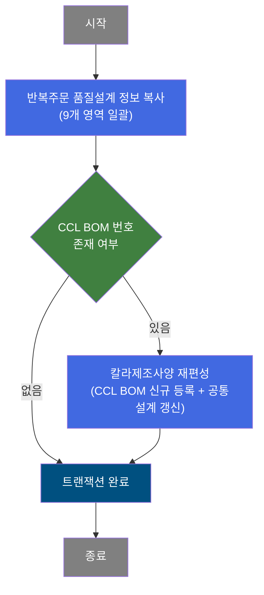
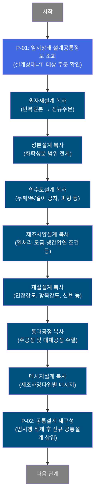
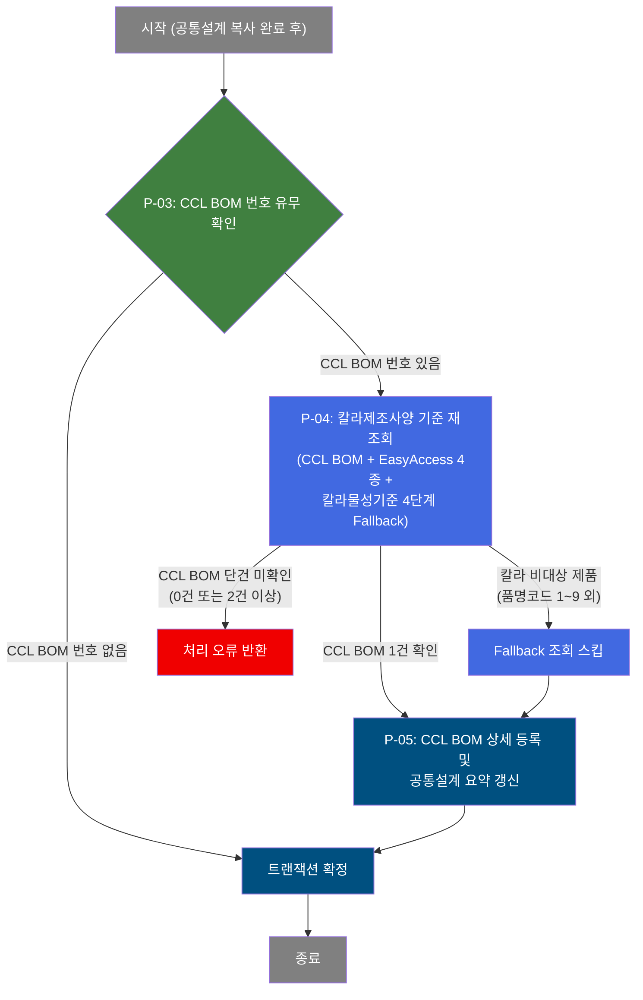
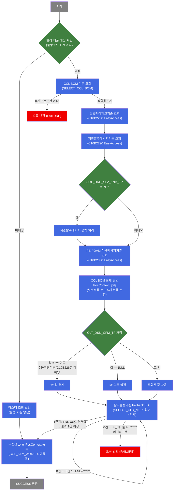

# C102100180 비즈니스 프로세스 분석서 (BPA)

## 1. 시스템 개요

| 항목 | 내용 |
|------|------|
| 서비스 ID | C102100180 |
| 업무명 | 반복주문 품질설계 전체 복사 및 칼라제조사양 재편성 |
| 서비스 타입 | nui |
| 분석 일시 | 2026-03-21 (KST) |
| 원본 분석일 | 2026-03-16 |
| 문서 버전 | 1.0 |

---

## 2. 시스템 목적

본 서비스는 반복주문(유사 주문 재활용) 처리 시, 기존 주문의 품질설계 정보 전체를 신규 주문으로 복사하고, 칼라강판 제품인 경우 칼라제조사양(CCL BOM)을 재편성하는 자동화 NUI(배치) 서비스다.

품질설계 정보는 공통설계, 원자재설계, 성분설계, 인수도설계, 제조사양설계, 재질설계, 통과공정, 메시지설계, 메시지1설계 등 9개 영역으로 구성된다. 반복주문 시 이 모든 영역을 반복 원본 주문에서 일괄 복사함으로써, 담당자가 동일한 사양을 재입력하는 수작업을 제거하고 설계 오류 가능성을 줄인다.

칼라 제품(CCL 대상)에 대해서는 복사 이후 CCL BOM 번호를 확인하여, 해당 번호가 존재하면 칼라제조사양 마스터를 재조회하고 CCL BOM 상세 항목을 신규로 등록한 뒤 공통설계 요약 정보를 갱신한다. 이 과정은 재편성(Reorder) 특화 로직을 통해 수행되며, 신규 편성과 달리 색상 키워드 항목은 유지하지 않는다.

---

## 3. 핵심 워크플로우

---

## 4. 상세 워크플로우

### 프로세스 흐름도 — 반복주문 품질설계 복사 (P-01, P-02)

### 프로세스 흐름도 — CCL BOM 존재 시 칼라제조사양 재편성 (P-03, P-04, P-05)

---

## 5. 비즈니스 로직 상세

P-01: 임시상태 설계공통정보 조회 — 복사 대상 주문 식별

- **입력**: TB_C10_QLT_DSN_CMN에서 설계상태가 임시(T)인 주문 정보를 조회 (주문번호, 주문행번, 제품품명코드, 고객코드, 최종수요가코드, 사용용도 등 포함)
- **처리**:
  1. 주문번호 및 반복 원본 주문번호를 파라미터로 수신
  2. 설계상태='T' 조건으로 신규 주문의 공통설계 기본정보를 조회하여 후속 처리에 전달
- **출력**: 후속 복사 작업에 사용할 공통설계 기준 데이터 (주문 식별 정보, 제품 분류 정보 등)
- **예외**: 해당 없음 (조회 전용 단계)

P-02: 공통설계 재구성 — 기존 임시 공통설계 삭제 후 반복원본 복사 삽입

- **입력**: TB_C10_QLT_DSN_CMN (신규 주문의 임시상태 행), 반복 원본 주문번호/행번
- **처리**:
  1. 신규 주문의 임시상태(T) 공통설계 행 삭제
  2. 반복 원본 주문(ORD_REP_NO/LN)의 공통설계 데이터 165개 항목 전체를 신규 주문으로 복사
  3. 복사 시 설계상태는 'A'(작성중)로 고정, 배송 예정일·수령일·메시지 항목은 파라미터 값으로 오버라이드
- **출력**: TB_C10_QLT_DSN_CMN에 신규 주문의 공통설계 행 생성
- **예외**: 복사 원본 데이터가 없을 경우 빈 레코드 삽입 방지 필요

P-03: CCL BOM 번호 유무 확인 — 칼라제조사양 재편성 필요 여부 판단

- **입력**: P-01에서 조회된 공통설계의 CCL BOM 번호(CCL_BOM_NO)
- **처리**:
  1. CCL_BOM_NO 값이 NULL 또는 'N'이면 칼라 재편성 불필요 → 트랜잭션 확정으로 이행
  2. CCL_BOM_NO 값이 유효한 번호이면 칼라제조사양 재편성 단계로 이행
- **출력**: 분기 결정 (칼라 재편성 여부)
- **예외**: 해당 없음

P-04: 칼라제조사양 기준 재조회 — CCL BOM 및 마스터 기준 4종 조회

- **입력**: CCL_BOM_NO, 최종수요가코드(FNL_CUS_CD), 사용용도코드(ORD_USG_CD), 품명코드(PRD_NM_CD)
- **처리**:
  1. 칼라 제품 대상 여부 확인 (품명코드가 1~9 범위인지 검사) — 대상 외 제품은 재편성 마스터 조회 스킵
  2. CCL BOM 기준 테이블 조회 (정확히 1건이어야 함; 0건 또는 2건 이상이면 오류)
  3. 감량매직체크기준(C10B2280) 조회
  4. 지관발주메시지기준(C10B2290) 조회 — COL_ORD_SLV_KND_TP='N'이면 메시지 공백 처리
  5. PE-FOAM 적용메시지기준(C10B2300) 조회
  6. 칼라물성기준(SELECT_CLR_MPR) 4단계 Fallback 조회:
     - 1단계: FNL_CUS_CD 원래값 + ORD_USG_CD 원래값
     - 2단계: FNL_CUS_CD 원래값 + ORD_USG_CD = '******'
     - 3단계: FNL_CUS_CD = '******' + ORD_USG_CD 원래값(복원)
     - 4단계: FNL_CUS_CD = '******' + ORD_USG_CD = '******' → 0건이면 FAILURE
  7. QLT_DSN_CFM_TP(품질설계확정 구분) 처리: CCL BOM 값이 'M'이고 수동확정기준(C10B2260) 미해당이면 'M' 유지; NULL이면 'M'으로 설정
  8. 보호필름 코드 분해: ord_ptt_flm_dtl_cd 값을 길이 기준으로 5개 개별 코드로 등록
  9. 재편성 특이사항: COL_KEY_WRD1~4 항목을 등록하지 않음 (신규 편성과의 차이점)
- **출력**: PosContext에 칼라물성값 14종, CCL BOM 전체 컬럼, EasyAccess 4종 결과 등록
- **예외**: CCL BOM 0건 또는 2건 이상 → FAILURE 반환; 칼라물성기준 최종 0건 → FAILURE 반환

P-05: CCL BOM 상세 등록 및 공통설계 요약 갱신 — 재편성 결과 저장

- **입력**: P-04에서 조회된 칼라제조사양 기준 데이터 (180개 항목), 공통설계 요약 항목
- **처리**:
  1. TB_C10_QLT_DSN_CCL_BOM에 칼라제조사양 전체 항목(코팅방식, 색상, 도막두께, 광택도, 수지, 접착제, 페인트롤, 프린트, 라미나, 물성기준 등 180개) INSERT
  2. TB_C10_QLT_DSN_CMN의 공통설계 요약 항목(색상코드, 도막두께 합계, 수지코드, 광택도코드, 코팅방식, 이유구분 등) UPDATE
- **출력**: TB_C10_QLT_DSN_CCL_BOM 신규 행 생성, TB_C10_QLT_DSN_CMN 요약 항목 갱신
- **예외**: 감사(isAudit=true) 정보 자동 기록 (최종변경일시, 최종변경프로그램)

---

## 6. 커스텀 클래스 워크플로우

### ReorderCclBomDesign (약 524줄)

**역할**: 칼라제조사양 재편성(Reorder) Activity. 기존 편성 이후 사양 변경 시 호출되며, CCL BOM 기준 조회 + EasyAccess 4종 + 칼라물성기준 4단계 Fallback 조회를 수행하여 PosContext에 등록한다. 신규 편성(DbSearchCclBomData)과 동일한 로직이나 COL_KEY_WRD1~4를 등록하지 않는 점이 차이다.

---

## 7. 주요 유즈케이스

UC-01: 반복주문 품질설계 자동 복사

- **Actor**: MES 자동화 배치 (주문 접수 처리 흐름 내 호출)
- **목적**: 유사한 사양의 반복주문에 대해 기존 주문의 품질설계 정보를 신규 주문으로 일괄 복사하여 설계 시간을 단축
- **주요 흐름**:
  1. 임시상태로 생성된 신규 주문의 기본정보 조회
  2. 반복 원본 주문으로부터 9개 설계 영역(원자재, 성분, 인수도, 제조사양, 재질, 통과공정, 메시지, 메시지1, 공통) 순서대로 복사
  3. 기존 임시 공통설계 행 삭제 후 복사된 공통설계 행 삽입 (설계상태 'A'로 고정)
  4. 트랜잭션 완료
- **예외**: 반복 원본 주문 데이터가 없으면 복사 대상 없음

UC-02: 칼라 반복주문의 CCL BOM 재편성

- **Actor**: MES 자동화 배치 (UC-01 흐름의 연속)
- **목적**: 칼라강판 반복주문에 대해 최신 CCL BOM 마스터 기준으로 칼라제조사양을 재편성하여 구버전 기준 적용 오류를 방지
- **주요 흐름**:
  1. 공통설계 복사 완료 후 CCL BOM 번호 유무 확인
  2. CCL BOM 번호가 있으면 칼라제조사양 마스터(CCL BOM 기준, EasyAccess 4종, 칼라물성기준) 재조회
  3. 4단계 Fallback 패턴으로 고객/용도 조합의 칼라물성기준 최적값 탐색
  4. CCL BOM 상세 항목 전체를 신규 주문으로 등록
  5. 공통설계 요약 항목(색상, 도막, 광택도 등) 갱신 후 트랜잭션 확정
- **예외**: CCL BOM 기준이 단건으로 확인되지 않거나 칼라물성기준 4단계 탐색 모두 실패 시 처리 오류 반환

UC-03: 품질설계확정 구분(수동/자동) 유지

- **Actor**: MES 자동화 배치
- **목적**: 수동으로 확정 처리된 설계 결과(QLT_DSN_CFM_TP='M')가 반복주문 재편성 시 의도치 않게 자동 처리로 변경되는 것을 방지
- **주요 흐름**:
  1. CCL BOM 조회 결과에서 품질설계확정 구분 확인
  2. 값이 'M'이고 수동확정기준(C10B2260) 조건에 해당하지 않으면 'M' 유지
  3. 값이 NULL이면 'M'으로 설정
  4. 그 외는 조회된 값 그대로 적용
- **예외**: 해당 없음

---

## 9. 관련 엔티티

### 엔티티 목록

| 엔티티(테이블) | 설명 | 사용 유형 |
|---------------|------|----------|
| TB_C10_QLT_DSN_CMN | 품질설계 공통정보 (주문 수준 설계 요약) | 조회/삭제/저장/갱신 |
| TB_C10_QLT_DSN_RMT | 원자재설계정보 (코드, 그레이드, 두께/폭 목표 및 공차) | 저장 |
| TB_C10_QLT_DSN_CHM | 성분설계정보 (C·Si·Mn·P·S 등 화학성분 상하한) | 저장 |
| TB_C10_QLT_DSN_DLV | 인수도설계정보 (두께/폭/길이 공차, 파형 높이 등) | 저장 |
| TB_C10_QLT_DSN_MNF | 제조사양설계정보 (열처리·도금·냉간압연 조건 등) | 저장 |
| TB_C10_QLT_DSN_MQL | 재질설계정보 (기계적 성질: 인장강도, 항복강도, 신율 등) | 저장 |
| TB_C10_QLT_DSN_PROC | 통과공정정보 (주공정 및 대체공정 수열) | 저장 |
| TB_C10_QLT_DSN_MSG | 메시지설계정보 (제조사양타입·원자재별 메시지) | 저장 |
| TB_C10_QLT_DSN_MSG1 | 메시지1설계정보 (품질 메시지 이름) | 저장 |
| TB_C10_QLT_DSN_CCL_BOM | 칼라제조사양정보 (색상·도막·광택도·수지·접착제 등 180개 항목) | 저장 |

### 엔티티 간 관계
- TB_C10_QLT_DSN_CMN은 모든 설계 영역 테이블의 상위 공통 테이블로, 주문번호(ORD_NO)+주문행번(ORD_LN)을 공유 키로 연결된다.
- TB_C10_QLT_DSN_CCL_BOM은 TB_C10_QLT_DSN_CMN의 CCL_BOM_NO 항목을 통해 마스터와 연결되며, 칼라강판 주문에만 존재한다.
- TB_C10_QLT_DSN_CMN의 설계 요약 항목(색상코드, 도막두께 합계, 광택도코드 등)은 TB_C10_QLT_DSN_CCL_BOM 등록 후 갱신된다.
- 나머지 설계 영역 테이블(RMT, CHM, DLV, MNF, MQL, PROC, MSG, MSG1)은 TB_C10_QLT_DSN_CMN과 동일한 주문 키로 1:1 또는 1:N 관계를 가진다.

---

## 11. 특이사항 및 주의사항

### 1. 반복주문 처리 시 임시 공통설계 행의 삭제-재삽입 패턴
신규 주문 생성 시 임시상태(T)로 먼저 공통설계 행이 생성되는데, 본 서비스에서는 이를 삭제하고 반복 원본의 공통설계를 복사하여 재삽입한다. 이 과정에서 설계상태는 강제로 'A'(작성중)로 고정되므로, 반복 원본이 확정 상태(C)라 하더라도 신규 주문은 작성중 상태로 시작하게 된다.

### 2. 칼라제조사양 재편성과 신규 편성의 COL_KEY_WRD1~4 차이
신규 편성(DbSearchCclBomData / C102100160-service)은 칼라물성기준 조회 성공 시 색상 키워드(COL_KEY_WRD1~4)를 PosContext에 등록하지만, 재편성(ReorderCclBomDesign / 본 서비스)은 키워드를 등록하지 않는다. 이는 재편성 시에는 기존 색상 키워드를 변경하지 않는다는 업무 규칙을 반영한 것이다.

### 3. 칼라물성기준 4단계 Fallback — 최종 실패 시 전체 처리 중단
칼라물성기준 조회가 FNL_CUS_CD와 ORD_USG_CD를 각각 '******'으로 완화하는 4단계 Fallback에서도 0건이면 FAILURE를 반환하여 전체 트랜잭션이 중단된다. 이는 마스터 데이터 미등록으로 인해 잘못된 칼라사양이 저장되는 것을 방지하는 품질 보호 장치다.

### 4. isAudit=true 항목의 감사 정보 자동 기록
CCL BOM INSERT(INSERT_CCL_BOM)와 공통설계 UPDATE(MODIFY_CMN)는 isAudit=true로 설정되어 최종변경일시·최종변경프로그램·최종변경객체유형 등 감사 항목이 자동으로 기록된다. 나머지 설계 영역 복사 INSERT는 isAudit=false로 생성자/변경자/일시는 수동 삽입 방식으로 처리된다.

### 5. 대용량 파라미터 처리 — CCL BOM INSERT의 154개 파라미터
TB_C10_QLT_DSN_CCL_BOM INSERT 시 파라미터 수가 154개에 달하는 대규모 단건 INSERT다. 코팅방식, 표면/이면 4코트씩의 색상·도막·광택도·수지·수지비율, 페인트롤 번호, 잉크 코드, 라미나 사양, 프린트 패턴, 물성기준 등 칼라강판의 전 사양이 단일 INSERT로 처리된다.
