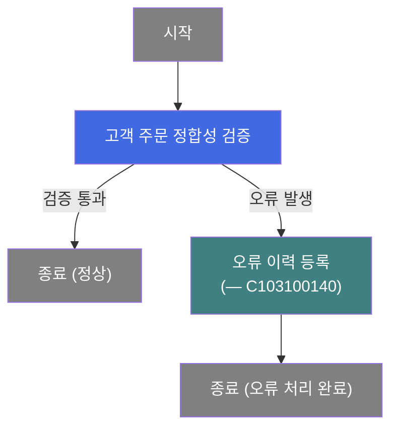
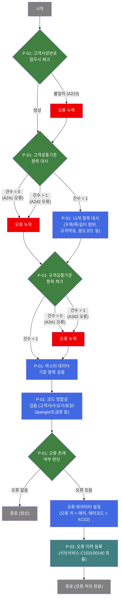
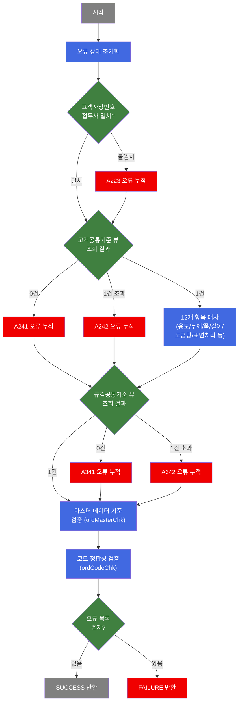

# C102177700 비즈니스 프로세스 분석서 (BPA)

## 1. 시스템 개요

| 항목 | 내용 |
|------|------|
| 서비스 ID | C102177700 |
| 업무명 | 고객 주문 에러 정합성 체크 |
| 서비스 타입 | nui |
| 분석 일시 | 2026-03-21 (KST) |
| 원본 분석일 | 2026-03-16 |
| 문서 버전 | 1.0 |

---

## 2. 시스템 목적

이 서비스는 OMS(주문관리시스템)에서 C10 MES로 전달된 고객 주문 항목이 생산 가부 판정을 받기 전 데이터 정합성을 사전 검증하는 역할을 수행한다. 주문이 고객공통사양·규격공통기준과 불일치하거나, 마스터 코드에 미등록된 값을 포함하거나, 두께·폭·길이 범위를 초과하는 경우를 탐지하여 품질설계 프로세스 진입 전에 오류를 걸러낸다.

검증 결과 오류가 없으면 다음 프로세스로 정상 진행되고, 오류가 하나라도 발견되면 오류 이력을 등록하는 서브서비스(C103100140)를 호출하여 에러 코드와 메시지를 기록한다. 에러 발생 시 즉시 중단하지 않고 모든 항목을 검사한 뒤 결과를 누적하므로, 한 번의 실행으로 주문 항목 전체의 오류 목록을 확인할 수 있다.

주 사용 대상은 생산가부요청 배치 처리 프로세스이며, 별도 UI 없이 NUI(배치/프로그램 호출) 방식으로 동작한다.

---

## 3. 핵심 워크플로우

---

## 4. 상세 워크플로우

### 프로세스 흐름도 — 고객 주문 정합성 검증 및 오류 등록 (P-01, P-02)

---

## 5. 비즈니스 로직 상세

P-01: 고객 주문 정합성 검증 — 고객공통/규격공통/마스터/코드 다단계 검증

- **입력**: 고객 주문 항목(주문두께·폭·길이, 규격약호, 규격년도, 최종수요가코드, 고객배치사양번호, 제품형태, 품명, 주문용도코드 등 약 20~60개 항목)
- **처리**:
  1. 오류 상태 초기화 (오류 없음 상태로 시작)
  2. **고객사양번호 접두사 체크**: 고객배치사양번호가 최종수요가코드로 시작하는지 검증. 불일치 시 A223 오류 누적
  3. **고객공통기준 대사**: 고객공통기준 뷰(VI_M00_C10A1020)를 조회하여 일치 건수 판단
     - 0건: A241 오류(미등록)
     - 1건 초과: A242 오류(중복)
     - 1건: 주문용도코드·규격약호·규격년도·최종수요가·품명·주문두께 범위·주문폭 범위·주문길이 범위(SHEET)·두께구분·도금량·표면처리·색상코드 등 12개 항목 대사. 범위 이탈 또는 상이 시 각 오류코드(A243~A254) 누적
     - 조합폭 처리: 슬리트 그룹 수 > 0이고 조합폭이 동일한 경우 `슬리트 수 × 단위폭`으로 환산하여 범위 비교; 이후 단순 합산 방식(최대 10개)도 지원
  4. **규격공통기준 체크**: 규격약호·규격년도가 유효한 경우 규격공통기준 뷰(VI_M00_C10A1010) 조회
     - 0건: A341 오류, 1건 초과: A342 오류
  5. **마스터 데이터 기준 검증**: 필수 주문 항목의 존재 여부, 범위 유효성, CCL BOM 칼라코드 일치 여부 등 EasyAccess 마스터 규칙(`C10A*`, `C10B*`) 기반으로 다수 항목 검증
  6. **코드 정합성 검증**: 품명·제품형태·유통경로·주문종류·주문용도코드 등 약 30개 항목을 EasyAccess 코드 테이블 기준으로 일괄 검증. 고객사코드·수요가코드·최종수요가코드는 별도 View(ACT_CUS_CD_SELECT, FNL_CUS_CD_SELECT) DB 조회로 유효성 확인. 포장방법·Spangle 구분·도금량은 제품형태/품명과의 조합 유효성도 별도 View로 검증
  7. 모든 오류는 즉시 중단 없이 누적되어 최종적으로 오류 메시지 목록과 오류 코드 목록으로 컨텍스트에 저장
  8. 오류 목록이 비어 있으면 정상 반환, 하나라도 있으면 오류 반환
- **출력**: 오류 메시지 누적 목록, 오류 코드 누적 목록 (컨텍스트)
- **예외**: 마스터데이터 조회 실패 시 해당 항목 오류로 처리 후 계속 진행

P-02: 오류 이력 등록 — 서브서비스 C103100140 호출

- **입력**: 오류 키(에러 상태), 품질설계 오류코드(KC02), 오류 메시지 목록 (P-01에서 누적된 결과)
- **처리**:
  1. 오류 파라미터 설정: 오류 키를 "에러 발생" 상태로, 품질설계 오류코드를 KC02로 설정
  2. 서브서비스 C103100140 호출하여 오류 이력을 영구 저장
  3. 서브서비스는 기존 트랜잭션 내에서 실행 (트랜잭션 공유)
- **출력**: 오류 이력이 관련 테이블에 등록됨
- **예외**: 서브서비스 실패 시 상위 서비스도 실패 처리

---

## 6. 커스텀 클래스 워크플로우

### DbCusOrderErrorCheck (약 4,087줄, DbOrderErrorCheck 유사 구조 — 소스 미존재)

**역할**: 고객 주문(Customer Order) 항목에 대해 고객공통기준·규격공통기준·마스터 데이터·코드 정합성을 다단계로 검증하여 오류 여부를 결정하는 NUI Activity. `prodSpecKind=1` 속성으로 고객 주문 특화 사양 체크를 수행한다.

**ordMasterChk 세부 동작**: 약 60개 주문 항목을 추출하여 필수값 존재 여부, 범위값 유효성, CCL BOM 칼라코드 일치 여부 등을 EasyAccess 마스터 규칙(`C10A*`, `C10B*`, `VI_M00_*`) 기반으로 검증한다. 조합폭은 최대 10개 슬리트 폭을 합산하는 방식과 `슬리트 수 × 단위폭` 방식 모두 지원한다.

**ordCodeChk 세부 동작**: 약 30개 주문 항목을 HashMap에 등록하고 EasyAccess 코드 테이블 기준으로 일괄 검증한다. 고객사코드·수요가코드·최종수요가코드는 별도 View DB 조회, 포장방법·Spangle 구분·도금량은 제품형태·품명과의 조합 View 조회로 검증한다.

---

## 7. 주요 유즈케이스

UC-01: 고객 주문 정합성 검증 (정상 경로)

- **Actor**: 생산가부요청 배치 프로세스
- **목적**: 고객 주문 항목이 생산 가부 판정에 진입할 수 있는 유효한 데이터인지 사전 검증
- **주요 흐름**:
  1. 배치 프로세스가 주문 항목 데이터와 함께 서비스 호출
  2. 고객사양번호 접두사, 고객공통기준 대사, 규격공통기준 체크, 마스터 검증, 코드 검증 순으로 다단계 검증 수행
  3. 모든 항목 통과 시 정상 종료하여 후속 생산가부 프로세스로 진행
- **예외**: 검증 항목 중 하나라도 오류 발생 시 UC-02로 전환

UC-02: 고객 주문 오류 탐지 및 이력 등록

- **Actor**: 생산가부요청 배치 프로세스
- **목적**: 정합성 오류가 있는 주문 항목의 오류 내역을 누적 기록하여 이후 오류 조치의 근거 데이터 생성
- **주요 흐름**:
  1. P-01 검증 과정에서 오류 발생 시 즉시 중단하지 않고 모든 항목 검증 계속 진행
  2. 오류 메시지와 오류 코드가 각각 쉼표 구분으로 누적
  3. 최종적으로 누적된 오류 목록과 함께 오류 파라미터(KC02)를 설정하고 C103100140 서브서비스 호출하여 오류 이력 영구 저장
- **예외**: 마스터 데이터 조회 장애 시 해당 항목 오류로 처리하고 나머지 항목 계속 검증

UC-03: 조합폭(Slit폭) 기반 주문폭 범위 검증

- **Actor**: 슬리팅(Slitting) 가공 주문 처리 배치
- **목적**: 여러 장으로 분할 절단되는 주문의 실제 폭이 고객공통기준 폭 범위 내에 있는지 검증
- **주요 흐름**:
  1. 슬리트 그룹 수와 조합폭 정보가 주문 항목에 포함된 경우 조합폭 계산 로직 적용
  2. 모든 슬리트 단위폭이 동일한 경우: `슬리트 수 × 단위폭`으로 환산
  3. 혼합 폭인 경우: 최대 10개 슬리트 폭 합산
  4. 환산된 조합폭이 고객공통기준 폭 하한~상한 범위 내인지 비교하여 이탈 시 A249 오류 누적
- **예외**: 슬리트 그룹 수가 0이거나 단순 주문인 경우 주문 폭(ord_exc_wth) 직접 비교

---

## 9. 관련 엔티티

### 엔티티 목록

| 엔티티(테이블/뷰) | 설명 | 사용 유형 |
|----------------|------|----------|
| VI_M00_C10A1020 | 고객공통기준 뷰 (M00APUSER 스키마) | 조회 |
| VI_M00_C10A1010 | 규격공통기준 뷰 (M00APUSER 스키마) | 조회 |
| ACT_CUS_CD_SELECT | 고객사코드 유효성 체크 뷰 | 조회 |
| FNL_CUS_CD_SELECT | 최종수요가코드 유효성 체크 뷰 | 조회 |
| ORD_PAK_MTH_SELECT | 제품형태별 포장방법 카테고리 체크 뷰 | 조회 |
| ORD_SPNL_TP_SELECT | 품명별 Spangle 구분 체크 뷰 | 조회 |
| GW_ASG_CD_SELECT | 품명별 도금량 지정 체크 뷰 | 조회 |

### 엔티티 간 관계
- VI_M00_C10A1020(고객공통기준 뷰)는 고객배치사양번호를 키로 하여 주문 항목과 대사되며, 주문두께·폭·길이의 허용 범위 기준을 제공한다.
- VI_M00_C10A1010(규격공통기준 뷰)는 규격약호·규격년도 조합으로 조회되어 규격 등록 여부를 검증한다.
- ACT_CUS_CD_SELECT·FNL_CUS_CD_SELECT는 마스터 코드 테이블과 연계된 고객사/수요가코드 조회용 뷰이다.
- ORD_PAK_MTH_SELECT·ORD_SPNL_TP_SELECT·GW_ASG_CD_SELECT는 제품형태 또는 품명과 특정 속성의 조합 유효성을 검증하는 뷰이다.

---

## 10. 서브서비스

| 서비스 ID | 설명 | 호출 시점 | 트랜잭션 | BPA 문서 |
|-----------|------|---------|---------|---------|
| C103100140 | 고객 주문 오류 이력 등록 | P-02: 정합성 검증 오류 발생 시 | 공유 (new-transaction=false) | 미작성 |

---

## 11. 특이사항 및 주의사항

### 1. 에러 누적 방식 (Fail-Accumulate 패턴)
일반적인 검증 로직과 달리 오류 발생 시 즉시 반환하지 않고 모든 항목을 검사한 후 오류 목록을 누적한다. 이를 통해 한 번의 서비스 실행으로 주문 항목의 모든 정합성 오류를 파악할 수 있어 운영 효율을 높인다.

### 2. 소스 코드 미존재 (DbCusOrderErrorCheck)
DbCusOrderErrorCheck 클래스의 소스 파일이 현재 저장소에 존재하지 않는다. 유사 클래스인 DbOrderErrorCheck(4,087라인)의 분석 보고서를 기반으로 추정한 내용이며, `prodSpecKind=1` 속성이 고객 주문 특화 검증 로직을 활성화하는 차이점으로 추정된다. 실제 배포 환경의 클래스와 상이할 수 있으므로 소스 확보 후 재검토 필요.

### 3. 조합폭(Slit폭) 이중 계산 방식
조합폭 계산 방식이 두 가지 공존한다: ①모든 슬리트 폭이 동일한 경우 `슬리트 수 × 단위폭`, ②혼합 폭인 경우 최대 10개 슬리트 폭 합산. 2016.08.17 변경 이력으로 두 방식이 혼재하므로, 슬리트 주문 처리 시 적용 방식에 유의해야 한다.

### 4. 다중 마스터 기준 참조
단일 주문 항목에 대해 고객공통기준(VI_M00_C10A1020), 규격공통기준(VI_M00_C10A1010), EasyAccess 마스터 규칙(`C10A*`, `C10B*`), 코드 테이블 등 복수의 기준이 동시에 적용된다. 마스터 데이터 변경 시 검증 결과가 달라질 수 있으므로 마스터 관리에 주의가 필요하다.

### 5. 서브서비스 트랜잭션 공유
C103100140 서브서비스는 `new-transaction=false`로 호출되어 기존 트랜잭션 내에서 오류 이력을 등록한다. 상위 트랜잭션 롤백 시 오류 이력도 함께 롤백될 수 있으므로 트랜잭션 경계 관리에 유의해야 한다.
