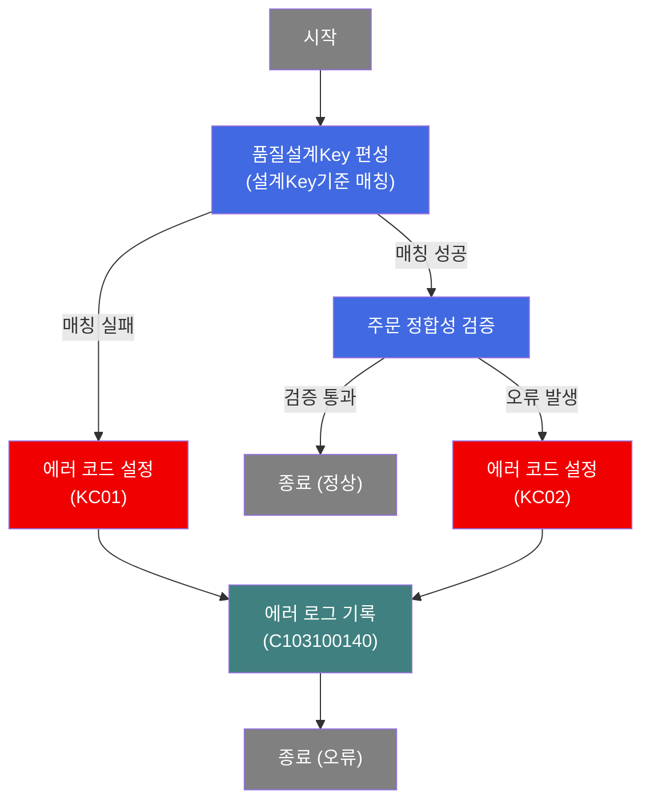
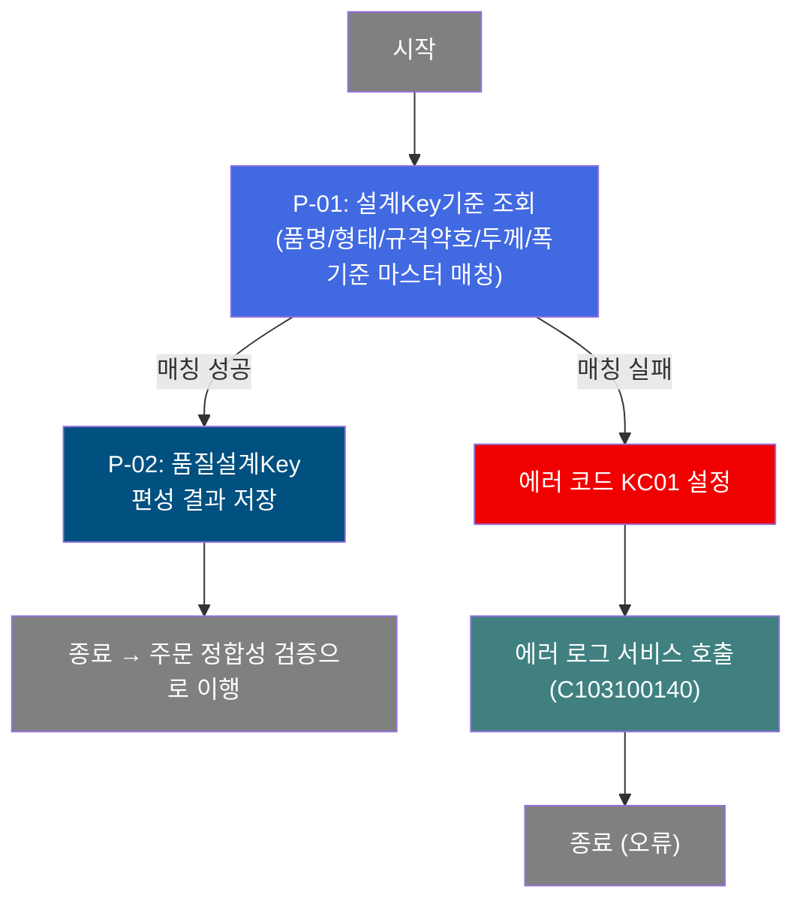
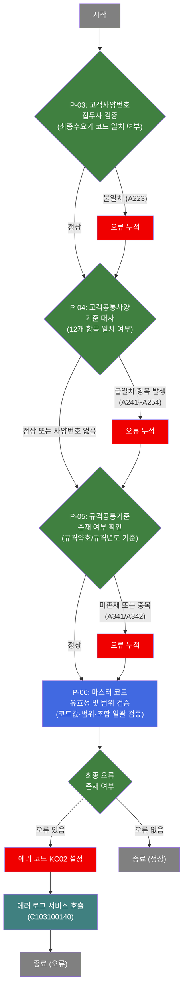
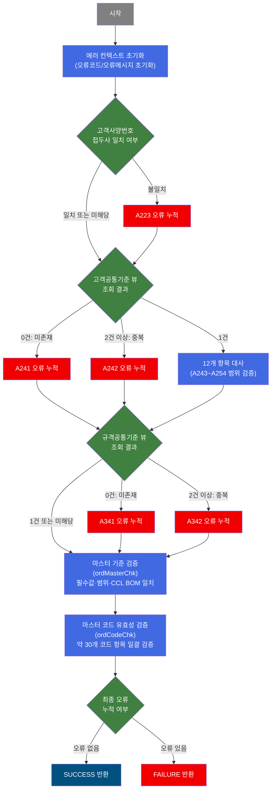

# C102177701 비즈니스 프로세스 분석서 (BPA)

## 1. 시스템 개요

| 항목 | 내용 |
|------|------|
| 서비스 ID | C102177701 |
| 업무명 | 생산가부요청 품질설계Key 편성 및 주문 정합성 검증 |
| 서비스 타입 | nui |
| 분석 일시 | 2026-03-21 (KST) |
| 원본 분석일 | 2026-03-16 |
| 문서 버전 | 1.0 |

---

## 2. 시스템 목적

OMS(주문관리시스템)에서 C10 MES로 전달된 생산가부요청 주문 데이터에 대해 품질설계Key를 편성하고, 주문 항목의 데이터 정합성을 사전 검증하는 배치 서비스이다. 주문 처리 파이프라인의 초입부에서 실행되어, 이후 품질설계 및 생산 프로세스로 진입하기 전에 오류가 있는 주문을 조기에 탐지한다.

서비스는 두 단계로 운영된다. 첫째, 마스터 데이터(설계Key기준)를 조회하여 주문 속성(품명, 제품형태, 규격약호, 주문두께/폭 등)에 맞는 품질설계Key를 우선순위 기반으로 매칭한다. 둘째, 매칭된 주문 항목에 대해 고객공통사양 일치 여부, 규격공통기준 존재 여부, GLUE 마스터 코드 유효성, 마스터 데이터 기준값 범위 이탈 여부 등 다각도의 정합성 검증을 수행한다.

검증 결과 오류가 발생하면 에러 코드와 메시지를 누적하여 에러 로그 서비스(C103100140)를 호출하고, 정상이면 성공으로 종료하여 다음 처리 단계로 이행한다. 주요 사용자는 MES 배치 스케줄러이며, OMS와 MES 간 생산가부요청 연동 흐름의 핵심 검증 관문 역할을 담당한다.

---

## 3. 핵심 워크플로우

---

## 4. 상세 워크플로우

### 프로세스 흐름도 — 품질설계Key 편성 (P-01, P-02)

### 프로세스 흐름도 — 주문 정합성 검증 (P-03, P-04, P-05, P-06)

---

## 5. 비즈니스 로직 상세

P-01: 품질설계Key 매칭 — 설계Key기준(C10B1040) 마스터에서 우선순위 기반 매칭

- **입력**: 생산가부요청 주문 항목(품명, 제품형태, 규격약호, 주문용도코드, 고객사코드, 고객사양번호, 주문두께, 주문폭)
- **처리**:
  1. GLUE EasyAccess API를 통해 설계Key기준 마스터(C10B1040) 조회 (제품사양종류=1 조건 적용)
  2. 필수 Match 조건(품명, 제품형태, 규격약호, 주문두께, 주문폭)으로 1차 매칭
  3. 선택 Match 조건(주문용도코드, 고객사코드, 고객사양번호)을 추가하여 우선순위 단계적 조건 완화
  4. 매칭 결과를 품질설계Key 결과 집합으로 구성
- **출력**: 품질설계Key 매칭 결과 집합(RK_MAIN)
- **예외**: 매칭 결과 없음 → 에러코드 KC01 설정 후 에러 로그 서비스 호출로 분기

P-02: 품질설계Key 편성 결과 저장 — 매칭된 품질설계Key 결과 보존

- **입력**: P-01에서 매칭된 품질설계Key 결과 집합
- **처리**:
  1. 매칭 결과를 컨텍스트에 저장하여 이후 검증 단계에서 참조 가능하도록 유지
- **출력**: 품질설계Key 편성 완료 상태
- **예외**: 없음

P-03: 고객사양번호 접두사 검증 — 최종수요가 코드 일치 여부 확인

- **입력**: 주문 항목의 고객배치사양번호(cus_bth_pap_no), 최종수요가코드(fnl_cus_cd)
- **처리**:
  1. 고객배치사양번호가 유효한 값인지 확인
  2. 고객배치사양번호가 최종수요가코드로 시작하는지 검증
  3. 불일치 시 오류코드 A223을 오류 목록에 누적
- **출력**: 오류 누적 목록(오류 발생 시)
- **예외**: 고객배치사양번호가 최종수요가코드로 시작하지 않음 → A223 오류 누적 (즉시 중단하지 않고 계속 검증)

P-04: 고객공통사양 기준 대사 — 고객공통기준 뷰에서 12개 주문 항목 일치 여부 검증

- **입력**: 주문 항목의 고객배치사양번호, 고객공통기준 뷰(VI_M00_C10A1020)
- **처리**:
  1. 고객배치사양번호로 고객공통기준 뷰 조회
  2. 조회 결과 0건: 고객공통기준 미존재 오류(A241) 누적
  3. 조회 결과 2건 이상: 고객공통기준 중복 오류(A242) 누적
  4. 조회 결과 1건: 주문용도코드(A243), 규격약호(A244), 규격년도(A245), 최종수요가(A246), 품명(A247), 주문두께 범위(A248), 주문폭 범위(A249), 주문길이 범위(A250, SHEET 제품형태만), 두께구분코드(A251), 도금량(A252), 주문표면처리(A253), 색상코드(A254) 등 12개 항목 대사
  5. 조합폭 계산: slit 수 × 조합폭 값 (slit 수 > 0이고 실행폭 = 조합폭1인 경우), 또는 조합폭 단순 합산
- **출력**: 항목별 불일치 오류 누적
- **예외**: 고객배치사양번호가 null인 경우 이 검증 단계 건너뜀; 각 불일치 항목별 개별 오류 코드(A241~A254) 누적

P-05: 규격공통기준 존재 여부 확인 — 규격약호/규격년도 기준 규격공통기준 뷰 조회

- **입력**: 주문 항목의 규격약호(spc_avr), 규격년도(spc_yr), 규격공통기준 뷰(VI_M00_C10A1010)
- **처리**:
  1. 규격약호와 규격년도가 모두 유효한 값인지 확인
  2. 규격공통기준 뷰를 규격약호+규격년도 조건으로 조회
  3. 조회 결과 0건: 규격공통기준 미존재 오류(A341) 누적
  4. 조회 결과 2건 이상: 규격공통기준 중복 오류(A342) 누적
- **출력**: 오류 누적 목록(오류 발생 시)
- **예외**: 규격약호 또는 규격년도가 null인 경우 이 검증 단계 건너뜀

P-06: 마스터 코드 유효성 및 범위 검증 — 약 30개 주문 코드 항목 일괄 검증 및 마스터 기준 범위 검증

- **입력**: 주문 항목 약 60개(코드값·범위값 포함), GLUE EasyAccess 마스터 규칙, 고객사코드 뷰(ACT_CUS_CD_SELECT), 최종수요가코드 뷰(FNL_CUS_CD_SELECT), 포장방법 카테고리 뷰(ORD_PAK_MTH_SELECT), Spangle구분 뷰(ORD_SPNL_TP_SELECT), 도금량지정 뷰(GW_ASG_CD_SELECT)
- **처리**:
  1. 코드 유효성 검증(ordCodeChk): 품명, 제품형태, 유통경로, 주문종류, 주문용도코드, 주문Edge, 수지구분 등 약 30개 항목을 GLUE 마스터 코드로 일괄 검증
  2. 고객사코드, 수요가코드, 최종수요가코드를 DB 뷰 조회로 별도 검증(미존재/중복 오류)
  3. 제품형태별 포장방법 조합 유효성 검증
  4. 품명별 Spangle구분 유효성 검증
  5. 품명별 도금량지정 유효성 검증
  6. 마스터 기준 검증(ordMasterChk): 설계Key 기준(C10A*, C10B*, VI_M00_* EasyAccess 규칙) 기반 필수값 존재 여부, 범위값 유효성, CCL BOM 칼라코드 일치 여부 등 다수 항목 검증
  7. 모든 오류를 즉시 중단하지 않고 전체 항목 체크 후 누적
  8. 누적 오류 존재 여부로 최종 성공/실패 판정
- **출력**: 누적 오류 목록 및 오류코드 목록; 오류 없음이면 성공 반환
- **예외**: 개별 항목 코드 검증 실패 시 해당 오류 누적 후 계속 진행 (모든 오류를 한 번에 수집하는 설계)

---

## 6. 커스텀 클래스 워크플로우

### DbSearchQualkey (소스 파일 미존재 — 추정 분석)

**역할**: 마스터 데이터 설계Key기준(C10B1040)을 조회하여 주문 속성 기반으로 품질설계Key를 우선순위에 따라 매칭하는 Activity. `DbSearchQualKeyMatch`의 이전/단순화 버전으로 추정.

> 소스 파일이 프로젝트에 존재하지 않아 줄 수 확인 불가. 유사 클래스 기반 추정 분석이므로 Mermaid 워크플로우를 생략한다.

---

### DbOrderErrorCheck (4,087줄)

**역할**: 생산가부요청 주문 항목들에 대해 고객공통사양·규격공통기준·마스터 코드·마스터 기준값 등 다각도 정합성 검증을 수행하고 에러를 누적하여 성공/실패를 반환하는 Activity.

---

## 7. 주요 유즈케이스

UC-01: 품질설계Key 편성 성공 및 주문 정합성 통과

- **Actor**: MES 배치 스케줄러 (OMS 연동 처리)
- **목적**: 생산가부요청 주문에 품질설계Key를 편성하고 정합성을 확인하여 다음 처리 단계로 이행
- **주요 흐름**:
  1. 주문 속성(품명, 형태, 규격, 두께, 폭)으로 설계Key기준 마스터 매칭 수행
  2. 우선순위 기반 매칭 성공 → 품질설계Key 편성 결과 저장
  3. 고객공통사양 대사, 규격공통기준 확인, 마스터 코드 유효성 검증 모두 통과
  4. 성공 반환 → 다음 서비스로 이행
- **예외**: 없음 (정상 경로)

UC-02: 품질설계Key 매칭 실패로 인한 에러 로그 기록

- **Actor**: MES 배치 스케줄러
- **목적**: 설계Key기준에 매칭되는 항목이 없는 주문에 대해 오류를 기록하고 처리 중단
- **주요 흐름**:
  1. 주문 속성으로 설계Key기준 마스터 매칭 시도
  2. 매칭 결과 없음 → 에러코드 KC01 설정
  3. 에러 로그 서비스(C103100140) 호출하여 오류 내역 기록
  4. 오류 종료
- **예외**: 설계Key기준 마스터 데이터 자체가 없는 경우 동일 처리

UC-03: 주문 정합성 오류 발생 및 다항목 오류 누적 후 에러 로그 기록

- **Actor**: MES 배치 스케줄러
- **목적**: 주문 항목이 고객공통사양·마스터 코드 등 기준에 맞지 않는 경우 모든 오류를 한 번에 수집하여 에러 로그에 기록
- **주요 흐름**:
  1. 품질설계Key 편성 성공 후 정합성 검증 단계 진입
  2. 고객사양번호 불일치, 두께 범위 이탈, 마스터 코드 미등록 등 여러 항목에서 오류 발생
  3. 즉시 중단하지 않고 전체 항목 검증 후 모든 오류를 쉼표 구분으로 누적
  4. 에러코드 KC02 설정
  5. 에러 로그 서비스(C103100140) 호출하여 모든 오류 내역 기록
- **예외**: 오류 항목이 단 하나여도 동일 흐름 적용

---

## 9. 관련 엔티티

### 엔티티 목록

| 엔티티(테이블/뷰) | 설명 | 사용 유형 |
|------------------|------|----------|
| C10B1040 (EasyAccess) | 설계Key기준 마스터 데이터 | 조회 |
| VI_M00_C10A1020 | 고객공통기준 뷰 (고객배치사양 기반) | 조회 |
| VI_M00_C10A1010 | 규격공통기준 뷰 (규격약호/규격년도 기반) | 조회 |
| ACT_CUS_CD_SELECT | 고객사코드(거래처코드) 유효성 확인 뷰 | 조회 |
| FNL_CUS_CD_SELECT | 최종수요가코드 유효성 확인 뷰 | 조회 |
| ORD_PAK_MTH_SELECT | 제품형태별 포장방법 카테고리 유효성 뷰 | 조회 |
| ORD_SPNL_TP_SELECT | 품명별 Spangle구분 유효성 뷰 | 조회 |
| GW_ASG_CD_SELECT | 품명별 도금량지정 유효성 뷰 | 조회 |

### 엔티티 간 관계
- VI_M00_C10A1020(고객공통기준)은 주문의 고객배치사양번호를 기준으로 조회되며, 주문 항목 12개 속성의 기준값을 제공한다.
- VI_M00_C10A1010(규격공통기준)은 주문의 규격약호와 규격년도를 기준으로 조회되며, 규격 등록 여부를 검증한다.
- C10B1040(설계Key기준)은 EasyAccess를 통해 접근되며, 주문 속성에 매칭되는 품질설계Key를 제공한다.
- ACT_CUS_CD_SELECT, FNL_CUS_CD_SELECT 등 코드 유효성 뷰는 주문 항목의 각 코드값이 마스터에 등록된 유효한 값인지 확인하는 데 사용된다.

---

## 10. 서브서비스

| 서비스 ID | 설명 | 호출 시점 | 트랜잭션 | BPA 문서 |
|-----------|------|---------|---------|---------|
| C103100140 | 생산가부요청 에러 로그 기록 서비스 | 품질설계Key 매칭 실패(KC01) 또는 주문 정합성 오류 발생(KC02) 시 | 공유 (new-transaction: false) | 미작성 |

---

## 11. 특이사항 및 주의사항

### 1. 오류 누적 설계 (Non-Fail-Fast 방식)
일반적인 에러 발생 즉시 중단 방식과 달리, 이 서비스는 주문 항목의 모든 검증 항목을 끝까지 수행한 후 오류를 쉼표 구분으로 누적한다. 이를 통해 하나의 배치 실행으로 해당 주문의 모든 정합성 문제를 한 번에 파악할 수 있다. `setError()` 메소드를 통해 에러 메시지와 에러 코드를 각각 누적하는 패턴을 통일 적용한다.

### 2. DbOrderErrorCheck의 대규모 복잡도 (4,087줄)
주문 정합성 검증 Activity(DbOrderErrorCheck)는 4,087줄에 달하는 대규모 클래스로, 단일 메소드 `ordMasterChk`만 약 2,900여 줄을 차지한다. 약 60개 주문 항목, 수십 개의 EasyAccess 마스터 규칙(C10A*, C10B*, VI_M00_* 등), 7개의 DB 뷰 조회가 통합되어 있다. 향후 유지보수 시 검증 항목별 변경 범위를 신중하게 확인해야 한다.

### 3. 품질설계Key 매칭 소스 미존재 위험
품질설계Key 편성을 담당하는 DbSearchQualkey 클래스의 소스 파일이 현재 프로젝트에 존재하지 않는다. 유사 클래스 DbSearchQualKeyMatch 기반의 추정 분석으로 처리되었으며, 실제 구현 상세를 확인하기 위해서는 별도 소스 확보가 필요하다. 이 클래스가 변경될 경우 품질설계Key 편성 실패 오류(KC01) 발생 빈도에 직접 영향을 준다.

### 4. 조합폭 계산 이중 로직
주문폭 범위 검증(A249)에서 조합폭 계산 방식이 두 가지다. 초기 방식은 `slit수 × 조합폭1`(동일 폭 조합 가정)이고, 2016년 이후 변경으로 `조합폭1 + 조합폭2 + ... + 조합폭10`의 단순 합산 방식도 지원한다. 두 로직이 함께 존재하므로 폭 관련 오류 발생 시 어느 계산 방식이 적용되었는지 조건을 확인해야 한다.

### 5. 에러 로그 서비스 트랜잭션 공유
에러 발생 시 호출되는 서브서비스 C103100140은 `new-transaction: false`로 설정되어 현재 트랜잭션을 공유한다. 에러 로그 서비스 호출 중 예외 발생 시 상위 트랜잭션에 영향을 줄 수 있으므로, 에러 로그 서비스의 정상 동작 여부가 전체 서비스의 안정성에 영향을 미친다.
