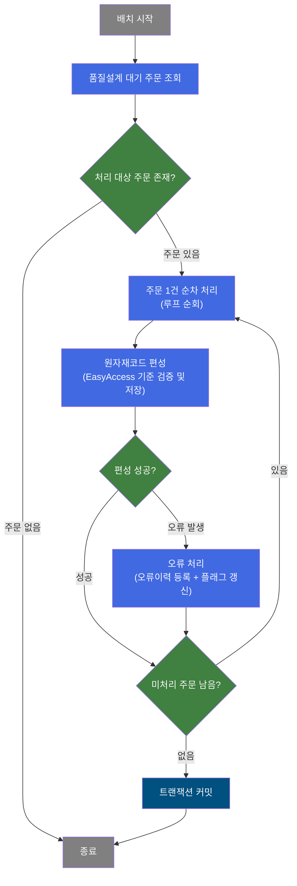
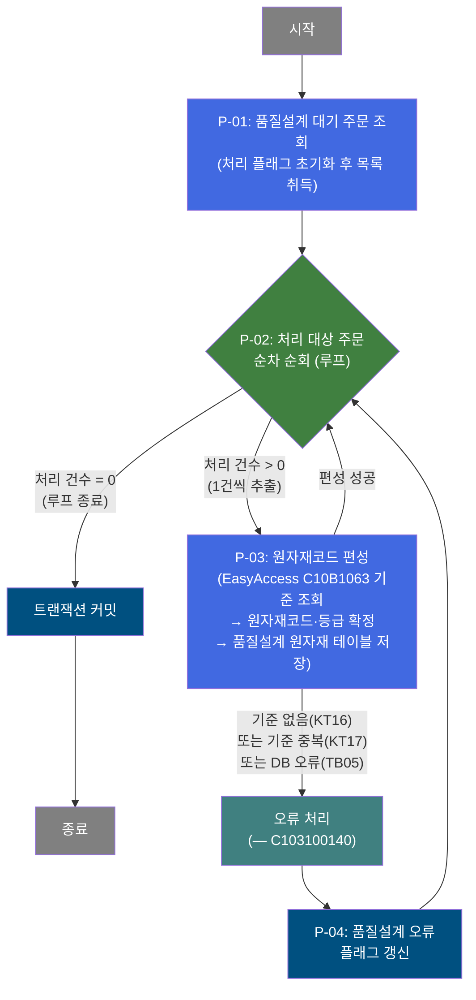
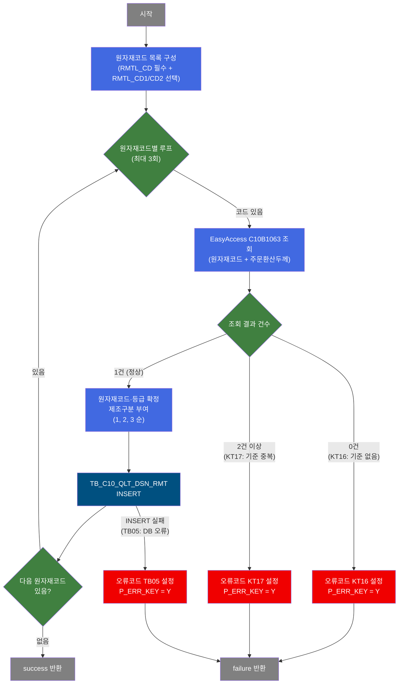

# C103100010 비즈니스 프로세스 분석서 (BPA)

## 1. 시스템 개요

| 항목 | 내용 |
|------|------|
| 서비스 ID | C103100010 |
| 업무명 | 품질설계 오류주문 재처리 (원자재코드 편성) |
| 서비스 타입 | nui |
| 분석 일시 | 2026-03-21 (KST) |
| 원본 분석일 | 2026-03-16 |
| 문서 버전 | 1.0 |

---

## 2. 시스템 목적

본 서비스는 품질설계 공통 테이블에서 처리 대기 상태인 주문을 배치로 조회하고, 각 주문에 연결된 원자재코드(최대 3종)를 EasyAccess 마스터 기준(C10B1063)과 대조하여 원자재코드 및 원자재등급을 확정한 뒤 품질설계 원자재 테이블에 저장하는 배치 프로세스이다.

원자재코드 편성 과정에서 기준 데이터가 없거나 중복될 경우 오류 주문으로 분류하며, 서브서비스(C103100140)를 통해 오류 정보를 기록하고 해당 주문의 품질설계 오류 여부 플래그를 갱신한다. 이를 통해 품질설계 자동화 흐름에서 발생하는 원자재코드 편성 오류를 체계적으로 관리하고 후속 처리 단계(원자재 기준 갱신 후 재처리)에 대비한다.

본 서비스는 사용자 직접 호출이 없는 배치(NUI) 서비스로, 스케줄러 또는 상위 배치 프로세스에 의해 자동으로 기동된다.

---

## 3. 핵심 워크플로우

---

## 4. 상세 워크플로우

### 프로세스 흐름도 — 원자재코드 편성 처리 (P-01, P-02, P-03)

---

## 5. 비즈니스 로직 상세

P-01: 품질설계 대기 주문 조회 — 배치 처리 대상 주문 목록 취득

- **입력**: 처리 구분 플래그(C=조회 대상) 초기화 파라미터
- **처리**:
  1. 배치 시작 시 내부 처리 플래그를 "C"(Create/조회 모드)로 초기화
  2. 품질설계 공통 테이블(TB_C10_QLT_DSN_CMN)에서 품질설계 상태가 대기인 주문을 전체 조회
  3. 조회 결과를 내부 ResultSet으로 보관하여 이후 루프 처리에 전달
- **출력**: 품질설계 대기 주문 목록 (주문번호, 주문행번, 품질설계상태코드, 제품정보, 규격정보 등)
- **예외**: 조회 대상이 없는 경우 → 루프 즉시 종료, 커밋 후 배치 정상 종료

P-02: 처리 대상 주문 순차 순회 — 루프 제어 (매 주문 1건씩)

- **입력**: P-01에서 조회한 전체 주문 ResultSet, 루프 카운터
- **처리**:
  1. 최초 진입 시 전체 처리 건수로 루프 카운터 초기화
  2. 매 루프 진입마다 에러 플래그(P_ERR_KEY="N") 및 품질설계 오류 여부(QLT_DSN_ERR_YN="") 초기화
  3. 루프 카운터를 1씩 감소시키며 현재 처리 Row를 컨텍스트에 바인딩 (주문번호, 주문행번, 원자재코드 등 7개 항목)
  4. 처리 건수가 0이 되면 루프 카운터 제거 후 종료 전이(exit) 반환
- **출력**: 현재 처리 중인 주문의 주요 속성(주문번호, 주문행번, 원자재코드 3종, 주문환산두께, 원자재선호코드)이 컨텍스트에 세팅
- **예외**: 파라미터 설정 누락 → 배치 실패 반환

P-03: 원자재코드 편성 — EasyAccess 기준 검증 및 품질설계 원자재 데이터 저장

- **입력**: 컨텍스트의 원자재코드(RMTL_CD, RMTL_CD1, RMTL_CD2), 주문환산두께, 원자재선호코드, 주문번호/주문행번
- **처리**:
  1. 원자재코드 목록 구성: RMTL_CD는 항상 포함, RMTL_CD1·RMTL_CD2는 값이 있는 경우에만 추가 (최대 3종)
  2. 원자재코드별 순차 처리 (제조구분 1, 2, 3 자동 부여):
     - EasyAccess 업무기준 C10B1063에 원자재코드 + 주문환산두께를 입력하여 조회
     - 조회 결과 1건: 원자재코드 및 원자재등급 확정 → 품질설계 원자재 테이블(TB_C10_QLT_DSN_RMT)에 INSERT
     - 조회 결과 0건: 에러코드 KT16(기준 없음) 설정, 오류 전이 반환
     - 조회 결과 2건 이상: 에러코드 KT17(기준 중복) 설정, 오류 전이 반환
  3. 루프 중 하나라도 실패하면 즉시 오류 전이로 분기
- **출력**: 성공 시 TB_C10_QLT_DSN_RMT에 원자재별 품질설계 원자재 레코드 저장 (주문번호, 주문행번, 제조구분, 원자재코드, 원자재등급 포함)
- **예외**:
  - KT16 (EasyAccess 기준 데이터 없음) → 오류 처리 프로세스(P-03 이후 서브서비스)로 분기
  - KT17 (EasyAccess 기준 데이터 중복) → 오류 처리 프로세스로 분기
  - TB05 (DB INSERT 실패) → 오류 처리 프로세스로 분기

P-04: 품질설계 오류 플래그 갱신 — 오류 주문 상태 갱신

- **입력**: 주문번호, 주문행번 (에러 발생 주문 식별자)
- **처리**:
  1. 서브서비스 C103100140을 통해 오류이력 등록 처리 완료 후
  2. 품질설계 공통 테이블(TB_C10_QLT_DSN_CMN)의 해당 주문에 대해 품질설계 오류 여부 플래그를 'Y'로 갱신
  3. 감사 정보(최종 수정 객체 유형, 수정 객체 ID, 수정 프로그램 ID, 수정 시각) 함께 기록
- **출력**: TB_C10_QLT_DSN_CMN의 QLT_DSN_ERR_YN = 'Y' 갱신
- **예외**: 갱신 실패 시 트랜잭션 롤백 대상이 됨

---

## 6. 커스텀 클래스 워크플로우

### DbSearchRmtlCdData (약 183줄)

**역할**: 주문의 원자재코드(최대 3종)를 EasyAccess 업무기준 C10B1063과 대조하여 원자재코드·원자재등급을 확정하고, 품질설계 원자재 테이블(TB_C10_QLT_DSN_RMT)에 저장하는 배치 액티비티.

---

### DbQualDesignLoop (약 171줄)

**역할**: 이전 액티비티(PosSearch)가 조회한 주문 ResultSet을 1건씩 순차 순회하기 위한 루프 제어 액티비티. 처리 건수 카운터를 관리하고, 매 루프마다 현재 Row의 컬럼값을 컨텍스트에 바인딩한다. 40개 이상의 배치 서비스에서 공통으로 사용되는 범용 컴포넌트.

(171줄로 200줄 미만이므로 Mermaid 미작성)

---

## 7. 주요 유즈케이스

UC-01: 품질설계 대기 주문 원자재코드 자동 편성

- **Actor**: 배치 스케줄러 (자동 실행)
- **목적**: 품질설계 공통 테이블의 대기 주문에 대해 원자재코드를 EasyAccess 기준과 대조하여 품질설계 원자재 정보를 자동으로 편성하고 저장
- **주요 흐름**:
  1. 배치 프로세스가 품질설계 대기 주문 목록을 조회
  2. 주문 1건씩 순차적으로 원자재코드(최대 3종) 편성 처리
  3. EasyAccess 업무기준(C10B1063)에서 원자재코드와 주문환산두께로 원자재등급 확정
  4. 확정된 원자재 정보를 품질설계 원자재 테이블에 저장 (제조구분 1/2/3 자동 부여)
  5. 전체 주문 처리 완료 후 트랜잭션 커밋
- **예외**: 대기 주문이 없으면 즉시 정상 종료

UC-02: 원자재코드 편성 오류 주문 처리

- **Actor**: 배치 스케줄러 (자동 실행)
- **목적**: 원자재코드 편성 과정에서 EasyAccess 기준 조회 실패(기준 없음 또는 중복) 또는 DB 오류가 발생한 주문에 대해 오류를 기록하고 해당 주문을 오류 상태로 표시
- **주요 흐름**:
  1. 원자재코드 편성 중 오류 조건 감지 (KT16/KT17/TB05)
  2. 서브서비스(C103100140)를 통해 오류이력 등록
  3. 품질설계 공통 테이블의 해당 주문에 오류 여부 플래그('Y') 갱신
  4. 다음 주문 처리로 루프 계속 진행 (단건 오류가 전체 배치를 중단시키지 않음)
- **예외**: 플래그 갱신 실패 시 해당 주문 트랜잭션 처리는 롤백 대상이 됨

UC-03: 다중 원자재코드 주문 처리

- **Actor**: 배치 스케줄러 (자동 실행)
- **목적**: 1개 주문에 최대 3개의 원자재코드(RMTL_CD, RMTL_CD1, RMTL_CD2)가 있는 경우 각각을 독립적으로 편성하여 제조구분(1, 2, 3)을 부여하며 저장
- **주요 흐름**:
  1. 주문의 원자재코드 목록 구성 (RMTL_CD 필수, RMTL_CD1·RMTL_CD2는 값이 있을 때만 포함)
  2. 각 원자재코드에 대해 EasyAccess 기준 조회 및 등급 확정
  3. 제조구분 1, 2, 3을 순서대로 부여하며 각각 별도 레코드로 저장
  4. 어느 하나라도 편성 실패 시 해당 주문 전체를 오류 처리
- **예외**: RMTL_CD3는 처리 대상에서 제외됨 (상수 정의만 존재)

---

## 9. 관련 엔티티

### 엔티티 목록

| 엔티티(테이블) | 설명 | 사용 유형 |
|---------------|------|----------|
| TB_C10_QLT_DSN_CMN | 품질설계 공통 정보 테이블. 주문별 품질설계 상태, 규격, 고객정보 등을 관리 | 조회, 갱신 |
| TB_C10_QLT_DSN_RMT | 품질설계 원자재 결과 테이블. 주문별 확정된 원자재코드·등급 정보를 저장 | 저장 |

### 엔티티 간 관계

- TB_C10_QLT_DSN_CMN은 품질설계 처리의 중심 테이블로, 주문번호와 주문행번을 기준으로 대기 주문을 식별한다.
- TB_C10_QLT_DSN_RMT는 TB_C10_QLT_DSN_CMN의 주문번호·주문행번을 외래키로 참조하며, 1개 주문에 대해 최대 3건(제조구분 1/2/3)의 원자재 레코드를 가질 수 있다.
- 오류 발생 시 TB_C10_QLT_DSN_CMN의 품질설계 오류 여부 플래그(QLT_DSN_ERR_YN)가 'Y'로 갱신되어 오류 주문을 식별한다.

---

## 10. 서브서비스

| 서비스 ID | 설명 | 호출 시점 | 트랜잭션 | BPA 문서 |
|-----------|------|---------|---------|---------|
| C103100140 | 품질설계 원자재코드 편성 오류이력 등록 | P-03 원자재코드 편성 실패 시 (KT16/KT17/TB05 오류) | 공유 (new-transaction=false) | 미작성 |

---

## 11. 특이사항 및 주의사항

### 1. EasyAccess 업무기준 의존성
원자재코드 편성의 성공 여부는 EasyAccess 업무기준 C10B1063의 데이터 정합성에 전적으로 의존한다. 기준 데이터가 없거나 중복된 경우 해당 주문은 자동으로 오류 처리되므로, C10B1063 기준 테이블의 관리(정기 점검, 누락/중복 정비)가 배치 정상 가동의 전제조건이다.

### 2. 단건 오류 격리 설계
원자재코드 편성 오류가 발생해도 배치 전체가 중단되지 않는다. 오류 주문은 서브서비스(C103100140)로 이력을 남기고 플래그를 갱신한 뒤, 루프는 다음 주문으로 계속 진행한다. 이를 통해 일부 주문의 기준 데이터 이상이 전체 품질설계 배치에 영향을 미치지 않도록 설계되어 있다.

### 3. 루프 처리 성능 특성 (DbQualDesignLoop)
루프 제어 액티비티(DbQualDesignLoop)는 매 루프마다 ResultSet 커서를 처음부터 재탐색하는 방식(O(n²))을 사용한다. 처리 대상 주문 건수가 많아질수록(예: 100건 처리 시 최대 5,050회 탐색) 처리 시간이 급격히 증가할 수 있으므로, 배치 실행 시간 모니터링과 처리 건수 관리가 필요하다.

### 4. 다중 원자재코드 처리 범위
주문당 최대 3종의 원자재코드(RMTL_CD, RMTL_CD1, RMTL_CD2)를 처리하며, RMTL_CD3는 상수 정의만 존재하고 실제 처리 로직에서는 제외된다. 향후 4번째 원자재코드 처리가 필요해지면 DbSearchRmtlCdData 클래스의 코드 변경이 필요하다.

### 5. 트랜잭션 범위와 오류 서브서비스 공유
서브서비스 C103100140은 `new-transaction=false` 설정으로 호출되어 메인 서비스와 동일한 트랜잭션을 공유한다. 따라서 오류이력 등록 및 플래그 갱신 처리도 루프 종료 후 일괄 커밋 대상에 포함된다.
