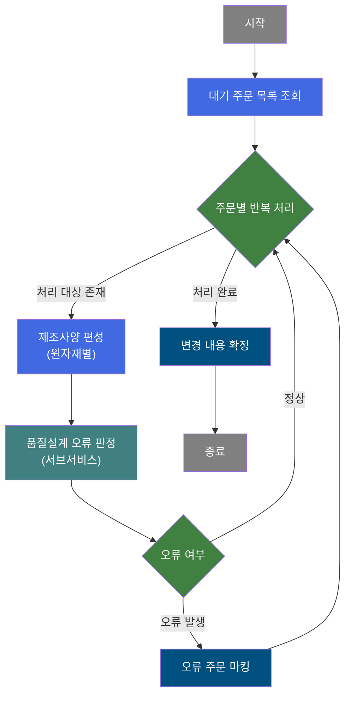
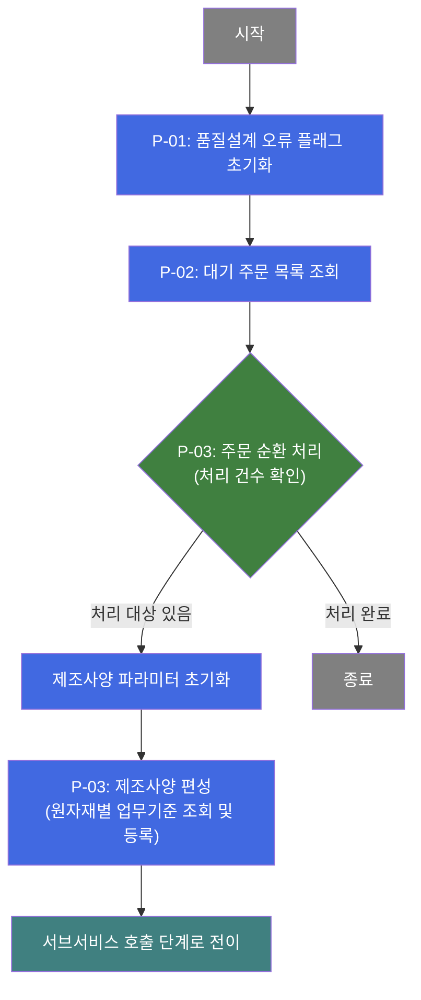
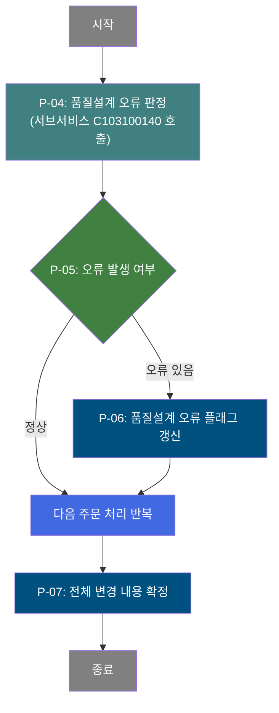
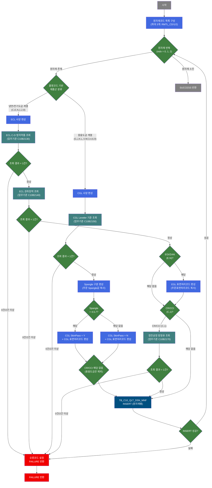

# C103100020 비즈니스 프로세스 분석서 (BPA)

## 1. 시스템 개요

| 항목 | 내용 |
|------|------|
| 서비스 ID | C103100020 |
| 업무명 | 품질설계 공통 대기 주문 제조사양 일괄 편성 |
| 서비스 타입 | nui |
| 분석 일시 | 2026-03-21 (KST) |
| 원본 분석일 | 2026-03-16 |
| 문서 버전 | 1.0 |

---

## 2. 시스템 목적

이 서비스는 품질설계 공통 테이블에서 처리 대기 중인 주문을 일괄 조회하여, 각 주문의 제품군(냉연/전기도금/용융도금 등)에 맞는 제조사양을 자동으로 편성하는 배치 프로세스이다.

제조사양 편성은 업무기준(ECL C-D 방지 약품, ECL 권취장력, CGL Leveler 설정, 정전공정 방청유 등)을 마스터 데이터베이스에서 조회하여 결정하며, 하나의 주문에 최대 3개의 원자재(적정 1종 + 차선 2종)가 배정될 수 있어 각 원자재별로 독립적인 제조사양 레코드를 생성한다. 제조사양 편성 중 업무기준이 누락되거나 중복된 경우, 해당 주문은 품질설계 오류 주문으로 마킹된다.

서브서비스(C103100140)를 통해 품질설계 오류 여부를 별도 처리한 뒤, 오류로 판정된 주문은 품질설계 오류 플래그를 갱신하고 DB에 확정 저장한다. 전체 대기 주문을 1건씩 순환 처리하는 루프 방식으로 동작하며, MES 스케줄러에 의해 주기적으로 호출된다.

---

## 3. 핵심 워크플로우

---

## 4. 상세 워크플로우

### 프로세스 흐름도 — 제조사양 편성 (P-01, P-02, P-03)

### 프로세스 흐름도 — 품질설계 오류 처리 (P-04, P-05, P-06)

---

## 5. 비즈니스 로직 상세

P-01: 오류 플래그 초기화 — 처리 시작 전 에러 상태 초기화

- **입력**: 없음 (시스템 내부 파라미터)
- **처리**:
  1. 처리 진행 플래그를 "C"(공통 처리)로 설정하여 후속 액티비티가 처리 구분을 인식할 수 있도록 한다
- **출력**: 내부 컨텍스트 파라미터 세팅
- **예외**: 없음

P-02: 대기 주문 목록 조회 — 품질설계 공통 대기 주문 일괄 조회

- **입력**: 처리 진행 플래그(P_PROC_FLAG=C) 기준으로 TB_C10_QLT_DSN_CMN에서 대기 주문 전체 조회
- **처리**:
  1. 품질설계 상태코드, 공장구분, 품명코드, 제품형태, 주문형태, 제품등급, 수요가코드, 주문 치수(두께/폭/길이) 등 제조사양 편성에 필요한 주문 기본 정보를 전체 조회한다
  2. 조회된 결과는 루프 처리의 입력 데이터셋이 된다
- **출력**: 대기 주문 목록 (ResultSet)
- **예외**: 조회 결과 0건인 경우 즉시 루프 종료

P-03: 제조사양 편성 — 원자재별 품명코드 기반 제조사양 결정 및 등록

- **입력**: 주문의 품명코드(PRD_NM_CD), 원자재코드(RMTL_CD 최대 3개), 냉연제조표준번호, 주문두께, 주문표면처리코드, 주문 Spangle 구분
- **처리**:
  1. 각 주문의 원자재코드가 존재하는 만큼(최대 3개) 반복 처리하며, 제조사양 구분(QLT_DSN_MNF_TP)을 1/2/3으로 부여한다
  2. **냉연/전기도금 계열** (CR, EGI, ZnNi, CCI, CCEI, CCNI — 품명코드 C/E/N/1/2/8):
     - ECL C-D 방지 약품 업무기준(C10B2130)을 주문두께 조건으로 조회 → 해당 약품 코드 편성
     - ECL 권취장력 업무기준(C10B2140)을 품명코드 조건으로 조회 → 권취장력 코드 편성
     - EGI/ZnNi 제품(E/N)에 한해 주문표면처리코드를 EGL 표면처리코드로 편성
  3. **용융도금 계열** (GI, G/A, Hot GI, G/L, GIX, GLX, CCGI, CCLI, CCGX, CCLX — 품명코드 G/J/K/L/V/W/3/4/6/9):
     - CGL Leveler 설정 업무기준(C10B2150)을 품명코드 조건으로 조회 → Leveler 사용여부 편성
     - 주문 Spangle 구분값을 편성하며, Spangle 4/5/7번이면 CGL SkinPass를 'Y'로, 나머지는 'N'으로 결정
     - 주문표면처리코드를 CGL 표면처리코드로 편성
  4. **CR/CCI 한정** (품명코드 C/1): 정전공정 방청유 업무기준(C10B2170)을 품명코드+표면처리코드+제품형태 3가지 조건으로 조회 → 도유코드 편성
  5. 편성된 제조사양 항목(약품코드, 권취장력, Leveler여부, SkinPass여부, 표면처리코드, 도유코드 등)을 TB_C10_QLT_DSN_MNF에 INSERT한다
- **출력**: TB_C10_QLT_DSN_MNF에 원자재별 제조사양 레코드 INSERT (주문당 최대 3건)
- **예외**:
  - 업무기준 조회 결과가 0건인 경우: 기준 미설정 오류코드(KK58/KK54/KK56/KK68) 설정 후 오류 처리 단계로 전환
  - 업무기준 조회 결과가 2건 이상인 경우: 기준 중복 오류코드(KK59/KK55/KK57/KK69) 설정 후 오류 처리 단계로 전환
  - DB INSERT 실패 시: 오류코드 TB06 설정 후 오류 처리 단계로 전환

P-04: 품질설계 오류 판정 [C103100140] — 서브서비스를 통한 오류 판정

- **입력**: 현재 처리 중인 주문의 오류 플래그(P_ERR_KEY), 품질설계 오류 여부(QLT_DSN_ERR_YN)
- **처리**:
  1. 서브서비스 C103100140을 현재 트랜잭션 내에서 호출하여 주문의 품질설계 오류 여부를 최종 판정한다
  2. 서브서비스 처리 결과에 따라 오류 플래그가 갱신된다
- **출력**: 오류 판정 결과(P_ERR_KEY)
- **예외**: 서브서비스 호출 실패 시 전체 프로세스 오류 처리

P-05: 오류 여부 판정 — 현재 주문의 품질설계 오류 여부 분기

- **입력**: P_ERR_KEY (오류 발생 플래그)
- **처리**:
  1. P_ERR_KEY 값이 오류 상태인 경우 오류 플래그 갱신 단계(P-06)로 분기
  2. 정상인 경우 다음 주문 처리 루프로 복귀
- **출력**: 분기 결정
- **예외**: 없음

P-06: 품질설계 오류 플래그 갱신 — 오류 주문의 QLT_DSN_ERR_YN 업데이트

- **입력**: 주문번호(ORD_NO), 주문행번(ORD_LN)
- **처리**:
  1. TB_C10_QLT_DSN_CMN에서 해당 주문의 품질설계 오류 플래그(QLT_DSN_ERR_YN)를 'Y'로 갱신한다
  2. 감사 속성(최종 수정 프로그램 ID, 수정 타임스탬프 등)도 함께 갱신된다
- **출력**: TB_C10_QLT_DSN_CMN 갱신
- **예외**: UPDATE 실패 시 전체 프로세스 오류 처리

P-07: 변경 내용 확정 — 전체 처리 결과 DB 커밋

- **입력**: 전체 루프 처리 완료 여부
- **처리**:
  1. 모든 주문에 대한 제조사양 편성 및 오류 플래그 갱신이 완료된 후 트랜잭션을 확정(커밋)한다
  2. P_ERR_KEY를 최종 확인하여 오류 발생 건이 있을 경우에도 정상적으로 커밋하여 부분 처리 결과를 보존한다
- **출력**: DB 커밋 완료
- **예외**: 커밋 실패 시 전체 롤백

---

## 6. 커스텀 클래스 워크플로우

### DbQualDesignLoop (약 171줄)

**역할**: 이전 액티비티가 조회한 주문 목록(ResultSet)을 1건씩 순회하는 배치 루프 제어 클래스. 처리 건수 카운터를 관리하며 모든 건 처리 완료 시 루프를 종료한다.

200줄 미만으로 Mermaid 워크플로우 대상에서 제외. 주요 처리 방식: 역방향 카운터(남은 건수)와 순방향 인덱싱(`this_row = total_row - procCount`) 조합으로 현재 처리 Row를 특정하고, 매 루프마다 커서를 처음부터 재탐색한다(O(n²) 특성 — 처리 건수 많을 경우 성능 주의).

---

### DbSearchMnfData (약 379줄)

**역할**: 주문의 품명코드에 따라 제품군을 분류하고, 마스터 업무기준(EasyAccess) 4종을 조회하여 제조사양 항목을 결정한 뒤 TB_C10_QLT_DSN_MNF에 INSERT하는 제조사양 편성 핵심 클래스.

---

## 7. 주요 유즈케이스

UC-01: 냉연/전기도금 주문 제조사양 일괄 편성

- **Actor**: MES 배치 스케줄러
- **목적**: 냉연(CR) 및 전기도금(EGI, ZnNi, CCI 등) 대기 주문에 대해 ECL 라인 제조사양을 자동 결정하여 등록
- **주요 흐름**:
  1. 품질설계 공통 테이블에서 해당 주문을 조회한다
  2. 주문두께 기준으로 ECL C-D 방지 약품 코드를 업무기준에서 결정한다
  3. 품명코드 기준으로 ECL 권취장력 코드를 업무기준에서 결정한다
  4. EGI/ZnNi 제품이면 EGL 표면처리코드를 추가로 편성한다
  5. CR/CCI 제품이면 정전공정 방청유 코드를 추가로 편성한다
  6. 편성된 제조사양을 원자재별로(최대 3건) TB_C10_QLT_DSN_MNF에 저장한다
- **예외**: 업무기준 데이터 누락/중복 시 해당 주문을 오류로 마킹하고 다음 주문 처리로 진행

UC-02: 용융도금 주문 제조사양 일괄 편성

- **Actor**: MES 배치 스케줄러
- **목적**: 용융도금(GI, G/A, Hot GI 등 CGL 계열) 대기 주문에 대해 CGL 라인 제조사양을 자동 결정하여 등록
- **주요 흐름**:
  1. 품질설계 공통 테이블에서 용융도금 계열 주문을 조회한다
  2. 품명코드 기준으로 CGL Leveler 사용여부를 업무기준에서 결정한다
  3. 주문 Spangle 구분값을 확인하여 CGL SkinPass 여부를 결정한다(4/5/7번 → Y, 그 외 → N)
  4. 주문표면처리코드를 CGL 표면처리코드로 편성한다
  5. 편성된 제조사양을 원자재별로 TB_C10_QLT_DSN_MNF에 저장한다
- **예외**: CGL Leveler 업무기준 누락/중복 시 해당 주문을 오류로 마킹

UC-03: 품질설계 오류 주문 식별 및 마킹

- **Actor**: MES 배치 스케줄러
- **목적**: 제조사양 편성 과정에서 업무기준 데이터 이슈가 발생한 주문을 식별하고 오류 플래그를 갱신
- **주요 흐름**:
  1. 각 주문의 제조사양 편성 완료 후 서브서비스(C103100140)를 호출하여 최종 오류 판정을 수행한다
  2. 오류로 판정된 주문의 품질설계 오류 플래그(QLT_DSN_ERR_YN)를 'Y'로 갱신한다
  3. 모든 주문 처리 완료 후 변경 내용을 일괄 확정한다
- **예외**: 오류 주문도 건너뛰지 않고 플래그만 갱신하여 부분 처리 결과를 보존함

---

## 9. 관련 엔티티

### 엔티티 목록

| 엔티티(테이블) | 설명 | 사용 유형 |
|---------------|------|----------|
| TB_C10_QLT_DSN_CMN | 품질설계 공통 정보 — 주문별 품질설계 상태, 제품 기본 정보 관리 | 조회/갱신 |
| TB_C10_QLT_DSN_MNF | 품질설계 제조사양 — 원자재별 ECL/CGL 제조사양 항목 저장 | 저장 |

※ EasyAccess 업무기준 테이블(M00APUSER 스키마)은 마스터 데이터 조회 전용으로 참조되며 데이터 변경 없음.

### 엔티티 간 관계
- TB_C10_QLT_DSN_CMN은 처리 대상 주문의 원본 정보를 제공하며, 처리 결과(오류 여부)를 역으로 갱신받는다
- TB_C10_QLT_DSN_MNF는 TB_C10_QLT_DSN_CMN의 주문번호/행번을 기준으로 원자재별 제조사양 레코드를 최대 3건 생성한다(QLT_DSN_MNF_TP = 1/2/3으로 구분)

---

## 10. 서브서비스

| 서비스 ID | 설명 | 호출 시점 | 트랜잭션 | BPA 문서 |
|-----------|------|---------|---------|---------|
| C103100140 | 품질설계 오류 판정 처리 | P-04: 각 주문의 제조사양 편성 완료 후 오류 여부 판정 | 현재 트랜잭션 공유 (new-transaction: false) | 미작성 |

---

## 11. 특이사항 및 주의사항

### 1. 배치 루프 처리 방식의 성능 특성
루프 제어 클래스(DbQualDesignLoop)는 매 루프마다 ResultSet을 처음부터 재탐색하는 방식(bindSet.reset() + 전체 순회)을 사용한다. 처리 건수가 N건이면 최대 N×(N+1)/2회 탐색이 발생한다(O(n²)). 대기 주문이 대량으로 누적된 경우 처리 시간이 급격히 증가할 수 있으므로, 운영 환경에서 처리 건수 모니터링이 권장된다.

### 2. CGL SkinPass 결정 로직의 하드코딩
CGL SkinPass 여부(CGL_SP_ASG_YN)는 Spangle 구분값이 '4', '5', '7'이면 'Y', 그 외에는 'N'으로 결정되는 하드코딩 로직이다. 이 값은 업무 요청에 따라 2014년(5번 추가), 2018년(7번 추가) 두 차례 변경되었으며, 향후 업무 변경 시 소스코드 수정이 필요하다. 업무기준으로 관리되지 않으므로 변경 시 개발 요청이 필수이다.

### 3. 원자재 다중 처리 시 부분 성공/실패 처리
하나의 주문에 최대 3개의 원자재가 배정되며, 각 원자재별로 독립적인 제조사양 레코드를 생성한다. 단, 업무기준 조회 오류 발생 시 해당 주문 전체가 오류로 마킹되며(P_ERR_KEY 설정), 현재 원자재 처리를 중단하고 서브서비스(오류 판정)로 바로 전이한다. 이미 INSERT된 다른 원자재 레코드는 트랜잭션 내에서 유지된다.

### 4. 업무기준(EasyAccess) 단일 결과 필수 조건
4개의 EasyAccess 업무기준(C10B2130, C10B2140, C10B2150, C10B2170) 모두 조회 결과가 정확히 1건이어야 정상 처리된다. 0건(기준 미설정)이나 2건 이상(기준 중복)이면 해당 오류코드(KK54~KK59, KK68~KK69)를 설정하고 즉시 오류 처리 단계로 전환한다. 마스터 업무기준 데이터의 정합성 관리가 이 서비스 정상 동작의 선결 조건이다.

### 5. 제품군 분류 체계 — 품명코드 기반 분기
제조사양 편성은 품명코드(PRD_NM_CD) 단일 값으로 냉연/전기도금 계열과 용융도금 계열로 분기된다. 품명코드 체계가 변경되거나 신규 품명이 추가될 경우, DbSearchMnfData 클래스의 분기 조건을 함께 검토해야 한다. 현재 지원 대상 품명코드는 총 16종(냉연/전기도금 6종: C,E,N,1,2,8 / 용융도금 10종: G,J,K,L,V,W,3,4,6,9)이며, 미분류 품명코드는 EasyAccess 조회 없이 INSERT만 수행된다(해당 필드 NULL).
