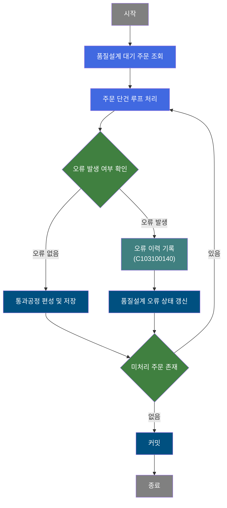
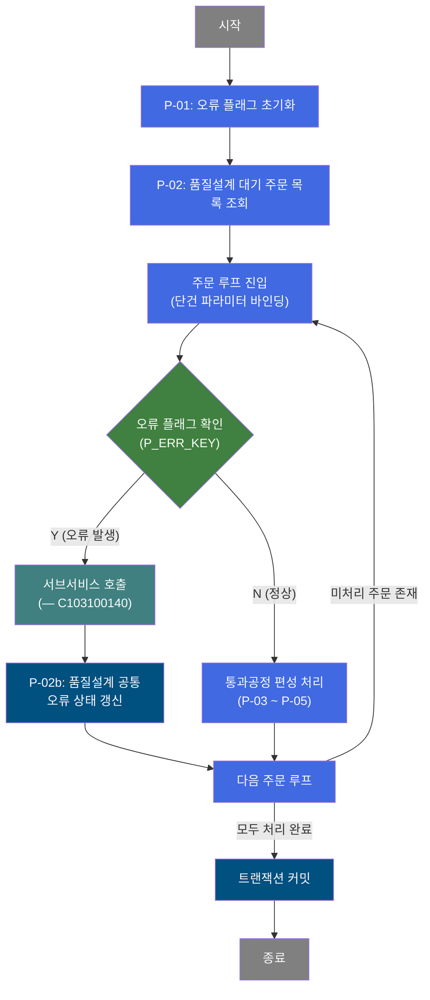
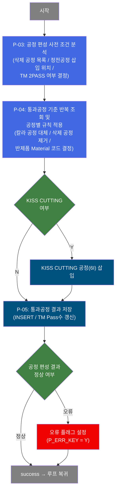

# C103100030 비즈니스 프로세스 분석서 (BPA)

## 1. 시스템 개요

| 항목 | 내용 |
|------|------|
| 서비스 ID | C103100030 |
| 업무명 | 품질설계 공통 배치 처리 |
| 서비스 타입 | nui |
| 분석 일시 | 2026-03-21 (KST) |
| 원본 분석일 | 2026-03-16 |
| 문서 버전 | 1.0 |

---

## 2. 시스템 목적

이 서비스는 수주된 주문에 대해 품질설계 공통 배치 처리를 수행하는 NUI(Non-UI, 배치) 서비스이다. 품질설계 대기 상태의 주문을 일괄 조회하여, 각 주문의 사양(품명코드, 재질, 치수, 표면처리, 특수 조건 등)을 분석하고 생산에 필요한 통과공정을 자동으로 편성한다.

핵심 업무는 주문 사양을 기반으로 삭제 공정, 정전 공정 삽입, 칼라 공정 대체, TM 2PASS 처리, KISS CUTTING 공정 추가 등 복합적인 규칙을 적용하여 최종 통과공정 결과를 품질설계 테이블에 저장하는 것이다. 처리 중 오류가 발생한 주문은 에러 플래그를 설정하고 서브서비스(C103100140)를 통해 오류 이력을 별도로 기록한다.

이 서비스는 제조 실행 시스템(MES)의 품질설계 자동화 배치 흐름의 핵심 컴포넌트로, 수동 개입 없이 주문별 생산 경로를 결정하여 후속 제조 지시 프로세스가 정확한 공정 계획을 바탕으로 진행될 수 있도록 지원한다.

---

## 3. 핵심 워크플로우

---

## 4. 상세 워크플로우

### 프로세스 흐름도 — 품질설계 오류 처리 (P-01, P-02)

### 프로세스 흐름도 — 통과공정 편성 (P-03, P-04, P-05)

---

## 5. 비즈니스 로직 상세

P-01: 오류 플래그 초기화 — 배치 처리 파라미터 초기 설정

- **입력**: 없음 (서비스 진입 시점)
- **처리**:
  1. 처리 구분 플래그를 초기값(C)으로 설정하여 이후 오류 발생 여부를 추적할 준비를 한다.
- **출력**: 처리 컨텍스트에 초기 플래그 값 설정
- **예외**: 없음

P-02: 품질설계 대기 주문 목록 조회 — 처리 대상 주문 선택

- **입력**: TB_C10_QLT_DSN_CMN (품질설계공통 테이블)에서 품질설계 대기 상태 주문 목록을 조회
- **처리**:
  1. 품질설계 상태 코드가 대기인 주문을 전체 조회한다.
  2. 조회 결과는 루프 처리를 위한 ResultSet으로 보관된다.
  3. 각 루프 진입 시 주문 1건의 파라미터(주문번호, 주문라인, 품명코드, 재질, 치수, 표면처리코드 등 39개 항목)를 처리 컨텍스트에 바인딩한다.
- **출력**: 처리 컨텍스트에 주문 단건 정보 적재
- **예외**: 조회 결과가 0건이면 즉시 루프를 종료하고 커밋 단계로 진행

P-02b: 품질설계 공통 오류 상태 갱신 [C103100140] — 오류 발생 주문 에러 마킹

- **입력**: 처리 중 오류 플래그가 설정된 주문(주문번호, 주문라인)
- **처리**:
  1. 오류 플래그(P_ERR_KEY=Y)가 감지되면 서브서비스(C103100140)를 호출하여 오류 이력을 기록한다.
  2. 서브서비스 완료 후 TB_C10_QLT_DSN_CMN의 해당 주문에 품질설계 오류 여부(QLT_DSN_ERR_YN='Y')를 갱신한다.
- **출력**: TB_C10_QLT_DSN_CMN 오류 상태 갱신
- **예외**: 서브서비스 실패 시에도 현재 트랜잭션 범위에서 처리 계속 진행

P-03: 공정 편성 사전 조건 분석 — 삭제/추가/2PASS 기준 결정

- **입력**: 처리 컨텍스트의 주문 사양(품명코드, 재질, 치수, 표면처리, SLIT 조건 등)
- **처리**:
  1. **SLIT 처리**: SLIT 조수가 있으면 혼합폭 최솟값(mix_wth)과 합산폭(exc_wth)을 계산한다.
  2. **칼라제품 사전 체크**: 품명코드가 칼라제품(1~9)인 경우 통과공정기준 존재 여부를 확인하고, 칼라 제조사양(주공정, 대체공정1~3, 도장방식 등)을 조회한다.
  3. **통과공정삭제기준 조회 (C10B2010)**: 23개 주문 조건(품명, 백마킹, 내경, 표면처리, EMBOSS, 두께, 폭, 재질, EDGE, 길이, 제품형태, 권취방법, 최종수요가, 주문용도, 스팽글, SLIT조수 등)으로 삭제 공정 코드 목록을 수집한다.
  4. **정전공정추가기준 조회 (C10B2050)**: 9개 조건으로 삽입할 정전공정 위치(앞/뒤), 주공정, 대체공정, 기준공정을 결정한다. 74공정은 폭이 1,270mm 초과이면 제거된다.
  5. **TM 2PASS 기준 조회 (C10B2240)**: 9개 조건으로 TM 공정을 2PASS로 실행할지 결정한다.
- **출력**: 처리 컨텍스트에 삭제공정 목록, 정전공정 삽입 위치, TM 2PASS 플래그 설정
- **예외**: 마스터 데이터 조회 실패 시 로그만 기록하고 처리를 계속 진행

P-04: 통과공정 기준 반복 조회 및 공정별 규칙 적용 — 주문별 공정 순서 결정

- **입력**: 통과공정기준 마스터(VI_M00_C10A1054N), P-03에서 결정된 규칙 목록
- **처리**:
  1. 통과공정기준 View를 조회하여 공정 순서대로 while 루프를 수행한다. 조회 결과가 0건이면 오류(ERRCD_KK23)로 처리한다.
  2. 각 공정에 대해 반제품 Material Code를 결정한다: RCL(72공정)은 전체 공정코드로, R/S계열(7X, 72 제외)은 별도 기준으로, 그 외는 일반 기준으로 조회한다.
  3. 정전공정 이전 삽입 조건(loc=B)을 확인하여 해당 기준공정 앞에 정전공정을 삽입한다.
  4. 칼라제품의 AX 형식 공정코드를 칼라 제조사양의 실제 공정코드로 대체한다.
  5. 삭제공정 목록을 적용하여 해당 공정코드를 제거한다. 주공정이 공백이 되면 오류(ERRCD_KK27)로 처리한다.
  6. 6X 정전공정은 이전 칼라공정 조회(SELECT_CCL_PROC) 후 칼라정전라인결정기준(VI_M00_C10A2030)으로 SHL 공정코드를 결정한다.
  7. TM 2PASS 조건이 충족되면 동일 TM 공정을 1회 추가로 삽입한다(TM은 항상 1PASS로 고정).
  8. 칼라 2PASS 조건(도장방식 A/B/C/D/E의 비V-BOM, 또는 도장방식 6/7/8/9의 A2/A3/A6 공정)이 충족되면 동일 칼라공정을 1회 추가 삽입한다.
  9. 정전공정 이후 삽입 조건(loc=A)을 확인하여 해당 기준공정 뒤에 정전공정을 삽입한다.
- **출력**: 처리 컨텍스트에 공정 순서별 주공정 및 대체공정 코드 결정 완료
- **예외**: 통과공정기준 0건(ERRCD_KK23), 삭제 후 주공정 공백(ERRCD_KK27) → 오류 플래그 설정 후 FAILURE

P-05: 통과공정 결과 저장 — 통과공정 INSERT 및 TM Pass수 갱신

- **입력**: P-04에서 결정된 공정 순서별 주공정/대체공정/반제품 Material Code, KISS CUTTING 여부
- **처리**:
  1. 각 공정 순서(proc_seq)별로 주공정 코드, 대체공정 코드1~6, 반제품 Material Code를 품질설계결과 통과공정 테이블에 INSERT한다.
  2. KISS CUTTING이 필요한 주문은 마지막에 6I 공정을 추가로 INSERT한다.
  3. 품명코드가 TM 관련 대상(C, 1, E, 2, 8)인 경우 품질설계 제조표준의 TM Pass수를 UPDATE한다.
- **출력**: 품질설계결과 통과공정 테이블 INSERT, 제조표준 TM Pass수 UPDATE
- **예외**: INSERT 또는 UPDATE 실패 시 오류 플래그 설정

---

## 6. 커스텀 클래스 워크플로우

### DbQualDesignLoop (약 171줄)

**역할**: 이전 액티비티(PosSearch)가 조회한 품질설계 대기 주문 ResultSet을 1건씩 순회하는 루프 제어 액티비티. 매 루프마다 처리 플래그를 초기화하고, 현재 처리할 주문 Row의 39개 파라미터를 처리 컨텍스트에 바인딩한 뒤 후속 통과공정 편성 액티비티를 호출한다. 처리 건수가 0이 되면 `exit` 전이로 루프를 종료한다. 40개 이상의 서비스에서 공유 사용되는 범용 루프 컨트롤러이다.

---

### DbSearchProcData (약 1426줄)

**역할**: 주문 사양을 기반으로 생산 통과공정을 자동 결정하고 품질설계결과 통과공정 테이블에 저장하는 핵심 처리 클래스. 삭제 공정 기준 조회, 정전공정 삽입 위치 결정, TM 2PASS 판별, 칼라 공정 대체, KISS CUTTING 공정 추가 등 복합 규칙을 순차 적용하여 최종 공정 편성 결과를 생성한다.

```mermaid
flowchart TD
    START["시작"]:::start --> EXTRACT["주문 사양 추출<br/>(39개 파라미터)"]:::proc
    EXTRACT --> SLIT{"SLIT 조수 > 0"}:::decision
    SLIT -->|"Y"| SLITCALC["혼합폭 최솟값 및<br/>합산폭 계산"]:::proc
    SLIT -->|"N"| COLORCHK
    SLITCALC --> COLORCHK{"칼라제품<br/>(품명코드 1~9)"}:::decision
    COLORCHK -->|"Y"| COLORPRE["칼라 제조사양 조회<br/>(주공정 / 대체공정 /<br/>도장방식 결정)"]:::proc
    COLORCHK -->|"N"| DEL_EA
    COLORPRE --> DEL_EA["삭제공정기준 조회<br/>(C10B2010, 23개 조건)"]:::proc
    DEL_EA --> SHL_EA["정전공정추가기준 조회<br/>(C10B2050, 9개 조건)"]:::proc
    SHL_EA --> TM_EA["TM 2PASS 기준 조회<br/>(C10B2240, 9개 조건)"]:::proc
    TM_EA --> VIEW["통과공정기준 조회<br/>(VI_M00_C10A1054N)"]:::proc
    VIEW --> VIEWCHK{"조회 결과 = 0"}:::decision
    VIEWCHK -->|"Y"| FAIL["오류 반환<br/>(KK23)"]:::error
    VIEWCHK -->|"N"| LOOP["공정 순서 while 루프"]:::proc

    LOOP --> SEMTL["반제품 Material Code 결정<br/>(72공정/7X공정/일반 분기)"]:::proc
    SEMTL --> SHL_B{"정전공정 이전 삽입<br/>조건 (loc=B)"}:::decision
    SHL_B -->|"Y"| INS_SHLB["정전공정 앞에 INSERT"]:::save
    SHL_B -->|"N"| AX_REPLACE
    INS_SHLB --> AX_REPLACE{"칼라 AX 공정 여부"}:::decision
    AX_REPLACE -->|"Y"| CCL_REPLACE["칼라 제조사양<br/>공정코드로 대체"]:::proc
    AX_REPLACE -->|"N"| DEL_APPLY
    CCL_REPLACE --> DEL_APPLY["삭제공정 적용"]:::proc
    DEL_APPLY --> DELCHK{"주공정 공백"}:::decision
    DELCHK -->|"Y"| FAIL2["오류 반환<br/>(KK27)"]:::error
    DELCHK -->|"N"| SHL6X{"6X 정전공정 여부"}:::decision
    SHL6X -->|"Y"| SHL_CONV["칼라정전라인기준으로<br/>SHL 공정코드 결정"]:::proc
    SHL6X -->|"N"| INS_MAIN
    SHL_CONV --> INS_MAIN["통과공정 INSERT"]:::save
    INS_MAIN --> TM_CHK{"TM 공정(51)<br/>& 2PASS 플래그"}:::decision
    TM_CHK -->|"Y"| INS_TM["TM 공정 추가 INSERT"]:::save
    TM_CHK -->|"N"| CCL2P_CHK
    INS_TM --> CCL2P_CHK{"칼라 2PASS 조건"}:::decision
    CCL2P_CHK -->|"Y"| INS_CCL2P["칼라공정 추가 INSERT"]:::save
    CCL2P_CHK -->|"N"| SHL_A_CHK
    INS_CCL2P --> SHL_A_CHK{"정전공정 이후 삽입<br/>조건 (loc=A)"}:::decision
    SHL_A_CHK -->|"Y"| INS_SHLA["정전공정 뒤에 INSERT"]:::save
    SHL_A_CHK -->|"N"| NEXT_CHK
    INS_SHLA --> NEXT_CHK{"다음 공정 존재"}:::decision
    NEXT_CHK -->|"Y"| LOOP
    NEXT_CHK -->|"N"| KISS_CHK

    KISS_CHK{"KISS CUTTING<br/>(kiss_cut_yn=Y)"}:::decision
    KISS_CHK -->|"Y"| INS_KISS["6I 공정 INSERT"]:::save
    KISS_CHK -->|"N"| TM_UPDATE_CHK
    INS_KISS --> TM_UPDATE_CHK{"TM Pass수 갱신 대상<br/>(품명 C/1/E/2/8)"}:::decision
    TM_UPDATE_CHK -->|"Y"| UPD_TM["제조표준 TM Pass수 UPDATE"]:::save
    TM_UPDATE_CHK -->|"N"| END["SUCCESS 반환"]:::start
    UPD_TM --> END

    classDef start fill:#808080,color:#fff
    classDef proc fill:#4169E1,color:#fff
    classDef proc_call fill:#408080,color:#fff
    classDef decision fill:#408040,color:#fff
    classDef save fill:#005080,color:#fff
    classDef error fill:#F00000,color:#fff
```

---

## 7. 주요 유즈케이스

UC-01: 품질설계 대기 주문 일괄 통과공정 편성

- **Actor**: 배치 스케줄러 / MES 자동화 처리
- **목적**: 수주된 주문의 생산 경로(통과공정)를 자동으로 결정하고 저장
- **주요 흐름**:
  1. 품질설계 공통 테이블에서 대기 상태 주문을 전체 조회한다.
  2. 각 주문에 대해 삭제공정 기준, 정전공정 추가 기준, TM 2PASS 기준을 마스터 데이터에서 조회한다.
  3. 통과공정기준에 따라 공정 순서를 결정하고 각종 규칙(칼라 공정 대체, 공정 삭제, 정전 삽입, 2PASS 추가 등)을 적용한다.
  4. 최종 결정된 공정 정보를 통과공정 결과 테이블에 INSERT한다.
  5. 모든 주문 처리 완료 후 트랜잭션을 커밋한다.
- **예외**: 통과공정기준이 없거나 주공정이 삭제 후 공백이 되면 해당 주문에 오류 플래그 설정

UC-02: 오류 발생 주문 에러 이력 기록

- **Actor**: 배치 스케줄러 / MES 자동화 처리
- **목적**: 통과공정 편성 중 오류가 발생한 주문을 별도 기록하여 운영자가 확인할 수 있도록 처리
- **주요 흐름**:
  1. 통과공정 편성 액티비티가 FAILURE를 반환하면 오류 플래그(P_ERR_KEY=Y)가 설정된다.
  2. 루프 액티비티가 다음 순환 시 오류 플래그를 감지한다.
  3. 오류 이력 서브서비스(C103100140)를 호출하여 오류 내용을 별도 테이블에 기록한다.
  4. 해당 주문의 품질설계 공통 테이블에 오류 여부(QLT_DSN_ERR_YN='Y')를 갱신한다.
  5. 오류가 발생한 주문을 건너뛰고 다음 주문 처리를 계속 진행한다.
- **예외**: 오류 이력 기록 실패 시에도 배치 전체 처리는 중단하지 않음

UC-03: KISS CUTTING 공정 포함 주문 처리

- **Actor**: 배치 스케줄러 / MES 자동화 처리
- **목적**: KISS CUTTING이 필요한 주문에 해당 공정을 자동으로 편성 마지막에 추가
- **주요 흐름**:
  1. 주문 사양에서 KISS CUTTING 여부(kiss_cut_yn=Y)를 확인한다.
  2. 일반 통과공정 편성을 정상적으로 완료한다.
  3. 편성 완료 후 6I(KISS CUTTING) 공정을 마지막 순서에 추가로 INSERT한다.
- **예외**: KISS CUTTING 공정 INSERT 실패 시 오류 플래그 설정 (2024.10.10 추가 기능)

---

## 9. 관련 엔티티

### 엔티티 목록

| 엔티티(테이블/뷰) | 설명 | 사용 유형 |
|----------------|------|----------|
| TB_C10_QLT_DSN_CMN | 품질설계공통 테이블 — 주문별 품질설계 상태 및 사양 정보 | 조회 / 갱신 |
| TB_C10_QLT_DSN_PROC (추정) | 품질설계결과 통과공정 테이블 — 주문별 통과공정 편성 결과 | 저장(INSERT) |
| VI_M00_C10A1054N | 통과공정기준 View — 통과공정 순서, 주공정, 대체공정 기준 | 조회 |
| VI_M00_C10A1054_PROC_CHK | 통과공정기준 존재 확인 View — 칼라제품 사전 검증용 | 조회 |
| VI_M00_C10A2030 | 칼라 정전라인결정기준 View — 6X 공정의 SHL 공정코드 결정 | 조회 |
| C10B2010 (EasyAccess) | 통과공정삭제기준 — 23개 주문 조건에 따른 삭제 공정 목록 | 조회 |
| C10B2050 (EasyAccess) | 정전공정추가기준 — 정전공정 삽입 위치 및 기준공정 결정 | 조회 |
| C10B2240 (EasyAccess) | TM 2PASS 기준 — TM 공정 2PASS 실행 여부 결정 | 조회 |

### 엔티티 간 관계

- TB_C10_QLT_DSN_CMN는 배치 처리 시작점이자 오류 갱신 대상으로, 주문번호+주문라인이 전체 처리의 기준 키이다.
- VI_M00_C10A1054N은 M00APUSER 스키마의 마스터 데이터를 기반으로 하며, 품명코드와 통과공정번호의 조합으로 공정 편성의 골격을 제공한다.
- C10B2010/C10B2050/C10B2240은 EasyAccess(업무기준 관리 테이블)로, VI_M00_C10A1054N에서 결정된 공정 목록을 주문 사양에 맞게 보정하는 역할을 한다.
- 품질설계결과 통과공정 테이블은 TB_C10_QLT_DSN_CMN의 주문 정보를 참조하여 공정 편성 결과를 저장한다.

---

## 10. 서브서비스

| 서비스 ID | 설명 | 호출 시점 | 트랜잭션 | BPA 문서 |
|-----------|------|---------|---------|---------|
| C103100140 | 품질설계 오류 이력 기록 | 통과공정 편성 중 오류 발생 시 (P_ERR_KEY=Y 감지 후) | 기존 트랜잭션 공유 (new-transaction=false) | 미작성 |

---

## 11. 특이사항 및 주의사항

### 1. 복합 공정 편성 규칙의 중첩 적용
통과공정 편성은 단순한 기준 조회가 아니라 삭제, 삽입, 대체, 2PASS 추가 등 5가지 이상의 보정 규칙이 동일 주문에 중첩 적용된다. 특히 칼라제품(품명코드 1~9)은 일반 공정 흐름 외에 칼라 제조사양 대체, 정전 6X 공정 처리, 칼라 2PASS 삽입이 추가로 수행되어 로직이 복잡하다. 규칙 적용 순서가 결과에 영향을 미치므로 순서 변경 시 주의가 필요하다.

### 2. 오류 발생 주문의 부분 성공 처리 전략
단일 주문에서 오류가 발생해도 배치 전체를 중단하지 않는다. 오류 주문은 플래그(P_ERR_KEY=Y)를 통해 오류 이력 서브서비스로 우회되고, 나머지 정상 주문은 계속 처리된다. 이는 대량 배치 환경에서 일부 예외 데이터가 전체 처리를 차단하는 상황을 방지하기 위한 설계이다.

### 3. EasyAccess 마스터 데이터 조회 실패 내성
통과공정삭제기준(C10B2010), 정전공정추가기준(C10B2050), TM 2PASS 기준(C10B2240) 조회 시 MasterDataException이 발생하면 로그만 기록하고 처리를 계속 진행한다. 해당 기준 데이터가 없어도 기본 공정 흐름은 유지되도록 설계되어 있으나, 마스터 데이터 미등록 시 공정이 불완전하게 편성될 수 있으므로 운영 시 마스터 데이터 관리가 중요하다.

### 4. DbQualDesignLoop의 O(n²) 탐색 성능 특성
루프 액티비티(DbQualDesignLoop)는 매 순환마다 ResultSet 커서를 처음부터 재탐색하는 방식으로 동작한다. 처리 건수가 많을수록 탐색 횟수가 누적 증가하므로(100건 처리 시 최대 5,050회 탐색), 대량 배치 실행 시 처리 건수 증가에 따른 성능 영향을 모니터링해야 한다.

### 5. KISS CUTTING 기능은 2024년 이후 추가 사항
KISS CUTTING 공정(6I) 추가 로직은 2024년 10월 10일에 추가된 기능이다. kiss_cut_yn='Y'인 주문에만 적용되며, 기존 공정 편성이 완전히 완료된 후 마지막에 삽입된다. 이 기능 추가로 DbSearchProcData의 로직이 확장되었으며, 관련 마스터 데이터(PROC_CD_INS_SHL 상수값) 등록이 전제 조건이다.
