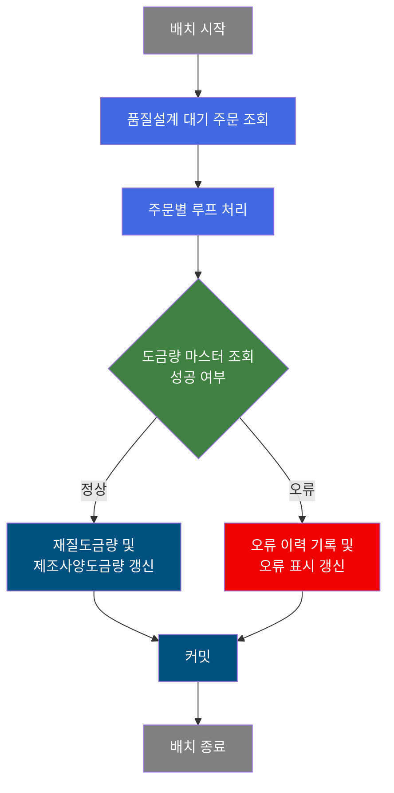
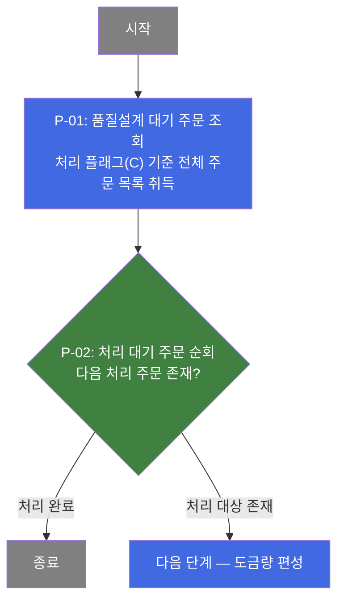
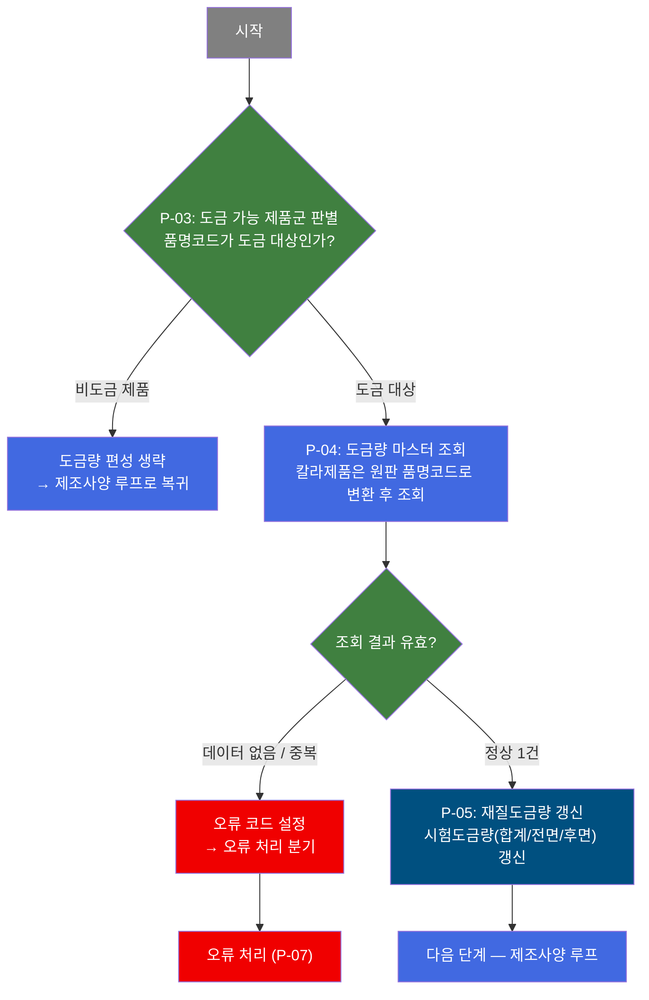
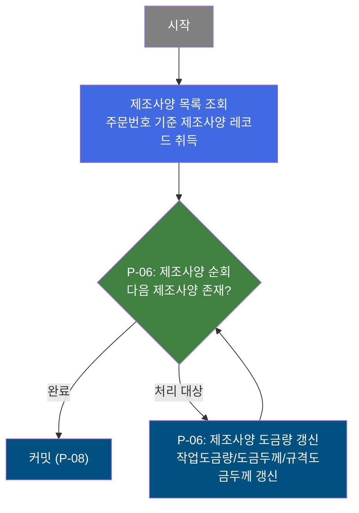
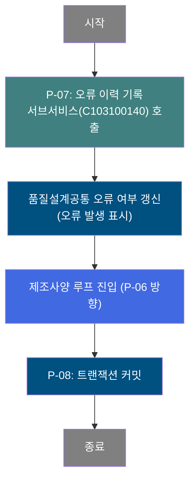
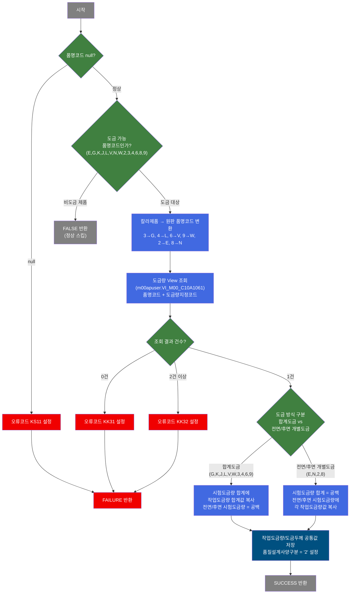

# C103100040 비즈니스 프로세스 분석서 (BPA)

## 1. 시스템 개요

| 항목 | 내용 |
|------|------|
| 서비스 ID | C103100040 |
| 업무명 | 품질설계 도금량 갱신 배치 |
| 서비스 타입 | nui |
| 분석 일시 | 2026-03-21 (KST) |
| 원본 분석일 | 2026-03-16 |
| 문서 버전 | 1.0 |

---

## 2. 시스템 목적

본 서비스는 품질설계 공통 테이블에서 처리 대기 중인 주문을 일괄 조회하여, 각 주문의 도금량(Galvanizing Weight) 정보를 마스터 데이터로부터 자동으로 산출하고 품질설계 결과 테이블에 반영하는 배치 처리 서비스이다.

도금 강판 제품은 품명코드에 따라 합계도금(전체 도금량) 방식과 전면/후면 개별도금 방식으로 관리 기준이 상이하다. 본 서비스는 품명코드를 기준으로 도금 가능 제품군 여부를 자동 판별하고, 칼라 도금제품의 경우 원판 품명코드 기준으로 도금 마스터를 조회하여 시험도금량 및 작업도금량을 계산한다. 비도금 제품은 처리를 건너뛰어 불필요한 오류 없이 다음 단계로 진행한다.

처리 중 도금량 마스터 데이터 미존재, 중복 조회 등 이상 상황이 발생하면 오류 코드를 설정하고 서브서비스(C103100140)를 통해 에러 이력을 기록한 뒤 품질설계공통 테이블에 오류 여부를 표시한다. 정상 처리가 완료된 경우에는 재질도금량(MQL)과 제조사양도금량(MNF) 두 가지 결과 테이블을 모두 갱신한 후 트랜잭션을 커밋한다.

---

## 3. 핵심 워크플로우

---

## 4. 상세 워크플로우

### 프로세스 흐름도 — 주문 조회 및 루프 진입 (P-01, P-02)

### 프로세스 흐름도 — 도금량 편성 및 재질도금량 갱신 (P-03, P-04, P-05)

### 프로세스 흐름도 — 제조사양 도금량 갱신 (P-06)

### 프로세스 흐름도 — 오류 처리 및 커밋 (P-07, P-08)

---

## 5. 비즈니스 로직 상세

P-01: 품질설계 대기 주문 조회 — 처리 대기 상태의 전체 주문 목록 취득

- **입력**: 처리 플래그(C) 조건
- **처리**:
  1. 품질설계 공통(TB_C10_QLT_DSN_CMN)에서 처리 플래그가 'C'(대기)인 주문 전체를 조회
  2. 주문번호, 주문라인, 품명코드, 도금량지정코드 등 루프 처리에 필요한 항목 취득
- **출력**: 처리 대상 주문 목록
- **예외**: 조회 결과 없음 시 처리 없이 정상 종료

P-02: 처리 대기 주문 순회 — 대기 주문을 1건씩 순차 처리

- **입력**: P-01에서 취득한 처리 대상 주문 목록
- **처리**:
  1. 루프 카운터 초기화(최초 진입 시 전체 건수로 설정)
  2. 남은 건수가 0이면 루프 종료
  3. 현재 처리할 주문 1건의 키(주문번호, 주문라인, 품명코드, 도금량지정코드)를 컨텍스트에 바인딩
  4. 루프 카운터를 1 감소시키고 다음 단계로 진행
- **출력**: 현재 처리 주문의 키 정보
- **예외**: 루프 제어 파라미터 미설정 시 실패 반환

P-03: 도금 가능 제품군 판별 — 품명코드 기반 도금 대상 여부 결정

- **입력**: 현재 처리 주문의 품명코드
- **처리**:
  1. 품명코드 null 여부 확인 (null이면 오류 코드 설정 후 실패)
  2. 도금 가능 품명코드 목록(E, G, K, J, L, V, N, W, 2, 3, 4, 6, 8, 9)에 포함되는지 확인
  3. 해당하지 않으면 FALSE 반환(비도금 제품 정상 스킵)
  4. 칼라제품(2, 3, 4, 6, 8, 9)은 원판 품명코드로 변환: G계열(3→G), L계열(4→L), V계열(6→V), W계열(9→W), E계열(2→E), N계열(8→N)
- **출력**: 변환된 품명코드(칼라제품의 경우 원판 코드)
- **예외**: 품명코드 null 시 오류코드 KS11 설정 후 P-07로 분기

P-04: 도금량 마스터 조회 — 마스터 View에서 도금량 기준 데이터 취득

- **입력**: 원판 품명코드, 도금량지정코드
- **처리**:
  1. 마스터 스키마(M00APUSER)의 도금량 View(VI_M00_C10A1061)를 품명코드 + 도금량지정코드로 조회
  2. 조회 결과가 정확히 1건이어야 정상 처리
  3. 결과 0건: 오류코드 KK31 설정 후 P-07로 분기
  4. 결과 2건 이상: 오류코드 KK32 설정 후 P-07로 분기
- **출력**: 도금량 마스터 데이터(작업도금량 전면/후면/합계 하한/상한/목표, 도금두께 최소/최대/목표, 규격도금두께)
- **예외**: 마스터 데이터 접근 오류 시 KK31 설정 후 P-07로 분기

P-05: 재질도금량 갱신 — 도금 방식에 따른 시험도금량 산출 및 저장

- **입력**: P-04의 도금량 마스터 데이터, 원판 품명코드
- **처리**:
  1. 도금 방식 구분:
     - 합계도금(G, K, J, L, V, W 및 칼라 3, 4, 6, 9): 시험도금량 합계(하한/상한)에 작업도금량 합계값 복사, 전면/후면 시험도금량은 공백 설정
     - 전면/후면 개별도금(E, N 및 칼라 2, 8): 시험도금량 합계는 공백, 전면/후면 시험도금량에 각 작업도금량 전면/후면값 복사
  2. 품질설계 재질도금량(TB_C10_QLT_DSN_MQL)에 시험도금량 값 갱신
  3. 품질설계사양구분을 '2'(도금사양)로 설정
- **출력**: TB_C10_QLT_DSN_MQL 갱신(주문번호 + 주문라인 키 기준)
- **예외**: 없음

P-06: 제조사양 도금량 갱신 — 주문별 제조사양 레코드에 작업도금량/도금두께 반영

- **입력**: 현재 처리 주문의 제조사양 목록(TB_C10_QLT_DSN_MNF), P-04의 도금량 마스터 데이터
- **처리**:
  1. 주문번호 + 주문라인 기준으로 제조사양 레코드를 조회하여 1건씩 순회
  2. 각 제조사양 레코드에 작업도금량(전면/후면/합계 하한/상한/목표), 도금두께(최소/최대/목표), 규격도금두께, 특수도금두께 갱신
  3. 모든 제조사양 레코드 처리 완료 시 루프 종료
- **출력**: TB_C10_QLT_DSN_MNF 갱신(주문번호 + 주문라인 + 제조사양유형 키 기준)
- **예외**: 없음

P-07: 오류 이력 기록 — 서브서비스 호출을 통한 오류 이력 저장 및 오류 표시 갱신

- **입력**: 오류 코드(TB06/TB03 등), 오류 발생 주문번호/주문라인
- **처리**:
  1. 오류 발생 플래그(P_ERR_KEY = N)와 오류 코드(QLT_DSN_ERR_CD) 설정
  2. 서브서비스(C103100140)를 호출하여 오류 이력을 별도 테이블에 저장
  3. 품질설계공통(TB_C10_QLT_DSN_CMN)의 오류 여부 필드를 'Y'로 갱신
  4. 이후 제조사양 루프(P-06) 단계로 계속 진행
- **출력**: TB_C10_QLT_DSN_CMN 오류 여부 갱신, 서브서비스 호출
- **예외**: 없음 (오류 처리 자체이므로 추가 분기 없음)

P-08: 트랜잭션 커밋 — 전체 주문 1건 처리 완료 후 커밋

- **입력**: 없음
- **처리**:
  1. P_ERR_KEY 값 확인
  2. 현재 주문 1건에 대한 모든 DB 변경사항(재질도금량, 제조사양도금량, 오류표시)을 커밋
  3. 커밋 후 다음 주문 처리로 복귀(P-02 방향)
- **출력**: DB 영구 반영
- **예외**: 없음

---

## 6. 커스텀 클래스 워크플로우

### DbQualDesignLoop (약 171줄)

**역할**: PosSearch 등 이전 액티비티가 조회한 주문/레코드 목록을 1건씩 순차 처리하기 위한 공통 루프 제어 컨트롤러. 본 서비스에서는 PROC_LOOP(주문 루프)와 MNF_LOOP(제조사양 루프) 두 곳에서 인스턴스를 달리하여 사용된다.

200줄 미만으로 Mermaid 워크플로우 대신 텍스트로 기술한다.

**주요 처리 방식**:
- 컨텍스트에 남은 처리 건수(카운터)가 없으면 전체 건수로 초기화
- 카운터가 0이면 `exit` 전이를 반환하여 루프 종료
- 매 루프마다 에러 플래그(`P_ERR_KEY = "N"`, `QLT_DSN_ERR_YN = ""`)를 초기화
- `param#` 프로퍼티 정의에 따라 현재 Row의 컬럼값을 지정 변수명으로 컨텍스트에 바인딩
- 성능 특성: 커서를 매 루프마다 처음부터 재탐색하므로 처리 건수가 많을수록 탐색 횟수가 누적 증가(O(n²))

---

### DbSearchGwTotData (약 205줄)

**역할**: 품명코드 + 도금량지정코드를 키로 마스터 도금량 View를 조회하여 도금 방식별(합계/전면·후면 개별) 시험도금량 및 작업도금량 값을 컨텍스트에 편성하는 클래스.

---

## 7. 주요 유즈케이스

UC-01: 도금 제품 품질설계 도금량 자동 갱신

- **Actor**: 배치 스케줄러 / MES 운영 담당자
- **목적**: 품질설계 대기 주문 중 도금 강판에 대해 도금량 마스터로부터 설계 기준값을 자동 산출하여 품질설계 결과 테이블에 반영
- **주요 흐름**:
  1. 배치가 품질설계 공통에서 처리 대기 주문 전체를 조회
  2. 각 주문의 품명코드를 확인하여 도금 가능 제품군 여부를 판별
  3. 도금 대상 주문은 도금량 마스터 View를 조회하여 도금 방식에 맞는 시험도금량 산출
  4. 산출된 도금량을 재질도금량 및 제조사양 테이블에 각각 갱신
  5. 주문 단위로 커밋하여 처리 완료
- **예외**: 도금량 마스터 미존재 시 오류 코드 기록 후 계속 처리

UC-02: 비도금 제품 처리 스킵

- **Actor**: 배치 스케줄러
- **목적**: 품질설계 대기 주문 중 도금 공정이 불필요한 제품(냉연, 열연 등)에 대해 도금량 처리를 건너뛰고 정상 완료 처리
- **주요 흐름**:
  1. 배치가 품질설계 공통에서 대기 주문 조회
  2. 품명코드가 도금 대상(E, G, K 등) 외 코드이면 도금량 편성 단계를 건너뜀
  3. 제조사양 루프 단계로 직접 진행하여 도금량 외 데이터 갱신 처리
  4. 오류 없이 커밋 완료
- **예외**: 없음 (비도금 제품은 오류 코드 없이 정상 처리)

UC-03: 도금량 마스터 오류 발생 시 오류 이력 기록

- **Actor**: 배치 스케줄러
- **목적**: 도금량 마스터 데이터 이상(미등록, 중복 등) 발생 시 해당 주문에 오류 표시를 기록하고 처리를 계속 진행하여 다른 주문에 영향을 주지 않도록 관리
- **주요 흐름**:
  1. 도금량 View 조회 결과가 0건 또는 2건 이상인 경우 오류 코드 설정
  2. 서브서비스(C103100140)를 통해 오류 이력 저장
  3. 품질설계공통 테이블의 오류 여부 필드를 'Y'로 갱신
  4. 해당 주문의 처리를 마무리하고 다음 주문으로 계속 진행
- **예외**: 없음 (오류 발생 주문도 건너뛰지 않고 오류 표시 후 계속 처리)

---

## 9. 관련 엔티티

### 엔티티 목록

| 엔티티(테이블/뷰) | 설명 | 사용 유형 |
|-----------------|------|----------|
| TB_C10_QLT_DSN_CMN | 품질설계 공통 — 주문별 품질설계 공통 정보(처리 상태, 오류 여부 등) | 조회, 갱신 |
| TB_C10_QLT_DSN_MQL | 품질설계 재질도금량 — 주문별 시험도금량(전면/후면/합계) 결과 저장 | 갱신 |
| TB_C10_QLT_DSN_MNF | 품질설계 제조사양 — 주문별 제조사양 단위 작업도금량/도금두께 결과 저장 | 조회, 갱신 |
| m00apuser.VI_M00_C10A1061 | 도금량 마스터 View — 품명코드 + 도금량지정코드 기준 도금량 기준값 제공 | 조회 |

### 엔티티 간 관계
- TB_C10_QLT_DSN_CMN은 주문(주문번호 + 주문라인)을 기본 단위로 품질설계 처리 상태를 관리하며, TB_C10_QLT_DSN_MQL 및 TB_C10_QLT_DSN_MNF의 상위 엔티티 역할을 한다.
- TB_C10_QLT_DSN_MQL은 주문 단위로 재질도금량 결과를 1:1로 보유한다.
- TB_C10_QLT_DSN_MNF는 주문 1건에 대해 제조사양 유형별로 복수 레코드를 가질 수 있다(1:N 관계).
- VI_M00_C10A1061은 M00APUSER 스키마(마스터 데이터)의 도금량 기준 View로, 본 서비스에서 조회 전용으로 참조된다.

---

## 10. 서브서비스

| 서비스 ID | 설명 | 호출 시점 | 트랜잭션 | BPA 문서 |
|-----------|------|---------|---------|---------|
| C103100140 | 품질설계 오류 이력 기록 | 도금량 마스터 조회 실패 시 (P-07) | 공유 (new-transaction: false) | 미작성 |

---

## 11. 특이사항 및 주의사항

### 1. 도금 방식에 따른 시험도금량 산출 이원화
합계도금 방식(G, K, J, L, V, W 및 칼라 파생 코드 3, 4, 6, 9)은 시험도금량 합계(TOT) 항목에 작업도금량 합계값을 적용하고 전면/후면 항목은 공백으로 처리한다. 반면 전면/후면 개별도금 방식(E, N 및 칼라 2, 8)은 시험도금량 합계를 공백으로 두고 전면/후면 항목에 각각의 작업도금량 값을 적용한다. 이 규칙을 놓치면 도금량 검사 기준이 잘못 설정될 수 있다.

### 2. 칼라제품 원판 코드 변환 규칙
칼라 도금제품(숫자 코드 2, 3, 4, 6, 8, 9)은 도금량 마스터 조회 시 원판 알파벳 품명코드로 변환 후 조회해야 한다. 변환 매핑: 3→G, 4→L, 6→V, 9→W, 2→E, 8→N. 마스터 데이터에는 칼라 코드로 직접 등록되지 않으므로 변환 없이 조회하면 항상 0건이 반환된다.

### 3. 주문 단위 커밋 및 오류 격리 전략
본 서비스는 주문 1건 처리 완료마다 커밋한다. 특정 주문에서 도금량 마스터 오류가 발생해도 오류 이력을 기록하고 오류 표시 후 계속 진행하여 다른 주문 처리에 영향을 주지 않는다. 이로 인해 일부 주문이 오류 상태로 남을 수 있으며, 오류 주문은 별도 확인 및 재처리가 필요하다.

### 4. DbQualDesignLoop의 이중 루프 구조 및 성능
본 서비스는 주문 루프(PROC_LOOP)와 제조사양 루프(MNF_LOOP)가 중첩된 이중 루프 구조를 가진다. DbQualDesignLoop는 매 루프마다 결과셋을 처음부터 재탐색하는 방식을 사용하므로(O(n²)), 처리 대상 주문 수 또는 제조사양 레코드 수가 많을 경우 처리 시간이 급격히 증가할 수 있다. 대용량 배치 수행 시 성능 모니터링이 필요하다.

### 5. 서브서비스 트랜잭션 공유
오류 이력 기록을 위한 서브서비스(C103100140)는 `new-transaction: false`로 호출되어 현재 주문의 트랜잭션을 공유한다. 서브서비스 호출 실패 시 오류 이력 기록과 현재 주문의 변경사항이 함께 롤백될 수 있으므로 주의가 필요하다.
