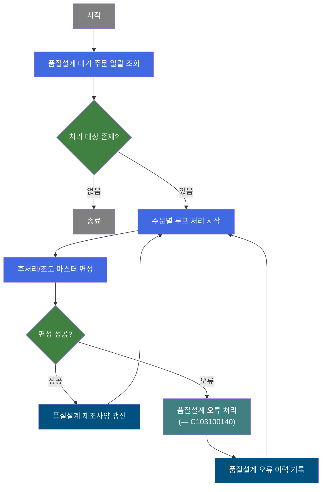
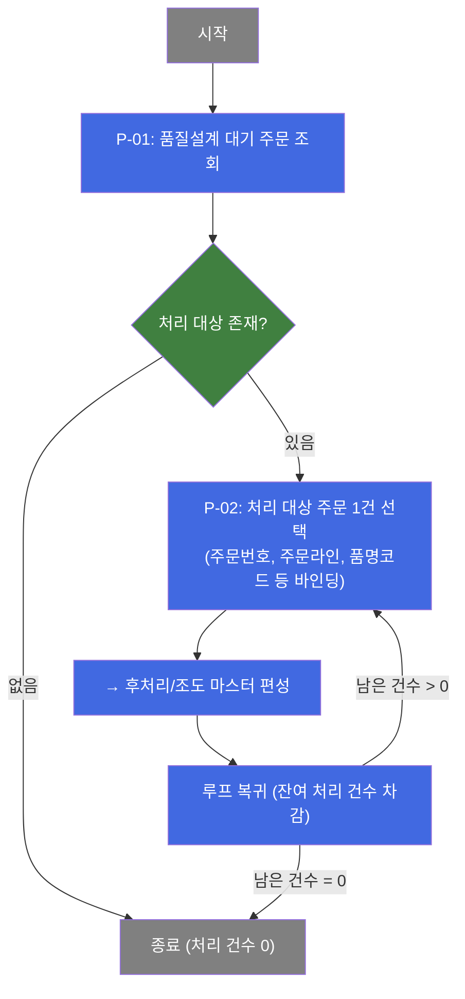
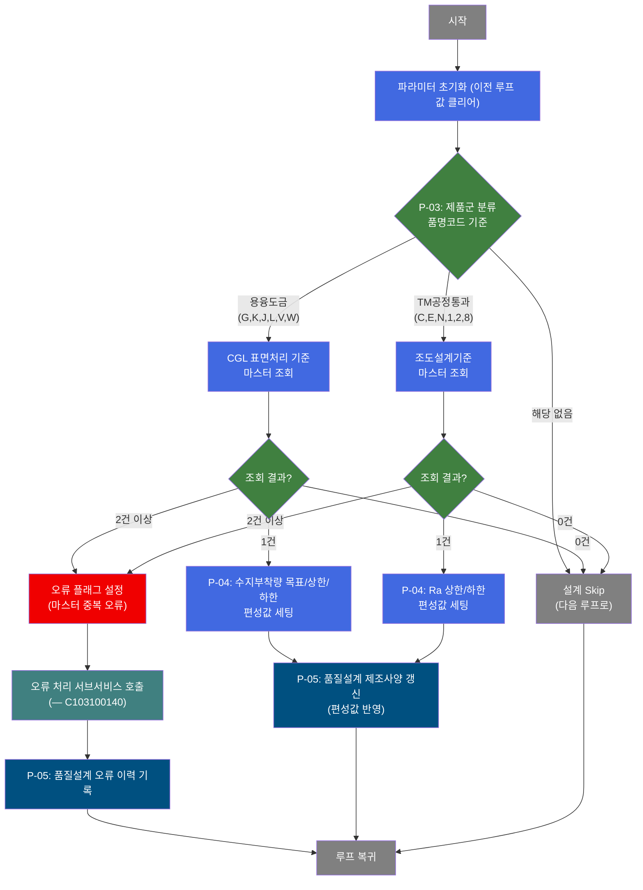

# C103100050 비즈니스 프로세스 분석서 (BPA)

## 1. 시스템 개요

| 항목 | 내용 |
|------|------|
| 서비스 ID | C103100050 |
| 업무명 | 품질설계 후처리/조도 설계 자동 편성 (배치) |
| 서비스 타입 | nui |
| 분석 일시 | 2026-03-21 (KST) |
| 원본 분석일 | 2026-03-16 |
| 문서 버전 | 1.0 |

---

## 2. 시스템 목적

본 서비스는 품질설계 대기 상태의 주문에 대해 후처리(수지부착량) 및 조도(Ra) 설계값을 자동으로 편성하는 배치 처리 서비스이다. 제조실행시스템(MES)에서 신규 주문이 품질설계 단계에 진입하면, 해당 주문의 제품 특성에 맞는 품질 기준값을 마스터 데이터로부터 자동 조회하여 품질설계 결과 제조사양 테이블에 반영한다.

이 서비스는 제품 군에 따라 두 가지 처리 경로로 분기된다. 용융도금 제품군(G, K, J, L, V, W)은 CGL 표면처리 기준 마스터에서 수지부착량 목표값 및 상한/하한을 조회하고, TM공정(냉연/칼라) 제품군(C, E, N, 1, 2, 8)은 조도설계기준 마스터에서 Ra 상한/하한을 조회하여 설계값을 편성한다. 두 그룹은 상호 배타적으로 처리되며, 어느 그룹에도 해당하지 않는 제품은 해당 설계 단계를 건너뛴다.

설계값 편성 중 마스터 기준이 중복 조회되거나 필수 데이터가 누락된 경우에는 오류 처리 서브서비스(C103100140)를 호출하여 해당 주문에 품질설계 오류 코드를 기록함으로써 후속 공정에서 오류를 인지하고 대응할 수 있도록 한다.

---

## 3. 핵심 워크플로우

---

## 4. 상세 워크플로우

### 프로세스 흐름도 — 주문 조회 및 루프 처리 (P-01, P-02)

### 프로세스 흐름도 — 후처리/조도 마스터 편성 (P-03, P-04, P-05)

---

## 5. 비즈니스 로직 상세

P-01: 품질설계 대기 주문 조회 — 처리 대상 주문 일괄 선택

- **입력**: 처리 구분 플래그 (초기값: "C" — 초기 품질설계 대기)
- **처리**:
  1. TB_C10_QLT_DSN_CMN에서 품질설계 대기 상태의 주문을 전체 조회
  2. 주문번호, 주문라인, 품명코드, 표면처리코드, 조도코드 등 후속 편성에 필요한 항목 포함
- **출력**: 처리 대상 주문 목록 (ResultSet)
- **예외**: 조회 결과 0건 → 이후 루프 처리 없이 서비스 종료

P-02: 처리 대상 주문 1건 선택 — 루프 제어 및 컨텍스트 바인딩

- **입력**: P-01에서 조회한 주문 ResultSet, 루프 처리 카운터
- **처리**:
  1. 루프 카운터 최초 진입 시 전체 처리 건수로 초기화
  2. 처리 건수가 0이면 루프 종료
  3. 현재 처리 순번(역방향 카운터 기반 순방향 인덱싱)의 주문 1건을 컨텍스트에 바인딩
  4. 처리 카운터 1 감소 후 다음 단계 진행
- **출력**: 주문번호, 주문라인, 품명코드, 표면처리코드, 조도코드가 컨텍스트에 세팅됨
- **예외**: 루프 카운터 미설정 → 처리 실패 반환

P-03: 제품군 분류 및 마스터 편성값 조회 — 후처리/조도 설계기준 조회

- **입력**: 주문의 품명코드, 주문표면처리코드(용융도금용), 주문조도코드(TM공정용)
- **처리**:
  1. 품명코드로 제품군 판별
     - 용융도금 제품군(G, K, J, L, V, W): CGL 표면처리 유형 Set기준(C10B2160) 마스터 조회 → 수지부착량 목표값, 하한, 상한 취득
     - TM공정통과 제품군(C, E, N, 1, 2, 8): 조도설계기준(C10B2210) 마스터 조회 → Ra 하한, 상한 취득
     - 해당 없는 제품군: 편성 단계 Skip
  2. 조회 결과가 1건이면 편성값 세팅, 0건이면 Skip, 2건 이상이면 오류 처리
  3. 편성 성공 시, 다른 그룹의 값은 null로 초기화(상호 배타 보장)
- **출력**: 수지부착량(하한/상한/목표) 또는 Ra(하한/상한) 편성값
- **예외**:
  - 품명코드 null → 오류 코드 설정 후 실패 반환
  - 마스터 중복 조회(2건 이상) → 오류 플래그 설정, 오류 코드 TB06 기록 후 오류 처리 서브서비스 호출

P-04: 품질설계 제조사양 갱신 — 편성값 저장

- **입력**: P-03에서 편성된 수지부착량 또는 Ra 값, 주문번호, 주문라인
- **처리**:
  1. TB_C10_QLT_DSN_MNF(품질설계결과 제조사양)에 수지부착량 목표/상한/하한 및 Ra 상한/하한을 갱신
  2. 감사 이력(최종변경 정보) 함께 기록
- **출력**: TB_C10_QLT_DSN_MNF 갱신
- **예외**: 갱신 실패 시 트랜잭션 롤백

P-05: 품질설계 오류 이력 기록 — 오류 처리 서브서비스 호출 후 오류 상태 저장

- **입력**: 오류 코드(TB06), 주문번호, 주문라인
- **처리**:
  1. 서브서비스 C103100140 호출 → 품질설계 오류 이력 처리
  2. TB_C10_QLT_DSN_CMN(품질설계공통)의 품질설계 오류 여부 플래그를 "Y"로 갱신
- **출력**: TB_C10_QLT_DSN_CMN 갱신 (오류 상태 기록)
- **예외**: 서브서비스 호출 실패 시 트랜잭션 롤백

---

## 6. 커스텀 클래스 워크플로우

### DbSearchRsnRouData (183줄)

**역할**: 품명코드에 따라 용융도금 제품군 또는 TM공정통과 제품군으로 분류하여, 각 제품군에 맞는 표면 품질 설계기준 마스터(CGL 표면처리 유형 Set기준 또는 조도설계기준)를 조회하고 수지부착량·Ra 편성값을 컨텍스트에 세팅한다.

183줄로 200줄 미만이므로 Mermaid 워크플로우는 생략하고 처리 흐름을 텍스트로 기술한다.

**처리 흐름 요약**:
1. 품명코드 Null 여부 확인 → Null이면 오류 반환
2. 품명코드가 용융도금 그룹(G/K/J/L/V/W)이면 CGL 표면처리 기준(C10B2160) 마스터 조회
   - 1건: 수지부착량 목표/하한/상한 세팅, Ra 값 null 초기화 → 성공
   - 0건: Skip(FALSE 반환)
   - 2건 이상: 오류(ERRCD_KK61) 반환
3. 품명코드가 TM공정 그룹(C/E/N/1/2/8)이면 조도설계기준(C10B2210) 마스터 조회
   - 1건: Ra 하한/상한 세팅, 수지부착량 값 null 초기화 → 성공
   - 0건: Skip(FALSE 반환)
   - 2건 이상: 오류(ERRCD_KK65) 반환
4. 두 그룹 모두 해당 없는 경우: FALSE 반환(Skip)

---

### DbQualDesignLoop (171줄)

**역할**: 이전 조회 액티비티가 반환한 주문 ResultSet을 1건씩 순차 순회하며, 각 Row의 데이터를 컨텍스트에 바인딩하여 후속 단건 처리 액티비티 체인이 동작할 수 있도록 루프를 제어한다. 처리 건수가 0이 되면 루프를 종료한다. 40개 이상의 서비스에서 공통 사용되는 범용 루프 컨트롤러이다.

171줄로 200줄 미만이므로 Mermaid 워크플로우는 생략하고 처리 흐름을 텍스트로 기술한다.

**처리 흐름 요약**:
1. 배치 잡 플래그(`BATCH_JOB = "true"`) 및 오류 플래그(`P_ERR_KEY = "N"`) 초기화
2. ResultSet에서 전체 처리 건수 취득, 루프 카운터 최초 초기화(최초 진입 시에만)
3. 카운터 0이면 카운터 변수 제거 후 루프 종료(`exit` 전이)
4. 역방향 카운터로 현재 처리 Row 인덱스 계산, 해당 Row 탐색 후 컨텍스트에 바인딩
5. 카운터 감소 저장 후 `success` 전이로 후속 처리 진행

---

## 7. 주요 유즈케이스

UC-01: 품질설계 대기 주문 일괄 후처리/조도 편성

- **Actor**: 배치 스케줄러 (MES 자동화 프로세스)
- **목적**: 품질설계 대기 상태의 전체 주문에 대해 제품군별 후처리·조도 설계기준값을 자동 편성
- **주요 흐름**:
  1. 품질설계 대기 주문 목록을 일괄 조회
  2. 주문별로 품명코드에 따라 용융도금 또는 TM공정 그룹으로 분류
  3. 해당 그룹의 마스터 기준을 조회하여 수지부착량 또는 Ra 편성값을 도출
  4. 품질설계 제조사양에 편성값 반영
  5. 전체 대기 주문 처리 완료 후 서비스 종료
- **예외**: 마스터 기준 미존재 시 해당 주문 Skip, 중복 기준 존재 시 오류 처리

UC-02: 마스터 기준 오류 주문의 품질설계 오류 이력 등록

- **Actor**: 배치 스케줄러 (MES 자동화 프로세스)
- **목적**: 마스터 데이터 중복 등으로 편성값 조회에 실패한 주문에 오류 코드를 기록하여 수동 처리 대상으로 분류
- **주요 흐름**:
  1. 마스터 조회 결과 2건 이상(중복) 발생 시 오류 플래그 설정
  2. 오류 코드 TB06를 기록하여 서브서비스(C103100140) 호출
  3. 해당 주문의 품질설계 오류 여부를 "Y"로 갱신
  4. 다음 주문 처리로 루프 복귀
- **예외**: 오류 처리 서브서비스 실패 시 트랜잭션 롤백

UC-03: 해당 없는 제품군 주문 Skip 처리

- **Actor**: 배치 스케줄러 (MES 자동화 프로세스)
- **목적**: 용융도금·TM공정 어느 그룹에도 속하지 않는 품명코드의 주문은 후처리/조도 편성 단계를 건너뛰어 불필요한 오류 발생 방지
- **주요 흐름**:
  1. 품명코드가 두 그룹 모두에 해당하지 않음을 확인
  2. 편성 단계를 Skip하고 다음 처리 단계 진행
  3. 마스터 기준 조회 건수 0건인 경우도 동일하게 Skip 처리
- **예외**: 없음 (정상 Skip 경로)

---

## 9. 관련 엔티티

### 엔티티 목록

| 엔티티(테이블) | 설명 | 사용 유형 |
|---------------|------|----------|
| TB_C10_QLT_DSN_CMN | 품질설계 공통 — 주문별 품질설계 상태 및 오류 여부 관리 | 조회 / 갱신 |
| TB_C10_QLT_DSN_MNF | 품질설계 결과 제조사양 — 주문별 후처리·조도 설계값 저장 | 갱신 |

### 엔티티 간 관계
- TB_C10_QLT_DSN_CMN과 TB_C10_QLT_DSN_MNF는 주문번호(ORD_NO) + 주문라인(ORD_LN)으로 연결되며, 공통 정보는 CMN, 제조사양 상세는 MNF에 분리 저장된다.
- TB_C10_QLT_DSN_CMN은 처리 대상 주문 목록 조회의 기준 테이블이며, 오류 발생 시 해당 테이블의 오류 플래그가 갱신된다.

---

## 10. 서브서비스

| 서비스 ID | 설명 | 호출 시점 | 트랜잭션 | BPA 문서 |
|-----------|------|---------|---------|---------|
| C103100140 | 품질설계 오류 이력 처리 | 마스터 기준 중복 조회 오류 발생 시 (P-05) | 신규 트랜잭션 | 미작성 |

---

## 11. 특이사항 및 주의사항

### 1. 제품군 상호 배타적 처리
용융도금 제품군(G, K, J, L, V, W)과 TM공정통과 제품군(C, E, N, 1, 2, 8)은 상호 배타적으로 처리된다. 한 그룹의 편성값이 등록될 때 다른 그룹의 값은 반드시 null로 초기화하여, 이전 루프에서 설정된 잔류값이 잘못 반영되지 않도록 보장한다. 어느 그룹에도 속하지 않는 품명코드는 편성 단계를 Skip한다.

### 2. 루프 처리 성능 특성
DbQualDesignLoop의 루프 제어 방식은 역방향 카운터 + 순방향 인덱싱 구조를 사용하며, 매 루프마다 ResultSet 전체를 처음부터 재탐색(reset + while 순회)한다. 이로 인해 처리 건수가 증가할수록 탐색 횟수가 누적 증가하는 O(n²) 특성을 가진다 (100건 처리 시 최대 5,050회 탐색). 대량 주문 처리 시 성능에 주의가 필요하다.

### 3. 마스터 기준 중복 오류 처리 전략
마스터 데이터(CGL 표면처리 유형 Set기준, 조도설계기준)에서 동일 키로 2건 이상 조회되는 경우는 데이터 정합성 이상 상황으로 간주한다. 이 경우 해당 주문을 오류 처리(오류 코드 TB06 기록, C103100140 서브서비스 호출, 품질설계 오류 이력 저장)하고 루프를 계속 진행한다. 단, 마스터 미존재(0건)는 오류가 아닌 Skip으로 처리한다.

### 4. 서브서비스 트랜잭션 분리
오류 처리 서브서비스(C103100140)는 `new-transaction: true` 설정으로 호출 서비스와 별도 트랜잭션으로 동작한다. 이는 오류 이력 저장이 메인 처리 트랜잭션의 롤백에 영향받지 않고 독립적으로 커밋되도록 보장하기 위함이다.

### 5. 파라미터 초기화(CLEAR_MNF)의 중요성
루프 내 각 주문 처리 시작 전에 이전 루프에서 설정된 제조사양 파라미터(84개 항목) 전체를 null로 초기화한다. 이 단계를 거친 후 마스터 편성값 조회를 수행하므로, 이전 처리 건의 값이 현재 처리 건에 오염되는 것을 방지한다.
