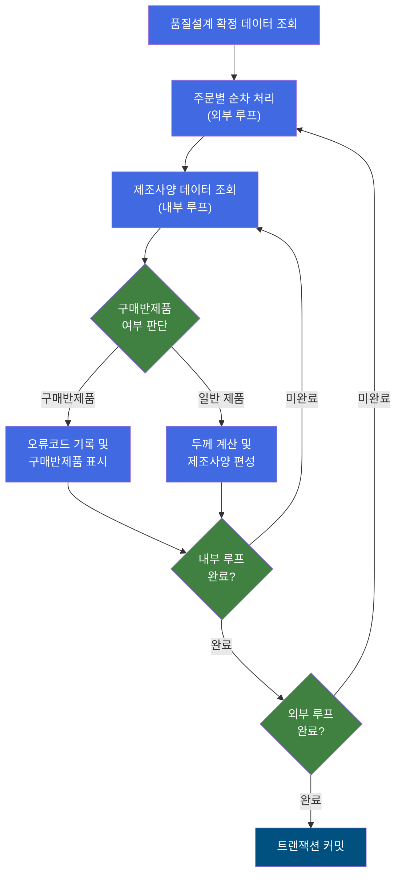
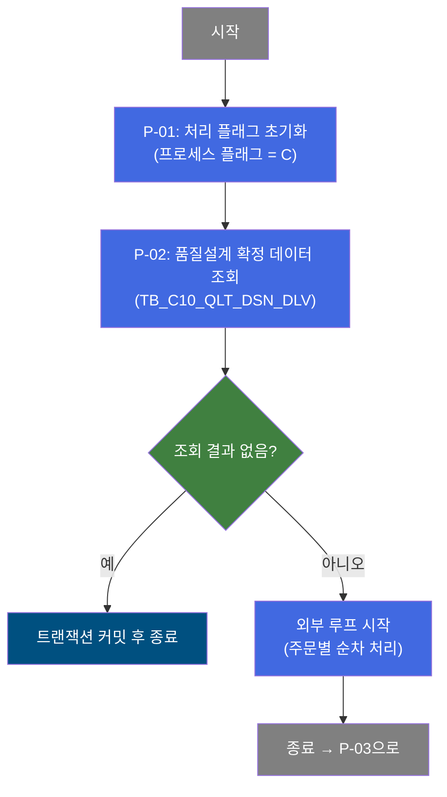
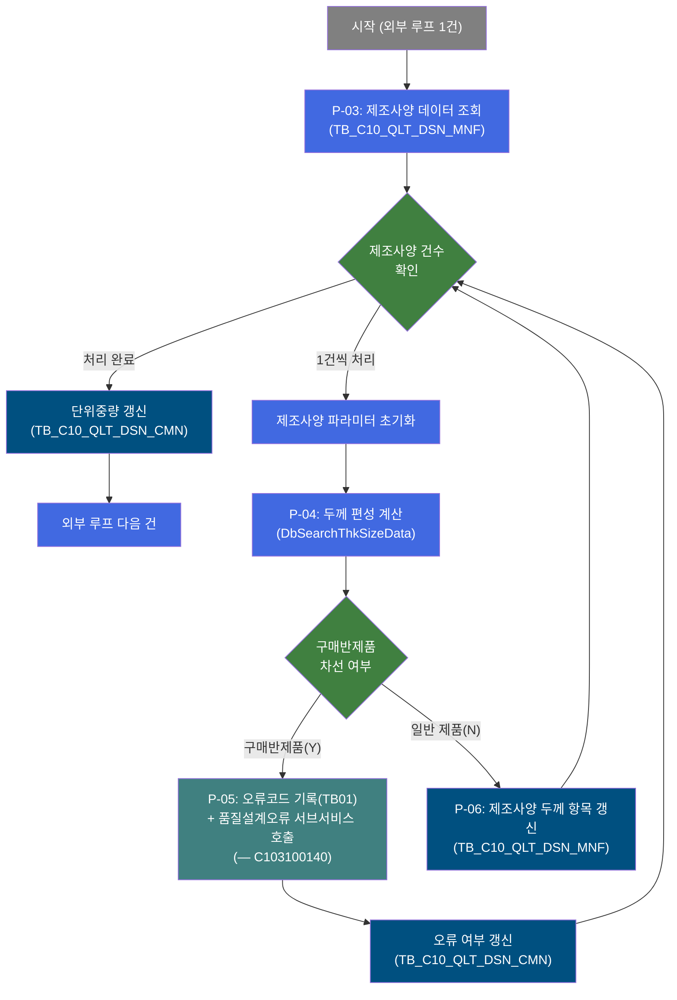
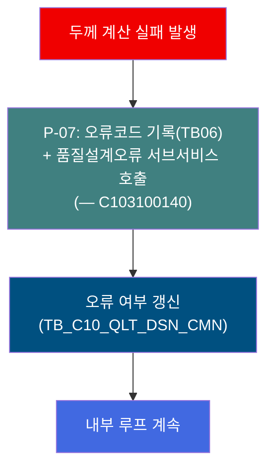
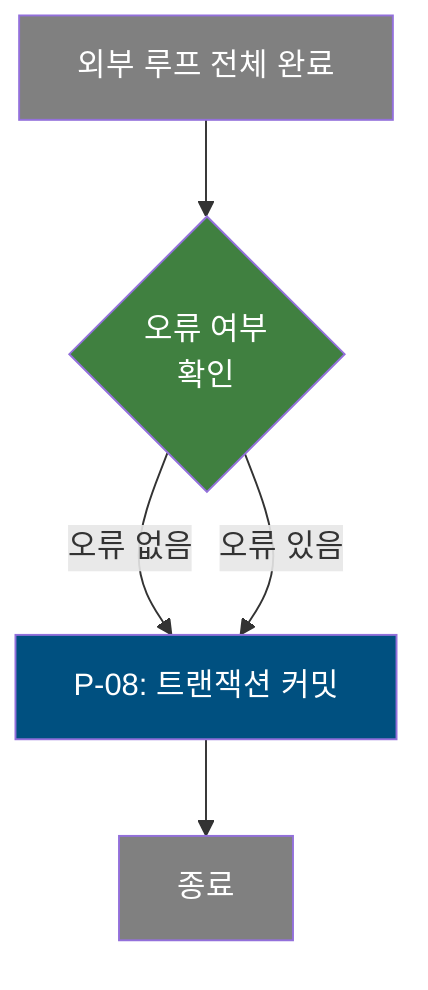
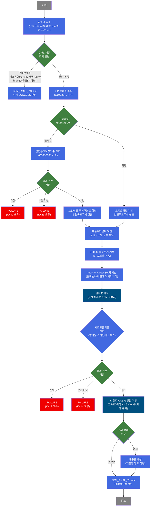

# C103100070 비즈니스 프로세스 분석서 (BPA)

## 1. 시스템 개요

| 항목 | 내용 |
|------|------|
| 서비스 ID | C103100070 |
| 업무명 | 품질설계 제조사양 두께 편성 처리 |
| 서비스 타입 | nui |
| 분석 일시 | 2026-03-21 (KST) |
| 원본 분석일 | 2026-03-16 |
| 문서 버전 | 1.0 |

---

## 2. 시스템 목적

이 서비스는 품질설계 확정 데이터를 대상으로 제조사양(Manufacturing Spec)의 두께 관련 항목을 자동 계산하고 편성하는 배치(NUI) 프로세스이다. 품질설계가 확정된 각 주문 코일/시트에 대해 제품두께 범위, 압연목표두께, PLTCM 출측두께, 매중량 등 11개 두께 편성 항목을 산출하여 제조사양에 반영한다.

처리 대상은 품질설계 확정 상태인 주문 레코드 전체이며, 주문별 제조유형·품명코드·두께구분·고객요청 압연두께 등 다양한 조건에 따라 계산 방식이 분기된다. 구매 반제품에 해당하는 주문은 두께 계산을 건너뛰고 별도 표시하며, 계산 과정에서 오류가 발생하면 해당 주문에 오류 코드를 기록하고 다음 주문 처리를 계속한다.

이 서비스는 제조 현장에서 정확한 압연 조건을 도출하기 위한 선행 편성 단계로서, 후속 공정 지시 및 제조 실행의 기준 데이터를 제공한다.

---

## 3. 핵심 워크플로우

---

## 4. 상세 워크플로우

### 프로세스 흐름도 — 품질설계 확정 데이터 조회 및 루프 초기화 (P-01, P-02)

### 프로세스 흐름도 — 제조사양 내부 루프 및 두께 편성 (P-03, P-04, P-05, P-06)

### 프로세스 흐름도 — 두께 계산 오류 처리 (P-07)

### 프로세스 흐름도 — 최종 커밋 (P-08)

---

## 5. 비즈니스 로직 상세

P-01: 처리 플래그 초기화 — 배치 시작 시 프로세스 상태를 초기화

- **입력**: 없음 (배치 기동 파라미터)
- **처리**:
  1. 처리 진행 플래그를 'C'(계속)로 설정
  2. 후속 처리에서 오류 누적 여부를 판단하는 기준 플래그 초기화
- **출력**: 처리 컨텍스트에 초기 상태값 설정
- **예외**: 없음

P-02: 품질설계 확정 데이터 조회 — 처리 대상 주문 목록 수집

- **입력**: 없음 (전체 확정 대상)
- **처리**:
  1. 품질설계 납기 데이터(TB_C10_QLT_DSN_DLV)에서 처리 대상 레코드 전건 조회
  2. 조회 결과를 외부 루프 제어에 바인딩
- **출력**: 처리 대상 주문 목록 (주문번호, 주문라인, 품질설계 상태코드, 제품 정보 등)
- **예외**: 조회 결과가 없으면 처리 없이 커밋 후 종료

P-03: 제조사양 데이터 조회 — 주문별 제조사양 레코드 수집

- **입력**: 현재 처리 주문의 주문번호, 주문라인
- **처리**:
  1. 품질설계 제조사양(TB_C10_QLT_DSN_MNF)에서 해당 주문의 제조사양 레코드 조회
  2. 조회 결과를 내부 루프 제어에 바인딩
- **출력**: 제조사양 레코드 목록 (제조유형, 도금두께, 소둔 설정 등)
- **예외**: 해당 주문의 제조사양이 없으면 내부 루프 즉시 종료

P-04: 두께 편성 계산 — 제품 유형별 두께 항목 자동 산출

- **입력**: 현재 처리 주문의 재질코드, 품명코드, 두께구분, 고객요청 압연두께, 도금량, 도막두께, 주문두께 공차 등
- **처리**:
  1. **구매반제품 조기 판단**: 제조유형이 1이 아니고, 재질코드가 H/M계열이 아니고, 품명코드가 알미늄(5)/스테인레스(7)가 아니면 → 구매반제품(SEM_RMTL_YN=Y)으로 표시 후 즉시 반환
  2. **SP 보정율 조회**: C10B2070 기준에서 품명·재질·Spangle구분·두께·폭 조건으로 SP두께보정율 조회 (미존재 시 0으로 처리)
  3. **압연목표두께(crm_thk) 계산**: 고객 요청 압연두께 유무와 두께보정단위(CRN/PCN/TRK), 두께구분(BMT/TCT/칼라TCT)에 따른 분기 계산
     - 고객요청 없음: C10B2060(압연두께Set치보정기준) 조회 필수 → 보정단위·두께구분 조합별 공식 적용
     - 고객요청 있음: 보정단위별 공식 직접 적용
  4. **제품두께범위 계산**: 품명코드별 공식 적용 (CR계열, 칼라계열, EGI/GI/HGI계열 등 구분)
  5. **PLTCM 출측두께 계산**: TRK 단위는 압연목표두께 그대로, 그 외는 SP보정율 적용
  6. **PLTCM X-Ray Set치 계산**: 알미늄/스테인레스는 주문두께 그대로, 그 외는 소수점 0.005 단위 정규화
  7. **제조표준 조회**: C10B1051 기준에서 소둔로 유형·온도·CGL 라인 설정값 결정 (알미늄/스테인레스 제외)
  8. **매중량 계산**: Coil 형태인 경우 재질별 밀도 적용 공식으로 산출
- **출력**: 압연목표두께, 제품두께 상하한, PLTCM 출측두께, X-Ray Set치, 제품길이 상하한, 매중량, 소둔/CGL 설정값, 구매반제품 여부
- **예외**:
  - C10B2060 조회 결과 0건 → FAILURE (오류코드 KK82)
  - C10B2060 조회 결과 2건 이상 → FAILURE (오류코드 KK83)
  - PCN/TRK 단위 + 두께관리코드 불일치 조합 → FAILURE (오류코드 KK94)
  - C10B1051 조회 결과 0건 → FAILURE (오류코드 KK13)
  - C10B1051 조회 결과 2건 이상 → FAILURE (오류코드 KK14)

P-05: 구매반제품 오류코드 기록 — 구매반제품 주문에 오류코드 표시

- **입력**: 현재 처리 주문번호, 주문라인, 구매반제품 판정 결과
- **처리**:
  1. 오류 발생 플래그를 Y로 설정, 오류코드를 TB01로 설정
  2. 품질설계 오류 처리 서브서비스(C103100140) 호출하여 오류 정보 기록
  3. 품질설계 공통 데이터(TB_C10_QLT_DSN_CMN)에 오류 여부 갱신
- **출력**: TB_C10_QLT_DSN_CMN의 품질설계오류여부 항목 갱신
- **예외**: 서브서비스 호출 실패 시 해당 건 처리 오류로 처리

P-06: 제조사양 두께 항목 갱신 — 계산된 두께 편성값을 제조사양에 반영

- **입력**: P-04에서 산출된 두께 편성 결과값 일체
- **처리**:
  1. 품질설계 제조사양(TB_C10_QLT_DSN_MNF)에 계산된 두께 항목 업데이트
     - 일반 업데이트: 소둔로 설정값, CGL 라인 설정값, 두께 범위, PLTCM 설정값, 길이 범위 등 42개 항목
     - 구매반제품(Y) 경로: 주문번호·라인 기반 간략 업데이트 (5개 항목)
  2. 내부 루프의 다음 제조사양 건으로 진행
- **출력**: TB_C10_QLT_DSN_MNF 제조사양 두께 항목 갱신
- **예외**: DB 갱신 실패 시 트랜잭션 롤백

P-07: 두께 계산 오류 처리 — 두께 편성 계산 실패 시 오류 정보 기록

- **입력**: 오류 발생 주문번호, 주문라인, 오류코드(TB06)
- **처리**:
  1. 오류 발생 플래그를 Y로 설정, 오류코드를 TB06으로 설정
  2. 품질설계 오류 처리 서브서비스(C103100140) 호출하여 오류 내역 기록
  3. 품질설계 공통 데이터(TB_C10_QLT_DSN_CMN)에 오류 여부 갱신
  4. 오류가 발생한 건은 건너뛰고 내부 루프의 다음 제조사양 건으로 계속 진행
- **출력**: TB_C10_QLT_DSN_CMN의 품질설계오류여부 항목 갱신
- **예외**: 오류 처리 자체 실패 시 해당 건 스킵 후 계속

P-08: 트랜잭션 커밋 — 전체 처리 결과 확정

- **입력**: 오류 여부 플래그(P_ERR_KEY) 확인
- **처리**:
  1. 오류 여부에 관계없이 처리된 데이터 전체를 커밋
  2. exitFlag=N 설정으로 정상 종료 처리
- **출력**: DB 변경사항 영구 반영
- **예외**: 커밋 실패 시 전체 롤백

---

## 6. 커스텀 클래스 워크플로우

### DbQualDesignLoop (약 171줄)

**역할**: 이전 Activity가 조회한 ResultSet을 1건씩 순회하기 위한 공통 루프 제어 액티비티. 서비스 내 외부 루프(주문별)와 내부 루프(제조사양별) 두 인스턴스에서 사용된다.

171줄로 200줄 미만이므로 Mermaid 대상에서 제외한다. 역할 요약: 처리 건수 카운터를 역방향으로 관리하고 현재 Row를 컨텍스트에 바인딩한 뒤 `success`/`exit` 전이를 반환하는 범용 반복 컨트롤러이다.

---

### DbSearchThkSizeData (약 876줄)

**역할**: 품질설계 편성 과정에서 제품두께 관련 정보 일체(압연목표두께, 제품두께범위, PLTCM 출측두께, 매중량, 제조표준 설정값 등 11개 항목)를 계산·편성하는 핵심 두께 편성 Activity.

---

## 7. 주요 유즈케이스

UC-01: 품질설계 확정 주문에 대한 제조사양 두께 자동 편성

- **Actor**: 배치 스케줄러 (자동 실행)
- **목적**: 품질설계가 확정된 주문 전건에 대해 제조사양의 두께 관련 항목을 자동 산출하여 반영
- **주요 흐름**:
  1. 품질설계 확정 상태인 주문 목록 전체 조회
  2. 주문별로 제조사양 레코드를 순회하며 두께 계산 수행
  3. 품명코드·두께구분·고객요청 여부에 따른 분기 계산으로 압연목표두께, 제품두께범위, PLTCM 설정값, 매중량 산출
  4. 계산 결과를 제조사양 데이터에 저장
  5. 전체 처리 완료 후 트랜잭션 커밋
- **예외**: 압연두께보정기준 또는 제조표준기준 조회 실패 시 해당 건에 오류코드 기록 후 다음 건 계속 처리

UC-02: 구매반제품 주문에 대한 차선 표시 처리

- **Actor**: 배치 스케줄러 (자동 실행)
- **목적**: 구매 반제품(외부 구매 소재)에 해당하는 주문을 식별하고 두께 계산을 건너뛰도록 표시
- **주요 흐름**:
  1. 두께 편성 계산 진입 시 제조유형·재질코드·품명코드 기준으로 구매반제품 여부 판단
  2. 구매반제품으로 판단된 경우 오류코드 TB01과 함께 품질설계 오류 서브서비스 호출
  3. 품질설계 공통 데이터의 오류 여부 항목을 Y로 갱신
  4. 두께 계산 수행 없이 다음 제조사양 건으로 진행
- **예외**: 서브서비스 오류 기록 실패 시 해당 건 스킵 후 계속

UC-03: 두께 계산 오류 주문에 대한 오류 코드 기록

- **Actor**: 배치 스케줄러 (자동 실행)
- **목적**: 두께 편성 계산 과정에서 업무기준 데이터 불일치·누락으로 실패한 주문에 오류코드를 기록하여 운영자가 사후 확인할 수 있도록 처리
- **주요 흐름**:
  1. 압연두께보정기준(C10B2060) 또는 제조표준기준(C10B1051) 조회 실패 감지
  2. 오류코드 TB06과 함께 품질설계 오류 서브서비스(C103100140) 호출
  3. 품질설계 공통 데이터의 오류 여부 항목 갱신
  4. 오류 건을 건너뛰고 내부 루프 계속 진행
- **예외**: 오류 기록 실패 시 해당 건 스킵 후 계속

---

## 8. 관련 엔티티

### 엔티티 목록

| 엔티티(테이블) | 설명 | 사용 유형 |
|---------------|------|----------|
| TB_C10_QLT_DSN_DLV | 품질설계 납기 데이터 — 처리 대상 주문 목록 | 조회 |
| TB_C10_QLT_DSN_MNF | 품질설계 제조사양 — 두께 편성 결과 저장 대상 | 조회/갱신 |
| TB_C10_QLT_DSN_CMN | 품질설계 공통 데이터 — 단위중량 및 오류 여부 갱신 | 갱신 |

### 엔티티 간 관계
- TB_C10_QLT_DSN_DLV는 처리 대상 주문의 기준 목록으로, 주문번호·주문라인 키를 통해 TB_C10_QLT_DSN_MNF와 연결된다.
- TB_C10_QLT_DSN_MNF는 주문별로 1건 이상의 제조사양 레코드를 가지며, 두께 편성 계산 결과가 이 테이블에 반영된다.
- TB_C10_QLT_DSN_CMN은 품질설계 공통 정보를 관리하며, 오류 여부 및 단위중량 항목이 본 배치 처리를 통해 갱신된다.

---

## 9. 서브서비스

| 서비스 ID | 설명 | 호출 시점 | 트랜잭션 | BPA 문서 |
|-----------|------|---------|---------|---------|
| C103100140 | 품질설계 오류 처리 — 오류 유형 코드와 함께 품질설계 오류 정보를 기록 | P-05(구매반제품 오류) 및 P-07(두께 계산 오류) 발생 시 | 공유 (new-transaction: false) | [C103100140_bpa.md](C103100140_bpa.md) |

---

## 10. 특이사항 및 주의사항

### 1. 이중 루프 구조의 오류 처리 전략
외부 루프(주문별)와 내부 루프(제조사양별)의 이중 반복 구조에서, 각 루프는 오류 발생 시 롤백하지 않고 오류 코드를 기록한 뒤 계속 진행한다. 이를 통해 일부 주문의 두께 계산 실패가 전체 배치를 중단시키지 않는다. 최종 커밋은 오류 여부와 무관하게 전건 처리 완료 후 한 번만 수행된다.

### 2. 구매반제품 판단 로직의 복합 조건
구매반제품 여부는 단일 플래그가 아닌 세 가지 조건(제조유형 ≠ 1, 재질코드 H/M계열 아님, 품명코드 알미늄/스테인레스 아님)의 AND 조합으로 결정된다. 이 조건을 충족하는 주문은 두께 계산 전 단계에서 조기 분기되어 구매반제품으로 표시되고, 오류코드 TB01이 기록된다. 실제로는 오류가 아닌 정상적인 분류 처리이나 오류 채널을 통해 기록하는 설계 방식이다.

### 3. EasyAccess 업무기준 조회 필수성 차등 적용
두께 계산에 사용되는 세 가지 업무기준(C10B2070 SP보정율, C10B2060 압연두께보정, C10B1051 제조표준) 중 C10B2070만 조회 실패 시 오류 없이 0값으로 진행되고, C10B2060과 C10B1051은 조회 결과 0건 또는 2건 이상이면 FAILURE를 반환한다. 또한 알미늄(품명코드 5)과 스테인레스(품명코드 7)는 C10B2060, C10B1051 조회 대상에서 제외되며 별도 밀도 값으로 매중량을 계산한다.

### 4. DbQualDesignLoop 성능 특성
DbQualDesignLoop는 매 루프 순회마다 ResultSet 처음부터 재탐색하는 O(n²) 방식으로 구현되어 있다. 처리 대상 주문이 많거나 제조사양 건수가 많은 경우 배치 처리 시간이 급격히 증가할 수 있다. 이 클래스는 40개 이상의 서비스에서 공유 사용되는 공통 컴포넌트이므로 변경 시 전체 영향도 검토가 필요하다.

### 5. 소수점 처리 규칙의 차별화
두께 값의 소수점 처리에 두 가지 규칙이 혼용된다. `thk_dot()`는 소수점 3자리까지 버림(절삭) 처리를 수행하고, `pltcm_x_Ray()`는 소수점 3번째 자리를 0/5/올림으로 변환하여 0.005 단위로 정규화한다. CRN 단위 TCT 계산에서는 별도로 소수점 4자리 반올림을 추가 적용한다. 이 규칙들은 제조 현장의 장비 설정값 정밀도 요건을 반영한 것으로, 임의 변경 시 제조 편차가 발생할 수 있다.
