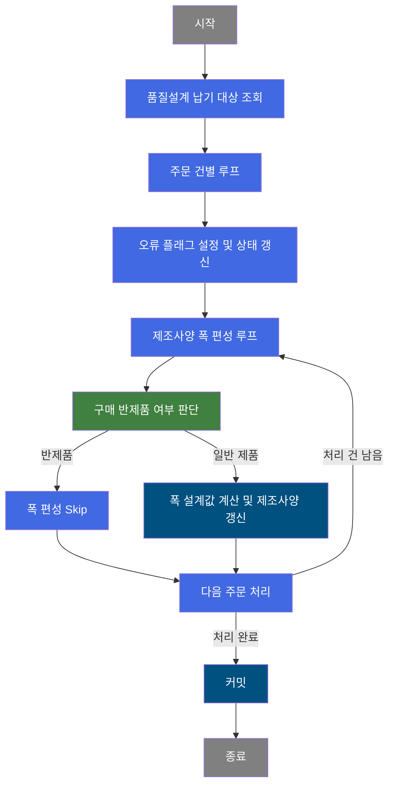
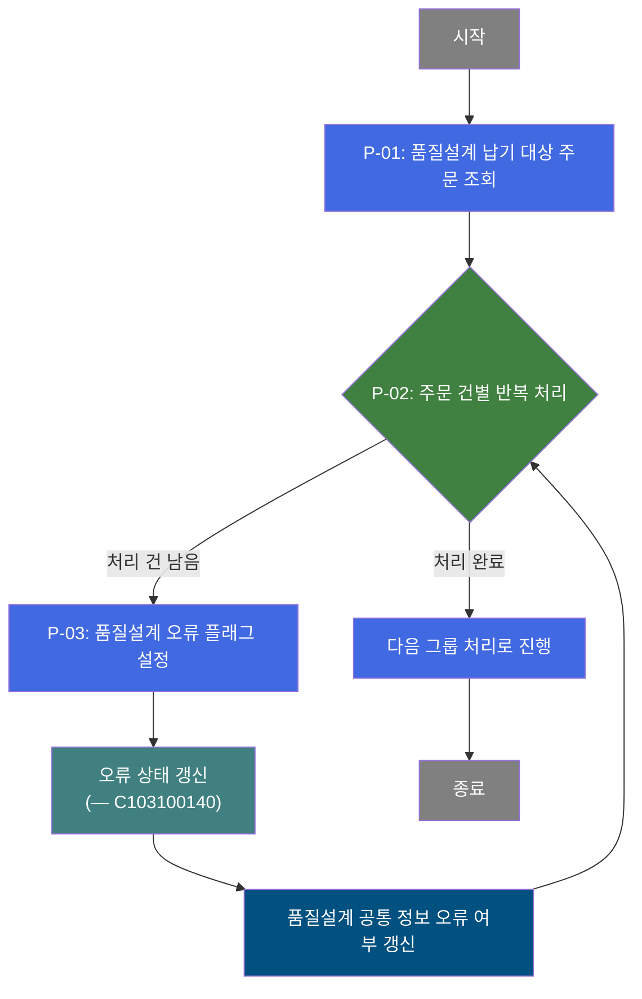
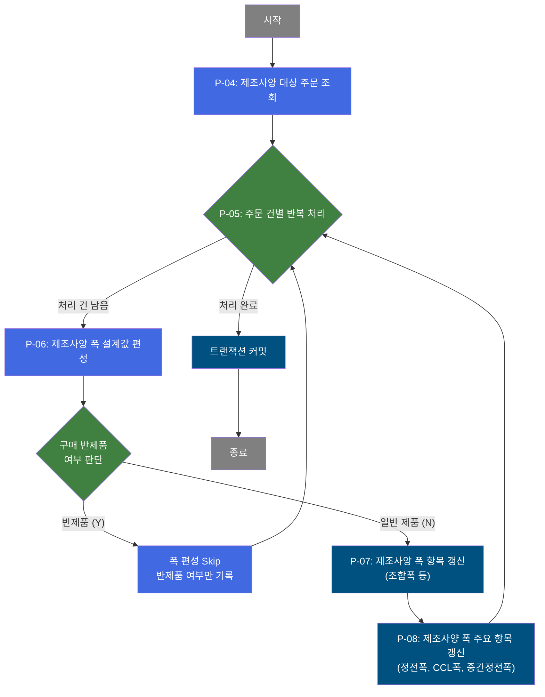
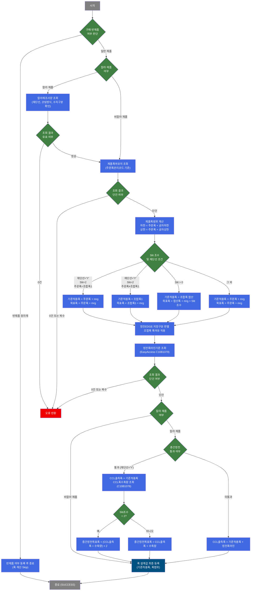

# C103100080 비즈니스 프로세스 분석서 (BPA)

## 1. 시스템 개요

| 항목 | 내용 |
|------|------|
| 서비스 ID | C103100080 |
| 업무명 | 품질설계 오류 처리 및 제조사양 폭 편성 배치 |
| 서비스 타입 | nui |
| 분석 일시 | 2026-03-21 (KST) |
| 원본 분석일 | 2026-03-16 |
| 문서 버전 | 1.0 |

---

## 2. 시스템 목적

본 서비스는 품질설계 처리 과정에서 오류가 발생한 주문 건을 식별하고, 오류 플래그를 기록한 뒤 해당 주문의 제조사양 폭 정보를 자동으로 편성하는 배치 처리 서비스이다. 사람의 개입 없이 주기적으로 실행되어 품질설계 데이터 상태를 최신화한다.

주문별로 납기 설계 기준값(폭 공차, 치수 기준 등)을 기반으로 제품목표폭, CCL 출측폭, 중간정전목표폭, 조합폭 등 실제 생산에 필요한 폭 설계값을 계산하고, 제조사양 테이블에 반영한다. 이 작업은 칼라 제품 여부, 재단선 유무, Slit 조수, 구매 반제품 여부 등 다양한 제품 특성에 따라 분기 처리된다.

오류가 해소된 정상 주문 건에 대해서는 연계 서비스(C103100140)를 호출하여 오류 상태를 갱신하고, 이후 제조사양 폭 편성을 수행함으로써 품질설계 결과의 완결성을 보장한다.

---

## 3. 핵심 워크플로우

---

## 4. 상세 워크플로우

### 프로세스 흐름도 — 품질설계 오류 처리 (P-01, P-02, P-03)

### 프로세스 흐름도 — 제조사양 폭 편성 (P-04, P-05, P-06, P-07, P-08)

---

## 5. 비즈니스 로직 상세

P-01: 품질설계 납기 대상 주문 조회 — 처리 대상 주문 목록 확보

- **입력**: TB_C10_QLT_DSN_DLV (품질설계납기) 테이블에서 처리 대상 주문 목록 조회
- **처리**:
  1. 품질설계 납기 테이블에서 처리 대상 전체 주문 건을 조회하여 메모리에 적재
  2. 조회 결과를 이후 루프 처리를 위한 기준 데이터셋으로 설정
- **출력**: 처리 대상 주문 목록 (메모리 상 ResultSet)
- **예외**: 해당 없음 (결과 0건이면 이후 루프가 즉시 종료됨)

P-02: 주문 건별 반복 처리 — 루프 제어 및 처리 Row 바인딩

- **입력**: P-01에서 조회한 주문 ResultSet, 루프 카운터
- **처리**:
  1. 남은 처리 건수 확인 — 0이면 루프 종료
  2. 현재 처리 Row(주문번호, 주문행번, 제조구분, PLTCM Set치 등)를 처리 컨텍스트에 바인딩
  3. 매 루프 진입 시 오류 플래그를 초기화(N)하여 이전 건의 상태가 전이되지 않도록 방지
  4. 처리 건수 카운터를 1 감소시킨 뒤 후속 처리로 전이
- **출력**: 단건 주문 데이터 (컨텍스트 바인딩)
- **예외**: param-count 미설정 시 실패 반환

P-03: 품질설계 오류 플래그 설정 — 오류 코드 기록 및 상태 갱신

- **입력**: 현재 처리 주문의 주문번호, 주문행번
- **처리**:
  1. 오류 플래그(P_ERR_KEY)를 Y로, 오류 코드(QLT_DSN_ERR_CD)를 TB06으로 설정
  2. 서브서비스 C103100140을 호출하여 품질설계 오류 상태를 중앙 처리로 위임
  3. 품질설계 공통 정보 테이블(TB_C10_QLT_DSN_CMN)의 오류 여부 항목을 Y로 갱신
- **출력**: TB_C10_QLT_DSN_CMN에 오류 여부 갱신
- **예외**: 해당 없음 (오류 기록 자체가 오류 처리 목적이므로 실패 조건 없음)

P-04: 제조사양 대상 주문 조회 — 폭 편성 대상 목록 확보

- **입력**: P-01~P-03 루프 종료 후, 현재 처리 주문의 주문번호, 주문행번
- **처리**:
  1. 품질설계 제조사양 테이블(TB_C10_QLT_DSN_MNF)에서 해당 주문의 제조사양 목록 조회
  2. 조회 결과를 MNF 루프의 처리 기준 데이터셋으로 설정
- **출력**: 제조사양 목록 (메모리 상 ResultSet)
- **예외**: 결과 0건이면 MNF 루프 즉시 종료

P-05: 주문 건별 반복 처리 (MNF 루프) — 제조사양 Row 바인딩

- **입력**: P-04에서 조회한 제조사양 ResultSet, 루프 카운터
- **처리**:
  1. 남은 처리 건수 확인 — 0이면 루프 종료 후 커밋 진행
  2. 현재 처리 Row(주문번호, 주문행번, 제조구분, 품명코드, 제품형태, 재질코드, 두께/폭/조수/조합폭 등)를 컨텍스트에 바인딩
  3. 매 루프 진입 시 오류 플래그 초기화
  4. 처리 건수 카운터를 1 감소 후 후속 폭 편성 처리로 전이
- **출력**: 단건 제조사양 데이터 (컨텍스트 바인딩)
- **예외**: param-count 미설정 시 실패 반환

P-06: 제조사양 폭 설계값 편성 — 폭 계산 및 반제품 판단

- **입력**: 컨텍스트에 바인딩된 주문 폭/두께/조수/조합폭 데이터, 폭공차 기준
- **처리**:
  1. 구매 반제품 원자재 여부 판단 — 해당 시 폭 계산 없이 반제품 여부(Y)만 등록하고 Skip
  2. 칼라 제품인 경우 칼라제조사양(SELECT_MNF_CCL_BOM)을 조회하여 재단선 유무, 코팅방식, 수지구분 전면 확인
  3. 제품폭여유치(VI_M00_C10A1070)를 주문폭관리코드 기준으로 단건 조회하여 폭여유값(mrg_wth) 확보
  4. 제품폭범위 하한/상한 = 주문환산폭 ± 인수도폭공차로 계산
  5. Slit 조수 및 재단선 조건에 따라 기준적용폭(정전목표폭) 계산
     - 재단선='Y' AND Slit=2 AND 주문폭=조합폭1: 기준적용폭 = 주문환산폭 + mrg_wth
     - 재단선='Y' AND Slit=2 AND 주문폭≠조합폭1: 기준적용폭 = 조합폭1 + mrg_wth
     - Slit > 0 (그 외): 기준적용폭 = 조합폭1~10 합산 + mrg_wth × Slit조수
     - 그 외: 기준적용폭 = 주문환산폭 + mrg_wth
  6. 정전폭마진기준(C10B1079)을 EasyAccess로 조회하여 정전폭마진값 확보
  7. 칼라 제품인 경우 CCL 출측폭 계산
     - 중간정전 통과제: CCL 출측폭 = 기준적용폭, CCL폭수축량(C10B1078) EasyAccess 조회하여 중간정전목표폭 계산
     - 중간정전 미통과제: CCL 출측폭 = 기준적용폭 + 정전폭마진
  8. EDGE 지정구분 판별 및 Slit 조합폭에 폭여유치 가산하여 제조사양조합폭 확정
- **출력**: 폭 설계값 컨텍스트 등록 (기준적용폭, CCL폭, 중간정전목표폭, 조합폭 등)
- **예외**: 폭여유치 또는 정전폭마진기준 조회 결과가 0건 또는 복수 건이면 실패 반환

P-07: 제조사양 폭 항목 갱신 — 조합폭 및 폭 범위 저장

- **입력**: P-06에서 계산된 폭 설계값 (조합폭, 폭 범위, EDGE 구분 등)
- **처리**:
  1. TB_C10_QLT_DSN_MNF에 Slit조수, 조합폭1~10, 폭범위 하한/상한, EDGE 지정구분, CCL 출측폭, 중간정전목표폭, 기준적용폭을 갱신
- **출력**: TB_C10_QLT_DSN_MNF 갱신 (조합폭 포함 폭 관련 항목 전체)
- **예외**: 해당 없음

P-08: 제조사양 폭 주요 항목 갱신 — 핵심 폭 설계값 저장

- **입력**: P-06에서 계산된 핵심 폭 값 (기준적용폭, CCL폭, 중간정전목표폭 등)
- **처리**:
  1. TB_C10_QLT_DSN_MNF에 정전목표폭(기준적용폭), CCL 출측폭, 중간정전목표폭을 추가 갱신
  2. 이후 MNF 루프(P-05)로 복귀하여 다음 제조사양 건 처리
- **출력**: TB_C10_QLT_DSN_MNF 갱신 (핵심 폭 항목)
- **예외**: 해당 없음

---

## 6. 커스텀 클래스 워크플로우

### DbQualDesignLoop (약 171줄)

**역할**: 이전 액티비티가 조회한 ResultSet을 1건씩 순회하여 후속 처리 액티비티에 단건 데이터를 공급하는 루프 제어 컴포넌트. 본 서비스에서는 PROC_LOOP(납기 대상 루프)와 MNF_LOOP(제조사양 루프) 두 인스턴스로 사용된다.

> 171줄 미만으로 Mermaid 워크플로우 대상이 아님. 주요 비즈니스 규칙은 아래에 기술.

- 루프 카운터를 역방향(전체 건수에서 1씩 감소)으로 관리하며, `현재 Row 인덱스 = 전체 건수 - 남은 건수` 수식으로 순방향 탐색을 수행
- 남은 건수가 0이 되면 카운터를 컨텍스트에서 제거하고 exit 전이를 반환하여 루프를 종료
- 매 루프 진입 시 오류 플래그(P_ERR_KEY)와 품질설계 오류 여부(QLT_DSN_ERR_YN)를 초기화하여 건 간 상태 오염 방지
- param-count가 설정되지 않은 경우 failure를 반환

---

### DbSearchWthSizeData (약 574줄)

**역할**: 주문 제품의 폭 관련 설계값(기준적용폭, 제품폭범위, 조합폭, EDGE 지정, CCL 출측폭, 중간정전목표폭)을 계산하여 처리 컨텍스트에 등록하는 폭 편성 전담 컴포넌트.

---

## 7. 주요 유즈케이스

UC-01: 품질설계 오류 주문의 오류 상태 자동 갱신

- **Actor**: 배치 스케줄러 (자동 실행)
- **목적**: 품질설계 처리 중 오류가 발생한 주문 건에 대해 오류 코드(TB06)와 오류 여부(Y)를 자동으로 기록하고, 연계 서비스를 통해 오류 상태를 정합성 있게 관리
- **주요 흐름**:
  1. 품질설계 납기 대상 주문 목록 전체 조회
  2. 주문별로 오류 플래그 설정 및 서브서비스(C103100140) 호출
  3. 품질설계 공통 정보 테이블에 오류 여부 갱신
  4. 전체 주문 처리 완료 후 커밋
- **예외**: 처리 대상 주문이 없으면 루프 즉시 종료

UC-02: 제조사양 폭 자동 편성

- **Actor**: 배치 스케줄러 (자동 실행)
- **목적**: 품질설계 제조사양 테이블에 등록된 주문별로 실제 생산에 필요한 폭 설계값(기준적용폭, CCL출측폭, 중간정전목표폭, 조합폭 등)을 자동 계산하여 저장
- **주요 흐름**:
  1. 제조사양 대상 주문 조회
  2. 구매 반제품 여부 판단 — 반제품이면 폭 계산 없이 Skip
  3. 칼라 제품의 경우 칼라제조사양 조회 후 재단선/코팅방식 확인
  4. 폭여유치, 정전폭마진기준, CCL폭수축량 기준 조회
  5. Slit 조수 및 재단선 조건에 따라 폭 설계값 계산
  6. 제조사양 테이블에 계산된 폭 값 저장
- **예외**: 폭여유치 또는 정전폭마진기준 조회 결과가 단건이 아닌 경우 오류 처리

UC-03: 구매 반제품 원자재 폭 편성 Skip

- **Actor**: 배치 스케줄러 (자동 실행)
- **목적**: 구매 반제품 원자재는 이미 가공된 소재이므로 폭 계산이 불필요하며, 반제품 여부 플래그만 등록하고 이후 폭 계산 단계를 건너뜀
- **주요 흐름**:
  1. 제조구분, 원자재코드, 품명코드 기준으로 반제품 원자재 여부 판단
  2. 반제품 원자재로 판별되면 반제품 여부(SEM_RMTL_YN=Y)만 등록
  3. 폭여유치 조회 이하 모든 폭 계산 단계 Skip, 루프 다음 건으로 진행
- **예외**: 해당 없음

---

## 9. 관련 엔티티

### 엔티티 목록

| 엔티티(테이블) | 설명 | 사용 유형 |
|---------------|------|----------|
| TB_C10_QLT_DSN_DLV | 품질설계 납기 정보 | 조회 |
| TB_C10_QLT_DSN_CMN | 품질설계 공통 정보 | 갱신 |
| TB_C10_QLT_DSN_MNF | 품질설계 제조사양 | 조회/갱신 |
| VI_M00_C10A1070 | 제품폭여유치 기준 뷰 | 조회 |
| SELECT_MNF_CCL_BOM | 칼라제조사양(CCL BOM) | 조회 |

### 엔티티 간 관계
- TB_C10_QLT_DSN_DLV와 TB_C10_QLT_DSN_CMN은 주문번호/주문행번 기준으로 연결되며, 납기 기준 정보를 바탕으로 공통 정보의 오류 여부를 갱신한다
- TB_C10_QLT_DSN_MNF는 TB_C10_QLT_DSN_DLV와 주문번호/주문행번으로 연결되며, 납기 기준 폭공차를 참조하여 제조사양 폭 항목을 계산·갱신한다
- VI_M00_C10A1070는 마스터 스키마(M00APUSER)의 제품폭여유치 기준 뷰로, 주문폭관리코드 기준으로 폭여유값을 제공한다
- SELECT_MNF_CCL_BOM는 칼라 제품에 한해 조회되며, 재단선 유무 및 코팅 관련 정보를 제공한다

---

## 10. 서브서비스

| 서비스 ID | 설명 | 호출 시점 | 트랜잭션 | BPA 문서 |
|-----------|------|---------|---------|---------|
| C103100140 | 품질설계 오류 상태 처리 | P-03 오류 플래그 설정 후 (주문별 오류 처리 시) | 공유 (동일 트랜잭션) | 미작성 |

---

## 11. 특이사항 및 주의사항

### 1. 이중 루프 구조 — 납기 루프 내 제조사양 루프 중첩
본 서비스는 두 단계의 중첩 루프로 구성된다. 외부 루프(PROC_LOOP)는 납기 대상 주문 목록을 순회하며, 내부 루프(MNF_LOOP)는 각 주문에 귀속된 제조사양 건들을 순회한다. DbQualDesignLoop는 루프마다 전체 ResultSet을 재탐색하는 O(n²) 방식으로 동작하므로, 처리 대상 주문이나 제조사양 건수가 많을 경우 성능 저하가 발생할 수 있다.

### 2. 오류 플래그 초기화 전략
DbQualDesignLoop는 매 루프 진입 시 오류 플래그(P_ERR_KEY)와 품질설계 오류 여부(QLT_DSN_ERR_YN)를 초기화한다. 이를 통해 이전 건에서 발생한 오류 상태가 다음 건에 전이되는 것을 방지한다. 단, 이 초기화는 루프 진입 시점에 수행되므로, 루프 외부에서 플래그를 읽으면 마지막 처리 건의 상태만 반영된다.

### 3. 칼라 제품의 다단계 폭 계산 복잡성
칼라 제품(COLOR COATED LINE)의 경우 일반 제품 대비 폭 계산 단계가 추가된다. 칼라제조사양 조회, 정전폭마진기준 EasyAccess 조회, CCL폭수축량 EasyAccess 조회가 순차적으로 수행되며, 각 단계에서 단건 조회 결과를 보장해야 한다. 조회 결과가 0건 또는 복수 건이면 해당 주문의 폭 편성이 실패 처리된다.

### 4. 구매 반제품 원자재 조기 종료 로직
제조구분이 "1"이 아니면서 원자재코드 첫 글자가 H 또는 M이 아니고, 품명코드가 5 또는 7이 아닌 경우에 한해 구매 반제품으로 판정하여 폭 계산을 건너뛴다. 이 조건이 복합적이므로 신규 제품 분류 추가 시 반드시 해당 로직을 함께 검토해야 한다.

### 5. EasyAccess 기준 데이터 의존성
폭 편성 정확도는 정전폭마진기준(C10B1079)과 CCL폭수축량기준(C10B1078)의 EasyAccess 기준 데이터에 직접 의존한다. 해당 기준 데이터가 미등록되거나 복수 건으로 등록된 경우 처리 실패가 발생하므로, 기준 데이터 관리가 배치 정상 실행의 전제 조건이다.
