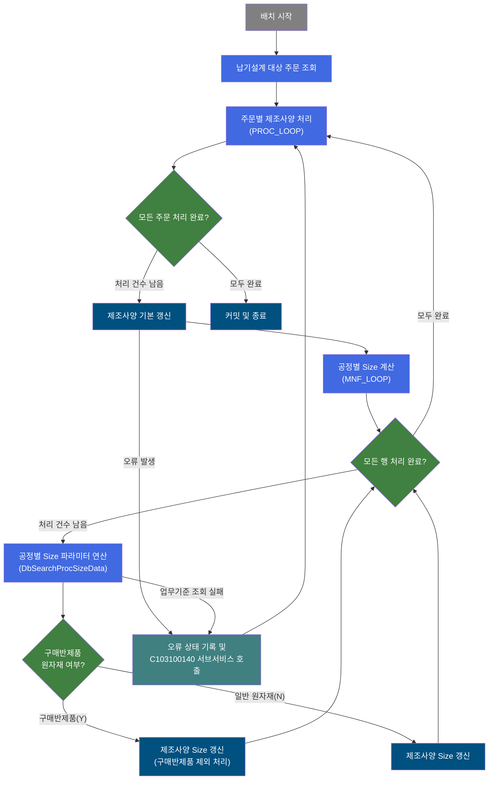
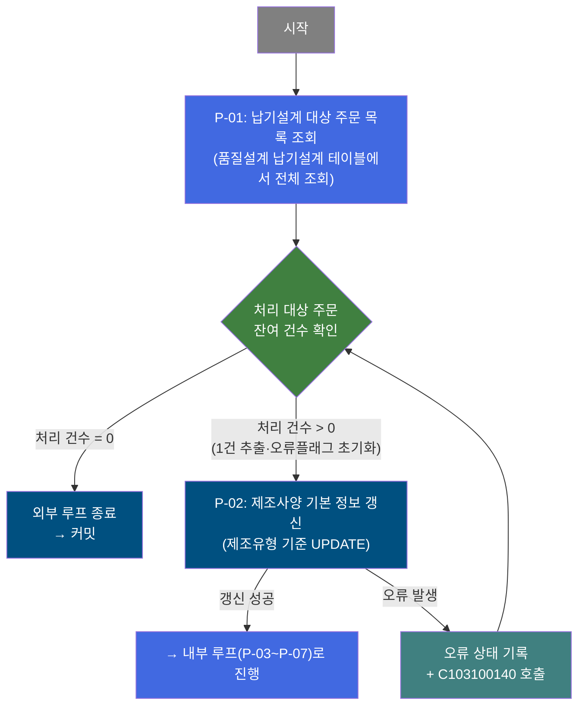
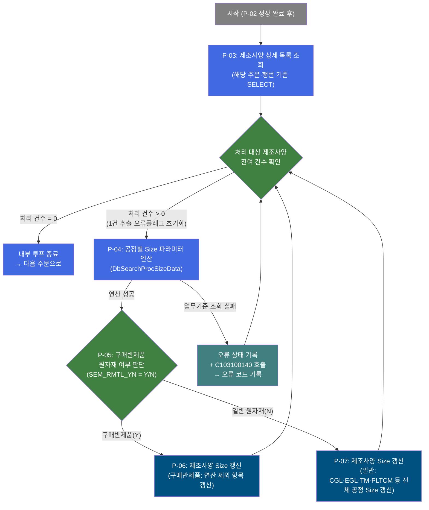
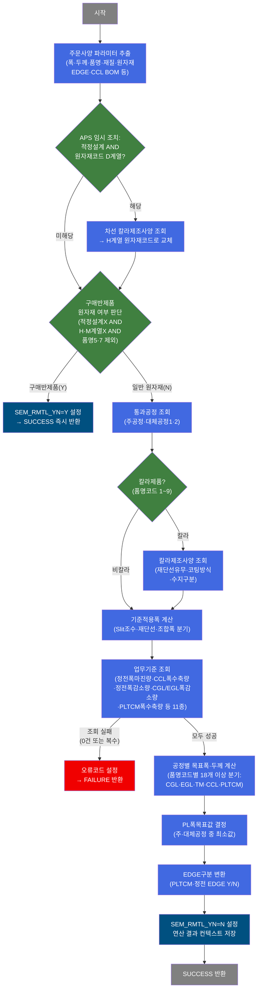

# C103100090 비즈니스 프로세스 분석서 (BPA)

## 1. 시스템 개요

| 항목 | 내용 |
|------|------|
| 서비스 ID | C103100090 |
| 업무명 | 품질설계 공정별 Size 자동 계산 (제조사양 갱신) |
| 서비스 타입 | nui |
| 분석 일시 | 2026-03-21 (KST) |
| 원본 분석일 | 2026-03-16 |
| 문서 버전 | 1.0 |

---

## 2. 시스템 목적

본 서비스는 품질설계 결과에 대해 주문별·행번별로 공정 단계(PLTCM, CGL, EGL, CCL, TM 등)에 필요한 폭·두께 목표값을 자동 계산하고, 그 결과를 제조사양 테이블에 일괄 갱신하는 배치 처리 서비스이다.

품질설계에서 확정된 주문사양(두께, 폭, 품명코드, 재질코드, EDGE구분 등)을 기반으로, 각 공정별 폭 수축량 및 마진량 업무기준(EasyAccess)을 조회하여 실제 설비에 투입되어야 할 치수 목표값을 연산한다. 연산 결과는 후속 공정 스케줄 편성 및 설비 제어의 기준 데이터로 활용된다.

처리 대상이 되는 주문에 오류가 발생하면 오류 코드와 오류 여부를 별도로 기록하고, 서브서비스(C103100140)를 호출하여 오류 정보를 전파한 후 다음 주문 처리로 계속 진행하는 구조로 설계되어 있다. 구매반제품(반제품 구매 원자재) 주문은 공정 계산 대상에서 제외되어 조기 완료된다.

---

## 3. 핵심 워크플로우

---

## 4. 상세 워크플로우

### 프로세스 흐름도 — 주문별 제조사양 기본 갱신 (P-01, P-02)

### 프로세스 흐름도 — 공정별 Size 계산 및 제조사양 갱신 (P-03, P-04, P-05, P-06, P-07)

---

## 5. 비즈니스 로직 상세

P-01: 납기설계 대상 주문 목록 조회 — 배치 처리 대상 전체 조회

- **입력**: TB_C10_QLT_DSN_DLV (품질설계 납기설계) 테이블에서 처리 대상 전체 주문·행번 목록 조회
- **처리**:
  1. 별도 조건 파라미터 없이 전체 대상을 조회하여 ResultSet으로 편성
  2. 조회 결과 건수를 루프 카운터 초기값으로 설정
- **출력**: 처리 대상 주문·행번 목록 (이후 루프 처리를 위한 ResultSet)
- **예외**: 조회 결과가 0건이면 즉시 루프 종료

P-02: 제조사양 기본 정보 갱신 — 납기설계 기반 제조유형 UPDATE

- **입력**: PROC_LOOP에서 추출된 현재 주문번호·행번·제조유형 구분값
- **처리**:
  1. 매 루프 진입 시 오류 플래그(P_ERR_KEY) 초기화
  2. 주문번호·행번·제조유형을 기준으로 제조사양(TB_C10_QLT_DSN_MNF) 기본 정보 갱신
- **출력**: TB_C10_QLT_DSN_MNF 테이블 UPDATE (제조유형 및 최종변경 감사 정보)
- **예외**: 오류 발생 시 오류 코드(TB06)를 컨텍스트에 설정 → C103100140 서브서비스 호출 → 다음 주문으로 계속 진행

P-03: 제조사양 상세 목록 조회 — 주문·행번 기준 조회

- **입력**: P-02에서 처리 중인 주문번호·행번
- **처리**:
  1. 해당 주문·행번의 제조사양 상세 목록(품명, 재질, 원자재, 폭, 두께 등 항목 포함) 조회
  2. 조회 결과를 내부 루프(MNF_LOOP)의 처리 대상으로 편성
- **출력**: TB_C10_QLT_DSN_MNF 기반 제조사양 상세 ResultSet
- **예외**: 조회 결과가 0건이면 내부 루프 즉시 종료 후 외부 루프로 복귀

P-04: 공정별 Size 파라미터 연산 — DbSearchProcSizeData

- **입력**: 현재 제조사양 1건의 주문사양 (품명코드, 재질코드, 원자재코드, 주문두께/폭, EDGE구분, 제조유형, CCL BOM번호 등 수십 개 항목)
- **처리**:
  1. APS 임시 조치: 적정설계(제조유형=1)이고 원자재코드가 D계열인 경우, 차선 칼라제조사양을 조회하여 H계열 원자재코드로 교체
  2. 구매반제품 조기 반환 판단: 적정설계가 아니고, 원자재코드가 H/M계열이 아니며, 품명코드가 5/7이 아닌 경우 SEM_RMTL_YN=Y 설정 후 즉시 반환 (이후 P-05에서 분기)
  3. 기준적용폭 계산: 재단선 유무·Slit 조수·조합폭 조건에 따라 4가지 분기로 기준폭 결정
  4. 통과공정 조회: 주공정·대체공정1·2 코드 추출, 코드 첫글자로 CGL(8)/EGL(9)/정전(6·7) 분류
  5. 업무기준 조회: 정전폭마진량(C10B1079), CCL폭수축량(C10B1078), 정전폭감소량(C10B1077), CGL/EGL폭감소량(C10B1075/C10B1076), PLTCM폭수축량(C10B1074) 등 11개 업무기준 조회
  6. 공정별 목표폭·목표두께 계산: 품명코드(18개 이상 조합)에 따라 CGL/EGL/TM/CCL/PLTCM 각 공정 Size 연산
  7. PLTCM 두께공차(C10B2190), 5Stand WR Type(C10B2110), Sleeve유무(C10B2120) 업무기준 조회 및 적용
  8. PL폭목표값 결정: 주·대체공정 PLTCM폭+수축량+ST폭보정치 중 최소값 결정 (설비 능력 상한 제한)
  9. EDGE구분 변환: 주문 EDGE구분을 PLTCM·정전 EDGE구분(Y/N)으로 변환
- **출력**: PosContext에 CGL/EGL/TM/PLTCM/CCL/중간정전 목표폭·두께, PLTCM두께공차, EDGE구분 등 저장 (DB 직접 쓰기 없음)
- **예외**: 업무기준 조회 결과가 0건이거나 복수 조회 시 해당 오류코드(KT04~KK91 등) 기록 후 FAILURE 반환. 단, PLTCM ST폭보정기준(C10B2191)과 중간재기준(C10B2230)은 오류 무시(soft-fail)

P-05: 구매반제품 원자재 여부 판단 — 처리 경로 분기

- **입력**: P-04 연산 결과 중 SEM_RMTL_YN 플래그
- **처리**:
  1. SEM_RMTL_YN = Y: 구매반제품으로 공정 Size 연산 대상 제외 → P-06으로 분기
  2. SEM_RMTL_YN = N: 일반 원자재로 전체 공정 Size 갱신 대상 → P-07로 분기
- **출력**: 분기 결정 (P-06 또는 P-07)
- **예외**: 없음 (Y/N 이진 분기)

P-06: 제조사양 Size 갱신 (구매반제품) — 비공정 항목 갱신

- **입력**: P-05에서 구매반제품 분기된 주문·행번·제조유형
- **처리**:
  1. 구매반제품은 공정 Size 계산 항목(CGL/EGL 등)을 갱신하지 않음
  2. 갱신 후 내부 루프 카운터를 차감하고 다음 제조사양 건으로 진행
- **출력**: TB_C10_QLT_DSN_MNF 테이블 UPDATE (구매반제품 해당 항목 범위)
- **예외**: 오류 발생 시 오류 코드 기록 → C103100140 서브서비스 호출 → 계속 진행

P-07: 제조사양 Size 갱신 (일반) — 전체 공정 Size UPDATE

- **입력**: P-04에서 계산된 CGL/EGL/TM/PLTCM/CCL·중간정전 목표폭·두께, EDGE구분, PLTCM두께공차 등
- **처리**:
  1. P-04에서 연산한 모든 공정별 Size 결과를 TB_C10_QLT_DSN_MNF에 일괄 반영
  2. CCL두께목표, 중간정전두께목표, CGL/EGL 목표폭·두께, TM 목표폭, PLTCM 목표폭·두께공차, PLTCM 5Stand WR Type, Sleeve유무, EDGE구분 등 25개 이상 항목 갱신
  3. 갱신 완료 후 내부 루프 카운터 차감, 다음 건 처리로 진행
- **출력**: TB_C10_QLT_DSN_MNF 테이블 UPDATE (공정별 Size 전체 항목)
- **예외**: 오류 발생 시 오류 코드 기록 → C103100140 서브서비스 호출 → 계속 진행

---

## 6. 커스텀 클래스 워크플로우

### DbQualDesignLoop (약 171줄)

**역할**: 이전 액티비티의 쿼리 ResultSet을 1건씩 순회하여 단건 처리 루프를 제어하는 공통 컨트롤러. 매 루프마다 현재 처리 행의 항목을 컨텍스트에 바인딩하고, 오류 플래그를 초기화하며, 처리 건수를 관리한다. 처리 건수가 0이 되면 루프를 종료한다.

본 서비스에서 2개 인스턴스로 사용된다: 외부 루프(PROC_LOOP, 납기설계 전체 주문 순회)와 내부 루프(MNF_LOOP, 주문별 제조사양 순회).

---

### DbSearchProcSizeData (약 1,651줄)

**역할**: 품명코드·제품유형별 비즈니스 규칙에 따라 공정별 폭·두께 목표값과 설계 파라미터를 연산하여 컨텍스트에 편성하는 핵심 연산 액티비티. DB를 직접 변경하지 않고 연산 결과만 반환한다.

---

## 7. 주요 유즈케이스

UC-01: 품질설계 공정별 Size 자동 갱신

- **Actor**: 배치 스케줄러 (자동 실행)
- **목적**: 납기설계가 완료된 전체 주문에 대해 공정별 폭·두께 목표값을 일괄 계산하여 제조사양에 반영
- **주요 흐름**:
  1. 납기설계 테이블에서 처리 대상 주문·행번 전체 조회
  2. 각 주문별로 제조유형 기준 제조사양 기본 정보 갱신
  3. 각 제조사양 건에 대해 품명코드·재질·원자재 기반 공정 Size 연산 수행
  4. 연산 결과를 제조사양 테이블에 일괄 UPDATE
  5. 전체 처리 완료 후 커밋
- **예외**: 업무기준 조회 오류 발생 시 해당 주문에 오류 코드를 기록하고 다음 주문으로 계속 진행

UC-02: 구매반제품 주문의 선별 처리

- **Actor**: 배치 스케줄러
- **목적**: 공정 Size 연산 대상이 아닌 구매반제품 주문을 조기에 식별하여 불필요한 연산 없이 처리 완료
- **주요 흐름**:
  1. 공정 Size 연산 진입 시 원자재 유형 판단 (적정설계 여부, 원자재코드 계열, 품명코드)
  2. 구매반제품으로 판별되면 공정 Size 항목 연산 없이 SEM_RMTL_YN=Y 설정
  3. 구매반제품 전용 갱신 경로로 분기하여 제조사양 UPDATE
- **예외**: 없음 (분기 처리만으로 완료)

UC-03: 오류 발생 주문의 오류 정보 기록 및 계속 처리

- **Actor**: 배치 스케줄러
- **목적**: 업무기준 조회 실패 등 오류 발생 시 해당 주문에 오류 코드를 기록하고, 전체 배치가 중단되지 않도록 다음 주문으로 계속 진행
- **주요 흐름**:
  1. 제조사양 갱신 또는 공정 Size 연산 중 오류 감지
  2. 오류 코드(TB06 등) 및 오류 여부 플래그를 컨텍스트에 설정
  3. 서브서비스 C103100140 호출하여 오류 정보 전파·기록
  4. 품질설계 공통 테이블(TB_C10_QLT_DSN_CMN)에 오류 여부 표시 갱신
  5. 다음 루프 주문으로 복귀하여 처리 계속
- **예외**: C103100140 호출 자체가 실패할 경우 서비스 중단

---

## 8. 화면 구성 개요

> 이 서비스는 NUI(배치) 타입으로 UI가 없습니다. 화면 구성 개요 섹션은 해당 없음.

---

## 9. 관련 엔티티

### 엔티티 목록

| 엔티티(테이블) | 설명 | 사용 유형 |
|---------------|------|----------|
| TB_C10_QLT_DSN_DLV | 품질설계 납기설계 — 처리 대상 주문·행번 및 납기 관련 정보 | 조회 |
| TB_C10_QLT_DSN_MNF | 품질설계 제조사양 — 공정별 Size(폭·두께 목표값), EDGE구분, 제조유형 등 | 조회, 갱신 |
| TB_C10_QLT_DSN_CMN | 품질설계 공통 — 주문별 오류 여부 표시 | 갱신 |

### 엔티티 간 관계
- TB_C10_QLT_DSN_DLV는 배치 처리의 기준 데이터로, 주문번호·행번을 기준으로 TB_C10_QLT_DSN_MNF와 연결된다.
- TB_C10_QLT_DSN_MNF는 본 서비스의 주요 갱신 대상으로, 주문번호·행번·제조유형(QLT_DSN_MNF_TP)이 식별 키가 된다.
- TB_C10_QLT_DSN_CMN은 동일 주문번호·행번을 기준으로 오류 발생 여부를 기록하는 공통 상태 테이블이다.
- 공정 Size 연산 시 EasyAccess 업무기준(마스터 데이터)을 광범위하게 참조하며, 이는 M00APUSER 스키마의 공통코드 테이블 및 업무기준 뷰를 통해 접근한다.

---

## 10. 서브서비스

| 서비스 ID | 설명 | 호출 시점 | 트랜잭션 | BPA 문서 |
|-----------|------|---------|---------|---------|
| C103100140 | 품질설계 오류 정보 전파 및 기록 | P-02 제조사양 기본 갱신 오류 발생 시 / P-04 공정 Size 연산 오류 발생 시 | 공유 (new-transaction=false) | 미작성 |

---

## 11. 특이사항 및 주의사항

### 1. 이중 루프 구조 및 성능 특성
본 서비스는 외부 루프(납기설계 전체 주문)와 내부 루프(주문별 제조사양)의 이중 구조로 처리된다. 루프 제어에 사용되는 DbQualDesignLoop는 매 루프마다 ResultSet 전체를 처음부터 재탐색하는 방식(O(n²) 특성)이므로, 처리 대상 건수가 많을 경우 성능 저하가 발생할 수 있다. 내부 루프의 ResultSet 크기가 클 경우 탐색 횟수가 누적 증가에 주의가 필요하다.

### 2. APS 임시 조치 코드 존재
DbSearchProcSizeData 클래스 내 2025년 10월 24일자 APS 시스템 버그 대응 임시 코드가 적용되어 있다. 적정설계(제조유형=1)에서 원자재코드가 D계열인 경우 차선 설계의 H계열 원자재코드로 교체하여 공정 Size를 계산한다. 해당 코드는 APS 수정 완료 후 제거 예정이며, 현재 운영 중이므로 D계열 원자재코드를 포함한 적정설계 처리 시 주의가 필요하다.

### 3. 업무기준 조회 실패 시 처리 전략 (Fail-fast vs Soft-fail)
공정 Size 연산에 필요한 11개 업무기준 중 대부분은 조회 실패 시 즉시 오류 코드를 기록하고 해당 주문 처리를 중단(FAILURE)하지만, PLTCM ST폭보정기준(C10B2191)과 중간재적용기준(C10B2230)은 오류를 무시하고 계속 처리(soft-fail)한다. 이 두 항목은 선택적 보정값이므로 조회 실패 시에도 기본값(보정치=0, 중간재 미적용)으로 처리된다.

### 4. 구매반제품 원자재 조기 반환 조건
구매반제품 판별 조건은 세 가지를 모두 만족해야 한다: (1) 제조유형이 적정설계(1)가 아님, (2) 원자재코드 첫글자가 H 또는 M이 아님, (3) 품명코드가 5 또는 7이 아님. 이 조건에 해당하면 공정 Size 연산 없이 SEM_RMTL_YN=Y로 설정되어 구매반제품 전용 갱신 경로로 처리된다. 조건 해석 오류 시 정상 원자재 주문이 공정 Size 갱신에서 누락될 수 있다.

### 5. 오류 처리 후 배치 계속 진행 설계
제조사양 갱신이나 공정 Size 연산에서 오류가 발생해도 서비스 전체가 롤백·중단되지 않고 해당 주문에 오류 코드를 기록한 후 다음 주문으로 계속 진행하는 구조이다. 이 설계는 일부 주문 오류가 전체 배치를 막지 않도록 하기 위한 의도적 설계이나, 오류 발생 주문에 대한 별도 모니터링 및 재처리 프로세스가 필요하다.
