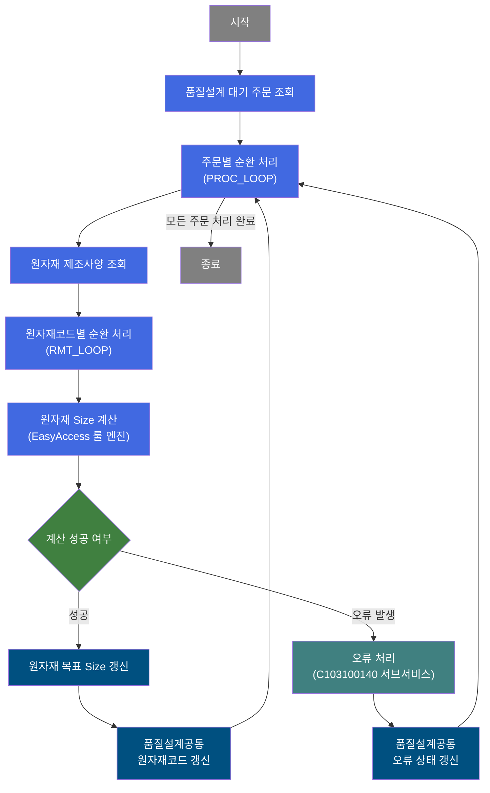
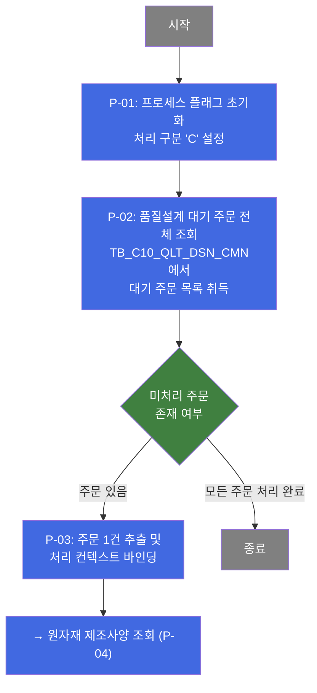
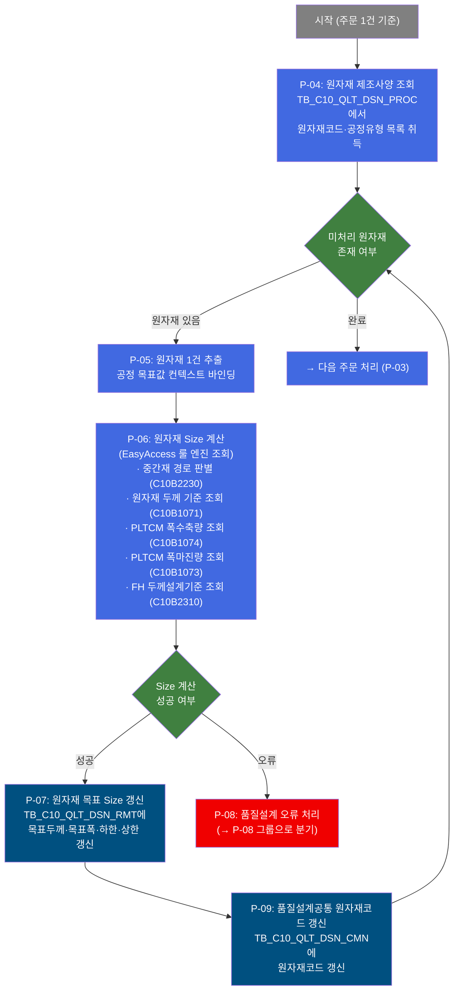
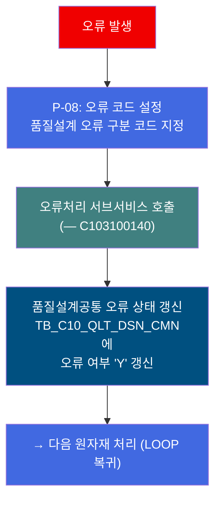
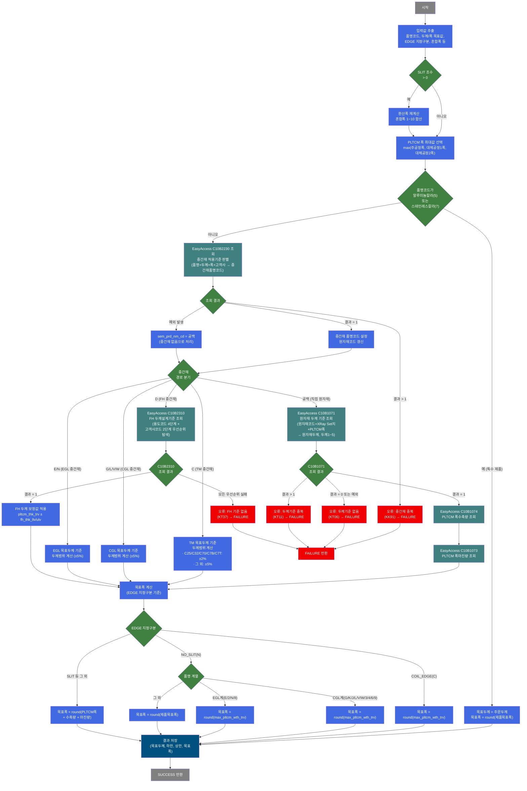

# C103100100 비즈니스 프로세스 분석서 (BPA)

## 1. 시스템 개요

| 항목 | 내용 |
|------|------|
| 서비스 ID | C103100100 |
| 업무명 | 품질설계 원자재 Size 편성 |
| 서비스 타입 | nui |
| 분석 일시 | 2026-03-21 (KST) |
| 원본 분석일 | 2026-03-16 |
| 문서 버전 | 1.0 |

---

## 2. 시스템 목적

C103100100은 품질설계 자동화 배치 프로세스의 핵심 단계로, 고객 주문에 대해 원자재 목표 두께 및 목표 폭(Size)을 자동으로 편성하는 NUI(배치) 서비스이다. 품질설계 대기 상태의 주문 목록을 대상으로, 주문별 원자재 제조사양 정보를 조회하고 품명코드·공정 경로·EDGE 지정구분에 따른 복합 계산 로직을 적용하여 원자재의 목표 치수를 결정한다.

원자재 Size 편성 결과는 직접 원자재 경로(H/C 직접 투입), TM·CGL·EGL·FH 등 중간재 공정 경로, 특수 제품(알루미늄칼라·스테인레스칼라) 경로 등 6가지 처리 경로로 분기 처리된다. 각 경로별로 EasyAccess 룰 엔진(마스터 데이터 참조 시스템)을 활용하여 원자재 목표 두께, 두께 하한/상한, 목표 폭을 계산한다.

계산 결과는 품질설계 원자재 정보 테이블에 갱신되며, 계산 중 오류가 발생하면 품질설계 공통 테이블에 오류 여부를 기록하고 오류처리 서브서비스(C103100140)를 호출하여 후속 오류 처리를 수행한다. 이 서비스는 주로 품질설계 배치 스케줄러에 의해 자동 기동된다.

---

## 3. 핵심 워크플로우

---

## 4. 상세 워크플로우

### 프로세스 흐름도 — 주문 조회 및 루프 진입 (P-01, P-02)

### 프로세스 흐름도 — 원자재 제조사양 조회 및 Size 편성 (P-03 ~ P-07)

### 프로세스 흐름도 — 오류 처리 (P-08)

---

## 5. 비즈니스 로직 상세

P-01: 초기화 — 처리 프로세스 플래그 설정

- **입력**: 배치 기동 파라미터
- **처리**:
  1. 처리 구분 플래그를 'C'(품질설계 처리)로 설정하여 이후 처리 단계에서 업무 구분을 식별할 수 있도록 초기화
- **출력**: 처리 컨텍스트에 프로세스 플래그 설정
- **예외**: 없음

P-02: 품질설계 대기 주문 전체 조회

- **입력**: 없음 (조건 없이 전체 대기 주문 조회)
- **처리**:
  1. TB_C10_QLT_DSN_CMN에서 품질설계 대기 상태(QLT_DSN_STS_CD)의 주문 목록 전체를 조회
  2. 조회 결과를 이후 PROC_LOOP 순환 처리의 기반 ResultSet으로 보관
- **출력**: 대기 주문 목록 (주문번호, 주문 Line, 품명코드, 주문 치수, 공정 채널 등 포함)
- **예외**: 대기 주문 없음 → 정상 종료

P-03: 주문 1건 추출 및 처리 컨텍스트 바인딩

- **입력**: P-02에서 조회된 대기 주문 ResultSet
- **처리**:
  1. 역방향 카운터 방식으로 현재 처리 대상 주문 Row를 순방향 인덱스로 계산하여 추출
  2. 주문번호, 주문 Line, 품명코드, 환산두께/폭, EDGE 지정구분, 혼합폭 등 주문 속성을 처리 컨텍스트에 바인딩
  3. 배치 잡 플래그 및 오류 플래그를 초기화 (매 루프 진입 시)
  4. 처리 건수 카운터를 감소시키고, 카운터가 0이 되면 루프 종료
- **출력**: 처리 컨텍스트에 현재 주문의 18개 속성값 바인딩
- **예외**: bind-result 키 없음 또는 param-count 미설정 → 처리 실패

P-04: 원자재 제조사양 조회

- **입력**: 현재 주문번호, 주문 Line (P-03에서 바인딩된 컨텍스트 값)
- **처리**:
  1. TB_C10_QLT_DSN_PROC 및 연관 공정 목표값 테이블을 조인하여 해당 주문의 원자재 코드별 제조사양(공정 유형, PLTCM/CGL/EGL/TM 목표 두께·폭, 폭수축량, 폭마진량 등)을 조회
  2. 조회 결과를 RMT_LOOP 순환 처리의 기반 ResultSet으로 보관
- **출력**: 원자재 코드·공정 유형별 제조사양 목록
- **예외**: 조회 결과 없음 → 해당 주문에 대한 원자재 처리 없이 다음 주문으로 이동

P-05: 원자재 1건 추출 및 공정 목표값 바인딩

- **입력**: P-04에서 조회된 원자재 제조사양 ResultSet
- **처리**:
  1. 역방향 카운터 방식으로 현재 처리 대상 원자재 Row를 추출
  2. 원자재 코드, 공정 유형, PLTCM/CGL/EGL/TM 목표 두께·폭, 폭수축량 관련 목표값 등 28개 속성을 처리 컨텍스트에 바인딩
  3. 오류 플래그를 초기화 (매 루프 진입 시)
  4. 처리 건수 카운터를 감소시키고, 카운터가 0이 되면 루프 종료
- **출력**: 처리 컨텍스트에 현재 원자재의 28개 속성값 바인딩
- **예외**: 없음

P-06: 원자재 Size 계산 (EasyAccess 룰 엔진)

- **입력**: 처리 컨텍스트의 주문 속성 및 공정 목표값 (P-03, P-05에서 바인딩된 값)
- **처리**:
  1. **SLIT 혼합폭 합산**: 주문 SLIT 조수 > 0이면 혼합폭 1~10 합산으로 환산폭 재계산
  2. **PLTCM 폭 최대값 선택**: 주공정폭, 대체공정1폭, 대체공정2폭 중 최대값 선택
  3. **중간재 적용기준 판별 (C10B2230)**: 알루미늄칼라·스테인레스칼라 제외 품명에 대해 EasyAccess로 중간재 품명코드 조회. 결과 > 1건이면 오류(중복) 처리
  4. **처리 경로 분기**:
     - 중간재 없음(직접 원자재 경로): C10B1071(원자재두께기준) → C10B1074(PLTCM폭수축량기준) → C10B1073(PLTCM폭마진량기준) 순차 조회
     - TM 중간재(sem=C): TM 목표 두께 기준으로 두께범위 계산 (구매CR 여부에 따라 ±2% 또는 ±5%)
     - FH 중간재(sem=D): C10B2310 조회 (주문용도 4단계 × 고객사 2단계 우선순위 탐색)
     - CGL 중간재(sem=G/L/V/W): CGL 목표 두께 ±5% 범위 계산
     - EGL 중간재(sem=E/N): EGL 목표 두께 ±5% 범위 계산
     - 특수 제품(알루미늄칼라·스테인레스칼라): 원자재 치수 = 주문 치수 직결
  5. **목표폭 계산**: EDGE 지정구분(COIL_EDGE/NO_SLIT/SLIT)에 따라 PLTCM 폭, 제품 목표폭, 또는 PLTCM폭+수축량+마진량으로 결정
- **출력**: 처리 컨텍스트에 원자재 목표두께, 목표두께 하한/상한, 목표폭, (갱신된) 원자재코드 저장
- **예외**:
  - C10B2230 결과 > 1 → 오류코드 KK91, FAILURE 반환 → P-08 오류처리 진행
  - C10B1071 결과 = 0 또는 예외 → 오류코드 KT06, FAILURE 반환
  - C10B1071 결과 > 1 → 오류코드 KT11, FAILURE 반환
  - C10B1074/C10B1073 결과 ≠ 1 → 오류, FAILURE 반환
  - C10B2310 모든 우선순위 조합 실패 → 오류코드 KT37, FAILURE 반환

P-07: 원자재 목표 Size 갱신

- **입력**: P-06에서 계산된 원자재 목표 두께, 두께 하한/상한, 목표 폭, 공정 유형, 원자재 코드
- **처리**:
  1. TB_C10_QLT_DSN_RMT에서 해당 주문·원자재 코드·공정 유형에 해당하는 레코드를 조회하여 목표 치수 갱신
  2. 공정 유형(QLT_DSN_MNF_TP)에 따라 1·2·3 구분으로 분기하여 각각 다른 UPDATE 쿼리 실행
- **출력**: TB_C10_QLT_DSN_RMT의 원자재 목표두께·목표두께 하한·상한·목표폭 갱신
- **예외**: 갱신 대상 레코드 없음 → 정상 처리 (영향 건수 0)

P-09: 품질설계공통 원자재코드 갱신

- **입력**: P-06에서 결정된 (갱신된) 원자재 코드, 주문번호, 주문 Line
- **처리**:
  1. TB_C10_QLT_DSN_CMN에서 해당 주문에 대한 원자재 코드를 갱신
  2. 중간재 경로인 경우 C10B2230 조회 결과로 갱신된 원자재 코드 반영
- **출력**: TB_C10_QLT_DSN_CMN의 원자재 코드(RMTL_CD) 갱신
- **예외**: 없음

P-08: 오류 처리 — 품질설계 오류 상태 기록

- **입력**: 오류 코드 (P-06에서 설정된 품질설계 오류 구분 코드)
- **처리**:
  1. 오류 구분 코드(TB01 = 원자재 Size 계산 오류, TB06 = 로그 오류)를 처리 컨텍스트에 설정
  2. 품질설계 오류처리 서브서비스(C103100140) 호출하여 오류 세부 정보 기록
  3. TB_C10_QLT_DSN_CMN에서 해당 주문의 품질설계 오류 여부 플래그를 'Y'로 갱신
- **출력**: TB_C10_QLT_DSN_CMN의 품질설계 오류 여부(QLT_DSN_ERR_YN) 갱신
- **예외**: 서브서비스 호출 실패 시에도 오류 상태 갱신 후 다음 원자재 처리로 계속 진행

---

## 6. 커스텀 클래스 워크플로우

### DbQualDesignLoop (약 171줄)

**역할**: 이전 액티비티(PosSearch)가 조회한 주문 또는 원자재 ResultSet을 1건씩 순회하며 처리 컨텍스트에 바인딩하는 루프 제어 액티비티. 역방향 카운터(procCount) + 순방향 인덱스(this_row = total_row - procCount) 방식으로 현재 처리 Row를 계산하며, 처리 건수가 0이 되면 `exit` 전이를 반환하여 루프를 종료한다. 이 서비스에서는 PROC_LOOP(주문 순환)와 RMT_LOOP(원자재 순환) 두 인스턴스로 사용된다.

> 200줄 미만으로 Mermaid 플로우차트 대상에서 제외.

---

### DbSearchRmtSizeData (약 809줄)

**역할**: 품질설계 자동화 프로세스에서 주문의 품명코드·공정 목표값을 기반으로 EasyAccess 룰 엔진을 호출하여 원자재 목표 두께 및 목표 폭을 계산하는 핵심 클래스. 직접 원자재·TM·FH·CGL·EGL·특수 제품 6가지 경로로 분기하여 각 경로별 계산 규칙을 적용한다.

---

## 7. 주요 유즈케이스

UC-01: 품질설계 배치 실행 — 원자재 Size 자동 편성

- **Actor**: 배치 스케줄러 (자동 기동)
- **목적**: 품질설계 대기 상태의 주문에 대해 원자재 목표 두께·폭을 자동 계산하고 갱신
- **주요 흐름**:
  1. 품질설계 대기 주문 전체를 조회
  2. 주문 1건씩 순환하며 원자재 제조사양을 조회
  3. 원자재 코드별로 EasyAccess 룰 엔진을 호출하여 목표 치수 계산
  4. 계산 결과를 품질설계 원자재 정보 테이블에 갱신
  5. 모든 주문 처리 완료 후 종료
- **예외**: 특정 주문·원자재에서 EasyAccess 조회 오류 발생 시 해당 건만 오류 처리 후 다음 건으로 계속 진행

UC-02: 중간재 경로 원자재 Size 편성

- **Actor**: 배치 스케줄러 (자동 기동)
- **목적**: TM·CGL·EGL·FH 등 중간재 공정을 경유하는 주문에 대해 중간재 경로별 계산 규칙을 적용하여 원자재 Size 편성
- **주요 흐름**:
  1. EasyAccess C10B2230으로 중간재 적용기준 조회하여 중간재 품명코드 결정
  2. 중간재 종류(TM/FH/CGL/EGL)에 따라 분기 처리
  3. 각 경로별 목표 두께 기준으로 두께 하한·상한 계산
  4. 원자재 코드 갱신 및 목표 Size 갱신
- **예외**: C10B2230 조회 결과가 2건 이상이면 중복 오류로 처리 후 오류 상태 기록

UC-03: 원자재 Size 계산 오류 처리

- **Actor**: 배치 스케줄러 (오류 발생 시)
- **목적**: EasyAccess 조회 실패 또는 기준 데이터 없음으로 Size 계산 불가 시 오류 상태를 기록하고 처리 지속
- **주요 흐름**:
  1. Size 계산 실패 시 오류 구분 코드 설정
  2. 오류처리 서브서비스(C103100140) 호출로 오류 세부 정보 기록
  3. 품질설계공통 테이블에 오류 여부 플래그 'Y' 갱신
  4. 해당 건의 처리를 종료하고 다음 원자재 처리로 계속 진행
- **예외**: 오류 처리 중 추가 오류 발생 시에도 처리 흐름은 계속 진행 (장애 전파 방지)

---

## 9. 관련 엔티티

### 엔티티 목록

| 엔티티(테이블) | 설명 | 사용 유형 |
|---------------|------|----------|
| TB_C10_QLT_DSN_CMN | 품질설계 공통 정보 — 주문별 품질설계 상태, 주문 속성, 오류 여부 등 핵심 정보 | 조회/갱신 |
| TB_C10_QLT_DSN_RMT | 품질설계 원자재 Size 정보 — 원자재 코드별 목표 두께·폭 및 하한·상한 | 갱신 |
| TB_C10_QLT_DSN_PROC | 품질설계 공정 제조사양 정보 — 원자재 코드별 공정 유형 및 PLTCM/CGL/EGL/TM 목표값 | 조회 |

### 엔티티 간 관계

- TB_C10_QLT_DSN_CMN은 주문(ORD_NO, ORD_LN)을 기준으로 품질설계 처리의 중심 엔티티이며, 처리 상태와 오류 여부를 관리한다.
- TB_C10_QLT_DSN_PROC는 TB_C10_QLT_DSN_CMN의 주문 기준으로 원자재 코드별 공정 제조사양을 보유하며, 이 서비스에서 원자재 Size 계산의 입력 데이터 역할을 한다.
- TB_C10_QLT_DSN_RMT는 TB_C10_QLT_DSN_CMN의 주문 기준으로 원자재 코드별 목표 치수 계산 결과를 저장하며, 이 서비스의 최종 출력 대상이다.

---

## 10. 서브서비스

| 서비스 ID | 설명 | 호출 시점 | 트랜잭션 | BPA 문서 |
|-----------|------|---------|---------|---------|
| C103100140 | 품질설계 오류 처리 — 오류 코드 기록 및 오류 상태 관리 | P-08 오류 처리 단계 (EasyAccess 조회 오류 또는 기준 데이터 없음 발생 시) | 공유 (new-transaction: false) | 미작성 |

---

## 11. 특이사항 및 주의사항

### 1. EasyAccess 룰 엔진 다중 호출에 의한 복잡한 계산 로직
원자재 Size 편성은 단순 DB 조회가 아니라 EasyAccess 룰 엔진(C10B2230, C10B1071, C10B1073, C10B1074, C10B2310)을 최대 4회 이상 순차 호출하는 복합 로직이다. 각 조회 결과의 건수(0건·1건·2건 이상)에 따라 처리 경로가 달라지며, 어느 한 단계에서 오류가 발생해도 해당 주문·원자재 건의 처리가 즉시 중단되고 오류 처리 단계로 분기된다. 비즈니스 기준 데이터(마스터 데이터)의 정합성이 서비스 정상 동작의 전제 조건이다.

### 2. 중간재 경로에 따른 6가지 원자재 Size 계산 분기
품명코드와 중간재 적용기준 조회 결과에 따라 ① 직접 원자재, ② TM 중간재(C), ③ FH 중간재(D), ④ CGL 중간재(G/L/V/W), ⑤ EGL 중간재(E/N), ⑥ 특수 제품(알루미늄칼라/스테인레스칼라) 등 6가지 처리 경로로 분기된다. 각 경로의 두께·폭 계산 공식이 상이하며, 특히 FH 경로는 주문용도코드 4단계 × 고객사코드 2단계의 우선순위 조합(최대 8회 탐색)으로 설계기준을 찾는 복잡한 로직이다.

### 3. 오류 발생 시 배치 지속 처리 전략 (건별 오류 허용)
개별 주문·원자재 건의 Size 계산 오류가 전체 배치 실행을 중단시키지 않는다. 오류 발생 시 해당 건에 대해 품질설계 오류 여부 플래그를 'Y'로 갱신하고 오류처리 서브서비스를 호출한 뒤, 루프를 계속 진행하여 나머지 주문·원자재를 처리한다. 이로 인해 일부 주문은 오류 상태로 남고 후속 수동 처리가 필요할 수 있다.

### 4. DbQualDesignLoop의 O(n²) 탐색 성능 특성
루프 제어 액티비티(DbQualDesignLoop)는 매 루프마다 ResultSet을 처음부터 전체 재탐색(reset + while 순회)하는 방식으로 동작한다. 처리 건수가 n이면 최대 n(n+1)/2회 탐색이 발생한다(100건 처리 시 최대 5,050회). 대량 주문 처리 시 성능 저하가 발생할 수 있으며, 배치 기동 시간대 주문 규모 모니터링이 필요하다.

### 5. 공정 유형(QLT_DSN_MNF_TP)에 따른 원자재 갱신 쿼리 분기
원자재 목표 Size 갱신(P-07) 단계에서 공정 제조 유형(1, 2, 3)에 따라 TB_C10_QLT_DSN_RMT를 대상으로 서로 다른 UPDATE 쿼리(CMNupdate, CMNupdate1, CMNupdate2)가 실행된다. 이는 동일 주문이라도 원자재 코드별로 서로 다른 공정 유형을 가질 수 있기 때문이며, 각 유형에 대응하는 갱신 대상 컬럼이 다르다.
